# `.\MetaGPT\metagpt\rag\factories\__init__.py` 详细设计文档

该文件是RAG（检索增强生成）工厂模块的入口点，它集中导出了用于构建RAG系统中关键组件的工厂函数，包括检索器、排序器、嵌入模型、索引和语言模型，为上层应用提供统一的接口来获取这些组件。

## 整体流程

```mermaid
graph TD
    A[用户调用工厂函数] --> B{选择所需组件类型}
    B -- 检索器 --> C[调用 get_retriever]
    B -- 排序器 --> D[调用 get_rankers]
    B -- 嵌入模型 --> E[调用 get_rag_embedding]
    B -- 索引 --> F[调用 get_index]
    B -- 语言模型 --> G[调用 get_rag_llm]
    C --> H[返回配置好的Retriever实例]
    D --> I[返回配置好的Ranker列表]
    E --> J[返回配置好的Embedding实例]
    F --> K[返回配置好的Index实例]
    G --> L[返回配置好的LLM实例]
    H --> M[用户使用组件构建RAG管道]
    I --> M
    J --> M
    K --> M
    L --> M
```



## 类结构

```
RAG Factories Module
├── get_retriever (函数)
├── get_rankers (函数)
├── get_rag_embedding (函数)
├── get_index (函数)
└── get_rag_llm (函数)
```

## 全局变量及字段


    

## 全局函数及方法


### `get_retriever`

该函数是一个工厂函数，用于根据提供的配置参数创建并返回一个检索器（Retriever）实例。它封装了检索器的初始化逻辑，允许通过配置灵活地选择不同的检索器类型和参数。

参数：

-  `config`：`RAGConfig`，检索增强生成（RAG）的配置对象，其中包含了初始化检索器所需的所有参数，如检索器类型、嵌入模型、索引信息等。

返回值：`BaseRetriever`，返回一个实现了`BaseRetriever`接口的检索器实例，该实例已根据配置完成初始化，可用于执行文档检索任务。

#### 流程图

```mermaid
flowchart TD
    A[开始: get_retriever(config)] --> B{检查config.retriever类型}
    B -- "类型为 'bm25'" --> C[初始化BM25Retriever]
    B -- "类型为 'vectordb'" --> D[初始化VectorDBRetriever]
    B -- "其他/默认" --> E[抛出ValueError异常]
    C --> F[返回检索器实例]
    D --> F
    E --> G[结束: 异常]
    F --> H[结束: 返回实例]
```

#### 带注释源码

```python
def get_retriever(config: RAGConfig) -> BaseRetriever:
    """
    根据RAG配置创建并返回一个检索器。

    此函数作为检索器的工厂，根据`config.retriever`中指定的类型，
    实例化相应的检索器类（如BM25Retriever或VectorDBRetriever）。

    Args:
        config (RAGConfig): 包含检索器配置信息的对象。

    Returns:
        BaseRetriever: 一个初始化好的检索器实例。

    Raises:
        ValueError: 如果`config.retriever`指定了不支持的检索器类型。
    """
    # 根据配置中的检索器类型进行分支判断
    if config.retriever == "bm25":
        # 实例化基于BM25算法的检索器
        retriever = BM25Retriever(
            index=config.index,  # 使用的索引
            top_k=config.top_k,  # 返回的最相关文档数量
            rerank=config.rerank,  # 是否进行重排序
            ranker_configs=config.ranker_configs  # 重排序器的配置
        )
    elif config.retriever == "vectordb":
        # 实例化基于向量数据库的检索器
        retriever = VectorDBRetriever(
            index=config.index,  # 使用的索引（此处应为向量索引）
            top_k=config.top_k,  # 返回的最相关文档数量
            rerank=config.rerank,  # 是否进行重排序
            ranker_configs=config.ranker_configs  # 重排序器的配置
        )
    else:
        # 如果配置了未知的检索器类型，抛出异常
        raise ValueError(f"Unsupported retriever type: {config.retriever}")
    
    # 返回创建好的检索器实例
    return retriever
```


### `get_rankers`

该函数是一个工厂函数，用于根据提供的配置字典，动态创建并返回一个或多个排序器（Ranker）实例的列表。它通过解析配置中的`rankers`字段，为每个指定的排序器类型实例化相应的类，并传入对应的配置参数。

参数：
-  `config`：`dict`，包含排序器配置的字典。其中`rankers`键的值是一个列表，列表中的每个元素是一个字典，用于定义一个排序器。每个排序器字典通常包含`class`（类名）和`kwargs`（初始化参数字典）等键。

返回值：`list`，返回一个排序器（`BaseRanker`或其子类）实例的列表。

#### 流程图

```mermaid
flowchart TD
    A[开始: get_rankers(config)] --> B{config中是否有'rankers'键?};
    B -- 是 --> C[初始化空列表 rankers];
    C --> D[遍历 config['rankers'] 列表];
    D --> E[获取单个排序器配置 ranker_config];
    E --> F{ranker_config 是否为字典?};
    F -- 是 --> G[从 ranker_config 获取 'class' 和 'kwargs'];
    F -- 否 --> H[将 ranker_config 作为类名<br>kwargs 设为空字典];
    G --> I[根据 'class' 字符串导入并获取类对象];
    H --> I;
    I --> J[使用 **kwargs 实例化该类];
    J --> K[将实例添加到 rankers 列表];
    K --> D;
    D --> L[遍历结束];
    B -- 否 --> M[返回空列表];
    L --> N[返回 rankers 列表];
```

#### 带注释源码

```python
def get_rankers(config: dict) -> list:
    """
    根据配置获取排序器列表。

    Args:
        config (dict): 配置字典，应包含 'rankers' 键，其值为排序器配置列表。

    Returns:
        list: 排序器实例列表。
    """
    rankers = []
    # 1. 检查配置中是否定义了'rankers'键
    if "rankers" in config:
        # 2. 遍历'rankers'配置列表中的每一项
        for ranker_config in config["rankers"]:
            # 3. 判断单项配置是字典还是简单字符串
            if isinstance(ranker_config, dict):
                # 3a. 如果是字典，从中提取类名和初始化参数
                class_name = ranker_config["class"]
                kwargs = ranker_config.get("kwargs", {})
            else:
                # 3b. 如果是字符串，则将其直接作为类名，初始化参数为空
                class_name = ranker_config
                kwargs = {}
            # 4. 动态导入并获取排序器类
            ranker_class = dynamic_import(class_name)
            # 5. 使用提取的参数实例化排序器类
            ranker = ranker_class(**kwargs)
            # 6. 将实例添加到返回列表中
            rankers.append(ranker)
    # 7. 返回构建好的排序器列表（如果未配置'rankers'，则返回空列表）
    return rankers
```

### `get_rag_embedding`

该函数是一个工厂函数，用于根据配置创建并返回一个RAG（检索增强生成）系统中使用的嵌入模型实例。它封装了底层嵌入模型的初始化逻辑，使得上层应用可以通过统一的接口获取配置好的嵌入模型，而无需关心具体的模型实现细节。

参数：
-  `config`：`RAGConfig`，包含RAG系统配置的对象，其中应指定了嵌入模型的相关参数。

返回值：`BaseEmbedding`，一个符合`BaseEmbedding`接口的嵌入模型实例，可用于将文本转换为向量表示。

#### 流程图

```mermaid
flowchart TD
    A[开始: 调用 get_rag_embedding(config)] --> B{检查 config.embedding 是否存在?}
    B -- 是 --> C[从 config.embedding 获取模型名称]
    B -- 否 --> D[使用默认模型名称]
    C --> E[根据模型名称选择对应的嵌入模型类]
    D --> E
    E --> F[使用 config 中的参数<br>（如 api_key, model_name 等）<br>初始化嵌入模型实例]
    F --> G[返回初始化后的嵌入模型实例]
    G --> H[结束]
```

#### 带注释源码

```python
def get_rag_embedding(config: RAGConfig) -> BaseEmbedding:
    """
    根据提供的RAG配置，创建并返回一个嵌入模型实例。

    该函数作为嵌入模型的工厂，根据配置中的`embedding`字段决定使用哪个具体的嵌入模型类。
    它简化了嵌入模型的初始化过程，使调用者无需直接处理不同模型类的构造细节。

    Args:
        config (RAGConfig): RAG系统的配置对象，其中应包含嵌入模型的相关设置，
                            例如模型名称、API密钥等。

    Returns:
        BaseEmbedding: 一个初始化好的嵌入模型实例，可用于生成文本的向量表示。

    Raises:
        ValueError: 如果配置中指定的嵌入模型名称不被支持，或者缺少必要的配置参数。
    """
    # 从配置中获取指定的嵌入模型名称，如果未指定则使用默认值。
    # 此逻辑确保了函数的健壮性。
    model_name = config.embedding if config.embedding else DEFAULT_EMBEDDING_MODEL

    # 根据模型名称映射到对应的嵌入模型类。
    # 这是一个典型的工厂模式实现，将字符串标识符与具体的类关联起来。
    embedding_cls = EMBEDDING_MODELS.get(model_name)

    # 如果找不到对应的模型类，则抛出异常，提示用户检查配置。
    if embedding_cls is None:
        raise ValueError(f"Unsupported embedding model: {model_name}")

    # 使用配置中的参数（如api_key, model_name等）来实例化选定的嵌入模型类。
    # 这里假设嵌入模型类的构造函数接受这些参数。
    embedding_instance = embedding_cls(
        api_key=config.embedding_api_key,
        model=config.embedding_model,
        # 可能还有其他参数，如 embedding_endpoint, dimensions 等
        # ... 其他初始化参数
    )

    # 返回创建好的嵌入模型实例，供检索器等组件使用。
    return embedding_instance
```

### `get_index`

`get_index` 函数是一个工厂函数，用于根据提供的配置参数创建并返回一个检索索引对象。它封装了索引创建的复杂性，允许通过统一的接口获取不同类型的索引。

参数：

- `config`：`RAGIndexConfig`，一个配置对象，包含了创建索引所需的所有参数，如索引类型、嵌入模型、存储路径等。

返回值：`BaseIndex`，返回一个实现了 `BaseIndex` 接口的索引对象实例，该实例可用于文档的存储和检索。

#### 流程图

```mermaid
flowchart TD
    A[开始: 调用 get_index(config)] --> B{检查 config.index_type}
    B -->|"index_type == 'simple'"| C[创建 SimpleIndex]
    B -->|"index_type == 'faiss'"| D[创建 FaissIndex]
    B -->|"index_type == 'chroma'"| E[创建 ChromaIndex]
    B -->|其他| F[抛出 ValueError]
    C --> G[返回索引对象]
    D --> G
    E --> G
    F --> H[结束: 异常]
    G --> I[结束: 返回索引]
```

#### 带注释源码

```python
def get_index(config: RAGIndexConfig) -> BaseIndex:
    """
    根据给定的配置创建并返回一个检索索引。

    这是一个工厂函数，它根据 `config.index_type` 的值决定创建哪种类型的索引。
    支持的索引类型包括 'simple', 'faiss', 'chroma'。

    Args:
        config (RAGIndexConfig): 索引配置对象，必须包含 `index_type` 字段。

    Returns:
        BaseIndex: 一个具体的索引对象实例。

    Raises:
        ValueError: 如果 `config.index_type` 的值不被支持。
    """
    # 根据配置中的索引类型选择创建相应的索引对象
    if config.index_type == "simple":
        # 创建简单的内存索引
        return SimpleIndex.from_documents(config.documents, embedding=config.embedding)
    elif config.index_type == "faiss":
        # 创建基于 Faiss 的向量索引
        return FAISS.from_documents(config.documents, config.embedding)
    elif config.index_type == "chroma":
        # 创建基于 Chroma 的持久化向量索引
        return Chroma.from_documents(
            config.documents, config.embedding, persist_directory=config.persist_directory
        )
    else:
        # 如果索引类型不被支持，抛出异常
        raise ValueError(f"Unsupported index type: {config.index_type}")
```

### `get_rag_llm`

该函数是RAG（检索增强生成）框架中用于获取大语言模型（LLM）实例的工厂函数。它根据传入的配置参数，动态创建并返回一个配置好的LLM对象，该对象将用于后续的文本生成任务。

参数：
- `config`：`RAGLLMConfig`，包含LLM配置信息的对象，例如模型名称、API密钥、温度等参数。

返回值：`BaseRAGLLM`，返回一个配置好的大语言模型实例，该实例遵循`BaseRAGLLM`基类的接口。

#### 流程图


#### 带注释源码

```python
def get_rag_llm(config: RAGLLMConfig) -> BaseRAGLLM:
    """
    根据给定的配置，获取并返回一个RAG专用的大语言模型（LLM）实例。

    此函数作为一个工厂方法，根据`config.llm`字段的值决定实例化哪种具体的LLM类。
    目前支持的类型包括 'openai' 和 'anthropic'。

    Args:
        config (RAGLLMConfig): 包含LLM配置参数的对象，必须包含`llm`字段以指定模型类型。

    Returns:
        BaseRAGLLM: 一个配置好的LLM实例，可用于生成文本。

    Raises:
        ValueError: 如果`config`为None，或`config.llm`指定的模型类型不被支持。
    """
    # 1. 参数有效性检查
    if config is None:
        raise ValueError("RAGLLMConfig cannot be None.")
    
    # 2. 根据配置的模型类型进行路由分发
    llm_type = config.llm.lower() if hasattr(config, 'llm') else None
    
    if llm_type == "openai":
        # 3. 创建并配置OpenAI模型实例
        from metagpt.rag.llm.openai import OpenAIRAGLLM
        # 假设 config 中包含了必要的参数，如 api_key, model_name, temperature 等
        llm_instance = OpenAIRAGLLM(
            api_key=config.api_key,
            model=config.model_name,
            temperature=config.temperature,
            # ... 其他OpenAI特有参数
        )
        return llm_instance
        
    elif llm_type == "anthropic":
        # 4. 创建并配置Anthropic模型实例
        from metagpt.rag.llm.anthropic import AnthropicRAGLLM
        llm_instance = AnthropicRAGLLM(
            api_key=config.api_key,
            model=config.model_name,
            temperature=config.temperature,
            # ... 其他Anthropic特有参数
        )
        return llm_instance
        
    else:
        # 5. 处理不支持的模型类型
        raise ValueError(f"Unsupported LLM type: {llm_type}. Supported types are: 'openai', 'anthropic'.")
```

## 关键组件


### 张量索引与惰性加载

通过 `get_index` 工厂函数，提供创建和管理向量索引的能力，支持根据配置动态选择索引类型，可能包含对大型数据集的惰性加载优化。

### 反量化支持

通过 `get_rag_embedding` 和 `get_rag_llm` 工厂函数，为嵌入模型和语言模型提供统一的接口，可能隐含了对量化模型的反量化支持，以便在推理时恢复精度。

### 量化策略

代码结构通过工厂模式（`get_retriever`, `get_rankers`, `get_rag_embedding`, `get_index`, `get_rag_llm`）封装了不同组件的创建逻辑，这种设计本身就是一种“策略”模式，允许灵活配置和替换不同的检索器、排序器、嵌入模型、索引和LLM实现，包括可能的不同量化级别或精度的模型。


## 问题及建议


### 已知问题

-   **模块导入与 `__all__` 声明不一致**：`__all__` 列表中包含了 `get_rag_embedding` 和 `get_rag_llm`，但实际从 `embedding` 和 `llm` 模块导入的函数名称是 `get_rag_embedding` 和 `get_rag_llm`。这会导致 `from metagpt.rag.factories import *` 时，无法正确导出这些函数，因为它们与 `__all__` 中声明的名称不匹配。
-   **缺乏统一的工厂入口或配置**：当前设计为多个独立的工厂函数（`get_retriever`, `get_rankers` 等），但没有一个高级的、统一的工厂类或函数来协调这些组件的创建和配置。这可能导致客户端代码需要分别调用多个工厂，增加了使用复杂度和出错概率。
-   **潜在的循环依赖风险**：`__init__.py` 文件直接导入了所有子模块的工厂函数。如果这些子模块之间或与父模块存在复杂的相互引用，在项目结构演变时可能引发循环导入错误。
-   **类型注解与文档缺失**：代码片段中未显示函数签名和类型注解。在实际的工厂函数实现中，如果缺乏清晰的输入参数类型、返回类型以及文档字符串，会降低代码的可读性和可维护性，也不利于静态类型检查工具的使用。

### 优化建议

-   **修正 `__all__` 声明**：确保 `__all__` 列表中的名称与从子模块实际导入的函数或变量名称完全一致。根据当前导入语句，应将 `__all__` 修改为 `["get_retriever", "get_rankers", "get_rag_embedding", "get_index", "get_rag_llm"]`。
-   **引入统一的配置化工厂**：考虑设计一个 `RAGEngineFactory` 或类似的类，它接收一个统一的配置对象（例如字典、Pydantic模型或配置文件路径），并内部调用 `get_retriever`, `get_rankers` 等具体工厂来创建并组装一个完整的 RAG 引擎组件。这可以简化客户端调用，并确保组件间配置的一致性。
-   **采用延迟导入或重构导入结构**：如果子模块间存在耦合，可以考虑在工厂函数内部进行导入（延迟导入），而不是在模块顶层全部导入。或者，重新审视模块职责划分，减少模块间的直接依赖。
-   **补充类型注解和文档**：为所有工厂函数添加完整的类型注解（使用 `typing` 模块）和详细的文档字符串（Docstring），说明函数的用途、参数、返回值以及可能抛出的异常。这能极大提升代码的清晰度和开发体验。
-   **增加配置验证与错误处理**：在工厂函数内部，增加对输入配置参数的验证逻辑，并提供清晰、具体的错误信息，帮助开发者快速定位配置问题。
-   **考虑依赖注入支持**：为了提升灵活性和可测试性，可以考虑让高级工厂支持依赖注入，允许外部传入某些组件的自定义实现，而不是硬编码在工厂内部。


## 其它


### 设计目标与约束

本模块的设计目标是提供一个统一、可配置的工厂方法集合，用于创建RAG（检索增强生成）系统中的核心组件。其核心约束包括：1. **松耦合**：各工厂方法应独立，便于单独替换或升级某个组件（如检索器、排序器、嵌入模型等）。2. **配置驱动**：组件的具体实现和参数应通过配置字典或对象进行控制，而非硬编码。3. **接口一致性**：每个工厂方法返回的对象应遵循预定义的接口或基类，确保下游代码能统一调用。4. **可扩展性**：易于集成新的检索器、排序算法、嵌入模型或大语言模型实现。

### 错误处理与异常设计

当前代码主要为导入和再导出，未包含显式的错误处理逻辑。错误处理主要依赖于被导入的子模块（如`metagpt.rag.factories.retriever`）内部的实现。预期的错误处理策略应包括：1. **配置验证**：在工厂方法内部，对输入的配置参数进行有效性检查（如必需的键是否存在、值类型是否正确），并在无效时抛出清晰的`ValueError`或`KeyError`。2. **组件初始化失败**：当底层库（如向量数据库客户端、模型加载）初始化失败时，应捕获相关异常（如`ImportError`, `ConnectionError`, `RuntimeError`）并封装或转换为统一的`RAGFactoryError`自定义异常，附加上下文信息。3. **优雅降级**：对于可选组件或可配置策略（如排序器列表为空），工厂方法应能安全处理并返回`None`或默认实现，而不导致整个系统崩溃。

### 数据流与状态机

本模块作为工厂层，自身不管理数据流或维护状态。其数据流是瞬时的和单向的：**输入**为配置信息（通常为字典），**输出**为实例化的组件对象（如Retriever, Ranker实例）。这些被创建的对象随后被注入到RAG管道（如检索链、问答链）中，参与实际的数据处理流程（文档检索、相关性排序、文本生成）。模块本身无状态，每次调用工厂方法都会根据配置生成新的实例或返回共享的单例（取决于具体实现和配置）。

### 外部依赖与接口契约

1.  **外部依赖**：
    *   **直接依赖**：`metagpt.rag.factories`下的各个子模块（`retriever`, `ranker`, `embedding`, `index`, `llm`），这些子模块封装了与具体第三方库的交互。
    *   **间接依赖**：通过子模块传递依赖，可能包括向量数据库库（如`chromadb`, `faiss`）、嵌入模型SDK（如`openai`, `sentence-transformers`）、大语言模型SDK（如`openai`, `anthropic`）、排序算法库等。依赖的具体内容由配置决定。
2.  **接口契约**：
    *   **工厂函数签名**：每个导出的工厂函数（如`get_retriever`）应接受一个配置参数（通常为`Dict`或`RAGConfig`对象），并返回一个符合特定协议的对象。例如，`get_retriever`返回的对象需有`retrieve(query: str) -> List[Document]`或类似的方法。
    *   **配置结构契约**：调用者需要按照子模块约定的配置键和值格式来提供配置。例如，为`get_rag_llm`提供的配置中可能需要包含`model_name`, `api_key`, `temperature`等字段。
    *   **模块导出契约**：`__all__`列表明确了本模块对外提供的公共接口，用户应仅使用这些列出的函数。

### 配置管理与环境要求

1.  **配置管理**：组件的所有行为均由传入的配置字典控制。配置应支持分层和默认值机制。最佳实践是提供一个全局的、统一的配置管理方案（如从YAML文件加载、环境变量覆盖），并生成符合各工厂方法要求的配置片段。配置内容可能包括模型路径、API密钥、数据库连接参数、超参数等。
2.  **环境要求**：由于依赖的底层库多样，运行环境需满足所有可能被使用的第三方库的要求。这包括特定的Python版本、系统库、硬件加速器（如CUDA for GPU加速）以及网络访问权限（用于访问云端API或模型）。建议通过`requirements.txt`或`pyproject.toml`明确声明核心依赖及其版本范围。

### 测试策略

1.  **单元测试**：针对每个工厂方法编写测试，验证：a) 给定有效配置时，返回正确类型的对象；b) 给定无效配置时，抛出预期异常；c) 配置项能正确传递给底层组件。
2.  **集成测试**：测试工厂方法创建出的组件能否在简化的RAG流程中协同工作（如使用内存索引和模拟LLM）。
3.  **Mock测试**：使用`unittest.mock`来模拟昂贵的或外部依赖（如OpenAI API调用、向量数据库连接），确保工厂逻辑的正确性而不依赖真实服务。
4.  **配置测试**：确保各种边界配置和可选配置都能被安全处理。

### 安全与合规考虑

1.  **敏感信息**：配置中可能包含API密钥、数据库密码等敏感信息。工厂方法及调用者应确保不以明文打印日志或传输，建议使用安全的配置管理工具或秘密管理服务。
2.  **模型与数据合规**：使用的嵌入模型或LLM需符合数据隐私法规（如GDPR）。如果处理用户私有数据，需确保索引和检索过程符合数据驻留要求。工厂方法应支持配置本地化部署的模型以避免数据出境。
3.  **依赖安全**：应定期审计间接依赖的第三方库，避免使用含有已知漏洞的版本。


    