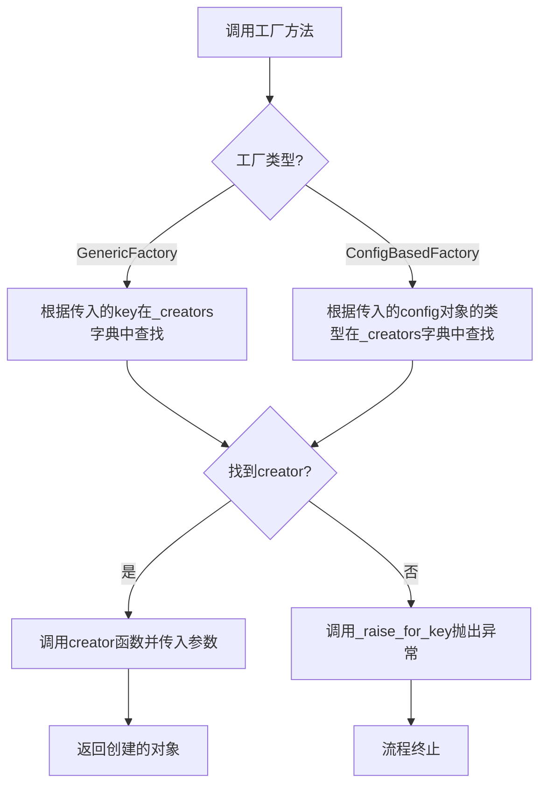
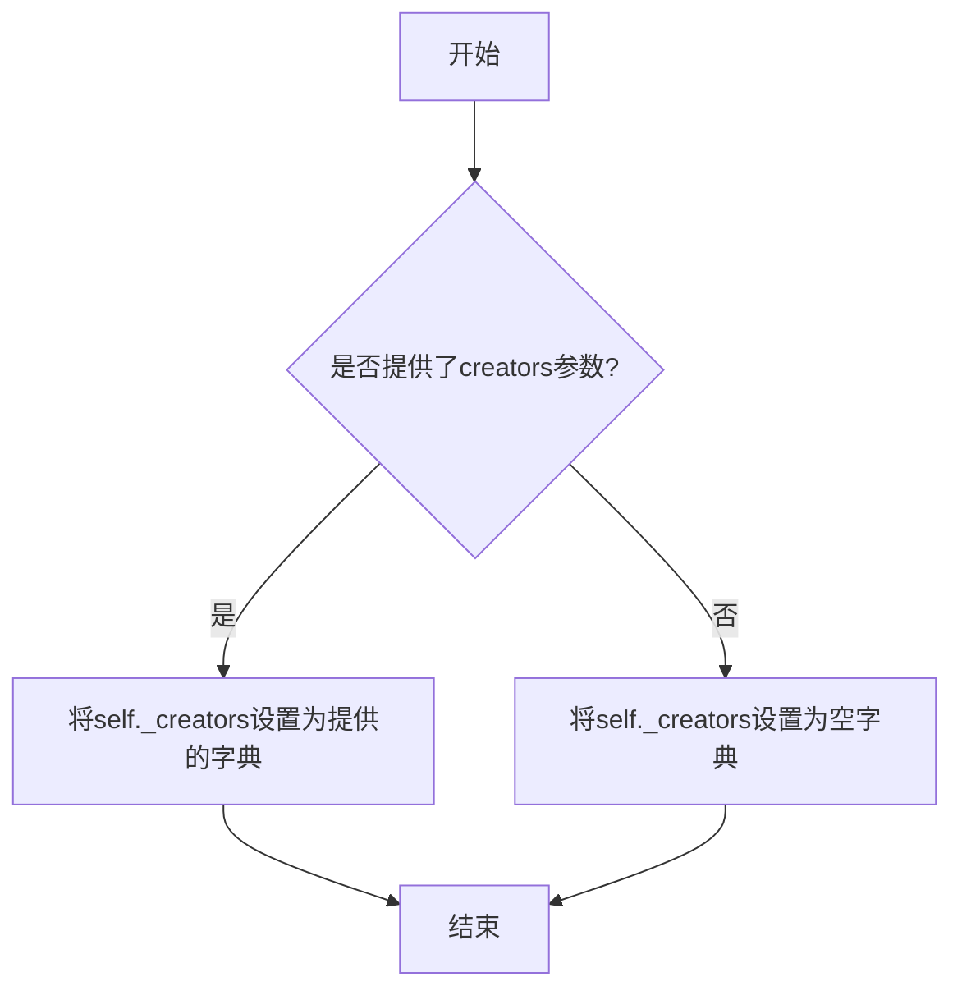
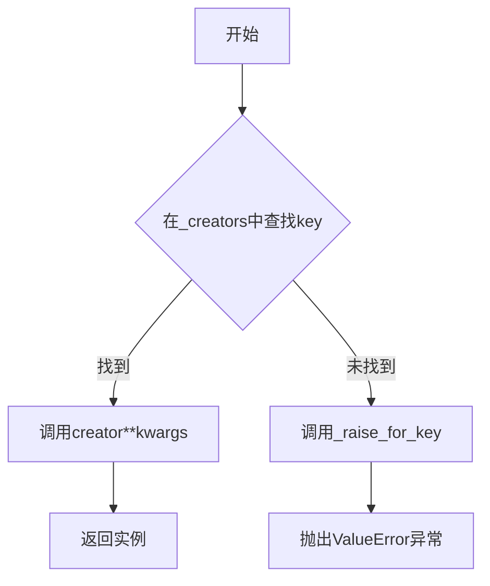
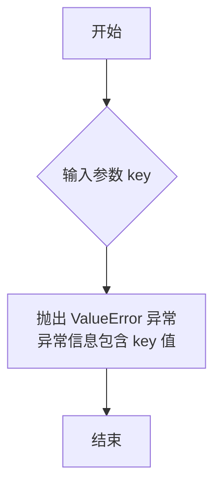
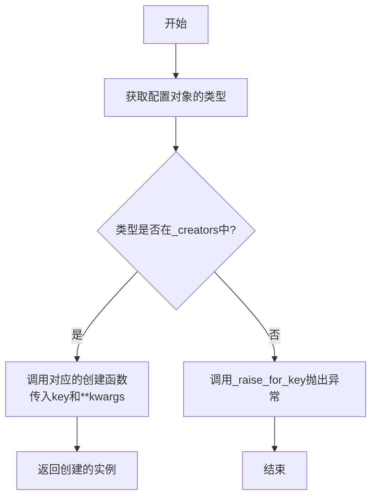
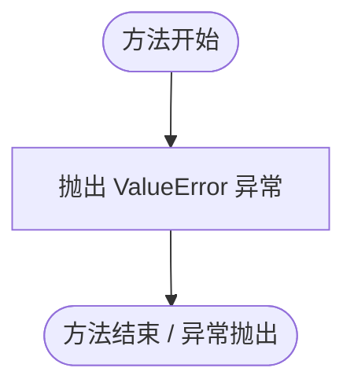

# `.\MetaGPT\metagpt\rag\factories\base.py` 详细设计文档

该代码实现了一个通用的工厂模式框架，包含一个基础工厂类 `GenericFactory` 和一个基于配置的工厂类 `ConfigBasedFactory`。`GenericFactory` 通过一个注册表（字典）将任意键映射到对应的创建函数，用于按需创建对象。`ConfigBasedFactory` 继承自 `GenericFactory`，但重写了查找逻辑，改为根据传入配置对象的类型（而非对象本身）来查找对应的创建函数，并提供了一个辅助方法，用于智能地从配置对象或关键字参数中获取值。

## 整体流程



## 类结构

```
GenericFactory (通用工厂基类)
└── ConfigBasedFactory (基于配置的工厂类)
```

## 全局变量及字段


### `GenericFactory._creators`
    
一个字典，用于存储标识符（键）与对应的对象创建函数（值）之间的映射关系。

类型：`dict[Any, Callable]`
    
    

## 全局函数及方法

### `GenericFactory.__init__`

该方法用于初始化一个通用工厂对象。它接收一个可选的创建者字典，该字典将标识符映射到对应的对象创建函数。如果未提供字典，则初始化为一个空字典。

参数：

- `creators`：`dict[Any, Callable]`，一个可选的字典，其中键是任意类型的标识符，值是对应的创建者函数（用于创建对象）。如果未提供，则默认为空字典。

返回值：`None`，此方法不返回任何值。

#### 流程图



#### 带注释源码

```python
def __init__(self, creators: dict[Any, Callable] = None):
    """Creators is a dictionary.

    Keys are identifiers, and the values are the associated creator function, which create objects.
    """
    # 如果提供了creators参数，则使用它；否则，初始化为一个空字典。
    self._creators = creators or {}
```

### `GenericFactory.get_instances`

该方法接收一个键（`key`）的列表，并返回一个由这些键对应的创建器（`creator`）所生成的实例对象的列表。它通过遍历列表并调用 `get_instance` 方法来实现批量创建。

参数：

- `keys`：`list[Any]`，一个包含任意类型键的列表，用于指定需要创建的实例。
- `**kwargs`：`Any`，可变关键字参数，将传递给每个创建器函数。

返回值：`list[Any]`，一个包含由对应创建器生成的实例对象的列表。

#### 流程图

```mermaid
flowchart TD
    A[开始] --> B{遍历 keys 列表}
    B --> C[取出当前 key]
    C --> D[调用 get_instance(key, **kwargs)]
    D --> E[将生成的实例添加到结果列表]
    E --> B
    B --> F{遍历完成？}
    F -- 否 --> C
    F -- 是 --> G[返回结果列表]
    G --> H[结束]
```

#### 带注释源码

```python
def get_instances(self, keys: list[Any], **kwargs) -> list[Any]:
    """Get instances by keys."""
    # 使用列表推导式，遍历传入的 keys 列表
    # 对列表中的每一个 key，调用自身的 get_instance 方法
    # 并将 **kwargs 参数透传给 get_instance 方法
    # 最终返回一个由所有创建好的实例组成的列表
    return [self.get_instance(key, **kwargs) for key in keys]
```

### `GenericFactory.get_instance`

该方法根据给定的键（key）从工厂中获取对应的实例。它首先在注册的创建者字典中查找键对应的创建函数，如果找到则调用该函数并传入可选的关键字参数来创建实例；如果未找到，则抛出 `ValueError` 异常。

参数：

- `key`：`Any`，用于查找创建函数的键
- `**kwargs`：`Any`，传递给创建函数的关键字参数

返回值：`Any`，由创建函数返回的实例

#### 流程图



#### 带注释源码

```python
def get_instance(self, key: Any, **kwargs) -> Any:
    """Get instance by key.

    Raise Exception if key not found.
    """
    # 1. 根据键在内部字典 `_creators` 中查找对应的创建函数
    creator = self._creators.get(key)
    # 2. 如果找到创建函数，则调用它并传入所有关键字参数，然后返回结果
    if creator:
        return creator(**kwargs)

    # 3. 如果未找到创建函数，则调用内部方法 `_raise_for_key` 抛出异常
    self._raise_for_key(key)
```

### `GenericFactory._raise_for_key`

该方法用于在工厂类中，当给定的键（`key`）未在注册的创建器字典中找到时，抛出一个描述性的 `ValueError` 异常，以明确指示错误原因。

参数：

- `key`：`Any`，触发异常时未找到的键值。

返回值：`None`，此方法不返回任何值，而是直接抛出 `ValueError` 异常。

#### 流程图



#### 带注释源码

```python
def _raise_for_key(self, key: Any):
    # 当工厂无法根据给定的 key 找到对应的创建器时，调用此方法。
    # 它抛出一个 ValueError 异常，异常信息中包含了未找到的 key 值，
    # 这有助于调用者快速定位问题。
    raise ValueError(f"Creator not registered for key: {key}")
```

### `ConfigBasedFactory.get_instance`

该方法用于根据配置对象的类型获取对应的实例。它首先尝试从注册的创建者字典中查找与配置对象类型匹配的创建函数，如果找到则调用该函数并传入配置对象和其他关键字参数来创建实例；如果未找到，则抛出异常。

参数：

- `key`：`Any`，配置对象，通常是一个Pydantic模型或类似的数据结构，用于提供创建实例所需的配置信息。
- `**kwargs`：`Any`，可选的关键字参数，用于提供额外的配置信息或覆盖配置对象中的值。

返回值：`Any`，返回根据配置对象类型创建的实例。

#### 流程图



#### 带注释源码

```python
def get_instance(self, key: Any, **kwargs) -> Any:
    """Get instance by the type of key.

    Key is config, such as a pydantic model, call func by the type of key, and the key will be passed to func.
    Raise Exception if key not found.
    """
    # 1. 获取配置对象 `key` 的类型
    # 2. 在 `self._creators` 字典中查找该类型对应的创建函数
    creator = self._creators.get(type(key))
    # 3. 如果找到了创建函数
    if creator:
        # 4. 调用创建函数，传入配置对象 `key` 和所有额外的关键字参数 `**kwargs`
        # 5. 返回创建函数返回的实例
        return creator(key, **kwargs)

    # 6. 如果没有找到对应类型的创建函数，则调用内部方法抛出异常
    self._raise_for_key(key)
```

### `ConfigBasedFactory._raise_for_key`

该方法用于在工厂无法根据给定的配置对象（`key`）找到对应的创建器（`creator`）时，抛出一个描述性的 `ValueError` 异常。它覆盖了父类 `GenericFactory` 的同名方法，提供了更具体的错误信息，明确指出是哪种类型的配置对象未被识别。

参数：

- `key`：`Any`，触发异常查找失败的配置对象。

返回值：`None`，此方法不返回任何值，而是直接抛出 `ValueError` 异常。

#### 流程图



#### 带注释源码

```python
def _raise_for_key(self, key: Any):
    # 抛出一个 ValueError 异常，错误信息中包含了未识别配置对象的类型和其本身的值。
    # 这有助于开发者快速定位问题，例如是哪个配置类没有在工厂中注册。
    raise ValueError(f"Unknown config: `{type(key)}`, {key}")
```

### `ConfigBasedFactory._val_from_config_or_kwargs`

这是一个静态方法，用于从配置对象或关键字参数中安全地获取指定键的值。其核心逻辑是优先从配置对象中获取值，如果配置对象不存在、没有该属性或属性值为`None`，则转而从关键字参数中查找。如果两者都未找到，则返回`None`。

参数：

- `key`：`str`，需要查找的值的键名。
- `config`：`object`，一个配置对象（例如Pydantic模型），预期包含与`key`同名的属性。
- `**kwargs`：`dict`，关键字参数字典，用于在配置对象中找不到值时进行后备查找。

返回值：`Any`，返回找到的值。如果未找到，则返回`None`。

#### 流程图

```mermaid
flowchart TD
    A[开始: 输入 key, config, kwargs] --> B{config 不为 None?}
    B -- 是 --> C{config 有 key 属性?}
    B -- 否 --> F{key 在 kwargs 中?}
    C -- 是 --> D[val = getattr(config, key)]
    C -- 否 --> F
    D --> E{val 不为 None?}
    E -- 是 --> H[返回 val]
    E -- 否 --> F
    F -- 是 --> G[返回 kwargs[key]]
    F -- 否 --> I[返回 None]
```

#### 带注释源码

```python
@staticmethod
def _val_from_config_or_kwargs(key: str, config: object = None, **kwargs) -> Any:
    """It prioritizes the configuration object's value unless it is None, in which case it looks into kwargs.

    Return None if not found.
    """
    # 第一步：优先检查配置对象
    if config is not None and hasattr(config, key):
        # 从配置对象中获取属性值
        val = getattr(config, key)
        # 如果该值不为None，则直接返回
        if val is not None:
            return val

    # 第二步：如果配置对象中未找到有效值，则检查关键字参数
    if key in kwargs:
        return kwargs[key]

    # 第三步：如果两者都未找到，返回None
    return None
```

## 关键组件


### GenericFactory

一个通用的工厂类，用于根据任意类型的键（key）从预注册的创建函数（creator）字典中动态创建对象实例。

### ConfigBasedFactory

一个基于配置对象的工厂类，继承自 `GenericFactory`。它根据传入的配置对象（如Pydantic模型）的类型（`type(key)`）来查找对应的创建函数，并将整个配置对象作为参数传递给创建函数。

### 配置值提取器 (`_val_from_config_or_kwargs`)

一个静态工具方法，用于从配置对象或关键字参数（kwargs）中安全地提取指定键的值。其策略是优先使用配置对象中的值（如果该值不为None），否则回退到关键字参数中查找。


## 问题及建议


### 已知问题

-   **异常处理不统一且信息有限**：`GenericFactory._raise_for_key` 和 `ConfigBasedFactory._raise_for_key` 抛出的异常信息格式不一致。前者仅提示键未注册，后者提示未知配置类型和值。当键未找到时，调用者无法通过异常类型（如 `KeyError`）来精确捕获，只能依赖字符串匹配或通用的 `ValueError`。
-   **类型注解过于宽泛**：代码中大量使用 `Any` 类型，如 `GenericFactory.__init__` 的 `creators` 字典、`get_instance` 的 `key` 参数和返回值。这降低了代码的静态类型检查价值，使得 IDE 无法提供有效的自动补全和类型推断，增加了运行时类型错误的风险。
-   **`_val_from_config_or_kwargs` 方法的静态化可能限制扩展**：`ConfigBasedFactory._val_from_config_or_kwargs` 被设计为静态方法。虽然当前逻辑不依赖实例状态，但如果未来需要根据工厂实例的配置来调整取值策略（例如，根据工厂的某个字段决定默认值），静态方法将无法访问实例属性，从而限制了其扩展性。
-   **`get_instances` 方法缺乏错误处理粒度**：`GenericFactory.get_instances` 方法在遍历键列表时，一旦某个键未找到，整个方法会立即因异常而中断。这可能导致部分实例已创建成功，但调用者无法获取这些已创建的实例，也无法优雅地处理部分失败的情况。

### 优化建议

-   **统一并细化异常类型**：建议定义工厂特定的异常类，例如 `CreatorNotFoundError` 或 `UnknownConfigError`，并让 `_raise_for_key` 方法抛出这些特定异常。这可以让调用者更精确地捕获和处理不同场景下的错误。同时，可以在异常信息中提供更丰富的上下文，如可用的键列表。
-   **使用泛型改进类型注解**：将 `GenericFactory` 重构为泛型类，例如 `GenericFactory[KeyT, InstanceT]`。这样可以在创建工厂时指定键和实例的具体类型，大幅提升代码的类型安全性和开发体验。`creators` 字典、`key` 参数和返回值的类型都可以得到精确约束。
-   **将 `_val_from_config_or_kwargs` 改为实例方法或类方法**：考虑到未来的可扩展性，建议将 `_val_from_config_or_kwargs` 改为实例方法（`def _val_from_config_or_kwargs(...)`）或类方法（`@classmethod`）。这样，如果需要，方法内部可以访问 `self`（实例属性）或 `cls`（类属性），以便实现更动态的配置解析逻辑。
-   **为 `get_instances` 增加容错或批量处理选项**：可以提供一个新的参数（如 `ignore_errors=False`）来控制当某个键未找到时的行为。当设置为 `True` 时，可以跳过错误键并继续处理，最终返回成功创建的实例列表。或者，提供一个返回 `(result, error)` 对列表的方法，让调用者能完全掌控每个键的处理结果和可能的错误。
-   **考虑添加注册器方法**：当前工厂的创建者字典仅在初始化时传入。可以添加 `register` 或 `register_creator` 方法，允许在工厂实例创建后动态地注册新的键-创建者对，提高工厂的灵活性。
-   **为 `_val_from_config_or_kwargs` 添加更明确的文档和类型提示**：该方法的行为（优先 `config` 属性，除非为 `None`，然后回退到 `kwargs`）应在文档字符串中更突出地说明。同时，其参数和返回值的类型注解也应尽可能具体，避免使用 `object` 和 `Any`。


## 其它


### 设计目标与约束

1.  **设计目标**：
    *   提供一个灵活、通用的工厂模式实现，用于根据给定的键（任意类型）动态创建对象。
    *   支持批量创建对象（`get_instances`）。
    *   提供一种基于配置对象类型（而非键值本身）创建对象的变体（`ConfigBasedFactory`）。
    *   通过 `**kwargs` 支持向创建函数传递额外的参数。
    *   在键未注册时提供明确的错误信息。

2.  **设计约束**：
    *   创建函数（`creator`）必须可调用，并且其签名需与工厂调用方式兼容（`GenericFactory` 期望 `creator(**kwargs)`，`ConfigBasedFactory` 期望 `creator(config, **kwargs)`）。
    *   键的类型在 `GenericFactory` 中可以是任何可哈希的类型，在 `ConfigBasedFactory` 中，键（配置对象）的类型被用作查找依据。
    *   工厂不负责对象的生命周期管理（如缓存、单例），仅负责创建。

### 错误处理与异常设计

1.  **异常类型**：使用 `ValueError` 作为工厂查找失败时的标准异常。
2.  **异常信息**：
    *   `GenericFactory._raise_for_key`: 提示 `"Creator not registered for key: {key}"`。
    *   `ConfigBasedFactory._raise_for_key`: 提示 `"Unknown config: `{type(key)}`, {key}"`，包含类型和值信息，更利于调试。
3.  **错误触发点**：
    *   当调用 `get_instance` 或 `get_instances` 时，如果提供的键在 `_creators` 字典中找不到对应的创建函数，则会调用 `_raise_for_key` 方法抛出异常。
4.  **设计考量**：
    *   将异常抛出逻辑封装在 `_raise_for_key` 方法中，允许子类（如 `ConfigBasedFactory`）重写以提供更具体的错误信息。
    *   未对 `creator` 函数执行过程中可能抛出的异常进行处理，这些异常会直接传递给调用者，符合“工厂只负责查找和调用，不处理业务逻辑异常”的原则。

### 数据流与状态机

1.  **核心数据流**：
    *   **初始化**：传入一个 `creators` 字典，建立“键 -> 创建函数”的映射关系。此状态在工厂生命周期内通常是静态的。
    *   **实例获取（`GenericFactory`）**：
        *   **输入**：一个键（`key`）和可选的关键字参数（`**kwargs`）。
        *   **处理**：工厂以 `key` 在 `_creators` 字典中查找对应的 `creator` 函数。若找到，则执行 `creator(**kwargs)`；若未找到，抛出 `ValueError`。
        *   **输出**：`creator` 函数返回的对象。
    *   **实例获取（`ConfigBasedFactory`）**：
        *   **输入**：一个配置对象（`key`）和可选的关键字参数（`**kwargs`）。
        *   **处理**：工厂以 `type(key)`（配置对象的类型）在 `_creators` 字典中查找对应的 `creator` 函数。若找到，则执行 `creator(key, **kwargs)`；若未找到，抛出 `ValueError`。
        *   **输出**：`creator` 函数返回的对象。
    *   **批量获取**：`get_instances` 方法循环调用 `get_instance`，数据流是上述单次获取的集合。

2.  **状态机**：
    *   工厂本身是一个无状态（stateless）的查找器。其行为完全由初始化时注入的 `_creators` 字典决定。
    *   没有复杂的内部状态变迁。主要“状态”是 `_creators` 映射的完整性，但这属于配置而非运行时状态。

### 外部依赖与接口契约

1.  **外部依赖**：
    *   **Python 标准库**：`typing`（用于类型注解）。无其他第三方库依赖，代码轻量。

2.  **接口契约**：
    *   `GenericFactory.__init__`:
        *   **输入**：`creators: dict[Any, Callable]`。`Callable` 应能接受 `**kwargs`。
        *   **输出**：无。
    *   `GenericFactory.get_instance`:
        *   **输入**：`key: Any`, `**kwargs: Any`。
        *   **输出**：`Any`（由 `creator` 函数决定）。
        *   **前置条件**：`key` 必须已注册在 `_creators` 中。
        *   **后置条件**：返回由对应 `creator` 创建的对象。
    *   `ConfigBasedFactory.get_instance`:
        *   **输入**：`key: Any` (作为配置对象), `**kwargs: Any`。
        *   **输出**：`Any`（由 `creator` 函数决定）。
        *   **前置条件**：`type(key)` 必须已注册在 `_creators` 中。
        *   **后置条件**：返回由对应 `creator` 创建的对象，并将 `key` 作为第一个参数传入。
    *   `ConfigBasedFactory._val_from_config_or_kwargs` (静态工具方法):
        *   **输入**：`key: str` (属性名), `config: object = None`, `**kwargs: Any`。
        *   **输出**：`Any`。优先返回 `config.key`（如果 `config` 非 `None` 且具有该属性且值非 `None`），否则返回 `kwargs[key]`，都未找到则返回 `None`。
        *   **契约**：为从配置对象或关键字参数中安全提取值提供了一个通用策略。

3.  **扩展契约**：
    *   子类可以通过重写 `_raise_for_key` 来定制错误信息。
    *   子类可以通过重写 `get_instance` 来改变对象查找和创建的策略（如 `ConfigBasedFactory` 所做）。

    