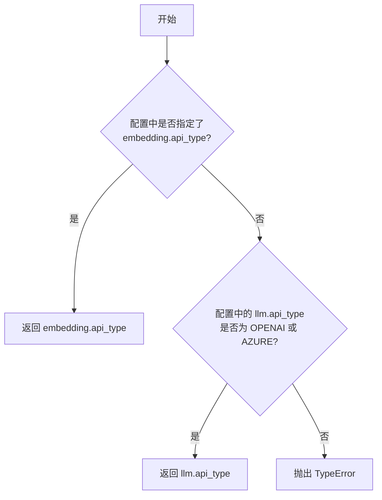
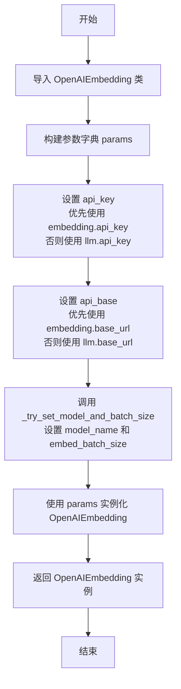
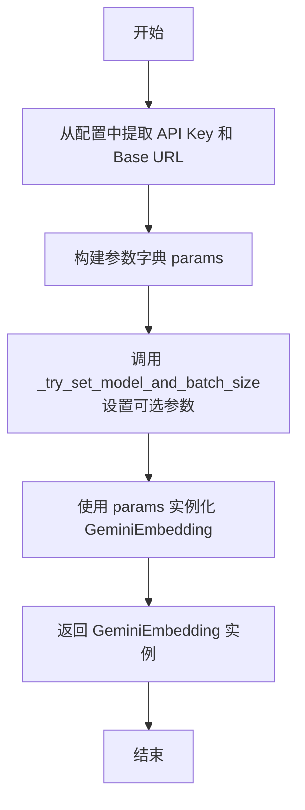
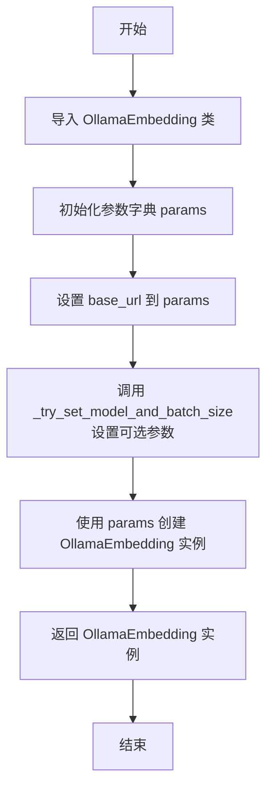
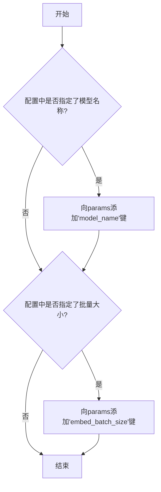
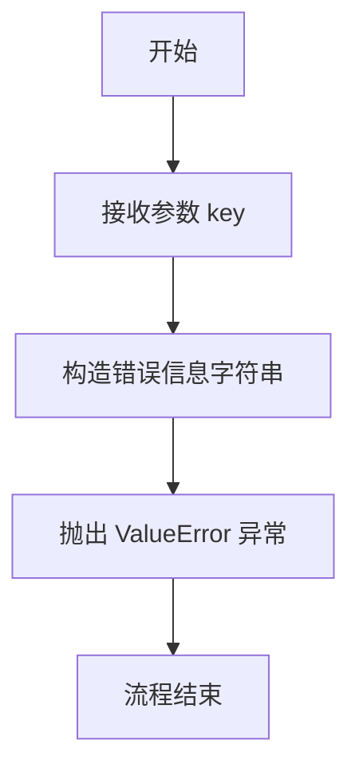

# `.\MetaGPT\metagpt\rag\factories\embedding.py` 详细设计文档

该代码实现了一个RAG（检索增强生成）嵌入工厂，根据配置动态创建并返回LlamaIndex框架中不同类型的嵌入模型实例（如OpenAI、Azure、Gemini、Ollama），并处理配置的解析和向后兼容性。

## 整体流程

```mermaid
graph TD
    A[开始: 调用 get_rag_embedding] --> B{是否提供 key?}
    B -- 否 --> C[调用 _resolve_embedding_type]
    C --> D{config.embedding.api_type 存在?}
    D -- 是 --> E[返回 embedding.api_type]
    D -- 否 --> F{config.llm.api_type 是 OPENAI 或 AZURE?}
    F -- 是 --> G[返回 llm.api_type (向后兼容)]
    F -- 否 --> H[抛出 TypeError]
    B -- 是 --> I[使用提供的 key]
    I --> J[调用 GenericFactory.get_instance(key)]
    E --> J
    G --> J
    J --> K{在 creators 映射中查找 key}
    K -- 找到 --> L[调用对应的 _create_* 方法]
    L --> M[构建参数字典 params]
    M --> N[调用 _try_set_model_and_batch_size]
    N --> O[返回对应的 Embedding 实例]
    K -- 未找到 --> P[调用 _raise_for_key 抛出 ValueError]
```

## 类结构

```
GenericFactory (基类)
└── RAGEmbeddingFactory (嵌入工厂类)
```

## 全局变量及字段


### `RAGEmbeddingFactory.config`
    
存储应用程序的配置信息，用于根据配置动态创建不同类型的嵌入模型。

类型：`Config`
    
    

## 全局函数及方法

### `get_rag_embedding`

这是一个全局函数，用于便捷地获取一个基于配置的RAG（检索增强生成）嵌入模型实例。它封装了`RAGEmbeddingFactory`类的创建和调用过程，是获取嵌入模型的主要入口点。

参数：

-  `key`：`EmbeddingType`，可选参数。指定要创建的嵌入模型类型（如`OPENAI`, `AZURE`, `GEMINI`, `OLLAMA`）。如果为`None`，函数将根据传入的`config`或默认配置自动解析类型。
-  `config`：`Optional[Config]`，可选参数。包含嵌入模型和LLM配置的`Config`对象。如果为`None`，将使用`Config.default()`作为默认配置。

返回值：`BaseEmbedding`，返回一个`llama_index.core.embeddings.BaseEmbedding`的子类实例，该实例是具体配置好的嵌入模型（如`OpenAIEmbedding`, `AzureOpenAIEmbedding`等），可用于生成文本的向量表示。

#### 流程图

```mermaid
flowchart TD
    A[开始: 调用 get_rag_embedding] --> B{是否提供了 config 参数?}
    B -- 是 --> C[使用提供的 config 创建 RAGEmbeddingFactory]
    B -- 否 --> D[使用 Config.default() 创建 RAGEmbeddingFactory]
    C --> E[调用 factory.get_rag_embedding(key)]
    D --> E
    E --> F{是否提供了 key 参数?}
    F -- 是 --> G[使用提供的 key 获取嵌入实例]
    F -- 否 --> H[调用 factory._resolve_embedding_type 解析类型]
    H --> I[使用解析出的类型获取嵌入实例]
    G --> J[返回 BaseEmbedding 实例]
    I --> J
    J --> K[结束]
```

#### 带注释源码

```python
def get_rag_embedding(key: EmbeddingType = None, config: Optional[Config] = None):
    # 1. 创建工厂实例：根据传入的config参数决定使用提供的配置还是默认配置。
    #    这实例化了RAGEmbeddingFactory，其内部注册了各种嵌入类型的创建方法。
    # 2. 调用工厂方法：通过工厂的get_rag_embedding方法获取具体的嵌入模型实例。
    #    - 如果提供了key，则直接使用该key（EmbeddingType）进行创建。
    #    - 如果key为None，则工厂会调用内部的_resolve_embedding_type方法，
    #      根据config中的embedding.api_type或llm.api_type（用于向后兼容）自动决定使用哪种嵌入类型。
    # 3. 返回结果：返回创建好的BaseEmbedding子类对象，可直接用于文本嵌入。
    return RAGEmbeddingFactory(config=config).get_rag_embedding(key)
```

### `RAGEmbeddingFactory.__init__`

`RAGEmbeddingFactory` 类的构造函数。它初始化一个工厂，该工厂根据配置映射不同的嵌入类型（如 OpenAI, Azure, Gemini, Ollama）到对应的创建方法。同时，它处理配置的加载，如果没有提供配置，则使用默认配置。

参数：

- `config`：`Optional[Config]`，可选的配置对象。如果未提供，将使用 `Config.default()` 获取默认配置。

返回值：`None`，构造函数不返回任何值。

#### 流程图

```mermaid
flowchart TD
    A[开始] --> B{是否有传入config参数?}
    B -- 是 --> C[使用传入的config]
    B -- 否 --> D[使用Config.default()<br>获取默认配置]
    C --> E[初始化creators字典<br>映射EmbeddingType/LLMType到创建方法]
    D --> E
    E --> F[调用父类GenericFactory的__init__<br>传入creators字典]
    F --> G[将config赋值给self.config]
    G --> H[结束]
```

#### 带注释源码

```python
def __init__(self, config: Optional[Config] = None):
    # 创建一个映射字典，将不同的嵌入类型（或为了向后兼容的LLM类型）映射到对应的创建方法。
    # 这些创建方法是本类的私有方法，用于实例化具体的嵌入模型客户端。
    creators = {
        EmbeddingType.OPENAI: self._create_openai,
        EmbeddingType.AZURE: self._create_azure,
        EmbeddingType.GEMINI: self._create_gemini,
        EmbeddingType.OLLAMA: self._create_ollama,
        # 为了向后兼容，将LLMType.OPENAI和LLMType.AZURE也映射到对应的嵌入创建方法。
        # 这允许在未显式配置嵌入类型时，使用LLM配置来推断。
        LLMType.OPENAI: self._create_openai,
        LLMType.AZURE: self._create_azure,
    }
    # 调用父类GenericFactory的构造函数，传入创建器映射字典。
    # GenericFactory 将利用这个映射来管理实例的创建。
    super().__init__(creators)
    # 设置实例的配置属性。
    # 如果传入了config参数，则使用它；否则，使用Config类的默认配置。
    self.config = config if config else Config.default()
```


### `RAGEmbeddingFactory.get_rag_embedding`

该方法根据传入的嵌入类型键（`EmbeddingType`）或通过解析配置自动确定的类型，创建并返回一个对应的 LlamaIndex 嵌入模型实例。它是 `RAGEmbeddingFactory` 工厂类的核心方法，封装了不同类型嵌入模型的创建逻辑，并处理了向后兼容性。

参数：

-  `key`：`EmbeddingType`，可选参数。指定要创建的嵌入模型类型。如果未提供，则通过 `_resolve_embedding_type` 方法从配置中解析。

返回值：`BaseEmbedding`，返回一个符合 LlamaIndex `BaseEmbedding` 接口的嵌入模型实例。

#### 流程图

```mermaid
flowchart TD
    A[开始调用 get_rag_embedding] --> B{是否提供了 key 参数?}
    B -- 是 --> C[使用提供的 key]
    B -- 否 --> D[调用 _resolve_embedding_type]
    D --> E{配置中是否有<br>embedding.api_type?}
    E -- 是 --> F[返回 embedding.api_type]
    E -- 否 --> G{llm.api_type 是否为<br>OPENAI 或 AZURE?}
    G -- 是 --> H[返回 llm.api_type]
    G -- 否 --> I[抛出 TypeError 异常]
    C --> J[调用父类 GenericFactory.get_instance]
    F --> J
    H --> J
    J --> K[根据 key 查找对应的<br>创建者函数 creators[key]]
    K --> L[执行创建者函数<br>（如 _create_openai）]
    L --> M[返回创建的 BaseEmbedding 实例]
    M --> N[结束]
    I --> N
```

#### 带注释源码

```python
def get_rag_embedding(self, key: EmbeddingType = None) -> BaseEmbedding:
    """Key is EmbeddingType."""
    # 如果提供了 key 参数，则使用它；否则，调用内部方法解析配置以确定嵌入类型。
    return super().get_instance(key or self._resolve_embedding_type())
```


### `RAGEmbeddingFactory._resolve_embedding_type`

该方法用于解析并确定应使用的嵌入类型。它首先检查配置中是否明确指定了嵌入API类型。如果未指定，则出于向后兼容性的考虑，检查LLM的API类型是否为OPENAI或AZURE。如果两者均未找到，则抛出类型错误。

参数：
-  `self`：`RAGEmbeddingFactory`，`RAGEmbeddingFactory`类的实例。

返回值：`EmbeddingType | LLMType`，解析出的嵌入类型，可能是`EmbeddingType`或`LLMType`枚举值。

#### 流程图



#### 带注释源码

```python
def _resolve_embedding_type(self) -> EmbeddingType | LLMType:
    """Resolves the embedding type.

    If the embedding type is not specified, for backward compatibility, it checks if the LLM API type is either OPENAI or AZURE.
    Raise TypeError if embedding type not found.
    """
    # 1. 优先检查配置中是否明确指定了嵌入API类型
    if self.config.embedding.api_type:
        return self.config.embedding.api_type

    # 2. 如果未指定嵌入类型，则检查LLM类型是否为OPENAI或AZURE（向后兼容逻辑）
    if self.config.llm.api_type in [LLMType.OPENAI, LLMType.AZURE]:
        return self.config.llm.api_type

    # 3. 如果以上条件均不满足，则抛出异常，提示用户配置嵌入设置
    raise TypeError("To use RAG, please set your embedding in config2.yaml.")
```

### `RAGEmbeddingFactory._create_openai`

该方法用于根据配置创建并返回一个 OpenAI 格式的嵌入模型实例。它从配置中提取必要的参数（如 API 密钥、基础 URL），并可选地设置模型名称和批处理大小，最终实例化并返回一个 `OpenAIEmbedding` 对象。

参数：
- `self`：`RAGEmbeddingFactory`，当前工厂实例的引用。

返回值：`OpenAIEmbedding`，一个配置好的 OpenAI 嵌入模型实例。

#### 流程图



#### 带注释源码

```python
def _create_openai(self) -> "OpenAIEmbedding":
    # 动态导入 OpenAIEmbedding 类，避免不必要的依赖
    from llama_index.embeddings.openai import OpenAIEmbedding

    # 构建参数字典，优先使用 embedding 配置，其次回退到 llm 配置
    params = dict(
        api_key=self.config.embedding.api_key or self.config.llm.api_key,
        api_base=self.config.embedding.base_url or self.config.llm.base_url,
    )

    # 尝试设置模型名称和批处理大小（如果配置中指定了的话）
    self._try_set_model_and_batch_size(params)

    # 使用构建好的参数字典实例化并返回 OpenAIEmbedding 对象
    return OpenAIEmbedding(**params)
```


### `RAGEmbeddingFactory._create_azure`

该方法用于根据配置信息创建并返回一个 `AzureOpenAIEmbedding` 实例，该实例是用于与Azure OpenAI服务进行交互的嵌入模型客户端。

参数：
-  `self`：`RAGEmbeddingFactory`，`RAGEmbeddingFactory` 类的实例，用于访问配置信息。

返回值：`AzureOpenAIEmbedding`，一个配置好的Azure OpenAI嵌入模型客户端实例。

#### 流程图

```mermaid
flowchart TD
    A[开始 _create_azure] --> B[初始化参数字典 params]
    B --> C{配置中 embedding.api_key 存在?}
    C -- 是 --> D[params['api_key'] = config.embedding.api_key]
    C -- 否 --> E[params['api_key'] = config.llm.api_key]
    D --> F
    E --> F
    F{配置中 embedding.base_url 存在?}
    F -- 是 --> G[params['azure_endpoint'] = config.embedding.base_url]
    F -- 否 --> H[params['azure_endpoint'] = config.llm.base_url]
    G --> I
    H --> I
    I{配置中 embedding.api_version 存在?}
    I -- 是 --> J[params['api_version'] = config.embedding.api_version]
    I -- 否 --> K[params['api_version'] = config.llm.api_version]
    J --> L
    K --> L
    L[调用 _try_set_model_and_batch_size<br>设置模型和批处理大小]
    L --> M[使用 params 实例化<br>AzureOpenAIEmbedding]
    M --> N[返回 AzureOpenAIEmbedding 实例]
    N --> O[结束]
```

#### 带注释源码

```python
def _create_azure(self) -> AzureOpenAIEmbedding:
    # 初始化参数字典，用于传递给 AzureOpenAIEmbedding 构造函数
    params = dict(
        # 优先使用 embedding 配置中的 api_key，若不存在则回退到 llm 配置中的 api_key
        api_key=self.config.embedding.api_key or self.config.llm.api_key,
        # 优先使用 embedding 配置中的 base_url，若不存在则回退到 llm 配置中的 base_url
        # 注意：对于 Azure，参数名是 `azure_endpoint`
        azure_endpoint=self.config.embedding.base_url or self.config.llm.base_url,
        # 优先使用 embedding 配置中的 api_version，若不存在则回退到 llm 配置中的 api_version
        api_version=self.config.embedding.api_version or self.config.llm.api_version,
    )

    # 调用内部方法，尝试为 params 字典设置模型名称和批处理大小（如果配置中指定了的话）
    self._try_set_model_and_batch_size(params)

    # 使用构建好的参数字典创建并返回 AzureOpenAIEmbedding 实例
    return AzureOpenAIEmbedding(**params)
```


### `RAGEmbeddingFactory._create_gemini`

该方法用于根据配置创建并返回一个 Gemini 嵌入模型实例。它从配置中提取必要的参数（如 API 密钥和基础 URL），并可选地设置模型名称和批量大小，最终实例化并返回 `GeminiEmbedding` 对象。

参数：
- `self`：`RAGEmbeddingFactory`，`RAGEmbeddingFactory` 类的实例，用于访问配置信息。

返回值：`GeminiEmbedding`，一个配置好的 Gemini 嵌入模型实例，用于生成文本嵌入。

#### 流程图



#### 带注释源码

```python
def _create_gemini(self) -> "GeminiEmbedding":
    # 导入 GeminiEmbedding 类，用于创建嵌入模型实例
    from llama_index.embeddings.gemini import GeminiEmbedding

    # 从配置中提取必要的参数，构建参数字典
    # 主要提取 API 密钥和基础 URL
    params = dict(
        api_key=self.config.embedding.api_key,
        api_base=self.config.embedding.base_url,
    )

    # 调用内部方法，尝试为参数字典添加模型名称和批量大小参数
    # 这些参数在配置中指定时才添加
    self._try_set_model_and_batch_size(params)

    # 使用构建好的参数字典实例化并返回 GeminiEmbedding 对象
    return GeminiEmbedding(**params)
```

### `RAGEmbeddingFactory._create_ollama`

该方法用于根据配置信息创建并返回一个 `OllamaEmbedding` 实例，该实例是用于与本地 Ollama 服务交互的文本嵌入模型。

参数：
- `self`：`RAGEmbeddingFactory`，`RAGEmbeddingFactory` 类的实例，用于访问配置信息。

返回值：`OllamaEmbedding`，一个配置好的 LlamaIndex Ollama 嵌入模型实例。

#### 流程图



#### 带注释源码

```python
def _create_ollama(self) -> "OllamaEmbedding":
    # 动态导入 LlamaIndex 的 OllamaEmbedding 类，避免不必要的依赖
    from llama_index.embeddings.ollama import OllamaEmbedding

    # 初始化参数字典，用于传递给 OllamaEmbedding 构造函数
    params = dict(
        # 从配置中获取 Ollama 服务的基地址（base_url）
        base_url=self.config.embedding.base_url,
    )

    # 调用内部方法，尝试将配置中的模型名称和批次大小添加到参数字典中
    # 这些参数在配置中是可选的，如果存在则设置，不存在则跳过
    self._try_set_model_and_batch_size(params)

    # 使用构建好的参数字典创建并返回 OllamaEmbedding 实例
    return OllamaEmbedding(**params)
```

### `RAGEmbeddingFactory._try_set_model_and_batch_size`

该方法用于根据配置，有条件地向参数字典中添加模型名称和批量大小参数。它检查配置对象中是否指定了模型名称和批量大小，如果指定了，则将这些值添加到传入的参数字典中，以便后续用于初始化嵌入模型。

参数：
- `params`：`dict`，用于初始化嵌入模型的参数字典，该方法会向此字典中注入 `model_name` 和 `embed_batch_size` 键值对。

返回值：`None`，该方法不返回任何值，直接修改传入的参数字典。

#### 流程图



#### 带注释源码

```python
def _try_set_model_and_batch_size(self, params: dict):
    """Set the model_name and embed_batch_size only when they are specified."""
    # 如果配置中指定了模型名称，则将其添加到参数字典中
    if self.config.embedding.model:
        params["model_name"] = self.config.embedding.model

    # 如果配置中指定了批量大小，则将其添加到参数字典中
    if self.config.embedding.embed_batch_size:
        params["embed_batch_size"] = self.config.embedding.embed_batch_size
```


### `RAGEmbeddingFactory._raise_for_key`

该方法用于在工厂无法处理传入的 `key` 参数时，抛出一个明确的 `ValueError` 异常，指示当前不支持该嵌入类型。

参数：

-  `key`：`Any`，触发异常时传入的键值，通常是 `EmbeddingType` 或 `LLMType` 枚举值，但方法设计为接受任何类型以增强通用性。

返回值：`None`，此方法不返回任何值，其唯一作用是抛出异常。

#### 流程图



#### 带注释源码

```python
def _raise_for_key(self, key: Any):
    # 当工厂的 creators 映射中找不到对应的 key 时，调用此方法。
    # 它构造一个包含 key 类型和值的错误信息，并抛出 ValueError 异常。
    raise ValueError(f"The embedding type is currently not supported: `{type(key)}`, {key}")
```


## 关键组件


### 工厂模式 (Factory Pattern)

通过 `RAGEmbeddingFactory` 类实现，根据配置的 `EmbeddingType` 或 `LLMType` 动态创建并返回对应的 LlamaIndex 嵌入模型实例，统一了不同供应商嵌入模型的创建逻辑。

### 配置解析与兼容性处理

通过 `_resolve_embedding_type` 方法，优先从配置中解析 `embedding.api_type`；若未指定，则出于向后兼容性考虑，检查 `llm.api_type` 是否为 `OPENAI` 或 `AZURE`，实现了新旧配置的平滑过渡。

### 参数构建与默认值处理

在各个 `_create_*` 方法中，从统一的 `Config` 对象中提取 API 密钥、基础 URL 等参数，并智能地使用 `embedding` 配置项或回退到 `llm` 配置项，最后通过 `_try_set_model_and_batch_size` 方法有条件地设置模型名称和批次大小。

### 全局便捷函数

提供了一个顶层的 `get_rag_embedding` 函数，封装了工厂的创建和调用过程，为用户提供了一个简洁、直接的接口来获取嵌入模型实例。


## 问题及建议


### 已知问题

-   **向后兼容性逻辑可能导致混淆**：`_resolve_embedding_type` 方法中，当 `embedding.api_type` 未设置时，会回退到检查 `llm.api_type` 是否为 `OPENAI` 或 `AZURE`。这种设计虽然提供了便利，但将 LLM 类型与 Embedding 类型的概念耦合，可能导致配置意图不清晰，特别是当用户实际想使用其他类型的 Embedding（如 Gemini）但 LLM 配置为 OpenAI 时，会引发 `TypeError` 错误，提示信息不够精确。
-   **配置参数合并逻辑存在潜在覆盖风险**：在 `_create_openai`、`_create_azure` 等方法中，使用 `or` 操作符合并 `config.embedding` 和 `config.llm` 的配置项（如 `api_key`, `base_url`）。如果 `config.embedding` 中的某个字段为空字符串（而非 `None`），`or` 操作符会将其视为 `True`，从而不会回退到 `config.llm` 中的值。这可能导致非预期的行为，例如当用户有意清空 `embedding.api_key` 但希望使用 `llm.api_key` 时，实际传入的是空字符串。
-   **工厂类职责边界模糊**：`RAGEmbeddingFactory` 继承自 `GenericFactory`，但其 `_raise_for_key` 方法仅抛出 `ValueError`。而父类 `GenericFactory` 的 `get_instance` 方法在找不到 `key` 对应的创建器时，会调用此方法。然而，`_resolve_embedding_type` 方法在无法确定类型时会抛出 `TypeError`。异常类型的不一致（`ValueError` vs `TypeError`）可能给上层错误处理带来困扰。
-   **硬编码的创建器映射**：`__init__` 方法中 `creators` 字典的键值对是硬编码的。虽然当前支持的 Embedding 类型有限，但每增加一种新的 Embedding 类型，都需要修改此处的代码和添加对应的 `_create_xxx` 方法，违反了开闭原则，降低了扩展性。
-   **部分配置项未充分利用**：例如，对于 `AzureOpenAIEmbedding`，`api_version` 参数从配置中读取，但其他 Embedding 类型（如 OpenAI, Gemini）可能也有类似的版本参数或特定参数，当前实现未提供统一的扩展点来配置这些特定参数。

### 优化建议

-   **明确配置优先级与分离关注点**：建议重构配置解析逻辑。明确 `embedding` 配置的优先级最高，仅在 `embedding` 配置完全缺失或显式启用“回退”标志时，才考虑使用 `llm` 配置。同时，将 LLM 类型到 Embedding 类型的映射关系定义在配置层或一个明确的常量映射中，使逻辑更清晰。
-   **使用更安全的配置合并策略**：将 `or` 操作符替换为更明确的逻辑，例如使用 `getattr(conf, ‘field’, None)` 并显式检查是否为 `None`，或者使用 `config.embedding.api_key if config.embedding.api_key is not None else config.llm.api_key`。这样可以正确处理空字符串等假值。
-   **统一异常处理与工厂职责**：重构 `_raise_for_key` 方法，使其抛出的异常类型与 `_resolve_embedding_type` 方法保持一致（例如都使用 `ValueError` 并附带更清晰的错误信息）。或者，将类型解析失败的逻辑也整合到 `_raise_for_key` 的触发路径中，使错误出口唯一。
-   **实现插件化或注册机制以支持扩展**：将 `creators` 字典的构建改为动态注册机制。可以定义一个装饰器或使用入口点（entry_points）机制，允许外部模块注册新的 `EmbeddingType` 及其对应的创建函数。这样，新增 Embedding 类型时，只需在独立的模块中实现创建函数并注册，无需修改 `RAGEmbeddingFactory` 的核心代码。
-   **抽象通用参数与提供扩展接口**：将 `_try_set_model_and_batch_size` 方法扩展为一个更通用的参数准备方法。可以定义一个基类或协议，要求每种 Embedding 类型提供一个“参数提取器”函数，该函数接收 `Config` 对象并返回一个参数字典。这样，可以统一处理通用参数（如 `model`, `batch_size`），并为特定参数（如 `api_version`, `deployment_name` 等）提供定制化的提取逻辑，使配置支持更加灵活和全面。


## 其它


### 设计目标与约束

本模块的核心设计目标是提供一个灵活、可扩展的工厂类，用于根据配置动态创建和返回不同的嵌入模型实例。它旨在：
1.  **解耦配置与实例化**：将嵌入模型的配置信息（来自`Config`对象）与具体的模型实例化逻辑分离，提高代码的可维护性。
2.  **支持多种后端**：通过工厂模式，统一接口创建OpenAI、Azure OpenAI、Gemini、Ollama等多种嵌入服务客户端。
3.  **向后兼容**：在未显式配置嵌入类型时，能够回退检查LLM配置，以支持旧版配置或简化设置。
4.  **配置驱动**：所有创建参数均从统一的配置对象（`Config`）中获取，便于集中管理和环境切换。
主要约束包括必须依赖外部的`llama_index`嵌入类库和项目内部的`Config`配置管理类。

### 错误处理与异常设计

模块的错误处理主要围绕配置解析和实例创建：
1.  **配置缺失错误**：在`_resolve_embedding_type`方法中，如果既未配置`embedding.api_type`，且`llm.api_type`也不是OPENAI或AZURE，则会抛出`TypeError`，提示用户配置嵌入设置。
2.  **不支持的嵌入类型**：当工厂的`get_instance`方法接收到一个未在`creators`字典中注册的键时，会调用`_raise_for_key`方法，抛出`ValueError`，明确指出不支持的嵌入类型。
3.  **参数传递错误**：在具体的`_create_*`方法中，参数通过字典收集并传递给第三方库（如`OpenAIEmbedding`）。如果配置错误（如缺少必要的API Key），将由这些第三方库抛出其固有的异常（如`AuthenticationError`, `ValueError`等），本模块不进行额外捕获和转换，遵循“快速失败”原则。

### 数据流与状态机

本模块不涉及复杂的状态机。其数据流是线性的、无状态的：
1.  **输入**：用户调用`get_rag_embedding`函数或`RAGEmbeddingFactory.get_rag_embedding`方法，可选的输入是一个`EmbeddingType`枚举键和一个`Config`配置对象。
2.  **处理**：
    a. 工厂根据`Config`解析出最终要使用的嵌入类型（`_resolve_embedding_type`）。
    b. 根据解析出的类型，从`creators`字典中找到对应的创建方法。
    c. 创建方法从`Config`对象中读取相关配置（API Key, Base URL, Model等），组装成参数字典。
    d. 调用`_try_set_model_and_batch_size`方法，有条件地向参数字典添加模型名和批次大小。
    e. 使用参数字典实例化对应的`llama_index`嵌入类并返回。
3.  **输出**：一个具体的`BaseEmbedding`子类的实例，可供调用者直接用于生成嵌入向量。

### 外部依赖与接口契约

1.  **外部库依赖**：
    *   `llama_index.core.embeddings.BaseEmbedding`：所有返回对象的抽象基类。
    *   `llama_index.embeddings`下的具体实现类（`OpenAIEmbedding`, `AzureOpenAIEmbedding`, `GeminiEmbedding`, `OllamaEmbedding`）：工厂实际创建的对象类型。
    *   `typing`：用于类型注解。

2.  **项目内部依赖**：
    *   `metagpt.config2.Config`：核心配置类，提供所有必要的配置项。
    *   `metagpt.configs.embedding_config.EmbeddingType`：嵌入类型的枚举定义。
    *   `metagpt.configs.llm_config.LLMType`：LLM类型的枚举定义，用于向后兼容。
    *   `metagpt.rag.factories.base.GenericFactory`：工厂基类，提供了注册和获取实例的通用框架。

3.  **接口契约**：
    *   `RAGEmbeddingFactory.get_rag_embedding(key)`：对外主要接口。契约是传入一个`EmbeddingType`（或兼容的`LLMType`）键，返回一个可用的`BaseEmbedding`实例。如果键无效或配置缺失，抛出异常。
    *   全局函数`get_rag_embedding(key, config)`：便捷函数，契约与类方法一致。
    *   具体的`_create_*`方法：内部契约，它们必须是无参数方法，并返回一个`BaseEmbedding`实例。它们依赖于`self.config`属性来获取配置。

    