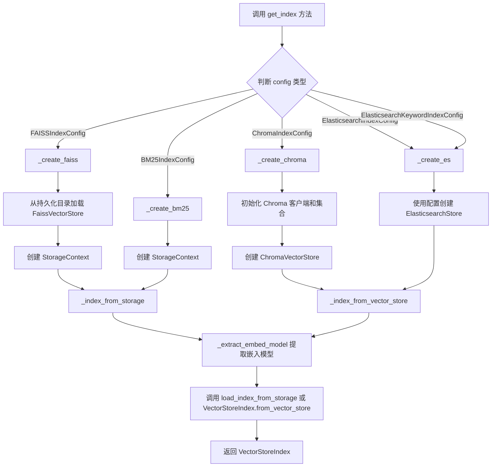
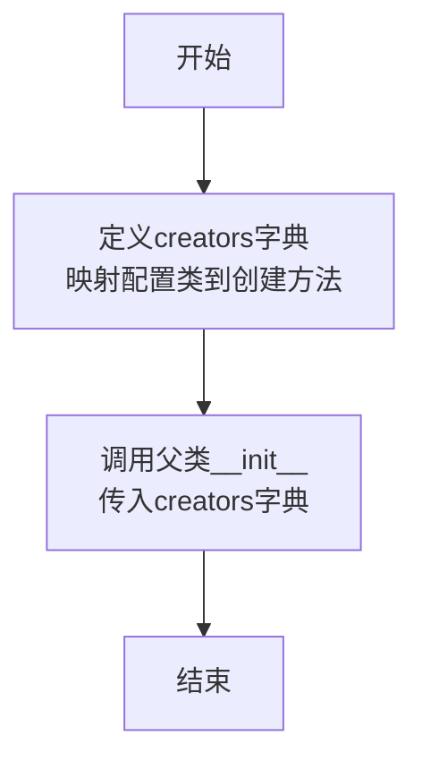
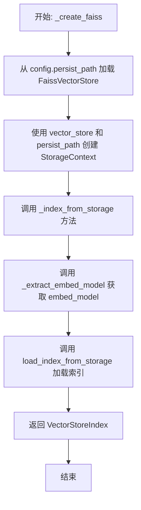
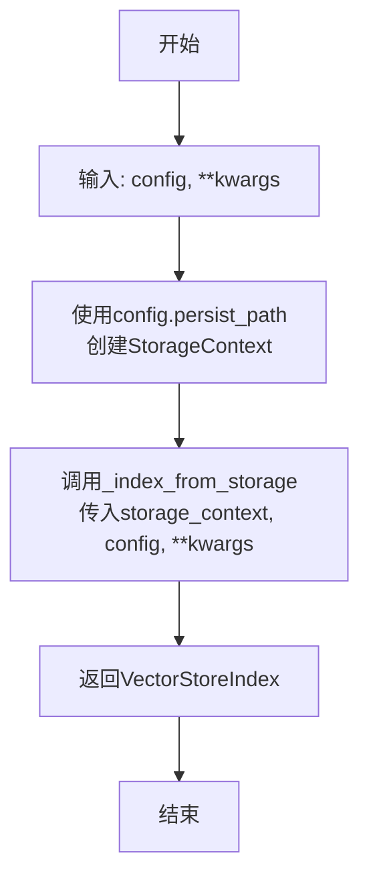
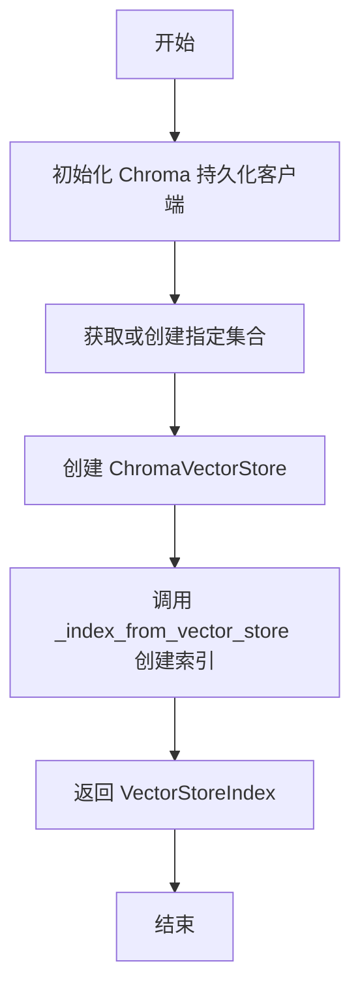
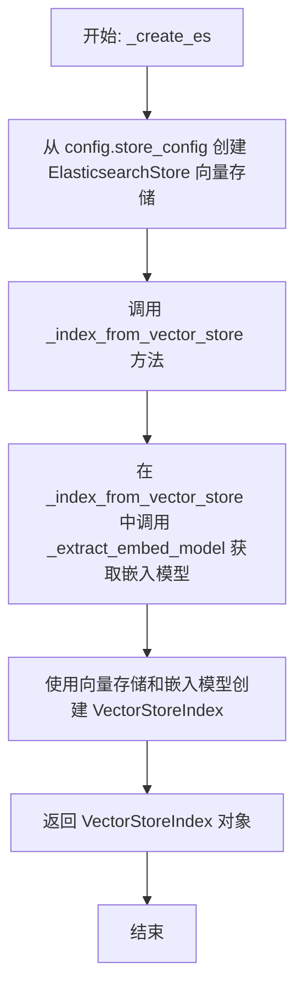
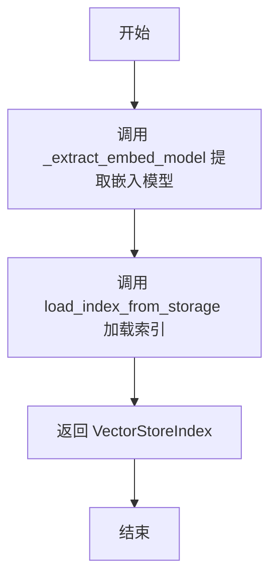
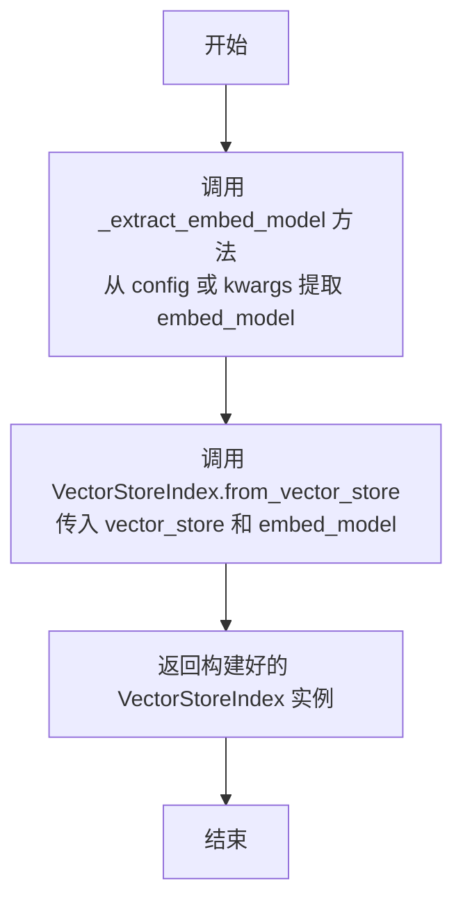
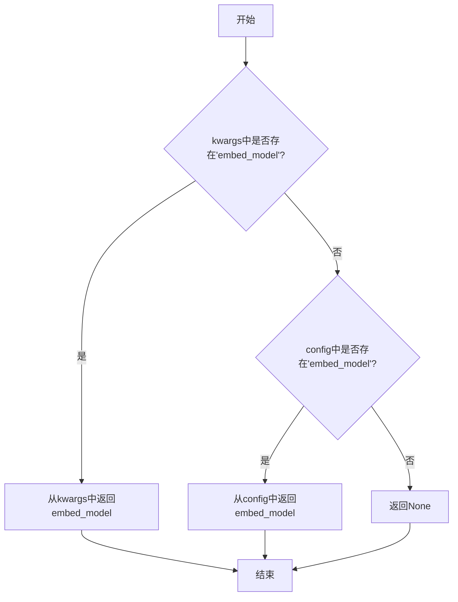

# `.\MetaGPT\metagpt\rag\factories\index.py` 详细设计文档

该代码实现了一个RAG索引工厂（RAGIndexFactory），它是一个基于配置的工厂类，用于根据不同的索引配置（如FAISS、Chroma、BM25、Elasticsearch等）创建和加载对应的向量存储索引（VectorStoreIndex），以支持检索增强生成（RAG）系统中的文档检索功能。

## 整体流程



## 类结构

```
ConfigBasedFactory (父类，来自 metagpt.rag.factories.base)
└── RAGIndexFactory
    ├── __init__
    ├── get_index
    ├── _create_faiss
    ├── _create_bm25
    ├── _create_chroma
    ├── _create_es
    ├── _index_from_storage
    ├── _index_from_vector_store
    └── _extract_embed_model
```

## 全局变量及字段


### `get_index`
    
RAGIndexFactory 实例的 get_index 方法的全局引用，用于根据给定的索引配置创建并返回对应的向量索引对象。

类型：`function`
    


    

## 全局函数及方法

### `RAGIndexFactory.__init__`

该方法初始化 `RAGIndexFactory` 类，创建一个配置类型到对应索引创建方法的映射字典，并调用父类的 `__init__` 方法进行注册。

参数：
- 无显式参数。

返回值：`None`，无返回值。

#### 流程图



#### 带注释源码

```python
def __init__(self):
    # 创建一个字典，将不同的索引配置类映射到对应的创建方法上。
    # 这是工厂模式的核心，允许根据传入的配置对象动态选择创建逻辑。
    creators = {
        FAISSIndexConfig: self._create_faiss,        # FAISS索引配置 -> _create_faiss方法
        ChromaIndexConfig: self._create_chroma,      # Chroma索引配置 -> _create_chroma方法
        BM25IndexConfig: self._create_bm25,          # BM25索引配置 -> _create_bm25方法
        ElasticsearchIndexConfig: self._create_es,   # Elasticsearch向量索引配置 -> _create_es方法
        ElasticsearchKeywordIndexConfig: self._create_es, # Elasticsearch关键词索引配置 -> _create_es方法
    }
    # 调用父类ConfigBasedFactory的构造函数，将上面定义的creators字典传递进去。
    # 父类会利用这个字典来管理配置类型与实例创建方法的关联。
    super().__init__(creators)
```

### `RAGIndexFactory.get_index`

该方法是一个工厂方法，用于根据传入的索引配置对象（`BaseIndexConfig` 或其子类）创建并返回对应的向量索引（`BaseIndex`）。它通过一个内部注册的创建器映射，将配置类型与具体的创建函数关联起来，实现了基于配置的索引实例化。

参数：
- `config`：`BaseIndexConfig`，索引配置对象，指定了要创建的索引类型（如FAISS、Chroma、BM25、Elasticsearch等）及其相关参数（如持久化路径、集合名称等）。
- `**kwargs`：`Any`，可选的关键字参数，可用于覆盖配置中的某些值（例如，动态传入嵌入模型 `embed_model`）。

返回值：`BaseIndex`，根据配置创建的索引实例。

#### 流程图

```mermaid
flowchart TD
    A[开始: get_index(config, **kwargs)] --> B{检查config类型};
    B -- FAISSIndexConfig --> C[调用 _create_faiss];
    B -- ChromaIndexConfig --> D[调用 _create_chroma];
    B -- BM25IndexConfig --> E[调用 _create_bm25];
    B -- ElasticsearchIndexConfig --> F[调用 _create_es];
    B -- ElasticsearchKeywordIndexConfig --> F;
    
    C --> G[从持久化目录加载FaissVectorStore];
    G --> H[创建StorageContext];
    H --> I[调用 _index_from_storage];
    
    D --> J[初始化ChromaDB PersistentClient];
    J --> K[获取或创建集合];
    K --> L[创建ChromaVectorStore];
    L --> M[调用 _index_from_vector_store];
    
    E --> N[创建StorageContext<br>（仅持久化目录）];
    N --> I;
    
    F --> O[使用store_config创建ElasticsearchStore];
    O --> M;
    
    I --> P[调用 _extract_embed_model<br>获取embed_model];
    P --> Q[调用 llama_index.core.load_index_from_storage];
    Q --> R[返回VectorStoreIndex];
    
    M --> S[调用 _extract_embed_model<br>获取embed_model];
    S --> T[调用 VectorStoreIndex.from_vector_store];
    T --> R;
    
    R --> U[结束: 返回BaseIndex];
```

#### 带注释源码

```python
def get_index(self, config: BaseIndexConfig, **kwargs) -> BaseIndex:
    """Key is PersistType."""
    # 调用父类 ConfigBasedFactory 的 get_instance 方法。
    # 该方法会根据 config 的类型，从初始化时注册的 creators 字典中查找对应的创建函数（如 _create_faiss），
    # 然后执行该函数并传入 config 和 kwargs 参数，最终返回创建好的索引实例。
    return super().get_instance(config, **kwargs)
```

### `RAGIndexFactory._create_faiss`

该方法根据 `FAISSIndexConfig` 配置，从持久化目录加载 FAISS 向量存储，并构建一个 `VectorStoreIndex` 索引对象。

参数：

- `config`：`FAISSIndexConfig`，包含 FAISS 索引的配置信息，特别是持久化路径。
- `**kwargs`：`Any`，额外的关键字参数，用于传递其他配置（如嵌入模型）。

返回值：`VectorStoreIndex`，一个基于 FAISS 向量存储构建的 LlamaIndex 向量索引对象。

#### 流程图



#### 带注释源码

```python
def _create_faiss(self, config: FAISSIndexConfig, **kwargs) -> VectorStoreIndex:
    # 1. 从配置指定的持久化目录加载 FAISS 向量存储
    vector_store = FaissVectorStore.from_persist_dir(str(config.persist_path))
    # 2. 使用加载的向量存储和持久化路径创建存储上下文
    storage_context = StorageContext.from_defaults(vector_store=vector_store, persist_dir=config.persist_path)

    # 3. 调用内部方法，从存储上下文加载并返回最终的索引
    return self._index_from_storage(storage_context=storage_context, config=config, **kwargs)
```

### `RAGIndexFactory._create_bm25`

该方法根据传入的 `BM25IndexConfig` 配置对象，创建一个基于 BM25 算法的向量存储索引。它通过加载本地持久化的存储上下文来构建索引，适用于基于关键词匹配的检索场景。

参数：

- `config`：`BM25IndexConfig`，BM25索引的配置对象，包含持久化路径等信息。
- `**kwargs`：`Any`，可选的关键字参数，用于传递额外的配置信息（如嵌入模型）。

返回值：`VectorStoreIndex`，一个基于 BM25 算法和本地持久化数据构建的向量存储索引对象。

#### 流程图



#### 带注释源码

```python
def _create_bm25(self, config: BM25IndexConfig, **kwargs) -> VectorStoreIndex:
    # 根据配置中的持久化路径，创建一个默认的存储上下文。
    # 对于BM25索引，它主要依赖于本地磁盘上已保存的文档和索引结构。
    storage_context = StorageContext.from_defaults(persist_dir=config.persist_path)

    # 调用内部方法 _index_from_storage，传入上一步创建的存储上下文、配置以及其他参数。
    # 该方法会负责加载嵌入模型并最终构建出 VectorStoreIndex 对象。
    return self._index_from_storage(storage_context=storage_context, config=config, **kwargs)
```

### `RAGIndexFactory._create_chroma`

该方法根据 `ChromaIndexConfig` 配置，创建一个基于 Chroma 向量数据库的 `VectorStoreIndex` 索引。它首先初始化一个 Chroma 持久化客户端，然后获取或创建指定的集合（Collection），最后使用该集合构建一个 `ChromaVectorStore` 并生成对应的向量索引。

参数：

- `config`：`ChromaIndexConfig`，包含 Chroma 索引的配置信息，如持久化路径、集合名称和元数据。
- `**kwargs`：`dict`，可选的关键字参数，用于传递额外的配置，例如嵌入模型。

返回值：`VectorStoreIndex`，一个基于 Chroma 向量存储构建的 LlamaIndex 向量索引对象。

#### 流程图



#### 带注释源码

```python
def _create_chroma(self, config: ChromaIndexConfig, **kwargs) -> VectorStoreIndex:
    # 1. 初始化一个指向指定持久化路径的 Chroma 客户端
    db = chromadb.PersistentClient(str(config.persist_path))
    # 2. 从客户端获取指定名称的集合，如果不存在则创建它，并可选择性地传入元数据
    chroma_collection = db.get_or_create_collection(config.collection_name, metadata=config.metadata)
    # 3. 使用上一步获取的集合，创建一个 LlamaIndex 的 ChromaVectorStore 适配器
    vector_store = ChromaVectorStore(chroma_collection=chroma_collection)

    # 4. 调用内部方法，使用创建好的向量存储和配置（及可能的嵌入模型）来最终构建并返回索引
    return self._index_from_vector_store(vector_store=vector_store, config=config, **kwargs)
```

### `RAGIndexFactory._create_es`

该方法根据 `ElasticsearchIndexConfig` 配置，创建一个基于 Elasticsearch 向量存储的 `VectorStoreIndex` 索引对象。

参数：
- `config`：`ElasticsearchIndexConfig`，包含 Elasticsearch 向量存储配置信息的对象。
- `**kwargs`：`Any`，可选的关键字参数，用于传递额外的配置信息（例如嵌入模型）。

返回值：`VectorStoreIndex`，一个基于 Elasticsearch 向量存储构建的 LlamaIndex 向量索引对象。

#### 流程图



#### 带注释源码

```python
def _create_es(self, config: ElasticsearchIndexConfig, **kwargs) -> VectorStoreIndex:
    # 1. 从配置中提取 Elasticsearch 存储配置，并实例化 ElasticsearchStore 向量存储对象。
    #    `config.store_config` 是一个 Pydantic 模型，`model_dump()` 将其转换为字典。
    vector_store = ElasticsearchStore(**config.store_config.model_dump())

    # 2. 调用内部方法 `_index_from_vector_store`，传入上一步创建的向量存储、配置和额外参数。
    #    该方法会负责提取嵌入模型并最终构建 VectorStoreIndex。
    return self._index_from_vector_store(vector_store=vector_store, config=config, **kwargs)
```

### `RAGIndexFactory._index_from_storage`

该方法根据提供的存储上下文（StorageContext）和配置，从持久化存储中加载一个向量存储索引（VectorStoreIndex）。它首先从配置或关键字参数中提取嵌入模型（embed_model），然后使用LlamaIndex的`load_index_from_storage`函数加载索引。

参数：

- `storage_context`：`StorageContext`，包含向量存储和持久化目录信息的存储上下文对象。
- `config`：`BaseIndexConfig`，索引配置对象，用于提供嵌入模型等配置信息。
- `**kwargs`：`dict`，可选的关键字参数，可用于覆盖配置中的嵌入模型。

返回值：`VectorStoreIndex`，从持久化存储加载的向量存储索引对象。

#### 流程图



#### 带注释源码

```python
def _index_from_storage(
    self, storage_context: StorageContext, config: BaseIndexConfig, **kwargs
) -> VectorStoreIndex:
    # 从配置或关键字参数中提取嵌入模型
    embed_model = self._extract_embed_model(config, **kwargs)

    # 使用LlamaIndex的load_index_from_storage函数，传入存储上下文和嵌入模型，加载并返回索引
    return load_index_from_storage(storage_context=storage_context, embed_model=embed_model)
```

### `RAGIndexFactory._index_from_vector_store`

该方法基于给定的向量存储和配置，创建一个`VectorStoreIndex`实例。它首先从配置或关键字参数中提取嵌入模型，然后使用该嵌入模型和提供的向量存储来构建索引。

参数：

- `vector_store`：`BasePydanticVectorStore`，一个实现了`BasePydanticVectorStore`接口的向量存储实例，用于存储和检索向量数据。
- `config`：`BaseIndexConfig`，索引配置对象，包含创建索引所需的参数，如持久化路径等。
- `**kwargs`：`dict`，可选的关键字参数，可用于覆盖配置中的设置，例如提供嵌入模型。

返回值：`VectorStoreIndex`，一个基于提供的向量存储和嵌入模型构建的向量存储索引实例。

#### 流程图



#### 带注释源码

```python
def _index_from_vector_store(
    self, vector_store: BasePydanticVectorStore, config: BaseIndexConfig, **kwargs
) -> VectorStoreIndex:
    # 从配置或关键字参数中提取嵌入模型
    embed_model = self._extract_embed_model(config, **kwargs)

    # 使用提取的嵌入模型和提供的向量存储创建并返回 VectorStoreIndex
    return VectorStoreIndex.from_vector_store(
        vector_store=vector_store,
        embed_model=embed_model,
    )
```

### `RAGIndexFactory._extract_embed_model`

该方法用于从配置对象或关键字参数中提取嵌入模型（`embed_model`）。它优先从关键字参数（`kwargs`）中查找，如果未找到，则回退到配置对象（`config`）中查找。这是工厂模式中用于灵活获取依赖组件的一种常见策略。

参数：

-  `config`：`BaseIndexConfig`，索引配置对象，可能包含`embed_model`字段。
-  `**kwargs`：`dict`，关键字参数字典，可能包含`embed_model`键。

返回值：`BaseEmbedding`，提取到的嵌入模型实例。

#### 流程图



#### 带注释源码

```python
def _extract_embed_model(self, config, **kwargs) -> BaseEmbedding:
    # 调用父类方法，尝试从kwargs或config中获取键为"embed_model"的值
    # 查找顺序：优先kwargs，其次config
    return self._val_from_config_or_kwargs("embed_model", config, **kwargs)
```

## 关键组件


### RAGIndexFactory

一个基于配置的工厂类，用于创建和加载不同类型的向量检索索引（如FAISS、Chroma、BM25、Elasticsearch），它根据传入的配置对象类型，调用对应的创建方法，并统一处理嵌入模型的注入。

### ConfigBasedFactory

一个基础的工厂模式实现，通过注册的创建器（creators）字典，将配置类型映射到具体的创建函数，实现了根据配置动态创建对象的功能。

### BaseIndexConfig及其子类

一系列配置类（如`FAISSIndexConfig`、`ChromaIndexConfig`等），用于封装不同索引类型所需的特定参数（如持久化路径、集合名称、存储配置等），为工厂提供创建索引的蓝图。

### 向量存储适配器（Vector Store Adapters）

包括`FaissVectorStore`、`ChromaVectorStore`、`ElasticsearchStore`等，它们是LlamaIndex框架中定义的抽象`BasePydanticVectorStore`的具体实现，封装了与底层向量数据库（FAISS、ChromaDB、Elasticsearch）交互的细节。

### 索引加载与构建策略

包含`_index_from_storage`和`_index_from_vector_store`两个核心方法，定义了从持久化存储加载索引或直接从向量存储构建索引的两种不同策略，并统一集成了嵌入模型。

### 嵌入模型提取器（_extract_embed_model）

一个辅助方法，负责从配置对象或关键字参数中提取出嵌入模型（`BaseEmbedding`实例），确保了索引创建过程中嵌入模型的可配置性和灵活性。


## 问题及建议


### 已知问题

-   **硬编码的创建器映射**：`RAGIndexFactory.__init__` 方法中，`creators` 字典的键是硬编码的配置类。当需要支持新的索引类型（如新的向量数据库）时，必须修改此工厂类的源代码，违反了开闭原则，降低了系统的可扩展性。
-   **工厂实例单例化不明确**：模块级别的 `get_index = RAGIndexFactory().get_index` 创建了一个全局可用的工厂实例和函数。虽然方便，但这种方式隐藏了工厂的实例化过程，如果未来工厂需要依赖注入或不同的配置，这种模式会变得难以管理。
-   **错误处理缺失**：所有 `_create_*` 方法以及 `_index_from_storage`、`_index_from_vector_store` 都未包含显式的错误处理逻辑（如 `try...except`）。当底层操作失败时（例如，持久化路径不存在、数据库连接失败、集合创建失败），异常会直接抛出给调用者，缺乏上下文信息或恢复机制，降低了代码的健壮性。
-   **配置与参数传递的潜在混淆**：`_extract_embed_model` 方法从 `kwargs` 或 `config` 中提取 `embed_model`。如果 `kwargs` 中提供了 `embed_model`，它会覆盖 `config` 中的设置。这种覆盖行为缺乏明确的文档说明，可能导致使用者在配置了 `config.embed_model` 后，因传入 `kwargs` 而意外覆盖，引发难以调试的问题。
-   **类型注解不完整**：`_extract_embed_model` 方法的 `config` 参数缺少明确的类型注解（如 `BaseIndexConfig`），这降低了代码的可读性和静态类型检查工具（如 mypy）的有效性。

### 优化建议

-   **采用注册机制替代硬编码映射**：建议实现一个注册器（Registry）模式。允许外部模块或配置动态注册新的 `(配置类, 创建函数)` 对到工厂中。这样，新增索引类型时，只需在相应模块中完成注册，无需修改 `RAGIndexFactory` 的核心代码。
-   **明确工厂生命周期管理**：将模块级别的 `get_index` 函数改为一个显式获取或创建工厂实例的函数（例如 `get_index_factory()`），并考虑支持通过配置或依赖注入容器来管理工厂实例及其依赖。这为未来的多实例、多配置场景提供了灵活性。
-   **增强错误处理与日志记录**：在每个 `_create_*` 方法以及核心构建方法中，添加 `try...except` 块，捕获特定异常（如 `FileNotFoundError`, `ConnectionError`, `ValueError` 等），并包装成更具业务语义的异常（如 `IndexInitializationError`）重新抛出，同时记录详细的错误日志（包括配置信息），便于问题定位。
-   **明确配置优先级并改进文档**：在 `get_index` 方法或工厂类的文档字符串中，清晰说明 `kwargs` 中参数与 `config` 对象中属性的优先级规则（例如，“关键字参数将覆盖配置对象中的同名属性”）。或者，考虑设计更明确的配置合并策略。
-   **完善类型注解**：为 `_extract_embed_model` 方法的 `config` 参数添加 `BaseIndexConfig` 类型注解。确保所有公共方法和关键内部方法的输入输出都有完整的类型提示，以提升代码的清晰度和可维护性。
-   **考虑抽象公共构建逻辑**：`_index_from_storage` 和 `_index_from_vector_store` 方法的核心逻辑都是提取嵌入模型并创建索引。可以进一步抽象出一个私有方法（如 `_build_index`），接收必要的参数（存储上下文或向量存储、嵌入模型），以减少代码重复。
-   **增加配置验证**：在 `get_index` 方法开始处，可以添加对传入 `config` 对象的有效性验证（例如，检查 `persist_path` 是否存在且可读，`store_config` 的必填项是否齐全），尽早失败，提供清晰的错误信息。


## 其它


### 设计目标与约束

本模块的核心设计目标是提供一个统一、可扩展的工厂类（`RAGIndexFactory`），用于根据不同的配置对象（`BaseIndexConfig` 的子类）创建和加载对应的检索增强生成（RAG）索引。它遵循“开闭原则”，通过注册表模式（`creators` 字典）管理不同索引类型的创建逻辑，使得新增索引类型时无需修改工厂类的主体代码。主要约束包括：1) 依赖外部向量数据库（如FAISS、ChromaDB、Elasticsearch）的客户端或持久化文件；2) 索引的创建严重依赖于配置对象中提供的路径、参数和嵌入模型；3) 设计为无状态工厂，每次调用`get_index`都基于配置和参数生成新的索引实例。

### 错误处理与异常设计

当前代码中的错误处理是隐式的，主要依赖于底层库（如`chromadb`、`llama_index`）抛出的异常。例如，当`persist_path`不存在或格式错误时，`FaissVectorStore.from_persist_dir`或`StorageContext.from_defaults`可能会抛出`FileNotFoundError`或特定的反序列化错误。`chromadb.PersistentClient`可能因路径权限问题抛出异常。`ElasticsearchStore`初始化依赖于网络连接和ES服务状态。工厂方法本身没有使用`try-except`块来捕获和转换这些异常，这意味着调用方需要处理可能出现的各种底层异常。建议的改进是：在工厂方法中封装通用的异常处理，将底层异常转换为更具业务语义的自定义异常（如`IndexLoadError`、`VectorStoreConnectionError`），并提供更清晰的错误信息。

### 数据流与状态机

本模块不涉及复杂的状态机。其核心数据流是单向的：输入 -> 处理 -> 输出。
1.  **输入**：`BaseIndexConfig`配置对象和可选的`kwargs`参数（主要用于覆盖配置中的`embed_model`）。
2.  **处理**：工厂根据配置对象的类型，从`creators`字典中分派到对应的创建方法（如`_create_faiss`）。各创建方法负责初始化特定的向量存储（`VectorStore`）和存储上下文（`StorageContext`），最终调用`_index_from_storage`或`_index_from_vector_store`来实例化`VectorStoreIndex`。嵌入模型（`embed_model`）的解析由`_extract_embed_model`方法统一处理，优先从`kwargs`中获取，其次从`config`中获取。
3.  **输出**：一个已初始化的`BaseIndex`（实际为`VectorStoreIndex`）对象，可供后续的检索和查询操作使用。

### 外部依赖与接口契约

1.  **外部库依赖**:
    *   `llama-index-core`: 提供核心的`VectorStoreIndex`、`StorageContext`、`load_index_from_storage`等类和函数，以及`BaseEmbedding`、`BasePydanticVectorStore`等抽象。
    *   `llama-index-vector-stores-chroma/faiss/elasticsearch`: 提供具体向量存储的实现。
    *   `chromadb`: Chroma向量数据库的Python客户端。
    *   `metagpt.rag`: 项目内部的抽象基类`ConfigBasedFactory`和配置模式`BaseIndexConfig`及其子类。

2.  **接口契约**:
    *   `RAGIndexFactory.get_index(config: BaseIndexConfig, **kwargs) -> BaseIndex`: 对外的唯一接口。调用者需提供有效的配置对象。`kwargs`中的键若与配置对象属性名相同（如`embed_model`），则会覆盖配置中的值。
    *   `ConfigBasedFactory`: 要求子类在`__init__`中定义`creators`字典，并实现`get_instance`方法。`RAGIndexFactory`通过继承复用此模式。
    *   各`_create_*`方法：内部创建方法，接收特定配置和`kwargs`，返回`VectorStoreIndex`。它们共同遵守的约定是最终通过`_extract_embed_model`解析嵌入模型，并调用统一的索引构建方法。

### 配置管理与序列化

索引的创建完全由配置对象驱动。这些配置对象（如`FAISSIndexConfig`、`ChromaIndexConfig`）是Pydantic模型，定义了持久化路径、集合名称、元数据、存储配置等参数。工厂不负责配置的持久化（如保存到文件或数据库）或验证（Pydantic已在实例化时完成基础验证）。配置的来源（如配置文件、环境变量、数据库）由调用方决定。这种设计将配置的获取、解析与索引的创建解耦。需要注意的是，配置中的`persist_path`等路径信息是索引加载的关键，其有效性和可访问性必须在调用工厂前得到保证。

    