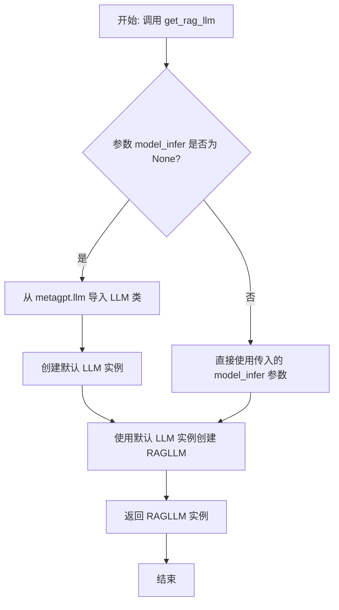
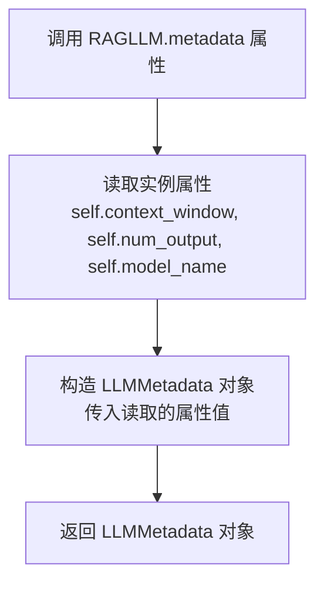
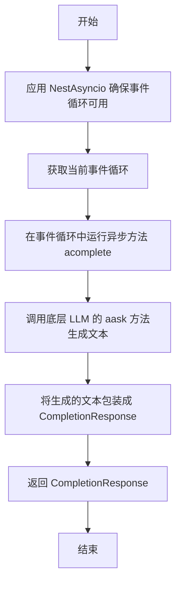
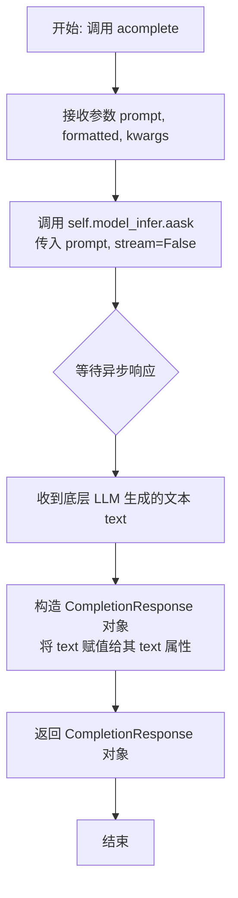
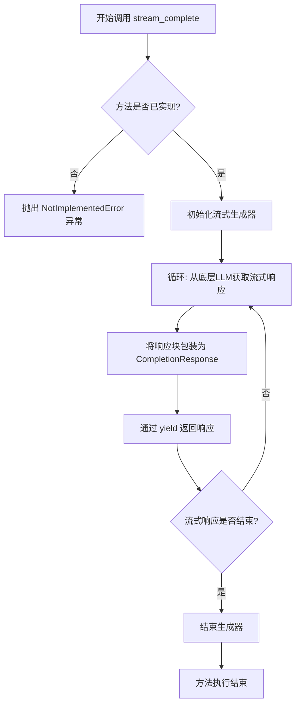

# `.\MetaGPT\metagpt\rag\factories\llm.py` 详细设计文档

该代码定义了一个名为 RAGLLM 的适配器类，它继承自 LlamaIndex 的 CustomLLM 类。其核心功能是将 MetaGPT 框架中的 LLM（大语言模型）包装成符合 LlamaIndex 接口规范的 LLM 对象，从而允许 MetaGPT 的 LLM 能力被 LlamaIndex 的 RAG（检索增强生成）框架所使用。它通过实现 complete、acomplete 等方法，将请求转发给底层的 MetaGPT LLM 实例，并处理相关的配置（如上下文窗口大小、最大输出令牌数）。

## 整体流程

```mermaid
graph TD
    A[开始] --> B[初始化 RAGLLM]
    B --> C{参数是否提供?}
    C -- 否 --> D[从全局配置 config 中读取]
    C -- 是 --> E[使用传入参数]
    D --> F[设置 model_infer, context_window, num_output, model_name]
    E --> F
    F --> G[调用方（如LlamaIndex）调用 complete/acomplete]
    G --> H[RAGLLM 将请求转发给 model_infer (BaseLLM)]
    H --> I[BaseLLM 执行实际推理]
    I --> J[返回结果给 RAGLLM]
    J --> K[RAGLLM 将结果封装为 CompletionResponse]
    K --> L[返回给调用方]
```

## 类结构

```
RAGLLM (继承自 llama_index.core.llms.CustomLLM)
├── 字段: model_infer, context_window, num_output, model_name
├── 方法: __init__, metadata (property), complete, acomplete, stream_complete
└── 全局函数: get_rag_llm
```

## 全局变量及字段


### `RAGLLM.model_infer`
    
MetaGPT的LLM实例，用于实际执行文本生成任务。

类型：`BaseLLM`
    


### `RAGLLM.context_window`
    
LLM的上下文窗口大小，表示模型能处理的最大token数量。

类型：`int`
    


### `RAGLLM.num_output`
    
LLM生成的最大输出token数量。

类型：`int`
    


### `RAGLLM.model_name`
    
LLM模型的名称标识符。

类型：`str`
    
    

## 全局函数及方法


### `get_rag_llm`

该函数是一个工厂函数，用于创建并返回一个 `RAGLLM` 类的实例。`RAGLLM` 是 `llama_index` 框架中 `CustomLLM` 的一个适配器，其核心目的是将 MetaGPT 框架中的 `BaseLLM` 或其子类（如 `LLM`）包装成 `llama_index` 可以识别和使用的 LLM 接口。这使得用户可以在 `llama_index` 的 RAG（检索增强生成）流程中无缝地使用 MetaGPT 配置和管理的 LLM 模型。

参数：

-  `model_infer`：`BaseLLM`，可选参数。一个实现了 `BaseLLM` 接口的 LLM 实例。如果未提供（默认为 `None`），函数将使用 MetaGPT 的默认 `LLM` 实例。

返回值：`RAGLLM`，返回一个配置好的 `RAGLLM` 实例，该实例封装了指定的或默认的 MetaGPT LLM，并已准备好被 `llama_index` 调用。

#### 流程图



#### 带注释源码

```python
def get_rag_llm(model_infer: BaseLLM = None) -> RAGLLM:
    """Get llm that can be used by LlamaIndex."""
    # 从 metagpt.llm 模块导入 LLM 类。
    # 注意：此导入放在函数内部，可能是为了避免循环依赖或仅在需要时导入。
    from metagpt.llm import LLM

    # 创建并返回 RAGLLM 实例。
    # 逻辑：如果调用者提供了 `model_infer` 参数，则使用它；
    # 否则，创建一个新的 MetaGPT 默认 LLM 实例（LLM()）作为包装对象。
    return RAGLLM(model_infer=model_infer or LLM())
```


### `RAGLLM.__init__`

`RAGLLM` 类的构造函数，用于初始化一个适配 LlamaIndex 框架的 LLM 包装器。它接收一个 MetaGPT 的 `BaseLLM` 实例以及可选的配置参数，并根据全局配置或默认值来设置模型的上下文窗口大小、输出令牌数和模型名称。

参数：

-  `model_infer`：`BaseLLM`，MetaGPT 框架中的 LLM 实例，是实际执行推理的核心组件。
-  `context_window`：`int`，模型的最大上下文窗口大小（令牌数）。若小于0，则从全局配置或默认值中获取。
-  `num_output`：`int`，模型的最大输出令牌数。若小于0，则从全局配置中获取。
-  `model_name`：`str`，模型的名称标识。若为空字符串，则从全局配置中获取。
-  `*args`：`Any`，传递给父类 `CustomLLM` 构造函数的可变位置参数。
-  `**kwargs`：`Any`，传递给父类 `CustomLLM` 构造函数的可变关键字参数。

返回值：`None`，构造函数不返回任何值。

#### 流程图

```mermaid
flowchart TD
    A[开始: RAGLLM.__init__] --> B{context_window < 0?}
    B -- 是 --> C[从配置或默认值<br>获取context_window]
    B -- 否 --> D[使用传入的context_window]
    C --> E
    D --> E{num_output < 0?}
    E -- 是 --> F[从配置获取num_output]
    E -- 否 --> G[使用传入的num_output]
    F --> H
    G --> H{model_name 为空?}
    H -- 是 --> I[从配置获取model_name]
    H -- 否 --> J[使用传入的model_name]
    I --> K
    J --> K[调用父类super().__init__]
    K --> L[设置实例字段<br>model_infer, context_window,<br>num_output, model_name]
    L --> M[结束]
```

#### 带注释源码

```python
def __init__(
    self,
    model_infer: BaseLLM,          # 核心的 MetaGPT LLM 实例
    context_window: int = -1,      # 上下文窗口大小，-1 表示使用默认值
    num_output: int = -1,          # 最大输出令牌数，-1 表示使用默认值
    model_name: str = "",          # 模型名称，空字符串表示使用默认值
    *args,                         # 传递给父类的额外位置参数
    **kwargs                       # 传递给父类的额外关键字参数
):
    # 1. 首先调用父类 CustomLLM 的构造函数
    super().__init__(*args, **kwargs)

    # 2. 处理 context_window 参数：如果未提供（<0），则从配置或全局常量中获取
    if context_window < 0:
        # 从配置的 llm.model 获取对应的 TOKEN_MAX，若不存在则使用 DEFAULT_CONTEXT_WINDOW
        context_window = TOKEN_MAX.get(config.llm.model, DEFAULT_CONTEXT_WINDOW)

    # 3. 处理 num_output 参数：如果未提供（<0），则从全局配置中获取
    if num_output < 0:
        num_output = config.llm.max_token

    # 4. 处理 model_name 参数：如果未提供（空字符串），则从全局配置中获取
    if not model_name:
        model_name = config.llm.model

    # 5. 将处理后的参数赋值给实例变量，完成对象初始化
    self.model_infer = model_infer
    self.context_window = context_window
    self.num_output = num_output
    self.model_name = model_name
```


### `RAGLLM.metadata`

该方法是 `RAGLLM` 类的属性，用于获取封装在 `RAGLLM` 内部的底层 LLM（大语言模型）的元数据信息。它返回一个 `LLMMetadata` 对象，该对象包含了模型上下文窗口大小、最大输出令牌数和模型名称等关键配置信息，这些信息对于 LlamaIndex 框架进行检索增强生成（RAG）的上下文管理和提示构建至关重要。

参数：
-  `self`：`RAGLLM`，`RAGLLM` 类的实例。

返回值：`LLMMetadata`，一个包含底层 LLM 元数据信息的对象，具体包括 `context_window`（上下文窗口大小）、`num_output`（最大输出令牌数）和 `model_name`（模型名称）。

#### 流程图



#### 带注释源码

```python
    @property
    def metadata(self) -> LLMMetadata:
        """Get LLM metadata."""
        # 使用实例初始化时设置的属性值（context_window, num_output, model_name）
        # 来构造并返回一个 LLMMetadata 对象。
        # 这个对象为 LlamaIndex 提供了关于当前 LLM 能力边界的关键信息。
        return LLMMetadata(
            context_window=self.context_window, # 模型能处理的最大上下文长度（令牌数）
            num_output=self.num_output, # 模型单次请求能生成的最大令牌数
            model_name=self.model_name or "unknown" # 底层 LLM 的名称，若未设置则默认为 "unknown"
        )
```


### `RAGLLM.complete`

`RAGLLM.complete` 方法是 `RAGLLM` 类的核心同步完成方法。它接收一个提示词字符串，通过适配器调用底层的 MetaGPT LLM 模型进行文本生成，并将结果包装成 LlamaIndex 框架所需的 `CompletionResponse` 格式返回。该方法内部通过应用 `NestAsyncio` 并运行异步方法 `acomplete` 来实现同步调用。

参数：

-  `prompt`：`str`，输入给语言模型的提示文本。
-  `**kwargs`：`Any`，传递给底层模型调用的其他可选关键字参数。

返回值：`CompletionResponse`，包含由底层 LLM 生成的文本响应的对象。

#### 流程图



#### 带注释源码

```python
    @llm_completion_callback()  # 装饰器，用于集成 LlamaIndex 的回调系统
    def complete(self, prompt: str, **kwargs: Any) -> CompletionResponse:
        # 应用 NestAsyncio 以确保在可能已经存在事件循环的环境中（如 Jupyter Notebook）能正常运行异步代码
        NestAsyncio.apply_once()
        # 获取当前线程的事件循环，并同步地运行异步方法 `acomplete`，等待其完成并返回结果
        return asyncio.get_event_loop().run_until_complete(self.acomplete(prompt, **kwargs))
```


### `RAGLLM.acomplete`

`RAGLLM.acomplete` 是 `RAGLLM` 类的异步方法，其核心功能是作为适配器，将 MetaGPT 框架中的大语言模型（LLM）包装成 LlamaIndex 框架能够使用的 `CustomLLM` 接口。该方法接收一个提示词（prompt），通过内部封装的 MetaGPT LLM 实例进行异步推理，并返回 LlamaIndex 标准格式的完成响应。

参数：

-  `prompt`：`str`，输入给大语言模型的文本提示。
-  `formatted`：`bool`，一个标志位，指示提示词是否已被格式化。在当前实现中未使用。
-  `**kwargs`：`Any`，其他可能传递给底层 LLM 的可选关键字参数。

返回值：`CompletionResponse`，一个包含 LLM 生成的文本响应的 LlamaIndex 标准响应对象。

#### 流程图



#### 带注释源码

```python
@llm_completion_callback()  # 装饰器：用于集成 LlamaIndex 的回调系统，便于跟踪和记录 LLM 调用。
async def acomplete(self, prompt: str, formatted: bool = False, **kwargs: Any) -> CompletionResponse:
    # 核心步骤：调用内部封装的 MetaGPT LLM 实例的异步问答方法。
    # `prompt` 是用户输入的问题或指令。
    # `stream=False` 指定本次调用为非流式（一次性返回全部结果）。
    text = await self.model_infer.aask(msg=prompt, stream=False)

    # 将 MetaGPT LLM 返回的纯文本结果，包装成 LlamaIndex 框架期望的 `CompletionResponse` 对象。
    return CompletionResponse(text=text)
```


### `RAGLLM.stream_complete`

该方法旨在为给定的提示词（prompt）提供流式文本补全功能。它被设计为 LlamaIndex 框架的回调方法，用于在需要流式输出时被调用。然而，在当前的代码实现中，该方法仅包含一个占位符（`...`），表示其功能尚未具体实现，调用此方法将引发 `NotImplementedError` 异常。

参数：

-  `prompt`：`str`，需要模型进行补全或续写的输入文本提示。
-  `**kwargs`：`Any`，其他可能传递给底层大语言模型（LLM）的可选关键字参数。

返回值：`CompletionResponseGen`，一个由 LlamaIndex 定义的生成器类型，用于按顺序（流式）产生 `CompletionResponse` 对象，每个对象包含模型生成的部分文本。

#### 流程图



#### 带注释源码

```python
@llm_completion_callback()  # 装饰器，用于集成LlamaIndex的回调系统，以跟踪和记录LLM调用。
def stream_complete(self, prompt: str, **kwargs: Any) -> CompletionResponseGen:
    ...  # 占位符语法。实际执行时，Python会抛出`NotImplementedError`异常。
         # 这表明该方法是一个待实现的接口，预期功能是调用`self.model_infer`（即底层的MetaGPT LLM）
         # 的流式问答方法（例如`aask(stream=True)`），并将返回的异步流式响应适配并转换为
         # LlamaIndex所需的`CompletionResponseGen`生成器格式。
```


## 关键组件


### RAGLLM 适配器类

作为 MetaGPT LLM 与 LlamaIndex 框架之间的适配器，继承自 LlamaIndex 的 `CustomLLM` 类，使其能够被 LlamaIndex 的 RAG 等组件调用。

### 模型推断接口 (`BaseLLM`)

MetaGPT 框架中定义的底层大语言模型接口，`RAGLLM` 通过包装此接口，将 MetaGPT 的模型能力暴露给 LlamaIndex。

### 配置管理 (`config`)

用于获取全局配置信息，例如默认的上下文窗口大小 (`context_window`)、最大输出令牌数 (`num_output`) 和模型名称 (`model_name`)，以初始化 `RAGLLM` 实例的元数据。

### 异步事件循环适配 (`NestAsyncio`)

一个工具类，用于处理在已有异步事件循环中再次运行异步代码的场景（例如在 Jupyter Notebook 中），确保 `complete` 同步方法能够正确调用底层的异步 `acomplete` 方法。

### 令牌计数器 (`TOKEN_MAX`)

一个字典，映射不同 LLM 模型名称到其对应的最大上下文令牌数，用于在未显式指定 `context_window` 时提供合理的默认值。

### 工厂函数 (`get_rag_llm`)

一个便捷的工厂函数，用于创建 `RAGLLM` 实例。当未提供 `model_infer` 参数时，默认使用 MetaGPT 的 `LLM` 单例。


## 问题及建议


### 已知问题

-   **`stream_complete` 方法未实现**：`RAGLLM` 类中的 `stream_complete` 方法仅包含占位符 (`...`)，这意味着流式输出功能完全不可用。如果 LlamaIndex 框架或使用此适配器的代码尝试调用此方法，将会引发 `NotImplementedError` 或类似错误，导致程序中断。
-   **硬编码的配置依赖**：在 `__init__` 方法中，当 `context_window`、`num_output` 和 `model_name` 参数未提供时，直接从全局配置 `config.llm` 中读取默认值。这降低了类的可测试性和灵活性，使其难以在脱离特定配置环境（如 `config.yaml`）的情况下使用或进行单元测试。
-   **潜在的循环依赖风险**：`get_rag_llm` 函数在内部从 `metagpt.llm` 导入 `LLM` 类。如果 `metagpt.llm` 模块反过来导入了 `RAGLLM` 或相关模块，可能会形成循环导入，导致导入错误或运行时问题。
-   **异步事件循环的强制应用**：在同步方法 `complete` 中，使用了 `NestAsyncio.apply_once()` 来允许在可能已存在事件循环的环境中运行异步代码。这是一种针对特定环境（如 Jupyter Notebook）的变通方案，可能掩盖了底层真正的异步调用设计问题，并且在非预期环境中可能引发副作用或错误。

### 优化建议

-   **实现 `stream_complete` 方法**：应完整实现 `stream_complete` 方法，使其能够调用底层 `BaseLLM` 实例的流式输出功能（如果支持），并返回符合 `CompletionResponseGen` 类型的生成器。如果底层 LLM 不支持流式输出，该方法应明确抛出 `NotImplementedError` 并附上清晰的说明，或者回退到非流式处理并给出警告。
-   **解耦配置，增强可注入性**：建议将默认值作为类级别常量或通过构造函数参数更明确地注入。例如，可以修改 `__init__` 方法，接受一个可选的 `config` 对象或字典作为参数，而不是直接读取全局 `config`。这样能提高代码的模块化和可测试性。
-   **重构导入以避免循环依赖**：检查项目结构，确保 `metagpt.llm` 模块不会导入 `RAGLLM`。如果存在循环依赖的风险，可以考虑将 `get_rag_llm` 函数移到更合适的模块，或者使用局部导入（就像当前代码所做的那样）但需确保调用路径不会形成闭环。更好的做法是让 `RAGLLM` 的创建完全由外部依赖注入控制。
-   **审查并明确异步调用模式**：重新评估 `complete` 方法的设计。如果同步调用是必须支持的接口，考虑是否可以在类初始化时或首次调用时更优雅地处理事件循环问题，或者提供明确的文档说明该方法的使用环境限制。理想情况下，应鼓励用户直接使用异步的 `acomplete` 方法。
-   **增加类型提示和文档**：为 `__init__` 方法的参数和类字段添加更详细的类型提示和文档字符串。特别是 `**kwargs` 参数，应说明它会被传递给父类 `CustomLLM` 还是底层 `model_infer` 的调用。
-   **考虑错误处理**：在 `acomplete` 方法中，直接调用 `self.model_infer.aask` 并返回结果。建议增加基本的错误处理（如 `try-except` 块），将底层 LLM 可能抛出的异常转换为更合适的异常类型或进行日志记录，避免原始异常直接暴露给 LlamaIndex 框架的使用者。


## 其它


### 设计目标与约束

本模块的核心设计目标是创建一个适配器（Adapter）类 `RAGLLM`，它继承自 LlamaIndex 的 `CustomLLM` 类，旨在将 MetaGPT 框架中的 `BaseLLM` 接口适配到 LlamaIndex 框架的 LLM 接口规范中。主要约束包括：1) 必须满足 `CustomLLM` 的抽象接口要求（如 `complete`, `acomplete`, `metadata` 等）；2) 需要处理 MetaGPT 与 LlamaIndex 在上下文长度、最大输出令牌数等配置上的差异；3) 确保异步事件循环在同步调用场景下的兼容性（通过 `NestAsyncio` 工具）。

### 错误处理与异常设计

当前代码中的错误处理较为隐式，主要依赖于底层 `BaseLLM.aask` 方法可能抛出的异常。`__init__` 方法通过 `TOKEN_MAX` 字典和 `config` 对象提供了默认值回退机制，以避免配置缺失导致的错误。`stream_complete` 方法未实现，调用时会抛出 `NotImplementedError`。建议的改进是：在 `complete` 和 `acomplete` 方法中显式捕获 `BaseLLM` 调用异常，并包装或转换为 LlamaIndex 预期的异常类型，同时为 `stream_complete` 提供基础实现或更明确的未实现异常信息。

### 数据流与状态机

本模块不涉及复杂的状态管理。其数据流是线性的：外部调用者（LlamaIndex）通过 `complete` 或 `acomplete` 方法传入提示文本（`prompt`）。`RAGLLM` 实例将此 `prompt` 直接转发给内部封装的 `BaseLLM` 实例（`model_infer`）的 `aask` 方法。`BaseLLM` 处理请求并返回生成的文本，`RAGLLM` 再将此文本包装成 LlamaIndex 的 `CompletionResponse` 对象返回。整个过程中，`RAGLLM` 自身无状态变化，仅作为透明代理。

### 外部依赖与接口契约

1.  **LlamaIndex 框架**：强依赖。必须实现 `llama_index.core.llms.CustomLLM` 的接口契约，特别是 `metadata` 属性、`complete`、`acomplete` 方法。`stream_complete` 方法当前未履行契约。
2.  **MetaGPT 框架**：强依赖。核心功能依赖于 `metagpt.provider.base_llm.BaseLLM` 接口（通过 `model_infer` 字段）及其 `aask` 方法。同时依赖 `metagpt.config2.config` 获取配置，`metagpt.utils.token_counter.TOKEN_MAX` 获取模型令牌上限，以及 `metagpt.utils.async_helper.NestAsyncio` 解决事件循环问题。
3.  **辅助函数**：`get_rag_llm` 函数是模块的主要对外接口，它依赖于 `metagpt.llm.LLM` 类来提供默认的 `BaseLLM` 实例。
4.  **Pydantic**：用于 `RAGLLM` 类的字段定义和数据验证（通过 `Field`）。

### 配置管理与环境假设

模块行为高度依赖外部配置（`metagpt.config2.config`）。`context_window`（上下文窗口大小）、`num_output`（最大输出令牌数）、`model_name` 这三个关键参数在 `__init__` 中通过读取全局 `config` 对象来设置默认值。这假设了 `config.llm.model` 和 `config.llm.max_token` 已被正确配置。`TOKEN_MAX` 字典提供了特定模型名的上下文长度上限，作为 `DEFAULT_CONTEXT_WINDOW` 的补充。环境上假设代码可能运行在需要 `NestAsyncio` 修补的嵌套异步环境中。

### 并发与异步模型

类明确区分了同步接口（`complete`）和异步接口（`acomplete`）。`complete` 方法内部使用了 `NestAsyncio.apply_once()` 来确保在可能已存在事件循环的线程（如 Jupyter Notebook 环境）中能运行异步代码，然后通过 `run_until_complete` 阻塞等待异步结果。`acomplete` 是真正的异步方法，直接 `await` 底层 `BaseLLM.aask` 的调用。这种设计支持了 LlamaIndex 的两种调用模式，但需注意 `NestAsyncio` 的使用可能带来的性能影响或与某些异步框架的兼容性问题。`stream_complete` 方法预期支持流式响应，但尚未实现。

    