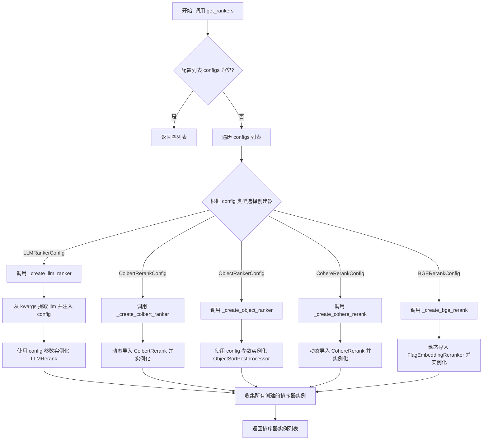
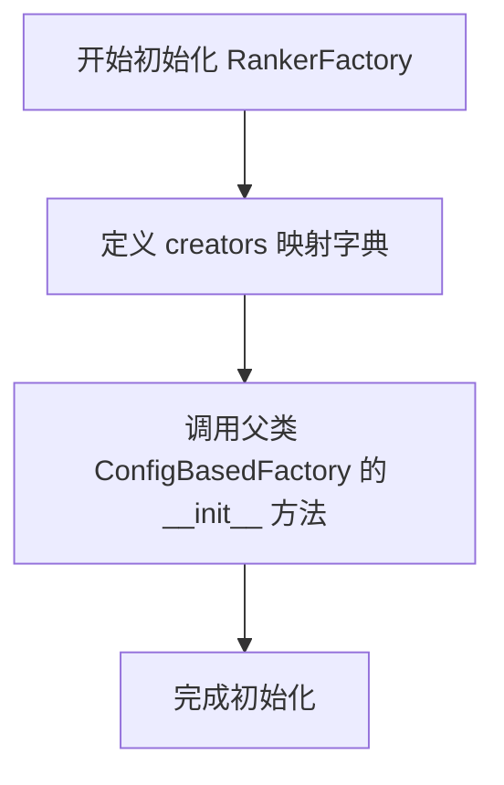
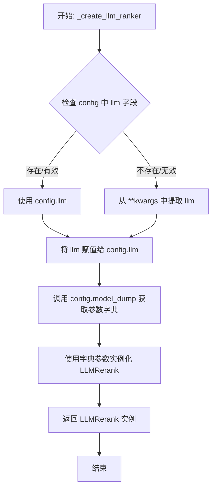
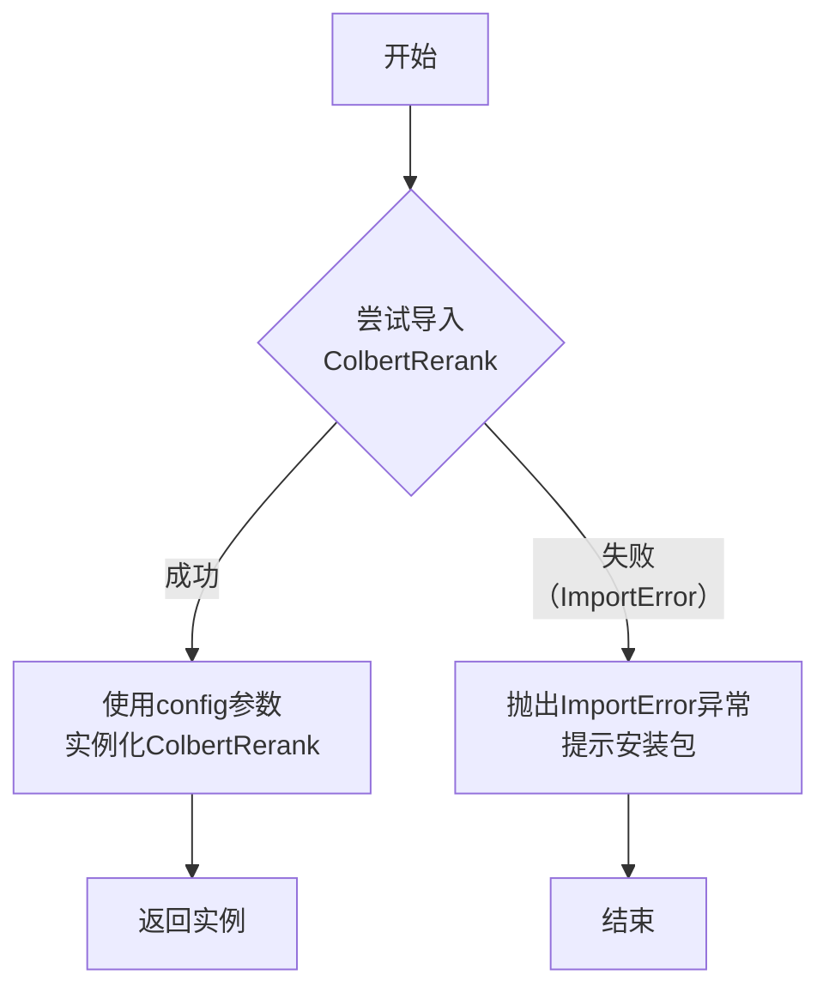
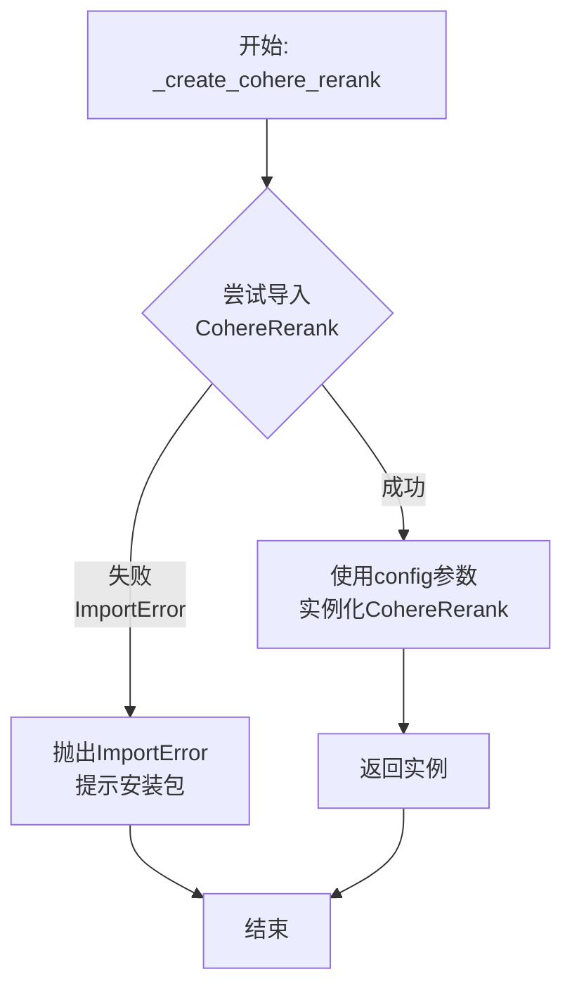
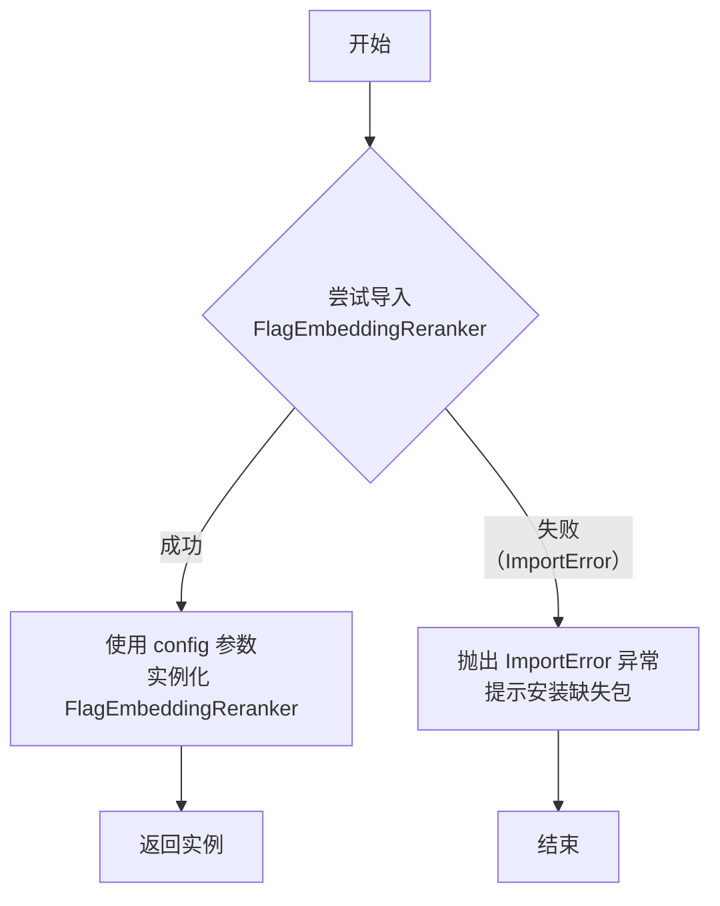
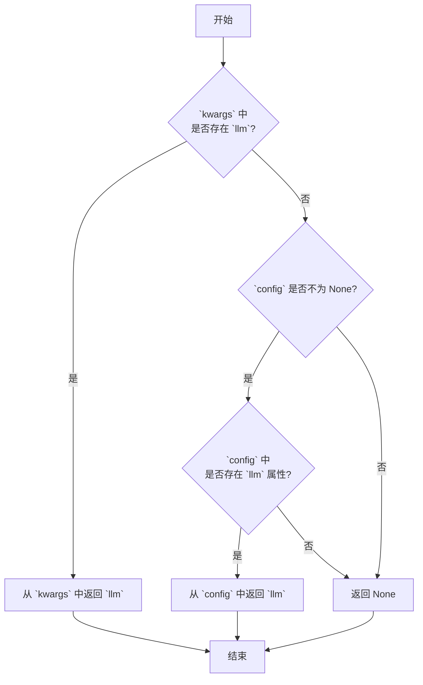

# `.\MetaGPT\metagpt\rag\factories\ranker.py` 详细设计文档

该文件实现了一个基于配置的排序器（Ranker）工厂（RankerFactory），用于根据不同的配置对象动态创建和返回用于RAG（检索增强生成）系统的节点后处理器（BaseNodePostprocessor），这些后处理器主要用于对检索到的文档块进行重新排序和精排。

## 整体流程



## 类结构

```
ConfigBasedFactory (基类，来自 metagpt.rag.factories.base)
└── RankerFactory (排序器工厂)
    ├── 内部方法: __init__, get_rankers
    ├── 私有创建方法: _create_llm_ranker, _create_colbert_ranker, _create_object_ranker, _create_cohere_rerank, _create_bge_rerank
    └── 私有工具方法: _extract_llm
```

## 全局变量及字段


### `get_rankers`
    
RankerFactory类的get_rankers方法的单例函数，用于根据配置列表创建并返回排序器实例。

类型：`function`
    


    

## 全局函数及方法

### `RankerFactory.__init__`

该方法初始化 `RankerFactory` 类，创建一个配置到具体创建方法的映射字典，并调用父类的初始化方法进行注册。

参数：
-  `self`：`RankerFactory`，表示 `RankerFactory` 类的实例本身。

返回值：`None`，此方法不返回任何值。

#### 流程图



#### 带注释源码

```python
def __init__(self):
    # 创建一个字典，将不同的配置类映射到对应的创建方法
    creators = {
        LLMRankerConfig: self._create_llm_ranker,        # LLM 重排器创建方法
        ColbertRerankConfig: self._create_colbert_ranker, # Colbert 重排器创建方法
        ObjectRankerConfig: self._create_object_ranker,   # 对象排序器创建方法
        CohereRerankConfig: self._create_cohere_rerank,   # Cohere 重排器创建方法
        BGERerankConfig: self._create_bge_rerank,         # BGE 重排器创建方法
    }
    # 调用父类 ConfigBasedFactory 的初始化方法，传入 creators 字典进行注册
    super().__init__(creators)
```

### `RankerFactory.get_rankers`

该方法是一个工厂方法，用于根据传入的排序器配置列表，动态创建并返回对应的排序器（`BaseNodePostprocessor`）实例列表。它继承自`ConfigBasedFactory`，通过内部注册的创建器映射，将配置类型与具体的创建方法绑定，实现了配置驱动的对象实例化。

参数：

- `configs`：`list[BaseRankerConfig]`，一个排序器配置对象的列表。如果为`None`或空列表，则返回空列表。
- `**kwargs`：`Any`，可选的关键字参数，用于向底层的创建方法传递额外的上下文或依赖（例如LLM实例）。

返回值：`list[BaseNodePostprocessor]`，一个由排序器实例组成的列表。

#### 流程图

```mermaid
flowchart TD
    A[开始: get_rankers(configs, **kwargs)] --> B{configs 是否为空?}
    B -- 是 --> C[返回空列表 []]
    B -- 否 --> D[调用父类方法 super().get_instances(configs, **kwargs)]
    D --> E[遍历 configs 列表]
    E --> F{根据 config 类型<br>查找对应的创建方法}
    F --> G[调用对应的创建方法<br>（如 _create_llm_ranker）]
    G --> H[创建并返回排序器实例]
    H --> I[收集所有实例到列表]
    I --> J[返回排序器实例列表]
```

#### 带注释源码

```python
def get_rankers(self, configs: list[BaseRankerConfig] = None, **kwargs) -> list[BaseNodePostprocessor]:
    """Creates and returns a retriever instance based on the provided configurations."""
    # 1. 边界条件检查：如果配置列表为空或None，直接返回空列表，避免不必要的处理。
    if not configs:
        return []

    # 2. 调用父类 `ConfigBasedFactory` 的 `get_instances` 方法。
    #    该方法会遍历 `configs` 列表，并根据每个配置对象的类型（如 LLMRankerConfig），
    #    从 `self._creators` 字典中找到对应的创建方法（如 `_create_llm_ranker`），
    #    然后调用该方法并传入当前配置和 `kwargs` 来创建具体的排序器实例。
    #    最后将所有创建的实例收集到一个列表中并返回。
    return super().get_instances(configs, **kwargs)
```

### `RankerFactory._create_llm_ranker`

该方法根据传入的 `LLMRankerConfig` 配置对象，创建一个基于大语言模型（LLM）的重新排序器（`LLMRerank`）实例。其核心逻辑是先从配置或关键字参数中提取 `LLM` 实例，然后使用配置中的所有参数来实例化 `LLMRerank`。

参数：
- `config`：`LLMRankerConfig`，包含创建 `LLMRerank` 所需的所有配置参数，特别是 `llm` 字段。
- `**kwargs`：`dict`，可选的关键字参数，可用于覆盖或提供配置中未指定的参数（例如 `llm`）。

返回值：`LLMRerank`，一个基于LLM的节点后处理器，用于对检索到的节点进行重新排序。

#### 流程图



#### 带注释源码

```python
def _create_llm_ranker(self, config: LLMRankerConfig, **kwargs) -> LLMRerank:
    # 核心步骤1：从配置对象或关键字参数中提取 LLM 实例。
    # 该方法会优先检查 `config` 对象中是否包含 `llm` 字段，
    # 如果没有，则从 `**kwargs` 中查找名为 'llm' 的参数。
    # 提取到的 LLM 实例被设置回 `config.llm`，确保后续使用正确的模型。
    config.llm = self._extract_llm(config, **kwargs)

    # 核心步骤2：创建并返回 LLMRerank 实例。
    # 使用 `config.model_dump()` 将配置对象转换为字典，
    # 然后使用字典解包 (**) 的方式将所有参数传递给 `LLMRerank` 的构造函数。
    # 这确保了配置中的所有设置（如 top_n, choice_batch_size 等）都被正确应用。
    return LLMRerank(**config.model_dump())
```

### `RankerFactory._create_colbert_ranker`

该方法用于根据 `ColbertRerankConfig` 配置，动态创建并返回一个 ColbertRerank 重排序器实例。它主要负责处理 ColBERT 模型的重排序功能，通过动态导入 `llama-index-postprocessor-colbert-rerank` 包中的 `ColbertRerank` 类，并使用提供的配置参数进行实例化。

参数：

- `config`：`ColbertRerankConfig`，包含创建 ColbertRerank 实例所需的配置参数。
- `**kwargs`：`dict`，额外的关键字参数，在此方法中未直接使用，但为保持接口一致性而保留。

返回值：`LLMRerank`，返回一个基于 ColBERT 模型的重排序器实例。

#### 流程图



#### 带注释源码

```python
def _create_colbert_ranker(self, config: ColbertRerankConfig, **kwargs) -> LLMRerank:
    # 尝试动态导入 ColbertRerank 类，该功能依赖于外部包 `llama-index-postprocessor-colbert-rerank`
    try:
        from llama_index.postprocessor.colbert_rerank import ColbertRerank
    except ImportError:
        # 如果导入失败，抛出 ImportError 异常，并给出清晰的安装指引
        raise ImportError(
            "`llama-index-postprocessor-colbert-rerank` package not found, please run `pip install llama-index-postprocessor-colbert-rerank`"
        )
    # 导入成功后，使用传入的配置对象（config）的 model_dump() 方法获取参数字典，
    # 并用这些参数实例化 ColbertRerank 对象，最后返回该实例。
    return ColbertRerank(**config.model_dump())
```

### `RankerFactory._create_object_ranker`

该方法根据传入的 `ObjectRankerConfig` 配置对象，实例化并返回一个 `ObjectSortPostprocessor` 排序器。

参数：
- `config`：`ObjectRankerConfig`，对象排序器的配置对象，包含实例化 `ObjectSortPostprocessor` 所需的参数。
- `**kwargs`：`dict`，额外的关键字参数，在本方法中未直接使用，但为保持接口一致性而保留。

返回值：`LLMRerank`，实际返回的是 `ObjectSortPostprocessor` 的实例，它是 `BaseNodePostprocessor` 的子类，用于对检索到的对象节点进行排序。

#### 流程图

```mermaid
flowchart TD
    A[开始] --> B{接收参数<br>config, **kwargs}
    B --> C[调用 config.model_dump()<br>获取配置字典]
    C --> D[实例化 ObjectSortPostprocessor<br>传入配置字典]
    D --> E[返回 ObjectSortPostprocessor 实例]
    E --> F[结束]
```

#### 带注释源码

```python
def _create_object_ranker(self, config: ObjectRankerConfig, **kwargs) -> LLMRerank:
    # 使用传入的配置对象 `config`，调用其 `model_dump()` 方法将配置转换为字典。
    # 然后，使用字典解包的方式，将配置参数传递给 `ObjectSortPostprocessor` 的构造函数，创建其实例。
    # 最后，返回这个新创建的排序器实例。
    return ObjectSortPostprocessor(**config.model_dump())
```

### `RankerFactory._create_cohere_rerank`

该方法用于根据 `CohereRerankConfig` 配置，动态创建并返回一个 Cohere 重排序器 (`CohereRerank`) 实例。它主要负责处理外部依赖的导入，并在依赖未安装时提供清晰的错误提示。

参数：

- `config`：`CohereRerankConfig`，包含创建 Cohere 重排序器所需的所有配置参数。
- `**kwargs`：`dict`，额外的关键字参数，在此方法中未直接使用，但为保持接口一致性而保留。

返回值：`LLMRerank`，返回一个基于 Cohere API 的、实现了 `BaseNodePostprocessor` 接口的重排序器实例。

#### 流程图



#### 带注释源码

```python
def _create_cohere_rerank(self, config: CohereRerankConfig, **kwargs) -> LLMRerank:
    # 尝试从 llama_index 的扩展包中导入 CohereRerank 类
    try:
        from llama_index.postprocessor.cohere_rerank import CohereRerank
    except ImportError:
        # 如果导入失败（通常是因为对应的包未安装），抛出一个清晰的 ImportError 异常
        # 异常信息指导用户安装必要的包：`llama-index-postprocessor-cohere-rerank`
        raise ImportError(
            "`llama-index-postprocessor-cohere-rerank` package not found, "
            "please run `pip install llama-index-postprocessor-cohere-rerank`"
        )
    # 导入成功后，将配置对象 `config` 转换为字典，并解包作为参数传递给 CohereRerank 构造函数
    # 创建并返回 CohereRerank 的实例
    return CohereRerank(**config.model_dump())
```

### `RankerFactory._create_bge_rerank`

该方法用于根据 `BGERerankConfig` 配置，动态创建并返回一个基于 BGE (BAAI General Embedding) 模型的 FlagEmbeddingReranker 重排序器实例。它主要负责处理外部依赖的导入和实例化。

参数：

- `config`：`BGERerankConfig`，包含创建 BGE 重排序器所需的所有配置参数。
- `**kwargs`：`dict`，额外的关键字参数，在本方法中未直接使用，但为保持接口一致性而保留。

返回值：`FlagEmbeddingReranker`，一个已初始化的、基于 BGE 模型的重排序器对象。

#### 流程图



#### 带注释源码

```python
def _create_bge_rerank(self, config: BGERerankConfig, **kwargs) -> LLMRerank:
    # 尝试从 llama_index 的特定模块导入 FlagEmbeddingReranker 类
    try:
        from llama_index.postprocessor.flag_embedding_reranker import (
            FlagEmbeddingReranker,
        )
    except ImportError:
        # 如果导入失败（通常是因为未安装对应的Python包），则抛出 ImportError 异常
        # 异常信息中包含明确的安装指令，指导用户解决问题
        raise ImportError(
            "`llama-index-postprocessor-flag-embedding-reranker` package not found, please run `pip install llama-index-postprocessor-flag-embedding-reranker`"
        )
    # 导入成功后，使用传入的配置对象（config）的 model_dump() 方法
    # 将其转换为字典，并使用字典解包的方式作为参数，创建并返回 FlagEmbeddingReranker 实例
    return FlagEmbeddingReranker(**config.model_dump())
```

### `RankerFactory._extract_llm`

该方法是一个辅助函数，用于从传入的配置对象或关键字参数中提取 `LLM` 实例。它遵循一个优先级逻辑：优先从 `kwargs` 中获取，如果不存在，则尝试从 `config` 对象中获取。这是工厂模式中用于依赖注入和配置管理的常见方法。

参数：
- `config`：`BaseRankerConfig`，可选的配置对象，可能包含 `llm` 字段。
- `**kwargs`：`dict`，关键字参数字典，可能包含 `llm` 键。

返回值：`LLM`，提取到的大语言模型实例。

#### 流程图



#### 带注释源码

```python
def _extract_llm(self, config: BaseRankerConfig = None, **kwargs) -> LLM:
    # 调用父类方法，按照优先级从 kwargs 或 config 中提取 'llm' 的值
    # 1. 首先检查 kwargs 中是否有 'llm' 键
    # 2. 如果 kwargs 中没有，且 config 不为 None，则检查 config 对象是否有 'llm' 属性
    # 3. 如果都未找到，则返回 None
    return self._val_from_config_or_kwargs("llm", config, **kwargs)
```

## 关键组件

### RankerFactory

一个基于配置的工厂类，用于动态创建和返回不同类型的重排序器（Reranker）实例。它通过一个配置映射表（creators）将不同的配置类与对应的创建方法关联起来，支持LLM、ColBERT、Object、Cohere和BGE等多种重排序策略。

### ConfigBasedFactory

一个基础的工厂抽象类（从代码上下文推断），RankerFactory继承自它。它定义了通过配置动态创建实例的通用模式，RankerFactory通过覆盖或扩展其creators映射来实现具体的创建逻辑。

### BaseRankerConfig及其子类

一系列配置类（LLMRankerConfig, ColbertRerankConfig, ObjectRankerConfig, CohereRerankConfig, BGERerankConfig），作为创建不同重排序器的蓝图。每个配置类包含了初始化对应重排序器所需的具体参数。

### LLMRerank

由llama_index.core.postprocessor提供的基于大语言模型（LLM）的重排序器。RankerFactory的`_create_llm_ranker`方法使用LLMRankerConfig来实例化它。

### ColbertRerank

由`llama-index-postprocessor-colbert-rerank`包提供的基于ColBERT模型的重排序器。RankerFactory的`_create_colbert_ranker`方法负责其延迟导入和实例化。

### CohereRerank

由`llama-index-postprocessor-cohere-rerank`包提供的基于Cohere API的重排序器。RankerFactory的`_create_cohere_rerank`方法负责其延迟导入和实例化。

### FlagEmbeddingReranker

由`llama-index-postprocessor-flag-embedding-reranker`包提供的基于BGE（BAAI General Embedding）模型的重排序器。RankerFactory的`_create_bge_rerank`方法负责其延迟导入和实例化。

### ObjectSortPostprocessor

由`metagpt.rag.rankers.object_ranker`提供的基于对象排序的重排序器。RankerFactory的`_create_object_ranker`方法使用ObjectRankerConfig来实例化它。

## 问题及建议


### 已知问题

-   **依赖管理脆弱**：`_create_colbert_ranker`、`_create_cohere_rerank` 和 `_create_bge_rerank` 方法在运行时动态导入第三方库。如果依赖包未安装，错误仅在调用对应方法时才会抛出，这可能导致运行时错误，而非在应用启动或工厂初始化时尽早发现。
-   **类型注解不一致**：`_create_object_ranker` 方法的返回类型注解为 `LLMRerank`，但实际返回的是 `ObjectSortPostprocessor` 的实例。这违反了类型安全约定，可能导致静态类型检查工具（如 mypy）报错，并给开发者带来困惑。
-   **配置处理耦合**：`_create_llm_ranker` 方法直接修改传入的 `config` 对象的 `llm` 字段（`config.llm = self._extract_llm(...)`）。这种副作用式的修改可能影响配置对象的原始状态，如果同一配置对象被复用或在其他地方被读取，可能引发不可预期的行为。
-   **工厂方法职责模糊**：`_extract_llm` 方法用于从配置或关键字参数中提取 LLM 实例，但此逻辑仅被 `_create_llm_ranker` 使用。其他创建器方法（如 Cohere, BGE）也可能需要类似的外部资源（如 API Key），但目前没有统一的处理机制，导致扩展性不足。

### 优化建议

-   **强化依赖检查**：考虑在工厂类初始化时（`__init__` 方法中）或通过一个专门的 `check_dependencies` 方法，预先检查所有可能用到的第三方库是否已安装。这可以将依赖缺失的错误提前到应用启动阶段，提高系统的健壮性。
-   **修正类型注解**：将 `_create_object_ranker` 方法的返回类型注解更正为 `ObjectSortPostprocessor`，或者其共同的基类/接口（如果存在），以保持类型系统的准确性。
-   **采用不可变配置**：在修改配置前，先创建配置字典的副本（例如使用 `config.model_dump().copy()`），然后在副本上进行修改。或者，设计一个更清晰的配置合并/覆盖策略，避免直接修改输入对象。
-   **统一资源注入机制**：将 `_extract_llm` 方法泛化，或设计一个更通用的 `_inject_dependencies` 方法。该方法可以接收配置和 `kwargs`，并负责为所有创建器方法注入它们所需的运行时依赖（如 LLM 实例、API 客户端等），使工厂的创建逻辑更加清晰和可扩展。
-   **考虑使用注册机制**：当前工厂支持的 Ranker 类型硬编码在 `__init__` 的 `creators` 字典中。未来可以考虑支持动态注册，允许外部模块在不修改工厂类代码的情况下注册新的 Ranker 类型及其创建函数，提高框架的扩展性。


## 其它


### 设计目标与约束

本模块的核心设计目标是提供一个灵活、可扩展的工厂类（`RankerFactory`），用于根据不同的配置对象（`BaseRankerConfig` 的子类）动态创建对应的重排序器（Reranker）实例。它遵循“开闭原则”，允许通过注册新的配置类与创建方法对来轻松扩展对新重排序器类型的支持，而无需修改工厂的核心逻辑。主要约束包括：1）必须与 `llama-index` 生态中的 `BaseNodePostprocessor` 接口兼容；2）对于部分依赖外部服务的重排序器（如 Cohere, ColBERT），需要处理其可选依赖的导入问题；3）需要支持从配置或关键字参数中提取关键组件（如 `LLM` 实例）。

### 错误处理与异常设计

模块中的错误处理主要针对两类情况：
1.  **依赖缺失错误**：在 `_create_colbert_ranker`、`_create_cohere_rerank` 和 `_create_bge_rerank` 方法中，通过 `try...except ImportError` 来捕获因未安装相应 `llama-index-postprocessor-*` 包而导致的导入错误。当捕获到 `ImportError` 时，抛出一个包含明确安装指令的新 `ImportError` 异常，以指导用户解决问题。
2.  **配置或参数提取错误**：`_extract_llm` 方法（通过 `_val_from_config_or_kwargs`，该方法继承自父类 `ConfigBasedFactory`）负责从配置对象或关键字参数中提取 `LLM` 实例。此过程可能因键不存在或值类型不匹配而引发异常，异常类型和消息由父类方法定义，本模块依赖此机制进行参数验证和传递。

### 数据流与状态机

本模块不维护内部状态，其行为完全由输入驱动，是一个无状态的工厂。数据流如下：
1.  **输入**：用户调用 `get_rankers` 方法，传入一个 `BaseRankerConfig` 子类对象的列表 (`configs`) 和可选的关键字参数 (`kwargs`)。
2.  **处理**：
    *   工厂遍历 `configs` 列表。
    *   对于每个配置对象，根据其类型（`LLMRankerConfig`, `ColbertRerankConfig` 等）从内部映射表 (`creators`) 中选择对应的创建方法。
    *   创建方法被调用，传入当前配置对象和所有 `kwargs`。部分方法（如 `_create_llm_ranker`）会从 `kwargs` 中提取必要组件（如 `llm`）并补充到配置中。
    *   创建方法利用配置对象的 `model_dump()` 方法生成参数字典，并实例化相应的重排序器对象（如 `LLMRerank`, `ColbertRerank`）。
3.  **输出**：所有实例化的重排序器对象被收集到一个列表中并返回。

### 外部依赖与接口契约

1.  **外部库依赖**：
    *   **核心依赖**：`llama_index.core`（用于 `LLM`, `LLMRerank`, `BaseNodePostprocessor` 等基础接口和类）。
    *   **可选/条件依赖**：
        *   `llama-index-postprocessor-colbert-rerank`
        *   `llama-index-postprocessor-cohere-rerank`
        *   `llama-index-postprocessor-flag-embedding-reranker`
    *   **项目内部依赖**：`metagpt.rag.factories.base`, `metagpt.rag.rankers.object_ranker`, `metagpt.rag.schema`。

2.  **接口契约**：
    *   **输入契约**：`get_rankers` 方法接受 `list[BaseRankerConfig]` 类型的配置列表。每个配置对象必须正确初始化其字段，以匹配目标重排序器类的 `__init__` 方法参数。
    *   **输出契约**：返回 `list[BaseNodePostprocessor]`。每个返回的对象都必须是 `llama_index.core.postprocessor.types.BaseNodePostprocessor` 的子类实例，确保它们可以在 `llama-index` 的检索增强生成（RAG）管道中作为后处理器使用。
    *   **工厂契约**：`RankerFactory` 继承自 `ConfigBasedFactory`，并实现了其抽象的 `creators` 映射机制。每个创建方法必须接受一个配置对象和 `**kwargs`，并返回一个 `BaseNodePostprocessor` 实例。
    *   **配置契约**：所有配置类（如 `LLMRankerConfig`）必须继承自 `BaseRankerConfig`，并通常使用 Pydantic 的 `BaseModel` 以提供 `model_dump()` 方法，方便将配置转化为字典用于对象实例化。

    