# `.\MetaGPT\metagpt\rag\factories\retriever.py` 详细设计文档

该代码实现了一个检索器工厂（RetrieverFactory），它基于配置（Config）动态创建和组装不同类型的RAG（检索增强生成）检索器（Retriever），如FAISS、BM25、Chroma、Elasticsearch等，并支持通过混合检索器（SimpleHybridRetriever）组合多个检索器。它封装了底层向量数据库索引的构建、节点和嵌入模型的提取逻辑，提供了一个统一的接口来获取适合特定配置的检索器实例。

## 整体流程

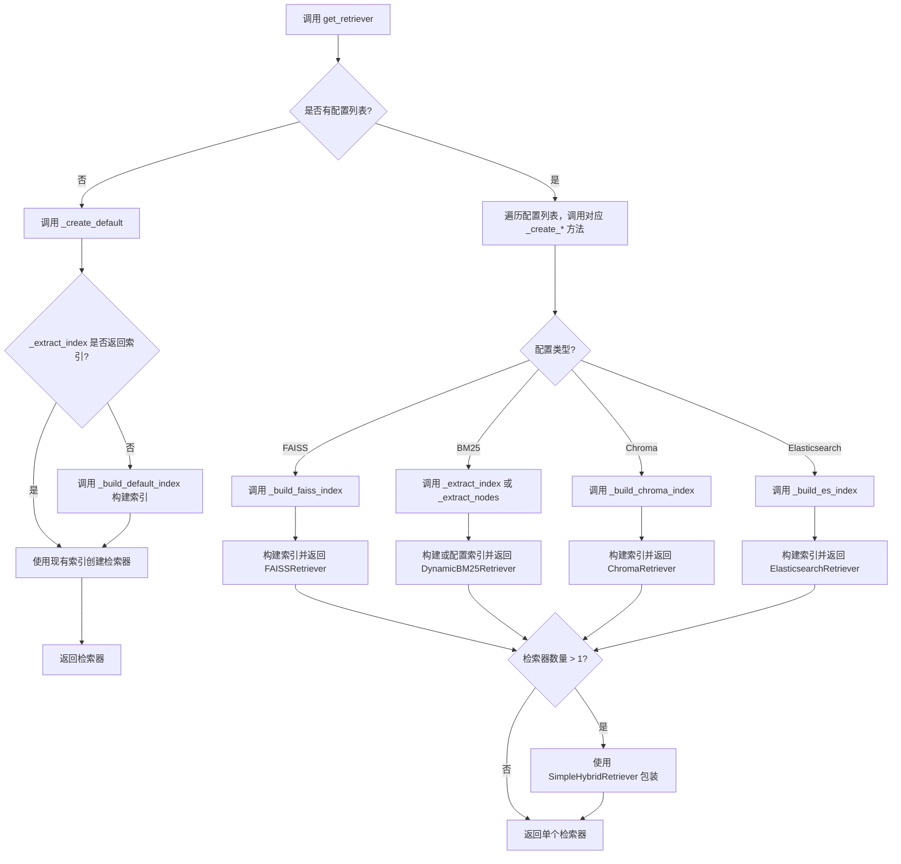

## 类结构

```
ConfigBasedFactory (基类，来自 metagpt.rag.factories.base)
└── RetrieverFactory
    ├── 类方法: __init__, get_retriever, _create_default, _create_faiss_retriever, _create_bm25_retriever, _create_chroma_retriever, _create_es_retriever, _extract_index, _extract_nodes, _extract_embed_model, _build_default_index, _build_faiss_index, _build_chroma_index, _build_es_index, _build_index_from_vector_store
    └── 装饰器函数: get_or_build_index (全局)
```

## 全局变量及字段


### `creators`
    
一个字典，映射配置类到对应的创建者方法，用于根据配置动态实例化检索器。

类型：`dict`
    


    

## 全局函数及方法

### `get_or_build_index`

这是一个装饰器函数，用于包装索引构建方法。其核心逻辑是：首先尝试从配置或关键字参数中提取已存在的索引（通过调用被装饰方法所属对象的 `_extract_index` 方法），如果提取成功则直接返回该索引，否则执行被装饰的原始索引构建函数来创建并返回新索引。这实现了索引的“惰性构建”或“缓存”模式，避免重复构建。

参数：

- `build_index_func`：`Callable`，需要被装饰的原始索引构建函数。

返回值：`Callable`，返回一个新的包装函数（wrapper），该函数实现了“获取或构建”的逻辑。

#### 流程图

```mermaid
flowchart TD
    A[“调用被装饰函数 (wrapper)”] --> B{“调用 _extract_index<br>提取索引”}
    B --> C{“索引存在?”}
    C -- 是 --> D[“返回已存在的索引”]
    C -- 否 --> E[“调用原始构建函数 build_index_func”]
    E --> F[“返回新构建的索引”]
```

#### 带注释源码

```python
def get_or_build_index(build_index_func):
    """Decorator to get or build an index.

    Get index using `_extract_index` method, if not found, using build_index_func.
    """

    @wraps(build_index_func)  # 使用functools.wraps保留原始函数的元信息（如名称、文档字符串）
    def wrapper(self, config, **kwargs):  # 定义包装函数，它将被用来替换原始方法
        index = self._extract_index(config, **kwargs)  # 尝试从当前对象(self)提取索引
        if index is not None:  # 如果索引提取成功（非None）
            return index  # 直接返回已存在的索引，避免重复构建
        return build_index_func(self, config, **kwargs)  # 否则，调用原始构建函数创建新索引

    return wrapper  # 返回包装函数，它将替换原方法
```

### `RetrieverFactory.get_retriever`

该方法是一个工厂方法，用于根据提供的配置列表创建并返回一个检索器实例。如果提供了多个配置，它会创建一个混合检索器（`SimpleHybridRetriever`）来组合它们；如果只提供一个配置，则返回对应的单一检索器；如果没有提供配置，则创建一个默认的基于向量存储索引的检索器。

参数：
- `configs`：`list[BaseRetrieverConfig]`，检索器配置对象的列表。如果为`None`或空，将创建默认检索器。
- `**kwargs`：`Any`，额外的关键字参数，用于传递给内部创建方法，例如`nodes`（文档节点）或`embed_model`（嵌入模型）。

返回值：`RAGRetriever`，一个实现了`RAGRetriever`接口的检索器实例。具体类型取决于输入配置，可能是`FAISSRetriever`、`ChromaRetriever`、`ElasticsearchRetriever`、`DynamicBM25Retriever`或`SimpleHybridRetriever`。

#### 流程图

```mermaid
flowchart TD
    A[开始: get_retriever(configs, **kwargs)] --> B{configs 是否为空或None?}
    B -- 是 --> C[调用 _create_default(**kwargs)]
    C --> D[调用 _extract_index 或 _build_default_index 获取索引]
    D --> E[调用 index.as_retriever]
    E --> F[返回默认检索器]
    B -- 否 --> G[调用父类 get_instances(configs, **kwargs)]
    G --> H{获取的检索器数量 > 1?}
    H -- 是 --> I[创建并返回 SimpleHybridRetriever]
    H -- 否 --> J[返回 retrievers[0]]
```

#### 带注释源码

```python
def get_retriever(self, configs: list[BaseRetrieverConfig] = None, **kwargs) -> RAGRetriever:
    """Creates and returns a retriever instance based on the provided configurations.

    If multiple retrievers, using SimpleHybridRetriever.
    """
    # 检查配置列表是否为空
    if not configs:
        # 如果为空，调用内部方法创建默认检索器
        return self._create_default(**kwargs)

    # 调用父类 ConfigBasedFactory 的 get_instances 方法。
    # 该方法会根据 configs 列表中的每个配置类型，调用在 __init__ 中注册的对应 creator 方法（如 _create_faiss_retriever），
    # 生成一个检索器实例列表。
    retrievers = super().get_instances(configs, **kwargs)

    # 如果生成的检索器多于一个，则用 SimpleHybridRetriever 将它们包装成一个混合检索器。
    # 否则，直接返回列表中的唯一检索器。
    return SimpleHybridRetriever(*retrievers) if len(retrievers) > 1 else retrievers[0]
```

### `RetrieverFactory.__init__`

初始化 `RetrieverFactory` 类，为其配置一个从检索器配置类型到对应创建方法的映射字典，并调用父类的初始化方法。

参数：

-  无显式参数。

返回值：`None`，无返回值。

#### 流程图

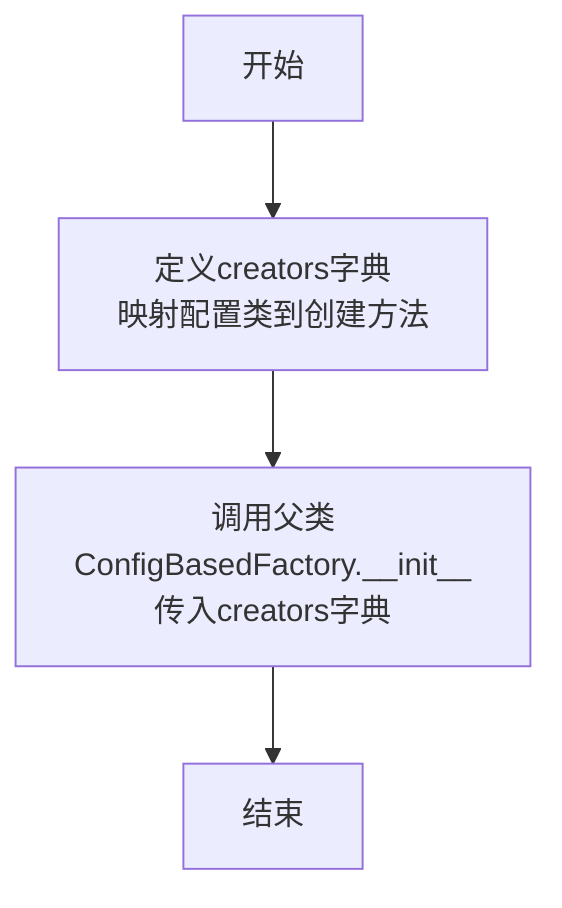

#### 带注释源码

```python
def __init__(self):
    # 创建一个字典，将不同的检索器配置类映射到对应的创建方法。
    # 这是工厂模式的核心，允许根据传入的配置类型动态选择创建逻辑。
    creators = {
        FAISSRetrieverConfig: self._create_faiss_retriever,
        BM25RetrieverConfig: self._create_bm25_retriever,
        ChromaRetrieverConfig: self._create_chroma_retriever,
        ElasticsearchRetrieverConfig: self._create_es_retriever,
        ElasticsearchKeywordRetrieverConfig: self._create_es_retriever,
    }
    # 调用父类 ConfigBasedFactory 的初始化方法，将上面定义的 creators 字典传递给它。
    # 父类会利用这个映射关系来管理对象的创建。
    super().__init__(creators)
```

### `RetrieverFactory.get_retriever`

该方法根据提供的配置列表创建并返回一个检索器实例。如果提供了多个配置，它会创建一个混合检索器（`SimpleHybridRetriever`）来组合它们；如果只提供一个配置，则返回对应的单一检索器。如果没有提供配置，则创建一个默认的向量存储索引检索器。

参数：

- `configs`：`list[BaseRetrieverConfig]`，检索器配置对象的列表。如果为`None`，则使用默认配置。
- `**kwargs`：`Any`，传递给底层创建方法的额外关键字参数。

返回值：`RAGRetriever`，一个实现了`RAGRetriever`接口的检索器实例。

#### 流程图

```mermaid
flowchart TD
    A[开始: get_retriever(configs, **kwargs)] --> B{configs 是否为空?}
    B -- 是 --> C[调用 _create_default(**kwargs)]
    C --> D[返回默认检索器]
    B -- 否 --> E[调用父类 get_instances(configs, **kwargs)]
    E --> F{获取的检索器数量 > 1?}
    F -- 是 --> G[创建并返回 SimpleHybridRetriever]
    F -- 否 --> H[返回 retrievers[0]]
    G --> I[结束]
    H --> I
    D --> I
```

#### 带注释源码

```python
def get_retriever(self, configs: list[BaseRetrieverConfig] = None, **kwargs) -> RAGRetriever:
    """Creates and returns a retriever instance based on the provided configurations.

    If multiple retrievers, using SimpleHybridRetriever.
    """
    # 如果配置列表为空，则创建默认检索器
    if not configs:
        return self._create_default(**kwargs)

    # 调用父类方法，根据配置列表创建对应的检索器实例列表
    retrievers = super().get_instances(configs, **kwargs)

    # 如果创建了多个检索器，则用 SimpleHybridRetriever 包装它们，否则返回单个检索器
    return SimpleHybridRetriever(*retrievers) if len(retrievers) > 1 else retrievers[0]
```

### `RetrieverFactory._create_default`

该方法用于创建一个默认的检索器（RAGRetriever）。当没有提供具体的检索器配置时，它会尝试从给定的关键字参数中提取一个现有的索引（VectorStoreIndex），如果不存在，则构建一个默认的索引，并返回该索引的检索器。

参数：

-  `**kwargs`：`dict`，关键字参数，用于传递构建索引所需的参数，如 `nodes`（文档节点列表）和 `embed_model`（嵌入模型）。

返回值：`RAGRetriever`，一个基于默认索引构建的检索器实例。

#### 流程图

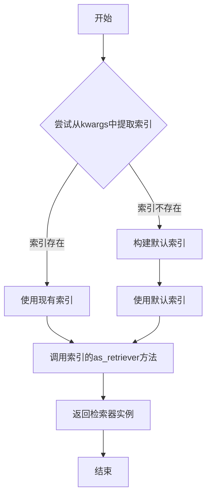

#### 带注释源码

```python
def _create_default(self, **kwargs) -> RAGRetriever:
    # 尝试从关键字参数中提取一个现有的索引
    index = self._extract_index(None, **kwargs) or self._build_default_index(**kwargs)

    # 调用索引的as_retriever方法，返回一个检索器实例
    return index.as_retriever()
```

### `RetrieverFactory._create_faiss_retriever`

该方法根据传入的 `FAISSRetrieverConfig` 配置对象，构建一个 FAISS 向量索引，并最终创建并返回一个 `FAISSRetriever` 检索器实例。

参数：

- `config`：`FAISSRetrieverConfig`，FAISS 检索器的配置对象，包含构建索引所需的参数（如向量维度 `dimensions`）。
- `**kwargs`：`dict`，可选的关键字参数，可能包含用于构建索引的额外数据（如节点 `nodes` 或嵌入模型 `embed_model`）。

返回值：`FAISSRetriever`，一个基于 FAISS 向量索引构建的检索器实例。

#### 流程图

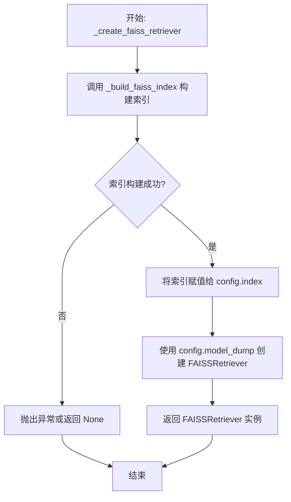

#### 带注释源码

```python
def _create_faiss_retriever(self, config: FAISSRetrieverConfig, **kwargs) -> FAISSRetriever:
    # 核心步骤：调用内部方法构建 FAISS 向量索引。
    # 该方法被 `@get_or_build_index` 装饰器包装，会优先尝试从现有资源中提取索引，避免重复构建。
    config.index = self._build_faiss_index(config, **kwargs)

    # 使用配置对象（config）的字典形式（通过 .model_dump() 获取）作为参数，
    # 实例化并返回 FAISSRetriever。
    # 此时 config 中已包含构建好的 index 字段。
    return FAISSRetriever(**config.model_dump())
```

### `RetrieverFactory._create_bm25_retriever`

该方法根据传入的 `BM25RetrieverConfig` 配置对象，创建一个基于 BM25 算法的动态检索器 (`DynamicBM25Retriever`)。其核心逻辑是：首先尝试从配置或关键字参数中提取已存在的索引 (`index`) 或文档节点 (`nodes`)。如果存在索引，则使用其文档存储中的节点；如果不存在索引但配置要求创建，则使用提取到的节点构建一个模拟嵌入的向量存储索引。最终，使用这些节点和配置参数实例化并返回一个 `DynamicBM25Retriever`。

参数：
- `config`：`BM25RetrieverConfig`，BM25检索器的配置对象，包含索引、节点、是否创建索引等参数。
- `**kwargs`：`dict`，可选的关键字参数，可能包含 `index` 或 `nodes` 等用于覆盖或补充配置的值。

返回值：`DynamicBM25Retriever`，一个基于 BM25 算法的动态检索器实例。

#### 流程图

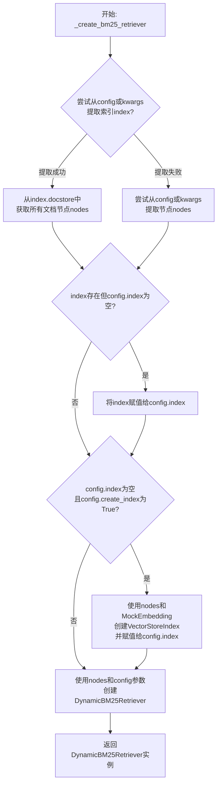

#### 带注释源码

```python
def _create_bm25_retriever(self, config: BM25RetrieverConfig, **kwargs) -> DynamicBM25Retriever:
    # 1. 尝试从配置或关键字参数中提取索引
    index = self._extract_index(config, **kwargs)
    # 2. 如果存在索引，则从索引的文档存储中获取所有节点；否则，尝试直接提取节点。
    nodes = list(index.docstore.docs.values()) if index else self._extract_nodes(config, **kwargs)

    # 3. 如果存在索引但配置对象中的index字段为空，则将提取到的索引赋值给配置对象。
    if index and not config.index:
        config.index = index

    # 4. 如果配置对象中没有索引，但配置要求创建索引，则使用提取到的节点创建一个模拟嵌入的向量索引。
    if not config.index and config.create_index:
        config.index = VectorStoreIndex(nodes, embed_model=MockEmbedding(embed_dim=1))

    # 5. 使用节点和配置对象的所有参数（通过model_dump转换为字典）创建并返回BM25检索器。
    return DynamicBM25Retriever(nodes=nodes, **config.model_dump())
```

### `RetrieverFactory._create_chroma_retriever`

该方法根据提供的 `ChromaRetrieverConfig` 配置，构建或获取一个基于 Chroma 向量数据库的索引，并最终实例化并返回一个 `ChromaRetriever` 检索器。

参数：

- `config`：`ChromaRetrieverConfig`，包含构建 Chroma 检索器所需的所有配置信息，如持久化路径、集合名称、元数据等。
- `**kwargs`：`dict`，可选的关键字参数，用于传递额外的上下文信息，例如节点数据或嵌入模型。

返回值：`ChromaRetriever`，一个配置好的、可用于从 Chroma 向量数据库中检索相关文档的检索器实例。

#### 流程图

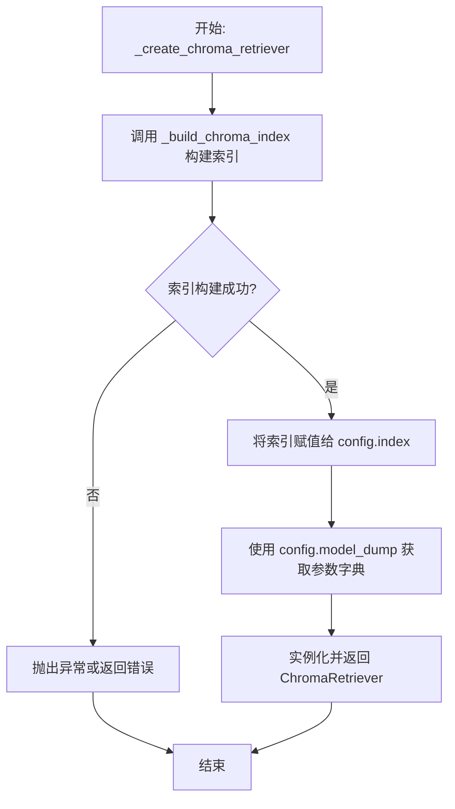

#### 带注释源码

```python
def _create_chroma_retriever(self, config: ChromaRetrieverConfig, **kwargs) -> ChromaRetriever:
    # 核心步骤：调用内部方法构建或获取与 Chroma 数据库关联的 VectorStoreIndex。
    # 此过程可能涉及连接数据库、创建集合、以及将文档节点嵌入并存储到向量库中。
    config.index = self._build_chroma_index(config, **kwargs)

    # 将配置对象（包含新构建的索引）转换为字典，并作为参数传递给 ChromaRetriever 的构造函数。
    # 最终创建并返回一个配置完整的 ChromaRetriever 实例。
    return ChromaRetriever(**config.model_dump())
```

### `RetrieverFactory._create_es_retriever`

该方法根据提供的 `ElasticsearchRetrieverConfig` 配置，构建一个 Elasticsearch 向量存储索引，并实例化并返回一个 `ElasticsearchRetriever` 检索器。

参数：

-  `config`：`ElasticsearchRetrieverConfig`，包含构建 Elasticsearch 检索器所需的配置信息，如 Elasticsearch 连接参数、索引名称等。
-  `**kwargs`：`dict`，可选的关键字参数，可能包含用于构建索引的额外数据，如节点列表或嵌入模型。

返回值：`ElasticsearchRetriever`，一个配置好的 Elasticsearch 检索器实例，用于从 Elasticsearch 向量存储中检索文档。

#### 流程图

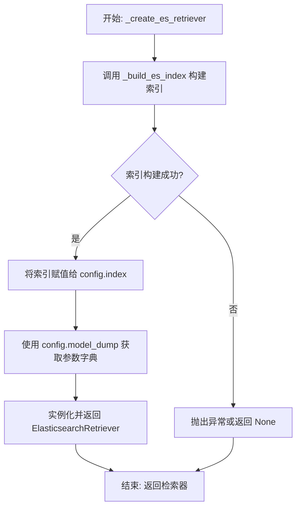

#### 带注释源码

```python
def _create_es_retriever(self, config: ElasticsearchRetrieverConfig, **kwargs) -> ElasticsearchRetriever:
    # 调用内部方法 _build_es_index 来构建或获取一个基于 Elasticsearch 的 VectorStoreIndex。
    # 该方法使用装饰器 `@get_or_build_index`，会先尝试从现有资源中提取索引，如果不存在则新建。
    config.index = self._build_es_index(config, **kwargs)

    # 将配置对象转换为字典，并作为参数传递给 ElasticsearchRetriever 的构造函数。
    # 此时 config 对象中的 index 字段已被填充为构建好的 VectorStoreIndex。
    return ElasticsearchRetriever(**config.model_dump())
```

### `RetrieverFactory._extract_index`

该方法用于从配置对象或关键字参数中提取一个已存在的 `VectorStoreIndex` 实例。它是工厂内部用于复用索引、避免重复构建的关键辅助方法。

参数：

- `config`：`BaseRetrieverConfig`，检索器配置对象，可能包含 `index` 字段。默认为 `None`。
- `**kwargs`：`dict`，关键字参数，可能包含 `index` 键。

返回值：`VectorStoreIndex`，提取到的向量存储索引对象。如果未找到，则返回 `None`。

#### 流程图

```mermaid
graph TD
    A[开始: _extract_index] --> B{config 是否为 None?};
    B -- 是 --> C[从 kwargs 中查找 'index' 键];
    B -- 否 --> D[从 config 对象中查找 'index' 属性];
    C --> E{在 kwargs 中找到 'index'?};
    D --> F{在 config 中找到 'index'?};
    E -- 是 --> G[返回 kwargs['index']];
    E -- 否 --> H[返回 None];
    F -- 是 --> I[返回 config.index];
    F -- 否 --> J[返回 None];
    G --> K[结束];
    H --> K;
    I --> K;
    J --> K;
```

#### 带注释源码

```python
def _extract_index(self, config: BaseRetrieverConfig = None, **kwargs) -> VectorStoreIndex:
    # 调用父类 ConfigBasedFactory 的通用方法，尝试从 config 或 kwargs 中获取名为 'index' 的值。
    # 该方法封装了优先级的逻辑：优先从 config 对象中获取，如果未找到则从 kwargs 中获取。
    return self._val_from_config_or_kwargs("index", config, **kwargs)
```

### `RetrieverFactory._extract_nodes`

该方法用于从配置对象或关键字参数中提取节点列表。它是`RetrieverFactory`类的一个内部辅助方法，旨在统一从不同来源（优先从`config`对象，其次从`kwargs`）获取`nodes`参数的方式，简化了其他构建索引或检索器方法中获取数据的逻辑。

参数：

- `config`：`BaseRetrieverConfig`，检索器配置对象，可能包含`nodes`字段。如果为`None`，则仅从`kwargs`中查找。
- `**kwargs`：`dict`，关键字参数字典，可能包含`nodes`键。

返回值：`list[BaseNode]`，提取到的节点列表。如果`config`和`kwargs`中均未找到`nodes`，则返回`None`。

#### 流程图

```mermaid
flowchart TD
    A[开始: _extract_nodes(config, **kwargs)] --> B{config 不为 None?};
    B -- 是 --> C[尝试从 config 中获取 nodes 属性];
    B -- 否 --> D[尝试从 kwargs 中获取 'nodes' 键];
    C --> E{在 config 中找到 nodes?};
    E -- 是 --> F[返回 config.nodes];
    E -- 否 --> D;
    D --> G{在 kwargs 中找到 'nodes'?};
    G -- 是 --> H[返回 kwargs['nodes']];
    G -- 否 --> I[返回 None];
    F --> J[结束];
    H --> J;
    I --> J;
```

#### 带注释源码

```python
def _extract_nodes(self, config: BaseRetrieverConfig = None, **kwargs) -> list[BaseNode]:
    # 调用父类 ConfigBasedFactory 的通用方法 _val_from_config_or_kwargs
    # 该方法按顺序查找：首先在 config 对象中查找名为 'nodes' 的属性，
    # 如果未找到或 config 为 None，则在 kwargs 字典中查找键为 'nodes' 的值。
    # 返回找到的值，如果都未找到则返回 None。
    return self._val_from_config_or_kwargs("nodes", config, **kwargs)
```

### `RetrieverFactory._extract_embed_model`

该方法用于从配置对象或关键字参数中提取嵌入模型（Embedding Model）。它是工厂内部的一个辅助方法，用于统一获取构建向量索引所需的嵌入模型实例。

参数：

- `config`：`BaseRetrieverConfig`，检索器配置对象，可能包含`embed_model`字段。默认为`None`。
- `**kwargs`：`dict`，关键字参数，可能直接包含`embed_model`键值对。

返回值：`BaseEmbedding`，提取到的嵌入模型实例。如果未找到，则返回`None`。

#### 流程图

```mermaid
flowchart TD
    A[开始] --> B{调用_val_from_config_or_kwargs}
    B --> C[参数: key='embed_model', config, **kwargs]
    C --> D{在config或kwargs中查找}
    D -->|在config中找到| E[返回 config.embed_model]
    D -->|在kwargs中找到| F[返回 kwargs['embed_model']]
    D -->|均未找到| G[返回 None]
    E --> H[结束]
    F --> H
    G --> H
```

#### 带注释源码

```python
def _extract_embed_model(self, config: BaseRetrieverConfig = None, **kwargs) -> BaseEmbedding:
    # 调用父类ConfigBasedFactory的_val_from_config_or_kwargs方法，
    # 该方法会优先从config对象中查找名为'embed_model'的属性，
    # 如果未找到，则从kwargs字典中查找键为'embed_model'的值。
    # 该方法统一了从不同来源获取配置值的逻辑。
    return self._val_from_config_or_kwargs("embed_model", config, **kwargs)
```

### `RetrieverFactory._build_default_index`

该方法用于构建一个默认的向量存储索引。当没有提供特定的检索器配置时，它会使用从参数中提取的文档节点和嵌入模型来创建一个基础的 `VectorStoreIndex` 实例。

参数：

- `**kwargs`：`dict`，关键字参数字典，用于传递额外的配置信息，特别是 `nodes` 和 `embed_model`。

返回值：`VectorStoreIndex`，返回一个基于提供的节点和嵌入模型构建的向量存储索引对象。

#### 流程图

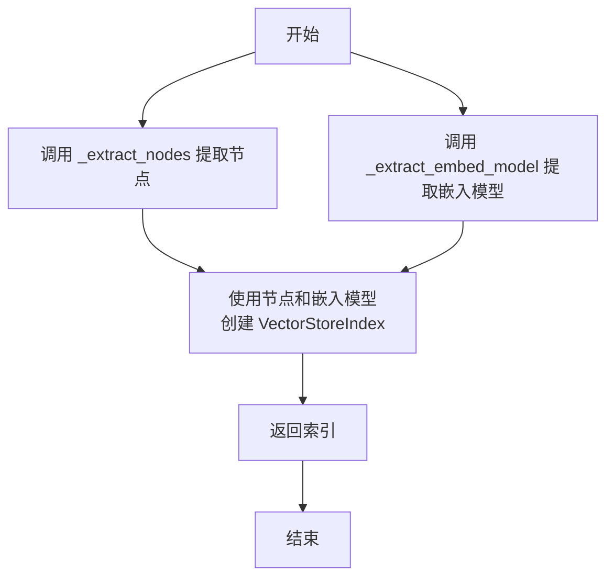

#### 带注释源码

```python
def _build_default_index(self, **kwargs) -> VectorStoreIndex:
    # 调用内部方法从 kwargs 中提取文档节点列表
    nodes = self._extract_nodes(**kwargs)
    # 调用内部方法从 kwargs 中提取嵌入模型
    embed_model = self._extract_embed_model(**kwargs)

    # 使用提取出的节点和嵌入模型创建一个新的 VectorStoreIndex 实例
    index = VectorStoreIndex(
        nodes=nodes,
        embed_model=embed_model,
    )

    # 返回构建好的索引
    return index
```

### `RetrieverFactory._build_faiss_index`

该方法用于构建或获取一个基于FAISS向量数据库的`VectorStoreIndex`。它首先尝试从配置或关键字参数中提取已存在的索引，如果不存在，则创建一个新的FAISS向量存储并构建索引。

参数：

- `config`：`FAISSRetrieverConfig`，FAISS检索器的配置对象，包含构建索引所需的参数，如向量维度（dimensions）。
- `**kwargs`：`dict`，可变关键字参数，用于传递额外的配置信息，如节点（nodes）和嵌入模型（embed_model）。

返回值：`VectorStoreIndex`，一个基于FAISS向量存储构建的索引对象，用于后续的检索操作。

#### 流程图

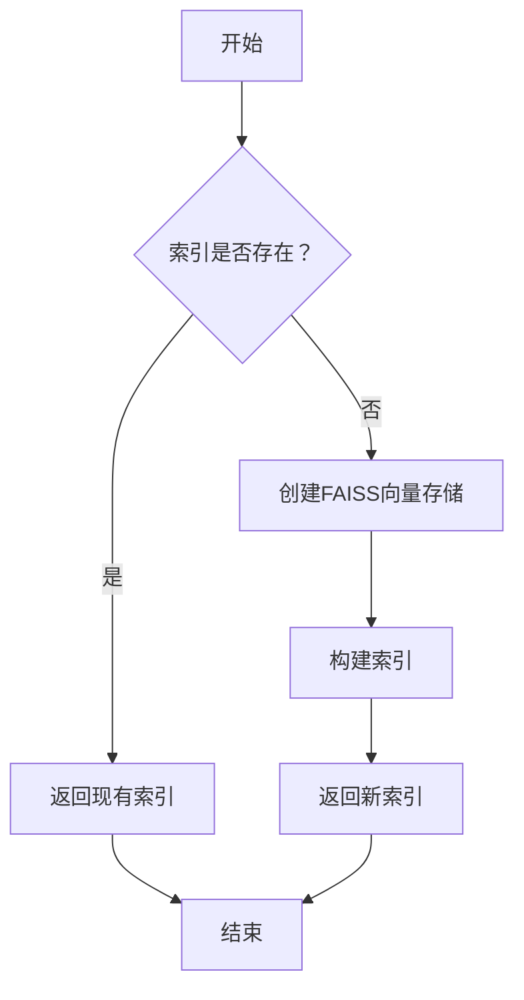

#### 带注释源码

```python
@get_or_build_index  # 装饰器：优先尝试获取现有索引，若不存在则执行此方法
def _build_faiss_index(self, config: FAISSRetrieverConfig, **kwargs) -> VectorStoreIndex:
    # 创建FAISS向量存储，使用L2距离的平面索引
    vector_store = FaissVectorStore(faiss_index=faiss.IndexFlatL2(config.dimensions))

    # 调用通用方法，基于向量存储构建索引
    return self._build_index_from_vector_store(config, vector_store, **kwargs)
```

### `RetrieverFactory._build_chroma_index`

该方法用于构建或获取一个基于Chroma向量数据库的`VectorStoreIndex`。它首先尝试从配置或关键字参数中提取已存在的索引，如果不存在，则创建一个新的Chroma向量存储并构建索引。

参数：

- `config`：`ChromaRetrieverConfig`，包含构建Chroma索引所需的配置信息，如持久化路径、集合名称和元数据。
- `**kwargs`：`dict`，其他关键字参数，可能包含节点、嵌入模型等。

返回值：`VectorStoreIndex`，构建或获取的向量存储索引，用于后续的检索操作。

#### 流程图

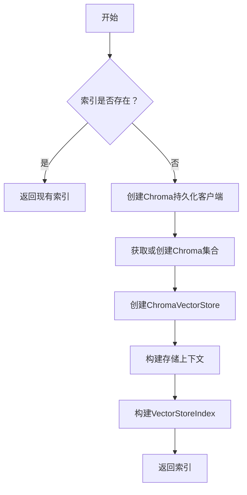

#### 带注释源码

```python
@get_or_build_index  # 装饰器：优先尝试获取现有索引，若不存在则执行此方法
def _build_chroma_index(self, config: ChromaRetrieverConfig, **kwargs) -> VectorStoreIndex:
    # 创建Chroma持久化客户端，指定持久化路径
    db = chromadb.PersistentClient(path=str(config.persist_path))
    # 获取或创建指定名称的Chroma集合，并传入元数据
    chroma_collection = db.get_or_create_collection(config.collection_name, metadata=config.metadata)
    # 基于Chroma集合创建向量存储
    vector_store = ChromaVectorStore(chroma_collection=chroma_collection)

    # 调用通用方法，基于向量存储构建索引
    return self._build_index_from_vector_store(config, vector_store, **kwargs)
```

### `RetrieverFactory._build_es_index`

该方法用于构建或获取一个基于 Elasticsearch 的向量存储索引。它使用装饰器 `@get_or_build_index` 来优先尝试从配置或关键字参数中提取现有索引，如果不存在，则根据提供的配置创建一个新的 Elasticsearch 向量存储，并基于此构建一个 `VectorStoreIndex`。

参数：

- `config`：`ElasticsearchRetrieverConfig`，包含 Elasticsearch 向量存储的配置信息，如连接参数和索引设置。
- `**kwargs`：`dict`，可选的关键字参数，可能包含用于构建索引的额外信息，如节点列表或嵌入模型。

返回值：`VectorStoreIndex`，一个基于 Elasticsearch 向量存储构建的索引对象，用于后续的检索操作。

#### 流程图

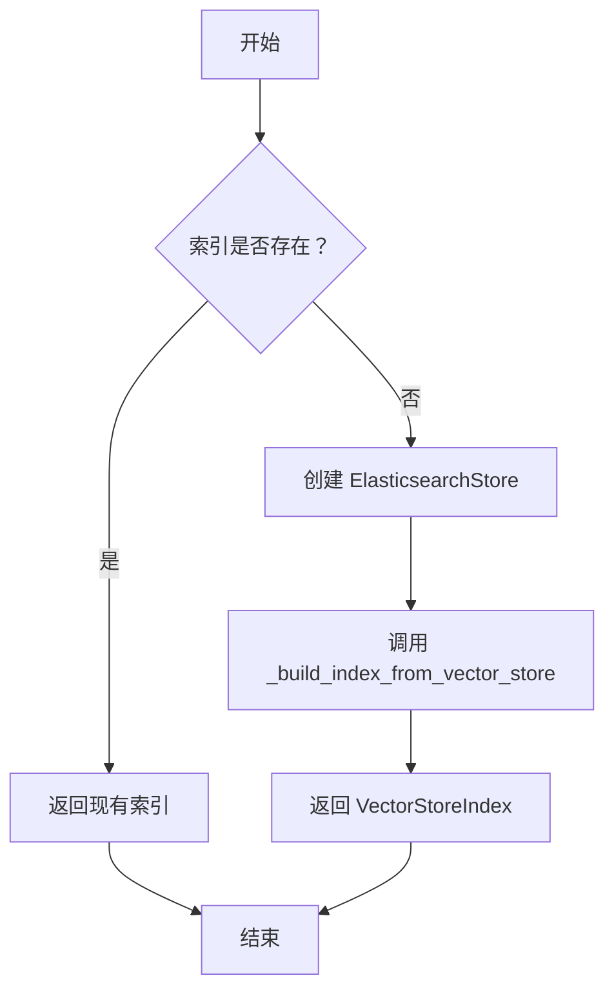

#### 带注释源码

```python
@get_or_build_index  # 装饰器：优先获取现有索引，否则执行此方法构建新索引
def _build_es_index(self, config: ElasticsearchRetrieverConfig, **kwargs) -> VectorStoreIndex:
    # 根据配置创建 Elasticsearch 向量存储实例
    vector_store = ElasticsearchStore(**config.store_config.model_dump())

    # 调用内部方法，使用创建的向量存储、配置和额外参数构建完整的 VectorStoreIndex
    return self._build_index_from_vector_store(config, vector_store, **kwargs)
```

### `RetrieverFactory._build_index_from_vector_store`

该方法根据提供的配置和向量存储，构建并返回一个 `VectorStoreIndex` 对象。它首先创建一个存储上下文，然后使用该上下文、节点列表和嵌入模型来初始化索引。

参数：

- `config`：`BaseRetrieverConfig`，检索器配置对象，用于提取节点和嵌入模型。
- `vector_store`：`BasePydanticVectorStore`，向量存储对象，用于构建索引的存储上下文。
- `**kwargs`：`dict`，其他关键字参数，可能包含节点或嵌入模型。

返回值：`VectorStoreIndex`，构建好的向量存储索引对象。

#### 流程图

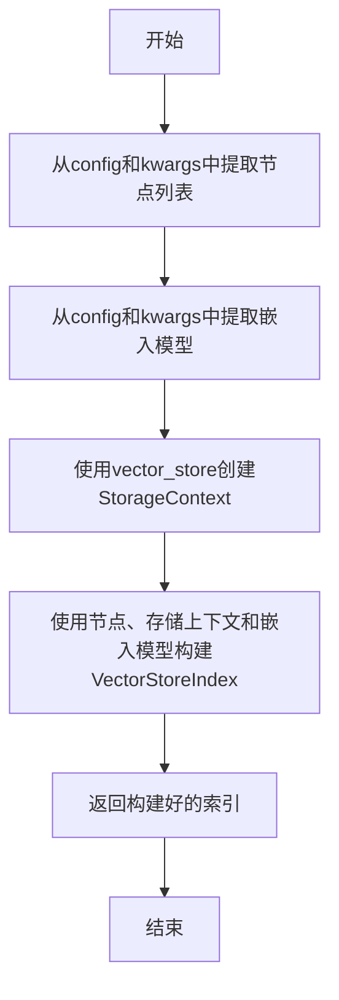

#### 带注释源码

```python
def _build_index_from_vector_store(
    self, config: BaseRetrieverConfig, vector_store: BasePydanticVectorStore, **kwargs
) -> VectorStoreIndex:
    # 使用提供的向量存储创建默认的存储上下文
    storage_context = StorageContext.from_defaults(vector_store=vector_store)
    # 构建并返回VectorStoreIndex，使用从配置和kwargs中提取的节点和嵌入模型
    index = VectorStoreIndex(
        nodes=self._extract_nodes(config, **kwargs),  # 提取节点列表
        storage_context=storage_context,               # 设置存储上下文
        embed_model=self._extract_embed_model(config, **kwargs),  # 提取嵌入模型
    )

    return index  # 返回构建好的索引
```

## 关键组件


### 配置驱动工厂模式 (ConfigBasedFactory)

通过配置对象动态创建和组装不同检索器实例的核心工厂模式，支持单一和混合检索器。

### 检索器创建器映射 (creators)

将特定配置类型映射到对应的内部创建方法，实现基于配置类型的检索器实例化。

### 索引惰性加载与构建 (get_or_build_index 装饰器)

通过装饰器模式实现索引的“获取或构建”逻辑，优先从现有资源提取索引，避免重复构建。

### 混合检索器 (SimpleHybridRetriever)

当提供多个检索器配置时，自动组合多个检索器（如向量检索和关键词检索）形成一个混合检索器。

### 向量存储抽象 (BasePydanticVectorStore)

定义了与不同后端向量数据库（如FAISS、Chroma、Elasticsearch）交互的统一接口，支持索引的持久化与检索。

### 配置类体系 (BaseRetrieverConfig 及其子类)

一系列数据类，用于封装构建特定类型检索器（如FAISS、BM25、Chroma、Elasticsearch）所需的所有参数和配置。


## 问题及建议


### 已知问题

-   **硬编码的配置映射**：`RetrieverFactory.__init__` 方法中，配置类到创建方法的映射 (`creators`) 是硬编码的。这导致添加新的检索器类型（如新的向量数据库）时，必须修改工厂类本身，违反了开闭原则，降低了系统的可扩展性。
-   **装饰器 `get_or_build_index` 的潜在副作用**：`_build_faiss_index`、`_build_chroma_index` 和 `_build_es_index` 方法使用了 `@get_or_build_index` 装饰器。该装饰器会先调用 `_extract_index` 方法。如果 `_extract_index` 返回了一个已存在的索引，装饰器会直接返回该索引，而跳过原方法（即 `_build_*_index`）的执行。这可能导致依赖于原方法内部逻辑（例如，`_build_chroma_index` 中初始化 `chroma_collection` 的逻辑）的后续代码（如 `_create_*_retriever` 方法中访问 `config` 的属性）出现意外行为，因为 `config` 可能未被完整初始化。
-   **`_create_bm25_retriever` 方法逻辑复杂且存在冗余**：该方法包含了多个条件分支来处理索引和节点的提取、索引的创建，逻辑较为复杂。其中 `if index and not config.index:` 和 `if not config.index and config.create_index:` 这两个条件判断可能存在重叠或未覆盖所有情况，增加了理解和维护的难度。
-   **`_extract_index` 等提取方法对 `kwargs` 的依赖**：`_extract_index`、`_extract_nodes`、`_extract_embed_model` 等方法严重依赖于传入的 `**kwargs`。如果调用者没有在 `kwargs` 中提供正确的键，或者工厂内部调用链传递 `kwargs` 时出现遗漏，会导致运行时错误或返回 `None`，错误信息可能不够清晰。
-   **`get_retriever` 全局实例的潜在问题**：模块最后一行 `get_retriever = RetrieverFactory().get_retriever` 创建了一个全局可用的工厂方法实例。虽然方便，但这也意味着工厂状态（尽管当前 `RetrieverFactory` 是无状态的）和其创建逻辑是全局共享的。在多线程环境或需要不同配置的多个应用场景中，这种单例模式可能不够灵活。

### 优化建议

-   **将配置映射改为注册机制**：建议将配置类与创建方法的映射关系从硬编码改为动态注册。可以提供一个类方法（如 `register_creator`）或使用元类/插件机制，允许在运行时或通过配置文件添加新的检索器类型，从而提高框架的扩展性。
-   **重构索引构建逻辑，分离“获取”与“构建”**：考虑将 `get_or_build_index` 装饰器的逻辑内化或显式化。可以为每个 `_build_*_index` 方法明确分离 `_get_existing_index` 和 `_build_new_index` 步骤，并在 `_create_*_retriever` 方法中更清晰地控制流程，避免装饰器带来的隐式控制流，使数据流和依赖关系更加明确。
-   **简化 `_create_bm25_retriever` 方法**：重新审视并简化该方法的逻辑。可以尝试将节点提取、索引检查与创建的步骤拆分成更小的、职责单一的内部方法，并通过清晰的注释说明不同配置路径下的处理逻辑，减少条件嵌套。
-   **增强参数验证与错误提示**：在 `_val_from_config_or_kwargs` 方法（假设存在于父类 `ConfigBasedFactory` 中）或工厂的公共方法入口处，增加对必需参数的验证。当所需参数（如 `nodes`）缺失时，抛出更具描述性的异常（如 `ValueError` 并说明缺失的参数名），而不是在后续步骤中因 `None` 值而失败。
-   **提供工厂实例化选项而非全局单例**：保留 `RetrieverFactory` 类，但移除或淡化全局的 `get_retriever` 实例。鼓励用户在应用代码中显式实例化 `RetrieverFactory`（例如 `factory = RetrieverFactory(); retriever = factory.get_retriever(configs)`）。这样可以更好地支持依赖注入、测试隔离以及需要不同工厂配置的场景。可以在模块中保留一个默认工厂实例作为便捷方式，但需在文档中说明其局限性。


## 其它


### 设计目标与约束

本模块的核心设计目标是提供一个灵活、可扩展的工厂类（`RetrieverFactory`），用于根据不同的配置（`BaseRetrieverConfig` 的子类）动态创建和组合多种检索器（`RAGRetriever`）实例。它遵循“配置驱动”和“开闭原则”，允许轻松添加新的检索器类型而无需修改工厂的核心逻辑。主要约束包括：1) 必须与 `llama_index` 和 `metagpt.rag` 生态中的现有接口（如 `VectorStoreIndex`, `BaseEmbedding`, `BaseNode`）保持兼容；2) 需要支持从配置或关键字参数中提取关键组件（如索引、节点、嵌入模型），以提供灵活的构建方式；3) 对于混合检索场景，需提供默认的简单组合策略（`SimpleHybridRetriever`）。

### 错误处理与异常设计

当前代码中的错误处理较为隐式，主要依赖于底层库（如 `chromadb`, `faiss`, `llama_index`）抛出的异常。工厂方法本身没有显式的异常捕获或转换逻辑。例如，在 `_build_chroma_index` 中，如果 `persist_path` 无效或 `collection_name` 不存在，`chromadb.PersistentClient` 或 `db.get_or_create_collection` 可能会抛出异常，这些异常会直接传播给调用者。这种设计将错误处理的责任交给了上层调用者。潜在的改进点包括：1) 在工厂方法中捕获特定异常并封装为更具业务语义的自定义异常（如 `IndexBuildError`, `ConfigValidationError`）；2) 在 `get_retriever` 方法中验证输入配置列表的有效性；3) 为装饰器 `get_or_build_index` 增加异常处理，确保构建失败时有清晰的错误信息。

### 数据流与状态机

模块内的数据流主要由配置对象驱动。入口点为 `get_retriever` 函数或 `RetrieverFactory.get_retriever` 方法。输入是检索器配置列表（`configs`）和可选的关键字参数（`kwargs`）。工厂根据配置类型映射到对应的创建方法（如 `_create_faiss_retriever`）。每个创建方法负责从配置或 `kwargs` 中提取或构建必要的组件（如 `VectorStoreIndex`），最终实例化并返回特定的 `RAGRetriever` 子类。`get_or_build_index` 装饰器引入了一个缓存/复用逻辑：它首先尝试通过 `_extract_index` 从现有资源中获取索引，如果失败则执行实际的索引构建函数。模块本身是无状态的（`RetrieverFactory` 实例不保存数据），所有状态都封装在传入的配置对象、构建的索引以及最终的检索器实例中。

### 外部依赖与接口契约

1.  **核心框架依赖**：严重依赖 `llama_index.core` 和 `llama_index.vector_stores.*` 提供的抽象（`VectorStoreIndex`, `BaseEmbedding`, `BasePydanticVectorStore`, `StorageContext`）和具体实现（`FaissVectorStore`, `ChromaVectorStore`, `ElasticsearchStore`）。接口契约由这些类的定义决定。
2.  **向量数据库/检索库依赖**：依赖 `faiss`、`chromadb` 和 `elasticsearch`（通过 `ElasticsearchStore`）等第三方库来提供底层的向量存储和检索能力。版本兼容性和客户端配置是重要的外部契约。
3.  **内部项目依赖**：依赖 `metagpt.rag` 模块内定义的配置类（`BaseRetrieverConfig` 及其子类）、检索器类（`RAGRetriever` 及其子类如 `FAISSRetriever`）以及基础工厂类（`ConfigBasedFactory`）。工厂的行为与这些类的结构和 `model_dump()` 方法紧密耦合。
4.  **接口契约**：
    *   `get_retriever` 函数：是模块的主要对外接口，期望接收配置列表并返回一个可用的检索器实例。
    *   `ConfigBasedFactory._val_from_config_or_kwargs` 方法：一个关键的内部接口契约，用于统一从配置对象或关键字参数中提取值。它要求配置对象具有相应的属性。

### 配置管理与扩展性

配置管理通过 `BaseRetrieverConfig` 的派生子类（如 `FAISSRetrieverConfig`, `ChromaRetrieverConfig`）实现。每个配置类封装了初始化特定检索器所需的所有参数。工厂的 `creators` 字典维护了配置类型到创建方法的映射，这是实现扩展性的关键。要添加一种新的检索器类型，需要：1) 定义新的配置类；2) 实现对应的检索器类；3) 在 `RetrieverFactory.__init__` 的 `creators` 字典中添加映射，并实现对应的 `_create_xxx_retriever` 和 `_build_xxx_index` 方法。这种设计符合开闭原则。然而，当前 `_build_index_from_vector_store` 方法假设所有基于向量存储的检索器构建索引的逻辑相同，这可能不适用于未来更特殊的索引构建需求。

### 性能考量与资源管理

1.  **索引构建与持久化**：`_build_chroma_index` 使用 `PersistentClient`，索引会持久化到磁盘，适合生产环境复用。`_build_faiss_index` 默认在内存中创建 `IndexFlatL2`，程序退出后丢失。工厂没有提供索引的持久化保存（`persist`）逻辑，这需要调用者额外处理。
2.  **装饰器缓存**：`get_or_build_index` 装饰器提供了轻量级的“获取或构建”缓存逻辑，但它仅在单次工厂方法调用流程内有效，并非跨请求或会话的全局缓存。这避免了重复构建索引，但每次调用 `get_retriever` 都可能触发新的提取尝试。
3.  **资源清理**：代码没有显式关闭或清理向量数据库连接（如 ChromaDB 的客户端、Elasticsearch 连接）的机制。在长期运行的服务中，可能需要考虑连接池管理或上下文管理器。
4.  **默认检索器**：当 `configs` 为空时，会创建基于 `VectorStoreIndex` 的默认检索器。其性能取决于默认的嵌入模型和节点数量，可能不是最优选择，应确保调用者传入合适的 `embed_model`。

    