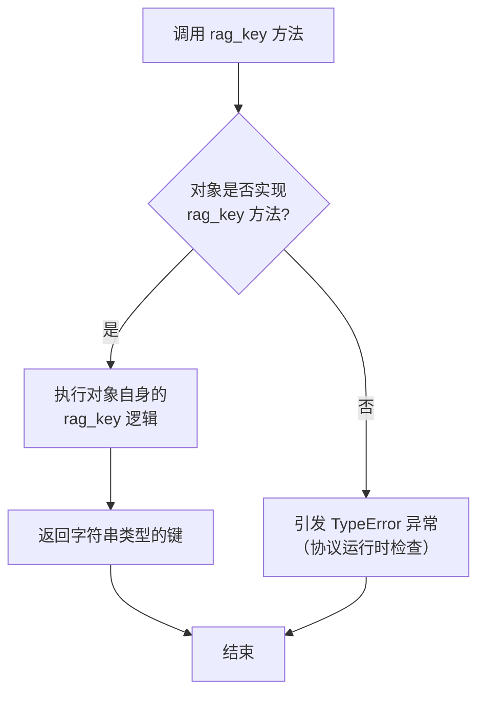
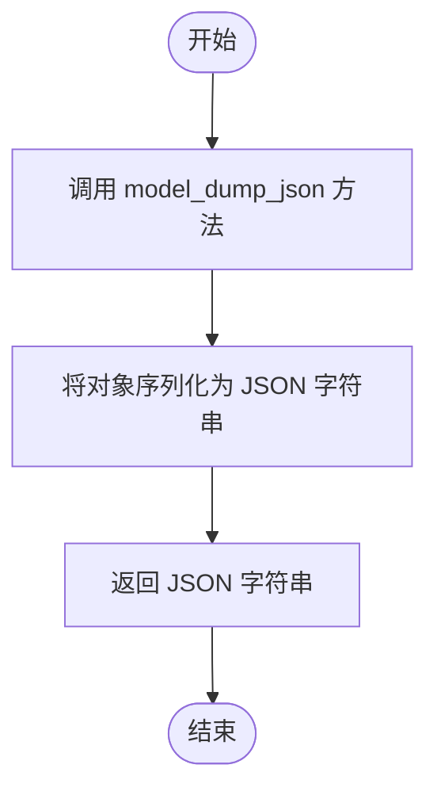

# `.\MetaGPT\metagpt\rag\interface.py` 详细设计文档

该文件定义了两个用于RAG（检索增强生成）系统的协议接口，为需要被RAG系统索引和检索的对象以及不需要嵌入向量的检索器提供了类型化的抽象契约。

## 整体流程

```mermaid
graph TD
    A[定义RAGObject协议] --> B[定义rag_key方法]
    B --> C[定义model_dump_json方法]
    C --> D[定义NoEmbedding协议]
    D --> E[定义_no_embedding标记字段]
    E --> F[使用@runtime_checkable装饰器]
    F --> G[协议定义完成，可供其他类实现]
```

## 类结构

```
Protocol (typing模块)
├── RAGObject (支持RAG检索的对象协议)
└── NoEmbedding (无需嵌入向量的检索器标记协议)
```

## 全局变量及字段


### `NoEmbedding._no_embedding`
    
一个标记字段，用于指示某些检索器（如BM25）不需要进行向量嵌入操作。

类型：`bool`
    
    

## 全局函数及方法


### `RAGObject.rag_key`

`RAGObject.rag_key` 是 `RAGObject` 协议中定义的一个抽象方法，其核心功能是为支持 RAG（检索增强生成）的对象提供一个唯一的、用于检索的键值。这个键值通常用于在向量数据库或其它检索系统中索引和查找该对象。

参数：
-  `self`：`RAGObject` 实例，表示调用该方法的对象本身。

返回值：`str`，返回一个字符串，作为该对象在 RAG 检索系统中的唯一标识或检索键。

#### 流程图



#### 带注释源码

```python
def rag_key(self) -> str:
    """For rag search."""
    # 这是一个协议方法，仅定义了接口。
    # 具体实现应由遵循 `RAGObject` 协议的类提供。
    # 该方法应返回一个字符串，作为该对象在 RAG 检索中的唯一标识符。
    # 例如，可以返回对象的某个唯一ID字段，或由多个字段组合生成的哈希值。
    ...
```


### `RAGObject.model_dump_json`

该方法定义在 `RAGObject` 协议中，用于将对象序列化为 JSON 字符串，以便于 RAG（检索增强生成）系统的持久化存储。它旨在为需要持久化的对象提供一个标准化的序列化接口。

参数：
- `self`：`RAGObject`，调用该方法的 `RAGObject` 协议实现实例。

返回值：`str`，返回对象的 JSON 字符串表示。

#### 流程图



#### 带注释源码

```python
def model_dump_json(self) -> str:
    """For rag persist.

    Pydantic Model don't need to implement this, as there is a built-in function named model_dump_json.
    """
```

## 关键组件


### RAGObject

一个运行时检查协议，定义了支持RAG（检索增强生成）系统添加对象所需的最小接口，包括用于检索的键生成和用于持久化的JSON序列化方法。

### NoEmbedding

一个标记协议，用于标识某些检索器（如BM25）不需要为对象生成嵌入向量，通过一个布尔类型的类属性 `_no_embedding` 来实现。


## 问题及建议


### 已知问题

-   **协议定义不完整**：`RAGObject` 协议中的 `model_dump_json` 方法描述提到 Pydantic 模型有内置方法，但协议本身并未提供默认实现或抽象基类支持，这可能导致非 Pydantic 对象在实现该协议时遇到困难或混淆。
-   **类型提示不精确**：`NoEmbedding` 协议中的 `_no_embedding` 字段被定义为类属性，但未指定其类型（应为 `bool`），这降低了代码的清晰度和静态类型检查工具（如 mypy）的有效性。
-   **协议用途模糊**：`NoEmbedding` 协议仅包含一个标记字段 `_no_embedding`，其设计意图（例如，用于运行时检查或类型提示）不够明确，可能增加代码的理解和维护成本。
-   **缺乏文档和示例**：代码中缺少详细的模块级文档字符串和使用示例，新开发者可能难以快速理解这些协议的设计目的和正确使用方法。

### 优化建议

-   **增强协议定义**：为 `RAGObject` 协议中的 `model_dump_json` 方法提供更通用的描述，或考虑使用 `typing.Protocol` 的 `@abstractmethod` 装饰器（结合 `ABC`）来明确其抽象性质，避免对 Pydantic 的隐性依赖。
-   **完善类型注解**：在 `NoEmbedding` 协议中明确 `_no_embedding` 字段的类型，例如 `_no_embedding: bool = True`，以提高代码的健壮性和可读性。
-   **明确协议设计意图**：考虑为 `NoEmbedding` 协议添加文档字符串，解释其存在的理由和典型使用场景，例如“用于标记那些不需要嵌入向量的检索器（Retriever）”。
-   **补充模块文档**：在模块开头添加全面的文档字符串，说明 `RAGObject` 和 `NoEmbedding` 协议在整个 RAG（检索增强生成）系统中的作用、如何实现它们，以及相关的设计考量。
-   **考虑使用抽象基类（ABC）**：如果这些协议主要用于继承和定义接口，评估是否将 `Protocol` 与 `abc.ABC` 结合使用会更合适，以提供更严格的接口定义和可能的默认实现。
-   **添加单元测试**：为这些协议创建单元测试，验证实现了这些协议的对象是否按预期工作，特别是 `runtime_checkable` 的行为，以确保协议设计的正确性。


## 其它


### 设计目标与约束

本模块旨在定义用于检索增强生成（RAG）系统的核心接口协议。其主要设计目标是提供类型安全的抽象，以支持不同类型的对象（如Pydantic模型）无缝集成到RAG流程中，同时允许某些检索器（如BM25）声明其不依赖嵌入向量的特性。约束包括：必须与Python的类型提示系统（`typing.Protocol`）兼容，支持运行时类型检查（`@runtime_checkable`），并保持接口的简洁性和最小化，避免强制实现不必要的方法。

### 错误处理与异常设计

本模块本身不主动抛出异常。其错误处理主要依赖于Python的类型系统和运行时协议检查。当使用`isinstance(obj, RAGObject)`进行运行时检查时，如果对象未实现所需的协议方法（`rag_key`或`model_dump_json`），将返回`False`。这允许调用方灵活地处理不兼容的对象。`NoEmbedding`协议使用一个标记字段（`_no_embedding: bool`），其存在性由协议检查来验证，而非通过异常来强制。

### 数据流与状态机

本模块定义的是静态接口协议，不涉及具体的数据流或状态管理。它规定了实现类必须提供的数据出口（`rag_key`用于生成检索键，`model_dump_json`用于序列化持久化）和一个可选的标记（`_no_embedding`）。具体的数据流（如对象如何被创建、处理、检索、存储）由实现这些协议的类以及使用它们的RAG系统组件（如检索器、向量数据库）来定义和控制。

### 外部依赖与接口契约

1.  **Python标准库**：依赖`typing`模块中的`Protocol`和`runtime_checkable`装饰器来定义可检查的协议。
2.  **Pydantic（隐含依赖）**：`RAGObject`协议中的`model_dump_json`方法注释明确提到了Pydantic模型，暗示了与该库的兼容性期望。Pydantic模型可以自然满足此协议，但协议本身并不强制依赖Pydantic。
3.  **接口契约**：
    *   `RAGObject`协议：约定实现者必须提供字符串类型的检索键和JSON序列化字符串。
    *   `NoEmbedding`协议：约定实现者必须包含一个布尔类型的`_no_embedding`类属性或实例属性，作为一个标记，表明相关对象或检索器不依赖于嵌入向量。

### 安全与合规考虑

本模块不直接处理用户数据、网络请求或敏感操作，因此不引入特定的安全风险。其安全性与合规性完全取决于实现这些接口的具体类如何管理数据。例如，在`model_dump_json`的实现中，如果序列化的对象包含敏感信息，实现者应负责进行适当的脱敏或加密。协议本身仅定义了数据输出的格式要求。

### 测试策略建议

1.  **单元测试**：为每个实现`RAGObject`或`NoEmbedding`协议的类编写测试，验证其`rag_key`、`model_dump_json`方法的正确性及返回类型，并确认`isinstance(obj, Protocol)`检查通过。
2.  **协议合规性测试**：创建测试用例，确保模拟对象或错误实现的对象无法通过协议检查。
3.  **集成测试**：在使用这些协议的RAG系统组件（如检索器）的测试中，验证协议实现类能够被正确识别和调用。

### 部署与运维考量

作为纯接口定义库，本模块的部署与运维非常简单。它通常作为其他RAG系统组件的依赖项一起打包和分发。需要确保生产环境中的Python解释器版本支持所使用的`typing`特性（如`Protocol`，在Python 3.8+中完全稳定）。在容器化部署时，无需为其配置特殊的运行环境或资源。

### 扩展与维护指南

1.  **扩展接口**：如需增加新的RAG能力要求，可以定义新的协议或扩展现有协议（谨慎进行，避免破坏现有实现）。
2.  **维护兼容性**：对`RAGObject`和`NoEmbedding`协议的修改（如增加新方法）是破坏性变更，需要同步更新所有实现类并考虑版本迁移。
3.  **文档更新**：任何接口的变更或新增，都必须同步更新对应的文档字符串和项目级的API文档。

    