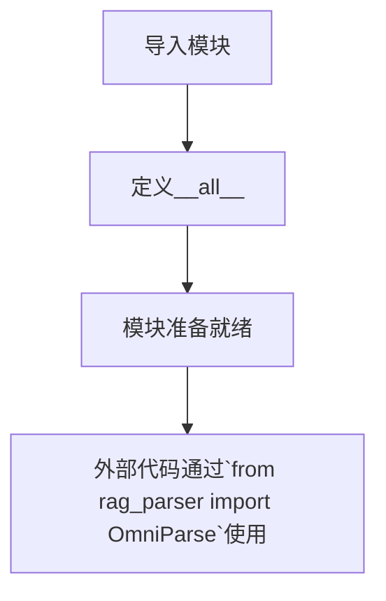

# `.\MetaGPT\metagpt\rag\parsers\__init__.py` 详细设计文档

该文件是一个简单的模块导出文件，其核心功能是作为RAG（检索增强生成）系统中解析器模块的入口点，通过从`metagpt.rag.parsers.omniparse`模块导入`OmniParse`类，并将其公开为当前模块的唯一公共接口，实现了对底层复杂解析器功能的封装和简化访问。

## 整体流程



## 类结构

```
OmniParse (外部导入类)
└── 当前模块不包含内部类层次结构
```

## 全局变量及字段


### `__all__`
    
定义模块的公共接口，指定当使用 from module import * 时导入哪些对象。

类型：`list[str]`
    


    

## 全局函数及方法


## 关键组件


### OmniParse

一个统一的文档解析器，旨在通过单一接口支持多种文档格式（如PDF、Word、Excel、PPT、Markdown、文本等）的解析，并可能集成了高级功能如文本提取、表格识别、元数据获取等，以简化RAG（检索增强生成）系统中的文档预处理流程。


## 问题及建议


### 已知问题

-   **功能单一且封装过度**：当前代码仅作为一个空的导出文件，将 `OmniParse` 类从 `metagpt.rag.parsers.omniparse` 模块重新导出。这本身不构成功能问题，但作为 `__init__.py` 文件，它没有聚合或暴露其所在包 (`parsers`) 下的其他潜在解析器，限制了包的可用性和可发现性。
-   **缺乏文档和类型提示**：代码文件本身没有包含任何模块级或类级的文档字符串（docstring）。对于新开发者或不熟悉 `OmniParse` 功能的用户，无法通过查看此文件获得任何关于其用途、接口或如何使用的基本信息。
-   **潜在的循环导入风险**：虽然当前代码简单，但作为包的入口文件，如果未来在内部添加了复杂的导入逻辑，不当的导入语句可能导致循环导入问题，影响项目的启动和模块加载。

### 优化建议

-   **增强包的聚合能力**：建议审查 `parsers` 包下的所有模块。如果存在多个解析器类（如 `JsonParse`, `XmlParse` 等），应在此 `__init__.py` 文件中一并导出，提供一个统一的入口。例如：`__all__ = ["OmniParse", "JsonParse", "XmlParse"]`，并相应地从各自模块导入。
-   **补充模块文档**：在文件顶部添加模块级的文档字符串，简要说明 `parsers` 包的目的、包含的主要组件（解析器）以及 `OmniParse` 的核心作用。这能极大提升代码的可读性和可维护性。
-   **考虑使用显式相对导入**：为了提升代码的清晰度和避免潜在的命名空间冲突，在导入包内模块时，可以考虑使用显式相对导入（例如 `from .omniparse import OmniParse`），这明确了导入关系发生在包内部。
-   **建立代码规范检查**：将此文件纳入项目的代码质量检查（如使用 `pylint`, `flake8`, `mypy`）范围，确保未来的修改遵循导入规范并包含必要的文档，防止技术债务积累。


## 其它


### 设计目标与约束

该模块的设计目标是提供一个统一、可扩展的文档解析入口，旨在封装底层多种文档格式（如PDF、DOCX、TXT、HTML等）的解析细节，向上层提供一个简洁、一致的API。核心约束包括：1. 保持接口的简单性，避免暴露底层解析器的复杂性；2. 确保良好的可扩展性，以便未来能够轻松集成新的文档格式解析器；3. 依赖外部解析库（如`OmniParse`）的具体实现，需遵循其接口契约。

### 错误处理与异常设计

当前代码片段仅进行模块导出，未包含显式的错误处理逻辑。错误处理的责任被委托给了导入的`OmniParse`类。预期的异常设计应围绕`OmniParse`类的使用展开，可能包括：1. 文件读取错误（如`FileNotFoundError`, `PermissionError`）；2. 文档解析错误（如不支持的格式、损坏的文件内容等，可能抛出`ValueError`或自定义异常）；3. 依赖库缺失错误（`ImportError`）。建议在调用`OmniParse`的方法时，使用`try-except`块捕获这些异常，并根据应用场景进行适当处理（如记录日志、返回错误信息或抛出封装后的业务异常）。

### 数据流与状态机

由于当前模块仅是一个导出包装器，其内部不涉及复杂的数据流或状态管理。主要数据流是单向的：用户调用`OmniParse`类的方法，传入文档文件路径或数据流；`OmniParse`内部根据文档类型路由到对应的底层解析器；底层解析器将文档内容转换为结构化的数据（如文本、元数据、章节等）；最终，这些结构化数据通过`OmniParse`的方法返回给调用者。模块本身无状态，`OmniParse`类的方法通常是幂等的。

### 外部依赖与接口契约

1.  **外部依赖**：核心依赖是`metagpt.rag.parsers.omniparse`模块中的`OmniParse`类。该依赖项封装了所有具体的文档解析能力。项目可能间接依赖一系列用于解析特定格式的第三方库（如`pdfplumber`、`python-docx`、`beautifulsoup4`等），但这些细节被`OmniParse`隐藏。
2.  **接口契约**：本模块（`__init__.py`）对外提供的契约是导出一个名为`OmniParse`的类。使用方通过`from metagpt.rag.parsers import OmniParse`导入此类，并预期其提供诸如`parse`, `parse_to_documents`等方法（具体方法取决于`OmniParse`的实际定义）。本模块保证导出的`OmniParse`与底层实现是同一个对象。

### 配置与可扩展性

当前代码未体现任何配置机制。配置（如启用哪些解析器、解析器的参数设置等）应内置于`OmniParse`类的初始化逻辑中。可扩展性体现在`OmniParse`类的设计上，它应使用工厂模式、插件机制或类似的策略模式，使得新增一种文档格式的解析器时，无需修改使用方的调用代码，只需在`OmniParse`的内部注册新的解析器即可。本模块作为门面（Facade），其可扩展性由底层的`OmniParse`实现保障。

### 性能考量

性能完全取决于`OmniParse`类及其底层解析器的实现。可能的考量点包括：1. **大文件处理**：解析器是否支持流式处理以避免内存溢出；2. **解析速度**：对不同格式的文档，解析效率如何；3. **缓存机制**：是否对已解析的文档内容进行缓存以避免重复解析。这些均非本导出模块的职责，但需要在`OmniParse`的实现中予以考虑。

### 安全考量

安全风险主要来自解析过程：1. **文件上传**：需要防范恶意文件（如包含病毒、特大文件导致拒绝服务）；2. **内容安全**：解析出的文本内容可能包含敏感信息或恶意脚本，需要后续处理环节进行过滤或转义；3. **依赖安全**：底层解析器库可能存在安全漏洞，需要定期更新。本模块不直接处理这些风险，但调用方在使用`OmniParse`时应意识到这些潜在问题，并在更上层（如文件上传接口、内容处理管道）实施相应的安全措施。

    