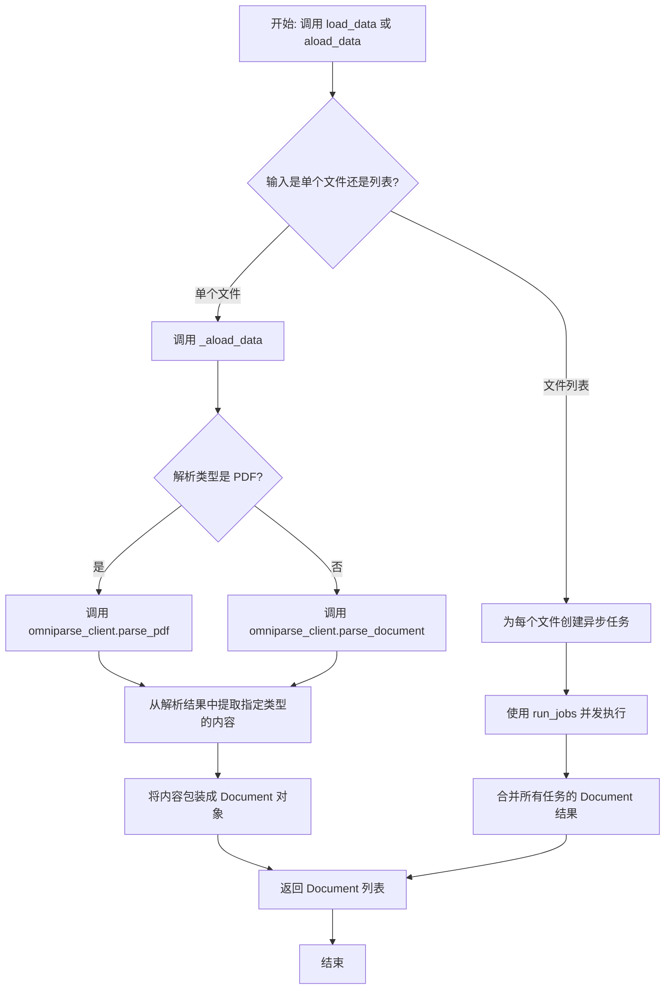
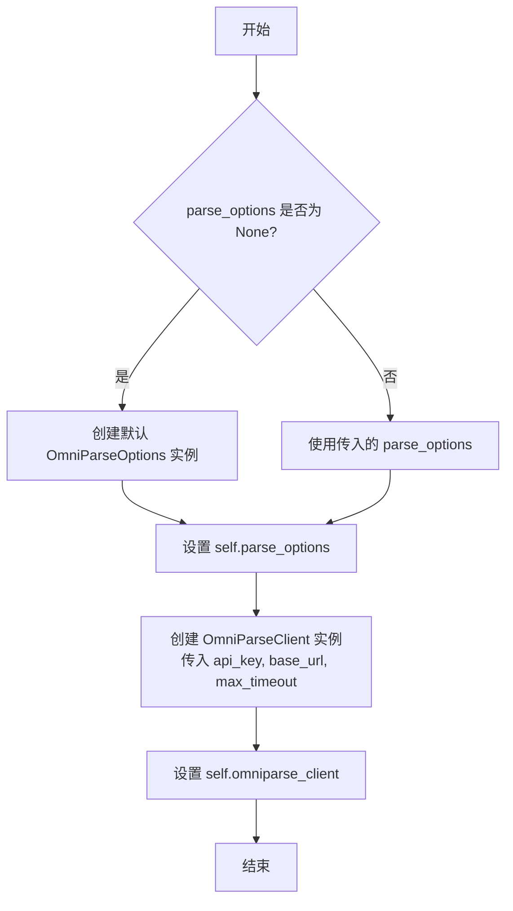
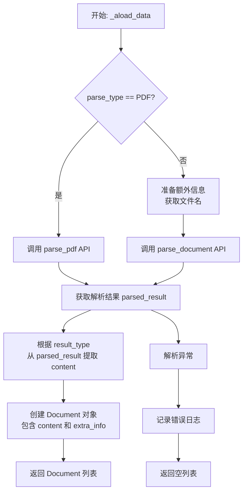
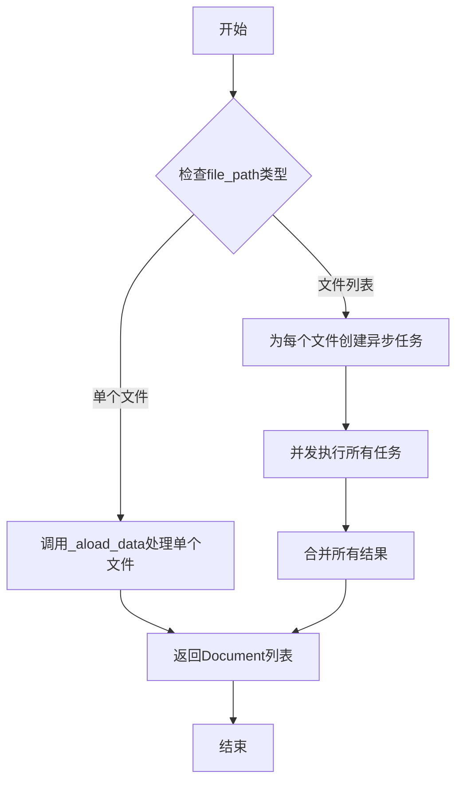
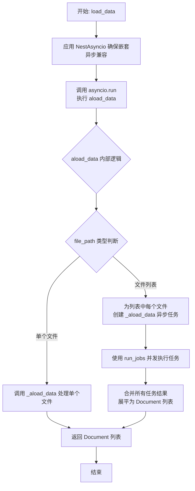

# `.\MetaGPT\metagpt\rag\parsers\omniparse.py` 详细设计文档

该代码实现了一个名为 OmniParse 的文档解析器，它继承自 llama_index 的 BaseReader。其核心功能是通过调用 OmniParseClient 服务，异步地解析多种格式的文档（如 PDF），并根据配置的解析类型和结果类型，将解析后的内容转换为 llama_index 的 Document 对象列表，以便于后续的检索和生成任务。它支持单文件和多文件的并发解析。

## 整体流程



## 类结构

```
BaseReader (llama_index.core.readers.base)
└── OmniParse
    ├── 字段: parse_options, omniparse_client
    ├── 属性: parse_type, result_type
    ├── 方法: __init__, _aload_data, aload_data, load_data
```

## 全局变量及字段


### `OmniParse.parse_options`
    
用于配置OmniParse解析行为的选项对象，包含解析类型、结果类型、超时时间、工作线程数等参数。

类型：`OmniParseOptions`
    


### `OmniParse.omniparse_client`
    
用于与OmniParse后端服务进行通信的客户端实例，负责发送文件解析请求并接收结果。

类型：`OmniParseClient`
    
    

## 全局函数及方法

### `OmniParse.__init__`

初始化 `OmniParse` 类的实例，设置解析选项并创建 OmniParse 客户端。

参数：

- `api_key`：`str`，用于 API 身份验证的密钥，默认为 None。
- `base_url`：`str`，OmniParse API 的基础 URL，默认为 "http://localhost:8000"。
- `parse_options`：`OmniParseOptions`，OmniParse 的可选配置设置，默认为 None。

返回值：`None`，此方法为构造函数，不返回任何值。

#### 流程图



#### 带注释源码

```python
def __init__(
    self, api_key: str = None, base_url: str = "http://localhost:8000", parse_options: OmniParseOptions = None
):
    """
    Args:
        api_key: Default None, can be used for authentication later.
        base_url: OmniParse Base URL for the API.
        parse_options: Optional settings for OmniParse. Default is OmniParseOptions with default values.
    """
    # 如果 parse_options 为 None，则使用 OmniParseOptions 的默认值创建一个新实例
    self.parse_options = parse_options or OmniParseOptions()
    # 使用传入的 api_key、base_url 和从 parse_options 中获取的 max_timeout 创建 OmniParseClient 实例
    self.omniparse_client = OmniParseClient(api_key, base_url, max_timeout=self.parse_options.max_timeout)
```

### `OmniParse._aload_data`

该方法是一个异步方法，用于从单个文件路径或字节数据中加载数据，并通过 OmniParse 服务进行解析，最终将解析结果封装成 `Document` 对象列表返回。它根据 `parse_type` 属性决定调用 PDF 解析接口还是通用文档解析接口，并根据 `result_type` 属性从解析结果中提取指定格式的内容。

参数：

- `file_path`：`Union[str, bytes, Path]`，要解析的文件路径、字节数据或 Path 对象。
- `extra_info`：`Optional[dict]`，可选字典，包含额外的元数据信息，如文件名。

返回值：`List[Document]`，包含解析后文本和元数据的 Document 对象列表。如果解析失败，则返回空列表。

#### 流程图



#### 带注释源码

```python
async def _aload_data(
    self,
    file_path: Union[str, bytes, Path],
    extra_info: Optional[dict] = None,
) -> List[Document]:
    """
    Load data from the input file_path.

    Args:
        file_path: File path or file byte data.
        extra_info: Optional dictionary containing additional information.

    Returns:
        List[Document]
    """
    try:
        # 根据 parse_type 属性决定调用哪个解析接口
        if self.parse_type == OmniParseType.PDF:
            # pdf parse
            parsed_result = await self.omniparse_client.parse_pdf(file_path)
        else:
            # other parse use omniparse_client.parse_document
            # For compatible byte data, additional filename is required
            extra_info = extra_info or {}
            filename = extra_info.get("filename")
            parsed_result = await self.omniparse_client.parse_document(file_path, bytes_filename=filename)

        # 根据 result_type 属性从解析结果中提取指定格式的内容
        content = getattr(parsed_result, self.result_type)
        # 将内容封装成 Document 对象
        docs = [
            Document(
                text=content,
                metadata=extra_info or {},
            )
        ]
    except Exception as e:
        # 解析失败时记录错误并返回空列表
        logger.error(f"OMNI Parse Error: {e}")
        docs = []

    return docs
```

### `OmniParse.aload_data`

该方法用于从输入的文件路径或文件字节数据中异步加载数据，并返回一个`Document`对象列表。它支持处理单个文件或并发处理多个文件，最终调用`_aload_data`方法进行实际的数据解析。

参数：

- `file_path`：`Union[List[FileInput], FileInput]`，文件路径或文件字节数据，可以是单个文件或文件列表。
- `extra_info`：`Optional[dict]`，可选字典，包含额外的信息，如文件名等。

返回值：`List[Document]`，返回一个`Document`对象列表，每个`Document`包含解析后的文本内容和元数据。

#### 流程图



#### 带注释源码

```python
async def aload_data(
    self,
    file_path: Union[List[FileInput], FileInput],
    extra_info: Optional[dict] = None,
) -> List[Document]:
    """
    Load data from the input file_path.

    Args:
        file_path: File path or file byte data.
        extra_info: Optional dictionary containing additional information.

    Notes:
        This method ultimately calls _aload_data for processing.

    Returns:
        List[Document]
    """
    docs = []
    if isinstance(file_path, (str, bytes, Path)):
        # Processing single file
        docs = await self._aload_data(file_path, extra_info)
    elif isinstance(file_path, list):
        # Concurrently process multiple files
        parse_jobs = [self._aload_data(file_item, extra_info) for file_item in file_path]
        doc_ret_list = await run_jobs(jobs=parse_jobs, workers=self.parse_options.num_workers)
        docs = [doc for docs in doc_ret_list for doc in docs]
    return docs
```

### `OmniParse.load_data`

该方法是一个同步包装器，用于异步加载和解析文件数据。它通过调用 `asyncio.run` 来执行内部的异步方法 `aload_data`，并确保在嵌套异步环境中也能正常工作（通过 `NestAsyncio.apply_once()`）。它支持处理单个文件或文件列表，并将解析后的内容转换为 `Document` 对象列表。

参数：

- `file_path`：`Union[List[FileInput], FileInput]`，文件路径或文件字节数据，可以是单个文件或文件列表。
- `extra_info`：`Optional[dict]`，可选字典，包含额外的元数据信息，将附加到生成的 `Document` 对象中。

返回值：`List[Document]`，返回一个 `Document` 对象列表，每个 `Document` 包含解析出的文本内容及其元数据。如果解析失败，返回空列表。

#### 流程图



#### 带注释源码

```python
def load_data(
    self,
    file_path: Union[List[FileInput], FileInput],
    extra_info: Optional[dict] = None,
) -> List[Document]:
    """
    Load data from the input file_path.

    Args:
        file_path: File path or file byte data.
        extra_info: Optional dictionary containing additional information.

    Notes:
        This method ultimately calls aload_data for processing.

    Returns:
        List[Document]
    """
    # 应用 NestAsyncio 以确保在可能存在的嵌套异步环境中（如 Jupyter Notebook）能正常运行
    NestAsyncio.apply_once()
    # 使用 asyncio.run 来运行异步方法 aload_data，并返回其结果
    return asyncio.run(self.aload_data(file_path, extra_info))
```

## 关键组件


### OmniParseClient

封装了与OmniParse后端服务交互的客户端，负责发送文件解析请求并接收结构化结果。

### OmniParseOptions

定义了文档解析的配置选项，包括解析类型、结果类型、最大超时时间和并发工作线程数。

### OmniParseType

枚举类，定义了支持的文档解析类型，例如PDF解析。

### ParseResultType

枚举类，定义了从解析结果中提取结构化数据的类型。

### BaseReader (llama_index.core.readers.base.BaseReader)

作为OmniParse类的基类，提供了与LlamaIndex框架集成的标准数据读取器接口。

### Document (llama_index.core.Document)

LlamaIndex框架中的核心数据结构，用于封装解析后的文本内容及其元数据。

### 异步任务调度 (run_jobs)

用于并发处理多个文件解析请求，通过指定工作线程数来提高批量处理的效率。

### 嵌套异步循环兼容层 (NestAsyncio)

确保在已存在事件循环的环境中（如Jupyter Notebook）能够正确运行异步代码。


## 问题及建议

### 已知问题

-   **异常处理过于宽泛**：`_aload_data` 方法中的 `except Exception as e:` 捕获了所有异常，这可能会掩盖一些特定的、可恢复的错误，使得调试和错误恢复变得困难。
-   **同步方法中的异步调用**：`load_data` 方法使用 `asyncio.run` 来调用异步方法 `aload_data`。虽然使用了 `NestAsyncio.apply_once()` 来处理嵌套事件循环，但这通常是在特定环境（如Jupyter Notebook）下的变通方案，可能不是最健壮或可移植的解决方案，尤其是在某些生产环境中。
-   **类型注解不精确**：`aload_data` 和 `load_data` 方法的 `file_path` 参数类型为 `Union[List[FileInput], FileInput]`，但 `FileInput` 是 `fileinput` 模块中的一个类，通常用于命令行文件处理。代码内部实际处理的是 `str`, `bytes`, `Path` 或它们的列表。这可能导致类型提示与实际使用不匹配，造成混淆。
-   **字节数据处理的潜在问题**：在 `_aload_data` 方法中，当 `parse_type` 不是 `PDF` 时，代码尝试从 `extra_info` 中获取 `filename` 以处理字节数据。如果传入的是字节数据但 `extra_info` 中没有提供 `filename`，可能会导致 `omniparse_client.parse_document` 调用失败，但此错误可能被宽泛的异常处理所掩盖。
-   **资源管理**：代码没有显式地管理可能由 `OmniParseClient` 或底层解析操作创建的资源（如网络连接、临时文件）。虽然可能由客户端内部处理，但缺乏明确的文档或上下文管理器使用。

### 优化建议

-   **细化异常处理**：将 `_aload_data` 方法中的通用 `Exception` 捕获替换为更具体的异常类型，例如捕获 `OmniParseClient` 可能抛出的特定异常或 `IOError`、`ValueError` 等。可以记录更详细的错误信息，并根据异常类型决定是返回空列表还是重新抛出。
-   **重构同步接口**：考虑将 `load_data` 方法完全重写为同步版本，避免使用 `asyncio.run`。可以创建一个内部的同步客户端或使用线程池来执行异步操作，以提高在非异步环境中的兼容性和性能。如果必须保留当前结构，应确保 `NestAsyncio` 的使用有充分的文档说明其适用场景和限制。
-   **修正类型注解**：将 `aload_data` 和 `load_data` 方法的 `file_path` 参数类型更新为 `Union[str, bytes, Path, List[Union[str, bytes, Path]]]`，以更准确地反映实际支持的类型。同时，更新方法文档字符串。
-   **增强字节数据处理的健壮性**：在 `_aload_data` 方法中，当处理非PDF的字节数据时，应明确检查 `bytes_filename` 是否为 `None`，并可能提供一个默认值或抛出一个更清晰的错误信息，提示用户必须通过 `extra_info` 提供 `filename`。
-   **改进资源管理**：如果 `OmniParseClient` 持有需要清理的资源（如网络会话），考虑在 `OmniParse` 类中实现上下文管理器协议（`__enter__`/`__exit__` 或异步的 `__aenter__`/`__aexit__`），或者至少提供显式的 `close` 或 `aclose` 方法。在文档中明确说明资源生命周期。
-   **增加配置验证**：在 `__init__` 方法中，可以增加对 `parse_options` 中 `parse_type` 和 `result_type` 等值的验证，确保它们在创建时就是有效的枚举值，避免后续运行时错误。
-   **提升日志信息**：在 `_aload_data` 方法的错误日志中，除了异常对象 `e`，还可以考虑记录 `file_path`（或其表示形式）和当前的 `parse_type`/`result_type`，以便于问题追踪。
-   **考虑性能优化**：`run_jobs` 函数用于并发处理多个文件。可以评估 `parse_options.num_workers` 的默认值是否合理，或者允许用户根据系统资源动态调整。对于非常大的文件列表，可能需要考虑分批处理以避免内存或连接数过高。

## 其它


### 设计目标与约束

本模块的设计目标是提供一个灵活、可扩展的文档解析器，能够集成到LlamaIndex的文档读取框架中。它通过封装OmniParseClient，支持多种文档格式（如PDF）和多种输出结果类型（如文本、表格、图片等）的解析。核心约束包括：1. 必须兼容LlamaIndex的BaseReader接口，以无缝集成到现有的RAG（检索增强生成）流程中。2. 需要支持同步和异步两种调用模式，以适应不同的应用场景。3. 需要处理本地文件路径、字节数据以及文件列表等多种输入形式。4. 必须能够处理解析过程中的异常，并优雅地降级（例如，返回空文档列表而非抛出异常中断流程）。

### 错误处理与异常设计

模块的错误处理主要围绕与OmniParseClient的交互以及输入数据处理。在`_aload_data`方法中，使用try-except块捕获所有异常，记录错误日志后返回空文档列表，确保调用链不会因单个文件解析失败而中断。这种设计牺牲了部分错误信息的传递（调用方无法区分是解析失败还是文件为空），但保证了系统的健壮性。潜在的风险是异常被“吞没”，不利于调试。对于输入参数错误（如无效的`parse_type`或`result_type`），依赖底层枚举类型（`OmniParseType`, `ParseResultType`）的验证和转换，若传入无效字符串会抛出`ValueError`。`load_data`方法使用`NestAsyncio.apply_once()`来兼容可能存在的嵌套异步事件循环环境，这是一个针对特定运行环境（如Jupyter Notebook）的约束性设计。

### 数据流与状态机

模块的数据流始于用户调用`load_data`或`aload_data`方法，传入文件路径（或列表）和可选的额外信息（`extra_info`）。核心处理在`_aload_data`方法中：1. **输入路由**：根据`parse_type`属性决定调用`OmniParseClient.parse_pdf`还是`parse_document`方法。2. **远程调用**：将文件数据发送到OmniParse服务端进行解析。3. **结果提取**：根据`result_type`属性从解析结果对象中提取特定格式的内容（如文本）。4. **文档封装**：将提取的内容和元数据封装成LlamaIndex的`Document`对象列表。对于文件列表输入，`aload_data`方法会创建多个并发任务（`run_jobs`），其并发度由`parse_options.num_workers`控制，这是一个简单的并行数据流。模块内部没有复杂的状态机，其“状态”主要由初始化时设置的`parse_options`（包含`parse_type`, `result_type`, `num_workers`, `max_timeout`）决定，这些属性在对象生命周期内可以动态修改。

### 外部依赖与接口契约

1.  **LlamaIndex Core**: 继承自`BaseReader`，必须实现`load_data`方法。依赖`Document`类作为输出，`run_jobs`用于并发控制。
2.  **OmniParseClient**: 核心外部服务客户端。依赖其`parse_pdf`和`parse_document`方法进行实际解析，并依赖其返回的`parsed_result`对象的结构，该对象需包含`result_type`属性所指定的字段（如`.text`）。
3.  **接口契约**:
    *   与OmniParse服务的契约：通过HTTP API调用，期望服务返回特定结构的JSON响应。
    *   与调用方的契约：`load_data`返回`List[Document]`；对于无法解析的情况，返回空列表而非`None`；`extra_info`参数会原样存入`Document.metadata`。
4.  **环境依赖**: 使用`asyncio`进行异步操作。通过`NestAsyncio`处理可能存在的嵌套事件循环问题，这表明模块预期可能运行在已有事件循环的环境中（如某些Web框架或交互式环境）。

### 配置与参数化

模块的行为高度依赖于`OmniParseOptions`配置类（代码中未完全展示，但通过`parse_options`属性引用）。关键的配置参数包括：
*   `parse_type` (`OmniParseType`): 决定使用何种解析逻辑（如PDF专用或其他通用解析）。
*   `result_type` (`ParseResultType`): 决定从解析结果中提取何种形式的数据（如纯文本、结构化数据等）。
*   `num_workers` (`int`): 控制并发解析文件时的最大工作线程/协程数。
*   `max_timeout` (`int`): 设置OmniParseClient的网络请求超时时间。
这些参数在`__init__`中初始化，并可通过属性设置器（如`parse_type.setter`）在运行时动态修改，提供了灵活的配置方式。`api_key`和`base_url`用于配置OmniParseClient的连接信息。

### 并发与性能设计

模块通过`aload_data`方法支持对文件列表的并发解析。它利用`llama_index.core.async_utils.run_jobs`函数来管理并发任务，并发度由用户可配置的`num_workers`参数限制，这有助于防止对后端OmniParse服务造成过大的瞬时压力或耗尽本地资源。异步设计（`async/await`）使得在IO等待（网络请求）期间可以释放控制权，提高整体吞吐量，特别是在处理大量文件或高延迟网络时。`load_data`方法作为同步入口，内部使用`asyncio.run`来驱动异步逻辑，为不熟悉异步编程的用户提供了便利。性能瓶颈很可能在于网络IO（与OmniParse服务的通信）以及后端服务的解析能力本身。

    