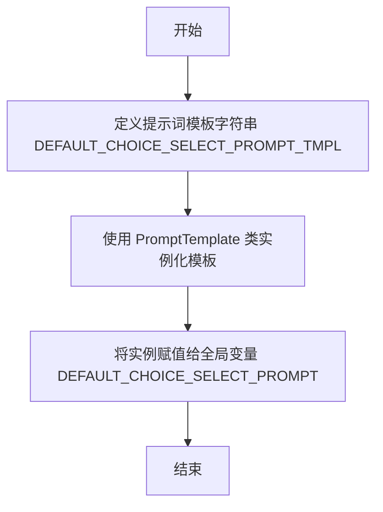

# `.\MetaGPT\metagpt\rag\prompts\default_prompts.py` 详细设计文档

该代码文件定义了一个用于文档选择任务的默认提示词模板。它创建了一个PromptTemplate对象，该对象封装了一个结构化的指令，指导大型语言模型（LLM）根据用户查询评估一组文档的相关性，并输出最相关文档的编号和相关性分数。

## 整体流程



## 类结构

```
外部依赖
├── PromptTemplate (来自 llama_index.core.prompts.base)
└── PromptType (来自 llama_index.core.prompts.prompt_type)
```

## 全局变量及字段


### `DEFAULT_CHOICE_SELECT_PROMPT_TMPL`
    
一个字符串模板，定义了用于文档选择和相关性评分的提示词（prompt）的默认内容。

类型：`str`
    


### `DEFAULT_CHOICE_SELECT_PROMPT`
    
一个PromptTemplate对象，使用DEFAULT_CHOICE_SELECT_PROMPT_TMPL模板和CHOICE_SELECT类型初始化，作为默认的文档选择提示词。

类型：`PromptTemplate`
    


    

## 全局函数及方法


## 关键组件


### 默认选择提示模板 (DEFAULT_CHOICE_SELECT_PROMPT_TMPL)

一个预定义的字符串模板，用于指导语言模型从一组文档中选择与给定问题最相关的文档，并输出其编号和相关性评分。

### 默认选择提示 (DEFAULT_CHOICE_SELECT_PROMPT)

一个封装了`DEFAULT_CHOICE_SELECT_PROMPT_TMPL`的`PromptTemplate`对象，指定了其提示类型为`PromptType.CHOICE_SELECT`，使其可在LlamaIndex框架中作为标准化的选择提示组件使用。


## 问题及建议


### 已知问题

-   **提示词模板缺乏结构化输出约束**：当前的提示词模板（`DEFAULT_CHOICE_SELECT_PROMPT_TMPL`）要求模型输出类似 `Doc: 9, Relevance: 7` 的格式，但仅通过自然语言描述，没有强制使用JSON、XML等结构化格式或提供严格的解析指令。这可能导致模型输出不一致（如换行、额外文本、格式偏差），增加下游解析逻辑的复杂性和出错风险。
-   **评分标准主观且模糊**：提示词中要求“相关性分数是基于你认为文档与问题相关程度的1-10的数字”，但“你认为”和“相关程度”的定义非常主观，缺乏客观、可量化的标准（如基于关键词匹配、语义相似度阈值）。这会导致不同模型或同一模型在不同调用下评分不一致，影响选择结果的可靠性和可复现性。
-   **硬编码的格式示例可能造成混淆**：示例 `Doc: 9, Relevance: 7` 使用了固定的数字“9”和“7”。虽然意在展示格式，但可能误导模型在真实输出中也使用这些特定数字，而非根据实际文档索引和评估进行计算。
-   **未明确处理多文档排序逻辑**：提示词要求“按相关性顺序输出文档编号”，但未详细说明当多个文档相关性相同时应如何处理（例如，按原始顺序、按置信度细分），也未说明是否应输出所有相关文档还是仅限前N个，这可能导致输出策略不明确。
-   **错误处理指令过于简单**：对于“没有相关文档”的情况，指令要求输出“no relevant documents”。然而，这个字符串与正常的结构化输出格式（`Doc: ...`）完全不同，下游解析器需要专门处理这种特殊情况，增加了逻辑分支和潜在的错误处理遗漏。

### 优化建议

-   **采用结构化输出格式**：修改提示词，要求模型以JSON等机器可读的格式输出。例如：`{"selected_docs": [{"doc_id": 1, "relevance_score": 8}, ...]}` 或使用Pydantic/JSON Schema在提示词中定义。这能极大简化下游的解析逻辑，提高健壮性。
-   **定义明确、可操作的评分准则**：在提示词中补充更具体的相关性评估标准。例如：“10分：直接且完整地回答了问题；7-9分：提供了关键支持信息或部分答案；4-6分：主题相关但信息泛泛；1-3分：仅有微弱关联”。这有助于模型进行更一致的判断。
-   **使用占位符并澄清示例目的**：将格式示例改为使用明确的占位符，如 `Doc: {doc_index}, Relevance: {score}`，并添加说明：“请用实际评估的文档编号和分数替换 `{doc_index}` 和 `{score}`”。
-   **细化排序与选择规则**：在指令中明确：“如果多个文档分数相同，按它们在列表中出现的先后顺序排列。请列出所有分数高于5的文档。” 或 “仅输出前3个最相关的文档。” 使模型行为更可预测。
-   **统一输出格式并增强错误指示**：设计一个能包容正常和异常情况的结构化格式。例如，JSON结构中可以包含一个 `status` 字段（`"success"` 或 `"no_relevant_docs"`）和一个 `data` 字段（成功时存放列表，失败时为`null`）。这样下游代码可以用同一套逻辑解析响应。
-   **考虑将提示词拆分为系统指令和用户查询**：利用聊天模型（如GPT）的特性，将冗长的指令和约束放在`system`消息中，将具体的`query_str`和`context_str`放在`user`消息中。这有助于模型更好地区分“角色设定”与“任务输入”，可能提升遵循指令的效果。


## 其它


### 设计目标与约束

1.  **设计目标**：
    *   提供一个标准化的提示词模板，用于指导大型语言模型（LLM）执行文档选择任务。
    *   将自然语言指令和格式约束封装为一个可复用的 `PromptTemplate` 对象。
    *   通过清晰的指令和示例，引导模型输出结构化的、易于解析的结果（文档编号和相关性分数）。
    *   确保提示词与 `llama_index` 框架的 `PromptType.CHOICE_SELECT` 类型兼容，以便集成到更广泛的文档检索与问答流程中。

2.  **设计约束**：
    *   **输入格式**：提示词模板必须接受 `{query_str}` 和 `{context_str}` 两个变量作为输入。
    *   **输出格式**：模型输出必须严格遵循指定的“Doc: {编号}, Relevance: {分数}”格式，或返回“no relevant documents”。不允许包含任何额外的解释性文本。
    *   **框架兼容性**：生成的 `PromptTemplate` 对象必须指定正确的 `prompt_type`（`PromptType.CHOICE_SELECT`），以确保能被框架内其他组件正确识别和使用。
    *   **可读性与维护性**：提示词字符串本身应具有良好的结构（如使用章节标题、列表），便于人类阅读和后续修改。

### 错误处理与异常设计

1.  **输入验证**：
    *   `PromptTemplate` 的初始化过程会验证模板字符串是否包含必需的变量（`{query_str}`, `{context_str}`）。如果缺失，框架可能会抛出 `ValueError` 或类似的异常。
    *   调用 `format` 方法生成最终提示时，必须提供与模板变量对应的关键字参数，否则会引发 `KeyError`。

2.  **模型输出处理**：
    *   本模块仅定义提示词，不直接处理模型输出。错误处理的责任在于调用此提示词的上级组件（例如 `ChoiceSelect` 或 `LLM` 调用器）。
    *   上级组件需要负责解析模型的响应。如果响应不符合约定的格式（如无法解析出数字、分数超出范围、或格式错误），应设计相应的处理逻辑，例如：记录警告、返回默认值（如空列表）、或抛出自定义的 `ParsingError`。

3.  **边界情况**：
    *   **空上下文**：当 `{context_str}` 为空时，提示词仍能正常工作，模型应返回“no relevant documents”。
    *   **无关文档**：提示词明确指令“Do not include any documents that are not relevant”，模型应过滤掉无关文档。如果模型未能遵守，需要由后续流程处理。

### 数据流与状态机

1.  **数据流**：
    *   **输入**：上游组件提供 `query_str`（用户问题）和 `context_str`（候选文档列表的文本化表示）。
    *   **处理**：`DEFAULT_CHOICE_SELECT_PROMPT` 对象接收输入，通过 `format` 方法将变量注入模板，生成完整的、准备发送给LLM的提示字符串。
    *   **输出**：生成的提示字符串被传递给LLM模型。LLM产生的文本输出（即文档选择结果）被返回给调用者。
    ```mermaid
    graph TD
        A[上游组件] -->|提供 query_str, context_str| B(DEFAULT_CHOICE_SELECT_PROMPT.format)
        B --> C[完整的提示词字符串]
        C --> D[LLM 模型]
        D --> E[模型响应文本]
        E --> F[下游解析器/组件]
    ```

2.  **状态机**：
    *   此模块本身是无状态的（`static`）。它定义的是一个纯函数式的转换过程（输入 -> 格式化 -> 输出提示词）。
    *   状态管理存在于更高级别的业务流程中，例如：检索状态（已检索/未检索）、选择状态（已选择/未选择）、答案生成状态等。本提示词模块仅服务于“文档选择”这一子状态。

### 外部依赖与接口契约

1.  **外部依赖**：
    *   `llama_index.core.prompts.base.PromptTemplate`：核心依赖类，用于创建和管理提示词模板。
    *   `llama_index.core.prompts.prompt_type.PromptType`：枚举类，用于标识提示词的类型，确保系统内部路由和处理的一致性。

2.  **接口契约**：
    *   **变量契约**：任何使用 `DEFAULT_CHOICE_SELECT_PROMPT` 的调用者，必须按照 `{query_str: str, context_str: str}` 的格式提供参数。
    *   **类型契约**：`DEFAULT_CHOICE_SELECT_PROMPT` 是一个 `PromptTemplate` 类型的实例，它公开了 `format` 等方法，其行为需符合 `PromptTemplate` 类的公共接口定义。
    *   **语义契约**：提示词模板的内容定义了一个与LLM的交互协议。调用者期望LLM理解并遵守该协议中关于任务描述、评分标准、输出格式的所有指令。这是一个“软”契约，依赖于LLM的能力和稳定性。

    