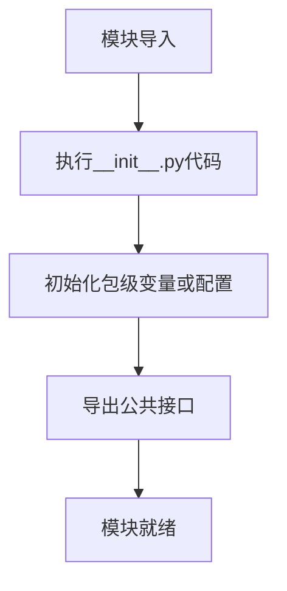

# `.\MetaGPT\metagpt\rag\rankers\__init__.py` 详细设计文档

这是一个Python包的初始化文件，用于声明和导出Rankers模块中的相关组件。它可能包含包级别的导入、变量定义或配置，但目前代码内容为空，仅有一个模块文档字符串。

## 整体流程



## 类结构

```
Rankers (包)
├── __init__.py (包初始化文件)
├── (其他模块文件，如ranker1.py, ranker2.py等)
└── ...
```

## 全局变量及字段


    

## 全局函数及方法


## 关键组件


### 代码模块初始化

该代码片段是一个Python包的初始化文件（`__init__.py`），用于声明和初始化名为“Rankers”的模块或包。


## 问题及建议


### 已知问题

-   **空模块文件**：当前 `__init__.py` 文件为空，仅包含一个模块文档字符串。这通常意味着该包（`rankers`）尚未实现任何实际功能，或者其功能分散在其他子模块中，但本文件未进行任何导入以暴露这些功能，导致包导入后无法直接使用。

### 优化建议

-   **明确包导出**：如果 `rankers` 包下已有实现具体排序逻辑的子模块（例如 `ranker_a.py`, `ranker_b.py`），应在 `__init__.py` 中使用 `from .ranker_a import RankerA` 等语句显式导出关键的类或函数。这遵循了 Python 的最佳实践，使得用户可以通过 `from rankers import RankerA` 的方式直接导入，提高了包的易用性和清晰度。
-   **定义包级接口或抽象**：考虑在 `__init__.py` 中定义包级别的公共接口、抽象基类或异常。例如，可以定义一个 `BaseRanker` 抽象类，规定所有排序器必须实现的方法（如 `rank`），这样可以为整个包建立一个清晰的契约，并方便进行类型检查和多态调用。
-   **添加版本信息**：建议在 `__init__.py` 中定义 `__version__` 变量，用于管理包的版本号，便于依赖管理和问题追踪。
-   **完善文档字符串**：当前的文档字符串 `"""Rankers init"""` 过于简单。应将其扩展，简要说明 `rankers` 包的目的、主要提供的功能以及快速入门示例。


## 其它


### 设计目标与约束

1.  **设计目标**：
    *   提供一个统一的初始化入口，用于管理项目中所有排序器（Ranker）的注册和加载。
    *   确保代码结构清晰，便于未来扩展新的排序器类型。
    *   通过模块化的设计，降低不同排序器实现之间的耦合度。

2.  **设计约束**：
    *   必须遵循Python的模块导入规范。
    *   当前文件作为`rankers`包的初始化文件，其主要职责是暴露公共接口，而非包含复杂逻辑。
    *   保持文件简洁，具体的排序器实现应定义在单独的模块中。

### 错误处理与异常设计

1.  **当前状态**：当前`__init__.py`文件为空，未定义任何错误处理机制。
2.  **设计考虑**：在未来的扩展中，当在`rankers`包内部进行动态加载或实例化排序器时，应考虑以下异常：
    *   `ImportError`：当尝试导入不存在的排序器模块时。
    *   `AttributeError`：当从模块中访问不存在的排序器类时。
    *   `ValueError`：当提供的排序器配置参数无效时。
    *   建议定义一个基础的`RankerError`异常类，所有与排序器相关的具体异常都继承自此类，以便调用方进行统一捕获和处理。

### 数据流与状态机

1.  **数据流**：当前文件不涉及具体的数据处理流程。它仅作为模块的声明点。预期的数据流始于外部代码通过`import rankers`或`from rankers import ...`语句引入本包，进而访问包内定义的具体排序器类。
2.  **状态机**：不适用。本模块无状态。

### 外部依赖与接口契约

1.  **外部依赖**：无直接外部依赖。该`__init__.py`文件的存在使得`rankers`目录被识别为一个Python包。
2.  **接口契约**：
    *   作为包的入口，本文件隐式地定义了包的公共API。目前，由于文件为空，公共API仅为包本身（`rankers`）。
    *   未来，通过在此文件中使用`__all__`列表或直接导入类/函数，可以明确指定哪些模块、类或函数是对外公开的。例如：`__all__ = [‘BaseRanker‘, ‘ExampleRanker‘]` 或 `from .example_ranker import ExampleRanker`。

### 配置管理与环境变量

1.  **当前状态**：未涉及任何配置管理。
2.  **设计考虑**：如果排序器的行为需要通过配置（如配置文件、环境变量）来调整，可以考虑：
    *   在包级别定义一个配置加载函数或类。
    *   在`__init__.py`中初始化一个默认的、全局可访问的配置对象。
    *   允许各个排序器在初始化时接收并覆盖全局配置。

### 安全考虑

1.  **当前状态**：无安全风险。
2.  **设计考虑**：如果未来排序器涉及处理用户输入、执行动态代码或访问外部服务，则需要考虑：
    *   对输入参数进行严格的验证和清洗。
    *   避免使用`eval()`或`exec()`等危险函数。
    *   在访问外部服务时使用超时和重试机制，并考虑认证信息的安全存储。

### 测试策略

1.  **单元测试**：应为`rankers`包内每个具体的排序器模块编写单元测试，验证其排序逻辑的正确性。
2.  **集成测试**：测试排序器与系统中其他组件（如数据加载器、评估模块）的集成情况。
3.  **`__init__.py`测试**：虽然当前文件无逻辑，但若未来添加了导出的公共成员，应编写测试来验证这些成员可以被正确导入。

### 部署与运维

1.  **打包**：`rankers`包应作为更大项目的一部分进行打包和分发。
2.  **版本管理**：包的版本应遵循语义化版本控制（SemVer），并在`__init__.py`中通过`__version__`变量明确声明。
3.  **日志**：建议在包级别初始化一个日志记录器（logger），以便包内所有模块可以记录统一的、带有上下文信息的日志，便于问题排查。


    