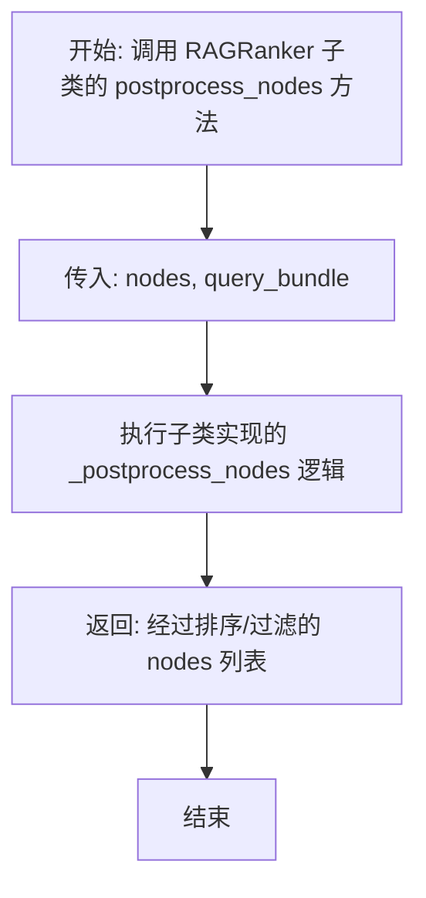
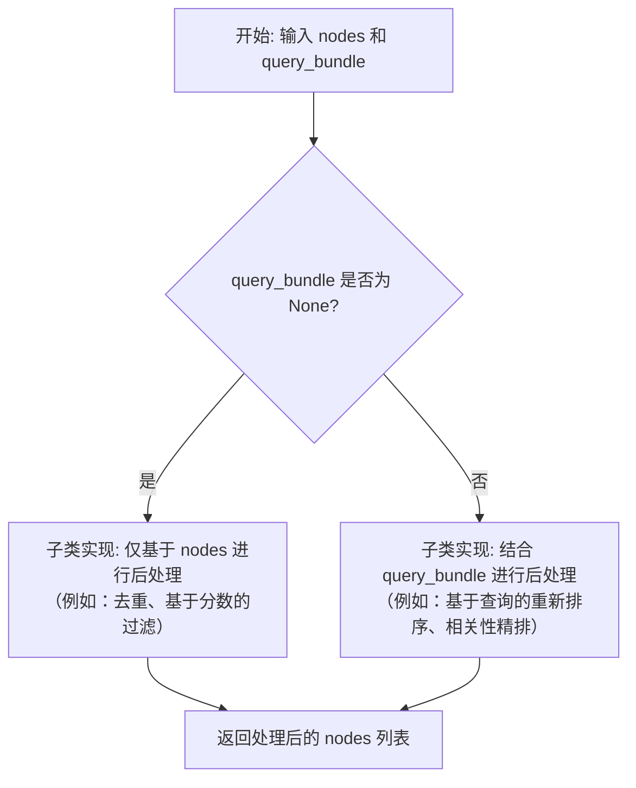

# `.\MetaGPT\metagpt\rag\rankers\base.py` 详细设计文档

该文件定义了一个用于检索增强生成（RAG）系统的排名器抽象基类 `RAGRanker`。它继承自 LlamaIndex 的 `BaseNodePostprocessor`，强制要求子类实现 `_postprocess_nodes` 方法，以根据查询对检索到的节点进行重新排序或过滤。

## 整体流程



## 类结构

```
BaseNodePostprocessor (来自 llama_index.core.postprocessor.types)
└── RAGRanker (抽象基类)
    └── [具体的 RAGRanker 实现子类，由用户定义]
```

## 全局变量及字段


    

## 全局函数及方法


### `RAGRanker._postprocess_nodes`

`RAGRanker._postprocess_nodes` 是 `RAGRanker` 类中的一个抽象方法，其核心功能是定义了对检索到的节点列表进行后处理的接口规范。具体实现由继承 `RAGRanker` 的子类完成，用于根据查询信息对节点进行重新排序、过滤或评分调整，以优化最终返回给大语言模型（LLM）的上下文质量。

参数：

-  `nodes`：`list[NodeWithScore]`，一个包含 `NodeWithScore` 对象的列表，代表初始检索到的、带有相关性分数的节点。
-  `query_bundle`：`Optional[QueryBundle]`，可选的查询包，包含原始的查询文本及其它可能的元数据（如查询向量），用于指导后处理过程。

返回值：`list[NodeWithScore]`，返回一个经过后处理（如重排序、过滤）后的 `NodeWithScore` 对象列表。

#### 流程图



#### 带注释源码

```
    @abstractmethod
    def _postprocess_nodes(
        self,
        nodes: list[NodeWithScore],
        query_bundle: Optional[QueryBundle] = None,
    ) -> list[NodeWithScore]:
        """postprocess nodes."""
        # 这是一个抽象方法，仅定义了接口。
        # 具体的后处理逻辑（如重排序、过滤、评分融合等）必须由继承RAGRanker的子类实现。
        # 参数 `nodes` 是待处理的初始节点列表。
        # 参数 `query_bundle` 是可选的查询信息，如果提供，可用于更精细的、与查询相关的处理。
        # 返回值必须是处理后的节点列表，其元素类型仍为 NodeWithScore。
        pass
```


## 关键组件


### RAGRanker 类

RAGRanker 是一个用于对检索到的节点进行重排的抽象基类，它继承自 LlamaIndex 的 BaseNodePostprocessor，定义了重排处理的核心接口。

### _postprocess_nodes 抽象方法

_postprocess_nodes 是一个抽象方法，定义了重排器的核心逻辑，接收一个节点列表和可选的查询包，并返回经过重排后的节点列表。


## 问题及建议


### 已知问题

-   **抽象基类实现不完整**：`RAGRanker` 类继承自 `BaseNodePostprocessor`，但仅实现了 `_postprocess_nodes` 这一个抽象方法。根据 `llama_index` 的基类设计，`BaseNodePostprocessor` 可能还定义了其他必须实现的抽象方法（例如 `postprocess_nodes`），这会导致 `RAGRanker` 无法被直接实例化或使用，除非所有抽象方法都被实现。
-   **类型注解不精确**：`_postprocess_nodes` 方法的 `query_bundle` 参数类型注解为 `Optional[QueryBundle]`，但基类 `BaseNodePostprocessor` 的同名方法可能要求该参数为必选。这种不一致可能导致子类在重写时产生混淆或运行时错误。
-   **缺乏具体实现**：当前代码仅为一个抽象骨架，没有提供任何具体的重排序算法或逻辑，无法执行实际的排序功能。

### 优化建议

-   **完善抽象基类实现**：检查 `BaseNodePostprocessor` 的完整定义，并实现所有必需的抽象方法（如 `postprocess_nodes`），以确保 `RAGRanker` 是一个功能完整的可实例化类或提供明确的说明表明这是一个需要进一步实现的抽象类。
-   **统一接口契约**：明确 `query_bundle` 参数在 `RAGRanker` 及其基类中的角色。如果它是可选的，应在文档字符串中说明其可选时的行为；如果基类要求必选，则应修正此处的类型注解。确保子类方法与基类方法签名一致。
-   **提供默认或示例实现**：至少在一个具体子类中实现 `_postprocess_nodes` 方法，例如提供一个基于简单规则（如分数调整、关键词匹配）的排序器，以展示该类的预期用法和作为其他开发者的起点。
-   **增强文档字符串**：在类和方法层级添加更详细的文档字符串，说明 `RAGRanker` 的设计目的、输入输出的具体格式（例如 `NodeWithScore` 列表中分数的含义和范围），以及子类化时需要关注的重点。
-   **考虑性能与扩展性设计**：在方法设计时，考虑未来可能支持批量处理、异步处理或集成外部排序服务（如机器学习模型API）。可以在方法签名或类结构中预留扩展点，例如允许注入自定义的评分函数或配置参数。


## 其它


### 设计目标与约束

本代码定义了一个名为 `RAGRanker` 的抽象基类，其核心设计目标是提供一个标准化的接口，用于在检索增强生成（RAG）流程中对检索到的节点（`NodeWithScore`）进行后处理与重排序。该类继承自 `llama_index` 框架的 `BaseNodePostprocessor`，旨在强制任何具体的排名器实现都必须遵循 `_postprocess_nodes` 方法的签名约定。主要约束包括：必须与 `llama_index` 的节点和查询数据结构兼容；排名逻辑需在子类中具体实现；设计上侧重于扩展性而非提供默认实现。

### 错误处理与异常设计

当前代码作为抽象基类，未包含具体的错误处理逻辑。错误处理的责任被委托给了继承该类的具体子类。预期的异常可能包括：
1.  **参数验证错误**：子类在 `_postprocess_nodes` 方法中应验证 `nodes` 参数非空（或符合预期格式），`query_bundle` 可能为 `None` 的情况。
2.  **数据处理错误**：在排名算法执行过程中，如果节点数据格式不符合预期或计算过程中出现错误（如数值计算异常），子类应抛出相应的异常（如 `ValueError`, `RuntimeError`）。
3.  **抽象方法未实现错误**：如果开发者尝试直接实例化 `RAGRanker` 类，Python 解释器将抛出 `TypeError`，提示 `_postprocess_nodes` 是抽象方法。这是抽象基类机制的内置行为。

### 数据流与状态机

本类自身不维护内部状态，其行为是无状态的。数据流清晰且单向：
1.  **输入**：`_postprocess_nodes` 方法接收两个输入参数：一个包含原始节点及其得分的列表 (`nodes`)，以及一个可选的查询包 (`query_bundle`)。
2.  **处理**：在具体的子类中，该方法根据内部封装的排名算法（如基于相似度、关键词、交叉编码器、LLM判断等）对输入的节点列表进行处理。
3.  **输出**：处理完成后，返回一个新的、经过重新排序和/或过滤的 `NodeWithScore` 列表。输出列表的长度可能小于或等于输入列表，且节点的顺序和分数通常会发生改变。
该过程不涉及复杂的状态转换，是一个纯粹的输入-处理-输出函数。

### 外部依赖与接口契约

1.  **外部依赖**：
    *   `llama_index.core.postprocessor.types.BaseNodePostprocessor`：作为父类，定义了该类在 `llama_index` 生态中的角色和基础接口。
    *   `llama_index.core.schema.NodeWithScore` 和 `QueryBundle`：作为核心数据结构，是方法输入和输出的类型约束。任何具体实现都必须理解并正确处理这些数据结构的格式和含义。
    *   `typing` 模块：用于类型注解，提高代码可读性和可维护性。

2.  **接口契约**：
    *   **继承契约**：`RAGRanker` 承诺实现 `BaseNodePostprocessor` 定义的接口。
    *   **抽象方法契约**：任何非抽象的子类必须提供 `_postprocess_nodes` 方法的具体实现，且其方法签名（参数名称、类型、返回值类型）必须与抽象定义严格一致。这是通过 `@abstractmethod` 装饰器和 ABC 机制强制执行的。
    *   **行为契约**：虽然未在代码中显式写明，但 `_postprocess_nodes` 的预期行为是“对节点进行排名后处理”。子类实现不应改变此核心语义，例如不应将其用于节点生成或数据存储。

### 测试策略建议

针对 `RAGRanker` 抽象基类及其具体子类的测试策略应包括：
1.  **单元测试（子类）**：
    *   **功能测试**：验证 `_postprocess_nodes` 方法对不同输入（如空列表、已排序列表、乱序列表、包含 `None` 的 `query_bundle`）能产生符合算法预期的输出（顺序、分数、列表长度）。
    *   **边界测试**：测试输入节点数量极大、分数极端等情况下的行为。
    *   **算法一致性测试**：对于确定性算法，相同输入应产生相同输出。
2.  **集成测试（子类）**：将具体的 `RAGRanker` 子类与 `llama_index` 的检索器、响应合成模块等结合，测试其在完整 RAG 流水线中的效果。
3.  **抽象基类测试**：验证 `RAGRanker` 本身不能被实例化，并确保其文档清晰说明了子类的实现要求。
4.  **性能测试（子类）**：对于计算密集型的排名算法（如使用大型交叉编码器），需要测试其处理大量节点时的延迟和吞吐量，以评估是否满足应用场景的实时性要求。


    