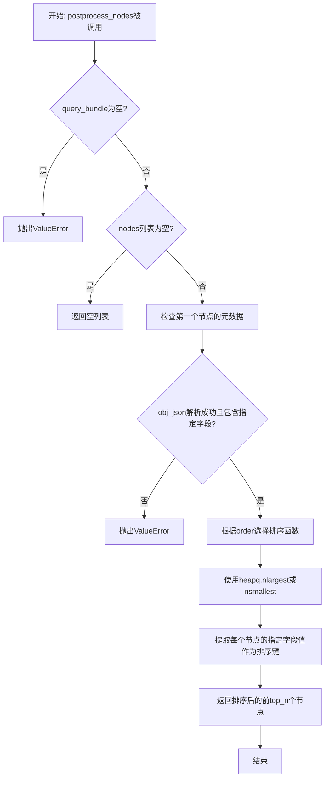
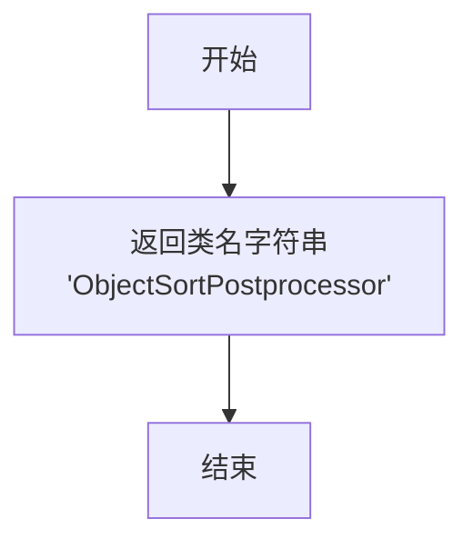
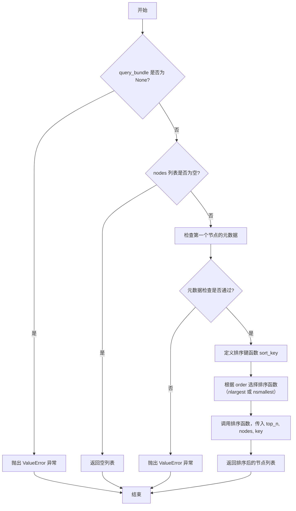
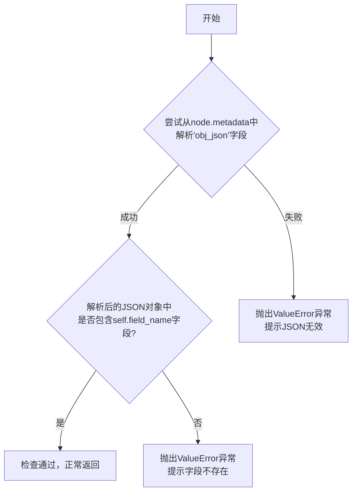
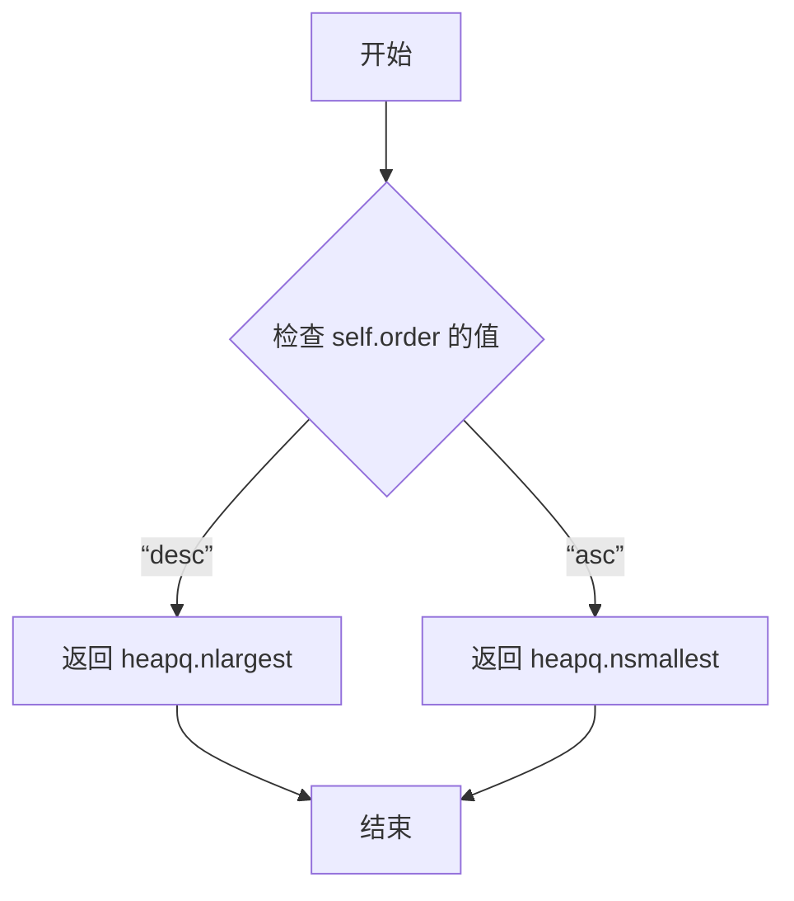

# `.\MetaGPT\metagpt\rag\rankers\object_ranker.py` 详细设计文档

该代码实现了一个基于对象字段值对检索结果节点进行排序的后处理器。它继承自LlamaIndex的BaseNodePostprocessor，专门处理包含序列化JSON对象的ObjectNode，允许用户指定排序字段和顺序（升序/降序），并返回前N个结果。

## 整体流程



## 类结构

```
BaseNodePostprocessor (来自llama_index.core.postprocessor.types)
└── ObjectSortPostprocessor
```

## 全局变量及字段


### `ObjectSortPostprocessor.field_name`
    
用于排序的对象字段名称，该字段的值必须可比较。

类型：`str`
    


### `ObjectSortPostprocessor.order`
    
排序方向，'desc'表示降序，'asc'表示升序。

类型：`Literal['desc', 'asc']`
    


### `ObjectSortPostprocessor.top_n`
    
返回排序后结果的前N个节点。

类型：`int`
    
    

## 全局函数及方法

### `ObjectSortPostprocessor.class_name`

该方法返回类`ObjectSortPostprocessor`的名称字符串。

参数：

-  `cls`：`type`，指向`ObjectSortPostprocessor`类本身的类对象。

返回值：`str`，返回固定的字符串`"ObjectSortPostprocessor"`。

#### 流程图



#### 带注释源码

```python
    @classmethod
    def class_name(cls) -> str:
        # 返回此类的名称标识符，用于序列化或识别。
        return "ObjectSortPostprocessor"
```

### `ObjectSortPostprocessor._postprocess_nodes`

该方法用于对一组`NodeWithScore`节点进行后处理，根据节点元数据中存储的JSON对象的指定字段值进行排序，并返回排序后的前`top_n`个节点。

参数：

- `nodes`：`list[NodeWithScore]`，待处理的节点列表，每个节点包含一个`ObjectNode`及其关联的分数。
- `query_bundle`：`Optional[QueryBundle]`，可选的查询包，包含原始查询信息。如果为`None`，方法将抛出异常。

返回值：`list[NodeWithScore]`，经过排序和截取后的节点列表。如果输入节点列表为空，则返回空列表。

#### 流程图



#### 带注释源码

```python
def _postprocess_nodes(
    self,
    nodes: list[NodeWithScore],
    query_bundle: Optional[QueryBundle] = None,
) -> list[NodeWithScore]:
    """Postprocess nodes."""
    # 1. 参数验证：确保提供了查询包
    if query_bundle is None:
        raise ValueError("Missing query bundle in extra info.")

    # 2. 边界情况处理：如果输入节点列表为空，直接返回空列表
    if not nodes:
        return []

    # 3. 数据验证：检查第一个节点的元数据是否符合预期格式
    #    确保 `obj_json` 字段存在且包含指定的 `field_name`
    self._check_metadata(nodes[0].node)

    # 4. 定义排序键：从节点的元数据中解析JSON，提取指定字段的值作为排序依据
    sort_key = lambda node: json.loads(node.node.metadata["obj_json"])[self.field_name]

    # 5. 执行排序与筛选：
    #    a. 根据 `self.order` 选择使用最大堆 (`nlargest`) 或最小堆 (`nsmallest`) 函数。
    #    b. 使用 `heapq` 模块的堆算法高效地获取前 `self.top_n` 个元素。
    #    c. 返回处理后的节点列表。
    return self._get_sort_func()(self.top_n, nodes, key=sort_key)
```

### `ObjectSortPostprocessor._check_metadata`

该方法用于验证传入的`ObjectNode`节点的元数据是否符合排序处理器的要求。具体检查节点元数据中的`obj_json`字段是否包含有效的JSON字符串，并且该JSON对象中是否包含排序所需的指定字段（`field_name`）。

参数：

- `node`：`ObjectNode`，需要被检查的节点对象。

返回值：`None`，无返回值。如果检查失败，将抛出`ValueError`异常。

#### 流程图



#### 带注释源码

```python
def _check_metadata(self, node: ObjectNode):
    # 尝试从节点的元数据中获取并解析 'obj_json' 字段
    try:
        obj_dict = json.loads(node.metadata.get("obj_json"))
    except Exception as e:
        # 如果解析失败（例如JSON格式错误），抛出异常
        raise ValueError(f"Invalid object json in metadata: {node.metadata}, error: {e}")

    # 检查解析后的字典对象中是否包含排序所需的字段（self.field_name）
    if self.field_name not in obj_dict:
        # 如果字段不存在，抛出异常
        raise ValueError(f"Field '{self.field_name}' not found in object: {obj_dict}")
```

### `ObjectSortPostprocessor._get_sort_func`

该方法根据 `order` 字段的值，返回一个用于排序的函数引用。当 `order` 为 `"desc"` 时返回 `heapq.nlargest` 函数，用于获取最大的 N 个元素；当 `order` 为 `"asc"` 时返回 `heapq.nsmallest` 函数，用于获取最小的 N 个元素。

参数：
- `self`：`ObjectSortPostprocessor`，当前 `ObjectSortPostprocessor` 类的实例。

返回值：`Callable`，一个可调用对象（函数），用于从可迭代对象中获取指定数量的最大或最小元素。

#### 流程图



#### 带注释源码

```python
def _get_sort_func(self):
    # 根据实例的 order 属性决定返回哪个排序函数
    # 如果 order 为 "desc"，返回 heapq.nlargest 函数用于降序获取前 N 个最大值
    # 如果 order 为 "asc"，返回 heapq.nsmallest 函数用于升序获取前 N 个最小值
    return heapq.nlargest if self.order == "desc" else heapq.nsmallest
```

## 关键组件


### ObjectSortPostprocessor

一个基于对象字段值对节点进行排序的后处理器，支持升序或降序排列，并返回前N个结果。

### 字段排序与惰性加载

通过解析节点元数据中存储的JSON字符串，动态获取指定字段的值作为排序键，实现了数据的惰性加载和按需排序。

### 排序策略

根据配置的`order`字段（"desc"或"asc"），动态选择使用`heapq.nlargest`或`heapq.nsmallest`函数来实现高效的Top-N排序，避免了对整个列表进行完全排序的开销。


## 问题及建议


### 已知问题

-   **异常处理不完整**：`_postprocess_nodes` 方法在 `query_bundle` 为 `None` 时会抛出 `ValueError`，但此异常可能未被上层调用者妥善处理，导致程序意外终止。
-   **性能瓶颈**：每次排序时，都需要对每个节点的 `metadata["obj_json"]` 字段进行 JSON 反序列化 (`json.loads`)。如果节点列表很大或排序操作频繁，这会成为显著的性能开销。
-   **类型安全与验证不足**：`field_name` 字段的值在运行时才通过 `_check_metadata` 验证是否存在于对象字典中。如果传入的 `field_name` 无效，错误会在处理过程中抛出，而不是在对象初始化或配置阶段提前发现。
-   **潜在的键错误**：代码直接访问 `node.metadata.get("obj_json")` 和 `node.node.metadata["obj_json"]`，假设该键一定存在。虽然 `_check_metadata` 会检查，但如果 `metadata` 字典中根本没有 `"obj_json"` 键，`node.metadata.get("obj_json")` 会返回 `None`，导致 `json.loads(None)` 抛出 `TypeError`，错误信息可能不够清晰。
-   **`top_n` 默认值硬编码**：`top_n: int = 5` 作为类属性默认值硬编码，缺乏灵活性。虽然可以通过实例化时传入参数覆盖，但文档或类型提示中未明确说明其用途和影响。
-   **`ObjectNode` 依赖强耦合**：处理器明确依赖于 `ObjectNode` 类型及其特定的 `metadata["obj_json"]` 结构。这降低了代码的通用性，使其难以处理其他类型的节点或不同格式的元数据。

### 优化建议

-   **预处理与缓存**：在节点进入排序流程前，或在节点创建/加载时，预先将 `obj_json` 字符串反序列化为 Python 对象（如字典），并存储起来。这样，在排序时可以直接访问字典字段，避免重复的 JSON 解析开销。
-   **增强配置验证**：考虑在 Pydantic 模型的 `__init__` 或使用 `validator` 装饰器，对 `field_name` 进行更早的验证（尽管可能仍需部分运行时检查）。或者，提供一个类方法，允许用户传入一个示例节点或模式来预先验证 `field_name` 的有效性。
-   **改进错误信息**：在 `_check_metadata` 方法中，当 `metadata` 中缺少 `"obj_json"` 键时，提供更明确的错误信息，例如 `"Metadata missing required key 'obj_json'."`。
-   **使 `top_n` 更灵活**：将 `top_n` 的默认值设为 `None`，并在文档中说明当 `top_n` 为 `None` 时返回所有排序后的节点。这样用户可以根据需要选择获取前 N 个或全部结果。
-   **提高通用性**：考虑设计更抽象的接口。例如，可以允许用户传入一个自定义的 `key` 函数来提取排序依据的值，而不是硬编码从 `metadata["obj_json"]` 的特定字段提取。这将使处理器能够适配更多样的节点数据结构。
-   **代码结构优化**：将 `_check_metadata` 中的 JSON 加载和字段检查逻辑与 `_postprocess_nodes` 中的排序键提取逻辑合并或重构，以减少重复的字典查找和错误处理分支。


## 其它


### 设计目标与约束

1.  **核心目标**：提供一个可配置的、基于对象节点（ObjectNode）中特定字段值进行排序的后处理器，用于对检索增强生成（RAG）流程中检索到的节点进行重排序。
2.  **功能约束**：
    *   输入必须是包含 `ObjectNode` 的 `NodeWithScore` 列表。
    *   `ObjectNode` 的元数据（`metadata`）中必须包含一个名为 `"obj_json"` 的键，其值为可被 `json.loads` 解析的 JSON 字符串。
    *   JSON 对象中必须包含由 `field_name` 参数指定的字段，且该字段的值必须支持比较操作（例如数字、字符串）。
    *   必须提供 `query_bundle` 参数，尽管当前排序逻辑未使用它，但为保持接口一致性和未来扩展性，将其设为必需。
3.  **非功能约束**：
    *   **性能**：使用 `heapq.nlargest` 或 `nsmallest` 实现 Top-N 排序，时间复杂度为 O(N log K)，其中 N 为节点总数，K 为 `top_n`，在 N 远大于 K 时效率较高。
    *   **可配置性**：通过 `field_name`、`order`、`top_n` 三个参数提供灵活的排序规则。
    *   **兼容性**：继承自 `llama_index.core.postprocessor.types.BaseNodePostprocessor`，遵循其接口契约，可无缝集成到 LlamaIndex 的 RAG 管道中。

### 错误处理与异常设计

1.  **输入验证**：
    *   `_postprocess_nodes` 方法首先检查 `query_bundle` 是否为 `None`，若为 `None` 则抛出 `ValueError`。此检查确保了接口调用者必须提供查询上下文，符合基类设计预期。
    *   检查节点列表是否为空，若为空则直接返回空列表，避免不必要的处理。
2.  **数据完整性验证**：
    *   `_check_metadata` 方法对节点的元数据进行严格验证：
        *   尝试解析 `metadata["obj_json"]`，若解析失败（非 JSON 格式或 `obj_json` 键不存在），则捕获异常并抛出包含详细错误信息的 `ValueError`。
        *   检查解析后的 JSON 字典中是否包含 `field_name` 指定的字段，若不存在则抛出 `ValueError`。
    *   此验证在 `_postprocess_nodes` 中仅对第一个节点执行，**隐含了一个假设**：所有输入节点的 `metadata["obj_json"]` 结构一致。这是一个潜在的风险点，如果列表中存在结构不一致的节点，后续排序可能失败或产生非预期结果。
3.  **异常传播**：所有验证失败抛出的 `ValueError` 会向上层调用者传播，由调用者决定如何处理（例如记录日志、返回错误响应或使用默认值）。

### 数据流与状态机

1.  **数据流**：
    *   **输入**：`nodes` (List[NodeWithScore])， `query_bundle` (Optional[QueryBundle])。
    *   **处理**：
        *   验证 `query_bundle` 非空。
        *   若 `nodes` 为空，直接返回空列表。
        *   从第一个节点中提取并验证 `metadata["obj_json"]` 和 `field_name`。
        *   根据 `order` 参数选择排序函数（`heapq.nlargest` 或 `nsmallest`）。
        *   定义一个 `sort_key` lambda 函数，用于从每个节点的 `metadata["obj_json"]` 中提取 `field_name` 对应的值。
        *   调用排序函数，传入 `top_n`、`nodes` 和 `sort_key`，得到排序后的 Top-N 节点列表。
    *   **输出**：排序后的 `nodes` (List[NodeWithScore])，长度不超过 `top_n`。
2.  **状态机**：该类是无状态的（Stateless）。其行为完全由初始化时设置的 `field_name`、`order`、`top_n` 三个实例属性决定，不依赖于任何内部状态的变化。每次调用 `_postprocess_nodes` 都是独立的操作。

### 外部依赖与接口契约

1.  **继承与接口**：
    *   继承自 `llama_index.core.postprocessor.types.BaseNodePostprocessor`。必须实现 `_postprocess_nodes` 方法，并遵循其签名和返回值约定。`class_name` 方法通常用于序列化/反序列化时识别类。
2.  **数据模型依赖**：
    *   `llama_index.core.schema.NodeWithScore`：输入输出的核心数据结构。
    *   `llama_index.core.schema.QueryBundle`：查询包，当前版本虽未使用但其存在是接口契约的一部分。
    *   `metagpt.rag.schema.ObjectNode`：期望的节点类型，其 `metadata` 属性应包含 `"obj_json"`。
3.  **第三方库依赖**：
    *   `heapq`：Python 标准库，用于高效实现 Top-N 排序。
    *   `json`：Python 标准库，用于解析存储在元数据中的 JSON 字符串。
    *   `pydantic.Field`：用于定义类的配置字段，并提供描述和验证（通过 Pydantic 模型）。
    *   `typing.Literal`：用于类型注解，限定 `order` 字段的取值。
4.  **隐式契约**：
    *   与 `ObjectNode` 的定义之间存在强耦合。该类假设所有传入节点都是 `ObjectNode` 或其子类，并且其 `metadata` 字典遵循特定的格式（包含 `"obj_json"`）。这个契约没有通过类型系统（例如泛型）或运行时接口明确强制，依赖于调用者的正确使用。

### 配置与序列化

1.  **配置参数**：通过 Pydantic 模型字段定义，支持验证和序列化。
    *   `field_name` (str): 必填，用于排序的对象字段名。
    *   `order` (Literal["desc", "asc"]): 可选，默认为 "desc"，排序方向。
    *   `top_n` (int): 可选，默认为 5，返回的顶级结果数量。
2.  **序列化**：由于继承自 `BaseNodePostprocessor` 并使用 Pydantic，该类可以方便地通过 `to_dict()` 和 `from_dict()` 等方法进行序列化和反序列化，便于在配置文件中定义和加载 RAG 管道。

### 测试策略建议

1.  **单元测试**：
    *   **正常流程**：测试使用不同 `field_name`、`order`、`top_n` 对有效节点列表进行排序的正确性。
    *   **边界条件**：测试 `nodes` 为空列表、`nodes` 长度小于 `top_n` 的情况。
    *   **错误处理**：
        *   测试 `query_bundle` 为 `None` 时是否抛出 `ValueError`。
        *   测试 `metadata["obj_json"]` 格式错误、缺失或解析后字典中缺少 `field_name` 字段时，是否抛出正确的 `ValueError`。
    *   **数据结构一致性**：测试当节点列表中 `metadata["obj_json"]` 结构不一致时（例如，部分节点缺少排序字段），类的行为（当前实现可能出错或产生非预期结果，测试应捕获这一点）。
2.  **集成测试**：在完整的 RAG 管道中测试该后处理器，确保其能正确接收上游检索器的输出，并将排序后的结果传递给下游组件。

    