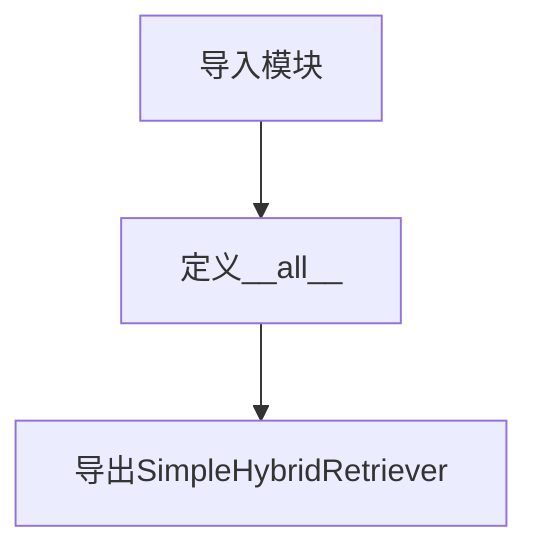

# `.\MetaGPT\metagpt\rag\retrievers\__init__.py` 详细设计文档

该文件是RAG检索器模块的初始化文件，主要功能是导出SimpleHybridRetriever类，作为模块的公共接口。

## 整体流程



## 类结构

```
metagpt.rag.retrievers
└── SimpleHybridRetriever (混合检索器)
```

## 全局变量及字段


### `__all__`
    
定义模块公开导出的符号列表，控制 from module import * 的行为。

类型：`list[str]`
    


    

## 全局函数及方法


## 关键组件


### SimpleHybridRetriever

一个简单的混合检索器，用于结合多种检索策略（如基于关键词和基于向量）来获取信息，旨在提高检索结果的全面性和准确性。


## 问题及建议


### 已知问题

-   **模块导出不完整**：`__init__.py` 文件仅导出了 `SimpleHybridRetriever` 一个类。如果 `metagpt.rag.retrievers` 包下存在其他检索器（例如 `BM25Retriever`, `VectorRetriever` 等），则用户无法通过 `from metagpt.rag.retrievers import *` 或直接导入包的方式便捷地访问它们，增加了使用复杂度和潜在的导入错误风险。
-   **缺乏版本或包信息**：该 `__init__.py` 文件仅包含导入和导出语句，没有提供任何关于此子包的元信息，例如 `__version__` 或 `__doc__`。这使得其他开发者或工具难以了解此包的基本信息和版本。
-   **潜在的循环导入风险**：虽然当前代码简单，但若未来在 `__init__.py` 中添加更复杂的逻辑或从同级模块导入大量内容，在模块结构设计不当时可能引发循环导入问题。

### 优化建议

-   **审查并导出公共接口**：检查 `metagpt.rag.retrievers` 目录下所有旨在公开给外部使用的类、函数或异常。更新 `__all__` 列表，包含所有公共组件，例如：`__all__ = ["SimpleHybridRetriever", "BM25Retriever", "VectorRetriever"]`。这遵循了Python的显式优于隐式原则，明确了包的公共API。
-   **添加包级文档字符串**：在文件顶部添加一个模块文档字符串（`""" ... """`），简要描述 `retrievers` 包的目的、包含的主要检索器类型以及基本用法。这能极大提升代码的可读性和可维护性。
-   **考虑惰性导入或动态导出**：如果包内模块很多或导入开销大，可以考虑在 `__init__.py` 中使用惰性导入。例如，使用 `__getattr__` 和 `__dir__` 来实现按需导入，或者仅在 `__all__` 中声明，但将实际导入放在函数内部。这可以优化包的启动时间。
-   **定义包版本**：如果项目有统一的版本管理，可以在此处或上级 `__init__.py` 中定义 `__version__` 属性。如果此子包有独立版本需求，可在此定义，例如 `__version__ = "1.0.0"`。
-   **保持简洁性**：`__init__.py` 的主要目的是方便用户导入，应避免在其中放置业务逻辑或复杂的初始化代码。坚持让它的职责单一化。


## 其它


### 设计目标与约束

该模块的设计目标是提供一个简洁、统一的入口点，用于导出RAG（检索增强生成）系统中的检索器组件。其主要约束包括：保持模块的轻量性，仅负责导入和导出核心的`SimpleHybridRetriever`类，不包含任何业务逻辑或配置代码，以确保职责单一和易于维护。

### 错误处理与异常设计

由于此模块仅包含导入和导出语句，不执行任何实际功能，因此本身不涉及错误处理或异常设计。任何导入错误（例如，`SimpleHybridRetriever`类在`metagpt.rag.retrievers.hybrid_retriever`模块中不存在）将由Python解释器在模块加载时抛出标准的`ImportError`异常。

### 数据流与状态机

此模块不处理任何数据流，也不维护任何状态。它的唯一作用是在Python运行时环境中，将`SimpleHybridRetriever`类的引用添加到当前模块的命名空间（通过`__all__`变量），供其他模块导入使用。没有状态变化或数据转换过程。

### 外部依赖与接口契约

1.  **外部依赖**：
    *   `metagpt.rag.retrievers.hybrid_retriever` 模块：这是核心依赖，必须存在并正确导出`SimpleHybridRetriever`类。

2.  **接口契约**：
    *   此模块通过`__all__ = ["SimpleHybridRetriever"]`明确声明其公开接口。外部代码通过`from metagpt.rag.retrievers import SimpleHybridRetriever`导入时，将获得对`hybrid_retriever`模块中定义的`SimpleHybridRetriever`类的引用。模块自身不提供任何额外的包装或功能。

### 配置管理

此模块不涉及任何运行时配置。所有相关配置（如检索器的参数）应在`SimpleHybridRetriever`类或其底层依赖中管理。

### 安全考虑

此模块代码本身不引入特定的安全风险。安全考虑应集中于其导出的`SimpleHybridRetriever`类的实现，例如在处理用户查询和文档检索时，需防范注入攻击、确保数据隐私等。

### 测试策略

对此模块的单元测试通常是不必要的，因为它只包含导入和导出语句。测试重点应放在`SimpleHybridRetriever`类的功能、集成测试以及确保`__init__.py`文件正确导出了预期的公共接口上。可以通过简单的导入语句验证来确认导出功能正常。

    