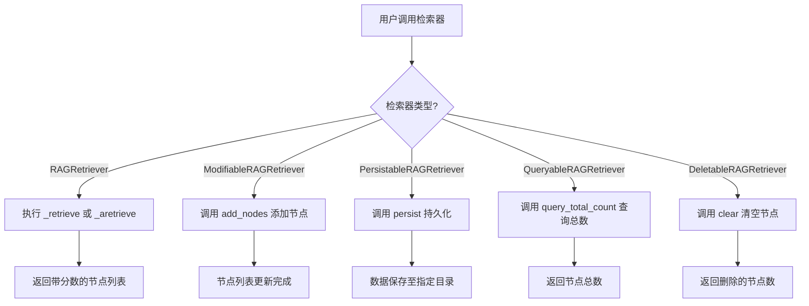
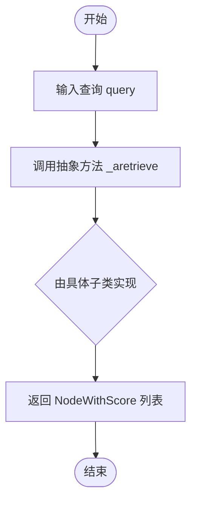
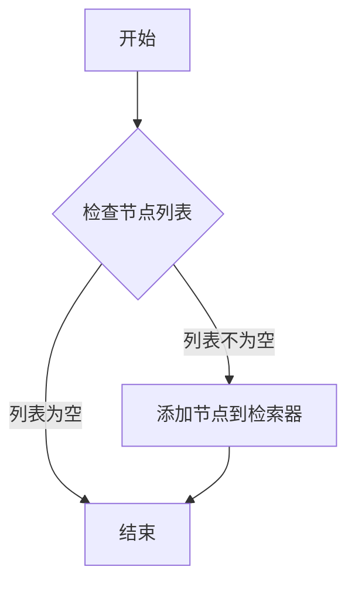
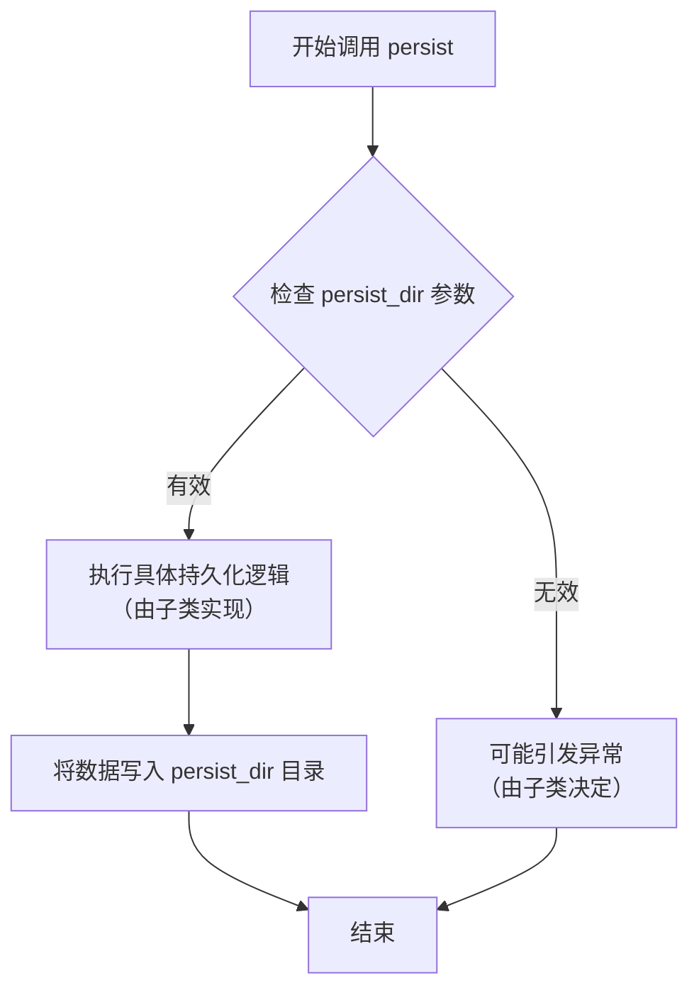
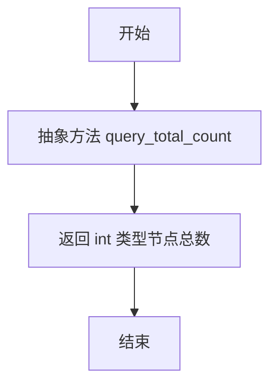
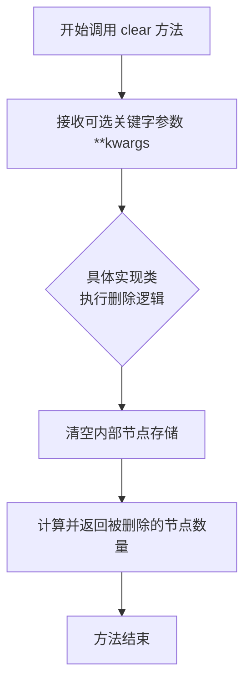

# `.\MetaGPT\metagpt\rag\retrievers\base.py` 详细设计文档

该代码定义了一个用于检索增强生成（RAG）系统的抽象基类层次结构。它基于 `llama_index` 的 `BaseRetriever`，通过多个抽象混合类（Mixin）扩展了检索器的功能，使其支持节点增删、持久化、查询总数等操作，并通过 `__subclasshook__` 方法提供了鸭子类型的子类检查机制。

## 整体流程



## 类结构

```
BaseRetriever (llama_index.core.retrievers)
└── RAGRetriever (抽象基类)
    ├── ModifiableRAGRetriever (抽象混合类)
    ├── PersistableRAGRetriever (抽象混合类)
    ├── QueryableRAGRetriever (抽象混合类)
    └── DeletableRAGRetriever (抽象混合类)
```

## 全局变量及字段


    

## 全局函数及方法

### `RAGRetriever._aretrieve`

这是一个抽象异步方法，定义了检索与查询相关的、带有相关性分数的节点列表的接口。它是 `RAGRetriever` 类异步检索流程的核心，具体实现由子类完成。

参数：
- `query`：`QueryType`，表示用户的查询输入，可以是字符串或查询对象。

返回值：`list[NodeWithScore]`，返回一个包含 `NodeWithScore` 对象的列表，每个对象代表一个检索到的文档节点及其与查询的相关性分数。

#### 流程图



#### 带注释源码

```python
    @abstractmethod
    async def _aretrieve(self, query: QueryType) -> list[NodeWithScore]:
        """Retrieve nodes"""
        # 这是一个抽象方法，仅定义了接口。
        # 具体实现应由继承自 `RAGRetriever` 的子类提供。
        # 实现逻辑应基于输入的 `query` 进行检索，并返回一个包含节点及其相关性分数的列表。
```

### `RAGRetriever._retrieve`

该方法是一个同步的检索方法，作为抽象异步方法 `_aretrieve` 的同步包装器。它接收一个查询，并返回一个包含节点及其相关性分数的列表。在当前的实现中，它直接调用了其对应的异步方法 `_aretrieve`，但此方法本身是抽象的，因此具体的检索逻辑需要在 `RAGRetriever` 的子类中实现。

参数：
- `query`：`QueryType`，表示用户输入的查询内容，其具体类型由 `llama_index` 框架定义。

返回值：`list[NodeWithScore]`，返回一个列表，其中每个元素都是一个 `NodeWithScore` 对象，该对象包含了检索到的节点（`BaseNode`）以及该节点与查询的相关性分数。

#### 流程图

```mermaid
flowchart TD
    A[“开始: _retrieve(query)”] --> B[“调用抽象异步方法 _aretrieve(query)”]
    B --> C{“子类是否实现 _aretrieve?”}
    C -- 是 --> D[“执行子类具体检索逻辑”]
    D --> E[“返回 list[NodeWithScore]”]
    C -- 否 --> F[“抛出 NotImplementedError 异常”]
    E --> G[“结束”]
    F --> G
```

#### 带注释源码

```python
def _retrieve(self, query: QueryType) -> list[NodeWithScore]:
    """Retrieve nodes"""
    # 该方法是一个同步接口，直接调用其对应的抽象异步方法 `_aretrieve`。
    # 具体的检索逻辑（如从向量数据库查询、计算相关性等）需要在继承自 `RAGRetriever` 的子类中实现 `_aretrieve` 方法。
    # 参数 `query` 是用户的查询输入。
    # 返回值是一个 `NodeWithScore` 对象的列表，包含了检索结果节点及其分数。
    return self._aretrieve(query)
```

### `ModifiableRAGRetriever.__subclasshook__`

该方法是一个类方法，用于实现 Python 的抽象基类（ABC）协议中的 `__subclasshook__`。它允许 `ModifiableRAGRetriever` 类在不显式继承的情况下，将实现了特定方法（`add_nodes`）的类识别为其“虚拟子类”。这增强了鸭子类型的灵活性，使得任何拥有 `add_nodes` 方法的类都可以被视为 `ModifiableRAGRetriever` 的子类。

参数：

- `cls`：`type`，类方法的标准参数，指代 `ModifiableRAGRetriever` 类本身。
- `C`：`type`，被检查的类，即需要判断是否为 `ModifiableRAGRetriever` 子类的类。

返回值：`bool` 或 `NotImplemented`，如果被检查的类 `C` 实现了 `add_nodes` 方法，则返回 `True`，表示它是 `ModifiableRAGRetriever` 的虚拟子类；否则返回 `NotImplemented`，由 Python 的默认子类检查机制处理。

#### 流程图

```mermaid
flowchart TD
    A[开始: __subclasshook__(cls, C)] --> B{cls 是 ModifiableRAGRetriever 吗？}
    B -- 是 --> C[调用 check_methods(C, "add_nodes")]
    C --> D{check_methods 返回 True?}
    D -- 是 --> E[返回 True]
    D -- 否 --> F[返回 NotImplemented]
    B -- 否 --> F
    E --> G[结束]
    F --> G
```

#### 带注释源码

```python
    @classmethod
    def __subclasshook__(cls, C):
        # 检查当前调用此钩子的类是否是 ModifiableRAGRetriever 本身。
        # 这是为了防止在检查 ModifiableRAGRetriever 的子类时也触发此逻辑。
        if cls is ModifiableRAGRetriever:
            # 调用工具函数 check_methods，检查类 C 是否拥有名为 "add_nodes" 的方法。
            # 如果 C 或其父类中定义了 add_nodes 方法，则返回 True。
            return check_methods(C, "add_nodes")
        # 如果 cls 不是 ModifiableRAGRetriever（例如，是它的一个子类），
        # 或者 C 没有实现 add_nodes 方法，则返回 NotImplemented。
        # 返回 NotImplemented 会让 Python 使用标准的继承机制来判断子类关系。
        return NotImplemented
```

### `ModifiableRAGRetriever.add_nodes`

该方法是一个抽象方法，用于向检索器中添加新的文档节点。它定义了支持文档修改功能的检索器必须实现的接口，确保子类能够动态地更新其内部的知识库。

参数：

- `nodes`：`list[BaseNode]`，需要添加到检索器中的节点列表。
- `**kwargs`：`Any`，可选的关键字参数，用于提供额外的配置或上下文信息。

返回值：`None`，该方法不返回任何值。

#### 流程图



#### 带注释源码

```python
@abstractmethod
def add_nodes(self, nodes: list[BaseNode], **kwargs) -> None:
    """To support add docs, must inplement this func"""
    # 这是一个抽象方法，具体的实现逻辑由继承ModifiableRAGRetriever的子类提供。
    # 子类需要实现如何将传入的节点列表 `nodes` 整合到其内部的存储或索引结构中。
    # `**kwargs` 参数允许子类在实现时接收额外的、可选的配置参数。
    pass
```

### `PersistableRAGRetriever.__subclasshook__`

该方法是一个类方法，用于实现Python的抽象基类（ABC）的`__subclasshook__`协议。它允许`PersistableRAGRetriever`类在运行时检查一个类`C`是否可以被视为其子类，而无需显式地继承它。具体逻辑是：如果当前检查的类就是`PersistableRAGRetriever`自身，则调用`check_methods`函数来验证类`C`是否实现了`persist`方法。如果类`C`实现了该方法，则返回`True`，表示`C`是`PersistableRAGRetriever`的（虚拟）子类；否则返回`False`。如果检查的不是`PersistableRAGRetriever`类本身，则返回`NotImplemented`，将子类检查交由Python的默认机制处理。

参数：
- `cls`：`type`，指向`PersistableRAGRetriever`类本身的类对象。
- `C`：`type`，被检查的类对象，需要判断它是否是`PersistableRAGRetriever`的（虚拟）子类。

返回值：`bool | type(NotImplemented)`，如果`C`是`PersistableRAGRetriever`的虚拟子类则返回`True`，否则返回`False`。如果检查的不是`PersistableRAGRetriever`类本身，则返回`NotImplemented`。

#### 流程图

```mermaid
flowchart TD
    A[开始: __subclasshook__(cls, C)] --> B{cls 是 PersistableRAGRetriever 吗？};
    B -- 是 --> C[调用 check_methods(C, "persist")];
    C --> D{check_methods 返回 True?};
    D -- 是 --> E[返回 True];
    D -- 否 --> F[返回 False];
    B -- 否 --> G[返回 NotImplemented];
    E --> H[结束];
    F --> H;
    G --> H;
```

#### 带注释源码

```python
    @classmethod
    def __subclasshook__(cls, C):
        # 检查当前调用__subclasshook__的类是否是PersistableRAGRetriever本身。
        # 这是为了确保该钩子只对PersistableRAGRetriever类生效。
        if cls is PersistableRAGRetriever:
            # 调用外部工具函数check_methods，检查类C是否实现了名为"persist"的方法。
            # 如果C实现了persist方法，则check_methods返回True，否则返回False。
            # 这个返回值直接决定了C是否被视为PersistableRAGRetriever的虚拟子类。
            return check_methods(C, "persist")
        # 如果当前检查的类不是PersistableRAGRetriever（例如，可能是它的子类在调用），
        # 则返回NotImplemented，让Python使用标准的继承检查机制。
        return NotImplemented
```

### `PersistableRAGRetriever.persist`

该方法是一个抽象方法，用于将检索器的状态（如索引数据）持久化到指定的目录中。它是`PersistableRAGRetriever`类的核心契约，任何继承该类的具体检索器都必须实现此方法以支持持久化功能。

参数：
- `persist_dir`：`str`，指定持久化数据应保存的目录路径。
- `**kwargs`：`Any`，可选的关键字参数，允许实现类接收额外的配置或上下文信息，以支持更灵活的持久化逻辑。

返回值：`None`，该方法不返回任何值，其作用是将内部状态写入文件系统。

#### 流程图



#### 带注释源码

```python
    @abstractmethod
    def persist(self, persist_dir: str, **kwargs) -> None:
        """To support persist, must inplement this func"""
        # 这是一个抽象方法，没有具体的实现代码。
        # 任何继承自 PersistableRAGRetriever 的子类都必须提供此方法的具体实现。
        # 实现逻辑通常包括：
        # 1. 验证 persist_dir 参数的有效性（例如，路径是否存在、是否可写）。
        # 2. 将当前检索器的内部状态（如向量索引、文档块、元数据等）序列化。
        # 3. 将序列化后的数据保存到 persist_dir 指定的目录中。
        # 4. 可能通过 **kwargs 处理额外的持久化选项。
        pass
```

### `QueryableRAGRetriever.__subclasshook__`

该方法是一个类方法，用于实现Python的抽象基类（ABC）的`__subclasshook__`协议。它检查一个类`C`是否可以被视为`QueryableRAGRetriever`的子类，即使它没有显式地继承自`QueryableRAGRetriever`。检查的核心逻辑是验证类`C`是否实现了`query_total_count`方法。

参数：

- `cls`：`type`，类方法的标准参数，指向`QueryableRAGRetriever`类本身。
- `C`：`type`，需要被检查的类。

返回值：`bool` 或 `NotImplemented`，如果类`C`实现了`query_total_count`方法，则返回`True`，表示`C`是`QueryableRAGRetriever`的（虚拟）子类；否则返回`NotImplemented`，由Python解释器继续使用标准继承机制判断。

#### 流程图

```mermaid
flowchart TD
    A[开始: __subclasshook__(cls, C)] --> B{cls 是 QueryableRAGRetriever 吗？}
    B -- 是 --> C[调用 check_methods(C, 'query_total_count')]
    C --> D{check_methods 返回 True?}
    D -- 是 --> E[返回 True]
    D -- 否 --> F[返回 NotImplemented]
    B -- 否 --> F
    E --> G[结束]
    F --> G
```

#### 带注释源码

```python
    @classmethod
    def __subclasshook__(cls, C):
        # 只有当检查是针对 QueryableRAGRetriever 类本身时才执行自定义逻辑
        if cls is QueryableRAGRetriever:
            # 调用工具函数 check_methods，检查类 C 是否拥有 'query_total_count' 方法
            # 如果拥有，则返回 True，使 C 成为 QueryableRAGRetriever 的虚拟子类
            return check_methods(C, "query_total_count")
        # 如果检查的不是 QueryableRAGRetriever 类本身，或者 C 没有所需方法，
        # 则返回 NotImplemented，让 Python 使用默认的继承机制（如检查 MRO）来判断
        return NotImplemented
```

### `QueryableRAGRetriever.query_total_count`

该方法是一个抽象方法，用于查询检索器中存储的节点总数。它定义了`QueryableRAGRetriever`类的一个核心契约，要求其子类必须实现此方法以提供查询总节点数的功能。

参数：
- 无

返回值：`int`，返回检索器中存储的节点总数。

#### 流程图



#### 带注释源码

```python
    @abstractmethod
    def query_total_count(self) -> int:
        """To support querying total count, must implement this func."""
```

### `DeletableRAGRetriever.__subclasshook__`

该方法是一个类方法，用于实现Python的抽象基类（ABC）的`__subclasshook__`协议。它检查一个类`C`是否可以被视为`DeletableRAGRetriever`的子类，即使它没有显式地继承自`DeletableRAGRetriever`。其核心逻辑是：如果当前类（`cls`）是`DeletableRAGRetriever`本身，则通过`check_methods`函数验证传入的类`C`是否实现了`clear`方法。如果实现了，则返回`True`，表示`C`是`DeletableRAGRetriever`的虚拟子类；否则返回`NotImplemented`，让Python继续使用标准的子类检查机制。

参数：

- `cls`：`type`，指向当前类`DeletableRAGRetriever`的引用。
- `C`：`type`，被检查的类，需要判断它是否是`DeletableRAGRetriever`的子类。

返回值：`bool` 或 `NotImplementedType`，如果`C`通过了方法检查，则返回`True`；否则返回`NotImplemented`。

#### 流程图

```mermaid
flowchart TD
    A[开始: __subclasshook__(cls, C)] --> B{cls 是 DeletableRAGRetriever 吗？}
    B -- 是 --> C[调用 check_methods(C, "clear")]
    C --> D{check_methods 返回 True?}
    D -- 是 --> E[返回 True]
    D -- 否 --> F[返回 NotImplemented]
    B -- 否 --> F
    E --> G[结束]
    F --> G
```

#### 带注释源码

```python
    @classmethod
    def __subclasshook__(cls, C):
        # 检查当前调用是否针对 DeletableRAGRetriever 类本身
        if cls is DeletableRAGRetriever:
            # 如果是，则检查类 C 是否实现了 "clear" 方法
            # check_methods 函数会验证 C 或其 MRO 中是否有名为 "clear" 的可调用属性
            return check_methods(C, "clear")
        # 如果当前类不是 DeletableRAGRetriever（例如在子类中调用），
        # 或者 C 没有实现 "clear" 方法，则返回 NotImplemented。
        # 返回 NotImplemented 会让 Python 使用默认的子类检查机制。
        return NotImplemented
```


### `DeletableRAGRetriever.clear`

`DeletableRAGRetriever.clear` 是一个抽象方法，用于定义支持删除所有节点的检索器（Retriever）必须实现的核心功能。它旨在清空检索器内部存储的所有节点数据，并返回被删除的节点数量。

参数：

-  `**kwargs`：`dict`，可选的关键字参数，允许实现类在删除操作时接收额外的配置或上下文信息，例如删除操作的确认标志、特定的删除策略等。

返回值：`int`，返回被成功删除的节点总数。

#### 流程图



#### 带注释源码

```
class DeletableRAGRetriever(RAGRetriever):
    """Support deleting all nodes."""

    @classmethod
    def __subclasshook__(cls, C):
        # 类方法，用于检查一个类C是否是DeletableRAGRetriever的（非严格）子类。
        # 它通过检查类C是否实现了`clear`方法来判断。
        if cls is DeletableRAGRetriever:
            return check_methods(C, "clear")
        return NotImplemented

    @abstractmethod
    def clear(self, **kwargs) -> int:
        """To support deleting all nodes, must implement this func."""
        # 抽象方法声明。
        # 任何继承自DeletableRAGRetriever的具体类都必须实现此方法。
        # **kwargs: 提供灵活性，允许传递实现删除逻辑时可能需要的任何额外参数。
        # 返回值 int: 表示被清除的节点数量，用于操作反馈或日志记录。
```


## 关键组件


### RAGRetriever

作为所有RAG检索器的抽象基类，继承自LlamaIndex的BaseRetriever，定义了核心的同步和异步检索接口。

### ModifiableRAGRetriever

一个支持动态修改的RAG检索器抽象类，通过`__subclasshook__`机制强制要求子类实现`add_nodes`方法，以支持向检索器中添加文档节点。

### PersistableRAGRetriever

一个支持持久化的RAG检索器抽象类，通过`__subclasshook__`机制强制要求子类实现`persist`方法，以支持将检索器状态保存到磁盘。

### QueryableRAGRetriever

一个支持查询的RAG检索器抽象类，通过`__subclasshook__`机制强制要求子类实现`query_total_count`方法，以支持查询检索器中存储的节点总数。

### DeletableRAGRetriever

一个支持删除的RAG检索器抽象类，通过`__subclasshook__`机制强制要求子类实现`clear`方法，以支持清空检索器中存储的所有节点。


## 问题及建议


### 已知问题

-   **抽象基类 `RAGRetriever` 的实现不完整**：`RAGRetriever` 继承自 `BaseRetriever` 并声明了 `_aretrieve` 和 `_retrieve` 两个抽象方法。然而，`_retrieve` 方法被定义为一个具体方法（没有 `@abstractmethod` 装饰器），但其函数体为空（仅包含文档字符串）。这违反了 `BaseRetriever` 的接口契约，可能导致运行时错误或未定义行为，因为父类期望这些方法有具体的实现来执行检索逻辑。
-   **`__subclasshook__` 方法的潜在误用**：`ModifiableRAGRetriever`、`PersistableRAGRetriever`、`QueryableRAGRetriever` 和 `DeletableRAGRetriever` 都使用了 `__subclasshook__` 来检查子类是否实现了特定方法（如 `add_nodes`, `persist` 等）。虽然这提供了灵活的鸭子类型检查，但它绕过了 Python 的正式抽象基类（ABC）注册机制。如果一个类没有显式地继承这些抽象基类，但实现了所需方法，它仍会被 `issubclass` 或 `isinstance` 认为是子类，这可能导致类型系统混乱和意料之外的行为。
-   **方法签名不一致**：`DeletableRAGRetriever.clear` 方法的返回类型标注为 `int`，但文档字符串描述为“删除所有节点”。通常，`clear` 操作可能返回删除的节点数量，但文档与类型标注的意图不够清晰，且与其他抽象方法（如 `add_nodes`, `persist` 返回 `None`）的约定不一致。
-   **代码重复**：四个特性类（`ModifiableRAGRetriever`, `PersistableRAGRetriever`, `QueryableRAGRetriever`, `DeletableRAGRetriever`）的结构高度相似，都包含一个几乎相同的 `__subclasshook__` 方法和一个抽象方法。这种重复违反了 DRY（Don't Repeat Yourself）原则，增加了维护成本。

### 优化建议

-   **修正 `RAGRetriever` 的抽象方法**：应将 `_retrieve` 方法也标记为 `@abstractmethod`，或者提供一个有意义的默认实现（例如抛出 `NotImplementedError` 或调用 `_aretrieve`）。更佳实践是遵循 `BaseRetriever` 的设计，确保两个方法都有明确的实现逻辑。建议审查 `BaseRetriever` 的预期行为，并正确实现或抽象这两个核心检索方法。
-   **重构特性类以减少重复**：可以创建一个基类或使用混入（Mixin）模式来封装 `__subclasshook__` 的通用逻辑。例如，定义一个 `FeatureRAGRetriever` 基类，它接受一个需要检查的方法名作为参数，从而消除四个类中的重复代码。
-   **明确 `__subclasshook__` 的使用范围**：如果项目强烈依赖鸭子类型而非显式继承，应明确记录这一设计决策。否则，考虑让这些类继承 `abc.ABC` 并依赖标准的 `@abstractmethod` 机制，这能提供更严格的接口保证。可以将 `__subclasshook__` 作为可选特性，但需在文档中说明其行为和潜在影响。
-   **统一和澄清方法契约**：重新审视所有抽象方法的签名和文档字符串。特别是 `DeletableRAGRetriever.clear` 方法，应明确其返回值是删除的节点数还是操作状态。建议所有“操作”类方法（如 `add_nodes`, `persist`, `clear`）保持返回类型一致（例如都返回 `None` 或一个操作结果对象），并在文档中清晰说明。
-   **增强类型注解和文档**：为所有方法参数（如 `**kwargs`）添加更详细的类型注解和描述，说明它们可能接受的参数及其用途。这能提高代码的可读性和可维护性。同时，为每个类添加更全面的文档字符串，解释其设计目的和如何与其他类协作。


## 其它


### 设计目标与约束

本模块旨在为RAG（检索增强生成）系统提供一个可扩展的检索器抽象基类框架。其核心设计目标包括：
1.  **接口标准化**：定义一组清晰的抽象方法（如 `_retrieve`, `add_nodes`, `persist`），强制实现类遵循统一的接口契约，确保不同检索器实现之间的可替换性和互操作性。
2.  **功能模块化**：通过多个独立的Mixin类（如 `ModifiableRAGRetriever`, `PersistableRAGRetriever`），将检索器的核心检索功能与增删改查、持久化等扩展功能解耦。这允许开发者根据需要组合功能，实现“按需继承”，提高了代码的灵活性和可维护性。
3.  **运行时类型检查**：利用Python的 `__subclasshook__` 机制和 `check_methods` 工具，为每个Mixin类提供非侵入式的鸭子类型（Duck Typing）支持。这使得即使一个类没有显式继承某个Mixin，只要它实现了所需的方法，也会在运行时被 `isinstance` 和 `issubclass` 识别为该Mixin的子类，增强了接口的灵活性和动态性。
4.  **异步支持**：在基类 `RAGRetriever` 中同时定义了同步方法 `_retrieve` 和异步方法 `_aretrieve` 的抽象，为检索操作提供了同步和异步两种执行模式的选择，以适应不同的应用场景和性能需求。

主要约束包括对 `llama_index` 库中 `BaseRetriever` 基类的依赖，以及所有具体功能（如向量存储的增删改查、序列化）都需要由子类实现。

### 错误处理与异常设计

当前代码层面未显式定义自定义异常。错误处理主要依赖于以下机制：
1.  **抽象方法未实现异常**：当子类未实现父类中标记为 `@abstractmethod` 的方法（如 `_retrieve`, `add_nodes`）时，Python解释器在实例化时会抛出 `TypeError`。
2.  **运行时类型检查异常**：`check_methods` 函数在检查失败时可能抛出异常（具体行为取决于其实现），这会在使用 `__subclasshook__` 进行类型判断时触发。
3.  **子类实现责任**：具体的错误处理（如无效节点添加、持久化路径错误、删除操作失败等）应由各个功能Mixin（`ModifiableRAGRetriever`, `PersistableRAGRetriever` 等）的具体实现类来定义和抛出相应的异常（例如 `ValueError`, `IOError`, `RuntimeError`）。

建议在后续设计中，为每个核心操作定义领域相关的自定义异常类（如 `NodeAdditionError`, `PersistenceError`, `DeletionError`），以提供更精确的错误信息和更清晰的错误处理边界。

### 数据流与状态机

本模块定义的是接口和抽象类，不包含具体的状态或数据流。数据流和状态管理完全由具体的实现类控制。
1.  **数据流**：对于检索操作，输入是 `QueryType`（通常是字符串），输出是 `list[NodeWithScore]`。对于修改操作（如 `add_nodes`），输入是 `list[BaseNode]`。数据如何存储、索引、检索和评分，完全取决于子类所集成的底层存储引擎（如Chroma, FAISS, Elasticsearch等）。
2.  **状态机**：检索器本身可能具有状态（例如，已索引的文档集合）。`add_nodes` 和 `clear` 操作会改变这个状态。`persist` 操作将当前状态保存到外部存储。然而，状态转换的逻辑和一致性保证（如并发修改）需要由具体实现来管理。

模块通过接口约定了数据输入输出的格式，但将具体的数据处理和状态转换逻辑委托给了子类。

### 外部依赖与接口契约

1.  **外部依赖**:
    *   **llama_index-core**: 强依赖。基类 `RAGRetriever` 继承自 `llama_index.core.retrievers.BaseRetriever`，并使用了其定义的 `QueryType`、`BaseNode`、`NodeWithScore` 等核心数据类型。版本兼容性需要严格管理。
    *   **metagpt.utils.reflection**: 弱依赖。仅使用了 `check_methods` 这一个工具函数来辅助实现 `__subclasshook__`。理论上可以替换为其他具有相同功能的检查方法。

2.  **接口契约**:
    *   **与上游调用者的契约**：任何调用本模块检索器的代码（如RAG管道中的查询组件）可以依赖 `RAGRetriever.retrieve()`（或其异步版本）方法返回 `NodeWithScore` 列表。对于支持特定功能的检索器，调用者可以使用 `isinstance(retriever, ModifiableRAGRetriever)` 等方式进行能力检测，然后安全地调用 `add_nodes`、`persist` 等方法。
    *   **与下游实现者的契约**：任何具体检索器实现类必须继承自 `RAGRetriever` 并实现 `_retrieve` 和/或 `_aretrieve` 方法。若需支持特定功能，则应实现相应的Mixin类（或其方法），并确保方法签名与抽象定义一致。实现者负责管理底层数据存储的生命周期、并发安全及错误处理。
    *   **数据格式契约**：所有输入输出的数据格式（`QueryType`, `BaseNode`, `NodeWithScore`）均遵循 `llama_index.core.schema` 的定义，确保了在整个 `llama_index` 生态中的兼容性。


    