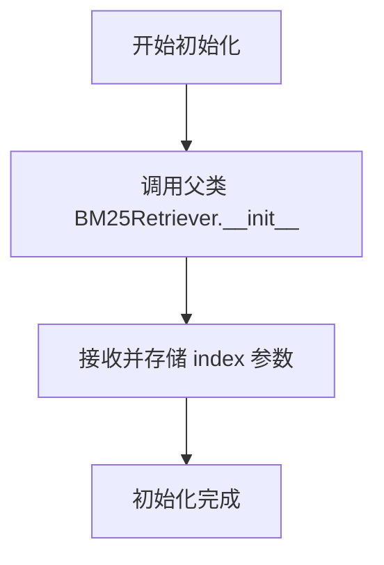
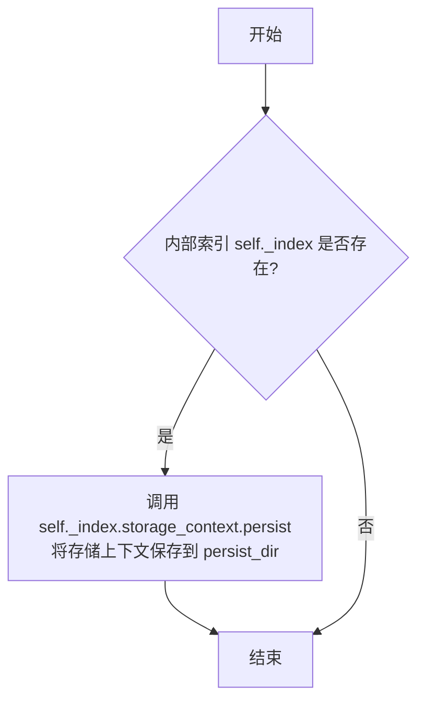
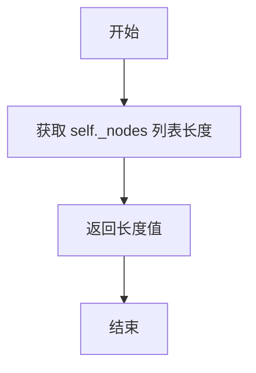
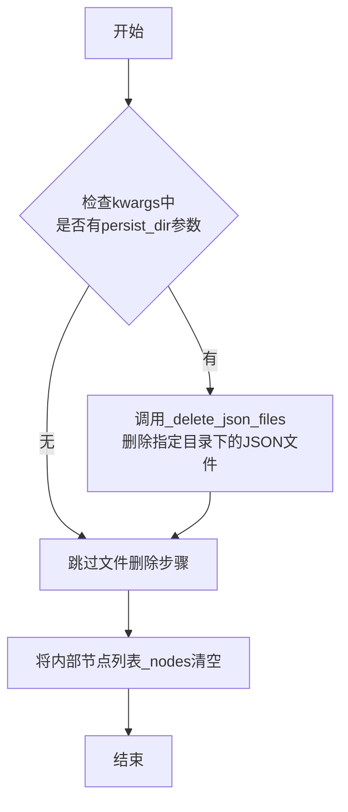
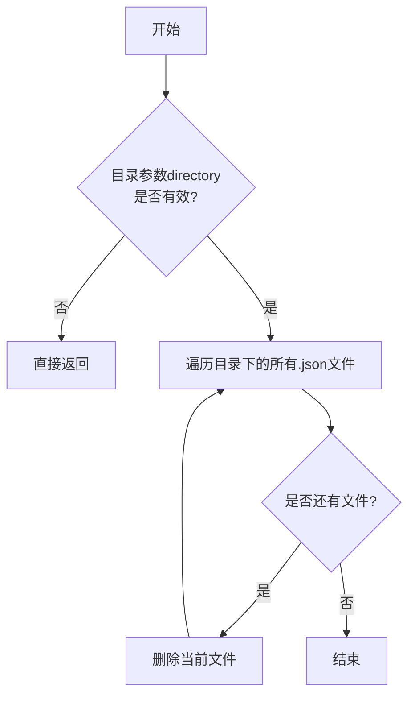

# `.\MetaGPT\metagpt\rag\retrievers\bm25_retriever.py` 详细设计文档

该代码实现了一个动态的BM25检索器（DynamicBM25Retriever），它继承自LlamaIndex的BM25Retriever，并扩展了功能以支持与VectorStoreIndex的协同工作。核心功能是提供基于BM25算法的文档检索，并允许在运行时动态添加文档节点、持久化索引、查询节点总数以及清空索引，实现了检索索引的增删改查全生命周期管理。

## 整体流程

```mermaid
graph TD
    A[开始] --> B[初始化DynamicBM25Retriever]
    B --> C[传入初始节点列表nodes]
    C --> D[调用父类BM25Retriever.__init__]
    D --> E[初始化内部数据结构_nodes, _corpus, bm25]
    E --> F[保存传入的VectorStoreIndex引用到self._index]
    F --> G[初始化完成]
    G --> H{等待操作调用}
    H -- 调用add_nodes --> I[接收新节点列表]
    I --> J[将新节点加入self._nodes]
    J --> K[使用_tokenizer处理所有节点内容，更新self._corpus]
    K --> L[用新的_corpus重建BM25Okapi模型self.bm25]
    L --> M{self._index存在?}
    M -- 是 --> N[调用_index.insert_nodes同步插入节点]
    M -- 否 --> O[操作完成]
    N --> O
    H -- 调用persist --> P[接收持久化目录路径]
    P --> Q{self._index存在?}
    Q -- 是 --> R[调用_index.storage_context.persist持久化]
    Q -- 否 --> S[操作完成]
    R --> S
    H -- 调用query_total_count --> T[返回len(self._nodes)]
    H -- 调用clear --> U[接收可选参数persist_dir]
    U --> V[调用内部方法_delete_json_files(persist_dir)]
    V --> W[清空self._nodes列表]
    W --> X[操作完成]
```

## 类结构

```
BM25Retriever (来自llama_index.retrievers.bm25)
└── DynamicBM25Retriever (本文件主类)
    ├── __init__ (构造函数)
    ├── add_nodes (添加节点方法)
    ├── persist (持久化方法)
    ├── query_total_count (查询总数方法)
    ├── clear (清空方法)
    └── _delete_json_files (静态辅助方法)
```

## 全局变量及字段


### `DynamicBM25Retriever._index`
    
用于与向量存储索引进行交互的可选索引实例，支持节点插入和持久化操作。

类型：`VectorStoreIndex`
    
    

## 全局函数及方法

### `DynamicBM25Retriever.__init__`

该方法用于初始化 `DynamicBM25Retriever` 类的实例。它继承自 `BM25Retriever` 的初始化逻辑，并额外接收一个 `VectorStoreIndex` 类型的 `index` 参数，将其存储为实例变量 `_index`，以实现与向量索引的联动。

参数：

- `nodes`：`list[BaseNode]`，用于检索的初始节点列表。
- `tokenizer`：`Optional[Callable[[str], list[str]]]`，可选的文本分词器函数，用于将文本内容转换为词元列表。
- `similarity_top_k`：`int`，检索时返回的最相似结果数量，默认为 `DEFAULT_SIMILARITY_TOP_K`。
- `callback_manager`：`Optional[CallbackManager]`，可选的回调管理器，用于处理检索过程中的回调事件。
- `objects`：`Optional[list[IndexNode]]`，可选的索引节点列表，用于构建更复杂的索引结构。
- `object_map`：`Optional[dict]`，可选的映射字典，用于管理对象与索引的关系。
- `verbose`：`bool`，是否启用详细日志输出模式。
- `index`：`VectorStoreIndex`，一个可选的向量存储索引实例，用于支持节点添加时的索引同步。

返回值：`None`，此方法不返回任何值。

#### 流程图



#### 带注释源码

```python
def __init__(
    self,
    nodes: list[BaseNode],
    tokenizer: Optional[Callable[[str], list[str]]] = None,
    similarity_top_k: int = DEFAULT_SIMILARITY_TOP_K,
    callback_manager: Optional[CallbackManager] = None,
    objects: Optional[list[IndexNode]] = None,
    object_map: Optional[dict] = None,
    verbose: bool = False,
    index: VectorStoreIndex = None,  # 新增参数：用于联动的向量索引
) -> None:
    # 调用父类 BM25Retriever 的初始化方法，设置基础检索器
    super().__init__(
        nodes=nodes,
        tokenizer=tokenizer,
        similarity_top_k=similarity_top_k,
        callback_manager=callback_manager,
        object_map=object_map,
        objects=objects,
        verbose=verbose,
    )
    # 将传入的向量索引存储为实例变量，以便后续方法（如 add_nodes）使用
    self._index = index
```

### `DynamicBM25Retriever.add_nodes`

该方法用于向动态BM25检索器中添加新的文档节点。它会更新内部节点列表、重建BM25语料库和索引模型，并可选地将新节点同步到关联的向量存储索引中。

参数：

- `nodes`：`list[BaseNode]`，要添加的新节点列表
- `**kwargs`：`dict`，可变关键字参数，用于传递给底层索引的插入操作

返回值：`None`，无返回值

#### 流程图

```mermaid
flowchart TD
    A[开始: add_nodes(nodes, **kwargs)] --> B[将新节点追加到_nodes列表]
    B --> C[重新构建语料库<br>对每个节点内容进行分词]
    C --> D[使用新语料库重建BM25模型]
    D --> E{是否存在关联的_index?}
    E -- 是 --> F[调用_index.insert_nodes<br>同步插入新节点]
    E -- 否 --> G[结束]
    F --> G
```

#### 带注释源码

```python
def add_nodes(self, nodes: list[BaseNode], **kwargs) -> None:
    """Support add nodes."""

    # 1. 将新节点追加到内部节点列表
    self._nodes.extend(nodes)
    
    # 2. 重新构建整个语料库：对每个节点的内容进行分词处理
    self._corpus = [self._tokenizer(node.get_content()) for node in self._nodes]
    
    # 3. 使用更新后的语料库重建BM25模型
    self.bm25 = BM25Okapi(self._corpus)

    # 4. 如果存在关联的向量索引，将新节点同步插入
    if self._index:
        self._index.insert_nodes(nodes, **kwargs)
```

### `DynamicBM25Retriever.persist`

该方法用于将关联的 `VectorStoreIndex` 的存储上下文持久化到指定的目录中。它通过调用内部索引对象的持久化方法来实现，确保检索器使用的数据能够被保存到磁盘，以便后续可以重新加载和使用。

参数：

- `persist_dir`：`str`，指定持久化数据的目标目录路径。
- `**kwargs`：`Any`，可选的关键字参数，用于传递给底层持久化方法的额外配置。

返回值：`None`，该方法不返回任何值。

#### 流程图



#### 带注释源码

```python
def persist(self, persist_dir: str, **kwargs) -> None:
    """Support persist."""

    # 检查当前对象是否关联了一个 VectorStoreIndex 实例
    if self._index:
        # 如果存在关联的索引，则调用其存储上下文的 persist 方法
        # 将索引数据（如向量、文档等）保存到指定的 persist_dir 目录
        self._index.storage_context.persist(persist_dir)
    # 如果 self._index 为 None，则该方法不执行任何操作
```

### `DynamicBM25Retriever.query_total_count`

该方法用于查询当前检索器中存储的文档节点总数。

参数：无

返回值：`int`，返回当前检索器中存储的文档节点总数。

#### 流程图



#### 带注释源码

```python
def query_total_count(self) -> int:
    """Support query total count."""

    # 返回内部节点列表 `self._nodes` 的长度，即当前存储的文档节点总数。
    return len(self._nodes)
```

### `DynamicBM25Retriever.clear`

该方法用于清空检索器中的所有节点数据，并可选地删除指定持久化目录下的所有JSON文件，以实现数据的完全清理。

参数：

- `**kwargs`：`dict`，可选的关键字参数，用于传递额外的配置信息，例如持久化目录路径。

返回值：`None`，该方法不返回任何值。

#### 流程图



#### 带注释源码

```python
def clear(self, **kwargs) -> None:
    """Support deleting all nodes."""

    # 调用静态方法，尝试删除指定持久化目录下的所有JSON文件
    self._delete_json_files(kwargs.get("persist_dir"))
    # 清空内部存储的节点列表，完成内存中数据的清理
    self._nodes = []
```

### `DynamicBM25Retriever._delete_json_files`

这是一个静态方法，用于删除指定目录下的所有JSON文件。它首先检查目录参数是否有效，如果无效则直接返回。如果目录有效，它会遍历该目录下的所有`.json`文件并逐一删除。

参数：

- `directory`：`str`，指定要删除JSON文件的目录路径。如果为`None`或空字符串，方法将直接返回而不执行任何操作。

返回值：`None`，此方法不返回任何值。

#### 流程图



#### 带注释源码

```python
@staticmethod
def _delete_json_files(directory: str):
    """Delete all JSON files in the specified directory."""

    # 检查目录参数是否为空或无效，如果是则直接返回，避免后续操作
    if not directory:
        return

    # 使用pathlib.Path对象表示目录，并遍历该目录下所有扩展名为.json的文件
    for file in Path(directory).glob("*.json"):
        # 删除当前遍历到的JSON文件
        file.unlink()
```

## 关键组件


### BM25Okapi 检索核心

实现了基于 BM25 算法的核心检索功能，用于计算查询与文档集合中每个文档的相关性得分。

### 动态节点管理

支持在运行时向检索器动态添加新的文档节点，并同步更新底层的 BM25 索引和关联的向量存储索引。

### 持久化与状态管理

提供了将检索器状态（通过关联的向量存储索引）持久化到磁盘以及清空所有节点和持久化文件的功能。

### 向量存储索引集成

通过维护一个对 `VectorStoreIndex` 的引用，实现了与向量检索系统的松耦合集成，允许在添加节点时进行双向同步。


## 问题及建议


### 已知问题

-   **`clear` 方法存在潜在的数据不一致风险**：`clear` 方法在清空内存中的 `self._nodes` 列表后，会调用 `_delete_json_files` 删除指定目录下的所有 `.json` 文件。然而，`self._corpus` 和 `self.bm25` 这两个依赖 `self._nodes` 的内部状态并未被重置。这可能导致后续调用 `add_nodes` 或检索方法时，内部状态与 `self._nodes` 不一致，引发错误或返回错误结果。
-   **`_delete_json_files` 方法过于宽泛且危险**：该方法会删除指定目录下的**所有** `.json` 文件，而不仅仅是当前检索器或关联索引创建的文件。这可能导致意外删除其他重要数据文件，存在严重的数据丢失风险。
-   **`add_nodes` 方法性能瓶颈**：每次调用 `add_nodes` 时，都会为**所有节点**（包括新增的和已有的）重新构建 `self._corpus` 列表和 `self.bm25` 模型。随着节点数量增加，此操作的计算成本将线性增长，成为性能瓶颈。
-   **构造函数参数 `index` 默认值不当**：`__init__` 方法中 `index: VectorStoreIndex = None` 使用了可变对象 `None` 作为默认参数。虽然在此处是常见的做法，但需要注意在 Python 中，默认参数在函数定义时被求值，对于可变对象可能导致意料之外的行为（尽管此处是 `None`）。更清晰的写法是 `index: Optional[VectorStoreIndex] = None`。
-   **缺乏对 `_index` 为 `None` 时的健壮性处理**：在 `add_nodes` 和 `persist` 方法中，直接访问 `self._index` 的属性（如 `insert_nodes`, `storage_context`），如果 `self._index` 为 `None`，将抛出 `AttributeError`。虽然代码中有 `if self._index:` 判断，但整体设计上对 `_index` 的依赖关系不够明确。

### 优化建议

-   **重构 `clear` 方法以保持内部状态一致**：在 `clear` 方法中，除了清空 `self._nodes`，还应同时将 `self._corpus` 重置为空列表，并将 `self.bm25` 设置为 `None` 或一个新的空 `BM25Okapi` 实例。同时，考虑将目录清理逻辑与状态重置逻辑解耦。
-   **改进 `_delete_json_files` 方法或移除该功能**：建议为检索器或关联的索引定义一个明确的、可识别的文件命名模式或存储结构，使 `clear` 操作能够精准删除自身相关的文件，而不是整个目录下的 `.json` 文件。或者，将持久化文件的清理责任完全交给 `VectorStoreIndex`，`DynamicBM25Retriever` 仅负责内存状态的清理。
-   **优化 `add_nodes` 方法的性能**：改为增量更新策略。可以维护 `self._corpus` 为新增节点的分词结果列表，并实现一个支持增量文档添加的 BM25 模型，或者仅在达到一定阈值或显式调用时进行全量重建。如果使用 `rank_bm25` 库不支持增量更新，可以考虑定期重建或使用其他支持增量操作的检索库。
-   **明确类型注解和默认参数**：将构造函数中的 `index` 参数类型注解修改为 `Optional[VectorStoreIndex]`，使其意图更清晰。虽然当前使用 `None` 作为默认值在功能上可行，但显式的 `Optional` 是更佳实践。
-   **增强代码健壮性与设计清晰度**：考虑将 `_index` 的依赖设为可选，并确保所有相关方法（`add_nodes`, `persist`）在 `_index` 为 `None` 时能安全地跳过相关操作或提供明确的日志/警告。或者，在文档中明确说明当提供 `index` 参数时，该类承担了同步更新索引的责任。
-   **考虑添加节点删除功能**：当前类支持添加和清空所有节点，但缺少删除特定节点的功能。如果需要更细粒度的节点管理，可以考虑实现一个 `remove_nodes` 方法，并同样处理内部状态（`_corpus`, `bm25`）和关联索引的同步更新。


## 其它


### 设计目标与约束

本设计旨在扩展基础的 `BM25Retriever`，使其具备动态更新索引、持久化存储以及与外部向量索引（`VectorStoreIndex`）协同工作的能力。核心约束包括：1) 保持与父类 `BM25Retriever` 的接口兼容性，确保在原有检索流程中无缝替换；2) 在动态增删节点时，需同步更新内部的 BM25 模型和可选的向量索引，以维持检索结果的一致性；3) 持久化操作依赖于外部索引的存储上下文，自身不直接管理持久化格式。

### 错误处理与异常设计

代码中显式的错误处理较少，主要依赖调用链上游或库（如 `llama_index`、`rank_bm25`）的异常抛出。潜在的风险点包括：1) `add_nodes` 方法中，若 `self._index` 为 `None` 时调用 `insert_nodes` 会引发 `AttributeError`，但已通过条件判断规避；2) `_delete_json_files` 静态方法中，若传入的 `directory` 路径无效或无权访问，`Path(directory).glob` 可能抛出异常，但当前实现未捕获；3) `persist` 方法在 `self._index` 为 `None` 时静默跳过，这可能与调用者的预期不符。建议对关键操作（如文件删除、索引插入）添加更明确的异常捕获和日志记录，或定义自定义异常（如 `IndexNotInitializedError`）来提升可调试性。

### 数据流与状态机

该类管理两个核心状态：节点列表 (`self._nodes`) 和 BM25 模型 (`self.bm25`)。主要数据流如下：1) **初始化流**：通过 `__init__` 注入初始节点和可选的向量索引，构建初始 BM25 语料库。2) **节点增删流**：`add_nodes` 接收新节点，更新 `_nodes` 列表，重新构建语料库并训练 BM25 模型，同时可选地同步到向量索引；`clear` 方法清空 `_nodes` 并删除持久化文件，但未重置 `bm25` 模型，可能导致状态不一致。3) **检索流**（继承自父类）：接收查询字符串，使用当前的 `bm25` 模型对 `_corpus` 进行评分并返回 top-k 节点。4) **持久化流**：`persist` 将状态委托给向量索引的存储上下文。状态转换的完整性依赖于调用方按预期顺序使用这些方法。

### 外部依赖与接口契约

1.  **父类依赖 (`BM25Retriever`)**: 继承其检索核心逻辑、`_nodes`、`_corpus`、`_tokenizer` 等字段，以及 `retrieve` 等方法。契约是必须正确调用 `super().__init__` 并维护父类定义的内部状态一致性。
2.  **向量索引依赖 (`VectorStoreIndex`)**: 通过 `__init__` 的 `index` 参数注入，是可选的协作组件。契约是当 `index` 提供时，`add_nodes` 和 `persist` 方法会调用其相应接口 (`insert_nodes`, `storage_context.persist`) 进行同步操作。
3.  **BM25 算法库依赖 (`rank_bm25.BM25Okapi`)**: 用于构建和更新检索模型。契约是在每次节点列表变更后，需要用最新的语料库 (`_corpus`) 重新实例化 `BM25Okapi`。
4.  **基础设施依赖 (`pathlib.Path`)**: 用于文件系统操作（`_delete_json_files`）。契约是假设传入的目录路径符合当前操作系统的路径规范。
5.  **框架依赖 (`llama_index.core`)**: 用于节点 (`BaseNode`, `IndexNode`)、回调管理 (`CallbackManager`) 和常量定义。契约是遵循其定义的节点数据模型和回调机制。

### 并发与线程安全

当前实现未包含任何显式的并发控制机制（如锁）。`add_nodes`、`clear` 等方法直接修改 `self._nodes`、`self.bm25` 等共享状态，在多线程环境下同时调用这些方法或与 `retrieve`（读操作）并发执行时，会导致数据竞争、状态不一致或程序崩溃。例如，在 `add_nodes` 执行过程中（尚未更新 `bm25`），另一个线程调用 `retrieve`，将使用过时的模型进行检索。这是一个显著的技术债务。若需用于并发环境，必须引入同步原语（如 `threading.RLock`）来保护状态修改和读取的关键区域。

### 配置与参数化

类的可配置参数通过 `__init__` 暴露：1) `similarity_top_k`：控制检索返回的节点数量。2) `tokenizer`：自定义文本分词器，影响 BM25 的词项生成。3) `callback_manager`：用于集成跟踪和日志。4) `verbose`：控制详细输出。5) `index`：关键的外部协作组件开关。这些参数在初始化后即固定，缺乏运行时动态调整的能力（如动态修改 `similarity_top_k`）。持久化目录 (`persist_dir`) 则作为方法参数临时传入，而非实例配置。

### 测试策略建议

针对该类的测试应覆盖：1) **单元测试**：验证 `add_nodes` 后内部节点数、BM25模型是否更新，以及可选索引的调用情况；验证 `clear` 方法是否清空节点并触发文件删除；验证 `query_total_count` 的准确性。2) **集成测试**：与一个真实的 `VectorStoreIndex` 实例协作，测试节点增删后，通过 `DynamicBM25Retriever` 和 `VectorStoreIndex` 分别检索的结果是否在预期上同步。3) **异常测试**：传入无效的 `persist_dir` 路径，检验 `_delete_json_files` 的健壮性；在 `index=None` 时调用 `persist`，验证其行为是否符合预期（静默跳过）。4) **继承契约测试**：确保在覆盖父类方法（如 `__init__`）时，没有破坏父类 `BM25Retriever` 的原有功能和行为约定。

    