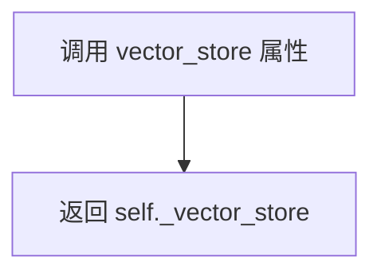
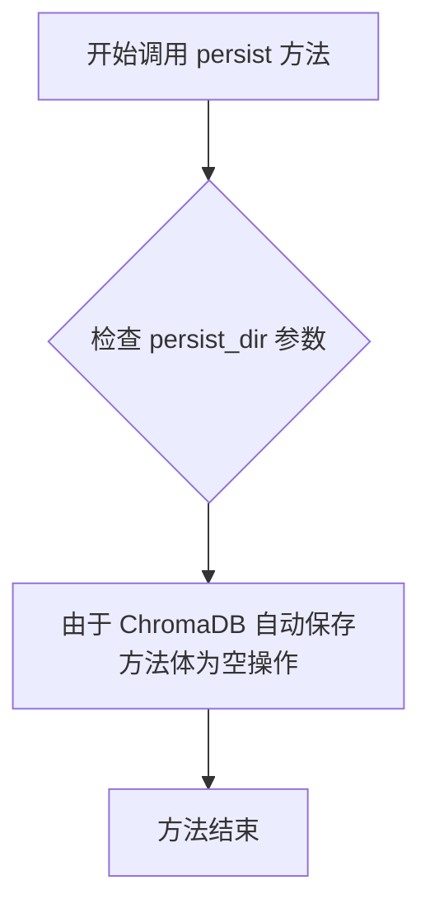
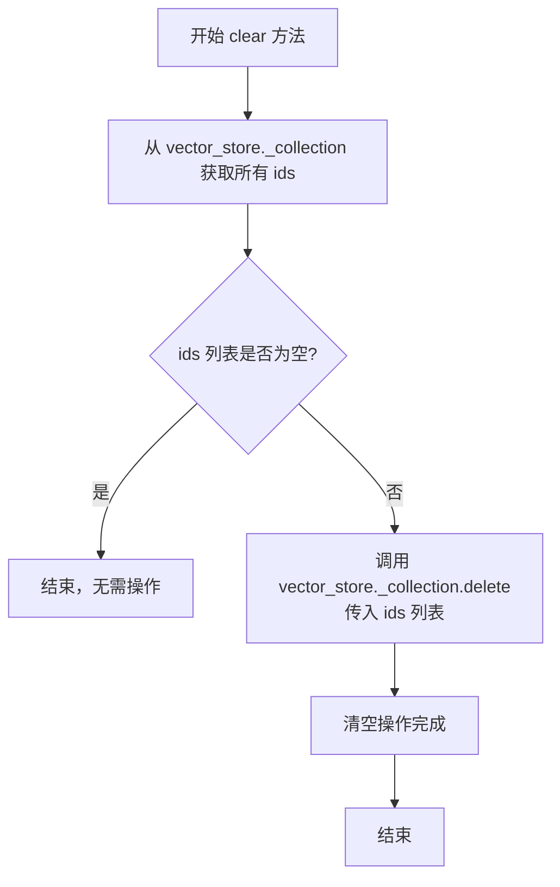

# `.\MetaGPT\metagpt\rag\retrievers\chroma_retriever.py` 详细设计文档

该文件定义了一个 `ChromaRetriever` 类，它继承自 `VectorIndexRetriever`，专门用于与 Chroma 向量数据库进行交互。它扩展了父类的功能，提供了针对 Chroma 的节点增删、持久化、查询总数和清空集合等操作。

## 整体流程

```mermaid
graph TD
    A[开始] --> B{调用 ChromaRetriever 方法}
    B --> C[add_nodes]
    C --> D[调用父类 _index.insert_nodes]
    B --> E[query_total_count]
    E --> F[访问 vector_store._collection.count()]
    B --> G[clear]
    G --> H[获取集合中所有ID]
    H --> I{ID列表为空?}
    I -- 是 --> J[结束]
    I -- 否 --> K[调用 vector_store._collection.delete]
    B --> L[persist]
    L --> M[空实现，Chroma自动持久化]
```

## 类结构

```
VectorIndexRetriever (基类)
└── ChromaRetriever (Chroma专用检索器)
```

## 全局变量及字段


### `ChromaRetriever._vector_store`
    
继承自父类的向量存储实例，用于与Chroma数据库进行交互。

类型：`ChromaVectorStore`
    


### `ChromaRetriever._index`
    
继承自父类的向量索引实例，用于管理节点和检索操作。

类型：`VectorIndex`
    
    

## 全局函数及方法

### `ChromaRetriever.vector_store` (property)

这是一个只读属性（property），用于获取 `ChromaRetriever` 实例内部封装的 `ChromaVectorStore` 对象。它提供了对底层向量存储的直接访问，是类中其他方法（如 `query_total_count` 和 `clear`）操作向量数据库的基础。

参数：
- 无

返回值：`ChromaVectorStore`，返回当前检索器实例所关联的 Chroma 向量存储对象。

#### 流程图



#### 带注释源码

```python
@property
def vector_store(self) -> ChromaVectorStore:
    # 这是一个属性访问器（getter），直接返回私有字段 `_vector_store` 的值。
    # 它允许外部代码以只读方式访问内部的向量存储实例。
    return self._vector_store
```

### `ChromaRetriever.add_nodes`

该方法用于向底层的Chroma向量数据库中批量添加文档节点。

参数：
- `nodes`：`list[BaseNode]`，需要添加到向量数据库的文档节点列表。
- `**kwargs`：`dict`，可选的关键字参数，将传递给底层索引的插入方法。

返回值：`None`，该方法不返回任何值。

#### 流程图

```mermaid
flowchart TD
    A[开始: add_nodes(nodes, **kwargs)] --> B[调用 self._index.insert_nodes(nodes, **kwargs)]
    B --> C[结束]
```

#### 带注释源码

```python
def add_nodes(self, nodes: list[BaseNode], **kwargs) -> None:
    """Support add nodes."""
    # 调用父类 VectorIndexRetriever 中 _index 属性的 insert_nodes 方法
    # 将节点列表 nodes 和所有可选参数 **kwargs 传递下去，完成节点的插入操作
    self._index.insert_nodes(nodes, **kwargs)
```

### `ChromaRetriever.persist`

该方法旨在提供持久化功能，用于将向量存储的数据保存到指定目录。然而，由于底层使用的 ChromaDB 数据库具有自动保存机制，因此该方法在当前实现中为空，仅作为接口占位符存在。

参数：

- `persist_dir`：`str`，指定数据应被持久化保存到的目录路径。
- `**kwargs`：`Any`，用于接收未来可能扩展的额外关键字参数。

返回值：`None`，该方法不返回任何值。

#### 流程图



#### 带注释源码

```python
def persist(self, persist_dir: str, **kwargs) -> None:
    """Support persist.

    Chromadb automatically saves, so there is no need to implement."""
    # 方法体为空。
    # 原因：ChromaDB 向量存储库在数据变更时会自动进行持久化，
    # 因此无需在此处实现额外的保存逻辑。
    # 此方法作为接口的一部分被保留，以保持与可能需要显式持久化操作的
    # 其他检索器或存储后端的兼容性。
    # `persist_dir` 参数在此上下文中未被使用，但为接口一致性而保留。
    pass
```

### `ChromaRetriever.query_total_count`

该方法用于查询并返回底层Chroma向量数据库中存储的文档（或节点）的总数量。

参数：
- 无

返回值：`int`，表示存储在向量数据库集合中的文档总数。

#### 流程图

```mermaid
flowchart TD
    A[开始] --> B[获取vector_store对象]
    B --> C[访问vector_store的_collection属性]
    C --> D[调用_collection.count()方法]
    D --> E[返回计数值]
    E --> F[结束]
```

#### 带注释源码

```python
def query_total_count(self) -> int:
    """Support query total count."""

    # 1. 通过属性访问器获取`vector_store`对象，该对象是`ChromaVectorStore`类型。
    # 2. 访问`vector_store`的私有属性`_collection`，这是一个ChromaDB的集合对象。
    # 3. 调用ChromaDB集合的`count()`方法，该方法返回集合中所有条目的数量。
    # 4. 将结果作为整数返回。
    return self.vector_store._collection.count()
```

### `ChromaRetriever.clear`

该方法用于清空与当前检索器关联的 Chroma 向量存储集合中的所有节点（文档片段）。它通过获取集合中所有条目的 ID，然后批量删除这些 ID 对应的条目来实现清空操作。

参数：
- `**kwargs`：`dict`，接收任意关键字参数。在当前实现中未使用，但为保持接口扩展性而保留。

返回值：`None`，该方法不返回任何值。

#### 流程图



#### 带注释源码

```python
def clear(self, **kwargs) -> None:
    """Support deleting all nodes."""

    # 从关联的 Chroma 集合中获取所有现有条目的 ID。
    # `self.vector_store._collection.get()` 返回一个字典，其中 "ids" 键对应一个 ID 列表。
    ids = self.vector_store._collection.get()["ids"]

    # 检查获取到的 ID 列表是否非空。
    if ids:
        # 如果存在 ID，则调用 Chroma 集合的 delete 方法，传入整个 ID 列表进行批量删除。
        # 这将移除集合中所有对应的节点（向量和元数据）。
        self.vector_store._collection.delete(ids=ids)
    # 如果 ids 列表为空，则集合本来就是空的，无需执行任何操作。
```

## 关键组件

### ChromaRetriever

ChromaRetriever 是一个基于 Chroma 向量数据库的检索器，它扩展了基础的向量索引检索器，提供了针对 Chroma 数据库的节点增删、持久化、查询总数和清空等特定操作。

### 向量存储集成

该类通过 `vector_store` 属性封装了对底层 ChromaVectorStore 的访问，所有与 Chroma 数据库的交互（如计数、删除）都通过此属性进行，实现了与特定向量存储后端的解耦与集成。

### 节点管理

提供了 `add_nodes` 方法，用于将一组节点插入到 Chroma 向量索引中，是对基础索引插入功能的一层封装。

### 持久化操作

提供了 `persist` 方法，但由于 Chroma 数据库具有自动保存机制，此方法在当前实现中为空，仅作为接口占位符以满足可能的设计契约。

### 数据统计

提供了 `query_total_count` 方法，通过调用底层 Chroma 集合的 `count` 方法，返回当前向量存储中的节点总数。

### 数据清理

提供了 `clear` 方法，用于删除 Chroma 向量存储中的所有节点。其实现逻辑是先获取所有节点的 ID，然后批量执行删除操作。

## 问题及建议


### 已知问题

-   **直接访问内部属性**：`query_total_count` 和 `clear` 方法直接访问了 `self.vector_store._collection`。`_collection` 属性名以下划线开头，表明它是 `ChromaVectorStore` 类的内部实现细节，不应在外部直接访问。这违反了封装原则，使得 `ChromaRetriever` 与 `ChromaVectorStore` 的内部实现紧密耦合。如果 `ChromaVectorStore` 未来更改了其内部数据结构（例如重命名 `_collection` 或改变其访问方式），`ChromaRetriever` 的代码将会失效。
-   **方法签名不一致**：`add_nodes` 方法直接调用了 `self._index.insert_nodes`，而父类 `VectorIndexRetriever` 或其关联的 `_index` 对象可能并未定义 `insert_nodes` 方法，或者其签名与 `add_nodes` 不一致。这可能导致运行时错误或行为不符合预期。子类方法应确保与父类或所调用对象的接口契约保持一致。
-   **`persist` 方法为空实现**：`persist` 方法仅包含一条注释说明无需实现。虽然这可能符合当前 `ChromaVectorStore` 的自动持久化行为，但作为一个公共API，空实现可能让调用者困惑，且如果未来需要支持不同的持久化策略（如指定路径、格式），此方法将需要重构。它未能提供一个清晰的、面向未来的接口。
-   **缺乏错误处理**：`clear` 方法在调用 `self.vector_store._collection.delete(ids=ids)` 时没有进行任何异常处理。如果底层数据库操作失败（如连接问题、权限问题），异常将直接抛给调用者，而 `ChromaRetriever` 没有机会进行日志记录、状态清理或提供更友好的错误信息。
-   **潜在的 `None` 引用风险**：在 `clear` 方法中，`self.vector_store._collection.get()` 可能返回 `None` 或一个不包含 `"ids"` 键的字典，直接访问 `["ids"]` 可能导致 `KeyError`。虽然 `Chroma` 客户端可能保证返回特定结构，但健壮的代码应进行防御性检查。

### 优化建议

-   **封装内部访问**：应通过 `ChromaVectorStore` 提供的公共方法来间接操作集合。建议在 `ChromaVectorStore` 类中增加相应的公共方法（例如 `get_collection_count()`, `delete_all()`），然后 `ChromaRetriever` 调用这些方法。如果暂时无法修改 `ChromaVectorStore`，应在 `ChromaRetriever` 内部对这类访问进行集中管理和文档说明，并考虑在将来重构。
-   **对齐方法签名与行为**：审查 `VectorIndexRetriever` 基类及其 `_index` 对象的预期接口。确保 `add_nodes` 方法调用的 `insert_nodes` 确实存在且参数兼容。最好能调用基类或 `_index` 的已有公共方法，或者明确重写并文档化其特定行为。
-   **改进 `persist` 方法设计**：即使当前是空操作，也应考虑将其实现为一个无操作（`pass`）并添加清晰的文档字符串，说明为何无需操作以及其行为（例如：“ChromaDB 自动持久化，此方法为保持接口兼容性而保留，调用无效果。”）。或者，可以设计该方法接收参数并调用 `vector_store` 的相应持久化方法（如果存在），以提供更一致的抽象。
-   **增强错误处理与健壮性**：
    -   在 `clear` 方法中，添加 `try-except` 块来捕获可能的数据操作异常，并记录日志或抛出更合适的自定义异常。
    -   在访问 `self.vector_store._collection.get()["ids"]` 之前，检查返回值是否为 `None` 或是否包含 `"ids"` 键。
-   **添加类型提示与文档**：为 `add_nodes`, `clear` 等方法的 `**kwargs` 参数添加更详细的类型提示和文档，说明它们被传递给底层哪个方法及预期用途，提高代码的可读性和可维护性。


## 其它


### 设计目标与约束

本代码旨在为LlamaIndex框架提供一个基于Chroma向量数据库的检索器（Retriever）实现。其核心设计目标是：1. 继承并扩展`VectorIndexRetriever`基类，提供对Chroma向量存储的专用操作接口；2. 封装ChromaDB的底层操作，简化节点管理（增、删、查总数、清空）和持久化逻辑；3. 保持与LlamaIndex框架其他组件的兼容性，遵循其节点（`BaseNode`）和检索器的抽象契约。主要约束包括：必须继承自`VectorIndexRetriever`，其行为受基类约束；持久化操作因ChromaDB自动处理而无需实现；部分功能（如`query_total_count`, `clear`）需通过直接访问`ChromaVectorStore`的内部`_collection`属性实现，这引入了实现上的耦合。

### 错误处理与异常设计

当前代码未显式包含错误处理逻辑。所有操作可能传播来自底层库的异常，例如：1. `add_nodes` 可能因节点格式无效或插入失败而抛出异常；2. `query_total_count` 和 `clear` 在访问`_collection`属性或调用ChromaDB客户端方法时，可能因连接问题、集合不存在或权限错误而失败；3. `persist` 方法为空实现，调用它不会产生错误但也不执行任何操作。建议的改进是：在关键方法中添加`try-except`块，捕获`ChromaDB`或网络相关异常，并封装为更统一的业务异常或记录日志，以提高健壮性和可调试性。

### 数据流与状态机

数据流围绕`ChromaVectorStore`中的`_collection`对象（ChromaDB集合）展开：1. **写入流**：`add_nodes`接收`BaseNode`列表，通过基类的`_index.insert_nodes`方法，最终将节点的向量和元数据存入`_collection`。2. **读取/查询流**：基类`VectorIndexRetriever`的检索功能（未在代码中显示，但通过继承获得）会查询`_collection`以获取相似向量。3. **管理流**：`query_total_count`直接从`_collection.count()`读取总数；`clear`通过`_collection.get()`获取所有ID，再通过`_collection.delete()`删除。状态变化主要由集合中的数据增删驱动，类本身无复杂内部状态机。

### 外部依赖与接口契约

1.  **外部依赖**：
    *   **LlamaIndex Core**：强依赖`llama_index.core.retrievers.VectorIndexRetriever`基类和`llama_index.core.schema.BaseNode`节点模型。
    *   **LlamaIndex Chroma Integration**：强依赖`llama_index.vector_stores.chroma.ChromaVectorStore`，用于访问底层的ChromaDB集合。
    *   **ChromaDB**：间接依赖，通过`ChromaVectorStore._collection`进行操作。
2.  **接口契约**：
    *   **继承契约**：必须满足`VectorIndexRetriever`的所有公共接口和行为约定。
    *   **属性契约**：`vector_store`属性承诺返回一个`ChromaVectorStore`实例。
    *   **方法契约**：
        *   `add_nodes`：承诺将节点列表添加到索引中。
        *   `persist`：承诺将数据持久化到指定目录（此处为空实现，但接口存在）。
        *   `query_total_count`：承诺返回集合中的节点总数。
        *   `clear`：承诺删除集合中的所有节点。
    *   **隐式契约**：`_vector_store`和`_index`是来自基类的受保护成员，子类假设它们已被正确初始化且可用。

    