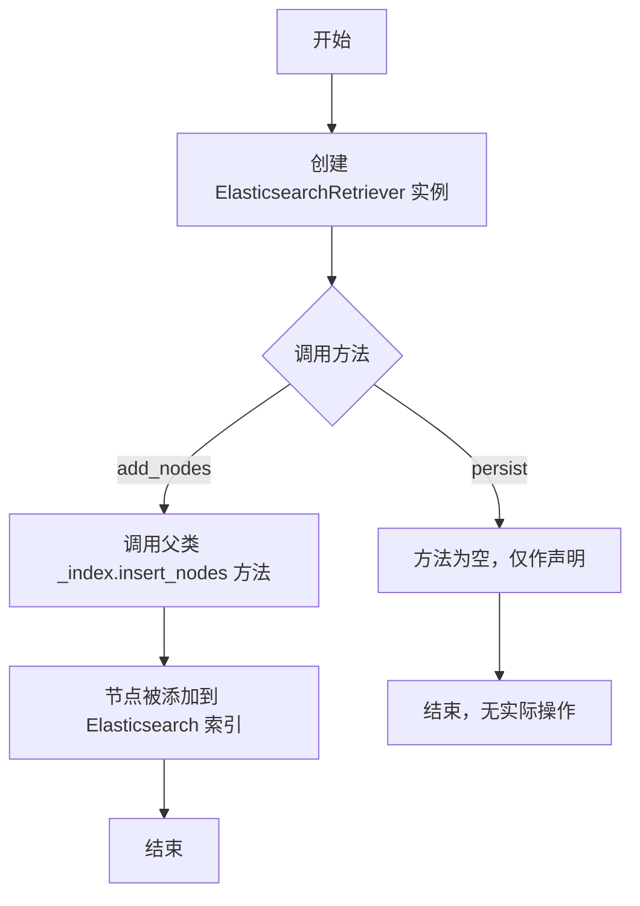
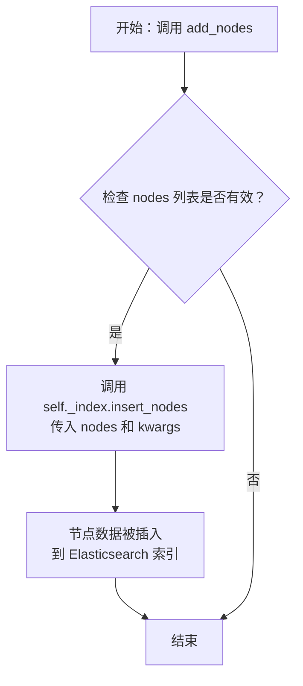
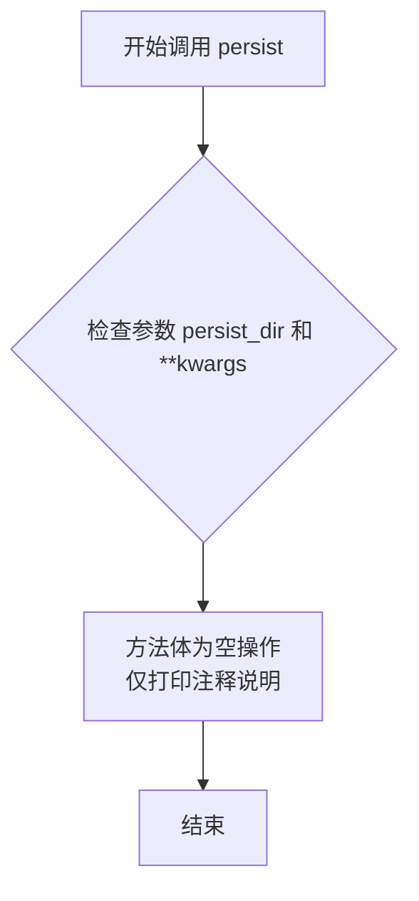

# `.\MetaGPT\metagpt\rag\retrievers\es_retriever.py` 详细设计文档

该文件定义了一个 ElasticsearchRetriever 类，它继承自 LlamaIndex 的 VectorIndexRetriever。其核心功能是作为 Elasticsearch 的检索器，提供了向底层索引添加节点（add_nodes）的能力，并声明了一个持久化方法（persist），但指出由于 Elasticsearch 的自动保存特性，该方法无需具体实现。

## 整体流程



## 类结构

```
VectorIndexRetriever (来自 llama_index.core.retrievers)
└── ElasticsearchRetriever
```

## 全局变量及字段


    

## 全局函数及方法

### `ElasticsearchRetriever.add_nodes`

该方法用于向底层的向量索引中批量添加节点（`BaseNode` 对象）。它是对父类 `VectorIndexRetriever` 功能的扩展，提供了将节点数据插入到 Elasticsearch 索引中的具体实现。

参数：

- `nodes`：`list[BaseNode]`，需要被添加到索引中的节点对象列表。
- `**kwargs`：`Any`，可变关键字参数，用于传递给底层索引插入方法的额外选项。

返回值：`None`，该方法不返回任何值。

#### 流程图



#### 带注释源码

```python
def add_nodes(self, nodes: list[BaseNode], **kwargs) -> None:
    """Support add nodes."""
    # 调用内部索引对象（self._index）的 insert_nodes 方法，
    # 将传入的节点列表（nodes）和所有额外关键字参数（**kwargs）传递给它。
    # 该方法负责将节点数据（如文本、向量等）实际写入或更新到 Elasticsearch 中。
    self._index.insert_nodes(nodes, **kwargs)
```

### `ElasticsearchRetriever.persist`

该方法用于声明持久化功能，但根据其实现和注释，它实际上是一个空操作（no-op）。因为Elasticsearch后端会自动保存数据，所以该方法无需执行任何实际的持久化逻辑，仅作为接口兼容性的一部分存在。

参数：
- `persist_dir`：`str`，指定持久化目录的路径（在本实现中未使用）。
- `**kwargs`：`Any`，接收额外的关键字参数，以保持接口的灵活性（在本实现中未使用）。

返回值：`None`，该方法不返回任何值。

#### 流程图



#### 带注释源码

```python
def persist(self, persist_dir: str, **kwargs) -> None:
    """Support persist.

    Elasticsearch automatically saves, so there is no need to implement."""
    # 方法体为空。因为Elasticsearch作为后端服务，
    # 数据是自动持久化到集群中的，无需额外的本地文件保存操作。
    # 此方法的存在主要是为了满足父类或接口的契约要求，
    # 保持API的一致性。
    pass
```

## 关键组件

### ElasticsearchRetriever 类

该类继承自 `VectorIndexRetriever`，是专门为 Elasticsearch 向量存储设计的检索器，提供了节点添加和持久化的适配方法。

### 节点添加支持

通过 `add_nodes` 方法，将传入的节点列表插入到内部的索引中，实现了对 Elasticsearch 索引的节点添加操作。

### 持久化适配

通过 `persist` 方法，声明了持久化功能。由于 Elasticsearch 本身具备自动保存数据的特性，此方法无需具体实现，仅作为接口占位符以保持与父类或框架的兼容性。

## 问题及建议


### 已知问题

-   **`add_nodes` 方法功能冗余**：`ElasticsearchRetriever` 继承自 `VectorIndexRetriever`，其父类很可能已经提供了 `insert_nodes` 或类似功能的方法。当前 `add_nodes` 方法只是简单地将调用转发给 `self._index.insert_nodes`，这可能导致代码重复，并可能破坏父类中 `add_nodes` 方法原有的设计意图或封装逻辑。
-   **`persist` 方法实现不完整**：`persist` 方法的文档字符串说明“Elasticsearch automatically saves, so there is no need to implement.”，但方法体为空。这可能导致调用者困惑，因为一个名为 `persist` 的方法被调用后，没有任何操作发生，也没有明确的成功或失败反馈。这违反了最小惊讶原则，并且如果父类或接口契约要求 `persist` 方法执行某些操作（如返回状态、处理路径等），当前实现将无法满足。
-   **缺乏对特定存储引擎的适配逻辑**：该类名为 `ElasticsearchRetriever`，暗示其底层索引是 Elasticsearch。然而，除了两个空壳方法外，没有看到任何与 Elasticsearch 特定配置、查询优化、错误处理或连接管理相关的逻辑。这可能导致该类在实际使用中无法充分利用 Elasticsearch 的特性，或者在出现 Elasticsearch 相关错误时无法妥善处理。

### 优化建议

-   **重构或移除 `add_nodes` 方法**：首先，应审查父类 `VectorIndexRetriever` 是否已有功能相同或相似的方法。如果父类方法已足够，应直接移除 `ElasticsearchRetriever` 中的 `add_nodes` 方法，以避免覆盖和混淆。如果父类没有提供，或者需要为 Elasticsearch 添加特定逻辑（如批量操作优化、特定错误处理），则应在此方法中实现这些逻辑，而不是简单地转发调用。
-   **完善 `persist` 方法的设计**：不应提供一个空的方法。有两个优化方向：
    1.  **明确化**：如果确实不需要任何持久化操作，应将方法重命名为更贴切的名称（如 `notify_persist` 或 `no_op_persist`），或者抛出一个明确的异常/返回一个特定值（如 `NotImplementedError` 或 `True`），并在文档中清晰说明原因。
    2.  **功能化**：如果 Elasticsearch 索引需要一些与“持久化”相关的操作（例如，刷新索引以确保数据可搜索、更新索引别名、或备份快照），则应在此方法中实现这些操作。文档字符串应更新以反映实际行为。
-   **增强 Elasticsearch 特定功能**：作为 `ElasticsearchRetriever`，应考虑添加以下功能：
    -   **初始化配置**：在构造函数或类方法中，接受 Elasticsearch 客户端、索引名称、认证信息等配置。
    -   **查询定制**：重写或扩展父类的检索方法，以支持 Elasticsearch 特有的查询 DSL（如 `bool` 查询、`function_score` 等），提升检索效果。
    -   **错误处理**：捕获并处理 Elasticsearch 客户端库可能抛出的异常（如 `elasticsearch.ConnectionError`, `elasticsearch.NotFoundError`），并提供更友好的错误信息或重试机制。
    -   **连接管理**：实现索引的连接池管理或健康检查。
-   **遵循 Liskov 替换原则**：确保子类 (`ElasticsearchRetriever`) 的行为与父类 (`VectorIndexRetriever`) 的契约保持一致。当前 `persist` 方法的行为（无操作）可能与父类的预期不符。需要明确父类对该方法的期望，并相应调整子类的实现。


## 其它


### 设计目标与约束

本模块的设计目标是提供一个基于 Elasticsearch 的向量检索器，作为 `VectorIndexRetriever` 的特定实现。其核心约束包括：1) 必须继承并兼容父类 `VectorIndexRetriever` 的接口和行为；2) 针对 Elasticsearch 作为后端存储的特性进行适配，例如其数据持久化机制是自动的；3) 保持接口简洁，专注于扩展父类未覆盖或需要特定实现的功能。

### 错误处理与异常设计

当前代码未显式包含错误处理逻辑。错误处理主要依赖于其父类 `VectorIndexRetriever` 以及底层 `llama_index` 和 Elasticsearch 客户端库抛出的异常。例如，`add_nodes` 方法中的 `self._index.insert_nodes` 调用可能会抛出与网络连接、索引不存在、权限问题或数据格式相关的异常。`persist` 方法是一个空实现，理论上不应抛出异常，但调用者需知晓其无实际操作。建议在未来的迭代中，可以考虑捕获特定异常并转化为更具业务语义的异常类型，或至少记录日志，以提高系统的可观测性和调试便利性。

### 数据流与状态机

数据流相对简单：
1.  **写入流**：调用者通过 `add_nodes` 方法传入 `BaseNode` 对象列表。该方法将调用内部索引对象 (`self._index`) 的 `insert_nodes` 方法，将节点数据（包含文本、元数据及向量嵌入）写入底层的 Elasticsearch 索引。
2.  **读取/检索流**：检索功能完全继承自父类 `VectorIndexRetriever`。当调用检索方法（如 `retrieve`）时，流程由父类控制，最终会利用 `self._index` 对 Elasticsearch 执行向量相似性搜索，并返回结果节点列表。
3.  **持久化状态**：`ElasticsearchRetriever` 本身不管理持久化状态。`persist` 方法为空实现，因为 Elasticsearch 服务端负责数据的持久化存储。检索器的“状态”即其关联的 Elasticsearch 索引中的数据，该状态由外部 Elasticsearch 集群维护。

### 外部依赖与接口契约

1.  **外部依赖**：
    *   **Elasticsearch 集群/服务**：作为后端向量数据库，负责存储、索引和检索节点数据。这是最核心的外部运行时依赖。
    *   **`llama_index.core` 库**：特别是 `VectorIndexRetriever` 基类和 `BaseNode` 模式。这定义了该类的继承关系和核心数据模型。
    *   **潜在的 Elasticsearch 客户端库**：虽然未直接导入，但 `self._index` 的实现（很可能是一个 `ElasticsearchIndex` 类）内部会依赖如 `elasticsearch` 官方客户端或其他适配器来与 Elasticsearch 通信。

2.  **接口契约**：
    *   **继承契约**：`ElasticsearchRetriever` 必须满足 `VectorIndexRetriever` 的所有公共接口和行为约定（Liskov 替换原则）。
    *   **`add_nodes` 方法**：契约是接收一个 `BaseNode` 列表并将其持久化到索引中。调用者假设在成功调用后，这些节点可用于后续检索。
    *   **`persist` 方法**：契约是一个无操作 (No-op)。调用者不应期望此调用在磁盘上创建任何新的持久化文件。这是与某些其他检索器（如基于本地文件的）的关键行为差异，需要在文档中明确说明。

    