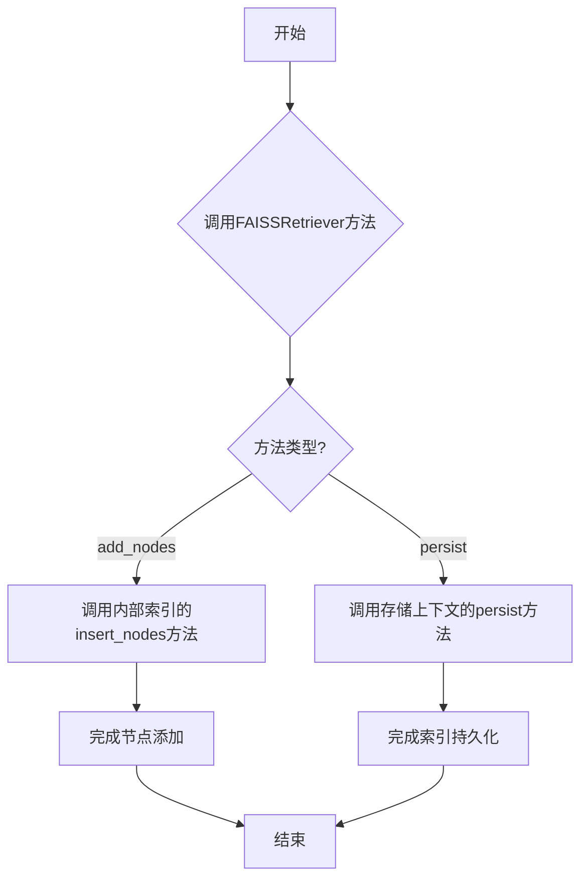
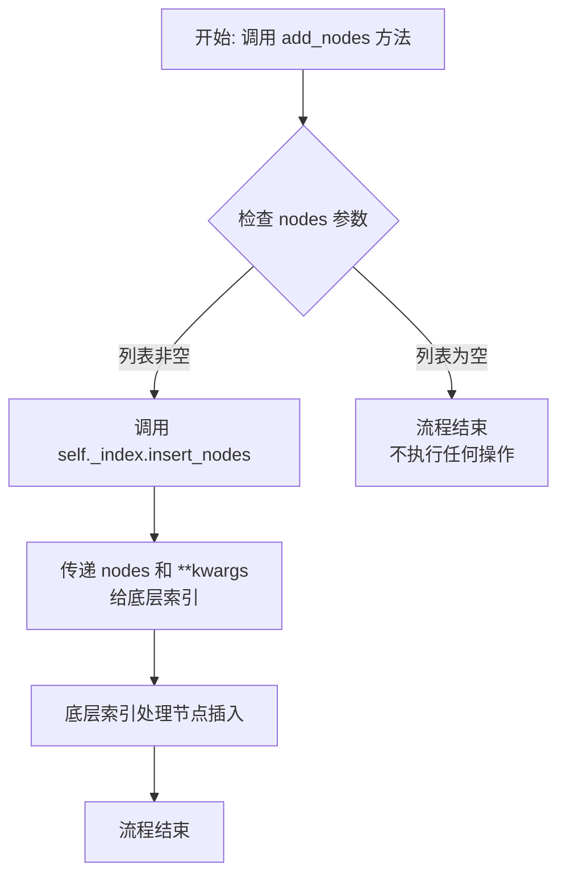
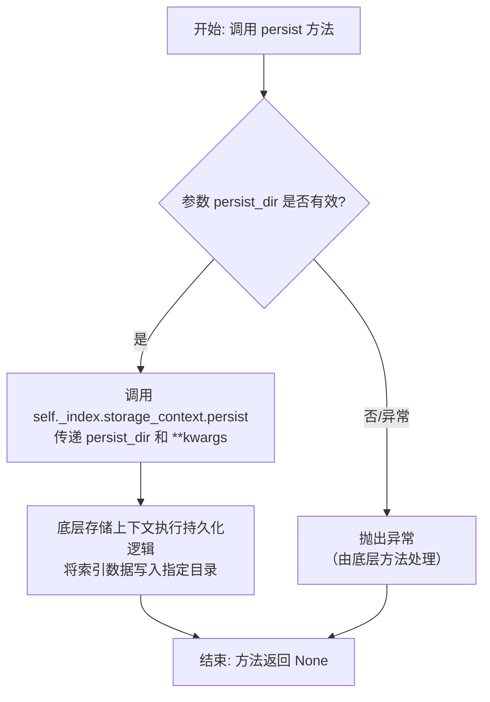

# `.\MetaGPT\metagpt\rag\retrievers\faiss_retriever.py` 详细设计文档

该代码实现了一个基于FAISS向量数据库的检索器，它继承自LlamaIndex的向量索引检索器基类，主要功能是向FAISS索引中添加文档节点以及将索引持久化保存到磁盘。

## 整体流程



## 类结构

```
VectorIndexRetriever (LlamaIndex基类)
└── FAISSRetriever (FAISS检索器实现)
```

## 全局变量及字段


### `FAISSRetriever._index`
    
继承自父类 VectorIndexRetriever，用于存储和检索向量数据的索引对象。

类型：`VectorIndex`
    
    

## 全局函数及方法


### `FAISSRetriever.__init__`

该方法用于初始化 `FAISSRetriever` 类的实例。由于 `FAISSRetriever` 继承自 `VectorIndexRetriever`，其 `__init__` 方法直接调用父类的 `__init__` 方法，以完成基类所需的初始化工作，例如设置索引、配置相似性搜索的 top_k 参数等。该方法本身不添加新的初始化逻辑，完全依赖于父类的实现。

参数：
-  `self`：`FAISSRetriever`，`FAISSRetriever` 类的实例自身
-  `*args`：`tuple`，可变位置参数，将传递给父类 `VectorIndexRetriever.__init__` 方法
-  `**kwargs`：`dict`，可变关键字参数，将传递给父类 `VectorIndexRetriever.__init__` 方法

返回值：`None`，此方法不返回任何值，仅用于初始化对象。

#### 流程图

```mermaid
flowchart TD
    Start[开始调用 FAISSRetriever.__init__] --> PassArgs[接收参数 self, *args, **kwargs]
    PassArgs --> CallSuper[调用 super().__init__(*args, **kwargs)]
    CallSuper --> End[结束初始化]
```

#### 带注释源码

```
# FAISSRetriever 类继承自 VectorIndexRetriever
class FAISSRetriever(VectorIndexRetriever):
    """FAISS retriever."""

    # __init__ 方法定义
    def __init__(self, *args, **kwargs):
        """
        初始化 FAISSRetriever 实例。
        此方法通过调用父类 VectorIndexRetriever 的 __init__ 方法来完成所有初始化工作。
        
        参数:
            *args: 可变位置参数，传递给父类构造器。
            **kwargs: 可变关键字参数，传递给父类构造器。
        """
        # 调用直接父类（VectorIndexRetriever）的 __init__ 方法
        # 将所有接收到的参数原样传递，由父类处理具体的初始化逻辑
        super().__init__(*args, **kwargs)
```


### `FAISSRetriever.add_nodes`

该方法用于向底层的FAISS向量索引中添加一个或多个文档节点，以扩展索引的知识库。

参数：
- `nodes`：`list[BaseNode]`，一个包含要添加到索引中的文档节点的列表。
- `**kwargs`：`Any`，可选的关键字参数，将被传递给底层索引的插入方法。

返回值：`None`，该方法不返回任何值，其作用是将节点持久化到索引中。

#### 流程图



#### 带注释源码

```python
def add_nodes(self, nodes: list[BaseNode], **kwargs) -> None:
    """Support add nodes."""
    # 调用内部索引对象（self._index）的 insert_nodes 方法，
    # 将传入的节点列表（nodes）和所有额外的关键字参数（**kwargs）传递给它。
    # 这是对底层向量存储（如FAISS）插入操作的一层简单封装。
    self._index.insert_nodes(nodes, **kwargs)
```


### `FAISSRetriever.persist`

该方法用于将当前检索器（Retriever）关联的索引（Index）及其存储上下文（Storage Context）持久化到指定的本地目录中。它本质上是一个便捷方法，将持久化操作委托给底层索引的存储上下文对象执行。

参数：

-  `persist_dir`：`str`，指定用于保存索引及相关数据（如向量存储、文档存储等）的本地目录路径。
-  `**kwargs`：`Any`，额外的关键字参数，用于传递给底层持久化方法，提供未来扩展的灵活性。

返回值：`None`，该方法不返回任何值。

#### 流程图



#### 带注释源码

```python
def persist(self, persist_dir: str, **kwargs) -> None:
    """Support persist."""
    # 调用内部索引对象（self._index）的存储上下文（storage_context）的 persist 方法。
    # 将用户指定的持久化目录路径（persist_dir）传递给该方法。
    # **kwargs 参数允许传递额外的配置选项到底层持久化逻辑，以应对未来需求的变化。
    self._index.storage_context.persist(persist_dir)
```


## 关键组件


### FAISSRetriever 类

该类继承自 `VectorIndexRetriever`，是用于与 FAISS 向量索引进行交互的检索器，提供了添加节点和持久化索引的核心功能。

### 节点添加机制

通过 `add_nodes` 方法，支持将新的 `BaseNode` 对象列表插入到底层的 FAISS 索引中，实现了索引的动态更新。

### 索引持久化机制

通过 `persist` 方法，支持将当前索引及其关联的存储上下文（如节点数据）保存到指定的本地目录，实现了模型的持久化存储与后续加载。


## 问题及建议


### 已知问题

-   **方法签名不一致**：`add_nodes` 方法继承了 `VectorIndexRetriever` 的基类方法，但当前实现直接调用了 `self._index.insert_nodes`。这可能导致与基类或其他子类的预期行为不一致，如果基类方法有额外的逻辑（如验证、事件触发等），则会被绕过。
-   **缺乏参数验证**：`add_nodes` 和 `persist` 方法直接传递 `**kwargs` 给底层方法，但没有对关键参数（如 `nodes` 列表是否为空、`persist_dir` 路径是否有效）进行前置验证，可能导致底层调用出现未处理的异常。
-   **错误处理缺失**：两个方法均未包含 `try-except` 块来捕获和处理可能发生的异常（例如，索引插入失败、文件系统权限错误等），这会使错误直接向上层抛出，降低了代码的健壮性。
-   **文档字符串过于简单**：类和方法文档仅重复了类名和功能名称，没有详细说明方法的作用、参数含义、可能抛出的异常或副作用，不利于开发者理解和使用。

### 优化建议

-   **明确方法职责与调用链**：应审查 `VectorIndexRetriever` 基类中 `add_nodes` 的默认实现。如果当前实现是预期的，应考虑重命名方法（如改为 `insert_nodes_directly`）以避免混淆，或者确保调用 `super().add_nodes` 以执行基类逻辑，再执行自定义操作。
-   **增加输入参数验证**：在 `add_nodes` 方法中，应检查 `nodes` 是否为非空列表。在 `persist` 方法中，可检查 `persist_dir` 是否为一个字符串且路径基本格式有效（例如，非空）。这可以在问题发生前提供更清晰的错误信息。
-   **引入基础错误处理**：使用 `try-except` 包装核心调用，捕获可能预期的异常（如 `ValueError`, `IOError`），并记录日志或抛出更具上下文信息的自定义异常，以方便调试和问题定位。
-   **完善文档字符串**：为类和方法补充详细的文档。例如，说明 `FAISSRetriever` 是专门用于 FAISS 向量数据库的检索器，`add_nodes` 方法将节点向量插入到 FAISS 索引中，`persist` 方法将存储上下文（可能包含索引）持久化到指定目录。同时应列出重要的参数和可能引发的异常。
-   **考虑添加类型提示增强**：虽然已有基础类型提示，但对于 `**kwargs`，可以添加更具体的类型提示或注释来说明它传递给哪些底层方法，以提高代码可读性和 IDE 支持。


## 其它


### 设计目标与约束

该代码的设计目标是提供一个针对FAISS向量索引的检索器（Retriever）实现，继承自LlamaIndex框架的通用向量检索器基类。其核心约束包括：1) 必须与LlamaIndex的`VectorIndexRetriever`接口保持兼容，确保可以无缝替换其他类型的向量检索器；2) 必须支持向底层的FAISS索引动态添加节点（`BaseNode`对象）；3) 必须支持将索引及其关联的存储上下文持久化到本地文件系统。设计上遵循了“开闭原则”，通过继承扩展了基类的功能，而未修改其核心检索逻辑。

### 错误处理与异常设计

当前代码未显式实现错误处理逻辑，依赖其父类`VectorIndexRetriever`及底层组件（如`self._index`）抛出的异常。潜在需要处理的异常包括：1) 向索引插入节点时，可能因节点格式错误、向量维度不匹配或索引状态异常而失败；2) 持久化操作可能因目录权限不足、磁盘空间不够或序列化错误而失败。建议在未来的迭代中，在`add_nodes`和`persist`方法内部添加`try-except`块，捕获特定异常（如`ValueError`, `RuntimeError`, `IOError`），并转换为更具业务语义的异常或记录详细日志，以提高系统的健壮性和可调试性。

### 数据流与状态机

该检索器本身不维护复杂的状态机。其主要数据流为：1) **写入流**：调用`add_nodes`方法，传入`BaseNode`列表，数据流向下传递至`self._index.insert_nodes`，最终更新内存中的FAISS索引和可能的元数据存储。2) **持久化流**：调用`persist`方法，指定目录路径，触发`self._index.storage_context.persist`，将当前索引状态（包括向量数据和节点元数据）序列化并写入指定目录下的文件。3) **读取/检索流**：继承自父类的检索功能（代码中未展示），其数据流为接收查询向量或文本，通过`self._index`进行相似性搜索，返回相关的`NodeWithScore`列表。检索器的状态随`add_nodes`操作而改变（索引内容增加），随`persist`操作而同步到磁盘，但检索操作本身是只读的，不改变状态。

### 外部依赖与接口契约

1.  **框架依赖**：强依赖于`llama_index.core`框架，特别是`VectorIndexRetriever`基类和`BaseNode`、`StorageContext`等数据结构。
2.  **索引实现依赖**：依赖于通过`self._index`属性访问的底层索引实现。该索引被假定为兼容FAISS且实现了`insert_nodes`方法的对象（例如LlamaIndex的`FaissIndex`类）。这是代码的一个关键隐含契约。
3.  **接口契约**：
    *   `add_nodes`方法契约：调用者需提供有效的`BaseNode`列表。方法不返回任何值，但会改变内部索引状态。
    *   `persist`方法契约：调用者需提供有效的、可写的目录路径字符串。方法不返回任何值，成功执行后将在该目录生成持久化文件。
4.  **序列化依赖**：持久化功能依赖于`self._index.storage_context`的具体实现来定义文件格式和序列化协议。

### 测试策略建议

1.  **单元测试**：
    *   `add_nodes`：测试传入空列表、正常节点列表时，是否正确调用了底层索引的`insert_nodes`方法。可以使用Mock对象来验证调用。
    *   `persist`：测试传入不同路径时，是否正确调用了`storage_context.persist`方法。同样使用Mock进行验证。
    *   测试在依赖组件（如索引）抛出异常时，当前实现的行为（目前是直接向上抛出）。
2.  **集成测试**：
    *   创建真实的FAISS索引和`FAISSRetriever`实例，测试`add_nodes`后能否正确检索到新增内容。
    *   测试`persist`后，重新加载索引，验证检索功能是否与持久化前一致。
3.  **契约测试**：验证`FAISSRetriever`与`VectorIndexRetriever`基类接口的兼容性，确保它可以被期望使用基类的地方安全替换。

### 安全与合规考虑

1.  **数据安全**：`persist`方法将可能包含敏感信息的向量和节点数据写入磁盘。代码未包含加密或访问控制。建议在要求高的场景下，由调用者确保持久化目录的安全，或未来扩展支持加密持久化。
2.  **输入验证**：`add_nodes`和`persist`方法均未对输入参数进行有效性验证（如路径是否合法、节点列表是否非None）。目前依赖底层库的验证，但为了更清晰的错误提示，可考虑在前置进行基本检查。
3.  **依赖安全**：需要确保所依赖的`llama_index`和`faiss`库的版本没有已知的安全漏洞。


    