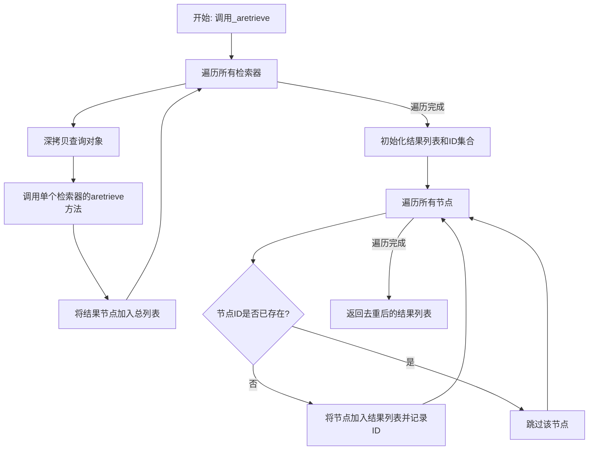
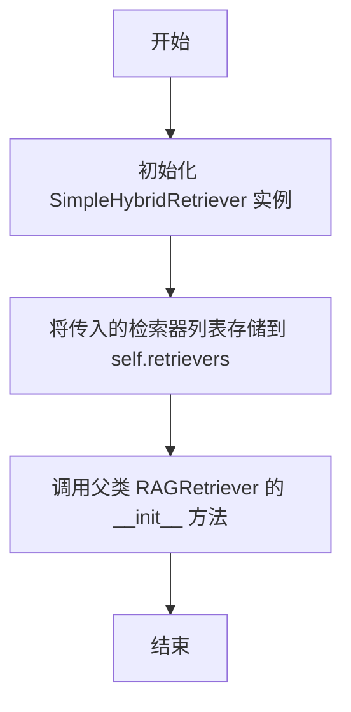
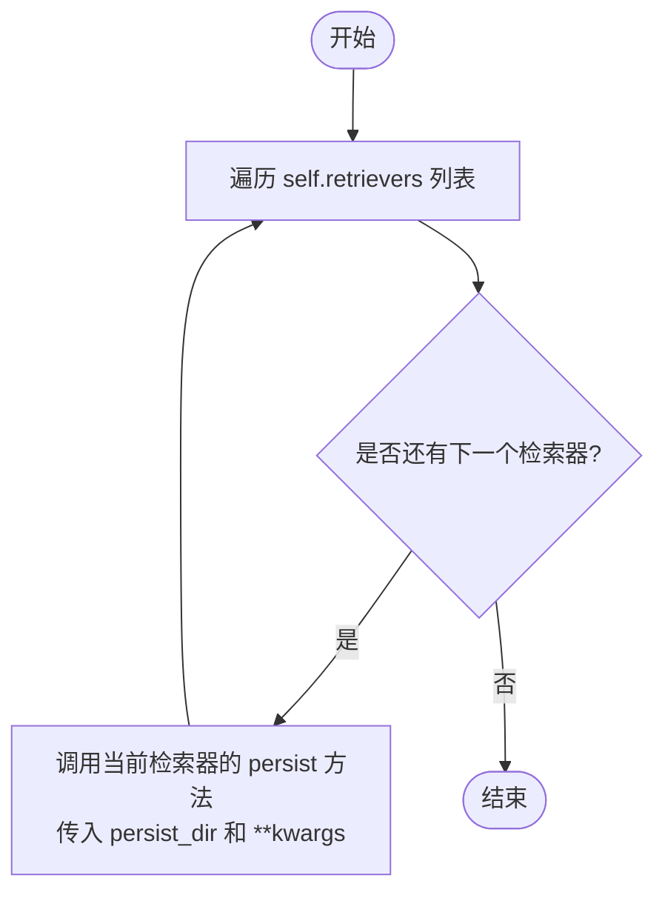

# `.\MetaGPT\metagpt\rag\retrievers\hybrid_retriever.py` 详细设计文档

该代码实现了一个混合检索器（SimpleHybridRetriever），它作为多个检索器的组合，能够并行或顺序地从所有配置的检索器中获取查询结果，然后对结果进行去重和聚合，最终返回一个唯一的节点列表。

## 整体流程



## 类结构

```
RAGRetriever (基类)
└── SimpleHybridRetriever (混合检索器)
```

## 全局变量及字段


### `SimpleHybridRetriever.retrievers`
    
存储多个检索器实例的列表，用于并行或顺序执行查询。

类型：`list[RAGRetriever]`
    
    

## 全局函数及方法

### `SimpleHybridRetriever.__init__`

初始化一个简单的混合检索器，它接收一个或多个检索器实例，并将它们存储在内部列表中，以便后续进行混合检索。

参数：

- `*retrievers`：`tuple`，一个可变参数，接收一个或多个`RAGRetriever`类型的检索器实例。这些检索器将被用于后续的混合检索操作。

返回值：`None`，此方法不返回任何值。

#### 流程图



#### 带注释源码

```python
def __init__(self, *retrievers):
    # 将传入的可变参数元组（一个或多个检索器）赋值给实例变量 self.retrievers。
    # 这个列表将用于后续的混合检索。
    self.retrievers: list[RAGRetriever] = retrievers
    # 调用父类 RAGRetriever 的初始化方法，确保继承链的正确初始化。
    super().__init__()
```


### `SimpleHybridRetriever._aretrieve`

该方法异步地从所有配置的检索器中检索并聚合搜索结果。它通过遍历内部的检索器列表，对每个检索器执行异步检索，然后将所有结果合并，并基于节点的唯一ID进行去重，最终返回一个不重复的节点列表。

参数：

-  `query`：`QueryType`，用户查询的输入，可以是字符串或查询对象。
-  `**kwargs`：`dict`，传递给底层检索器的额外关键字参数。

返回值：`list`，一个包含去重后节点对象的列表。

#### 流程图

```mermaid
flowchart TD
    A[开始: _aretrieve(query, **kwargs)] --> B[初始化空列表 all_nodes]
    B --> C{遍历每个 retriever}
    C --> D[深拷贝 query 为 query_copy]
    D --> E[异步调用 retriever.aretrieve<br/>query_copy, **kwargs]
    E --> F[将结果 nodes 加入 all_nodes]
    F --> C
    C -- 遍历结束 --> G[初始化空列表 result 和集合 node_ids]
    G --> H{遍历 all_nodes 中的每个 n}
    H --> I{n.node.node_id 是否在 node_ids 中?}
    I -- 否 --> J[将 n 加入 result<br/>将 node_id 加入 node_ids]
    J --> H
    I -- 是 --> H
    H -- 遍历结束 --> K[返回 result]
```

#### 带注释源码

```python
async def _aretrieve(self, query: QueryType, **kwargs):
    """Asynchronously retrieves and aggregates search results from all configured retrievers.

    This method queries each retriever in the `retrievers` list with the given query and
    additional keyword arguments. It then combines the results, ensuring that each node is
    unique, based on the node's ID.
    """
    # 初始化一个空列表，用于存储从所有检索器获取的节点
    all_nodes = []
    # 遍历当前混合检索器中包含的每一个检索器
    for retriever in self.retrievers:
        # 为防止检索器内部修改查询对象，对查询进行深拷贝
        query_copy = copy.deepcopy(query)
        # 异步调用当前检索器的 `aretrieve` 方法获取节点列表
        nodes = await retriever.aretrieve(query_copy, **kwargs)
        # 将当前检索器的结果添加到总列表中
        all_nodes.extend(nodes)

    # 合并所有节点，并进行去重
    result = []  # 用于存储最终去重后的结果
    node_ids = set()  # 使用集合来记录已添加节点的ID，以实现高效去重
    for n in all_nodes:
        # 检查当前节点的ID是否已经在集合中（即是否已添加过）
        if n.node.node_id not in node_ids:
            # 如果未添加过，则将其加入结果列表
            result.append(n)
            # 并将其ID记录到集合中
            node_ids.add(n.node.node_id)
    # 返回去重后的节点列表
    return result
```


### `SimpleHybridRetriever.add_nodes`

该方法用于将一组节点（`BaseNode` 对象）添加到 `SimpleHybridRetriever` 实例所管理的所有底层检索器（`RAGRetriever`）中。它通过遍历 `self.retrievers` 列表，并调用每个检索器的 `add_nodes` 方法来实现节点的批量添加。

参数：

- `nodes`：`list[BaseNode]`，需要添加到所有底层检索器中的节点列表。

返回值：`None`，此方法不返回任何值，其作用是将节点数据同步到所有集成的检索器中。

#### 流程图

```mermaid
flowchart TD
    A[开始：调用 add_nodes] --> B[遍历 self.retrievers 列表]
    B --> C{是否还有未处理的检索器？}
    C -- 是 --> D[获取当前检索器 r]
    D --> E[调用 r.add_nodes(nodes)]
    E --> B
    C -- 否 --> F[结束]
```

#### 带注释源码

```python
def add_nodes(self, nodes: list[BaseNode]) -> None:
    """Support add nodes."""
    # 遍历当前混合检索器实例所持有的所有底层检索器
    for r in self.retrievers:
        # 对每一个底层检索器 r，调用其 add_nodes 方法，
        # 将传入的 nodes 列表添加到该检索器的索引或存储中。
        r.add_nodes(nodes)
```


### `SimpleHybridRetriever.persist`

该方法用于将混合检索器（`SimpleHybridRetriever`）中所有底层检索器的索引数据持久化到指定的目录中。它通过遍历内部的检索器列表，并调用每个检索器自身的 `persist` 方法来实现。

参数：
-  `persist_dir`：`str`，指定用于存储持久化数据的目录路径。
-  `**kwargs`：`Any`，可变关键字参数，用于传递给底层检索器 `persist` 方法的额外配置选项。

返回值：`None`，该方法不返回任何值。

#### 流程图



#### 带注释源码

```python
def persist(self, persist_dir: str, **kwargs) -> None:
    """Support persist."""
    # 遍历混合检索器中包含的所有底层检索器
    for r in self.retrievers:
        # 调用每个底层检索器的 persist 方法，将索引数据保存到指定目录
        # **kwargs 允许传递额外的持久化配置参数
        r.persist(persist_dir, **kwargs)
```


## 关键组件


### 混合检索器 (Hybrid Retriever)

一个组合式检索器，用于聚合来自多个底层检索器的搜索结果，通过查询每个检索器并合并去重来提供更全面的检索结果。

### 惰性加载与结果聚合 (Lazy Loading & Result Aggregation)

在异步检索过程中，通过遍历所有配置的检索器并调用其检索方法，惰性地获取结果，然后将所有结果聚合到一个列表中，确保基于节点ID的唯一性。

### 节点管理接口 (Node Management Interface)

提供了与底层检索器一致的节点管理接口（如`add_nodes`和`persist`），将操作委托给所有内部的检索器执行，确保混合检索器在数据管理和持久化方面与单个检索器行为一致。

### 查询保护机制 (Query Protection Mechanism)

在将查询分发给每个检索器之前，使用深拷贝创建查询对象的副本，防止底层检索器意外修改原始查询对象，确保查询过程的独立性和安全性。


## 问题及建议


### 已知问题

-   **查询深拷贝开销**：`_aretrieve` 方法中对每个查询 `query` 都使用了 `copy.deepcopy`。如果 `query` 对象结构复杂或体积较大，频繁的深拷贝操作会带来不必要的性能开销和内存压力。
-   **结果去重逻辑简单**：当前仅通过 `node.node_id` 进行去重。如果来自不同检索器的结果节点内容相同但ID不同（或ID相同但内容/分数不同），此逻辑可能导致重复结果未被过滤，或错误地丢弃了有效的高分版本。
-   **缺乏结果排序与融合策略**：`_aretrieve` 方法简单地将所有检索器的结果合并后去重，但没有对最终的结果列表进行全局排序（例如，基于相关性分数）。这可能导致返回给用户的结果质量不佳，顺序混乱。
-   **错误处理缺失**：在异步并发检索多个底层检索器时，如果某个检索器抛出异常，整个检索过程会失败。当前代码没有对单个检索器的异常进行隔离和处理，缺乏健壮性。
-   **初始化参数验证缺失**：`__init__` 方法没有验证传入的 `retrievers` 参数是否均为 `RAGRetriever` 实例或具有所需接口的对象，可能导致运行时错误。

### 优化建议

-   **优化查询拷贝策略**：评估 `query` 对象的不可变性。如果查询对象在检索过程中不会被修改，可以移除 `copy.deepcopy`，或改为使用 `copy.copy`（浅拷贝）。最理想的是与底层检索器约定接口契约，确保其不修改输入查询。
-   **增强去重与结果融合机制**：
    -   实现更智能的去重逻辑，可考虑结合节点ID和内容哈希（如文本摘要）进行判重。
    -   引入结果融合与重排序策略。例如，收集所有结果的分数，进行归一化后，跨检索器进行全局排序（如 Reciprocal Rank Fusion）。可以设计成可插拔的 `FusionStrategy` 组件。
-   **引入异步并发与错误恢复**：
    -   使用 `asyncio.gather` 或类似机制并发执行所有 `retriever.aretrieve` 调用，以提高整体检索速度。
    -   为每个检索器调用添加 `try-except` 块，记录错误并允许其他检索器继续执行。可以返回部分结果并记录日志，而不是让整个请求失败。
-   **增加初始化验证与类型提示**：
    -   在 `__init__` 中添加参数检查，确保 `retrievers` 非空且每个元素都满足预期接口（例如，具有 `aretrieve` 方法）。提供更清晰的错误信息。
    -   考虑将 `retrievers` 参数定义为 `Sequence[RAGRetriever]` 并接收列表，以提高代码可读性和使用便利性。
-   **考虑结果数量限制与分页**：`_aretrieve` 方法目前返回所有去重后的结果。应考虑接收一个 `top_k` 参数，在融合排序后只返回前K个最相关的结果，以符合常见检索场景并提升效率。


## 其它


### 设计目标与约束

设计目标：提供一个统一的检索接口，能够聚合多个底层检索器（RAGRetriever）的查询结果，实现混合检索（Hybrid Retrieval）功能。核心目标是提高检索的召回率（Recall）和结果的多样性，同时通过去重机制保证结果集的唯一性。
设计约束：
1.  必须继承自 `RAGRetriever` 基类，以保持与现有RAG框架的兼容性。
2.  必须支持异步检索接口 `_aretrieve`。
3.  必须支持节点管理（`add_nodes`）和持久化（`persist`）操作的代理，确保所有底层检索器状态一致。
4.  在聚合结果时，必须基于节点的唯一标识符（`node.node_id`）进行去重，避免返回重复内容。

### 错误处理与异常设计

1.  **输入验证**：`__init__` 方法未对传入的 `retrievers` 列表进行有效性检查（如是否为空、元素类型是否为 `RAGRetriever`）。当前依赖调用方保证。
2.  **查询过程异常**：`_aretrieve` 方法中，任何一个底层 `retriever.aretrieve` 调用失败（抛出异常）将导致整个混合检索失败。未实现部分成功或容错机制。
3.  **节点去重依赖**：去重逻辑强依赖于 `BaseNode` 对象的 `node_id` 字段的唯一性和正确性。如果底层检索器返回的节点 `node_id` 为 `None` 或不唯一，将导致去重逻辑失效或错误。
4.  **资源与状态异常**：`add_nodes` 和 `persist` 方法在遍历 `self.retrievers` 时，如果某个检索器操作失败，循环会中断，导致部分检索器状态未更新。未提供事务性保证。

### 数据流与状态机

1.  **初始化数据流**：用户传入一个或多个 `RAGRetriever` 实例 -> `SimpleHybridRetriever` 实例化，保存引用列表。
2.  **检索请求数据流**：
    a. 用户调用 `aretrieve` (继承自父类) -> 内部调用 `_aretrieve`。
    b. `_aretrieve` 对输入 `query` 进行深拷贝（防止污染）-> 并发或顺序调用每个底层 `retriever.aretrieve(query_copy, **kwargs)`。
    c. 收集所有返回的节点列表 (`all_nodes`) -> 基于 `node_id` 进行遍历和去重 -> 生成最终的唯一节点列表 (`result`) 并返回。
3.  **状态管理**：`SimpleHybridRetriever` 本身无独立状态，其状态是所有底层检索器状态的集合。`add_nodes` 和 `persist` 操作将请求广播给所有底层检索器，由它们各自管理其内部索引或存储状态。

### 外部依赖与接口契约

1.  **父类依赖**：强依赖于 `RAGRetriever` 基类，必须实现其定义的抽象方法 `_aretrieve`。同时继承了 `aretrieve`, `add_nodes`, `persist` 等公共接口的契约。
2.  **底层检索器契约**：依赖所有传入的 `retrievers` 对象遵守 `RAGRetriever` 接口。即必须实现 `aretrieve(query, **kwargs) -> List[NodeWithScore]`、`add_nodes(nodes: List[BaseNode])` 和 `persist(persist_dir: str, **kwargs)` 方法。
3.  **数据模型依赖**：依赖 `llama_index.core.schema` 中的 `BaseNode`（用于 `add_nodes`）和 `QueryType`（用于 `_aretrieve`）。依赖 `NodeWithScore` 类型（从 `retriever.aretrieve` 返回）包含 `node` 字段，且 `node` 字段有 `node_id` 属性。
4.  **标准库依赖**：依赖 `copy` 模块进行查询对象的深拷贝，确保查询对象在传递过程中不被意外修改。

    