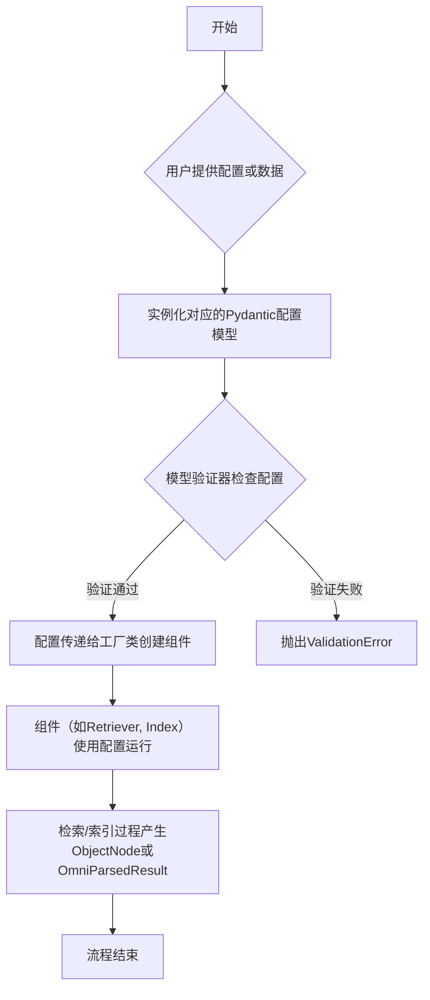
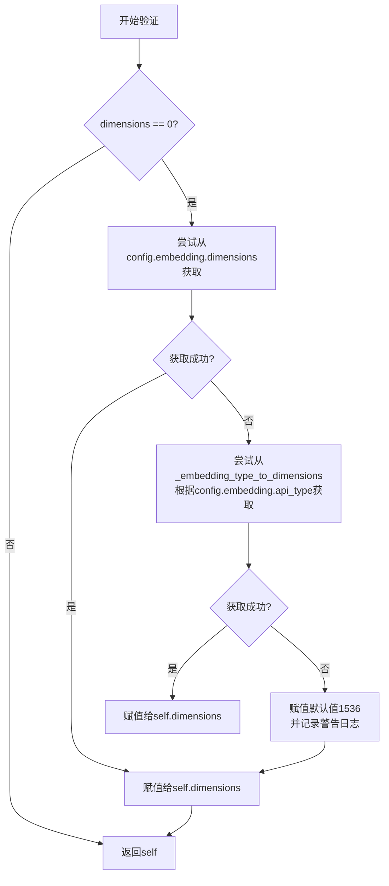
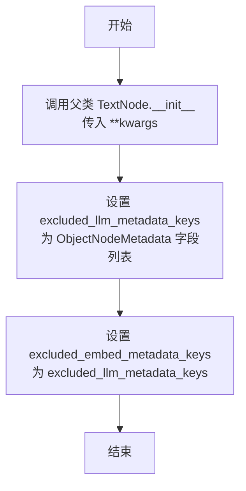

# `.\MetaGPT\metagpt\rag\schema.py` 详细设计文档

该文件定义了MetaGPT项目中RAG（检索增强生成）系统的核心数据模型和配置类。它包含了检索器（Retriever）、排序器（Ranker）、索引（Index）的配置基类及其具体实现（如FAISS、Chroma、BM25、Elasticsearch等），以及用于存储结构化对象（ObjectNode）和文档解析结果（OmniParsedResult）的模型。这些Pydantic模型为RAG系统的各个组件提供了类型安全、可验证的配置和数据交换格式。

## 整体流程



## 类结构

```
BaseModel (Pydantic基类)
├── BaseRetrieverConfig (检索器配置基类)
│   ├── IndexRetrieverConfig (索引检索器配置基类)
│   │   ├── FAISSRetrieverConfig
│   │   ├── BM25RetrieverConfig
│   │   ├── ChromaRetrieverConfig
│   │   └── ElasticsearchRetrieverConfig
│   │       └── ElasticsearchKeywordRetrieverConfig
├── BaseRankerConfig (排序器配置基类)
│   ├── LLMRankerConfig
│   ├── ColbertRerankConfig
│   ├── CohereRerankConfig
│   ├── BGERerankConfig
│   └── ObjectRankerConfig
├── BaseIndexConfig (索引配置基类)
│   ├── VectorIndexConfig (向量索引配置基类)
│   │   ├── FAISSIndexConfig
│   │   ├── ChromaIndexConfig
│   │   └── ElasticsearchIndexConfig
│   │       └── ElasticsearchKeywordIndexConfig
│   └── BM25IndexConfig
├── ObjectNodeMetadata
├── OmniParseOptions
├── OminParseImage
└── OmniParsedResult

TextNode (LlamaIndex基类)
└── ObjectNode

Enum
├── OmniParseType
└── ParseResultType
```

## 全局变量及字段


### `config`
    
全局配置对象，用于访问应用程序的配置信息，例如嵌入模型的API类型和维度。

类型：`metagpt.config2.config`
    


### `logger`
    
全局日志记录器，用于记录应用程序的日志信息。

类型：`metagpt.logs.logger`
    


### `DEFAULT_CHOICE_SELECT_PROMPT`
    
默认的选择提示模板，用于LLM排序器（LLMRanker）中。

类型：`llama_index.core.prompts.BasePromptTemplate`
    


### `BaseRetrieverConfig.similarity_top_k`
    
检索过程中返回的top-k相似结果的数量。

类型：`int`
    


### `IndexRetrieverConfig.index`
    
检索器使用的索引。

类型：`llama_index.core.indices.base.BaseIndex`
    


### `FAISSRetrieverConfig.dimensions`
    
FAISS索引构建时向量的维度。

类型：`int`
    


### `BM25RetrieverConfig.create_index`
    
指示是否为节点创建索引，这在仅使用BM25但需要持久化数据时很有用。

类型：`bool`
    


### `ChromaRetrieverConfig.persist_path`
    
保存数据的目录路径。

类型：`Union[str, Path]`
    


### `ChromaRetrieverConfig.collection_name`
    
集合的名称。

类型：`str`
    


### `ChromaRetrieverConfig.metadata`
    
与集合关联的可选元数据。

类型：`Optional[CollectionMetadata]`
    


### `ElasticsearchStoreConfig.index_name`
    
Elasticsearch索引的名称。

类型：`str`
    


### `ElasticsearchStoreConfig.es_url`
    
Elasticsearch的URL地址。

类型：`str`
    


### `ElasticsearchStoreConfig.es_cloud_id`
    
Elasticsearch云服务的ID。

类型：`str`
    


### `ElasticsearchStoreConfig.es_api_key`
    
Elasticsearch的API密钥。

类型：`str`
    


### `ElasticsearchStoreConfig.es_user`
    
Elasticsearch的用户名。

类型：`str`
    


### `ElasticsearchStoreConfig.es_password`
    
Elasticsearch的密码。

类型：`str`
    


### `ElasticsearchStoreConfig.batch_size`
    
批量索引操作的大小。

类型：`int`
    


### `ElasticsearchStoreConfig.distance_strategy`
    
用于相似性搜索的距离策略。

类型：`str`
    


### `ElasticsearchRetrieverConfig.store_config`
    
Elasticsearch存储的配置对象。

类型：`ElasticsearchStoreConfig`
    


### `ElasticsearchRetrieverConfig.vector_store_query_mode`
    
向量存储查询模式，默认为向量查询。

类型：`VectorStoreQueryMode`
    


### `BaseRankerConfig.top_n`
    
返回的顶部结果数量。

类型：`int`
    


### `LLMRankerConfig.llm`
    
用于重新排序的LLM模型，使用Any类型以避免与旧版Pydantic的LLM类型冲突。

类型：`Any`
    


### `LLMRankerConfig.choice_select_prompt`
    
选择提示模板，用于LLM排序器。

类型：`Optional[BasePromptTemplate]`
    


### `ColbertRerankConfig.model`
    
Colbert模型名称。

类型：`str`
    


### `ColbertRerankConfig.device`
    
用于句子转换器的设备（如'cpu'或'cuda'）。

类型：`str`
    


### `ColbertRerankConfig.keep_retrieval_score`
    
是否在元数据中保留检索分数。

类型：`bool`
    


### `CohereRerankConfig.model`
    
Cohere重新排序模型的名称。

类型：`str`
    


### `CohereRerankConfig.api_key`
    
Cohere API的密钥。

类型：`str`
    


### `BGERerankConfig.model`
    
BAAI重新排序模型的名称。

类型：`str`
    


### `BGERerankConfig.use_fp16`
    
是否使用fp16进行推理。

类型：`bool`
    


### `ObjectRankerConfig.field_name`
    
对象的字段名，该字段的值必须可以比较。

类型：`str`
    


### `ObjectRankerConfig.order`
    
排序的方向，'desc'为降序，'asc'为升序。

类型：`Literal['desc', 'asc']`
    


### `BaseIndexConfig.persist_path`
    
保存数据的目录路径。

类型：`Union[str, Path]`
    


### `VectorIndexConfig.embed_model`
    
嵌入模型，用于向量索引。

类型：`BaseEmbedding`
    


### `ChromaIndexConfig.collection_name`
    
集合的名称。

类型：`str`
    


### `ChromaIndexConfig.metadata`
    
与集合关联的可选元数据。

类型：`Optional[CollectionMetadata]`
    


### `ElasticsearchIndexConfig.store_config`
    
Elasticsearch存储的配置对象。

类型：`ElasticsearchStoreConfig`
    


### `ObjectNodeMetadata.is_obj`
    
标识该节点是否为对象节点。

类型：`bool`
    


### `ObjectNodeMetadata.obj`
    
RAG检索时将从obj_json重建的对象。

类型：`Any`
    


### `ObjectNodeMetadata.obj_json`
    
对象的JSON字符串，例如通过obj.model_dump_json()生成。

类型：`str`
    


### `ObjectNodeMetadata.obj_cls_name`
    
对象的类名，例如obj.__class__.__name__。

类型：`str`
    


### `ObjectNodeMetadata.obj_mod_name`
    
对象类的模块名，例如obj.__class__.__module__。

类型：`str`
    


### `ObjectNode.excluded_llm_metadata_keys`
    
从LLM元数据中排除的键列表，包含ObjectNodeMetadata的所有字段。

类型：`List[str]`
    


### `ObjectNode.excluded_embed_metadata_keys`
    
从嵌入元数据中排除的键列表，与excluded_llm_metadata_keys相同。

类型：`List[str]`
    


### `OmniParseOptions.result_type`
    
OmniParse服务返回的结果类型（如文本、Markdown、JSON）。

类型：`ParseResultType`
    


### `OmniParseOptions.parse_type`
    
OmniParse服务的解析类型（如PDF或DOCUMENT）。

类型：`OmniParseType`
    


### `OmniParseOptions.max_timeout`
    
OmniParse服务请求的最大超时时间（秒）。

类型：`Optional[int]`
    


### `OmniParseOptions.num_workers`
    
处理多个文件时的并发请求数量。

类型：`int`
    


### `OminParseImage.image`
    
图像的字节字符串。

类型：`str`
    


### `OminParseImage.image_name`
    
图像的名称。

类型：`str`
    


### `OminParseImage.image_info`
    
图像的附加信息字典。

类型：`Optional[dict]`
    


### `OmniParsedResult.markdown`
    
解析后得到的Markdown文本。

类型：`str`
    


### `OmniParsedResult.text`
    
解析后得到的纯文本。

类型：`str`
    


### `OmniParsedResult.images`
    
解析结果中包含的图像列表。

类型：`Optional[List[OminParseImage]]`
    


### `OmniParsedResult.metadata`
    
解析结果的元数据字典。

类型：`Optional[dict]`
    
    

## 全局函数及方法

### `FAISSRetrieverConfig.check_dimensions`

该方法是一个Pydantic模型验证器，用于在`FAISSRetrieverConfig`对象初始化后自动检查和设置`dimensions`字段的值。其核心逻辑是：如果`dimensions`字段的值为0（即未显式设置），则尝试从全局配置或预设的映射表中获取一个默认的向量维度值。

参数：
-  `self`：`FAISSRetrieverConfig`，当前`FAISSRetrieverConfig`模型实例本身。

返回值：`FAISSRetrieverConfig`，返回经过验证和可能修改后的`FAISSRetrieverConfig`模型实例本身。

#### 流程图



#### 带注释源码

```python
@model_validator(mode="after")  # 这是一个Pydantic模型验证器，在模型实例化后运行
def check_dimensions(self):
    # 检查当前实例的dimensions字段是否为0（即未设置）
    if self.dimensions == 0:
        # 如果为0，则尝试从全局配置config.embedding.dimensions获取维度值
        # 如果全局配置中也没有设置，则根据config.embedding.api_type从预设映射表_embedding_type_to_dimensions中查找
        # 如果映射表中也没有找到，则使用默认值1536
        self.dimensions = config.embedding.dimensions or self._embedding_type_to_dimensions.get(
            config.embedding.api_type, 1536  # 默认值为1536
        )
        # 如果既没有在全局配置中设置dimensions，且使用的api_type也不在预设的映射表中，则记录警告日志
        if not config.embedding.dimensions and config.embedding.api_type not in self._embedding_type_to_dimensions:
            logger.warning(
                f"You didn't set dimensions in config when using {config.embedding.api_type}, default to 1536"
            )
    # 验证器必须返回模型实例本身（或其修改后的版本）
    return self
```

### `ObjectNode.__init__`

该方法用于初始化 `ObjectNode` 对象，继承自 `TextNode` 并设置特定的元数据排除键，以确保在 LLM 和嵌入过程中不处理对象元数据。

参数：

- `**kwargs`：`Any`，传递给父类 `TextNode` 的初始化参数

返回值：`None`，无返回值

#### 流程图



#### 带注释源码

```python
def __init__(self, **kwargs):
    # 调用父类 TextNode 的初始化方法，传入所有关键字参数
    super().__init__(**kwargs)
    # 设置 excluded_llm_metadata_keys 为 ObjectNodeMetadata 的所有字段名列表
    # 确保 LLM 在处理节点时不考虑这些元数据字段
    self.excluded_llm_metadata_keys = list(ObjectNodeMetadata.model_fields.keys())
    # 设置 excluded_embed_metadata_keys 与 excluded_llm_metadata_keys 相同
    # 确保嵌入模型在处理节点时也不考虑这些元数据字段
    self.excluded_embed_metadata_keys = self.excluded_llm_metadata_keys
```

### `ObjectNode.get_obj_metadata`

该方法是一个静态方法，用于从给定的 `RAGObject` 实例中提取其序列化信息，并封装成一个符合 `ObjectNodeMetadata` 模型结构的字典，以便在 RAG（检索增强生成）系统中存储和检索对象。

参数：

- `obj`：`RAGObject`，一个实现了 `RAGObject` 接口的对象实例，该对象必须支持 `model_dump_json()` 方法以进行 JSON 序列化。

返回值：`dict`，返回一个字典，包含对象的 JSON 字符串、类名和模块名，其键值对符合 `ObjectNodeMetadata` 模型的字段定义。

#### 流程图

```mermaid
flowchart TD
    A[开始: 输入 RAGObject 实例 obj] --> B[调用 obj.model_dump_json() 获取 JSON 字符串]
    B --> C[获取 obj 的类名 __name__]
    B --> D[获取 obj 的模块名 __module__]
    C --> E[构造 ObjectNodeMetadata 实例]
    D --> E
    E --> F[调用 metadata.model_dump() 转换为字典]
    F --> G[结束: 返回字典]
```

#### 带注释源码

```python
    @staticmethod
    def get_obj_metadata(obj: RAGObject) -> dict:
        # 1. 使用传入的 RAGObject 实例 `obj` 构造一个 ObjectNodeMetadata 对象。
        #    - `obj_json`: 调用 `obj.model_dump_json()` 将对象序列化为 JSON 字符串。
        #    - `obj_cls_name`: 获取对象所属类的名称。
        #    - `obj_mod_name`: 获取对象所属类定义的模块名称。
        metadata = ObjectNodeMetadata(
            obj_json=obj.model_dump_json(), obj_cls_name=obj.__class__.__name__, obj_mod_name=obj.__class__.__module__
        )

        # 2. 将 Pydantic 模型实例 `metadata` 转换为标准的 Python 字典并返回。
        #    此字典将用于作为 ObjectNode 的元数据存储。
        return metadata.model_dump()
```

### `OmniParsedResult.set_markdown`

`OmniParsedResult` 类的模型验证器方法，用于在创建 `OmniParsedResult` 实例时，如果 `markdown` 字段为空，则自动将其设置为 `text` 字段的值。

参数：

- `cls`：`type[OmniParsedResult]`，指向 `OmniParsedResult` 类本身的引用。
- `values`：`dict[str, Any]`，包含传入的字段名和对应值的字典，用于构建模型实例。

返回值：`dict[str, Any]`，返回处理后的字段值字典，用于后续的模型实例化。

#### 流程图

```mermaid
flowchart TD
    A[开始: 接收字段值字典 values] --> B{检查 values 中<br>是否包含 'markdown' 键<br>且其值为空?}
    B -- 是 --> C[将 values['markdown'] 设置为 values['text'] 的值]
    B -- 否 --> D[保持 values 不变]
    C --> E[返回处理后的 values 字典]
    D --> E
```

#### 带注释源码

```python
@model_validator(mode="before")
def set_markdown(cls, values):
    # 检查传入的字段值字典中是否包含 'markdown' 键，并且其值为空（例如空字符串或 None）
    if not values.get("markdown"):
        # 如果 'markdown' 为空，则将其值设置为 'text' 字段的值
        values["markdown"] = values.get("text")
    # 返回处理后的字段值字典，供 Pydantic 继续构建模型实例
    return values
```

## 关键组件

### BaseRetrieverConfig

通用检索器配置基类，定义了检索器共有的配置项，如相似度 top_k 参数。

### IndexRetrieverConfig

基于索引的检索器配置，继承自 BaseRetrieverConfig，增加了索引字段。

### FAISSRetrieverConfig

基于 FAISS 向量索引的检索器配置，继承自 IndexRetrieverConfig，增加了向量维度配置和自动维度推断逻辑。

### BM25RetrieverConfig

基于 BM25 文本检索的检索器配置，继承自 IndexRetrieverConfig，支持纯文本检索（无需嵌入向量）。

### ChromaRetrieverConfig

基于 Chroma 向量数据库的检索器配置，继承自 IndexRetrieverConfig，增加了持久化路径、集合名称等配置。

### ElasticsearchStoreConfig

Elasticsearch 存储配置，定义了连接 Elasticsearch 所需的各种参数，如索引名、URL、认证信息等。

### ElasticsearchRetrieverConfig

基于 Elasticsearch 的检索器配置，继承自 IndexRetrieverConfig，支持向量和文本混合查询。

### ElasticsearchKeywordRetrieverConfig

基于 Elasticsearch 的纯文本检索器配置，继承自 ElasticsearchRetrieverConfig，仅支持文本查询。

### BaseRankerConfig

通用排序器配置基类，定义了排序器共有的配置项，如 top_n 参数。

### LLMRankerConfig

基于大语言模型的排序器配置，继承自 BaseRankerConfig，增加了 LLM 和提示词配置。

### ColbertRerankConfig

基于 ColBERT 模型的排序器配置，继承自 BaseRankerConfig，定义了模型、设备等参数。

### CohereRerankConfig

基于 Cohere API 的排序器配置，继承自 BaseRankerConfig，定义了模型和 API 密钥。

### BGERerankConfig

基于 BGE 模型的排序器配置，继承自 BaseRankerConfig，定义了模型和精度参数。

### ObjectRankerConfig

基于对象字段值排序的排序器配置，继承自 BaseRankerConfig，定义了排序字段和方向。

### BaseIndexConfig

通用索引配置基类，定义了索引共有的配置项，如持久化路径。

### VectorIndexConfig

基于向量的索引配置，继承自 BaseIndexConfig，增加了嵌入模型配置。

### FAISSIndexConfig

基于 FAISS 的索引配置，继承自 VectorIndexConfig。

### ChromaIndexConfig

基于 Chroma 的索引配置，继承自 VectorIndexConfig，增加了集合名称等配置。

### BM25IndexConfig

基于 BM25 的索引配置，继承自 BaseIndexConfig，支持纯文本索引（无需嵌入向量）。

### ElasticsearchIndexConfig

基于 Elasticsearch 的索引配置，继承自 VectorIndexConfig，使用 ElasticsearchStoreConfig 进行存储配置。

### ElasticsearchKeywordIndexConfig

基于 Elasticsearch 的纯文本索引配置，继承自 ElasticsearchIndexConfig，无需嵌入向量。

### ObjectNodeMetadata

对象节点的元数据定义，用于在 RAG 中存储和重建对象。

### ObjectNode

RAG 对象节点，继承自 TextNode，用于在 RAG 流程中处理对象数据。

### OmniParseType

OmniParse 服务支持的解析类型枚举，如 PDF 和 DOCUMENT。

### ParseResultType

解析结果类型枚举，如文本、Markdown 和 JSON。

### OmniParseOptions

OmniParse 服务的配置选项，包括结果类型、解析类型、超时和并发数。

### OminParseImage

OmniParse 解析结果中的图像数据模型。

### OmniParsedResult

OmniParse 服务的解析结果模型，包含 Markdown 文本、纯文本、图像列表和元数据。

## 问题及建议

### 已知问题

-   **类型注解不精确**：多个字段（如 `LLMRankerConfig.llm`）使用 `Any` 类型，降低了代码的静态类型检查能力，增加了运行时错误的风险。
-   **硬编码的默认值**：`CohereRerankConfig.api_key` 字段的默认值为 `"YOUR_COHERE_API"`，这在实际使用中必然会导致认证失败，是一个明显的配置错误。
-   **配置验证逻辑耦合**：`FAISSRetrieverConfig.check_dimensions` 方法直接读取全局 `config` 对象并修改自身状态，使得配置对象的初始化依赖于外部全局状态，降低了可测试性和可复用性。
-   **潜在的初始化顺序问题**：`ObjectNode` 在 `__init__` 中设置 `excluded_llm_metadata_keys` 和 `excluded_embed_metadata_keys` 属性。如果父类 `TextNode` 的初始化逻辑依赖这些属性，可能会因执行顺序导致未定义行为。
-   **枚举值定义不完整**：`OmniParseType` 枚举目前只有 `PDF` 和 `DOCUMENT` 两个值，对于名为“Omni”（全能）的解析器来说，可能无法覆盖所有支持的文档类型，枚举命名存在误导性。
-   **模型字段描述模糊**：部分字段的描述过于简略（如 `ObjectNodeMetadata.obj` 字段描述为“When rag retrieve, will reconstruct obj from obj_json”），未能清晰说明其用途、格式要求或与 `obj_json` 的关系。

### 优化建议

-   **使用更精确的类型注解**：将 `Any` 类型替换为具体的协议（Protocol）、抽象基类（ABC）或联合类型。例如，`LLMRankerConfig.llm` 可定义为 `Union[LLM, Callable[[str], str]]` 或引入一个 `LLMProtocol`。
-   **移除或修正硬编码的敏感默认值**：`CohereRerankConfig.api_key` 的默认值应设为 `None` 或空字符串，并通过 `@model_validator` 确保在需要时该字段已被正确配置，避免误导。
-   **解耦配置与全局状态**：重构 `FAISSRetrieverConfig`，将 `dimensions` 的默认值逻辑移至工厂类或配置组装层。配置模型本身应只负责数据承载和基础验证，复杂的默认值逻辑应依赖注入。
-   **明确初始化逻辑**：审查 `ObjectNode` 与父类 `TextNode` 的初始化依赖关系。考虑将 `excluded_*_keys` 的设置移至类变量或使用 `@property` 动态计算，以确保其值在父类初始化时可用。
-   **扩展或重命名枚举**：评估实际支持的文档类型，扩展 `OmniParseType` 枚举（如添加 `PPTX`, `HTML`, `IMAGE`），或将其重命名为更贴切的名称，如 `DocumentParseType`。
-   **增强文档字符串和字段描述**：为所有配置类、字段和方法补充详细的文档字符串（docstring）。特别是对于 `ObjectNodeMetadata` 这类核心数据结构，应详细说明 `obj` 与 `obj_json` 的序列化/反序列化契约。
-   **统一配置模型的组织**：当前配置类散落在同一个文件中。建议按功能模块（如 `retriever/`, `ranker/`, `index/`, `schema/`）进行组织，提高代码结构的清晰度。
-   **增加配置的序列化/反序列化测试**：为所有 `BaseModel` 配置类编写单元测试，确保其包含复杂类型（如 `BaseEmbedding`, `BaseIndex`）时能正确进行 `model_dump()` 和 `model_validate()`，特别是标记了 `arbitrary_types_allowed=True` 的类。

## 其它


### 设计目标与约束

本模块（`rag.schemas`）的核心设计目标是提供一个统一、可扩展的配置与数据模型定义，用于支撑RAG（检索增强生成）系统中的检索器（Retriever）、排序器（Ranker）、索引（Index）以及相关数据对象（如`ObjectNode`）的创建与配置。其设计遵循以下约束：
1.  **Pydantic模型驱动**：所有配置和数据结构均基于Pydantic `BaseModel`，利用其强大的数据验证、序列化和类型提示功能，确保配置的健壮性和IDE友好性。
2.  **工厂模式兼容性**：每个配置类（如`BaseRetrieverConfig`的子类）的设计需与`rag.factories`中的对应工厂类协同工作，通过配置实例化具体的功能组件。新增配置子类时，必须在工厂中提供对应的实现。
3.  **松耦合与可插拔**：通过抽象基类（如`BaseRetrieverConfig`, `BaseRankerConfig`, `BaseIndexConfig`）定义通用接口和字段，具体实现（如`FAISSRetrieverConfig`, `LLMRankerConfig`）封装特定技术栈的细节，支持灵活替换底层组件（如向量数据库、排序模型）。
4.  **向后兼容与默认值**：为关键配置字段提供合理的默认值（如`similarity_top_k: int = 5`），并谨慎处理字段变更，以维持配置的向后兼容性。

### 错误处理与异常设计

模块主要依赖Pydantic的模型验证机制进行错误处理，未显式定义自定义异常。
1.  **配置验证**：
    *   **字段类型与约束**：Pydantic自动验证字段类型（如`int`, `str`）和约束（如`Field(gt=0, lt=10)`）。类型不匹配或违反约束会引发`ValidationError`。
    *   **自定义验证器**：使用`@model_validator`进行跨字段或复杂逻辑验证。例如，`FAISSRetrieverConfig.check_dimensions`方法在`dimensions`为0时，尝试从全局配置`config.embedding`中推断维度，并记录警告日志。验证失败同样会引发`ValidationError`。
2.  **初始化验证**：`ObjectNode`的`__init__`方法通过设置`excluded_llm_metadata_keys`和`excluded_embed_metadata_keys`来管理元数据，但未包含显式的错误检查。
3.  **潜在运行时错误**：配置模型本身不直接执行业务逻辑，但实例化后的对象（如`index`, `llm`）在工厂中被使用时可能抛出各自领域的异常（如连接失败、模型加载错误）。这些异常未在本模块捕获或定义。

### 数据流与状态机

本模块定义的是静态配置和数据结构，不涉及动态的数据流或复杂的状态转换。其“数据流”主要体现在配置的传递和对象的构建上：
1.  **配置传递流**：用户或上层代码创建具体的配置实例（如`ChromaRetrieverConfig(persist_path=“./db”)`）。该配置对象随后被传递给`rag.factories`中对应的工厂方法（如`retriever_factory.build(config)`）。工厂方法读取配置对象的字段，实例化并返回相应的功能组件（如一个ChromaDB检索器实例）。
2.  **对象构建流**：对于`ObjectNode`，其静态方法`get_obj_metadata`接收一个`RAGObject`，提取其类信息和JSON序列化内容，构建并返回一个符合`ObjectNodeMetadata`模式的字典。这个字典随后可用于初始化`ObjectNode`对象，作为其元数据的一部分。
3.  **无状态机**：所有定义的类（配置模型、枚举、数据节点）都是无状态的（`stateless`）。它们封装了数据，但不管理任何随时间变化的状态或状态转换逻辑。

### 外部依赖与接口契约

本模块严重依赖外部库，并定义了清晰的接口契约。
1.  **核心外部依赖**：
    *   **Pydantic**：用于所有数据模型的定义、验证和序列化。
    *   **LlamaIndex**：提供了`BaseIndex`, `BaseEmbedding`, `BasePromptTemplate`, `TextNode`, `VectorStoreQueryMode`等核心抽象和类型，是本模块与RAG核心逻辑衔接的关键。
    *   **ChromaDB**：通过`chromadb.api.types.CollectionMetadata`定义了与ChromaDB交互的元数据格式。
2.  **接口契约**：
    *   **与`metagpt.config2.config`的契约**：`FAISSRetrieverConfig`依赖全局配置对象`config`来获取默认的嵌入模型维度（`config.embedding.dimensions`）和API类型（`config.embedding.api_type`）。这要求全局`config`对象必须正确初始化且包含`embedding`属性。
    *   **与`rag.factories`的契约**：这是最重要的契约。每个配置子类都隐式承诺，`rag.factories`中存在能够处理该配置并实例化对应组件的工厂逻辑。例如，`ChromaRetrieverConfig`的存在意味着`retriever_factory`中必须有处理该配置并创建ChromaDB检索器的代码。
    *   **与`RAGObject`的契约**：`ObjectNode.get_obj_metadata`方法要求传入的对象必须是一个`RAGObject`（来自`metagpt.rag.interface`），该接口应至少提供`model_dump_json()`方法、`__class__.__name__`和`__class__.__module__`属性，以确保元数据能被正确构建。
    *   **与OmniParse服务的契约**：`OmniParseOptions`和`OmniParsedResult`模型定义了与一个名为“OmniParse”的外部文档解析服务交互的请求选项和响应格式。`max_timeout`, `num_workers`等字段约定了客户端的超时和并发行为，而`OmniParsedResult`则定义了服务返回的数据结构。

    