# `.\MetaGPT\metagpt\repo_parser.py` 详细设计文档

该代码是一个源代码符号仓库构建工具，主要功能是解析Python项目目录，提取类、函数、全局变量等符号信息，并支持生成JSON/CSV格式的结构文档。同时，它还能通过集成pyreverse工具生成类图（dot格式），解析类之间的关系（组合、聚合、泛化），用于代码结构分析和文档化。

## 整体流程

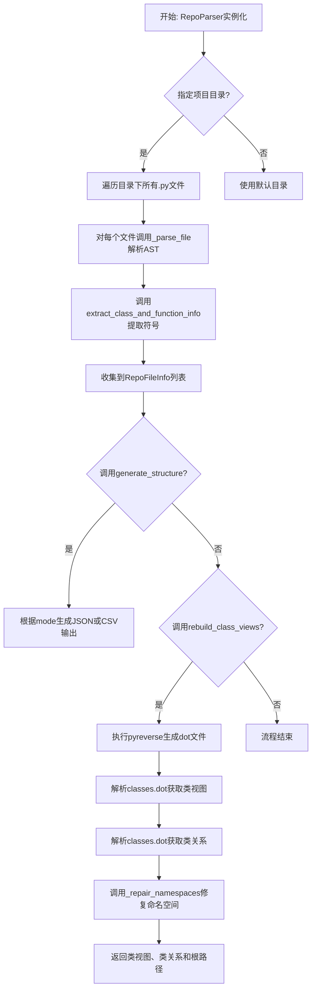

## 类结构

```
BaseModel (Pydantic基类)
├── RepoFileInfo (文件信息模型)
├── CodeBlockInfo (代码块信息模型)
├── DotClassAttribute (类属性模型)
├── DotClassInfo (类信息模型)
├── DotClassRelationship (类关系模型)
├── DotReturn (返回值模型)
├── DotClassMethod (类方法模型)
└── RepoParser (主解析器类)
```

## 全局变量及字段


### `AGGREGATION`
    
表示聚合关系的常量字符串，用于标识类图中的聚合箭头类型

类型：`str`
    


### `COMPOSITION`
    
表示组合关系的常量字符串，用于标识类图中的组合箭头类型

类型：`str`
    


### `GENERALIZATION`
    
表示泛化（继承）关系的常量字符串，用于标识类图中的继承箭头类型

类型：`str`
    


### `logger`
    
日志记录器实例，用于记录脚本运行过程中的信息、警告和错误

类型：`Logger`
    


### `RepoFileInfo.file`
    
文件相对于基础目录的路径或名称

类型：`str`
    


### `RepoFileInfo.classes`
    
文件中定义的类及其方法列表

类型：`List[Dict[str, Any]]`
    


### `RepoFileInfo.functions`
    
文件中定义的函数名称列表

类型：`List[str]`
    


### `RepoFileInfo.globals`
    
文件中定义的全局变量名称列表

类型：`List[str]`
    


### `RepoFileInfo.page_info`
    
文件中各代码块的详细信息列表

类型：`List[CodeBlockInfo]`
    


### `CodeBlockInfo.lineno`
    
代码块的起始行号

类型：`int`
    


### `CodeBlockInfo.end_lineno`
    
代码块的结束行号

类型：`int`
    


### `CodeBlockInfo.type_name`
    
代码块的类型名称（如ClassDef、FunctionDef等）

类型：`str`
    


### `CodeBlockInfo.tokens`
    
代码块中解析出的令牌列表

类型：`List[Any]`
    


### `CodeBlockInfo.properties`
    
代码块的附加属性字典

类型：`Dict[str, Any]`
    


### `DotClassAttribute.name`
    
类属性的名称

类型：`str`
    


### `DotClassAttribute.type_`
    
类属性的类型

类型：`str`
    


### `DotClassAttribute.default_`
    
类属性的默认值

类型：`str`
    


### `DotClassAttribute.description`
    
类属性的原始描述文本

类型：`str`
    


### `DotClassAttribute.compositions`
    
类属性类型中引用的其他类（组合关系）列表

类型：`List[str]`
    


### `DotClassInfo.name`
    
类的名称

类型：`str`
    


### `DotClassInfo.package`
    
类所属的包（模块）路径

类型：`Optional[str]`
    


### `DotClassInfo.attributes`
    
类的属性字典，键为属性名，值为属性对象

类型：`Dict[str, DotClassAttribute]`
    


### `DotClassInfo.methods`
    
类的方法字典，键为方法名，值为方法对象

类型：`Dict[str, DotClassMethod]`
    


### `DotClassInfo.compositions`
    
类通过属性引用的其他类（组合关系）列表

类型：`List[str]`
    


### `DotClassInfo.aggregations`
    
类通过方法参数或返回值引用的其他类（聚合关系）列表

类型：`List[str]`
    


### `DotClassRelationship.src`
    
关系中的源类名称

类型：`str`
    


### `DotClassRelationship.dest`
    
关系中的目标类名称

类型：`str`
    


### `DotClassRelationship.relationship`
    
关系的类型（泛化、组合、聚合）

类型：`str`
    


### `DotClassRelationship.label`
    
关系的可选标签（主要用于组合和聚合关系）

类型：`Optional[str]`
    


### `DotReturn.type_`
    
返回值的类型

类型：`str`
    


### `DotReturn.description`
    
返回值的原始描述文本

类型：`str`
    


### `DotReturn.compositions`
    
返回值类型中引用的其他类（组合关系）列表

类型：`List[str]`
    


### `DotClassMethod.name`
    
方法的名称

类型：`str`
    


### `DotClassMethod.args`
    
方法的参数列表

类型：`List[DotClassAttribute]`
    


### `DotClassMethod.return_args`
    
方法的返回值信息

类型：`Optional[DotReturn]`
    


### `DotClassMethod.description`
    
方法的原始描述文本

类型：`str`
    


### `DotClassMethod.aggregations`
    
方法通过参数或返回值引用的其他类（聚合关系）列表

类型：`List[str]`
    


### `RepoParser.base_directory`
    
要分析的项目基础目录路径

类型：`Path`
    
    

## 全局函数及方法

### `is_func`

该函数用于判断给定的AST节点是否表示一个函数（包括普通函数和异步函数）。

参数：

- `node`：`ast.AST`，一个抽象语法树节点

返回值：`bool`，如果节点是函数定义（`ast.FunctionDef`）或异步函数定义（`ast.AsyncFunctionDef`）则返回`True`，否则返回`False`

#### 流程图

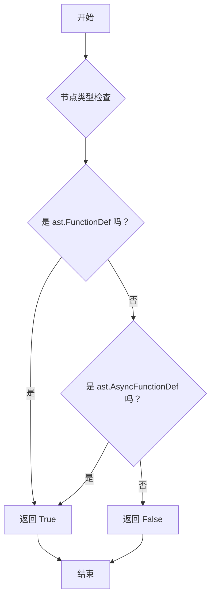

#### 带注释源码

```python
def is_func(node) -> bool:
    """
    返回 True 如果给定的节点表示一个函数。

    Args:
        node: 抽象语法树节点。

    Returns:
        bool: 如果节点表示一个函数则返回 True，否则返回 False。
    """
    # 使用 isinstance 检查节点类型是否为 ast.FunctionDef 或 ast.AsyncFunctionDef
    return isinstance(node, (ast.FunctionDef, ast.AsyncFunctionDef))
```

### `DotClassAttribute.parse`

该方法用于解析点格式（dot format）的类属性文本，将其转换为结构化的 `DotClassAttribute` 对象。它处理属性定义中的名称、类型、默认值，并提取可能的组合关系（compositions），例如从 `Union[User, Admin]` 中提取 `User` 和 `Admin`。

参数：

- `v`：`str`，待解析的点格式文本，例如 `name: str = "default"`。

返回值：`DotClassAttribute`，一个表示解析后类属性的对象，包含名称、类型、默认值、描述和组合关系列表。

#### 流程图

```mermaid
flowchart TD
    A[开始: 输入点格式文本 v] --> B[预处理: 确保包含 ':' 和 '=']
    B --> C[分割字符串: 提取 name, type_, default_]
    C --> D{type_ 是否包含 'Literal['?}
    D -- 是 --> E[分割 Literal 部分<br>处理组合关系]
    D -- 否 --> F[清理 type_ 中的引号]
    E --> G[解析组合关系<br>parse_compositions]
    F --> G
    G --> H[创建并返回 DotClassAttribute 对象]
    H --> I[结束]
```

#### 带注释源码

```python
    @classmethod
    def parse(cls, v: str) -> "DotClassAttribute":
        """
        Parses dot format text and returns a DotClassAttribute object.

        Args:
            v (str): Dot format text to be parsed.

        Returns:
            DotClassAttribute: An instance of the DotClassAttribute class representing the parsed data.
        """
        # 1. 预处理：确保字符串中包含 ':' 和 '=' 分隔符，以便后续分割。
        val = ""
        meet_colon = False
        meet_equals = False
        for c in v:
            if c == ":":
                meet_colon = True
            elif c == "=":
                meet_equals = True
                if not meet_colon:
                    val += ":"
                    meet_colon = True
            val += c
        if not meet_colon:
            val += ":"
        if not meet_equals:
            val += "="

        # 2. 分割字符串，提取名称、类型和默认值部分。
        cix = val.find(":")
        eix = val.rfind("=")
        name = val[0:cix].strip()
        type_ = val[cix + 1 : eix]
        default_ = val[eix + 1 :].strip()

        # 3. 清理类型字符串：移除空格，处理 `NoneType`。
        type_ = remove_white_spaces(type_)  # remove white space
        if type_ == "NoneType":
            type_ = ""
        # 4. 特殊处理 `Literal[...]` 类型，提取字面量部分用于组合关系分析。
        if "Literal[" in type_:
            pre_l, literal, post_l = cls._split_literal(type_)
            composition_val = pre_l + "Literal" + post_l  # replace Literal[...] with Literal
            type_ = pre_l + literal + post_l
        else:
            type_ = re.sub(r"['\"]+", "", type_)  # remove '"
            composition_val = type_

        # 5. 处理默认值：将 `"None"` 转换为空字符串。
        if default_ == "None":
            default_ = ""
        # 6. 解析组合关系：从类型字符串中提取非内置类型的类名。
        compositions = cls.parse_compositions(composition_val)
        # 7. 创建并返回 DotClassAttribute 对象。
        return cls(name=name, type_=type_, default_=default_, description=v, compositions=compositions)
```

### `DotClassAttribute.parse_compositions`

该方法用于解析类型定义字符串，提取出其中表示自定义类或类型的“组合”部分。它通过将字符串中的特定分隔符替换为统一的分隔符，然后分割并过滤掉内置类型和通用类型，最终返回一个去重后的自定义类型列表。

参数：

- `types_part`：`str`，待解析的类型定义字符串，例如 `"Union[List[User], Optional[Department]]"`

返回值：`List[str]`，从输入字符串中提取出的自定义类型名称列表，例如 `["User", "Department"]`

#### 流程图

```mermaid
flowchart TD
    A[开始: parse_compositions(types_part)] --> B{types_part 是否为空?}
    B -- 是 --> C[返回空列表 []]
    B -- 否 --> D[将 `[` `]` `,` `(` `)` 替换为 `|`]
    D --> E[按 `|` 分割字符串得到类型列表]
    E --> F[初始化结果集合 `result`]
    F --> G[遍历类型列表中的每个类型 `t`]
    G --> H[去除 `t` 两端的空白字符]
    H --> I[移除 `t` 中所有的单引号和双引号]
    I --> J{t 是否为空或在过滤集合中?}
    J -- 是 --> K[跳过此类型]
    J -- 否 --> L[将 t 添加到 result 集合中]
    K --> M[继续处理下一个类型]
    L --> M
    M --> N{是否还有未处理的类型?}
    N -- 是 --> G
    N -- 否 --> O[将 result 集合转换为列表]
    O --> P[返回结果列表]
```

#### 带注释源码

```python
@staticmethod
def parse_compositions(types_part) -> List[str]:
    """
    解析源代码的类型定义代码块，并返回一个组合列表。

    Args:
        types_part: 待解析的类型定义代码块。

    Returns:
        List[str]: 从类型定义代码块中提取出的组合列表。
    """
    # 1. 处理空输入：如果输入字符串为空，直接返回空列表。
    if not types_part:
        return []
    # 2. 统一分隔符：将字符串中所有表示嵌套或分隔的符号（[ ] , ( )）替换为竖线 `|`，
    #    以便后续分割。例如 "List[User, Department]" 变为 "List|User|Department|"。
    modified_string = re.sub(r"[\[\],\(\)]", "|", types_part)
    # 3. 分割字符串：按 `|` 分割修改后的字符串，得到一个初步的类型列表。
    types = modified_string.split("|")
    # 4. 定义过滤器：创建一个包含Python内置类型和常用泛型类型的集合，用于过滤。
    filters = {
        "str", "frozenset", "set", "int", "float", "complex", "bool",
        "dict", "list", "Union", "Dict", "Set", "Tuple", "NoneType",
        "None", "Any", "Optional", "Iterator", "Literal", "List",
    }
    # 5. 初始化结果集合：使用集合来自动去重。
    result = set()
    # 6. 遍历并处理每个分割出的类型片段。
    for t in types:
        # 6.1 移除片段中可能存在的引号（单引号或双引号）。
        t = re.sub(r"['\"]+", "", t.strip())
        # 6.2 检查片段：如果片段不为空且不在过滤集合中，则认为是有效的自定义类型。
        if t and t not in filters:
            result.add(t)
    # 7. 返回结果：将集合转换为列表并返回。
    return list(result)
```

### `DotClassAttribute._split_literal`

该方法用于解析包含 `Literal[...]` 类型注解的字符串，将其拆分为三个部分：`Literal` 前面的部分、`Literal[...]` 内部的内容（包含方括号）以及 `Literal` 后面的部分。它主要用于处理类型定义中的字面量类型，以便后续提取组合关系。

参数：

- `v`：`str`，包含 `Literal[...]` 类型注解的字符串。

返回值：`Tuple[str, str, str]`，返回一个包含三个字符串的元组，分别是 `Literal` 前面的部分、`Literal[...]` 内部的内容（包含方括号）以及 `Literal` 后面的部分。

#### 流程图

```mermaid
flowchart TD
    A[开始] --> B[查找 'Literal[' 的起始位置 bix]
    B --> C[初始化计数器 counter = 1]
    C --> D[从 bix + len('Literal[') 开始遍历字符串]
    D --> E{当前字符是 '['?}
    E -->|是| F[counter += 1]
    F --> D
    E -->|否| G{当前字符是 ']'?}
    G -->|是| H[counter -= 1]
    H --> I{counter > 0?}
    I -->|是| D
    I -->|否| J[记录结束位置 eix = i]
    J --> K[提取 pre_l, literal, post_l]
    K --> L[移除 pre_l 和 post_l 中的引号]
    L --> M[返回 (pre_l, literal, post_l)]
    G -->|否| D
```

#### 带注释源码

```python
@staticmethod
def _split_literal(v):
    """
    解析包含字面量定义的代码块，并返回三个部分：前部分、字面量部分和后部分。

    Args:
        v: 要解析的字面量定义代码块。

    Returns:
        Tuple[str, str, str]: 包含代码块前部分、字面量部分和后部分的元组。
    """
    # 查找 'Literal[' 的起始位置
    tag = "Literal["
    bix = v.find(tag)
    eix = len(v) - 1  # 默认结束位置为字符串末尾
    counter = 1  # 用于跟踪嵌套的方括号层级

    # 遍历字符串，查找匹配的结束方括号
    for i in range(bix + len(tag), len(v) - 1):
        c = v[i]
        if c == "[":
            counter += 1  # 遇到 '['，增加层级
            continue
        if c == "]":
            counter -= 1  # 遇到 ']'，减少层级
            if counter > 0:
                continue  # 如果层级仍大于0，继续查找
            eix = i  # 找到匹配的结束位置
            break

    # 提取三个部分
    pre_l = v[0:bix]  # 'Literal[' 之前的部分
    post_l = v[eix + 1:]  # ']' 之后的部分
    # 移除 pre_l 和 post_l 中的引号
    pre_l = re.sub(r"['\"]", "", pre_l)
    pos_l = re.sub(r"['\"]", "", post_l)

    # 返回三个部分
    return pre_l, v[bix:eix + 1], pos_l
```

### `DotClassAttribute.sort`

这是一个用于自动排序列表属性的字段验证器方法。它在Pydantic模型的字段验证阶段被调用，确保`DotClassAttribute`类中`compositions`字段的值在设置后始终保持排序状态。

参数：

- `cls`：`type`，当前类（`DotClassAttribute`）的引用
- `lst`：`List`，需要被排序的列表属性

返回值：`List`，排序后的列表

#### 流程图

```mermaid
flowchart TD
    A[开始：接收列表 lst] --> B{列表是否为空？}
    B -- 是 --> C[直接返回原列表]
    B -- 否 --> D[调用 lst.sort() 进行原地排序]
    D --> E[返回排序后的列表 lst]
    C --> F[结束]
    E --> F
```

#### 带注释源码

```python
@field_validator("compositions", mode="after")
@classmethod
def sort(cls, lst: List) -> List:
    """
    Auto-sorts a list attribute after making changes.

    Args:
        lst (List): The list attribute to be sorted.

    Returns:
        List: The sorted list.
    """
    lst.sort()  # 使用Python内置的sort方法对列表进行原地排序
    return lst  # 返回排序后的列表
```

### `DotClassInfo.sort`

这是一个 Pydantic 模型字段验证器，用于在数据验证后自动对列表类型的字段进行排序。它接收一个列表，使用 Python 内置的 `sort()` 方法对其进行原地排序，然后返回排序后的列表。

参数：
- `lst`：`List`，需要被排序的列表属性。

返回值：`List`，排序后的列表。

#### 流程图

```mermaid
flowchart TD
    A[开始: 接收列表 lst] --> B{列表 lst 是否为空或只有一个元素?}
    B -- 是 --> C[直接返回原列表]
    B -- 否 --> D[调用 lst.sort() 进行原地排序]
    D --> E[返回排序后的列表 lst]
    E --> F[结束]
```

#### 带注释源码

```python
    @field_validator("compositions", "aggregations", mode="after")
    @classmethod
    def sort(cls, lst: List) -> List:
        """
        Auto-sorts a list attribute after making changes.

        Args:
            lst (List): The list attribute to be sorted.

        Returns:
            List: The sorted list.
        """
        lst.sort()  # 使用 Python 内置的 sort 方法对列表进行原地排序
        return lst  # 返回排序后的列表
```

### `DotReturn.parse`

`DotReturn.parse` 是一个类方法，用于解析点格式（dot format）文本中的函数或方法返回类型部分，并返回一个 `DotReturn` 对象。该方法会清理返回类型字符串，提取类型信息，并解析出相关的组合（compositions）信息。

参数：

- `v`：`str`，包含返回类型部分的点格式文本。

返回值：`DotReturn | None`，返回一个表示解析后返回类型的 `DotReturn` 对象；如果解析失败或输入为空，则返回 `None`。

#### 流程图

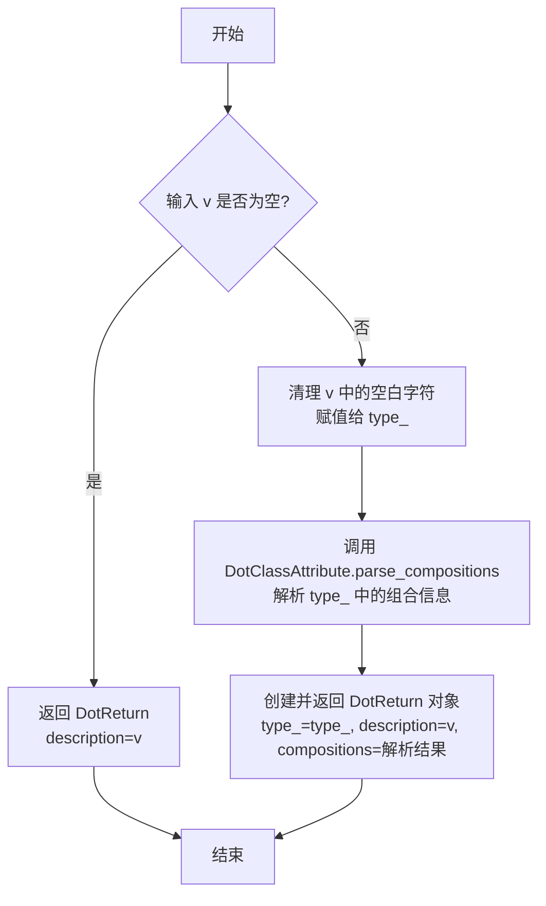

#### 带注释源码

```python
@classmethod
def parse(cls, v: str) -> "DotReturn" | None:
    """
    解析点格式文本中的返回类型部分，并返回一个 DotReturn 对象。

    参数:
        v (str): 包含返回类型部分的点格式文本。

    返回:
        DotReturn | None: 表示解析后返回类型的 DotReturn 对象；如果解析失败，则返回 None。
    """
    # 如果输入字符串为空，则返回一个仅包含描述信息的 DotReturn 对象
    if not v:
        return DotReturn(description=v)
    # 清理输入字符串中的空白字符，得到纯净的类型字符串
    type_ = remove_white_spaces(v)
    # 调用辅助方法解析类型字符串中的组合（类依赖）信息
    compositions = DotClassAttribute.parse_compositions(type_)
    # 创建并返回 DotReturn 对象，包含类型、原始描述和组合信息
    return cls(type_=type_, description=v, compositions=compositions)
```

### `DotReturn.sort`

这是一个 Pydantic 模型字段验证器，用于在数据验证后自动对 `DotReturn` 类中 `compositions` 列表字段进行排序。它确保列表始终保持有序状态，以提高数据一致性和可读性。

参数：

- `cls`：`type`，指向 `DotReturn` 类本身的引用。
- `lst`：`List`，需要被排序的列表，此处特指 `DotReturn` 实例的 `compositions` 字段。

返回值：`List`，返回排序后的列表。

#### 流程图

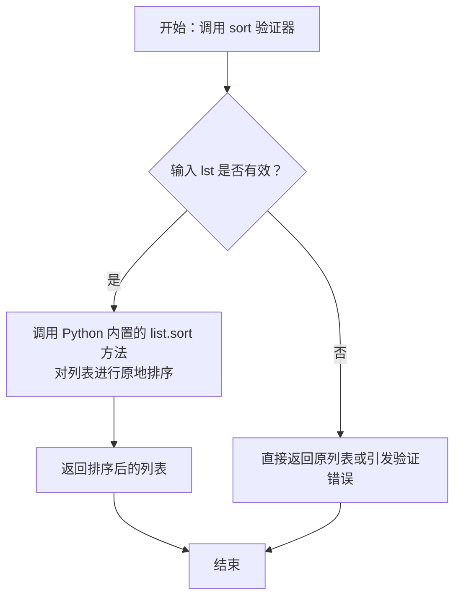

#### 带注释源码

```python
    @field_validator("compositions", mode="after")  # 这是一个 Pydantic 字段验证器装饰器，指定验证对象为 `compositions` 字段，并在字段值被设置后（`mode="after"`）运行。
    @classmethod  # 声明这是一个类方法，第一个参数是类本身（cls）。
    def sort(cls, lst: List) -> List:  # 方法定义。`cls` 是类引用，`lst` 是待处理的列表，返回排序后的列表。
        """
        Auto-sorts a list attribute after making changes.  # 方法描述：在列表属性发生更改后自动对其进行排序。

        Args:
            lst (List): The list attribute to be sorted.  # 参数 `lst`：需要被排序的列表属性。

        Returns:
            List: The sorted list.  # 返回值：排序后的列表。
        """
        lst.sort()  # 调用 Python 列表的 `sort()` 方法进行原地排序（默认升序）。
        return lst  # 返回排序后的列表。Pydantic 验证器需要返回处理后的值以更新字段。
```

### `DotClassMethod.parse`

该方法用于解析点格式（dot format）的方法文本，并返回一个 `DotClassMethod` 对象。它从输入字符串中提取方法名、参数列表、返回类型，并计算聚合关系。

参数：

- `v`：`str`，包含方法信息的点格式文本，例如 `method_name(arg1: type1, arg2: type2) -> return_type`

返回值：`DotClassMethod`，表示解析后的方法信息，包括方法名、参数列表、返回类型、描述和聚合关系

#### 流程图

```mermaid
flowchart TD
    A[开始] --> B[查找 '(' 和 ')' 的位置]
    B --> C[查找返回类型分隔符 ':' 的位置]
    C --> D[分割字符串为 name_part, args_part, return_args_part]
    D --> E[解析方法名]
    E --> F[解析参数列表]
    F --> G[解析返回类型]
    G --> H[计算聚合关系]
    H --> I[返回 DotClassMethod 对象]
    I --> J[结束]
```

#### 带注释源码

```python
@classmethod
def parse(cls, v: str) -> "DotClassMethod":
    """
    解析点格式的方法文本并返回一个 DotClassMethod 对象。

    参数：
        v (str): 包含方法信息的点格式文本。

    返回值：
        DotClassMethod: 表示解析后的方法信息。
    """
    # 查找方法参数部分的起始和结束位置
    bix = v.find("(")
    eix = v.rfind(")")
    # 查找返回类型分隔符 ':' 的位置
    rix = v.rfind(":")
    if rix < 0 or rix < eix:
        rix = eix
    # 分割字符串为方法名部分、参数部分和返回类型部分
    name_part = v[0:bix].strip()
    args_part = v[bix + 1 : eix].strip()
    return_args_part = v[rix + 1 :].strip()

    # 解析方法名
    name = cls._parse_name(name_part)
    # 解析参数列表
    args = cls._parse_args(args_part)
    # 解析返回类型
    return_args = DotReturn.parse(return_args_part)
    # 计算聚合关系：从参数和返回类型的组合中提取
    aggregations = set()
    for i in args:
        aggregations.update(set(i.compositions))
    aggregations.update(set(return_args.compositions))

    # 返回 DotClassMethod 对象
    return cls(name=name, args=args, description=v, return_args=return_args, aggregations=list(aggregations))
```

### `DotClassMethod._parse_name`

该方法用于解析点格式（dot format）方法名称部分，并返回清理后的方法名称。它主要处理可能包含HTML标签（如`<`和`>`）的方法名，提取标签内的内容作为方法名；如果没有标签，则直接去除首尾空格后返回。

参数：

- `v`：`str`，包含方法名称部分的点格式文本。

返回值：`str`，解析后的方法名称。

#### 流程图

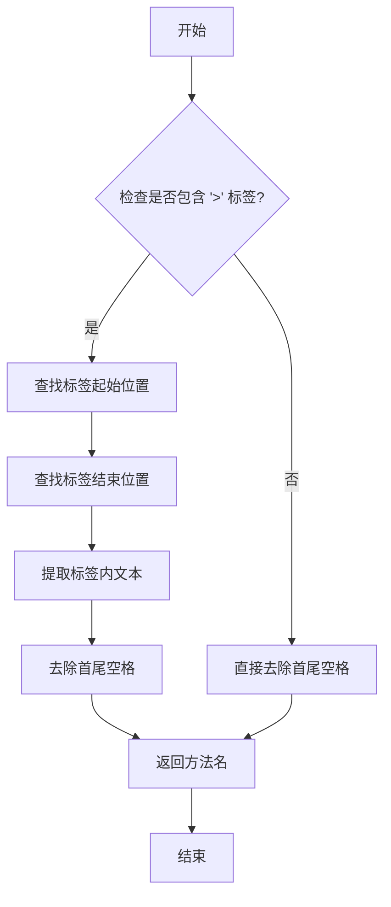

#### 带注释源码

```python
@staticmethod
def _parse_name(v: str) -> str:
    """
    解析点格式方法名称部分并返回方法名称。

    该方法检查输入字符串是否包含HTML标签（如`<`和`>`）。如果包含，
    则提取标签内的内容作为方法名；否则，直接去除首尾空格后返回。

    Args:
        v (str): 包含方法名称部分的点格式文本。

    Returns:
        str: 解析后的方法名称。
    """
    # 定义可能的标签列表，用于检查是否包含HTML标签
    tags = [">", "</"]
    
    # 检查是否包含标签起始符'>'
    if tags[0] in v:
        # 找到标签起始位置（跳过标签起始符）
        bix = v.find(tags[0]) + len(tags[0])
        # 找到标签结束位置（查找'</'标签）
        eix = v.rfind(tags[1])
        # 提取标签内的文本，并去除首尾空格
        return v[bix:eix].strip()
    
    # 如果不包含标签，直接去除首尾空格后返回
    return v.strip()
```

### `DotClassMethod._parse_args`

该方法用于解析点格式（dot format）方法定义中的参数部分，将其转换为`DotClassAttribute`对象的列表。它处理参数字符串，分割各个参数，并利用`DotClassAttribute.parse`方法解析每个参数的定义，最终返回一个包含所有解析后参数的列表。

参数：

- `v`：`str`，点格式方法定义中的参数部分字符串。

返回值：`List[DotClassAttribute]`，解析后的参数列表，每个参数表示为一个`DotClassAttribute`对象。

#### 流程图

```mermaid
flowchart TD
    A[开始] --> B{参数字符串v是否为空?}
    B -- 是 --> C[返回空列表]
    B -- 否 --> D[初始化部分列表parts和计数器counter]
    D --> E[遍历字符串v的每个字符]
    E --> F{字符是'['?}
    F -- 是 --> G[counter加1]
    G --> E
    F -- 否 --> H{字符是']'?}
    H -- 是 --> I[counter减1]
    I --> E
    H -- 否 --> J{字符是','且counter为0?}
    J -- 是 --> K[将当前部分添加到parts列表]
    K --> L[重置起始索引bix]
    L --> E
    J -- 否 --> M[继续遍历]
    M --> E
    E --> N[遍历结束]
    N --> O[将最后一部分添加到parts列表]
    O --> P[初始化属性列表attrs]
    P --> Q[遍历parts中的每个参数部分p]
    Q --> R{参数部分p是否非空?}
    R -- 是 --> S[使用DotClassAttribute.parse解析p]
    S --> T[将解析结果添加到attrs列表]
    T --> Q
    R -- 否 --> U[跳过]
    U --> Q
    Q --> V[遍历结束]
    V --> W[返回attrs列表]
    C --> W
```

#### 带注释源码

```python
@staticmethod
def _parse_args(v: str) -> List[DotClassAttribute]:
    """
    解析点格式方法定义中的参数部分，返回解析后的参数列表。

    该方法通过遍历参数字符串，根据方括号的嵌套和逗号分割参数，
    然后使用DotClassAttribute.parse方法解析每个参数定义。

    Args:
        v (str): 点格式方法定义中的参数部分字符串。

    Returns:
        List[DotClassAttribute]: 解析后的参数列表，每个参数表示为一个DotClassAttribute对象。
    """
    if not v:
        return []  # 如果参数字符串为空，直接返回空列表
    parts = []  # 存储分割后的参数部分
    bix = 0  # 当前参数部分的起始索引
    counter = 0  # 方括号嵌套计数器，用于处理嵌套类型（如List[List[int]]）
    for i in range(0, len(v)):
        c = v[i]  # 当前字符
        if c == '[':
            counter += 1  # 遇到左方括号，增加嵌套计数
            continue
        elif c == ']':
            counter -= 1  # 遇到右方括号，减少嵌套计数
            continue
        elif c == ',' and counter == 0:  # 遇到逗号且不在嵌套中，表示参数分割点
            parts.append(v[bix:i].strip())  # 提取当前参数部分并去除空白
            bix = i + 1  # 更新下一个参数的起始索引
    parts.append(v[bix:].strip())  # 添加最后一个参数部分

    attrs = []  # 存储解析后的DotClassAttribute对象
    for p in parts:
        if p:  # 忽略空字符串部分
            attr = DotClassAttribute.parse(p)  # 解析单个参数定义
            attrs.append(attr)  # 添加到结果列表
    return attrs  # 返回解析后的参数列表
```

### `RepoParser._parse_file`

该方法用于解析指定的Python文件，将其内容转换为抽象语法树（AST）的节点列表。它是符号提取流程的起点，通过Python内置的`ast`模块读取文件内容并进行语法分析。

参数：

- `file_path`：`Path`，需要解析的Python文件的路径对象。

返回值：`list`，返回一个列表，包含从文件中解析出的AST顶级节点（如模块、类定义、函数定义等）。如果解析过程中发生异常，则返回空列表（由`@handle_exception`装饰器处理）。

#### 流程图

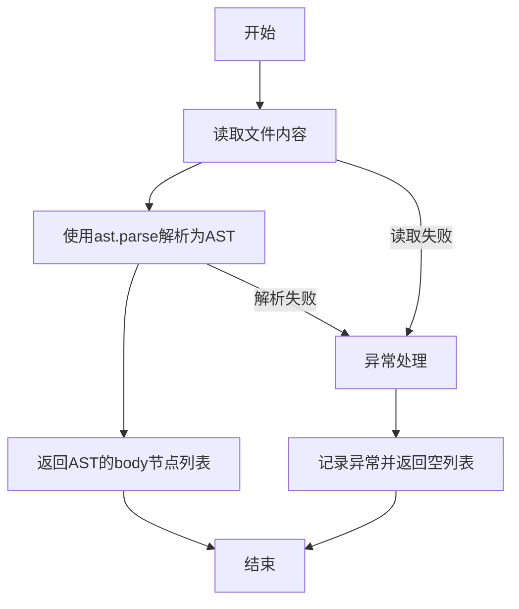

#### 带注释源码

```python
    @classmethod
    @handle_exception(exception_type=Exception, default_return=[])
    def _parse_file(cls, file_path: Path) -> list:
        """
        Parses a Python file in the repository.

        Args:
            file_path (Path): The path to the Python file to be parsed.

        Returns:
            list: A list containing the parsed symbols from the file.
        """
        # 使用Path对象的read_text方法读取文件全部内容
        # 使用ast.parse将文件内容解析为抽象语法树（AST）
        # 返回AST的body属性，它是一个包含所有顶级语句（如类、函数、赋值等）的列表
        return ast.parse(file_path.read_text()).body
```

### `RepoParser.extract_class_and_function_info`

该方法用于从Python文件的抽象语法树（AST）中提取类、函数和全局变量的信息，并将其封装成一个`RepoFileInfo`对象返回。它遍历AST的顶级节点，根据节点类型（类定义、函数定义、赋值语句等）收集相应的符号信息，并调用`node_to_str`方法将节点转换为`CodeBlockInfo`对象，作为页面信息的一部分存储。

参数：

- `tree`：`ast.AST`，Python文件的抽象语法树（AST），用于解析和提取代码结构信息。
- `file_path`：`Path`，当前正在解析的Python文件的路径，用于在`RepoFileInfo`中记录文件的相对路径。

返回值：`RepoFileInfo`，包含从AST中提取的文件信息，包括文件名、类列表、函数列表、全局变量列表以及页面信息（代码块信息）。

#### 流程图

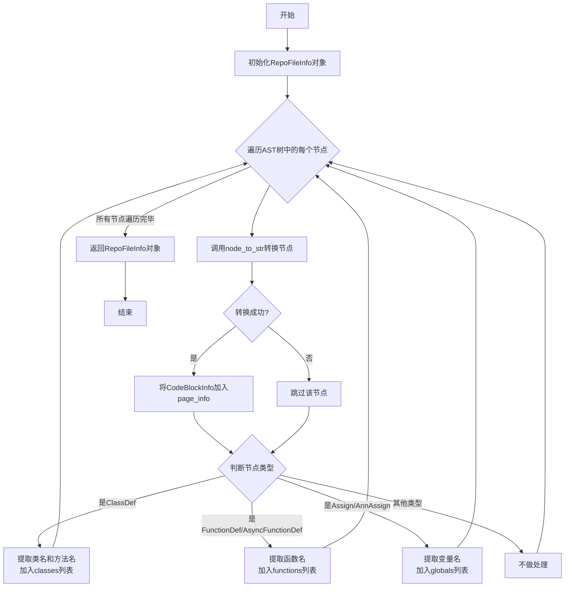

#### 带注释源码

```python
def extract_class_and_function_info(self, tree, file_path) -> RepoFileInfo:
    """
    从抽象语法树（AST）中提取类、函数和全局变量的信息。

    Args:
        tree: 要解析的Python文件的抽象语法树（AST）。
        file_path: 当前正在解析的Python文件的路径。

    Returns:
        RepoFileInfo: 一个包含提取信息的RepoFileInfo对象。
    """
    # 1. 初始化RepoFileInfo对象，记录文件相对于项目根目录的路径
    file_info = RepoFileInfo(file=str(file_path.relative_to(self.base_directory)))
    
    # 2. 遍历AST中的所有顶级节点
    for node in tree:
        # 2.1 尝试将当前AST节点转换为CodeBlockInfo对象（用于页面信息）
        info = RepoParser.node_to_str(node)
        if info:
            # 如果转换成功，将其添加到文件的页面信息列表中
            file_info.page_info.append(info)
        
        # 2.2 根据节点类型提取不同的符号信息
        if isinstance(node, ast.ClassDef):
            # 如果是类定义节点
            # 提取类体中所有函数定义节点的方法名
            class_methods = [m.name for m in node.body if is_func(m)]
            # 将类名及其方法列表添加到文件信息的classes列表中
            file_info.classes.append({"name": node.name, "methods": class_methods})
        elif is_func(node):
            # 如果是函数（或异步函数）定义节点，将函数名添加到functions列表
            file_info.functions.append(node.name)
        elif isinstance(node, (ast.Assign, ast.AnnAssign)):
            # 如果是赋值或注解赋值节点（用于提取全局变量）
            # 确定赋值的目标（可能有多个，如 a = b = 1）
            targets = node.targets if isinstance(node, ast.Assign) else [node.target]
            for target in targets:
                if isinstance(target, ast.Name):
                    # 如果目标是简单的变量名（如 `x`），将其id添加到globals列表
                    file_info.globals.append(target.id)
    # 3. 返回填充好的文件信息对象
    return file_info
```

### `RepoParser.generate_symbols`

该方法用于从项目目录中构建符号仓库，通过扫描指定扩展名（当前为`.py`）的文件，解析其抽象语法树（AST），并提取每个文件中的类、函数和全局变量信息，最终返回一个包含所有文件信息的列表。

参数：

-  `self`：`RepoParser`，`RepoParser`类的实例，用于访问类属性和其他方法。
-  无其他显式参数，但依赖于`self.base_directory`属性作为扫描的根目录。

返回值：`List[RepoFileInfo]`，一个列表，其中每个元素是一个`RepoFileInfo`对象，包含了对应文件的路径、类信息、函数列表、全局变量列表以及页面信息。

#### 流程图

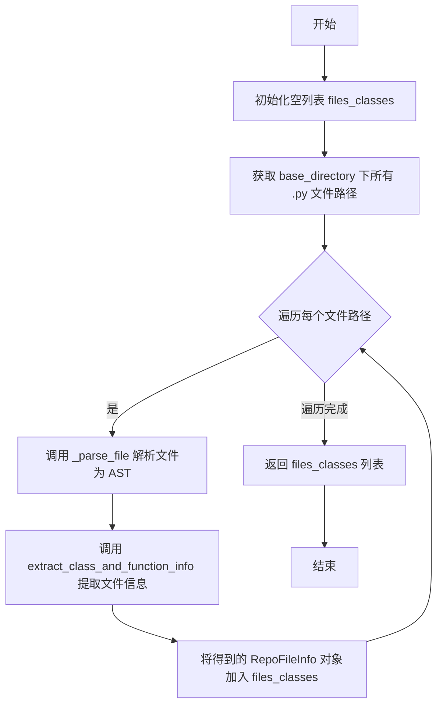

#### 带注释源码

```python
def generate_symbols(self) -> List[RepoFileInfo]:
    """
    从项目目录中的'.py'和'.js'文件（当前仅实现'.py'）构建符号仓库。

    返回:
        List[RepoFileInfo]: 一个包含所有文件提取信息的RepoFileInfo对象列表。
    """
    # 初始化一个空列表，用于存储所有文件的解析信息
    files_classes = []
    # 获取基础目录路径
    directory = self.base_directory

    # 初始化匹配文件列表
    matching_files = []
    # 定义要扫描的文件扩展名列表（当前仅支持.py）
    extensions = ["*.py"]
    # 遍历每个扩展名，使用rglob递归查找所有匹配的文件
    for ext in extensions:
        matching_files += directory.rglob(ext)
    # 遍历找到的每个文件路径
    for path in matching_files:
        # 调用内部方法_parse_file解析当前文件，得到AST树
        tree = self._parse_file(path)
        # 调用extract_class_and_function_info方法，从AST树中提取类、函数、全局变量等信息
        file_info = self.extract_class_and_function_info(tree, path)
        # 将提取到的文件信息对象添加到结果列表中
        files_classes.append(file_info)

    # 返回包含所有文件信息的列表
    return files_classes
```

### `RepoParser.generate_json_structure`

该方法用于生成一个JSON文件，以文档化代码仓库的结构。它首先调用`generate_symbols`方法从项目目录中提取所有Python文件的符号信息（如类、函数、全局变量），然后将这些信息序列化为JSON格式，并写入到指定的输出路径。

参数：

- `output_path`：`Path`，指定生成的JSON文件的保存路径。

返回值：`None`，该方法不返回任何值，其作用是将数据写入文件。

#### 流程图

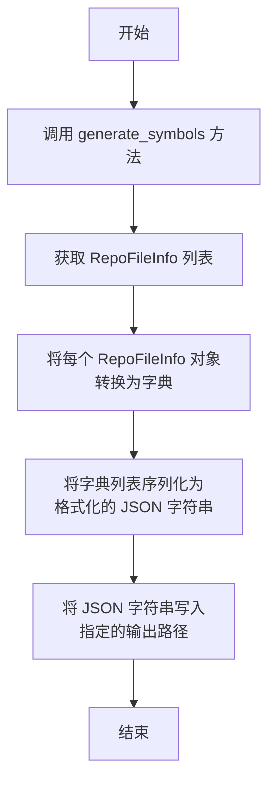

#### 带注释源码

```python
def generate_json_structure(self, output_path: Path):
    """
    生成一个JSON文件，用于文档化仓库结构。

    该方法执行以下步骤：
    1. 调用 `self.generate_symbols()` 方法，遍历项目目录下的所有Python文件，
       解析其AST，并提取出每个文件的类、函数、全局变量等信息，封装成 `RepoFileInfo` 对象列表。
    2. 使用列表推导式，将每个 `RepoFileInfo` 对象通过 `model_dump()` 方法转换为字典。
    3. 使用 `json.dumps` 函数将字典列表序列化为一个格式美观（缩进为4个空格）的JSON字符串。
    4. 使用 `Path.write_text` 方法将JSON字符串写入到 `output_path` 指定的文件中。

    Args:
        output_path (Path): 生成的JSON文件的保存路径。
    """
    # 步骤1 & 2: 生成符号信息并转换为字典列表
    files_classes = [i.model_dump() for i in self.generate_symbols()]
    # 步骤3 & 4: 序列化为JSON并写入文件
    output_path.write_text(json.dumps(files_classes, indent=4))
```

### `RepoParser.generate_dataframe_structure`

该方法用于生成一个描述代码仓库结构的 Pandas DataFrame，并将其保存为 CSV 文件。它首先调用 `generate_symbols` 方法获取仓库中所有文件的符号信息，然后将这些信息转换为字典列表，并最终创建和保存 DataFrame。

参数：

- `output_path`：`Path`，指定生成的 CSV 文件的保存路径。

返回值：`None`，该方法不返回任何值，其作用是将数据写入文件。

#### 流程图

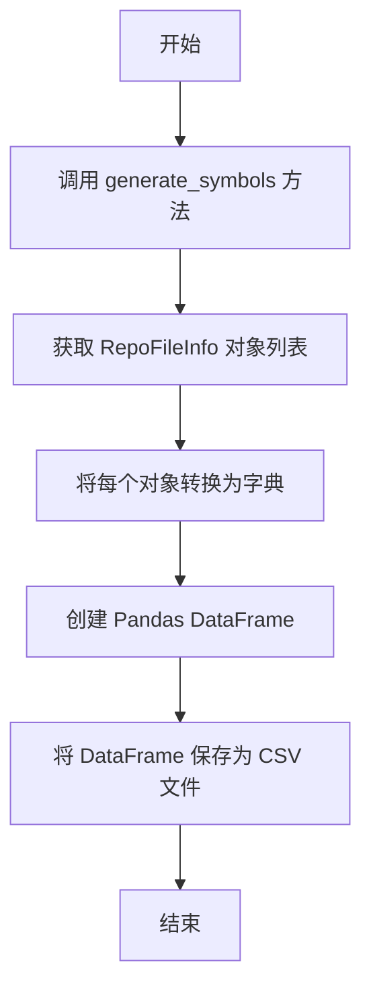

#### 带注释源码

```python
def generate_dataframe_structure(self, output_path: Path):
    """
    生成一个 DataFrame 来记录仓库结构，并将其保存为 CSV 文件。

    Args:
        output_path (Path): 要生成的 CSV 文件的路径。
    """
    # 1. 调用 generate_symbols 方法，获取仓库中所有文件的符号信息。
    #    返回一个 RepoFileInfo 对象的列表。
    files_classes = [i.model_dump() for i in self.generate_symbols()]
    
    # 2. 将 RepoFileInfo 对象列表转换为字典列表，以便 Pandas 可以处理。
    #    model_dump() 方法将 Pydantic 模型实例序列化为字典。
    
    # 3. 使用转换后的字典列表创建一个 Pandas DataFrame。
    #    每个字典代表一个文件的信息，成为 DataFrame 的一行。
    df = pd.DataFrame(files_classes)
    
    # 4. 将 DataFrame 写入到指定的输出路径，格式为 CSV，不包含行索引。
    df.to_csv(output_path, index=False)
```

### `RepoParser.generate_structure`

该方法根据指定的输出格式（JSON 或 CSV），生成并保存代码仓库的结构信息。它首先确定输出文件的路径，然后根据 `mode` 参数调用相应的方法（`generate_json_structure` 或 `generate_dataframe_structure`）来生成结构数据并写入文件，最后返回输出文件的路径。

参数：
- `output_path`：`str | Path`，输出文件的路径。如果为 `None`，则默认在 `base_directory` 下生成一个以目录名和模式命名的文件。
- `mode`：`str`，输出格式模式。可选值为 `"json"`（默认）或 `"csv"`。

返回值：`Path`，生成的输出文件的路径。

#### 流程图

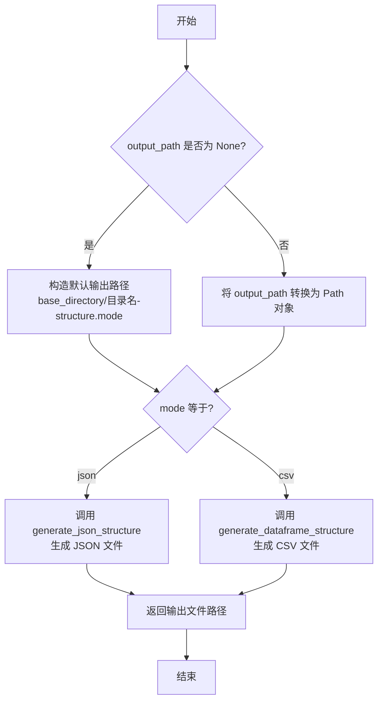

#### 带注释源码

```python
def generate_structure(self, output_path: str | Path = None, mode="json") -> Path:
    """
    生成代码仓库的结构信息，并以指定格式（JSON 或 CSV）保存到文件。

    该方法首先确定输出文件的路径。如果未提供 `output_path`，则会在 `base_directory` 下
    创建一个默认文件，文件名格式为 `{目录名}-structure.{mode}`。然后，根据 `mode` 参数
    的值，调用相应的方法来生成结构数据并写入文件。

    Args:
        output_path (str | Path): 输出文件的路径。如果为 None，则使用默认路径。
        mode (str): 输出格式模式。支持 "json"（默认）和 "csv"。

    Returns:
        Path: 生成的输出文件的路径。
    """
    # 1. 确定输出文件路径：如果未提供，则构造默认路径
    output_file = self.base_directory / f"{self.base_directory.name}-structure.{mode}"
    output_path = Path(output_path) if output_path else output_file

    # 2. 根据模式调用不同的生成方法
    if mode == "json":
        self.generate_json_structure(output_path)
    elif mode == "csv":
        self.generate_dataframe_structure(output_path)
    # 3. 返回最终的文件路径
    return output_path
```

### `RepoParser.node_to_str`

`RepoParser.node_to_str` 是一个静态方法，用于将给定的抽象语法树（AST）节点解析并转换为一个结构化的 `CodeBlockInfo` 对象。该方法根据节点的类型，使用预定义的映射规则提取关键信息（如行号、类型名、令牌列表或属性字典），从而将复杂的AST节点简化为一个标准化的数据表示形式。如果节点类型不受支持或解析失败，则返回 `None`。

参数：

- `node`：`ast.AST`，需要解析的抽象语法树节点。

返回值：`CodeBlockInfo | None`，成功时返回包含节点信息的 `CodeBlockInfo` 对象；如果节点类型不受支持或解析失败，则返回 `None`。

#### 流程图

```mermaid
flowchart TD
    A[开始: 输入AST节点 node] --> B{检查节点类型是否为 ast.Try?}
    B -- 是 --> C[返回 None]
    B -- 否 --> D{检查节点类型是否为 ast.Expr?}
    D -- 是 --> E[创建 CodeBlockInfo 对象<br>设置 type_name 为节点类型字符串<br>调用 _parse_expr 解析 tokens]
    D -- 否 --> F[从 mappings 字典中<br>查找对应节点类型的解析函数 func]
    F --> G{func 是否存在?}
    G -- 否 --> H[记录警告日志<br>返回 None]
    G -- 是 --> I[创建 CodeBlockInfo 对象<br>设置 lineno 和 end_lineno<br>设置 type_name 为节点类型字符串]
    I --> J[调用 func(node) 获取解析值 val]
    J --> K{判断 val 的类型}
    K -- dict --> L[将 val 赋值给 code_block.properties]
    K -- list --> M[将 val 赋值给 code_block.tokens]
    K -- str --> N[将 [val] 赋值给 code_block.tokens]
    K -- 其他 --> O[抛出 NotImplementedError]
    L --> P[返回 code_block]
    M --> P
    N --> P
    E --> P
```

#### 带注释源码

```python
@staticmethod
def node_to_str(node) -> CodeBlockInfo | None:
    """
    解析并转换一个抽象语法树（AST）节点为 CodeBlockInfo 对象。

    该方法根据节点的类型，使用预定义的映射规则提取关键信息（如行号、类型名、令牌列表或属性字典），
    从而将复杂的AST节点简化为一个标准化的数据表示形式。如果节点类型不受支持或解析失败，则返回 None。

    Args:
        node: 需要解析的抽象语法树节点。

    Returns:
        CodeBlockInfo | None: 成功时返回包含节点信息的 CodeBlockInfo 对象；
                              如果节点类型不受支持或解析失败，则返回 None。
    """
    # 1. 特殊处理：跳过 ast.Try 节点，直接返回 None。
    if isinstance(node, ast.Try):
        return None

    # 2. 处理 ast.Expr 节点：创建 CodeBlockInfo 并调用 _parse_expr 来填充 tokens。
    if any_to_str(node) == any_to_str(ast.Expr):
        return CodeBlockInfo(
            lineno=node.lineno,
            end_lineno=node.end_lineno,
            type_name=any_to_str(node),
            tokens=RepoParser._parse_expr(node),  # 解析表达式内容
        )

    # 3. 定义节点类型到解析函数的映射字典。
    mappings = {
        any_to_str(ast.Import): lambda x: [RepoParser._parse_name(n) for n in x.names],  # 解析导入语句
        any_to_str(ast.Assign): RepoParser._parse_assign,  # 解析赋值语句
        any_to_str(ast.ClassDef): lambda x: x.name,  # 解析类定义，提取类名
        any_to_str(ast.FunctionDef): lambda x: x.name,  # 解析函数定义，提取函数名
        any_to_str(ast.ImportFrom): lambda x: {  # 解析 from...import 语句
            "module": x.module,
            "names": [RepoParser._parse_name(n) for n in x.names],
        },
        any_to_str(ast.If): RepoParser._parse_if,  # 解析 if 语句
        any_to_str(ast.AsyncFunctionDef): lambda x: x.name,  # 解析异步函数定义，提取函数名
        any_to_str(ast.AnnAssign): lambda x: RepoParser._parse_variable(x.target),  # 解析带注解的赋值
    }

    # 4. 根据节点类型获取对应的解析函数。
    func = mappings.get(any_to_str(node))
    if func:
        # 5. 创建基础的 CodeBlockInfo 对象，包含行号信息。
        code_block = CodeBlockInfo(lineno=node.lineno, end_lineno=node.end_lineno, type_name=any_to_str(node))
        # 6. 调用解析函数获取具体内容。
        val = func(node)
        # 7. 根据解析结果的类型，填充 code_block 的不同字段。
        if isinstance(val, dict):
            code_block.properties = val  # 字典类型存入 properties
        elif isinstance(val, list):
            code_block.tokens = val  # 列表类型存入 tokens
        elif isinstance(val, str):
            code_block.tokens = [val]  # 字符串类型转为列表存入 tokens
        else:
            # 8. 如果遇到未预期的类型，抛出异常。
            raise NotImplementedError(f"Not implement:{val}")
        return code_block  # 9. 返回构建好的 code_block

    # 10. 如果节点类型不在映射表中，记录警告日志并返回 None。
    logger.warning(f"Unsupported code block:{node.lineno}, {node.end_lineno}, {any_to_str(node)}")
    return None
```

### `RepoParser._parse_expr`

该方法用于解析Python抽象语法树（AST）中的表达式节点，提取关键信息并返回一个列表。它主要处理常量、函数调用和元组类型的表达式节点。

参数：

- `node`：`ast.Expr`，表示一个表达式节点，包含需要解析的AST表达式信息。

返回值：`List`，返回一个列表，包含从表达式节点中解析出的信息，具体内容取决于表达式的类型。

#### 流程图

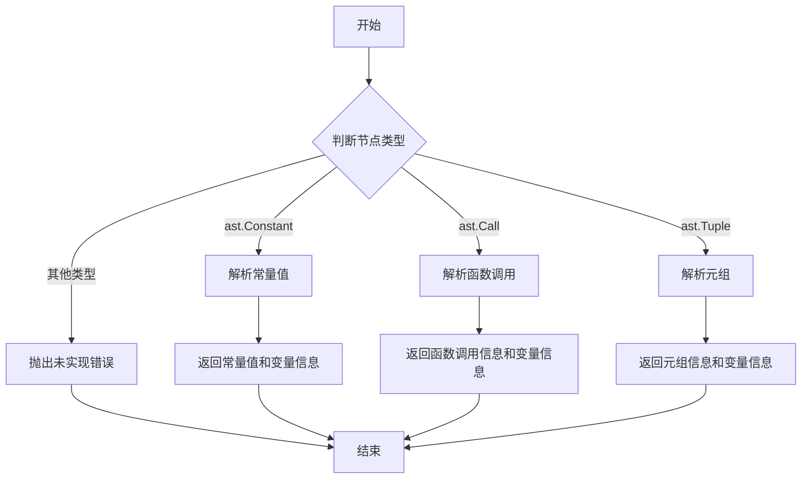

#### 带注释源码

```python
@staticmethod
def _parse_expr(node) -> List:
    """
    解析一个表达式抽象语法树（AST）节点。

    参数：
        node: 表示表达式的AST节点。

    返回值：
        List: 包含从表达式节点解析出的信息的列表。
    """
    # 定义处理不同类型表达式的函数映射
    funcs = {
        any_to_str(ast.Constant): lambda x: [any_to_str(x.value), RepoParser._parse_variable(x.value)],
        any_to_str(ast.Call): lambda x: [any_to_str(x.value), RepoParser._parse_variable(x.value.func)],
        any_to_str(ast.Tuple): lambda x: [any_to_str(x.value), RepoParser._parse_variable(x.value)],
    }
    # 根据节点类型选择对应的处理函数
    func = funcs.get(any_to_str(node.value))
    if func:
        # 执行处理函数并返回结果
        return func(node)
    # 如果节点类型不在处理范围内，抛出未实现错误
    raise NotImplementedError(f"Not implement: {node.value}")
```

### `DotClassMethod._parse_name`

该方法用于解析点格式（dot format）方法名称部分，并返回清理后的方法名。它主要处理可能包含HTML标签（如`<`和`>`）的方法名，提取标签内的文本作为方法名，如果不存在标签则直接去除空白字符后返回。

参数：

- `v`：`str`，包含方法名称部分的点格式文本

返回值：`str`，解析后的方法名

#### 流程图

```mermaid
graph TD
    A[开始] --> B{检查是否包含 '>' 标签};
    B -- 是 --> C[查找标签起始位置];
    C --> D[查找标签结束位置];
    D --> E[提取标签内文本];
    E --> F[去除空白字符];
    F --> G[返回方法名];
    B -- 否 --> H[直接去除空白字符];
    H --> G;
    G --> I[结束];
```

#### 带注释源码

```python
@staticmethod
def _parse_name(v: str) -> str:
    """
    解析点格式方法名称部分并返回方法名。

    该方法检查输入字符串是否包含特定的HTML标签（如`<`和`>`）。
    如果包含，则提取标签内的文本作为方法名；否则，直接去除空白字符后返回。

    Args:
        v (str): 包含方法名称部分的点格式文本

    Returns:
        str: 解析后的方法名
    """
    # 定义可能的标签列表，用于检查字符串中是否包含这些标签
    tags = [">", "</"]
    
    # 检查字符串中是否包含第一个标签（">"）
    if tags[0] in v:
        # 找到标签起始位置（">"之后）
        bix = v.find(tags[0]) + len(tags[0])
        # 找到标签结束位置（"</"之前）
        eix = v.rfind(tags[1])
        # 提取标签内的文本，并去除空白字符
        return v[bix:eix].strip()
    
    # 如果不包含标签，直接去除空白字符后返回
    return v.strip()
```

### `RepoParser._parse_if`

该方法用于解析Python抽象语法树（AST）中的`if`语句节点，提取条件表达式中的变量名，并返回一个包含这些变量名的列表。

参数：

- `n`：`ast.If`，表示要解析的`if`语句的AST节点。

返回值：`List[str]`，返回一个字符串列表，包含从`if`条件表达式中提取的变量名。

#### 流程图

```mermaid
flowchart TD
    A[开始] --> B{检查n.test类型}
    B -->|ast.BoolOp| C[遍历n.test.values<br>递归调用_parse_if_compare]
    B -->|ast.Compare| D[解析n.test.left<br>添加到tokens]
    B -->|ast.Name| E[解析n.test<br>添加到tokens]
    B -->|其他| F[跳过]
    C --> G[合并所有结果到tokens]
    D --> H[遍历n.test.comparators<br>解析并添加到tokens]
    E --> H
    G --> I[返回tokens]
    H --> I
    F --> I
```

#### 带注释源码

```python
@staticmethod
def _parse_if(n):
    """
    解析一个'if'语句的抽象语法树（AST）节点。

    参数：
        n: 表示'if'语句的AST节点。

    返回值：
        从'if'条件表达式中提取的变量名列表。
    """
    tokens = []  # 初始化一个空列表来存储提取的变量名
    try:
        # 检查条件表达式是否为布尔操作（例如：a and b）
        if isinstance(n.test, ast.BoolOp):
            tokens = []
            # 遍历布尔操作中的每个值
            for v in n.test.values:
                # 递归解析每个比较表达式，并扩展tokens列表
                tokens.extend(RepoParser._parse_if_compare(v))
            return tokens
        # 检查条件表达式是否为比较操作（例如：a > b）
        if isinstance(n.test, ast.Compare):
            # 解析比较表达式的左侧部分
            v = RepoParser._parse_variable(n.test.left)
            if v:
                tokens.append(v)
        # 检查条件表达式是否为简单变量名（例如：if flag:）
        if isinstance(n.test, ast.Name):
            v = RepoParser._parse_variable(n.test)
            tokens.append(v)
        # 如果条件表达式有比较器（例如：a > b中的b），则解析它们
        if hasattr(n.test, "comparators"):
            for item in n.test.comparators:
                v = RepoParser._parse_variable(item)
                if v:
                    tokens.append(v)
        return tokens
    except Exception as e:
        # 如果解析过程中发生异常，记录警告日志
        logger.warning(f"Unsupported if: {n}, err:{e}")
    return tokens
```

### `RepoParser._parse_if_compare`

该方法用于解析 `if` 语句条件中的比较表达式（`ast.Compare` 节点）的左操作数部分，提取其中的变量名或属性访问信息。它是 `_parse_if` 方法的辅助函数，专门处理 `ast.Compare` 节点的 `left` 属性。

参数：

- `n`：`ast.AST`，表示一个抽象语法树节点，预期为 `ast.Compare` 节点或其 `left` 属性节点。

返回值：`List[str]`，返回一个列表，包含从节点 `n` 中解析出的变量名或属性访问字符串。如果节点 `n` 具有 `left` 属性，则递归调用 `_parse_variable` 解析该属性并返回结果；否则返回空列表。

#### 流程图

```mermaid
flowchart TD
    A[开始] --> B{节点n是否有 left 属性?}
    B -- 是 --> C[调用 _parse_variable(n.left)]
    C --> D[返回包含解析结果的列表]
    B -- 否 --> E[返回空列表]
    D --> F[结束]
    E --> F
```

#### 带注释源码

```python
    @staticmethod
    def _parse_if_compare(n):
        """
        解析 'if' 条件抽象语法树（AST）节点。

        参数:
            n: 表示 'if' 条件的 AST 节点。

        返回:
            从 'if' 条件节点解析出的信息列表，或空列表。
        """
        # 检查节点 n 是否具有 'left' 属性（例如 ast.Compare 节点）
        if hasattr(n, "left"):
            # 如果存在 left 属性，则调用 _parse_variable 方法解析该属性
            # 该方法会提取变量名或属性访问路径
            return RepoParser._parse_variable(n.left)
        else:
            # 如果节点没有 left 属性，则返回空列表
            return []
```

### `RepoParser._parse_variable`

该方法用于解析AST（抽象语法树）中的变量节点，提取变量名或值信息。它支持多种AST节点类型，包括常量、名称、属性、调用和元组，并返回相应的字符串或列表表示。

参数：

- `node`：`ast.AST`，表示要解析的AST变量节点。

返回值：`Union[str, List, None]`，返回解析后的变量名、值或列表，如果解析失败则返回`None`。

#### 流程图

```mermaid
graph TD
    A[开始] --> B{节点类型检查}
    B -->|ast.Constant| C[提取常量值]
    B -->|ast.Name| D[提取标识符ID]
    B -->|ast.Attribute| E[提取属性路径]
    B -->|ast.Call| F[递归解析调用函数]
    B -->|ast.Tuple| G[提取元组维度值]
    B -->|其他类型| H[抛出未实现错误]
    C --> I[返回常量值]
    D --> I
    E --> I
    F --> I
    G --> I
    H --> J[记录警告并返回None]
    I --> K[结束]
    J --> K
```

#### 带注释源码

```python
@staticmethod
def _parse_variable(node):
    """
    解析一个表示变量的抽象语法树（AST）节点。

    该方法根据节点的类型，使用预定义的映射函数来提取变量名或值。
    支持的节点类型包括常量、名称、属性、调用和元组。
    如果节点类型不被支持，则记录警告并返回None。

    Args:
        node: 要解析的AST变量节点。

    Returns:
        Union[str, List, None]: 解析后的变量名、值或列表，如果解析失败则返回None。
    """
    try:
        # 定义节点类型到解析函数的映射
        funcs = {
            any_to_str(ast.Constant): lambda x: x.value,  # 提取常量值
            any_to_str(ast.Name): lambda x: x.id,  # 提取名称标识符
            any_to_str(ast.Attribute): lambda x: f"{x.value.id}.{x.attr}"
            if hasattr(x.value, "id")
            else f"{x.attr}",  # 提取属性路径（如obj.attr）
            any_to_str(ast.Call): lambda x: RepoParser._parse_variable(x.func),  # 递归解析调用函数
            any_to_str(ast.Tuple): lambda x: [d.value for d in x.dims],  # 提取元组维度值
        }
        # 根据节点类型获取对应的解析函数
        func = funcs.get(any_to_str(node))
        if not func:
            # 如果节点类型不被支持，抛出未实现错误
            raise NotImplementedError(f"Not implement:{node}")
        # 执行解析函数并返回结果
        return func(node)
    except Exception as e:
        # 捕获异常并记录警告
        logger.warning(f"Unsupported variable:{node}, err:{e}")
```

### `RepoParser._parse_assign`

该方法用于解析Python抽象语法树（AST）中的赋值语句节点（`ast.Assign`），提取赋值目标（即变量名）的信息。

参数：
- `node`：`ast.Assign`，表示一个AST赋值节点。

返回值：`List[str] | None`，返回一个字符串列表，包含从赋值目标中解析出的变量名。如果解析失败或目标不是简单变量名，则可能返回`None`。

#### 流程图

```mermaid
flowchart TD
    A[开始] --> B{node 是 ast.Assign 节点?}
    B -- 是 --> C[遍历 node.targets 列表]
    B -- 否 --> D[返回 None]
    C --> E{对每个 target 调用 _parse_variable}
    E --> F[收集解析结果到列表]
    F --> G[返回结果列表]
    E -- 解析失败 --> H[返回 None]
```

#### 带注释源码

```python
@staticmethod
def _parse_assign(node):
    """
    解析一个赋值抽象语法树（AST）节点。

    Args:
        node: 表示赋值的AST节点。

    Returns:
        None 或 从赋值节点解析出的信息。
    """
    # 对于 ast.Assign 节点，其 targets 属性是一个列表，包含一个或多个赋值目标。
    # 对 targets 列表中的每个目标节点，调用 _parse_variable 方法来提取变量名。
    # 最终返回一个由这些变量名组成的列表。
    return [RepoParser._parse_variable(t) for t in node.targets]
```

### `RepoParser.rebuild_class_views`

该方法通过执行 `pylint` 工具的 `pyreverse` 命令，从指定的 Python 项目目录中生成类图（以 `.dot` 格式表示），然后解析这些 `.dot` 文件，重构出项目的类视图（包括类定义、属性、方法）以及类之间的关系（如继承、组合、聚合），并修复命名空间以匹配项目结构。

参数：
- `path`：`str | Path`，可选参数，默认为 `None`。指定要分析的目标目录或文件的路径。如果为 `None`，则使用 `RepoParser` 实例的 `base_directory`。

返回值：`Tuple[List[DotClassInfo], List[DotClassRelationship], str]`，返回一个三元组，包含：
  1. 解析后的类视图列表（`List[DotClassInfo]`），每个元素代表一个类的详细信息。
  2. 解析后的类关系列表（`List[DotClassRelationship]`），每个元素代表两个类之间的关系。
  3. 项目包的根路径（`str`）。

#### 流程图

```mermaid
flowchart TD
    A[开始: rebuild_class_views(path)] --> B{路径是否存在?};
    B -- 否 --> C[返回];
    B -- 是 --> D{路径下是否存在<br>__init__.py?};
    D -- 否 --> E[抛出 ValueError];
    D -- 是 --> F[构建 pyreverse 命令];
    F --> G[创建输出目录 __dot__];
    G --> H[在 __dot__ 目录下<br>执行 pyreverse 命令];
    H --> I{命令执行成功?};
    I -- 否 --> J[抛出 ValueError];
    I -- 是 --> K[解析 classes.dot 文件<br>获取类视图];
    K --> L[解析 classes.dot 文件<br>获取类关系];
    L --> M[解析 packages.dot 文件<br>（本方法未直接使用）];
    M --> N[调用 _repair_namespaces<br>修复命名空间];
    N --> O[删除临时 .dot 文件];
    O --> P[返回: class_views,<br>relationship_views, package_root];
```

#### 带注释源码

```python
async def rebuild_class_views(self, path: str | Path = None):
    """
    执行 `pylint` 的 `pyreverse` 命令来重构点格式的类视图仓库文件。

    Args:
        path (str | Path): 目标目录或文件的路径。默认为 None。
    """
    # 1. 参数处理：如果未提供路径，则使用实例的 base_directory
    if not path:
        path = self.base_directory
    path = Path(path)

    # 2. 基础验证：检查路径是否存在
    if not path.exists():
        return

    # 3. 模块验证：检查目标目录是否是一个有效的 Python 包（包含 __init__.py）
    init_file = path / "__init__.py"
    if not init_file.exists():
        raise ValueError("Failed to import module __init__ with error:No module named __init__.")

    # 4. 构建并执行 pyreverse 命令
    #    命令格式：pyreverse <path> -o dot，在当前目录的 __dot__ 子目录下生成 .dot 文件
    command = f"pyreverse {str(path)} -o dot"
    output_dir = path / "__dot__"
    output_dir.mkdir(parents=True, exist_ok=True) # 确保输出目录存在
    result = subprocess.run(command, shell=True, check=True, cwd=str(output_dir))

    # 5. 检查命令执行结果
    if result.returncode != 0:
        raise ValueError(f"{result}")

    # 6. 解析生成的 .dot 文件
    #    6.1 解析类定义文件 (classes.dot)
    class_view_pathname = output_dir / "classes.dot"
    class_views = await self._parse_classes(class_view_pathname)
    #    6.2 从同一个文件中解析类关系
    relationship_views = await self._parse_class_relationships(class_view_pathname)

    # 7. 解析包结构文件 (packages.dot) - 注意：此步骤结果未在后续直接使用，
    #    _repair_namespaces 方法内部会重新计算映射。
    packages_pathname = output_dir / "packages.dot"

    # 8. 修复命名空间：将 pyreverse 生成的以点分隔的模块路径，
    #    转换为与项目文件结构对应的、可能包含冒号的命名空间格式。
    class_views, relationship_views, package_root = RepoParser._repair_namespaces(
        class_views=class_views, relationship_views=relationship_views, path=path
    )

    # 9. 清理临时文件
    class_view_pathname.unlink(missing_ok=True)
    packages_pathname.unlink(missing_ok=True)

    # 10. 返回解析和修复后的结果
    return class_views, relationship_views, package_root
```

### `RepoParser._parse_classes`

该方法用于解析由 `pyreverse` 工具生成的 `.dot` 格式的类视图文件，将其内容转换为结构化的 `DotClassInfo` 对象列表。它逐行读取文件，识别出描述类定义的行，解析出类名、属性（字段）和方法，并构建相应的数据模型。

参数：

- `class_view_pathname`：`Path`，指向待解析的 `.dot` 格式类视图文件的路径。

返回值：`List[DotClassInfo]`，返回一个列表，其中每个元素都是一个 `DotClassInfo` 对象，包含了从 `.dot` 文件中解析出的一个类的完整信息（包括类名、包名、属性字典、方法字典、组合关系列表和聚合关系列表）。

#### 流程图

```mermaid
flowchart TD
    A[开始: _parse_classes] --> B{文件是否存在?};
    B -- 否 --> C[返回空列表];
    B -- 是 --> D[读取文件内容并分割为行];
    D --> E[遍历每一行];
    E --> F{调用 _split_class_line 解析行};
    F -- 解析失败 --> G[跳过此行];
    F -- 解析成功 --> H[获取包名和类信息字符串];
    H --> I[按分隔符拆分类信息<br/>得到类名、成员、方法部分];
    I --> J[创建 DotClassInfo 对象];
    J --> K[遍历成员字符串的每一行];
    K --> L{行是否为空?};
    L -- 是 --> M[跳过];
    L -- 否 --> N[调用 DotClassAttribute.parse 解析属性];
    N --> O[将属性加入类属性字典<br/>并更新组合关系列表];
    O --> K;
    K --> P[遍历方法字符串的每一行];
    P --> Q{行是否为空?};
    Q -- 是 --> R[跳过];
    Q -- 否 --> S[调用 DotClassMethod.parse 解析方法];
    S --> T[将方法加入类方法字典<br/>并更新聚合关系列表];
    T --> P;
    P --> U[将 DotClassInfo 对象加入结果列表];
    U --> E;
    E --> V[所有行处理完毕];
    V --> W[返回结果列表];
```

#### 带注释源码

```python
    @staticmethod
    async def _parse_classes(class_view_pathname: Path) -> List[DotClassInfo]:
        """
        解析由 pyreverse 生成的 .dot 格式的类视图文件。

        该方法读取指定的 .dot 文件，逐行解析其中定义的类。
        每行包含一个类的信息，格式为：`"package.class_name" [ label=<{类名|属性列表|方法列表}> ]`。
        它会将属性解析为 DotClassAttribute 对象，方法解析为 DotClassMethod 对象，
        并收集属性中的组合关系与方法中的聚合关系，最终构建一个完整的 DotClassInfo 对象列表。

        Args:
            class_view_pathname (Path): .dot 格式类视图文件的路径。

        Returns:
            List[DotClassInfo]: 解析得到的类信息对象列表。如果文件不存在，返回空列表。
        """
        # 初始化结果列表
        class_views = []
        # 检查文件是否存在，不存在则直接返回空列表
        if not class_view_pathname.exists():
            return class_views
        # 异步读取文件内容
        data = await aread(filename=class_view_pathname, encoding="utf-8")
        # 将文件内容按行分割
        lines = data.split("\n")
        # 遍历每一行
        for line in lines:
            # 调用辅助方法解析行，获取包名和类信息主体
            package_name, info = RepoParser._split_class_line(line)
            # 如果解析失败（返回 None），则跳过此行
            if not package_name:
                continue
            # 使用正则表达式按未转义的竖线 '|' 分割 info 字符串，得到三部分：类名、成员（属性）、函数（方法）
            # (?<!\\)\| 确保匹配的竖线前面没有反斜杠（即不是转义字符）
            class_name, members, functions = re.split(r"(?<!\\)\|", info)
            # 创建 DotClassInfo 对象，设置类名和包名
            class_info = DotClassInfo(name=class_name)
            class_info.package = package_name
            # 解析成员部分（属性）
            # 按换行符分割成员字符串
            for m in members.split("\n"):
                if not m:  # 跳过空行
                    continue
                # 调用 DotClassAttribute 的 parse 方法解析单个属性行
                attr = DotClassAttribute.parse(m)
                # 将解析出的属性对象存入类的属性字典，键为属性名
                class_info.attributes[attr.name] = attr
                # 遍历该属性中解析出的组合关系（compositions）
                for i in attr.compositions:
                    # 如果组合关系尚未记录在类的组合关系列表中，则添加
                    if i not in class_info.compositions:
                        class_info.compositions.append(i)
            # 解析函数部分（方法）
            # 按换行符分割方法字符串
            for f in functions.split("\n"):
                if not f:  # 跳过空行
                    continue
                # 调用 DotClassMethod 的 parse 方法解析单个方法行
                method = DotClassMethod.parse(f)
                # 将解析出的方法对象存入类的方法字典，键为方法名
                class_info.methods[method.name] = method
                # 遍历该方法中解析出的聚合关系（aggregations）
                for i in method.aggregations:
                    # 如果聚合关系既不在组合列表也不在聚合列表中，则添加到聚合列表
                    if i not in class_info.compositions and i not in class_info.aggregations:
                        class_info.aggregations.append(i)
            # 将当前类的完整信息对象添加到结果列表
            class_views.append(class_info)
        # 返回所有解析出的类信息
        return class_views
```

### `RepoParser._parse_class_relationships`

该方法用于解析由 `pyreverse` 工具生成的 `.dot` 格式文件中的类关系图部分。它读取文件内容，逐行分析，识别出表示类之间关系的行（如继承、组合、聚合），并将这些关系解析为 `DotClassRelationship` 对象列表。

参数：

- `class_view_pathname`：`Path`，指向包含类关系图的 `.dot` 格式文件的路径。

返回值：`List[DotClassRelationship]`，返回一个列表，其中每个元素都是一个 `DotClassRelationship` 对象，描述了源类、目标类、关系类型以及可选的标签信息。

#### 流程图

```mermaid
flowchart TD
    A[开始] --> B{文件是否存在？}
    B -- 否 --> C[返回空列表]
    B -- 是 --> D[读取文件内容]
    D --> E[按行分割内容]
    E --> F[遍历每一行]
    F --> G{调用_split_relationship_line<br>解析行？}
    G -- 解析失败 --> H[跳过此行]
    G -- 解析成功 --> I[将关系对象加入列表]
    H --> F
    I --> F
    F --> J[遍历结束]
    J --> K[返回关系对象列表]
    C --> K
```

#### 带注释源码

```python
    @staticmethod
    async def _parse_class_relationships(class_view_pathname: Path) -> List[DotClassRelationship]:
        """
        解析由 `pyreverse` 生成的 `.dot` 格式文件中的类关系部分。
        该方法读取文件，逐行分析，提取类之间的继承、组合、聚合等关系，
        并封装为 `DotClassRelationship` 对象列表返回。

        Args:
            class_view_pathname (Path): 指向 `.dot` 格式类关系图文件的路径。

        Returns:
            List[DotClassRelationship]: 解析出的类关系对象列表。
        """
        # 初始化一个空列表，用于存储解析出的关系对象
        relationship_views = []
        # 检查提供的文件路径是否存在，如果不存在则直接返回空列表
        if not class_view_pathname.exists():
            return relationship_views
        # 异步读取文件内容，使用 UTF-8 编码
        data = await aread(filename=class_view_pathname, encoding="utf-8")
        # 将文件内容按换行符分割成行列表
        lines = data.split("\n")
        # 遍历文件中的每一行
        for line in lines:
            # 调用辅助方法 `_split_relationship_line` 来解析当前行
            # 该方法会尝试识别行中的关系模式，并返回一个 `DotClassRelationship` 对象或 `None`
            relationship = RepoParser._split_relationship_line(line)
            # 如果解析失败（返回 `None`），则跳过当前行
            if not relationship:
                continue
            # 解析成功，将得到的关系对象添加到结果列表中
            relationship_views.append(relationship)
        # 返回包含所有解析出的类关系的列表
        return relationship_views
```

### `RepoParser._split_class_line`

该方法用于解析DOT格式的类信息行，提取出类名部分和类成员（属性与方法）部分。它通过识别特定的分隔符和标记来分割输入行，并处理HTML换行标签以获取结构化的类信息。

参数：

- `line`：`str`，包含DOT格式类信息的字符串行。

返回值：`Tuple[str, str]`，一个包含两个字符串的元组。第一个元素是类名部分，第二个元素是类成员（属性与方法）的详细信息部分。如果输入行不符合预期格式，则返回`(None, None)`。

#### 流程图

```mermaid
flowchart TD
    A[开始: 输入line] --> B{line中是否包含'&quot; ['?}
    B -- 否 --> C[返回 None, None]
    B -- 是 --> D[定位分隔符，提取class_name]
    D --> E[定位label=<{和}>标记]
    E --> F{是否找到标记?}
    F -- 否 --> C
    F -- 是 --> G[提取标记间的内容为info]
    G --> H[将info中的<br>标签替换为换行符\n]
    H --> I[返回 class_name, info]
```

#### 带注释源码

```python
    @staticmethod
    def _split_class_line(line: str) -> (str, str):
        """
        解析DOT格式的类信息行，返回类名部分和类成员部分。

        Args:
            line (str): 包含DOT格式类信息的字符串行。

        Returns:
            Tuple[str, str]: 一个元组，包含类名部分和类成员部分。
        """
        # 定义用于分割类名和其余部分的分隔符
        part_splitor = '" ['
        # 检查行中是否包含该分隔符，如果不包含则返回None
        if part_splitor not in line:
            return None, None
        # 找到分隔符的位置
        ix = line.find(part_splitor)
        # 提取分隔符之前的部分作为类名，并移除可能的引号
        class_name = line[0:ix].replace('"', "")
        # 获取分隔符之后的部分
        left = line[ix:]
        # 定义用于定位类成员信息的开始和结束标记
        begin_flag = "label=<{"
        end_flag = "}>"
        # 检查标记是否存在，如果不存在则返回None
        if begin_flag not in left or end_flag not in left:
            return None, None
        # 找到开始和结束标记的位置
        bix = left.find(begin_flag)
        eix = left.rfind(end_flag)
        # 提取两个标记之间的内容作为类成员信息
        info = left[bix + len(begin_flag) : eix]
        # 将信息中的HTML换行标签`<br>`替换为换行符`\n`，以便后续按行处理
        info = re.sub(r"<br[^>]*>", "\n", info)
        # 返回提取的类名和处理后的类成员信息
        return class_name, info
```

### `RepoParser._split_relationship_line`

该方法用于解析 Graphviz DOT 语言格式的代码行，该行描述了两个类之间的关系（如继承、组合、聚合）。它从给定的行中提取源类、目标类和关系类型，并返回一个 `DotClassRelationship` 对象。

参数：
- `line`：`str`，包含类关系信息的 DOT 格式代码行。

返回值：`DotClassRelationship`，一个表示解析出的类关系的对象。如果输入行不符合预期格式或未包含已知的关系类型，则返回 `None`。

#### 流程图

```mermaid
flowchart TD
    A[开始: 输入line] --> B{检查line是否包含<br>所有必需的分隔符?}
    B -- 否 --> C[返回 None]
    B -- 是 --> D[提取 src, dest, properties 字符串]
    D --> E{遍历关系类型映射表<br>检查properties中<br>是否包含对应箭头类型?}
    E -- 是 --> F[设置relationship为对应类型<br>若非继承关系则提取label]
    E -- 否 --> G[relationship保持为空]
    F --> H[创建并返回<br>DotClassRelationship对象]
    G --> H
```

#### 带注释源码

```python
    @staticmethod
    def _split_relationship_line(line: str) -> DotClassRelationship:
        """
        解析描述两个类之间关系的 DOT 格式行，返回表示“泛化”、“组合”或“聚合”关系的对象。

        Args:
            line (str): 包含关系信息的 DOT 格式行。

        Returns:
            DotClassRelationship: 表示“泛化”、“组合”或“聚合”关系的对象。
        """
        # 定义行中必须存在的关键分隔符
        splitters = [" -> ", " [", "];"]
        idxs = []
        # 检查行中是否包含所有必需的分隔符
        for tag in splitters:
            if tag not in line:
                return None
            idxs.append(line.find(tag))

        # 初始化一个空的 DotClassRelationship 对象
        ret = DotClassRelationship()
        # 提取源类名（第一个分隔符之前的部分，并去除引号）
        ret.src = line[0 : idxs[0]].strip('"')
        # 提取目标类名（第一个和第二个分隔符之间的部分，并去除引号）
        ret.dest = line[idxs[0] + len(splitters[0]) : idxs[1]].strip('"')
        # 提取属性字符串（第二个和第三个分隔符之间的部分）
        properties = line[idxs[1] + len(splitters[1]) : idxs[2]].strip(" ")

        # 定义 DOT 箭头属性到内部关系类型的映射
        mappings = {
            'arrowhead="empty"': GENERALIZATION,  # 空心箭头表示继承（泛化）
            'arrowhead="diamond"': COMPOSITION,    # 实心菱形箭头表示组合
            'arrowhead="odiamond"': AGGREGATION,   # 空心菱形箭头表示聚合
        }
        # 遍历映射，检查属性字符串中是否包含对应的箭头定义
        for k, v in mappings.items():
            if k in properties:
                ret.relationship = v  # 设置关系类型
                # 如果不是继承关系（组合或聚合），则尝试提取标签（如关联的角色名）
                if v != GENERALIZATION:
                    ret.label = RepoParser._get_label(properties)
                break
        # 返回填充好的关系对象。如果未匹配到任何关系类型，relationship 字段将为空。
        return ret
```

### `RepoParser._get_label`

该方法用于从给定的点格式（dot format）字符串中提取标签（label）信息。它通过查找特定的标签标记来定位并返回标签内容。

参数：

- `line`：`str`，包含标签信息的点格式字符串。

返回值：`str`，从字符串中提取的标签内容，如果未找到标签则返回空字符串。

#### 流程图

```mermaid
graph TD
    A[开始] --> B{检查标签标记是否存在}
    B -- 存在 --> C[定位标签起始位置]
    C --> D[定位标签结束位置]
    D --> E[提取标签内容]
    E --> F[返回标签内容]
    B -- 不存在 --> G[返回空字符串]
    G --> H[结束]
    F --> H
```

#### 带注释源码

```python
@staticmethod
def _get_label(line: str) -> str:
    """
    从点格式字符串中提取标签信息。

    该方法通过查找特定的标签标记（'label="'）来定位标签的起始和结束位置，
    然后提取并返回标签内容。如果未找到标签标记，则返回空字符串。

    Args:
        line (str): 包含标签信息的点格式字符串。

    Returns:
        str: 从字符串中提取的标签内容，如果未找到标签则返回空字符串。
    """
    tag = 'label="'  # 定义标签标记
    if tag not in line:  # 检查标签标记是否存在于字符串中
        return ""  # 如果不存在，返回空字符串
    ix = line.find(tag)  # 定位标签起始位置
    eix = line.find('"', ix + len(tag))  # 定位标签结束位置
    return line[ix + len(tag): eix]  # 提取并返回标签内容
```

### `RepoParser._create_path_mapping`

该方法用于创建一个映射表，将源代码文件的路径映射到对应的模块名称。它递归地遍历指定路径下的所有文件和子目录，生成从模块名（点分隔）到文件路径（斜杠分隔）的映射关系。

参数：

- `path`：`str | Path`，源代码文件或目录的路径。

返回值：`Dict[str, str]`，返回一个字典，其中键是模块名称（点分隔），值是文件路径（斜杠分隔）。

#### 流程图

```mermaid
flowchart TD
    A[开始] --> B{路径是否存在？}
    B -->|否| C[返回初始映射]
    B -->|是| D[遍历路径内容]
    D --> E{是文件？}
    E -->|是| F[添加到文件列表]
    E -->|否| G[递归调用自身<br>处理子目录]
    G --> H[更新映射表]
    F --> I[遍历文件列表<br>生成模块名到路径的映射]
    I --> J[更新映射表]
    H --> J
    J --> K[返回最终映射表]
    C --> K
```

#### 带注释源码

```python
@staticmethod
def _create_path_mapping(path: str | Path) -> Dict[str, str]:
    """
    创建一个映射表，将源代码文件的路径映射到对应的模块名称。

    参数：
        path (str | Path): 源代码文件或目录的路径。

    返回值：
        Dict[str, str]: 一个字典，映射源代码文件路径到其对应的模块名称。
    """
    # 初始化映射表，将传入的路径本身（转换为点分隔格式）作为第一个映射项
    mappings = {
        str(path).replace("/", "."): str(path),
    }
    files = []  # 用于存储找到的文件路径
    try:
        directory_path = Path(path)  # 将路径转换为Path对象
        if not directory_path.exists():  # 检查路径是否存在
            return mappings  # 如果路径不存在，直接返回初始映射表
        # 遍历目录下的所有条目
        for file_path in directory_path.iterdir():
            if file_path.is_file():  # 如果是文件
                files.append(str(file_path))  # 将文件路径添加到列表中
            else:  # 如果是子目录
                # 递归调用自身处理子目录，并获取其映射表
                subfolder_files = RepoParser._create_path_mapping(path=file_path)
                mappings.update(subfolder_files)  # 将子目录的映射表合并到当前映射表中
    except Exception as e:
        logger.error(f"Error: {e}")  # 记录任何异常
    # 处理收集到的文件列表
    for f in files:
        # 将文件路径转换为模块名（移除扩展名，将斜杠替换为点），并添加到映射表中
        mappings[str(Path(f).with_suffix("")).replace("/", ".")] = str(f)

    return mappings  # 返回最终的映射表
```

### `RepoParser._repair_namespaces`

该方法用于修复由 `pyreverse` 工具生成的类视图和关系视图中的命名空间。它会根据源代码的目录结构，将类信息中的包路径（如 `a.b.c.ClassName`）转换为更符合项目结构的命名空间格式（如 `path/to/module.py:ClassName`），并相应地更新类关系中的源和目标类名。其核心是建立一个从模块导入路径到文件系统路径的映射，并利用此映射进行转换。

参数：

- `class_views`：`List[DotClassInfo]`，由 `pyreverse` 解析得到的原始类信息列表。
- `relationship_views`：`List[DotClassRelationship]`，由 `pyreverse` 解析得到的原始类关系列表。
- `path`：`str | Path`，源代码所在的根目录路径。

返回值：`(List[DotClassInfo], List[DotClassRelationship], str)`，返回一个三元组，包含修复命名空间后的类视图列表、关系视图列表以及计算出的项目根路径。

#### 流程图

```mermaid
flowchart TD
    A[开始: _repair_namespaces] --> B{检查 class_views 是否为空?}
    B -- 是 --> C[返回空列表和空字符串]
    B -- 否 --> D[从第一个类信息中提取 package 字段]
    D --> E[调用 _find_root<br>计算根命名空间 root_namespace]
    E --> F[调用 _create_path_mapping<br>建立路径到模块名的完整映射]
    F --> G[根据 root_namespace 和 root_path<br>裁剪映射表，生成 new_mappings]
    G --> H[遍历 class_views<br>对每个类的 package 调用 _repair_ns]
    H --> I[遍历 relationship_views<br>对每个关系的 src 和 dest 调用 _repair_ns]
    I --> J[返回修复后的视图及 root_path]
    C --> K[结束]
    J --> K
```

#### 带注释源码

```python
    @staticmethod
    def _repair_namespaces(
        class_views: List[DotClassInfo], relationship_views: List[DotClassRelationship], path: str | Path
    ) -> (List[DotClassInfo], List[DotClassRelationship], str):
        """
        修复由pyreverse生成的类视图和关系视图中的命名空间。
        根据源代码目录结构，将包路径转换为文件路径风格的命名空间。

        Args:
            class_views (List[DotClassInfo]): 原始的类信息列表。
            relationship_views (List[DotClassRelationship]): 原始的类关系列表。
            path (str | Path): 源代码根目录路径。

        Returns:
            Tuple[List[DotClassInfo], List[DotClassRelationship], str]: 
            返回修复后的类视图、关系视图以及项目根路径。
        """
        # 如果类视图为空，直接返回空结果
        if not class_views:
            return [], [], ""
        # 获取第一个类的包信息，用于后续计算根路径
        c = class_views[0]
        # 将输入路径转换为点分隔的格式，用于匹配包名
        full_key = str(path).lstrip("/").replace("/", ".")
        # 计算项目的根命名空间（例如：.metagpt.utils）
        root_namespace = RepoParser._find_root(full_key, c.package)
        # 将根命名空间转换回文件路径格式（例如：metagpt/utils）
        root_path = root_namespace.replace(".", "/")

        # 创建从模块导入路径到文件系统路径的完整映射
        mappings = RepoParser._create_path_mapping(path=path)
        new_mappings = {}
        # 准备裁剪映射表：移除根命名空间和根路径的前缀部分
        ix_root_namespace = len(root_namespace)
        ix_root_path = len(root_path)
        for k, v in mappings.items():
            # 裁剪键（模块路径）和值（文件路径）
            nk = k[ix_root_namespace:]
            nv = v[ix_root_path:]
            new_mappings[nk] = nv

        # 遍历所有类，修复其包命名空间
        for c in class_views:
            c.package = RepoParser._repair_ns(c.package, new_mappings)
        # 遍历所有关系，修复源类和目标类的命名空间
        for _, v in enumerate(relationship_views):
            v.src = RepoParser._repair_ns(v.src, new_mappings)
            v.dest = RepoParser._repair_ns(v.dest, new_mappings)
        # 返回修复后的数据及项目根路径
        return class_views, relationship_views, str(path)[: len(root_path)]
```

### `RepoParser._repair_ns`

该方法用于修复类或关系的命名空间。它接收一个原始的包路径字符串和一个映射字典，通过查找映射字典中最长的匹配前缀，将包路径中的点分隔符替换为冒号分隔符，并拼接上映射到的文件路径，从而生成一个新的、包含文件路径信息的命名空间字符串。

参数：
- `package`：`str`，需要修复的原始包路径字符串。
- `mappings`：`Dict[str, str]`，一个字典，用于将包路径前缀映射到对应的文件系统路径。

返回值：`str`，修复后的命名空间字符串。如果无法在映射字典中找到匹配的前缀，则返回空字符串。

#### 流程图

```mermaid
flowchart TD
    A[开始: 输入 package, mappings] --> B[初始化 file_ns = package]
    B --> C{file_ns 是否在 mappings 中?}
    C -- 是 --> D[跳出循环]
    C -- 否 --> E[查找 file_ns 中最后一个 '.' 的位置 ix]
    E --> F[将 file_ns 截断到最后一个 '.' 之前]
    F --> G{file_ns 是否为空?}
    G -- 是 --> H[返回空字符串]
    G -- 否 --> C
    D --> I[计算内部命名空间 internal_ns = package[ix+1:]]
    I --> J[构建新命名空间 ns = mappings[file_ns] + ':' + internal_ns.replace('.', ':')]
    J --> K[返回 ns]
    H --> L[结束]
    K --> L
```

#### 带注释源码

```python
    @staticmethod
    def _repair_ns(package: str, mappings: Dict[str, str]) -> str:
        """
        替换包前缀为命名空间前缀。

        Args:
            package (str): 待修复的包路径。
            mappings (Dict[str, str]): 一个字典，将源代码文件路径映射到其对应的包。

        Returns:
            str: 修复后的命名空间。
        """
        # 初始化 file_ns 为传入的完整包路径
        file_ns = package
        ix = 0
        # 循环查找：从完整包路径开始，逐步向上级目录（通过移除最后一个点分隔的部分）查找，
        # 直到在 mappings 字典中找到匹配的键，或者路径被截空。
        while file_ns != "":
            if file_ns not in mappings:
                # 如果当前 file_ns 不在映射中，则查找最后一个点分隔符的位置
                ix = file_ns.rfind(".")
                # 将 file_ns 截断到最后一个点之前的部分（即移除最后一级）
                file_ns = file_ns[0:ix]
                continue
            # 一旦在 mappings 中找到匹配的键，就跳出循环
            break
        # 如果循环结束后 file_ns 为空，说明没有找到任何匹配的前缀，返回空字符串
        if file_ns == "":
            return ""
        # 计算内部命名空间：即原始包路径中，去除已匹配的前缀（file_ns）之后的部分。
        # ix 是最后一次成功匹配的 file_ns 的末尾索引（即最后一个点的位置）。
        # 因此 package[ix+1:] 获取的是剩余的内部类或模块名。
        internal_ns = package[ix + 1 :]
        # 构建新的命名空间：
        # 1. 使用 mappings[file_ns] 获取对应的文件系统路径。
        # 2. 将内部命名空间 internal_ns 中的点 '.' 替换为冒号 ':'。
        # 3. 用冒号 ':' 将文件路径和内部命名空间连接起来，形成最终的命名空间字符串。
        ns = mappings[file_ns] + ":" + internal_ns.replace(".", ":")
        return ns
```

### `RepoParser._find_root`

该方法是一个静态工具方法，用于根据给定的完整路径（`full_key`）和包信息（`package`），计算并返回包结构的根路径。其核心逻辑是通过逐步缩短 `full_key` 的尾部，寻找一个与 `package` 字符串匹配的最长公共前缀，从而确定根命名空间。

**参数：**
- `full_key`：`str`，表示完整的模块路径（例如 `"a.b.c.d"`）。
- `package`：`str`，表示从代码分析中得到的包信息（例如 `"c.d.e"`）。

**返回值：** `str`，计算出的包根路径，格式为以点分隔的字符串（例如 `".a.b"`）。

#### 流程图

```mermaid
flowchart TD
    A[开始: 输入 full_key, package] --> B{left 初始化为 full_key}
    B --> C{left 不为空且 left 不在 package 中?}
    C -- 是 --> D[找到 left 中第一个 '.' 的位置 ix]
    D --> E[left = left[ix+1:]]
    E --> C
    C -- 否 --> F[在 full_key 中<br>找到 left 的最后出现位置 ix]
    F --> G[返回 '.' + full_key[0:ix]]
    G --> H[结束]
```

#### 带注释源码

```python
    @staticmethod
    def _find_root(full_key: str, package: str) -> str:
        """
        返回基于完整路径（full_key）和包信息（package）的包根路径。

        该方法通过从完整路径的末尾开始，逐步移除由点分隔的段，直到剩余的字符串（left）
        成为包信息字符串（package）的子串。此时，完整路径中剩余部分之前的部分即为根路径。

        参数：
            full_key (str): 完整的模块路径，例如 "a.b.c.d"。
            package (str): 从代码分析中得到的包信息，例如 "c.d.e"。

        返回值：
            str: 计算出的包根路径，格式为以点分隔的字符串，例如 ".a.b"。
        """
        # 初始化 left 为完整的键（路径）
        left = full_key
        # 循环条件：left 不为空字符串，且 left 不是 package 的子串
        while left != "":
            if left in package:
                # 如果 left 是 package 的一部分，说明找到了公共部分，跳出循环
                break
            if "." not in left:
                # 如果 left 中已经没有点号，无法再分割，也跳出循环
                break
            # 找到 left 中第一个点号的位置
            ix = left.find(".")
            # 将 left 更新为点号之后的部分，即移除最前面的一段
            left = left[ix + 1:]
        # 在完整的 full_key 中找到 left 最后出现的位置
        # 这确定了公共部分在完整路径中的起始点
        ix = full_key.rfind(left)
        # 返回根路径：在公共部分之前的所有段，并在前面加上一个点号
        # 例如 full_key="a.b.c.d", left="c.d", 则返回 ".a.b"
        return "." + full_key[0:ix]
```

## 关键组件

### 符号提取与解析组件

该组件负责从源代码文件中提取符号信息，包括类、函数、全局变量以及代码块（如导入、赋值、条件语句等）。它通过遍历Python文件的抽象语法树（AST），识别不同类型的节点，并将其转换为结构化的数据模型（如`RepoFileInfo`, `CodeBlockInfo`）。这是构建代码仓库符号索引的基础。

### 类图生成与解析组件

该组件利用外部工具（`pyreverse`）生成项目的类图（以DOT格式表示），并解析生成的`.dot`文件。它能够提取类的详细信息（如属性、方法、组合与聚合关系）以及类之间的关系（如泛化、组合、聚合）。这是实现代码结构可视化和依赖分析的核心。

### 数据模型与序列化组件

该组件定义了一系列Pydantic数据模型（如`DotClassInfo`, `DotClassAttribute`, `DotClassMethod`, `DotClassRelationship`），用于精确表示从源代码和类图中解析出的结构化信息。同时，它提供了将解析结果序列化为JSON或CSV格式的功能，便于存储、交换和进一步分析。

### 命名空间与路径映射组件

该组件处理源代码的模块路径与生成的类图符号之间的映射关系。它通过分析项目目录结构，构建文件路径到Python模块名的映射表，并用于修复和增强从`pyreverse`生成的类信息中的命名空间，确保符号引用的一致性和准确性。

### 代码块语义解析组件

该组件专注于解析AST中特定类型的代码块（如表达式、赋值语句、`if`条件语句、导入语句等），提取其中的关键语义信息（如变量名、函数调用、字面量值）。它作为符号提取的补充，用于捕获更细粒度的代码上下文信息。

## 问题及建议

### 已知问题

1.  **外部工具依赖与脆弱性**：`rebuild_class_views` 方法严重依赖外部工具 `pyreverse` 来生成 `.dot` 文件。这带来了几个问题：a) 需要确保 `pyreverse` 在运行环境中已安装且版本兼容；b) `pyreverse` 的输出格式可能随版本更新而改变，导致解析失败；c) 使用 `subprocess.run` 执行命令，若命令执行失败或超时，错误处理不够精细。
2.  **AST解析的覆盖范围有限**：`node_to_str` 及其辅助方法（如 `_parse_expr`, `_parse_variable`）中，对 Python AST 节点类型的处理并不完整。代码中使用了 `mappings` 字典和 `funcs` 字典来映射节点类型到处理函数，但并未覆盖所有可能的 AST 节点类型（例如 `ast.ListComp`, `ast.DictComp`, `ast.With`, `ast.Match` 等）。遇到未处理的节点类型时，会记录警告并跳过，这可能导致提取的符号信息不完整。
3.  **硬编码的过滤器和逻辑**：
    *   `DotClassAttribute.parse_compositions` 方法中硬编码了一个内置类型和常见泛型类型的过滤器集合（`filters`）。这个列表可能不完整，且难以维护。如果项目中使用了自定义的类型别名或来自第三方库的特定类型，可能会被错误地过滤掉或错误地识别为组合关系。
    *   解析 `.dot` 文件格式的代码（如 `_split_class_line`, `_split_relationship_line`）对 `pyreverse` 输出的具体字符串格式有很强的假设。任何格式上的细微变化都可能导致解析错误。
4.  **同步与异步方法混合**：类中同时存在同步方法（如 `generate_symbols`）和异步方法（如 `rebuild_class_views`, `_parse_classes`）。虽然 `_parse_classes` 内部调用了异步的 `aread`，但 `rebuild_class_views` 的调用者必须处于异步上下文。这种混合使用可能对调用方不够友好，且增加了理解和使用成本。
5.  **错误处理不一致**：`_parse_file` 方法使用了 `@handle_exception` 装饰器，在异常时返回空列表。而其他许多方法（如 `_parse_variable`, `_parse_if`）内部使用了 `try...except` 块并记录警告。`rebuild_class_views` 中 `subprocess.run` 的检查也较为基础。整体错误处理策略不统一，有些错误被静默处理，可能掩盖了更深层次的问题。
6.  **性能与可扩展性**：`generate_symbols` 方法会递归遍历目录并解析所有 `.py` 文件。对于大型项目，这可能会比较耗时，且目前没有提供增量解析或缓存机制。`_create_path_mapping` 方法递归遍历文件系统来构建映射表，也可能成为性能瓶颈。

### 优化建议

1.  **降低外部依赖，增强健壮性**：
    *   考虑将 `pyreverse` 的功能内化，或者将其作为可选的、插件化的后端。可以探索直接使用 `ast` 模块或 `libcst` 等库来推导类关系，减少对特定外部工具及其输出格式的依赖。
    *   在使用 `subprocess` 时，增加更详细的错误检查和日志记录，例如捕获 `stderr` 输出，设置超时时间，并提供更友好的错误信息。
2.  **完善AST解析逻辑**：
    *   系统性地审查并扩展 `node_to_str` 及相关方法中支持的 AST 节点类型。可以参考 `ast` 模块的文档，确保覆盖常见的语法结构。
    *   考虑使用访问者模式（如 `ast.NodeVisitor`）来重构 AST 遍历逻辑，使代码结构更清晰，更容易扩展和维护。
3.  **提高配置化和可维护性**：
    *   将 `DotClassAttribute.parse_compositions` 中的硬编码过滤器 `filters` 提取为可配置的类属性或构造函数参数，允许用户根据项目需要添加或排除特定类型。
    *   为 `.dot` 文件解析器设计更健壮的、基于正则表达式或状态机的解析逻辑，减少对固定字符串格式的依赖，并增加格式兼容性检查。
4.  **统一接口设计**：
    *   评估是否真正需要异步操作。如果文件读取（`aread`）是主要的 I/O 瓶颈，且预期在大型项目中运行，保留异步是合理的。否则，可以考虑统一为同步接口以简化调用。
    *   如果保留异步，应在类文档或公共方法中明确说明，并考虑提供同步的包装方法。
5.  **统一并改进错误处理**：
    *   制定统一的错误处理策略。例如，定义项目特定的异常类（如 `SymbolExtractionError`, `DotParseError`），在关键步骤失败时抛出，而不是静默返回默认值或仅记录警告。
    *   在 `@handle_exception` 装饰器或其他地方，提供更丰富的上下文信息，如文件名、行号等，便于调试。
6.  **引入性能优化机制**：
    *   对于 `generate_symbols`，可以考虑引入基于文件修改时间的简单缓存机制，避免重复解析未更改的文件。
    *   对于大型项目，可以提供并行解析选项（注意线程/进程安全），或者允许用户指定需要解析的特定子目录。
    *   优化 `_create_path_mapping` 的实现，避免不必要的递归和字符串操作。
7.  **代码结构与测试**：
    *   当前 `RepoParser` 类职责较多，既负责解析源代码符号，又负责解析 `.dot` 文件并重建类视图。考虑遵循单一职责原则，将其拆分为更细粒度的类（如 `SourceSymbolExtractor`, `DotFileParser`, `ClassViewBuilder`）。
    *   为关键方法（尤其是复杂的解析逻辑）增加单元测试，使用包含各种语法结构的样例代码和 `.dot` 文件，确保解析的准确性和鲁棒性。这也有助于在 `pyreverse` 等依赖项升级时快速发现兼容性问题。

## 其它


### 设计目标与约束

本模块的核心设计目标是构建一个从源代码（主要是Python）中提取符号信息（类、函数、全局变量）和类关系（继承、组合、聚合）的符号仓库。它需要支持多种输出格式（JSON、CSV），并能通过集成外部工具（如`pyreverse`）生成UML风格的类图信息。主要约束包括：1) 对Python语法（AST）的强依赖，限制了其解析其他语言的能力；2) 依赖`pyreverse`（`pylint`的一部分）来生成类关系图，这引入了外部工具链的依赖和潜在的不稳定性；3) 设计上假设源代码结构相对规整，对于高度动态或非常规的代码结构可能解析不完整或出错。

### 错误处理与异常设计

模块采用了分层的错误处理策略。在顶层，关键方法（如`_parse_file`）使用了`@handle_exception`装饰器，将异常转换为默认返回值（如空列表），防止单文件解析失败导致整个流程中断。在底层解析逻辑中（如`_parse_variable`, `_parse_if`），广泛使用了`try-except`块并记录警告日志（`logger.warning`），确保在遇到无法识别的AST节点时能跳过并继续执行，而非崩溃。然而，对于`pyreverse`子进程执行失败等关键错误，会抛出`ValueError`异常。整体上，设计偏向于健壮性而非严格性，允许部分解析失败。

### 数据流与状态机

1.  **符号提取流程**：输入为项目根目录`base_directory`。流程遍历目录下的`.py`文件，对每个文件：读取文本 -> 生成AST -> 遍历AST节点 -> 分类提取（类定义、函数定义、全局变量赋值）-> 封装为`RepoFileInfo`对象 -> 聚合到列表。最终可序列化为JSON或CSV输出。这是一个无状态的批处理流程。
2.  **类视图重建流程**：输入为项目路径。流程：检查`__init__.py`存在 -> 在子目录中执行`pyreverse`命令生成`.dot`文件 -> 读取并解析`classes.dot`文件 -> 分离类定义信息（`DotClassInfo`）和类关系信息（`DotClassRelationship`）-> 根据源代码路径修复命名空间映射 -> 返回处理后的类视图、关系视图和根路径。此流程依赖于外部命令的执行结果，并包含一个从“模块路径”到“文件路径”的命名空间修复状态转换。

### 外部依赖与接口契约

1.  **显式依赖**：
    *   `ast`, `pathlib`, `re`, `json`, `subprocess` (Python标准库)：用于代码解析、文件操作、正则匹配、数据序列化和进程调用。
    *   `pandas` (`pd`): 用于生成CSV格式的输出。
    *   `pydantic` (`BaseModel`, `Field`, `field_validator`): 用于定义数据模型、验证和序列化。
    *   `metagpt.const`: 提供关系类型常量（`GENERALIZATION`, `COMPOSITION`, `AGGREGATION`）。
    *   `metagpt.utils.common` (`any_to_str`, `aread`, `remove_white_spaces`): 项目内部工具函数。
    *   `metagpt.utils.exceptions` (`handle_exception`): 项目内部异常处理装饰器。
    *   `metagpt.logs` (`logger`): 项目内部日志记录器。
2.  **隐式依赖/接口契约**：
    *   **`pyreverse` 命令行工具**：必须已安装并可在系统路径中调用。`RepoParser.rebuild_class_views`方法通过`subprocess.run`调用它，并期望其在指定目录下生成`classes.dot`和`packages.dot`文件。该工具的版本和输出格式的稳定性直接影响本模块的解析逻辑。
    *   **Python语法版本**：`ast`模块的解析能力与Python版本绑定。代码中使用了`ast.Try`、`ast.Constant`等节点，其可用性取决于运行环境的Python版本。
    *   **项目结构契约**：`rebuild_class_views`方法要求目标目录下存在`__init__.py`文件，以便`pyreverse`能将其识别为模块。

### 安全与合规考虑

1.  **代码执行**：`rebuild_class_views`方法通过`subprocess.run`执行外部命令`pyreverse`。如果`path`参数来自不可信的输入，可能存在命令注入风险。当前实现中`path`经过`Path`转换，并在执行前检查存在性，但直接拼接命令字符串仍存在潜在风险。更安全的方式是使用参数列表形式调用。
2.  **文件操作**：代码会读取用户指定目录下的所有`.py`文件内容。需确保该模块在受信任的环境或沙箱中运行，避免读取敏感信息。
3.  **资源消耗**：递归遍历大型代码库并解析所有文件可能消耗较多内存和CPU时间。目前没有提供分片处理或资源限制机制。
4.  **数据合规**：生成的符号仓库可能包含源代码中的标识符名。如果用于分析第三方或敏感代码，需注意知识产权和隐私相关规定。

### 测试策略建议

1.  **单元测试**：
    *   **模型类**：测试`DotClassAttribute.parse`、`DotClassMethod.parse`、`DotReturn.parse`等静态方法对各种格式字符串的解析是否正确。
    *   **工具函数**：测试`is_func`、`RepoParser.node_to_str`及其辅助的`_parse_*`方法对不同AST节点的处理。
    *   **路径与命名空间**：测试`_create_path_mapping`、`_repair_ns`、`_find_root`等方法的逻辑。
2.  **集成测试**：
    *   **符号提取**：针对一个已知的小型Python项目，测试`generate_symbols`和`generate_structure`，验证输出的JSON/CSV内容是否符合预期。
    *   **类视图重建**：在包含简单类关系的测试项目上，运行`rebuild_class_views`，验证返回的`DotClassInfo`和`DotClassRelationship`列表是否正确，包括属性、方法、关系的提取和命名空间修复。
3.  **异常测试**：
    *   测试解析语法错误文件、不存在的路径、缺少`__init__.py`的目录时，模块的行为是否符合设计（如记录日志、返回空值或抛出特定异常）。
    *   模拟`pyreverse`执行失败或输出非预期格式的情况。
4.  **性能测试**：针对大型开源项目（如`requests`, `django`部分模块）运行，评估内存占用和执行时间，识别性能瓶颈。

### 部署与运维说明

1.  **环境准备**：
    *   确保Python环境（建议3.8+）已安装。
    *   必须安装`pylint`包（以获取`pyreverse`命令）：`pip install pylint`。
    *   安装项目依赖：`pandas`和`pydantic`。
2.  **模块使用**：
    *   作为库导入：`from repo_parser import RepoParser`。
    *   实例化时需提供项目根目录：`parser = RepoParser(base_directory=Path("/path/to/project"))`。
    *   调用`parser.generate_structure(output_path="output.json", mode="json")`生成符号索引。
    *   调用`parser.rebuild_class_views()`生成类视图（异步方法）。
3.  **输出管理**：
    *   `generate_structure`生成的JSON/CSV文件可直接用于后续分析。
    *   `rebuild_class_views`会在项目目录下创建`__dot__`临时文件夹存放`.dot`文件，解析完成后会自动清理。返回的结构化数据（Pydantic模型列表）需由调用者持久化或使用。
4.  **监控与日志**：模块通过`logger`记录警告（如不支持的AST节点）和错误。运维时应监控这些日志，以发现解析覆盖率问题或外部工具异常。

    