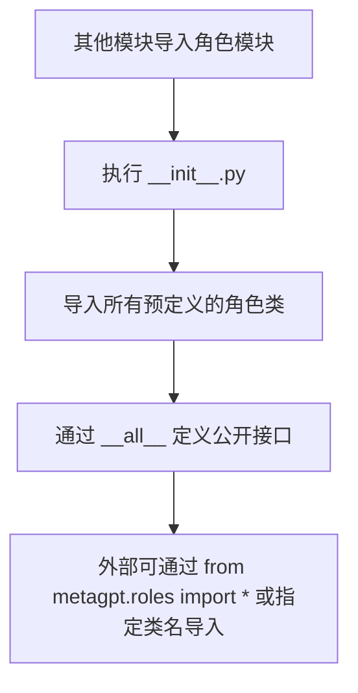

# `.\MetaGPT\metagpt\roles\__init__.py` 详细设计文档

该文件是 MetaGPT 项目中角色（Role）模块的包初始化文件，其主要功能是集中导入并导出项目中定义的各种角色类，为其他模块提供统一的角色类访问入口。

## 整体流程



## 类结构

```
Role (基类)
├── Architect
├── ProjectManager
├── ProductManager
├── Engineer
├── QaEngineer
├── Searcher
├── Sales
├── DataAnalyst (位于 di 子包)
├── TeamLeader (位于 di 子包)
└── Engineer2 (位于 di 子包)
```

## 全局变量及字段


### `__all__`
    
一个字符串列表，定义了此模块公开导出的类名，用于控制`from module import *`时的行为。

类型：`List[str]`
    


    

## 全局函数及方法


## 关键组件


### Role

基础角色类，定义了所有具体角色的通用属性和行为。

### Architect

架构师角色，负责系统架构设计和技术选型。

### ProjectManager

项目经理角色，负责项目规划、进度管理和团队协调。

### ProductManager

产品经理角色，负责产品需求分析、功能定义和优先级排序。

### Engineer

工程师角色，负责具体的代码实现和功能开发。

### QaEngineer

质量保证工程师角色，负责测试用例设计、执行和软件质量保障。

### Searcher

搜索者角色，负责信息检索和知识获取。

### Sales

销售角色，负责市场推广和客户沟通。

### DataAnalyst

数据分析师角色，负责数据处理、分析和洞察提取。

### TeamLeader

团队领导角色，负责团队管理和任务分配。

### Engineer2

工程师2角色，是另一种工程师角色的实现，可能具有不同的职责或行为模式。


## 问题及建议


### 已知问题

-   **模块导入路径不一致**：代码中同时导入了 `metagpt.roles.di.data_analyst` 和 `metagpt.roles.di.engineer2`，这表明项目可能存在两种不同的角色组织方式或命名约定（例如，`di` 子目录下的角色与其他角色并列），这可能导致代码结构混乱和理解成本增加。
-   **潜在的循环依赖风险**：`__init__.py` 文件通常用于简化导入，但如果被导入的模块（如 `Role`）又反向导入了当前包中的其他模块，可能会引发循环导入错误。当前代码结构需要检查各角色类之间是否存在此类依赖。
-   **缺乏明确的版本或模块说明**：文件头部虽然有基础信息，但缺少关于此 `roles` 包的整体职责、包含的角色类型分类等文档，不利于新开发者快速理解模块结构。
-   **`Engineer` 与 `Engineer2` 并存**：同时导出 `Engineer` 和 `Engineer2` 可能表示存在两种工程师角色的实现，这容易造成使用者的困惑，不清楚在何种场景下应该使用哪一个。

### 优化建议

-   **统一模块组织与命名规范**：建议重新审视项目结构，统一角色的存放路径和命名方式。例如，将所有角色类都放在 `metagpt.roles` 目录下，或者都放在 `metagpt.roles.di` 子目录下，并采用一致的命名规则（如避免使用 `Engineer2` 这样的名称）。
-   **添加包级别文档字符串**：在 `__init__.py` 文件顶部添加详细的模块文档字符串（docstring），说明这个 `roles` 包的目的、包含的主要角色类别以及它们的基本职责，提升代码的可读性和可维护性。
-   **明确角色职责与使用场景**：如果 `Engineer` 和 `Engineer2` 必须共存，应在文档或代码注释中明确区分两者的设计目的、功能差异以及适用场景，引导用户正确选择。
-   **考虑使用动态导入或延迟导入**：如果角色类数量众多或初始化成本高，可以考虑在 `__init__.py` 中使用动态导入（例如在 `__all__` 中定义名称，在实际使用时再导入模块），以减少脚本启动时的加载时间和内存占用，并可能缓解复杂的依赖关系。
-   **建立角色注册机制**：对于大型或需要灵活扩展的角色系统，可以考虑实现一个角色注册表（Registry）模式。在 `__init__.py` 中维护一个从角色名称到角色类的映射，而不是直接导出所有类。这样可以更灵活地管理角色的发现、加载和实例化。


## 其它


### 设计目标与约束

本模块是MetaGPT框架的角色（Role）包入口，其核心设计目标是提供一个统一、可扩展的角色类导入与导出点，方便框架其他部分引用预定义的各种角色类型。主要约束包括：1) 保持向后兼容性，确保`__all__`列表中的导出项稳定；2) 作为初始化文件，其本身不包含业务逻辑，仅负责聚合和暴露子模块中的类；3) 依赖关系清晰，所有导入均来自`metagpt.roles`或其子包。

### 错误处理与异常设计

由于本文件是纯粹的导入聚合文件，不包含自定义的业务逻辑、函数或类定义，因此没有特定的错误处理或异常设计。任何导入错误（如模块不存在、类未定义）将直接抛出Python标准的`ImportError`或`ModuleNotFoundError`，这属于上游模块的职责。使用本模块的代码应妥善处理这些潜在的导入异常。

### 数据流与状态机

本模块不涉及具体的数据处理流程或状态管理。它仅在Python解释器加载`metagpt.roles`包时执行一次，将指定的角色类加载到当前命名空间。其“数据流”即Python的模块导入机制，没有内部状态转换。

### 外部依赖与接口契约

1.  **内部依赖**：强依赖于`metagpt.roles`包下的各个子模块（如`role`, `architect`, `project_manager`等）。这些子模块必须存在且定义了相应的类。
2.  **接口契约**：通过`__all__`变量明确声明了对外公开的接口（即类名）。外部代码通过`from metagpt.roles import ...`语句引入这些类时，应仅依赖`__all__`中列出的名称。本文件承诺导出这些名称所对应的类对象。
3.  **无外部服务或第三方库依赖**。

### 配置管理与环境变量

本模块不直接读取任何配置文件或环境变量。角色的具体配置和行为应由各个角色类自身或其使用的工具、动作来管理。

### 安全考量

本模块作为代码组织的一部分，不直接处理用户输入、网络请求或敏感数据，因此没有直接的安全风险。安全责任在于具体角色类实现和它们所执行的操作。

### 部署与运维考量

无特殊部署要求。作为源代码的一部分，随整个MetaGPT项目部署。在运维层面，需确保所有导入的源文件（如`architect.py`, `engineer.py`等）与`__init__.py`一同存在且可读。

### 测试策略

本模块的测试通常作为上层测试的一部分。单独的单元测试可能包括验证`__all__`列表中的每个条目是否能被成功导入，例如：
```python
def test_role_exports():
    import metagpt.roles
    for name in metagpt.roles.__all__:
        assert hasattr(metagpt.roles, name), f"{name} not found in module"
        cls = getattr(metagpt.roles, name)
        assert isinstance(cls, type), f"{name} is not a class"
```
测试应确保导入不会引发异常。

### 扩展与维护指南

1.  **添加新角色**：在`metagpt.roles`包或适当子包下创建新的角色类文件（如`new_role.py`），并确保该类被正确定义。然后，在本文件的导入部分添加`from metagpt.roles.new_role import NewRole`，并将`"NewRole"`字符串添加到`__all__`列表中。
2.  **删除或重命名角色**：从导入语句和`__all__`列表中移除对应项。注意，这属于破坏性变更，需要评估对下游代码的影响并更新相关文档。
3.  **维护**：定期检查导入语句，确保路径与项目结构保持一致。保持`__all__`列表的整洁和准确，它是模块公共API的权威声明。

    