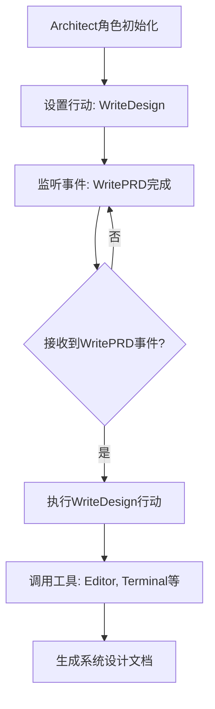
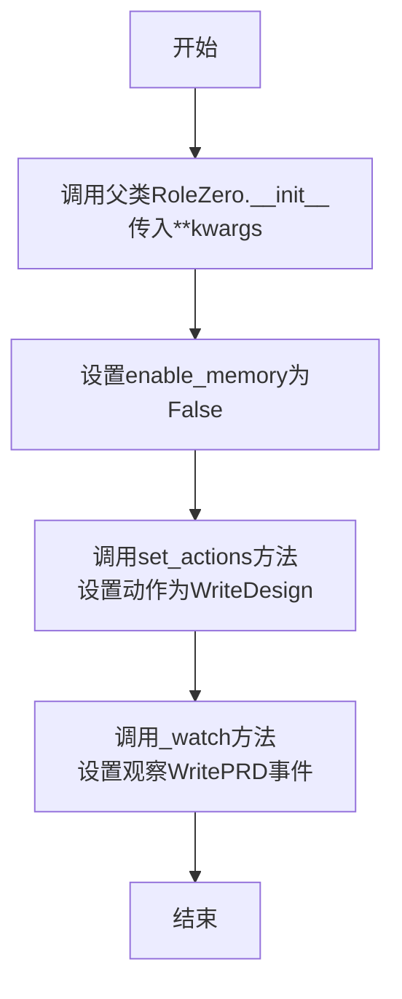
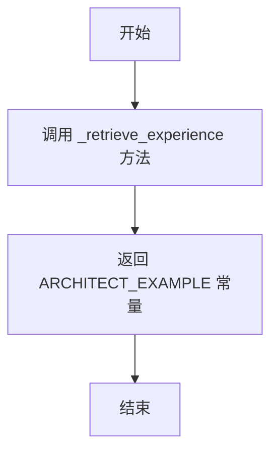
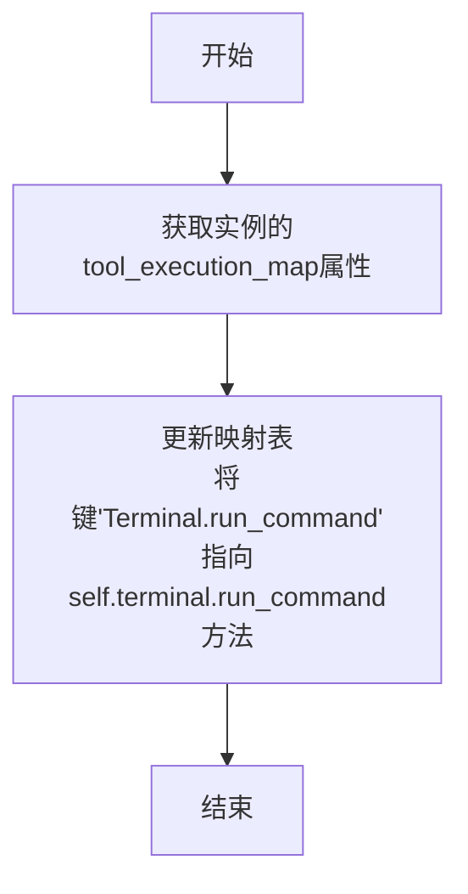

# `.\MetaGPT\metagpt\roles\architect.py` 详细设计文档

该文件定义了一个名为Architect的类，它继承自RoleZero，代表软件开发流程中的架构师角色。其核心功能是接收产品需求文档（PRD），并基于此设计一个简洁、可用、完整的软件系统架构。它通过特定的行动（如WriteDesign）和工具（如编辑器、终端命令执行）来实现设计目标，并遵循给定的约束条件（如使用合适的开源库）。

## 整体流程



## 类结构

```
RoleZero (父类)
└── Architect (架构师角色)
    ├── 继承的字段和方法
    ├── 新增字段: terminal, instruction, tools等
    ├── 新增方法: __init__, _retrieve_experience, _update_tool_execution
    └── 重写/扩展的行为和观察事件
```

## 全局变量及字段


### `Architect.name`
    
架构师角色的名称，默认值为'Bob'。

类型：`str`
    


### `Architect.profile`
    
角色描述，标识该角色为'Architect'。

类型：`str`
    


### `Architect.goal`
    
架构师的主要目标，即设计一个简洁、可用、完整的软件系统并输出系统设计。

类型：`str`
    


### `Architect.constraints`
    
架构师在设计过程中需要遵循的约束条件，包括确保架构足够简单、使用合适的开源库以及使用与用户需求相同的语言。

类型：`str`
    


### `Architect.terminal`
    
终端工具实例，用于执行命令行操作，通过Field配置默认工厂函数并排除在序列化之外。

类型：`Terminal`
    


### `Architect.instruction`
    
架构师的指令，来源于预定义的ARCHITECT_INSTRUCTION常量。

类型：`str`
    


### `Architect.tools`
    
架构师可使用的工具列表，包括编辑器、RoleZero和终端命令执行功能。

类型：`list[str]`
    
    

## 全局函数及方法

### `Architect.__init__`

该方法用于初始化Architect角色实例，继承自RoleZero类，并设置Architect特有的属性、动作和观察事件。

参数：

- `**kwargs`：`dict`，可变关键字参数，用于传递给父类RoleZero的初始化方法

返回值：`None`，无返回值

#### 流程图



#### 带注释源码

```python
def __init__(self, **kwargs) -> None:
    # 调用父类RoleZero的初始化方法，传入所有关键字参数
    super().__init__(**kwargs)

    # 设置内存启用标志为False
    # 注意：只有当self.use_fixed_sop改为True时，此设置才会生效
    self.enable_memory = False
    # 初始化Architect角色特有的动作：WriteDesign
    self.set_actions([WriteDesign])

    # 设置Architect角色应观察或关注的事件：WritePRD
    self._watch({WritePRD})
```

### `Architect._retrieve_experience`

该方法用于检索并返回架构师角色的预设经验示例。它不执行复杂的逻辑或计算，仅作为数据访问层，返回一个预定义的常量字符串，该字符串包含了架构设计相关的示例或模板，用于指导或初始化设计过程。

参数：
-  `self`：`Architect`，`Architect` 类的实例，用于访问类属性和方法。

返回值：`str`，返回一个预定义的架构设计示例字符串，内容由 `ARCHITECT_EXAMPLE` 常量提供。

#### 流程图



#### 带注释源码

```python
def _retrieve_experience(self) -> str:
    # 该方法直接返回一个预定义的架构设计示例字符串。
    # 这个示例通常包含设计模式、系统架构模板或最佳实践，
    # 用于在架构设计过程中提供参考和指导。
    # 返回值类型为字符串。
    return ARCHITECT_EXAMPLE
```


### `Architect._update_tool_execution`

该方法用于更新`Architect`角色实例的工具执行映射表（`tool_execution_map`），将特定的工具名称（`"Terminal.run_command"`）与对应的可执行方法（`self.terminal.run_command`）进行绑定。这确保了当工作流中需要调用终端命令时，能够正确地找到并执行`Terminal`实例的`run_command`方法。

参数：
-  `self`：`Architect`，当前`Architect`类的实例。

返回值：`None`，此方法不返回任何值，其作用在于修改实例的内部状态。

#### 流程图



#### 带注释源码

```python
def _update_tool_execution(self):
    # 更新实例的 tool_execution_map 字典。
    # 将工具名 "Terminal.run_command" 映射到 self.terminal 对象的 run_command 方法。
    # 这使得在后续的流程中，当需要执行名为 "Terminal.run_command" 的工具时，
    # 可以直接调用 self.terminal.run_command 来完成实际的操作。
    self.tool_execution_map.update({"Terminal.run_command": self.terminal.run_command})
```


## 关键组件


### RoleZero 基类

作为所有角色的基础类，提供了角色运行的核心框架，包括动作管理、观察机制和工具执行映射。

### 动作 (Actions)

定义了角色可以执行的具体操作，例如 `WriteDesign` 用于生成系统设计，`WritePRD` 用于生成产品需求文档。

### 工具 (Tools)

定义了角色可以调用的外部工具集合，例如 `Editor` 用于文件读写和搜索，`Terminal` 用于执行系统命令。

### 提示词 (Prompts)

包含指导角色行为的指令和示例，例如 `ARCHITECT_INSTRUCTION` 和 `ARCHITECT_EXAMPLE`，用于引导架构师生成符合要求的系统设计。

### 终端工具 (Terminal Tool)

一个具体的工具实现，通过 `run_command` 方法允许角色在系统终端中执行命令，扩展了角色的自动化能力。

### 观察机制 (Watch Mechanism)

允许角色订阅并响应特定事件或动作的完成，例如 `Architect` 角色观察 `WritePRD` 动作，以便在其完成后触发设计工作。


## 问题及建议


### 已知问题

-   **工具列表定义不明确**：`tools` 字段被定义为 `list[str]` 类型，但其内容（如 `"Editor:write,read,similarity_search"`）更像是工具及其方法的描述字符串，而非可直接使用的工具对象或标识符。这可能导致运行时需要额外的解析逻辑，增加了复杂性和出错风险。
-   **职责分离不清晰**：`Architect` 类直接继承了 `RoleZero` 并管理 `Terminal` 工具的执行映射（`_update_tool_execution`）。这混合了角色定义（`Architect`）与底层工具执行逻辑的配置，违反了单一职责原则，使得 `Architect` 类的核心职责（架构设计）不够聚焦。
-   **硬编码的初始化逻辑**：在 `__init__` 方法中，`enable_memory` 被硬编码设置为 `False`，并且注释提到这仅在 `self.use_fixed_sop` 为 `True` 时有效。这种条件逻辑内嵌在初始化中，缺乏灵活性，且依赖未在类定义中明确说明的父类或外部状态（`use_fixed_sop`），使得代码行为难以预测和维护。
-   **潜在的循环依赖风险**：`Architect` 类从 `metagpt.roles.di.role_zero` 导入 `RoleZero`，同时 `tools` 列表中又包含了 `"RoleZero"` 字符串。这可能暗示着一种自引用或循环依赖关系，需要仔细审查其设计意图和实际运行时行为，以避免逻辑混乱。

### 优化建议

-   **重构工具定义**：建议将 `tools` 字段的类型从 `list[str]` 更改为一个更结构化的形式，例如 `List[Union[Tool, ToolDescriptor]]`，其中 `ToolDescriptor` 可以是一个 Pydantic 模型，包含 `name` 和 `methods` 等字段。这样可以提供类型安全、更好的 IDE 支持，并消除运行时字符串解析的需要。
-   **分离关注点**：考虑将工具执行映射的逻辑（`_update_tool_execution`）上移到基类 `RoleZero` 或一个专门的 `ToolManager` 类中。`Architect` 类应只声明它需要哪些工具，而不关心这些工具如何被绑定和执行。这符合单一职责原则，并使 `Architect` 的代码更清晰、更易于测试。
-   **配置化初始化参数**：将 `enable_memory` 等控制逻辑的初始化值作为构造函数的参数（或通过 Pydantic 的 `Field` 提供默认值），而不是在 `__init__` 方法中硬编码。同时，明确 `use_fixed_sop` 等依赖状态的定义和影响范围。这提高了类的可配置性和可测试性。
-   **明确依赖关系**：审查并澄清 `tools` 列表中 `"RoleZero"` 的含义。如果它代表一种特殊能力或工具，应重命名为更具描述性的名称（如 `"RoleZeroExecutor"` 或 `"MetaTool"`），并确保其实现不会造成循环导入或逻辑上的无限递归。在文档中明确说明其用途。
-   **增强类型注解与文档**：为 `_update_tool_execution` 等方法添加返回类型注解（如 `-> None`）。同时，在类文档字符串中更详细地说明 `constraints`、`instruction` 等字段如何影响架构师的行为，以及 `_retrieve_experience` 方法返回的 `ARCHITECT_EXAMPLE` 在设计中扮演的具体角色（例如，是作为示例参考还是约束条件）。


## 其它


### 设计目标与约束

本模块旨在实现一个“架构师”角色，其核心设计目标是根据产品需求文档（PRD）生成系统架构设计。主要约束包括：架构需简洁、可用、完整，优先使用合适的开源库，输出语言需与用户需求一致。角色通过预定义的指令和示例来引导设计过程，并集成了代码编辑、终端命令执行等工具以支持设计任务的执行。

### 错误处理与异常设计

当前代码未显式定义错误处理逻辑。`Terminal.run_command` 方法的执行可能因命令不存在或执行失败而抛出异常，这些异常会向上传播到调用 `Architect` 角色的执行流程中。`WriteDesign` 等动作的执行错误也依赖于其内部实现或上层框架的异常处理机制。建议在 `_update_tool_execution` 方法或工具调用处增加异常捕获和日志记录，以提高系统的健壮性和可调试性。

### 数据流与状态机

数据流始于外部触发的 `WritePRD` 动作完成事件。`Architect` 角色监听到此事件后，激活其 `WriteDesign` 动作。`WriteDesign` 动作利用角色的记忆（当前禁用）、指令（`ARCHITECT_INSTRUCTION`）和示例（`ARCHITECT_EXAMPLE`）作为上下文，可能调用集成的工具（如 `Editor`、`Terminal`）来生成系统设计文档。角色本身没有复杂的状态变迁，主要作为动作执行和事件响应的容器。

### 外部依赖与接口契约

1.  **内部依赖**:
    *   `metagpt.actions.design_api.WriteDesign`: 核心设计动作，负责生成设计文档。
    *   `metagpt.actions.write_prd.WritePRD`: 被监视的动作，其完成是触发 `Architect` 工作的信号。
    *   `metagpt.roles.di.role_zero.RoleZero`: 父类，提供了角色行为的基本框架。
    *   `metagpt.tools.libs.terminal.Terminal`: 工具类，用于执行系统命令。
    *   `metagpt.prompts.di.architect.ARCHITECT_EXAMPLE`, `ARCHITECT_INSTRUCTION`: 提供提示词和示例。

2.  **接口契约**:
    *   `_watch({WritePRD})`: 定义了角色对 `WritePRD` 动作完成事件的依赖。
    *   `set_actions([WriteDesign])`: 定义了角色执行的核心动作。
    *   `tool_execution_map`: 定义了工具名称（如 `"Terminal.run_command"`）到实际可调用方法（`self.terminal.run_command`）的映射，这是角色与工具集成的关键契约。

### 配置与初始化

角色通过 `__init__` 方法进行初始化，关键配置包括：禁用记忆 (`enable_memory = False`)、设置默认动作 (`WriteDesign`)、订阅 `WritePRD` 事件。`terminal` 字段使用 `default_factory` 确保每个实例拥有独立的 `Terminal` 对象。`instruction` 和 `tools` 等字段在类定义时静态配置，定义了角色的行为和能力范围。`use_fixed_sop` 状态（当前未使用）暗示了未来可能支持更结构化的工作流程。

### 安全考虑

集成 `Terminal` 工具执行任意命令 (`run_command`) 存在显著的安全风险，恶意或错误的命令可能导致系统破坏或数据泄露。当前实现未对可执行的命令范围进行限制或过滤。建议实施安全策略，如：命令白名单、参数校验、在沙箱环境中执行命令，或仅允许在高度受控的上下文中启用此功能。

    