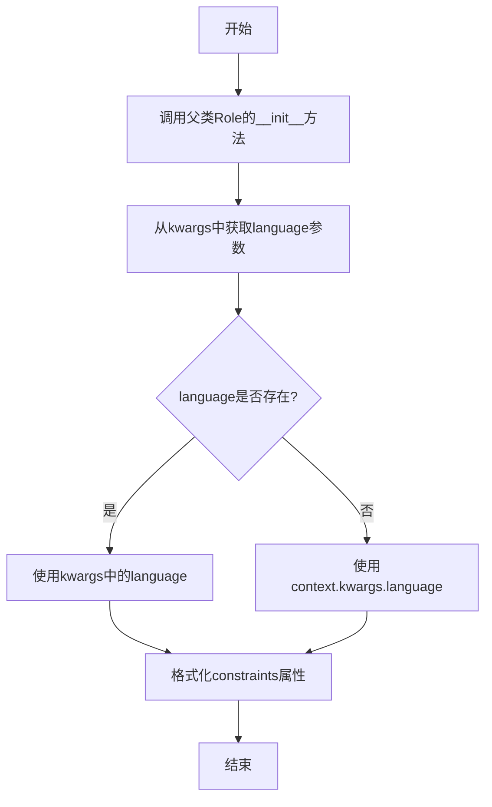
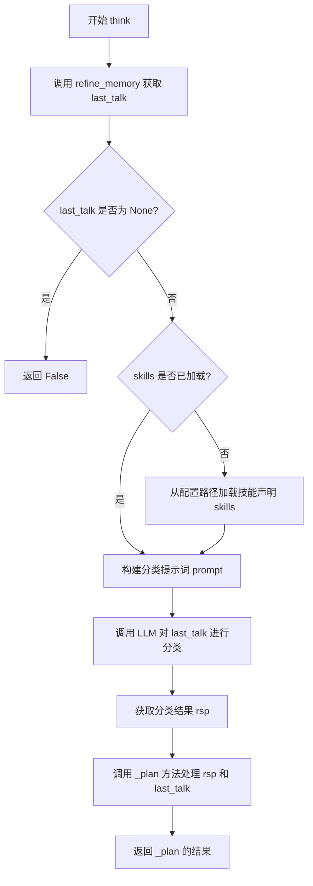
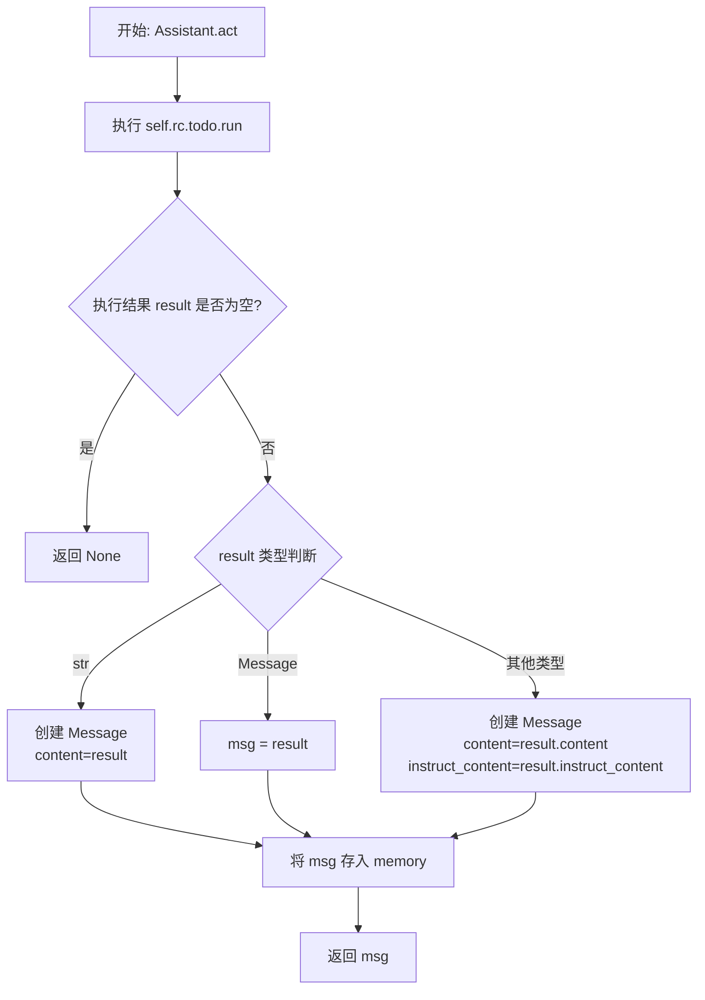
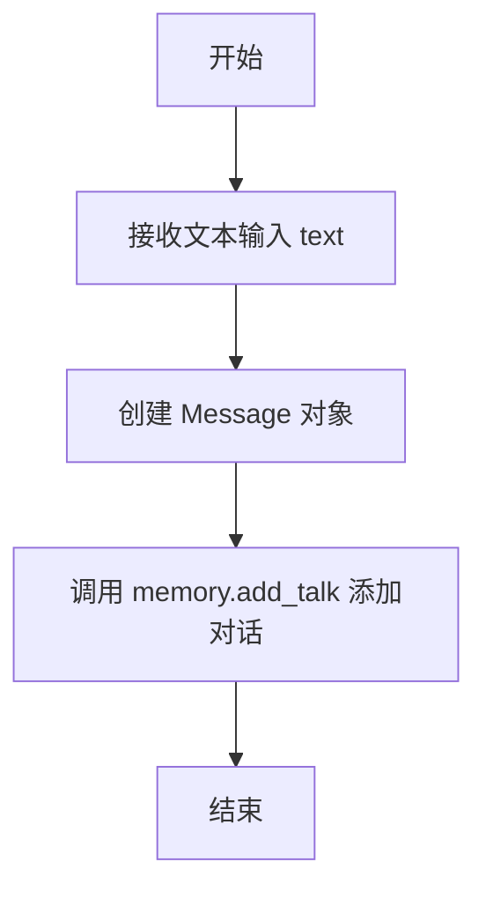
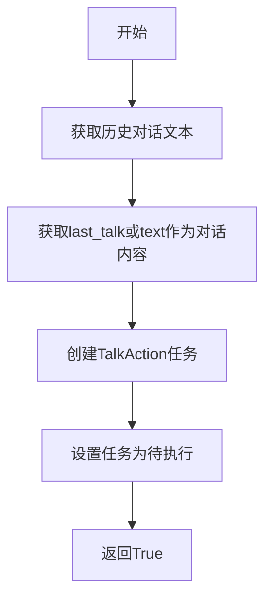
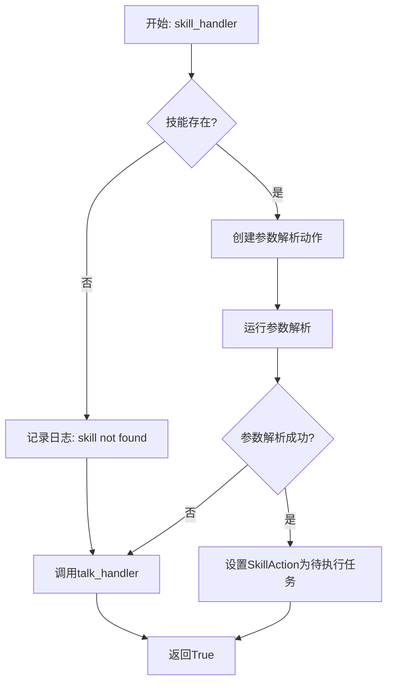
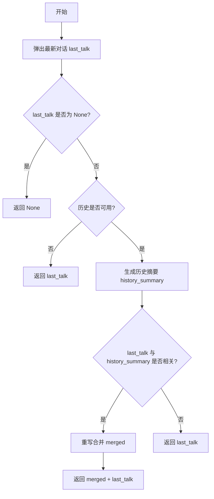

# `.\MetaGPT\metagpt\roles\assistant.py` 详细设计文档

该文件定义了一个基于UML活动图中'fork'节点概念的元角色（Assistant），它能够根据配置文件在运行时动态生成和执行不同的角色行为。核心功能是作为一个智能助手，通过解析用户输入，将其分类为'对话'或'技能'请求，并相应地调度TalkAction（对话处理）或SkillAction（技能执行）来解决问题。它集成了记忆管理（BrainMemory）和技能声明（SkillsDeclaration），支持上下文感知、历史总结和相关内容合并，以实现连贯的多轮交互。

## 整体流程

```mermaid
graph TD
    A[开始: Assistant启动] --> B[接收用户输入/消息]
    B --> C{调用think方法进行推理}
    C --> D[refine_memory: 处理记忆，获取last_talk]
    D --> E{last_talk存在?}
    E -- 否 --> F[返回False，停止推理]
    E -- 是 --> G[加载技能声明SkillsDeclaration]
    G --> H[构造分类提示词，调用LLM]
    H --> I[LLM返回分类结果rsp]
    I --> J[_plan: 根据rsp分类调度]
    J --> K{分类是TALK还是SKILL?}
    K -- TALK --> L[talk_handler: 设置Todo为TalkAction]
    K -- SKILL --> M[skill_handler: 查找并验证技能]
    M --> N{技能存在且参数解析成功?}
    N -- 是 --> O[设置Todo为SkillAction]
    N -- 否 --> P[回退到talk_handler]
    L --> Q[返回True，推理完成]
    O --> Q
    P --> Q
    Q --> R[调用act方法执行行动]
    R --> S[运行rc.todo.run()]
    S --> T{执行结果result}
    T -- 无结果 --> U[返回None]
    T -- 有结果 --> V[封装为Message]
    V --> W[memory.add_answer 记录回答]
    W --> X[返回Message，完成单轮交互]
```

## 类结构

```
Assistant (继承自Role)
├── 类字段:
│   ├── name: str
│   ├── profile: str
│   ├── goal: str
│   ├── constraints: str
│   ├── desc: str
│   ├── memory: BrainMemory
│   └── skills: Optional[SkillsDeclaration]
├── 类方法:
│   ├── __init__
│   ├── think
│   ├── act
│   ├── talk
│   ├── _plan
│   ├── talk_handler
│   ├── skill_handler
│   ├── refine_memory
│   ├── get_memory
│   └── load_memory
```

## 全局变量及字段


### `Assistant.name`
    
角色的名称，默认为'Lily'，用于标识该助手实例。

类型：`str`
    


### `Assistant.profile`
    
角色的简要描述，默认为'An assistant'，用于说明角色的基本身份。

类型：`str`
    


### `Assistant.goal`
    
角色的目标，默认为'Help to solve problem'，定义了助手的主要任务。

类型：`str`
    


### `Assistant.constraints`
    
角色的约束条件，默认为'Talk in {language}'，用于指定交互时的语言限制。

类型：`str`
    


### `Assistant.desc`
    
角色的详细描述，默认为空字符串，可用于提供更详细的角色背景信息。

类型：`str`
    


### `Assistant.memory`
    
角色的记忆存储对象，用于存储对话历史、知识和上下文信息。

类型：`BrainMemory`
    


### `Assistant.skills`
    
角色的技能声明对象，用于定义和管理助手可执行的技能集合。

类型：`Optional[SkillsDeclaration]`
    
    

## 全局函数及方法

### `Assistant.__init__`

该方法用于初始化`Assistant`类的实例，继承自`Role`类，并设置`constraints`属性中的语言参数。

参数：

- `kwargs`：`dict`，包含传递给父类`Role`的初始化参数，以及可选的`language`参数用于设置`constraints`中的语言。

返回值：`None`，无返回值。

#### 流程图



#### 带注释源码

```python
def __init__(self, **kwargs):
    # 调用父类Role的初始化方法，传递所有关键字参数
    super().__init__(**kwargs)
    # 从kwargs中获取language参数，如果不存在则从context.kwargs.language获取
    language = kwargs.get("language") or self.context.kwargs.language
    # 使用获取到的language格式化constraints属性
    self.constraints = self.constraints.format(language=language)
```

### `Assistant.think`

`Assistant.think` 方法是 `Assistant` 角色的核心推理引擎。它首先通过 `refine_memory` 方法从内存中获取并可能合并最新的用户输入（`last_talk`）。然后，它加载技能配置文件（如果尚未加载），并构建一个提示词（`prompt`）来引导大语言模型（LLM）对 `last_talk` 进行分类：判断用户意图是触发一个预定义的技能（`[SKILL]`）还是进行普通对话（`[TALK]`）。根据LLM的分类结果，该方法调用 `_plan` 方法来分派到相应的处理器（`talk_handler` 或 `skill_handler`），从而为角色设置下一步要执行的具体动作（`self.rc.todo`）。该方法返回一个布尔值，指示推理和计划是否成功，从而决定角色是否可以进入 `act` 阶段。

参数：
-  `self`：`Assistant` 类型，`Assistant` 类的一个实例。

返回值：`bool`，返回 `True` 表示成功完成思考并为角色设置了待执行动作（`self.rc.todo`）；返回 `False` 表示无法继续推理（例如，内存中没有新的用户输入）。

#### 流程图



#### 带注释源码

```python
async def think(self) -> bool:
    """Everything will be done part by part."""
    # 1. 从内存中获取并精炼最新的用户对话内容
    last_talk = await self.refine_memory()
    # 如果没有新的对话内容，则无法继续推理
    if not last_talk:
        return False
    # 2. 如果技能声明尚未加载，则从配置文件中加载
    if not self.skills:
        skill_path = Path(self.context.kwargs.SKILL_PATH) if self.context.kwargs.SKILL_PATH else None
        self.skills = await SkillsDeclaration.load(skill_yaml_file_name=skill_path)

    # 3. 构建用于引导LLM对用户意图进行分类的提示词
    prompt = ""
    # 获取当前上下文中可用的技能列表
    skills = self.skills.get_skill_list(context=self.context)
    for desc, name in skills.items():
        # 为每个技能添加一条分类规则
        prompt += f"If the text explicitly want you to {desc}, return `[SKILL]: {name}` brief and clear. For instance: [SKILL]: {name}\n"
    # 添加默认的对话分类规则
    prompt += 'Otherwise, return `[TALK]: {talk}` brief and clear. For instance: if {talk} is "xxxx" return [TALK]: xxxx\n\n'
    # 将具体的用户输入放入提示词
    prompt += f"Now what specific action is explicitly mentioned in the text: {last_talk}\n"
    
    # 4. 调用大语言模型（LLM）对用户输入进行分类
    rsp = await self.llm.aask(prompt, ["You are an action classifier"], stream=False)
    # 记录日志，便于调试
    logger.info(f"THINK: {prompt}\n, THINK RESULT: {rsp}\n")
    
    # 5. 根据LLM的分类结果，制定具体的执行计划
    return await self._plan(rsp, last_talk=last_talk)
```

### `Assistant.act`

该方法负责执行当前角色待办事项（`self.rc.todo`）所指定的动作，并将执行结果封装为消息（`Message`）对象存入记忆（`memory`）中，最后返回该消息。如果待办事项执行无结果，则返回 `None`。

参数：
- 无显式参数。该方法通过 `self` 访问实例的运行时上下文（`self.rc`）和记忆（`self.memory`）。

返回值：`Message` 或 `None`，返回封装了动作执行结果的消息对象，如果动作执行无结果则返回 `None`。

#### 流程图



#### 带注释源码

```python
async def act(self) -> Message:
    # 1. 执行当前角色待办事项（self.rc.todo）中定义的动作，并获取结果。
    result = await self.rc.todo.run()
    # 2. 如果动作执行没有返回结果，则直接返回 None。
    if not result:
        return None
    # 3. 根据动作执行结果的类型，将其封装为标准的 Message 消息对象。
    if isinstance(result, str):
        # 3.1 如果结果是字符串，则以此字符串作为消息内容创建 Message。
        msg = Message(content=result, role="assistant", cause_by=self.rc.todo)
    elif isinstance(result, Message):
        # 3.2 如果结果本身已经是 Message 对象，则直接使用它。
        msg = result
    else:
        # 3.3 如果结果是其他类型（例如某些 Action 的自定义输出对象），则尝试提取其 content 和 instruct_content 属性来创建 Message。
        msg = Message(content=result.content, instruct_content=result.instruct_content, cause_by=type(self.rc.todo))
    # 4. 将封装好的消息对象添加到角色的记忆（BrainMemory）中，作为一次“回答”记录。
    self.memory.add_answer(msg)
    # 5. 返回该消息对象，通常用于后续的通信或日志记录。
    return msg
```

### `Assistant.talk`

该方法用于接收用户的文本输入，并将其作为对话内容添加到助手的记忆中，以便后续处理。

参数：

- `text`：`str`，用户输入的文本内容

返回值：`None`，无返回值

#### 流程图



#### 带注释源码

```python
async def talk(self, text):
    # 将用户输入的文本包装成 Message 对象，并添加到记忆中的对话列表
    self.memory.add_talk(Message(content=text))
```

### `Assistant._plan`

该方法根据LLM对用户输入的分类结果（`rsp`），选择并执行对应的处理程序（`talk_handler`或`skill_handler`）。它通过解析`rsp`字符串来识别意图是进行普通对话（`[TALK]`）还是执行特定技能（`[SKILL]`），然后调用相应的处理函数来设置下一步要执行的动作（`self.rc.todo`）。如果解析出的技能标识无法识别，则默认回退到对话处理。

参数：

- `rsp`：`str`，LLM对用户意图进行分类后返回的字符串，格式应为`[TALK]: {text}`或`[SKILL]: {skill_name}`。
- `**kwargs`：`dict`，可变关键字参数，用于向处理程序传递额外的上下文信息，例如`last_talk`（原始用户输入）。

返回值：`bool`，表示计划是否成功设置。返回`True`表示成功设置了`self.rc.todo`（即下一步要执行的动作），返回`False`通常表示处理过程中出现了错误（尽管在当前实现中，所有分支都返回`True`或调用返回`True`的处理程序）。

#### 流程图

```mermaid
graph TD
    A[开始: _plan(rsp, **kwargs)] --> B{解析rsp字符串};
    B --> C[提取skill和text];
    C --> D{skill是否为有效键?};
    D -- 是 --> E[从handlers字典获取对应handler];
    D -- 否 --> F[使用默认talk_handler];
    E --> G[调用handler(text, **kwargs)];
    F --> G;
    G --> H[返回handler的执行结果];
    H --> I[结束];
```

#### 带注释源码

```python
async def _plan(self, rsp: str, **kwargs) -> bool:
    """
    核心计划方法。根据LLM的分类响应（rsp）来决定下一步是进行对话还是执行技能。
    1. 从rsp中解析出动作类型（skill）和内容（text）。
    2. 根据动作类型选择对应的处理器（handler）。
    3. 调用处理器，由处理器负责设置具体的待执行动作（self.rc.todo）。
    Args:
        rsp: LLM的响应字符串，格式应为 '[TYPE]: content'。
        **kwargs: 额外的上下文参数，通常会包含'last_talk'（原始用户输入）。
    Returns:
        bool: 表示计划是否成功设置。True表示成功。
    """
    # 使用BrainMemory的工具方法从rsp字符串中提取信息。
    # 预期rsp格式为 '[SKILL]: skill_name' 或 '[TALK]: message'。
    # 返回的skill是'TALK'或'SKILL'，text是对应的内容。
    skill, text = BrainMemory.extract_info(input_string=rsp)

    # 定义处理器映射字典。键是MessageType枚举的值（字符串），值是对应的异步方法。
    handlers = {
        MessageType.Talk.value: self.talk_handler,  # 处理普通对话
        MessageType.Skill.value: self.skill_handler, # 处理技能执行
    }

    # 根据解析出的skill键获取对应的处理器。如果skill不在handlers中（例如解析失败或未知类型），则默认使用talk_handler。
    handler = handlers.get(skill, self.talk_handler)

    # 调用选定的处理器，传入解析出的text和所有额外的关键字参数。
    # 处理器内部会设置self.rc.todo，并返回一个布尔值表示是否成功。
    return await handler(text, **kwargs)
```

### `Assistant.talk_handler`

该方法用于处理用户输入的文本消息，将其转换为一个`TalkAction`任务，并设置为当前待执行的任务。它主要处理普通的对话场景，将用户输入作为对话内容，结合历史对话和知识库生成回复。

参数：

- `text`：`str`，用户输入的文本消息或经过分类处理后的文本内容。
- `**kwargs`：`dict`，可变关键字参数，用于传递额外的上下文信息，如`last_talk`（上一次对话内容）。

返回值：`bool`，返回`True`表示成功设置了待执行的任务。

#### 流程图



#### 带注释源码

```python
async def talk_handler(self, text, **kwargs) -> bool:
    # 获取历史对话文本，用于上下文理解
    history = self.memory.history_text
    # 优先使用kwargs中的last_talk作为对话内容，否则使用传入的text
    text = kwargs.get("last_talk") or text
    # 创建TalkAction任务，传入对话内容、知识库、历史摘要和语言模型
    self.set_todo(
        TalkAction(i_context=text, knowledge=self.memory.get_knowledge(), history_summary=history, llm=self.llm)
    )
    # 返回True表示任务设置成功
    return True
```

### `Assistant.skill_handler`

该方法用于处理用户请求中识别出的技能调用。它会根据技能名称查找对应的技能配置，如果找到则解析用户输入以获取技能参数，并设置相应的技能动作为待执行任务；如果未找到技能或参数解析失败，则回退到对话处理模式。

参数：

- `text`：`str`，从用户输入中提取出的技能名称或标识符。
- `kwargs`：`dict`，可选的关键字参数，其中包含`last_talk`（原始用户输入文本）等信息。

返回值：`bool`，返回`True`表示成功设置了技能动作或回退到对话处理；理论上应始终返回`True`，除非发生未处理的异常。

#### 流程图



#### 带注释源码

```python
async def skill_handler(self, text, **kwargs) -> bool:
    # 从关键字参数中获取原始的、完整的用户输入
    last_talk = kwargs.get("last_talk")
    # 根据传入的技能名称（text）从技能声明中查找具体的技能对象
    skill = self.skills.get_skill(text)
    # 如果未找到对应的技能配置
    if not skill:
        # 记录未找到技能的日志信息
        logger.info(f"skill not found: {text}")
        # 回退到对话处理模式，将原始用户输入传递给talk_handler
        return await self.talk_handler(text=last_talk, **kwargs)
    # 创建参数解析动作，传入技能定义、LLM和原始用户输入
    action = ArgumentsParingAction(skill=skill, llm=self.llm, ask=last_talk)
    # 运行参数解析动作，尝试从用户输入中提取技能所需的参数
    await action.run(**kwargs)
    # 如果参数解析失败（未能提取出有效参数）
    if action.args is None:
        # 回退到对话处理模式
        return await self.talk_handler(text=last_talk, **kwargs)
    # 参数解析成功，创建一个SkillAction作为待执行任务
    # 传入技能定义、解析出的参数、LLM、技能名称和描述
    self.set_todo(SkillAction(skill=skill, args=action.args, llm=self.llm, name=skill.name, desc=skill.description))
    # 返回True，表示处理流程成功设置或回退
    return True
```

### `Assistant.refine_memory`

该方法用于优化和提炼内存中的对话历史。它首先检查是否有最新的用户对话，如果没有则返回None。如果有历史对话可用，它会尝试对历史进行摘要，并判断最新对话是否与历史摘要相关。如果相关，则通过重写将最新对话与历史摘要合并，以生成更连贯的上下文；如果不相关，则直接返回最新对话内容。

参数：

-  `self`：`Assistant`，Assistant类的实例，用于访问内存和其他实例方法。

返回值：`Optional[str]`，返回优化后的最新对话内容字符串，如果没有最新对话则返回None。

#### 流程图



#### 带注释源码

```python
async def refine_memory(self) -> str:
    # 从内存中弹出最新的用户对话
    last_talk = self.memory.pop_last_talk()
    # 如果没有最新的用户对话，返回None
    if last_talk is None:  # No user feedback, unsure if past conversation is finished.
        return None
    # 检查是否有可用的历史对话
    if not self.memory.is_history_available:
        # 如果没有可用历史，直接返回最新对话
        return last_talk
    # 生成历史对话的摘要，限制最大800词，保持语言
    history_summary = await self.memory.summarize(max_words=800, keep_language=True, llm=self.llm)
    # 判断最新对话是否与历史摘要相关
    if last_talk and await self.memory.is_related(text1=last_talk, text2=history_summary, llm=self.llm):
        # 如果相关，通过重写将最新对话与历史摘要合并
        merged = await self.memory.rewrite(sentence=last_talk, context=history_summary, llm=self.llm)
        # 返回合并后的内容
        return f"{merged} {last_talk}"
    # 如果不相关，直接返回最新对话
    return last_talk
```

### `Assistant.get_memory`

该方法用于将当前对象的 `memory` 字段（一个 `BrainMemory` 实例）序列化为 JSON 格式的字符串，以便于存储或传输。

参数：
- 无

返回值：`str`，返回 `self.memory` 对象的 JSON 字符串表示形式。

#### 流程图

```mermaid
flowchart TD
    A[开始] --> B[调用 self.memory.model_dump_json()]
    B --> C[返回 JSON 字符串]
    C --> D[结束]
```

#### 带注释源码

```python
def get_memory(self) -> str:
    # 调用 BrainMemory 实例的 model_dump_json 方法，
    # 将其内部数据序列化为 JSON 格式的字符串。
    return self.memory.model_dump_json()
```

### `Assistant.load_memory`

该方法用于从提供的字典数据中加载并恢复 `BrainMemory` 实例，作为当前 `Assistant` 角色的记忆。如果加载过程中发生异常，会记录错误日志。

参数：

- `m`：`dict`，包含序列化 `BrainMemory` 数据的字典。

返回值：`None`，该方法不返回任何值。

#### 流程图

```mermaid
flowchart TD
    A[开始: load_memory(m)] --> B{输入 m 是否为有效字典?}
    B -- 是 --> C[尝试使用 m 初始化 BrainMemory 实例]
    C --> D{初始化是否成功?}
    D -- 是 --> E[将新实例赋值给 self.memory]
    E --> F[结束]
    D -- 否 --> G[记录异常错误日志]
    G --> F
    B -- 否 --> G
```

#### 带注释源码

```python
def load_memory(self, m):
    """
    从提供的字典数据 `m` 中加载并恢复 `BrainMemory` 实例。
    该方法尝试使用字典 `m` 中的数据来实例化一个新的 `BrainMemory` 对象，
    并将其赋值给当前 `Assistant` 实例的 `memory` 字段。
    如果实例化过程中发生任何异常，将通过日志记录错误信息，但不会中断程序执行。

    参数:
        m (dict): 包含序列化 `BrainMemory` 数据的字典。通常由 `get_memory` 方法生成。

    返回值:
        None: 此方法不返回任何值。
    """
    try:
        # 尝试使用字典 `m` 中的数据来反序列化并创建一个新的 BrainMemory 实例。
        self.memory = BrainMemory(**m)
    except Exception as e:
        # 如果在加载过程中发生任何异常（例如，字典键不匹配、类型错误等），
        # 则记录异常信息和导致异常的数据，以便于调试。
        logger.exception(f"load error:{e}, data:{m}")
```

## 关键组件


### 角色系统 (Role System)

基于`Role`基类构建的智能体框架，定义了`Assistant`角色，具备思考(`think`)、行动(`act`)和记忆管理(`refine_memory`)等核心生命周期方法，用于构建可执行特定任务的AI代理。

### 技能与动作系统 (Skill & Action System)

通过`SkillsDeclaration`加载和管理可配置的技能列表，结合`TalkAction`、`SkillAction`和`ArgumentsParingAction`等具体动作类，将自然语言请求动态解析并分派到对应的技能执行或对话处理流程。

### 记忆与上下文管理 (Memory & Context Management)

利用`BrainMemory`类实现对话历史、知识和上下文的存储、检索、摘要、关联性判断与内容重写，支持智能体进行连贯的多轮对话和基于历史信息的决策。

### 消息分类与路由机制 (Message Classification & Routing)

在`think`方法中，通过LLM对用户输入进行意图识别，将其分类为`[TALK]`或`[SKILL]`类型，并据此调用相应的处理器(`talk_handler`或`skill_handler`)，实现请求的自动路由。

### 配置驱动与运行时构建 (Configuration-Driven & Runtime Construction)

支持通过外部YAML配置文件(`SKILL_PATH`)在运行时动态加载和声明技能，使`Assistant`角色的行为可配置、可扩展，无需修改代码即可调整其能力集。


## 问题及建议


### 已知问题

-   **技能加载逻辑存在潜在问题**：在 `think` 方法中，如果 `self.skills` 为空，会尝试从 `self.context.kwargs.SKILL_PATH` 加载。然而，`self.context.kwargs` 可能为 `None` 或其 `SKILL_PATH` 属性可能不存在，这会导致 `AttributeError` 异常。代码中使用了 `if self.context.kwargs.SKILL_PATH` 进行判断，但未处理 `self.context.kwargs` 为 `None` 的情况。
-   **`act` 方法对 `rc.todo.run()` 返回值的处理不够健壮**：`act` 方法假设 `self.rc.todo.run()` 的返回值要么是 `str`，要么是 `Message`，要么是其他具有 `content` 和 `instruct_content` 属性的对象。如果返回了其他类型（如 `None` 以外的非预期类型），在构造 `Message` 时可能会出错。虽然 `result` 为 `None` 时返回 `None`，但未处理其他意外类型。
-   **`load_memory` 方法异常处理过于宽泛**：`load_memory` 方法捕获了所有 `Exception` 类型，并使用 `logger.exception` 记录。虽然记录了异常，但方法本身静默地失败了，没有向调用者返回任何错误状态或重新抛出异常，这可能导致调用者认为内存加载成功，而实际上并未加载。
-   **`refine_memory` 方法中的逻辑可能产生冗余信息**：在 `refine_memory` 方法中，如果最后一条对话与历史摘要相关，会将合并后的内容与原始的最后一条对话拼接返回（`return f"{merged} {last_talk}"`）。这可能导致返回的文本包含重复或冗余的信息（`merged` 可能已经包含了 `last_talk` 的语义），影响后续处理的清晰度。
-   **`_plan` 方法默认回退逻辑可能不总是合适**：在 `_plan` 方法中，如果从 `rsp` 解析出的 `skill` 不在 `handlers` 字典中，默认使用 `talk_handler`。虽然这是一种安全回退，但可能掩盖了分类错误或新技能类型未处理的问题，使得问题难以被察觉和调试。

### 优化建议

-   **增强技能加载的健壮性**：在 `think` 方法中加载技能时，应更安全地访问 `self.context.kwargs`。建议先检查 `self.context` 和 `self.context.kwargs` 是否存在，再尝试获取 `SKILL_PATH`。可以使用 `getattr(self.context, 'kwargs', None)` 和 `getattr(kwargs, 'SKILL_PATH', None)` 来避免 `AttributeError`。
-   **改进 `act` 方法的返回值处理**：在 `act` 方法中，建议对 `self.rc.todo.run()` 的返回值进行更严格的类型检查。可以定义一个明确的接口或使用 `isinstance` 检查更多预期类型。对于非预期类型，可以记录警告或错误，并返回一个默认的错误消息 `Message`，而不是静默地尝试构造可能失败的消息。
-   **细化 `load_memory` 的异常处理**：`load_memory` 方法应捕获更具体的异常（如 `ValidationError`, `JSONDecodeError` 等），并根据异常类型采取不同的处理策略。至少，它应该重新抛出异常或返回一个布尔值/状态码来指示加载成功与否，让调用者能够处理失败情况。
-   **优化 `refine_memory` 的合并逻辑**：重新评估 `refine_memory` 中合并相关内容的逻辑。考虑是否直接返回 `merged` 就足够了，或者需要一种更智能的合并方式（例如，去重、基于语义的整合）。可以添加日志来输出 `merged` 和 `last_talk` 的内容，以便分析和调试合并效果。
-   **改进 `_plan` 方法的错误处理与日志记录**：在 `_plan` 方法中，当 `skill` 不在 `handlers` 中时，除了回退到 `talk_handler`，还应记录一个警告（`logger.warning`），指出收到了未知的技能类型 `{skill}`，这有助于在开发或调试时发现配置或分类问题。
-   **考虑将技能分类提示词模板化或配置化**：`think` 方法中构建分类提示词 (`prompt`) 的逻辑是硬编码的字符串拼接。建议将这部分提取为模板或配置文件，以提高可维护性和可配置性，便于调整分类逻辑或支持多语言。
-   **评估 `BrainMemory` 方法的异步调用**：`refine_memory` 方法中调用了 `self.memory.summarize`, `self.memory.is_related`, `self.memory.rewrite` 等异步方法。需要确保这些方法在 `BrainMemory` 类中正确定义为异步 (`async def`)，并且在整个调用链中正确地使用 `await`。目前代码看起来是正确的，但在维护时应保持警惕。


## 其它


### 设计目标与约束

1. **设计目标**：
   - 实现一个基于配置文件的动态角色生成系统，能够根据用户输入自动选择执行对话或技能操作。
   - 通过UML符号概念增强MetaGPT的流程构建能力，使流程构建更加灵活和标准化。
   - 支持多语言交互，通过`constraints`字段动态配置交互语言。

2. **设计约束**：
   - 角色行为必须基于配置文件（`SkillsDeclaration`）动态生成，确保可配置性和扩展性。
   - 必须支持历史对话的智能管理，包括内容合并、相关性判断和摘要生成。
   - 系统需具备良好的错误处理机制，当技能未找到或参数解析失败时，应优雅地回退到对话处理。

### 错误处理与异常设计

1. **错误处理策略**：
   - **技能未找到**：当`skill_handler`无法从配置中找到对应技能时，记录日志并回退到`talk_handler`执行对话操作。
   - **参数解析失败**：`ArgumentsParingAction`解析失败时，返回`None`，触发回退到对话处理。
   - **内存加载失败**：`load_memory`在反序列化`BrainMemory`时捕获异常，记录错误日志但不中断程序运行。

2. **异常类型**：
   - 配置加载异常（如`SkillsDeclaration.load`失败）。
   - 内存操作异常（如`BrainMemory`初始化失败）。
   - LLM调用异常（如`llm.aask`失败）。

3. **恢复机制**：
   - 通过`try-except`块捕获异常，记录详细日志。
   - 关键操作（如技能执行）失败时，回退到默认的对话处理流程，保证系统可用性。

### 数据流与状态机

1. **数据流**：
   - **输入**：用户通过`talk`方法输入文本，存储到`BrainMemory`中。
   - **处理**：`think`方法从内存中提取最新对话，通过LLM分类为`TALK`或`SKILL`，并调用对应的处理器。
   - **输出**：`act`方法执行`rc.todo`（`TalkAction`或`SkillAction`），生成`Message`并存储到内存。

2. **状态机**：
   - **初始状态**：等待用户输入。
   - **分类状态**：根据LLM分类结果，进入`talk_handler`或`skill_handler`。
   - **执行状态**：执行对应动作，生成响应并更新内存。
   - **回退状态**：当技能处理失败时，自动切换到对话处理状态。

### 外部依赖与接口契约

1. **外部依赖**：
   - **LLM服务**：通过`llm.aask`调用外部大语言模型，用于对话分类和内容生成。
   - **配置文件**：依赖`SkillsDeclaration`加载YAML格式的技能配置文件。
   - `pydantic`：用于数据模型验证和序列化。

2. **接口契约**：
   - **`SkillsDeclaration`接口**：提供`get_skill_list`和`get_skill`方法，用于技能检索。
   - **`BrainMemory`接口**：提供`add_talk`、`pop_last_talk`、`summarize`等方法，用于内存管理。
   - **动作接口**：`TalkAction`和`SkillAction`需实现`run`方法，返回`str`或`Message`类型结果。

3. **配置契约**：
   - 技能配置文件需符合`SkillsDeclaration`定义的YAML结构。
   - 角色初始化参数需包含`language`，用于动态设置`constraints`。

    