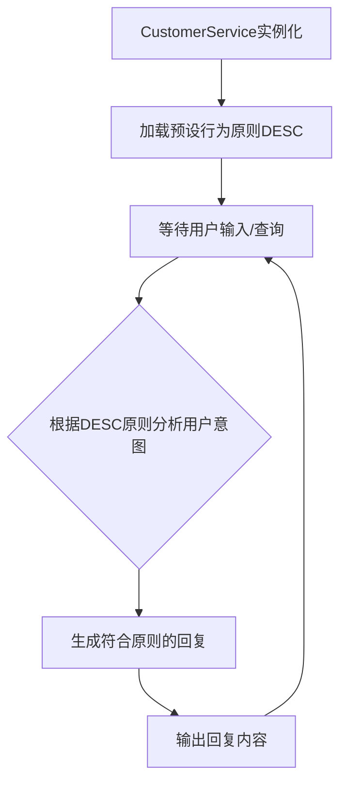

# `.\MetaGPT\metagpt\roles\customer_service.py` 详细设计文档

该文件定义了一个名为CustomerService的客户服务角色类，继承自Sales类。它通过硬编码的规则和FAQ描述（DESC）来约束AI客服的行为，核心功能是模拟一个遵循特定原则（如安抚情绪、催促商户/骑手、补偿，但避免过度承诺和泄露无关规则）的人类客服与客户进行交互。

## 整体流程



## 类结构

```
Sales (父类，来自metagpt.roles)
└── CustomerService (客户服务角色)
```

## 全局变量及字段


### `DESC`
    
一个多行字符串常量，定义了客户服务AI代理（CustomerService）必须遵循的核心原则和行为准则。

类型：`str`
    


### `CustomerService.name`
    
客户服务AI代理的名称，默认值为'Xiaomei'。

类型：`str`
    


### `CustomerService.profile`
    
客户服务AI代理的角色描述，用于标识其身份为'Human customer service'。

类型：`str`
    


### `CustomerService.desc`
    
客户服务AI代理的详细行为描述，直接引用全局常量DESC，定义了其交互原则。

类型：`str`
    


### `CustomerService.store`
    
一个可选的文档存储实例，用于可能的知识库查询，默认值为None且在序列化时排除。

类型：`Optional[BaseStore]`
    
    

## 全局函数及方法


## 关键组件


### 角色定义与配置

通过继承Sales角色基类并定义特定属性（name, profile, desc, store）来创建一个具体的客户服务角色“Xiaomei”，其行为受预定义的对话原则严格约束。

### 对话原则引擎

以多行字符串常量形式硬编码的、结构化的业务规则与FAQ，作为角色所有对话决策和回复生成的唯一、强制性依据，确保回复的一致性和合规性。

### 文档存储抽象

通过可选的`BaseStore`类型字段`store`引入文档存储的抽象依赖，为未来集成知识库（如FAQ库、规则库）以支持动态内容查询提供了扩展点，当前处于未实现状态。


## 问题及建议


### 已知问题

-   **硬编码的业务逻辑与原则**：核心业务逻辑（`DESC` 字符串）以硬编码方式嵌入在类定义中。这导致规则变更时需要修改源代码，降低了系统的灵活性和可维护性，也不利于进行A/B测试或为不同场景配置不同的规则。
-   **依赖注入不明确**：`store` 字段被标记为 `Optional` 且默认值为 `None`，但其在 `CustomerService` 类中的具体用途未在代码片段中体现。如果 `store` 是用于查询知识库（如FAQ）的关键依赖，那么其初始化逻辑缺失，可能导致运行时错误或功能不完整。
-   **有限的行动范围**：根据原则描述，客服的可行行动被严格限定为“安抚情绪、催促商家、催促骑手、补偿”。这种设计可能无法覆盖所有复杂的客户服务场景，缺乏处理规则外情况的弹性机制（如升级到人工主管），可能导致对话陷入僵局。
-   **假设客户永远正确**：原则第3条要求假设客户所说均为事实且禁止索要订单号。这虽然简化了初期交互，但放弃了通过验证关键信息来精准解决问题的机会，可能被恶意用户利用，并增加了后端处理错误或虚假请求的成本。

### 优化建议

-   **外部化配置业务规则**：将 `DESC` 中的业务原则和对话规则移出代码，改为从配置文件（如YAML、JSON）、数据库或配置服务中加载。这支持动态更新规则、环境差异化配置以及更安全的权限管理。
-   **明确并强化依赖管理**：明确 `BaseStore` 依赖的用途（例如，用于检索FAQ或客户历史）。建议在类初始化方法（`__init__`）或工厂方法中强制要求提供有效的 `store` 实例，或实现一个清晰的懒加载/默认初始化逻辑，确保功能完整性。
-   **设计扩展的行动与决策框架**：在现有固定行动集的基础上，引入一个基于规则引擎或策略模式的决策层。该层可以评估对话状态、客户情绪、问题类型等因素，动态选择或组合行动（包括现有行动和新的行动如“转接专家”、“提供替代方案”），并定义明确的例外情况升级路径。
-   **引入信息验证与风险评估机制**：在长期优化中，可以设计一个平衡用户体验与风险控制的机制。例如，对于涉及补偿或敏感操作的情况，可以尝试通过非侵入式方式（如查询关联订单、验证历史行为）进行轻度验证，或引入一个基于请求类型和历史数据的风险评估模型，对不同风险等级的请求采取不同的信息要求和处理流程。


## 其它


### 设计目标与约束

1. **设计目标**：
   - 实现一个基于规则和FAQ的客户服务对话系统，模拟人类客服的交互行为。
   - 确保客服回复严格遵循预设的“原则”（Principles），不泄露无关信息。
   - 在对话中优先安抚客户情绪，并在必要时采取催促商家、催促骑手或补偿等措施。
   - 系统应具备一定的扩展性，未来可集成后端API查询功能。

2. **设计约束**：
   - 当前无可用后端API查询订单等信息，因此默认客户陈述为真，不向客户索要订单号。
   - 客服的可行回复仅限于：安抚情绪、催促商家、催促骑手、补偿，不得做出虚假承诺。
   - 若确定满足客户需求，需告知客户申请已提交，将在24小时内生效。
   - 代码结构需符合MetaGPT框架的角色（Role）定义规范。

### 错误处理与异常设计

1. **错误处理策略**：
   - 在对话过程中，若遇到无法根据现有规则和FAQ处理的情况，应引导客户转向人工客服或提供通用安抚话术，避免系统崩溃或给出错误信息。
   - 对于`store`字段（文档存储）可能为`None`的情况，在相关方法中应进行空值检查，避免空指针异常。

2. **异常类型**：
   - 未明确列出具体异常类，但应预见到`BaseStore`相关操作可能引发的异常（如连接失败、查询错误），并考虑在未来的实现中添加相应的异常捕获和处理逻辑。
   - 输入验证：依赖Pydantic进行模型字段的类型和约束验证。

### 数据流与状态机

1. **主要数据流**：
   - **输入**：客户的对话消息（文本）。
   - **处理**：
     - 客服角色（`CustomerService`）接收消息。
     - 根据内置的`DESC`原则和潜在的`store`（知识库）进行决策。
     - 生成符合原则的回复内容。
   - **输出**：客服的回复消息（文本）。

2. **状态机（概念模型）**：
   - **初始状态**：等待客户输入。
   - **接收消息**：进入“处理中”状态。
   - **规则匹配**：根据原则和FAQ匹配客户意图。
     - 若匹配到“情绪问题”，进入“安抚”子状态。
     - 若匹配到“配送/商家问题”，进入“催促”子状态。
     - 若匹配到需补偿场景，进入“补偿评估”子状态。
   - **生成回复**：根据子状态生成相应回复，返回“等待客户输入”状态。
   - **承诺生效**：若满足客户需求，生成“申请已提交”回复，并告知24小时生效。

### 外部依赖与接口契约

1. **外部依赖**：
   - **MetaGPT框架**：继承自`metagpt.roles.Sales`，依赖其角色运行机制和可能的消息处理流程。
   - **Pydantic**：用于数据模型验证和序列化设置（`Field`）。
   - **BaseStore** (`metagpt.document_store.base_store.BaseStore`)：作为可选的文档存储依赖，用于查询FAQ或规则知识库。当前为`Optional`，未强制依赖。

2. **接口契约**：
   - **父类契约**：必须实现或继承`Sales`角色所定义的核心接口（如消息响应的入口方法`_act`或`react`），具体方法需参考MetaGPT框架对`Role`的定义。
   - **字段契约**：
     - `name`, `profile`, `desc`: 提供角色的基本元信息。
     - `store`: 提供一个可选的、符合`BaseStore`接口的知识库查询对象。通过`Field(exclude=True)`确保在序列化时排除此字段。
   - **原则契约**：类的行为必须严格遵循`DESC`字符串中定义的5条原则，这些原则是核心业务逻辑的硬性约束。

    