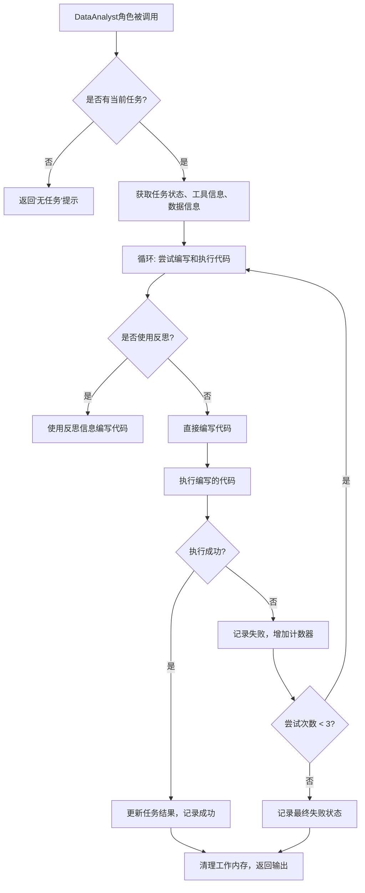
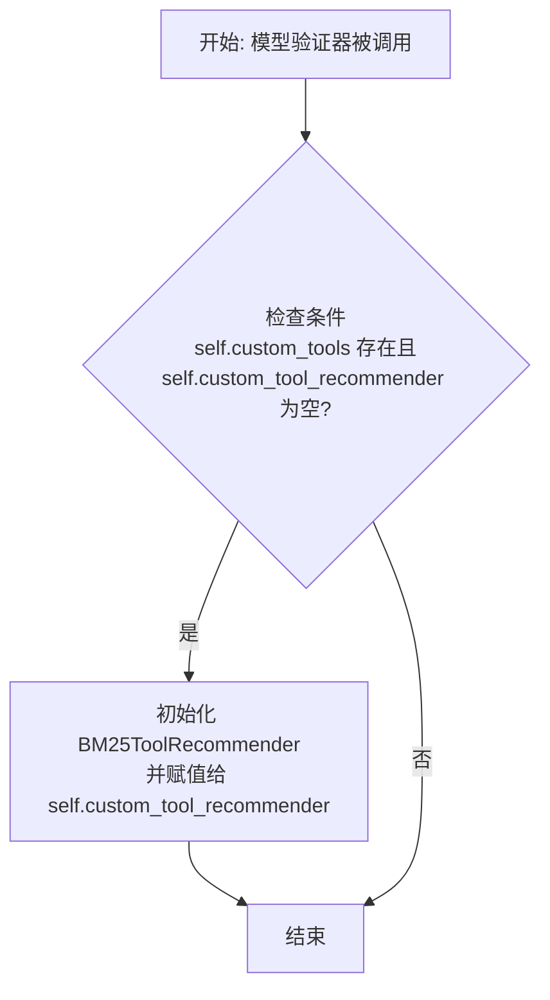
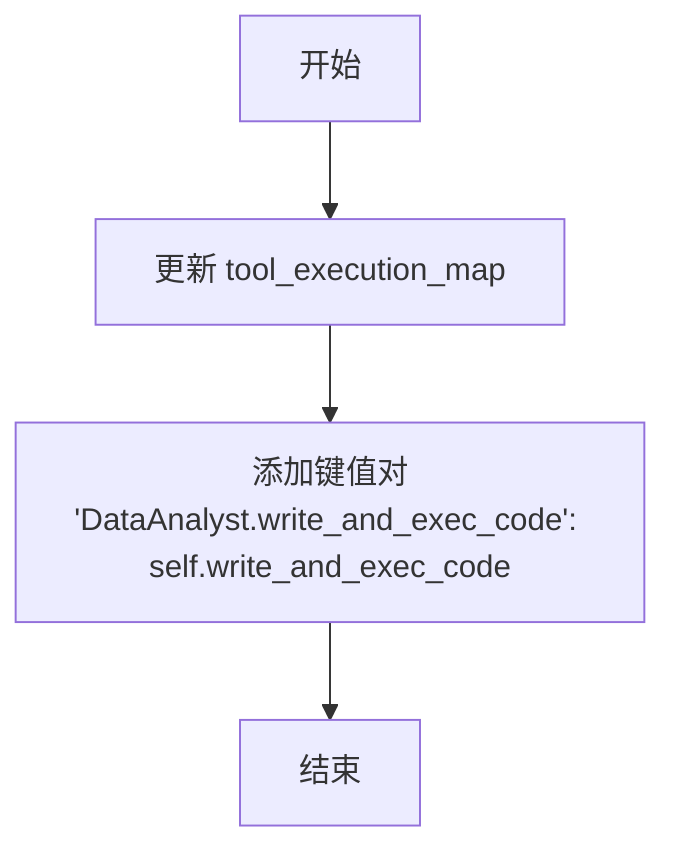
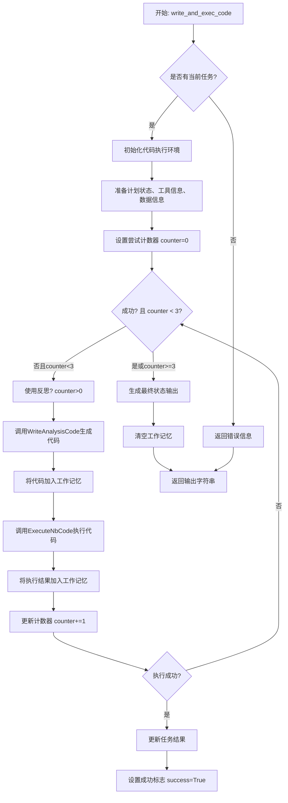

# `.\MetaGPT\metagpt\roles\di\data_analyst.py` 详细设计文档

该文件定义了一个名为DataAnalyst的智能体角色，它继承自RoleZero，专门用于处理数据相关的任务。该角色能够根据任务规划，通过调用WriteAnalysisCode和ExecuteNbCode等工具，在交互式笔记本环境中编写、执行代码，并处理执行结果，以完成数据分析、机器学习、深度学习、网页浏览、网页抓取、网页搜索、终端操作、文档问答与分析等任务。

## 整体流程



## 类结构

```
RoleZero (基础角色类)
└── DataAnalyst (数据分析师角色)
    ├── WriteAnalysisCode (编写分析代码工具)
    ├── ExecuteNbCode (执行笔记本代码工具)
    ├── ExpRetriever (经验检索器接口)
    │   └── KeywordExpRetriever (关键词经验检索器)
    └── ToolRecommender (工具推荐器接口)
        └── BM25ToolRecommender (BM25工具推荐器)
```

## 全局变量及字段


### `DataAnalyst.name`
    
角色的名称标识符，默认值为'David'。

类型：`str`
    


### `DataAnalyst.profile`
    
角色的职业或身份描述，用于定义其在系统中的角色，默认值为'DataAnalyst'。

类型：`str`
    


### `DataAnalyst.goal`
    
角色的核心目标，定义了其处理数据相关任务的广泛范围，包括数据分析、机器学习、网络操作等。

类型：`str`
    


### `DataAnalyst.instruction`
    
指导角色行为的指令，由基础角色指令和针对数据分析师的额外指令拼接而成。

类型：`str`
    


### `DataAnalyst.task_type_desc`
    
任务类型的描述信息，用于指导角色理解不同任务的性质和要求。

类型：`str`
    


### `DataAnalyst.tools`
    
角色可用的基础工具列表，包括规划、数据分析、浏览器、编辑器等核心功能。

类型：`list[str]`
    


### `DataAnalyst.custom_tools`
    
角色可用的自定义工具列表，如网络爬虫、终端操作等，用于扩展基础工具集。

类型：`list[str]`
    


### `DataAnalyst.custom_tool_recommender`
    
用于根据当前任务推荐自定义工具的工具推荐器实例，初始为None，在验证后根据custom_tools动态设置。

类型：`ToolRecommender`
    


### `DataAnalyst.experience_retriever`
    
用于检索相关经验或知识的检索器，使用关键词检索策略，并在序列化时排除此字段。

类型：`ExpRetriever`
    


### `DataAnalyst.use_reflection`
    
控制是否在代码生成失败后使用反思机制来改进后续尝试的标志，默认值为True。

类型：`bool`
    


### `DataAnalyst.write_code`
    
负责根据任务需求编写分析代码的动作执行器，使用默认工厂初始化并在序列化时排除此字段。

类型：`WriteAnalysisCode`
    


### `DataAnalyst.execute_code`
    
负责在交互式笔记本环境中执行生成的代码块的动作执行器，使用默认工厂初始化并在序列化时排除此字段。

类型：`ExecuteNbCode`
    
    

## 全局函数及方法


### `DataAnalyst.set_custom_tool`

`set_custom_tool` 是 `DataAnalyst` 类的一个模型验证器方法，在类实例初始化后自动调用。它的核心功能是检查实例是否配置了自定义工具列表 (`custom_tools`)，如果配置了但尚未设置对应的工具推荐器 (`custom_tool_recommender`)，则自动初始化一个基于 BM25 算法的工具推荐器 (`BM25ToolRecommender`) 并将其赋值给 `custom_tool_recommender` 字段。这确保了当 `DataAnalyst` 角色需要使用自定义工具时，能够有一个有效的推荐器来辅助选择。

参数：

-  `self`：`DataAnalyst`，`DataAnalyst` 类的当前实例。

返回值：`None`，此方法不返回任何值，其作用是在实例初始化后修改实例的内部状态。

#### 流程图



#### 带注释源码

```
    @model_validator(mode="after")  # 这是一个 Pydantic 模型验证器装饰器，指定在模型实例化后运行。
    def set_custom_tool(self):  # 方法定义，不接受除 self 外的其他参数。
        # 条件判断：如果实例的 custom_tools 列表非空，并且 custom_tool_recommender 属性为 None。
        if self.custom_tools and not self.custom_tool_recommender:
            # 满足条件时，创建一个 BM25ToolRecommender 实例。
            # 参数 `tools` 传入当前的 custom_tools 列表。
            # 参数 `force=True` 可能强制创建推荐器或覆盖某些默认行为。
            # 将新创建的推荐器赋值给实例的 custom_tool_recommender 属性。
            self.custom_tool_recommender = BM25ToolRecommender(tools=self.custom_tools, force=True)
```


### `DataAnalyst._update_tool_execution`

该方法用于更新 `DataAnalyst` 角色的工具执行映射表 (`tool_execution_map`)，将自定义工具 `"DataAnalyst.write_and_exec_code"` 与其对应的异步方法 `self.write_and_exec_code` 进行绑定。这是角色初始化或配置过程中的一个内部步骤，确保当角色需要调用名为 `"DataAnalyst.write_and_exec_code"` 的工具时，能够正确找到并执行 `write_and_exec_code` 方法。

参数：
-  `self`：`DataAnalyst`，`DataAnalyst` 类的实例，代表当前的数据分析师角色。

返回值：`None`，该方法不返回任何值，其作用是通过修改实例的 `tool_execution_map` 属性来产生副作用。

#### 流程图



#### 带注释源码

```python
    def _update_tool_execution(self):
        # 更新实例的 tool_execution_map 字典。
        # tool_execution_map 是一个映射关系表，将工具名称字符串映射到实际可调用的方法。
        self.tool_execution_map.update(
            {
                # 将工具名称 "DataAnalyst.write_and_exec_code" 与当前实例的 write_and_exec_code 方法绑定。
                # 这使得当系统或角色逻辑需要调用名为 "DataAnalyst.write_and_exec_code" 的工具时，
                # 能够通过此映射找到并执行 self.write_and_exec_code 方法。
                "DataAnalyst.write_and_exec_code": self.write_and_exec_code,
            }
        )
```


### `DataAnalyst.write_and_exec_code`

该方法用于为当前任务编写代码块，并在交互式笔记本环境中执行它。它整合了代码生成、执行、结果处理和状态更新的完整流程，通过最多三次尝试来确保代码成功执行，并将最终结果更新到任务计划中。

参数：

- `instruction`：`str`，可选的进一步提示或通知，除了当前任务指令外，必须非常简洁，可以为空。默认为空字符串。

返回值：`str`，返回一个格式化的字符串，包含代码执行的状态（成功或失败）、代码内容、执行结果以及成功时的确认信息。

#### 流程图



#### 带注释源码

```python
async def write_and_exec_code(self, instruction: str = ""):
    """Write a code block for current task and execute it in an interactive notebook environment.

    Args:
        instruction (optional, str): Further hints or notice other than the current task instruction, must be very concise and can be empty. Defaults to "".
    """
    # 1. 检查当前任务状态
    if self.planner.plan:
        logger.info(f"Current task {self.planner.plan.current_task}")

    counter = 0
    success = False
    # 2. 初始化代码执行环境（如Jupyter Notebook内核）
    await self.execute_code.init_code()

    # 3. 准备计划状态信息
    if self.planner.current_task:
        # 清理计划中的任务结果以节省token，因为它已在内存中
        plan_status = self.planner.get_plan_status(exclude=["task_result"])
        plan_status += f"\nFurther Task Instruction: {instruction}"
    else:
        # 如果没有当前任务，返回错误信息
        return "No current_task found now. Please use command Plan.append_task to add a task first."

    # 4. 准备工具推荐信息
    if self.custom_tool_recommender:
        plan = self.planner.plan
        fixed = ["Terminal"] if "Terminal" in self.custom_tools else None
        tool_info = await self.custom_tool_recommender.get_recommended_tool_info(fixed=fixed, plan=plan)
    else:
        tool_info = ""

    # 5. 检查并准备数据信息
    await self._check_data()

    # 6. 主循环：尝试最多3次以生成和执行成功代码
    while not success and counter < 3:
        ### 6.1 编写代码 ###
        logger.info("ready to WriteAnalysisCode")
        # 仅在第一次尝试后使用反思机制
        use_reflection = counter > 0 and self.use_reflection

        # 调用WriteAnalysisCode动作生成代码
        code = await self.write_code.run(
            user_requirement=self.planner.plan.goal,
            plan_status=plan_status,
            tool_info=tool_info,
            working_memory=self.rc.working_memory.get(),
            use_reflection=use_reflection,
            memory=self.rc.memory.get(self.memory_k),
        )
        # 将生成的代码添加到工作记忆中
        self.rc.working_memory.add(Message(content=code, role="assistant", cause_by=WriteAnalysisCode))

        ### 6.2 执行代码 ###
        result, success = await self.execute_code.run(code)
        print(result)

        # 将执行结果添加到工作记忆中
        self.rc.working_memory.add(Message(content=result, role="user", cause_by=ExecuteNbCode))

        ### 6.3 处理执行结果 ###
        counter += 1
        if success:
            # 如果执行成功，创建任务结果对象并更新当前任务
            task_result = TaskResult(code=code, result=result, is_success=success)
            self.planner.current_task.update_task_result(task_result)

    # 7. 生成最终输出
    status = "Success" if success else "Failed"
    output = CODE_STATUS.format(code=code, status=status, result=result)
    if success:
        output += "The code written has been executed successfully."
    # 清空工作记忆，为下一个任务做准备
    self.rc.working_memory.clear()
    return output
```


### `DataAnalyst._check_data`

该方法用于检查数据状态。当计划中存在已完成的任务，并且当前任务类型为数据预处理、特征工程或模型训练时，该方法会生成并执行一段代码来检查数据，并将检查结果作为数据信息添加到工作记忆中。

参数：
-  `self`：`DataAnalyst`，`DataAnalyst` 类的实例

返回值：`None`，该方法不返回任何值，其作用是通过执行代码来检查和更新数据信息。

#### 流程图

```mermaid
flowchart TD
    A[开始] --> B{计划中有已完成任务<br>且当前任务类型为<br>数据预处理/特征工程/模型训练?}
    B -- 否 --> C[结束]
    B -- 是 --> D[记录日志: “Check updated data”]
    D --> E[调用 CheckData().run<br>生成检查代码]
    E --> F{生成的代码是否为空?}
    F -- 是 --> C
    F -- 否 --> G[执行生成的代码]
    G --> H{代码执行是否成功?}
    H -- 否 --> C
    H -- 是 --> I[打印执行结果]
    I --> J[格式化数据信息]
    J --> K[将数据信息添加到工作记忆]
    K --> C
```

#### 带注释源码

```python
async def _check_data(self):
    # 检查条件：1. 计划中必须有已完成的任务；2. 当前任务类型必须是数据预处理、特征工程或模型训练之一。
    if not self.planner.plan.get_finished_tasks() or self.planner.plan.current_task.task_type not in [
        TaskType.DATA_PREPROCESS.type_name,
        TaskType.FEATURE_ENGINEERING.type_name,
        TaskType.MODEL_TRAIN.type_name,
    ]:
        # 如果条件不满足，直接返回，不执行后续操作。
        return
    # 记录开始检查数据的日志。
    logger.info("Check updated data")
    # 调用 CheckData 动作的 run 方法，传入当前计划，生成用于检查数据的代码。
    code = await CheckData().run(self.planner.plan)
    # 检查生成的代码是否为空（例如，可能没有数据需要检查）。
    if not code.strip():
        # 如果代码为空，直接返回。
        return
    # 执行生成的检查代码。
    result, success = await self.execute_code.run(code)
    # 如果代码执行成功。
    if success:
        # 打印执行结果（通常包含数据检查的摘要信息）。
        print(result)
        # 使用 DATA_INFO 模板格式化执行结果，生成更易读的数据信息。
        data_info = DATA_INFO.format(info=result)
        # 将格式化后的数据信息作为一条用户消息添加到工作记忆中，以便后续步骤（如代码生成）可以访问这些信息。
        self.rc.working_memory.add(Message(content=data_info, role="user", cause_by=CheckData))
```


### `DataAnalyst._run_special_command`

该方法用于处理需要特殊检查或解析的命令。它首先检查是否为“end”命令，并在计划未完成时强制完成所有任务，然后将命令传递给父类（`RoleZero`）的 `_run_special_command` 方法进行处理，并返回组合后的输出。

参数：

-  `cmd`：`dict`，包含命令信息的字典，例如 `{"command_name": "end"}`。

返回值：`str`，命令执行后的输出字符串。

#### 流程图

```mermaid
flowchart TD
    A[开始: _run_special_command(cmd)] --> B{命令名是否为 'end'?};
    B -- 是 --> C{计划是否已完成?};
    C -- 否 --> D[调用 planner.plan.finish_all_tasks<br>完成所有任务];
    D --> E[command_output += “所有任务已完成。\\n”];
    C -- 是 --> E;
    B -- 否 --> E;
    E --> F[调用 super()._run_special_command(cmd)<br>执行父类命令处理];
    F --> G[返回 command_output];
```

#### 带注释源码

```python
async def _run_special_command(self, cmd) -> str:
    """command requiring special check or parsing."""
    # TODO: duplicate with Engineer2._run_special_command, consider dedup
    # 注释：存在与 Engineer2._run_special_command 重复的代码，未来考虑去重。

    # finish current task before end.
    command_output = ""
    # 注释：检查是否为“end”命令，并且计划尚未完成。
    if cmd["command_name"] == "end" and not self.planner.plan.is_plan_finished():
        # 注释：强制完成计划中的所有任务。
        self.planner.plan.finish_all_tasks()
        # 注释：在输出中添加任务完成信息。
        command_output += "All tasks are finished.\n"
    # 注释：调用父类（RoleZero）的 _run_special_command 方法处理命令。
    command_output += await super()._run_special_command(cmd)
    # 注释：返回组合后的命令输出。
    return command_output
```


## 关键组件


### 张量索引与惰性加载

代码中未直接涉及张量索引与惰性加载机制。该组件通常用于高效处理大规模数据集，通过按需加载数据块而非一次性全部加载到内存中来优化性能。在本代码中，数据处理主要通过执行代码块（如 `ExecuteNbCode`）在交互式笔记本环境中完成，可能隐式依赖于外部库（如Pandas、NumPy）的惰性加载特性，但并非本类的核心实现。

### 反量化支持

代码中未直接涉及反量化支持。该组件通常用于机器学习模型部署，将量化后的低精度模型参数（如INT8）转换回浮点数（如FP32）以进行推理或进一步训练。本类 `DataAnalyst` 专注于数据分析、代码编写与执行任务流，不涉及模型参数的量化与反量化操作。

### 量化策略

代码中未直接涉及量化策略。该组件通常指在模型训练或推理中，为减少模型大小和加速计算而将模型参数从高精度（如FP32）转换为低精度（如INT8）的方法和配置。本类的核心功能是协调数据分析任务，通过 `WriteAnalysisCode` 和 `ExecuteNbCode` 等动作生成并执行代码，不包含模型压缩或优化的量化策略。


## 问题及建议


### 已知问题

-   **代码重复**：`_run_special_command` 方法中存在与 `Engineer2._run_special_command` 类似的逻辑，特别是处理 `"end"` 命令的部分。这违反了 DRY（Don‘t Repeat Yourself）原则，增加了维护成本和出错风险。
-   **硬编码的尝试次数限制**：`write_and_exec_code` 方法中，代码生成与执行的循环尝试次数被硬编码为 `counter < 3`。这个固定的阈值可能不适用于所有场景，缺乏灵活性。
-   **潜在的死循环风险**：在 `write_and_exec_code` 的 `while` 循环中，如果 `success` 始终为 `False` 且 `counter` 未正确递增，或 `counter` 逻辑被破坏，可能导致死循环。
-   **内存管理不明确**：`self.rc.working_memory.clear()` 在方法末尾被调用，清空了工作记忆。这可能过早地清除了对后续步骤有用的上下文信息，其清理策略和时机缺乏明确的文档说明。
-   **异常处理不足**：代码中缺乏对 `write_code.run`、`execute_code.run` 等异步操作可能抛出的异常进行捕获和处理。这可能导致程序因未处理的异常而意外终止。
-   **工具推荐逻辑耦合**：`write_and_exec_code` 方法中，工具推荐信息（`tool_info`）的获取逻辑与 `custom_tool_recommender` 的存在性紧密耦合，并且包含了对 `"Terminal"` 工具的硬编码处理，使得方法职责不够单一，且不易扩展。

### 优化建议

-   **抽象公共命令逻辑**：建议将 `_run_special_command` 方法中处理 `"end"` 命令等公共逻辑提取到一个基类或工具函数中，供 `DataAnalyst` 和 `Engineer2` 等角色复用，以消除代码重复。
-   **配置化尝试次数**：将 `write_and_exec_code` 中的最大尝试次数（目前为3）改为可配置项，例如通过类字段（如 `max_code_retries`）或运行时参数进行设置，以提高适应性。
-   **增强循环安全与日志**：在 `write_and_exec_code` 的循环体内增加更详细的日志记录，明确记录每次尝试的计数和结果。考虑添加循环超时机制或更健壮的 `counter` 更新逻辑，以防止潜在的无限循环。
-   **明确内存管理策略**：重新评估 `working_memory.clear()` 的调用时机。考虑是否应在任务成功完成后才清理，或者改为部分清理（如只清理与当前代码执行相关的消息），并补充相关策略的文档注释。
-   **增加异常处理与重试机制**：在 `write_and_exec_code` 方法的关键步骤（如代码生成、执行）周围添加 `try-except` 块，捕获特定异常（如 `TimeoutError`, `RuntimeError`），并实现适当的错误处理、日志记录和可能的条件重试逻辑。
-   **解耦工具推荐逻辑**：将 `tool_info` 的获取逻辑封装到一个独立的方法（如 `_get_tool_recommendations`）中。该方法应负责处理 `custom_tool_recommender` 的判空、`fixed` 工具的配置（避免硬编码 `"Terminal"`）等细节，使 `write_and_exec_code` 方法更专注于代码编写与执行的核心流程。
-   **优化条件检查**：`_check_data` 方法中的条件判断逻辑较长，可考虑提取为独立的、命名清晰的布尔变量或方法，以提高代码可读性。


## 其它


### 设计目标与约束

本模块 `DataAnalyst` 是一个基于 `RoleZero` 框架构建的、面向数据相关任务的智能体（Agent）。其核心设计目标是成为一个通用、可扩展的数据分析师角色，能够处理包括数据分析、机器学习、网页操作、文档问答等在内的多种数据任务。主要约束包括：1) 必须在 `RoleZero` 的架构和交互范式下工作，继承其规划、记忆、工具执行等核心机制；2) 需要与交互式笔记本环境（如 Jupyter）集成，以支持代码的编写与执行；3) 需支持通过工具推荐和反射机制来优化代码生成与执行过程，以应对复杂任务。

### 错误处理与异常设计

模块的错误处理主要围绕代码执行流程展开：
1.  **代码执行重试机制**：在 `write_and_exec_code` 方法中，代码执行失败后会进行最多3次重试。每次重试会利用前次执行的反馈（存储在 `working_memory` 中）和可选的反射机制来生成新的代码。
2.  **状态反馈**：每次代码执行后，无论成功与否，结果都会被记录到 `working_memory` 和当前任务的 `TaskResult` 中，为后续步骤提供上下文。
3.  **前置条件检查**：在 `write_and_exec_code` 开始时，会检查是否存在 `current_task`，若无则直接返回错误信息，避免无效操作。
4.  **数据检查异常静默处理**：`_check_data` 方法在执行数据检查代码时，若代码执行成功，则将结果信息加入工作记忆；若执行失败或无代码生成，则静默返回，不影响主流程。
5.  **特殊命令的容错处理**：`_run_special_command` 方法在处理 `end` 命令时，会先确保所有任务标记为完成，再调用父类方法，保证了状态的一致性。

### 数据流与状态机

1.  **数据流**：
    *   **输入**：用户需求（`self.planner.plan.goal`）、任务规划状态（`plan_status`）、推荐的工具信息（`tool_info`）、工作记忆（`working_memory`）、长期记忆（`memory`）。
    *   **处理**：通过 `WriteAnalysisCode` 动作将输入合成为可执行的代码。代码在 `ExecuteNbCode` 动作管理的交互式笔记本环境中执行。
    *   **输出**：代码执行的结果（`result`）、生成的代码本身（`code`）以及最终的任务状态（`output`）。成功的结果会更新到 `planner.current_task` 的 `TaskResult` 中。
    *   **状态载体**：`working_memory` 作为短期上下文，存储临时的代码和结果消息；`planner.plan` 和 `TaskResult` 记录任务级的规划与结果状态。

2.  **状态机（隐式）**：
    *   **初始/空闲状态**：等待任务被添加到规划器（`planner`）。
    *   **代码生成与执行循环**：进入 `write_and_exec_code` 后，状态在“生成代码” -> “执行代码” -> “评估结果”之间循环。成功则跳出循环，进入“任务完成”状态；失败且未超重试次数则返回“生成代码”状态。
    *   **任务完成状态**：代码成功执行后，更新任务结果，清空工作记忆，返回成功输出。
    *   **外部命令触发状态转移**：`_run_special_command` 处理如 `end` 等命令，可能触发将所有任务标记为完成的转移。

### 外部依赖与接口契约

1.  **父类与框架依赖**：强依赖于 `RoleZero` 基类，继承其 `planner`, `rc` (RoleContext), `tool_execution_map` 等属性和 `_run_special_command` 等方法的行为契约。
2.  **动作（Action）依赖**：
    *   `WriteAnalysisCode`：负责生成分析代码，需遵循其 `run` 方法的输入输出约定。
    *   `ExecuteNbCode`：负责在笔记本环境中执行代码并返回结果，需遵循其 `run` 方法和 `init_code` 方法的约定。
    *   `CheckData`：一个特定的动作，用于生成检查数据的代码。
3.  **策略与工具组件依赖**：
    *   `ExpRetriever` / `KeywordExpRetriever`：经验检索器，用于代码生成时的经验参考。
    *   `ToolRecommender` / `BM25ToolRecommender`：工具推荐器，用于为当前任务推荐 `custom_tools` 中的工具。
4.  **数据模型依赖**：依赖于 `Message`, `TaskResult`, `TaskType` 等 Schema 定义，用于结构化信息传递和状态表示。
5.  **环境依赖**：`ExecuteNbCode` 隐含依赖一个可交互的 Python 内核（如 Jupyter Kernel）来执行生成的代码。
6.  **装饰器与配置**：`@register_tool` 装饰器表明此角色本身可作为一个工具被其他智能体调用，需遵循相应的注册与调用规约。

### 配置与初始化

1.  **角色固有属性**：`name`, `profile`, `goal`, `instruction`, `task_type_desc` 等字段定义了角色的基本身份和行为指南，通常在类定义中固定。
2.  **工具配置**：
    *   `tools`：定义角色可用的基础工具列表。
    *   `custom_tools`：定义角色特有的自定义工具列表，用于工具推荐。
    *   `custom_tool_recommender`：根据 `custom_tools` 动态初始化的工具推荐器实例（通过 `@model_validator` 钩子 `set_custom_tool` 设置）。
3.  **功能开关**：`use_reflection` 布尔标志，控制代码生成失败后是否使用反射机制。
4.  **组件延迟初始化**：`write_code` 和 `execute_code` 使用 `Field(default_factory=...)` 进行延迟初始化，确保每个实例拥有独立的行为动作实例。
5.  **工具执行映射**：通过 `_update_tool_execution` 方法（应在适当时机被调用，代码中未直接展示调用点，可能由父类或框架触发）将 `write_and_exec_code` 方法注册到 `tool_execution_map` 中，使其能够作为工具被触发。

### 并发与异步设计

1.  **异步方法**：核心方法 `write_and_exec_code`, `_check_data`, `_run_special_command` 均定义为 `async`，表明它们设计用于异步事件循环，可以执行 I/O 密集型操作（如 LLM 调用、工具调用）而不阻塞。
2.  **异步动作调用**：对 `WriteAnalysisCode.run`, `ExecuteNbCode.run`, `CheckData.run` 等的调用都使用 `await`，遵循这些动作组件自身的异步接口。
3.  **状态共享与竞态条件**：`working_memory` 和 `planner.plan` 在异步循环中被读写。当前设计假设该角色在单次任务执行中是顺序执行的（通过 `counter` 循环控制），因此避免了并发访问同一状态的问题。但如果框架层面允许多个异步任务同时操作同一个角色实例，则可能存在竞态风险。


    