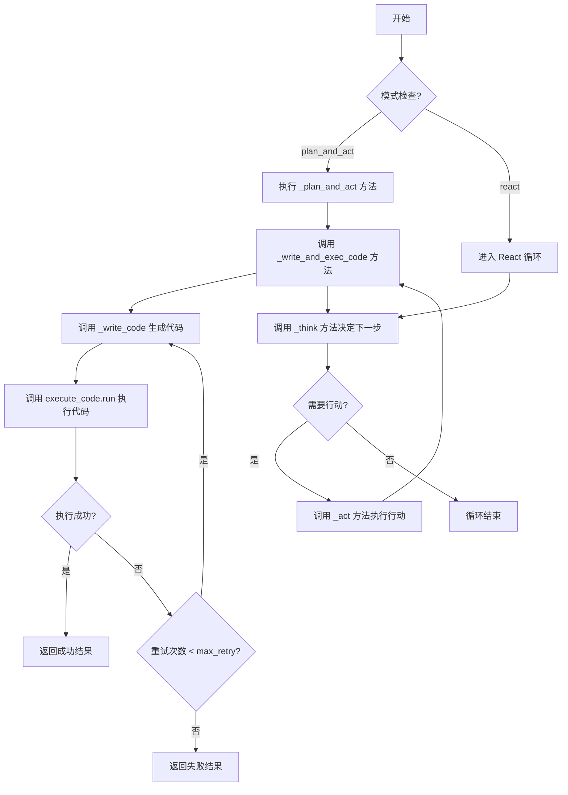
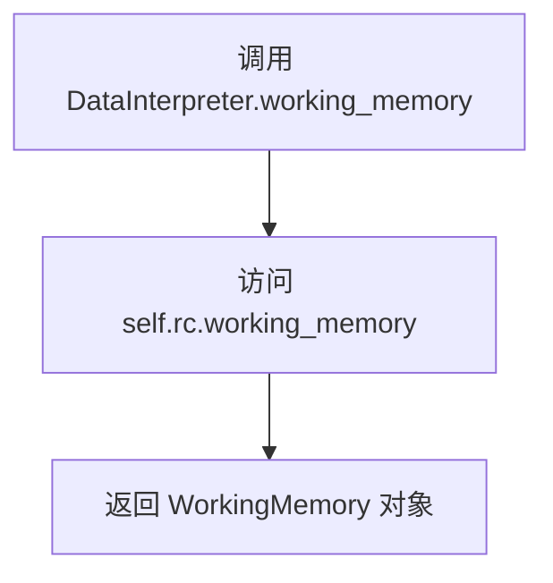
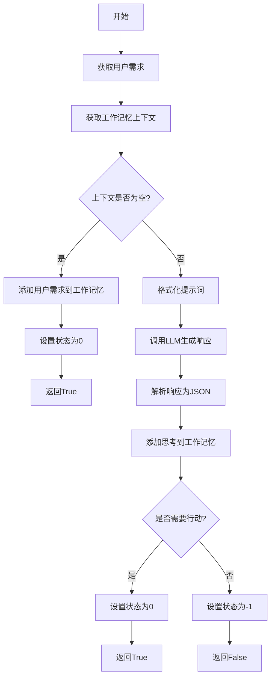
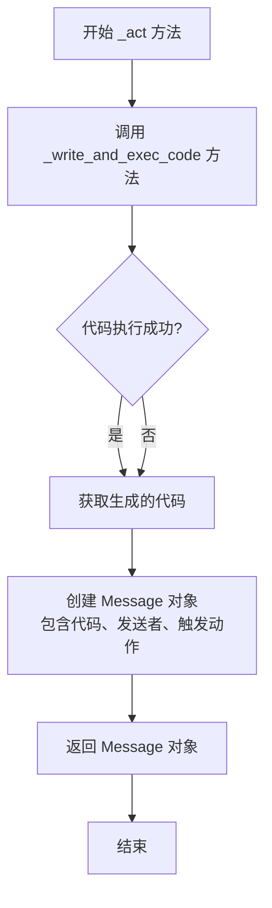
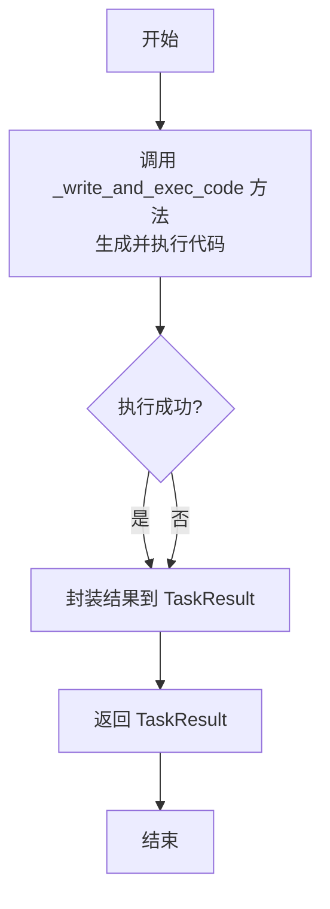
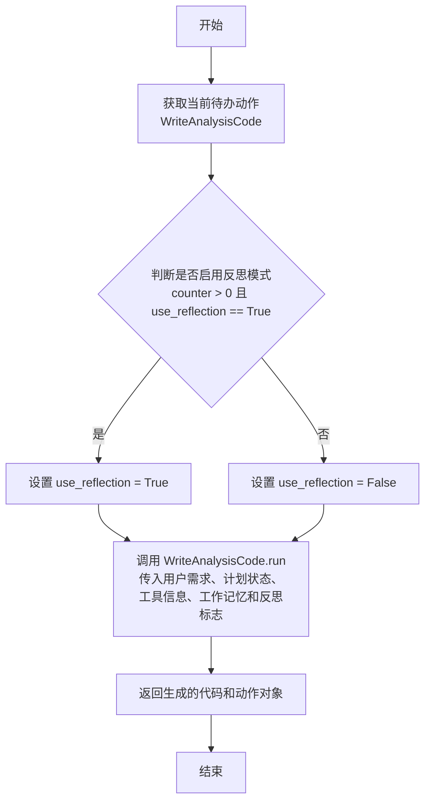

# `.\MetaGPT\metagpt\roles\di\data_interpreter.py` 详细设计文档

该代码定义了一个名为DataInterpreter的智能体角色，它作为一个数据解释器，能够根据用户需求自动生成、执行并迭代优化数据分析代码，支持两种反应模式（'plan_and_act' 和 'react'），通过整合工具推荐、代码执行和结果验证来完成复杂的数据分析任务。

## 整体流程



## 类结构

```
DataInterpreter (Role)
├── 字段: name, profile, auto_run, use_plan, use_reflection, execute_code, tools, tool_recommender, react_mode, max_react_loop, user_requirement
├── 方法: set_plan_and_tool, working_memory, _think, _act, _plan_and_act, _act_on_task, _write_and_exec_code, _write_code, _check_data
└── 依赖: ExecuteNbCode, WriteAnalysisCode, CheckData, Role, Message, Task, TaskResult, ToolRecommender, BM25ToolRecommender, ThoughtReporter
```

## 全局变量及字段


### `REACT_THINK_PROMPT`
    
用于引导LLM在'react'模式下进行思考的提示词模板，决定是否需要继续执行动作以满足用户需求。

类型：`str`
    


### `DataInterpreter.name`
    
角色的名称，默认为'David'。

类型：`str`
    


### `DataInterpreter.profile`
    
角色的描述，标识其为'DataInterpreter'。

类型：`str`
    


### `DataInterpreter.auto_run`
    
一个标志，指示角色是否应自动开始执行其任务流程。

类型：`bool`
    


### `DataInterpreter.use_plan`
    
一个标志，指示角色是否使用规划器（planner）来分解和执行任务。

类型：`bool`
    


### `DataInterpreter.use_reflection`
    
一个标志，指示在代码执行失败后重试时，是否使用反思机制来改进代码生成。

类型：`bool`
    


### `DataInterpreter.execute_code`
    
负责执行生成的Notebook代码的组件实例。

类型：`ExecuteNbCode`
    


### `DataInterpreter.tools`
    
可供角色使用的工具名称列表，特殊值['<all>']表示使用所有已注册工具。

类型：`list[str]`
    


### `DataInterpreter.tool_recommender`
    
根据上下文和计划推荐合适工具的推荐器实例。

类型：`ToolRecommender`
    


### `DataInterpreter.react_mode`
    
指定角色的运行模式：'plan_and_act'（先规划后执行）或'react'（基于思考-行动的循环）。

类型：`Literal['plan_and_act', 'react']`
    


### `DataInterpreter.max_react_loop`
    
在'react'模式下，思考-行动循环的最大迭代次数限制。

类型：`int`
    


### `DataInterpreter.user_requirement`
    
存储从用户消息中提取的当前任务需求或目标。

类型：`str`
    
    

## 全局函数及方法

### `DataInterpreter.set_plan_and_tool`

该方法是一个模型验证器，在`DataInterpreter`类实例化后自动调用。它的核心功能是根据传入的配置参数（如`react_mode`）来初始化角色的行为模式、工具推荐器、行动列表和内部状态，确保角色对象在后续使用前具备正确的运行配置。

参数：
-  `self`：`DataInterpreter`，`DataInterpreter`类的当前实例。

返回值：`Interpreter`，返回配置完成的`DataInterpreter`实例自身。

#### 流程图

```mermaid
flowchart TD
    A[开始: set_plan_and_tool] --> B[调用 _set_react_mode<br>设置反应模式与循环上限]
    B --> C{判断 react_mode 是否为 'plan_and_act'?}
    C -- 是 --> D[设置 use_plan 标志为 True]
    C -- 否 --> E[设置 use_plan 标志为 False]
    D --> F
    E --> F{判断是否提供了 tools<br>且未提供 tool_recommender?}
    F -- 是 --> G[使用 BM25ToolRecommender<br>初始化 tool_recommender]
    F -- 否 --> H[跳过工具推荐器初始化]
    G --> I[设置默认行动为 WriteAnalysisCode]
    H --> I
    I --> J[调用 _set_state(0)<br>初始化内部状态]
    J --> K[返回配置完成的 self 实例]
```

#### 带注释源码

```python
    @model_validator(mode="after")
    def set_plan_and_tool(self) -> "Interpreter":
        # 1. 根据 react_mode 等参数配置角色的反应行为模式（如最大循环次数）
        self._set_react_mode(react_mode=self.react_mode, max_react_loop=self.max_react_loop, auto_run=self.auto_run)
        # 2. 根据 react_mode 决定是否使用计划模式，并覆盖传入的 use_plan 值
        self.use_plan = (
            self.react_mode == "plan_and_act"
        )  # create a flag for convenience, overwrite any passed-in value
        # 3. 如果用户指定了工具列表但未指定工具推荐器，则使用 BM25 算法初始化一个默认推荐器
        if self.tools and not self.tool_recommender:
            self.tool_recommender = BM25ToolRecommender(tools=self.tools)
        # 4. 设置角色的默认行动为 WriteAnalysisCode（编写分析代码）
        self.set_actions([WriteAnalysisCode])
        # 5. 初始化角色的内部状态为 0（通常表示就绪或开始状态）
        self._set_state(0)
        # 6. 返回配置完成的实例自身，符合 Pydantic 模型验证器的要求
        return self
```

### `DataInterpreter.working_memory`

这是一个只读属性，用于获取角色（`DataInterpreter`）的运行时上下文（`RoleContext`）中的工作记忆（`working_memory`）对象。它提供了对当前任务执行过程中产生的中间信息和上下文的访问入口。

参数：
- 无

返回值：`WorkingMemory`，返回与当前`DataInterpreter`实例关联的`RoleContext`中的`working_memory`对象。

#### 流程图



#### 带注释源码

```python
    @property
    def working_memory(self):
        # 这是一个属性访问器（getter），当外部代码访问 `DataInterpreter` 实例的 `.working_memory` 属性时被调用。
        # 它直接返回该实例的运行时上下文（`self.rc`）中的 `working_memory` 属性。
        # `self.rc` 是 `RoleContext` 类型，它管理着角色执行过程中的状态和记忆。
        # 因此，此属性提供了对当前任务执行流中积累的中间数据、历史消息和上下文的统一访问点。
        return self.rc.working_memory
```

### `DataInterpreter._think`

该方法用于在“react”模式下，通过分析当前上下文和用户需求，决定是否需要采取进一步行动来满足用户需求。它使用LLM生成思考过程，并根据LLM的判断更新内部状态。

参数：

-  `self`：`DataInterpreter`，当前DataInterpreter实例的引用

返回值：`bool`，表示是否需要继续执行后续操作（True表示需要，False表示不需要）

#### 流程图



#### 带注释源码

```python
async def _think(self) -> bool:
    """Useful in 'react' mode. Use LLM to decide whether and what to do next."""
    # 从记忆（messages）中获取最新的用户需求
    self.user_requirement = self.get_memories()[-1].content
    # 从工作记忆中获取当前的上下文信息
    context = self.working_memory.get()

    # 如果上下文为空，说明是首次运行，需要初始化并触发行动
    if not context:
        # just started the run, we need action certainly
        # 将用户需求添加到工作记忆中作为初始上下文
        self.working_memory.add(self.get_memories()[0])  # add user requirement to working memory
        # 设置内部状态为0（表示需要行动）
        self._set_state(0)
        # 返回True，表示需要执行_act方法
        return True

    # 使用预定义的模板，将用户需求和当前上下文格式化为提示词
    prompt = REACT_THINK_PROMPT.format(user_requirement=self.user_requirement, context=context)
    # 在ThoughtReporter的上下文中调用LLM，可能用于记录或流式输出
    async with ThoughtReporter(enable_llm_stream=True):
        # 异步请求LLM生成响应
        rsp = await self.llm.aask(prompt)
    # 使用CodeParser解析响应中的JSON代码块
    rsp_dict = json.loads(CodeParser.parse_code(text=rsp))
    # 将LLM生成的“thoughts”作为助手消息添加到工作记忆中
    self.working_memory.add(Message(content=rsp_dict["thoughts"], role="assistant"))
    # 从LLM响应中获取是否需要进一步行动的判断
    need_action = rsp_dict["state"]
    # 根据判断结果设置内部状态：需要行动设为0，否则设为-1（可能表示任务完成）
    self._set_state(0) if need_action else self._set_state(-1)

    # 返回是否需要行动的布尔值
    return need_action
```

### `DataInterpreter._act`

`DataInterpreter._act` 方法是 `DataInterpreter` 角色在“react”模式下执行的核心动作。它通过调用 `_write_and_exec_code` 方法生成并执行代码，然后将生成的代码包装成一个 `Message` 对象返回，作为对用户需求的响应。

参数：
- `self`：`DataInterpreter` 实例，表示当前的角色对象。

返回值：`Message`，包含生成的代码内容、发送者信息和触发该消息的动作。

#### 流程图



#### 带注释源码

```python
async def _act(self) -> Message:
    """Useful in 'react' mode. Return a Message conforming to Role._act interface."""
    # 调用 _write_and_exec_code 方法生成并执行代码，返回代码、执行结果和成功标志
    code, _, _ = await self._write_and_exec_code()
    # 将生成的代码包装成 Message 对象，包含内容、角色、发送者和触发动作
    return Message(content=code, role="assistant", sent_from=self._setting, cause_by=WriteAnalysisCode)
```

### `DataInterpreter._plan_and_act`

该方法作为`DataInterpreter`角色的核心执行方法，在“计划与执行”模式下，协调整个数据分析任务的流程。它负责初始化任务状态，调用父类的计划与执行逻辑，并在任务完成或发生异常时，确保执行环境被正确清理。

参数：
- `self`：`DataInterpreter`，`DataInterpreter`类的实例，代表当前的数据解释器角色。

返回值：`Message`，返回一个`Message`对象，其中包含了任务执行过程中的最终响应或结果信息。

#### 流程图

```mermaid
flowchart TD
    A[开始 _plan_and_act] --> B[设置状态为0<br>_set_state(0)]
    B --> C{尝试执行计划与行动}
    C --> D[调用父类 _plan_and_act 方法]
    D --> E[执行成功]
    E --> F[终止代码执行器<br>execute_code.terminate]
    F --> G[返回父类执行结果 rsp]
    C --> H[执行过程发生异常]
    H --> I[终止代码执行器<br>execute_code.terminate]
    I --> J[重新抛出异常]
    G --> K[结束]
    J --> K
```

#### 带注释源码

```python
async def _plan_and_act(self) -> Message:
    # 将内部状态设置为0，通常表示任务开始或重置。
    self._set_state(0)
    try:
        # 调用父类 Role 的 _plan_and_act 方法。
        # 该方法会根据预设的计划（plan）执行一系列动作（actions），并返回最终结果。
        rsp = await super()._plan_and_act()
        # 任务执行完毕后，终止代码执行器（例如，关闭Jupyter内核），释放资源。
        await self.execute_code.terminate()
        # 返回父类方法执行后得到的响应消息。
        return rsp
    except Exception as e:
        # 如果在执行过程中发生任何异常，同样需要确保代码执行器被终止。
        await self.execute_code.terminate()
        # 将捕获的异常重新抛出，由上层调用者处理。
        raise e
```

### `DataInterpreter._act_on_task`

该方法用于在“计划与执行”模式下处理单个任务。它通过调用内部方法 `_write_and_exec_code` 来生成并执行代码，然后将执行结果（包括生成的代码、执行结果和成功状态）封装成一个 `TaskResult` 对象返回，以便后续进行审查和确认。

参数：

- `current_task`：`Task`，当前需要处理的任务对象。

返回值：`TaskResult`，包含任务执行结果的对象，包括生成的代码、执行结果和成功状态。

#### 流程图



#### 带注释源码

```python
async def _act_on_task(self, current_task: Task) -> TaskResult:
    """Useful in 'plan_and_act' mode. Wrap the output in a TaskResult for review and confirmation."""
    # 调用内部方法生成代码并执行，获取代码、执行结果和成功标志
    code, result, is_success = await self._write_and_exec_code()
    # 将结果封装成 TaskResult 对象
    task_result = TaskResult(code=code, result=result, is_success=is_success)
    # 返回 TaskResult 对象
    return task_result
```

### `DataInterpreter._write_and_exec_code`

该方法负责数据解释器（DataInterpreter）角色中代码的编写与执行循环。它整合了计划状态、工具推荐和数据检查等信息，通过多次尝试（最多`max_retry`次）来生成并执行代码，直到执行成功或达到最大重试次数。在每次循环中，它会调用`_write_code`方法生成代码，然后通过`execute_code.run`执行该代码，并将执行结果和中间消息记录到工作内存中。

参数：

- `self`：`DataInterpreter`，`DataInterpreter`类的实例，代表当前的数据解释器角色。
- `max_retry`：`int`，最大重试次数，默认为3。当代码执行失败时，会尝试重新生成和执行代码，直到成功或达到此上限。

返回值：`tuple`，返回一个包含三个元素的元组：
1.  `code`：`str`，最后一次尝试执行的代码内容。
2.  `result`：`str`，最后一次代码执行的结果输出。
3.  `success`：`bool`，指示最后一次代码执行是否成功。

#### 流程图

```mermaid
flowchart TD
    A[开始 _write_and_exec_code] --> B[初始化计数器 counter=0<br>成功标志 success=False]
    B --> C[获取计划状态 plan_status]
    C --> D{工具推荐器存在?}
    D -- 是 --> E[获取上下文与计划<br>生成工具推荐信息 tool_info]
    D -- 否 --> F[tool_info 设为空字符串]
    E --> G
    F --> G[调用 _check_data 检查数据]
    G --> H{循环条件<br>success 为 False 且 counter < max_retry?}
    H -- 是 --> I[调用 _write_code 生成代码]
    I --> J[将生成的代码存入工作内存]
    J --> K[调用 execute_code.run 执行代码]
    K --> L[将执行结果存入工作内存]
    L --> M[counter += 1]
    M --> H
    H -- 否 --> N[返回 (code, result, success)]
```

#### 带注释源码

```python
async def _write_and_exec_code(self, max_retry: int = 3):
    # 初始化尝试计数器和成功标志
    counter = 0
    success = False

    # 获取当前计划的状态信息（如果启用了计划功能）
    plan_status = self.planner.get_plan_status() if self.use_plan else ""

    # 工具信息准备：如果配置了工具推荐器，则根据上下文和计划获取推荐的工具信息
    if self.tool_recommender:
        # 从工作内存中获取最新的上下文（在'react'模式下是_think阶段的思考内容）
        context = (
            self.working_memory.get()[-1].content if self.working_memory.get() else ""
        )
        # 如果启用了计划功能，获取当前计划对象
        plan = self.planner.plan if self.use_plan else None
        # 调用工具推荐器获取推荐的工具信息字符串
        tool_info = await self.tool_recommender.get_recommended_tool_info(context=context, plan=plan)
    else:
        # 如果没有配置工具推荐器，工具信息为空字符串
        tool_info = ""

    # 数据检查：根据当前任务状态，检查数据是否需要更新
    await self._check_data()

    # 主循环：在未成功且未达到最大重试次数时持续尝试
    while not success and counter < max_retry:
        ### 编写代码阶段 ###
        # 调用_write_code方法生成代码，传入当前尝试次数、计划状态和工具信息
        code, cause_by = await self._write_code(counter, plan_status, tool_info)

        # 将生成的代码作为一条助理消息添加到工作内存中，记录其来源
        self.working_memory.add(Message(content=code, role="assistant", cause_by=cause_by))

        ### 执行代码阶段 ###
        # 通过ExecuteNbCode执行生成的代码，返回执行结果和是否成功的标志
        result, success = await self.execute_code.run(code)
        # 打印执行结果（通常用于调试或日志记录）
        print(result)

        # 将代码执行结果作为一条用户消息添加到工作内存中，记录其来源
        self.working_memory.add(Message(content=result, role="user", cause_by=ExecuteNbCode))

        ### 处理执行结果 ###
        # 尝试计数器加1
        counter += 1

        # 注释掉的代码：原逻辑为在最终失败时请求人工审查，审查通过可重置计数器重新尝试
        # if not success and counter >= max_retry:
        #     logger.info("coding failed!")
        #     review, _ = await self.planner.ask_review(auto_run=False, trigger=ReviewConst.CODE_REVIEW_TRIGGER)
        #     if ReviewConst.CHANGE_WORDS[0] in review:
        #         counter = 0  # redo the task again with help of human suggestions

    # 循环结束，返回最后一次尝试的代码、执行结果和成功状态
    return code, result, success
```

### `DataInterpreter._write_code`

该方法负责生成用于数据分析的代码。它根据当前的任务状态、计划信息、可用工具以及工作记忆中的历史信息，调用`WriteAnalysisCode`动作来生成一段可执行的Python代码。该方法主要用于`_write_and_exec_code`循环中，作为代码生成的核心步骤。

参数：

- `counter`：`int`，当前重试次数，用于控制是否启用反思（reflection）模式。
- `plan_status`：`str`，计划状态信息，描述当前任务的进度和上下文。
- `tool_info`：`str`，推荐的工具信息，为代码生成提供可用的工具建议。

返回值：`tuple[str, WriteAnalysisCode]`，返回一个元组，包含生成的代码字符串和触发该代码生成的`WriteAnalysisCode`动作对象。

#### 流程图



#### 带注释源码

```python
async def _write_code(
    self,
    counter: int,
    plan_status: str = "",
    tool_info: str = "",
):
    # 获取当前角色（Role）待执行的动作，此处固定为 WriteAnalysisCode
    todo = self.rc.todo  # todo is WriteAnalysisCode
    logger.info(f"ready to {todo.name}")
    
    # 仅在第一次尝试失败后（counter > 0）且角色配置启用反思时，才使用反思模式
    use_reflection = counter > 0 and self.use_reflection  # only use reflection after the first trial

    # 调用 WriteAnalysisCode 动作的 run 方法生成代码
    # 传入参数包括：用户需求、计划状态、工具信息、工作记忆内容以及是否使用反思模式
    code = await todo.run(
        user_requirement=self.user_requirement,
        plan_status=plan_status,
        tool_info=tool_info,
        working_memory=self.working_memory.get(),
        use_reflection=use_reflection,
    )

    # 返回生成的代码字符串以及触发此次代码生成的动作对象（WriteAnalysisCode）
    return code, todo
```

### `DataInterpreter._check_data`

该方法用于在特定条件下检查并更新数据信息。当角色处于“计划与执行”模式，且当前计划中存在已完成的任务，并且当前任务类型属于数据处理、特征工程或模型训练时，该方法会执行一个数据检查操作。如果检查成功，它会将获取到的数据信息格式化后添加到工作记忆中。

参数：
- `self`：`DataInterpreter`，表示`DataInterpreter`类的当前实例。

返回值：`None`，该方法没有返回值。

#### 流程图

```mermaid
flowchart TD
    A[开始] --> B{条件判断<br>是否使用计划、有已完成任务<br>且当前任务类型符合要求？}
    B -- 否 --> C[直接返回]
    B -- 是 --> D[记录日志: “Check updated data”]
    D --> E[调用CheckData().run<br>生成检查代码]
    E --> F{生成的代码<br>是否为空或仅空白？}
    F -- 是 --> C
    F -- 否 --> G[执行生成的代码]
    G --> H{代码执行<br>是否成功？}
    H -- 否 --> C
    H -- 是 --> I[打印执行结果]
    I --> J[格式化数据信息]
    J --> K[将格式化后的信息<br>添加到工作记忆]
    K --> C
```

#### 带注释源码

```python
async def _check_data(self):
    # 条件判断：仅在满足以下所有条件时执行数据检查
    # 1. 使用计划模式 (self.use_plan 为 True)
    # 2. 当前计划中存在已完成的任务
    # 3. 当前任务的类型是 DATA_PREPROCESS, FEATURE_ENGINEERING 或 MODEL_TRAIN 之一
    if (
        not self.use_plan
        or not self.planner.plan.get_finished_tasks()
        or self.planner.plan.current_task.task_type
        not in [
            TaskType.DATA_PREPROCESS.type_name,
            TaskType.FEATURE_ENGINEERING.type_name,
            TaskType.MODEL_TRAIN.type_name,
        ]
    ):
        return  # 条件不满足，直接返回，不执行后续操作

    # 记录开始检查数据的日志
    logger.info("Check updated data")

    # 调用 CheckData 动作的 run 方法，传入当前计划，生成用于检查数据的代码
    code = await CheckData().run(self.planner.plan)

    # 检查生成的代码是否为空或仅包含空白字符
    if not code.strip():
        return  # 如果没有生成有效代码，直接返回

    # 执行上一步生成的检查代码
    result, success = await self.execute_code.run(code)

    # 判断代码是否执行成功
    if success:
        # 如果执行成功，打印结果（通常用于调试或日志记录）
        print(result)
        # 使用预定义的 DATA_INFO 模板格式化执行结果，生成数据信息字符串
        data_info = DATA_INFO.format(info=result)
        # 将格式化后的数据信息作为一个新的 Message 对象添加到角色的工作记忆中
        # 该消息的发送者标记为 CheckData，表示由数据检查动作产生
        self.working_memory.add(Message(content=data_info, role="user", cause_by=CheckData))
```

## 关键组件


### 张量索引与惰性加载

代码中未直接实现张量索引与惰性加载机制，该功能可能由外部库（如PyTorch、TensorFlow）或项目其他模块提供，用于高效处理大规模数据集。

### 反量化支持

代码中未直接实现反量化支持，该功能通常用于将量化后的模型参数（如INT8）转换回浮点数格式以进行计算，可能由底层AI框架或专门的工具类处理。

### 量化策略

代码中未直接定义或实现具体的量化策略（如训练后量化、量化感知训练）。量化策略的配置和应用可能通过`ToolRecommender`推荐的工具或`WriteAnalysisCode`动作生成的代码来间接实现，属于外部依赖或由生成的代码逻辑决定。


## 问题及建议


### 已知问题

-   **硬编码的提示词模板**：`REACT_THINK_PROMPT` 模板直接嵌入在类定义中，这使得其难以维护、复用和根据具体场景进行定制化调整。
-   **异常处理不完整**：在 `_plan_and_act` 方法中，虽然捕获了异常并调用了 `terminate()`，但异常被直接重新抛出，没有进行任何日志记录或更精细的错误恢复处理，不利于调试和系统稳定性。
-   **代码执行结果处理简单**：`_write_and_exec_code` 方法中，执行结果 `result` 仅通过 `print` 输出，缺乏结构化的日志记录、结果解析或根据结果内容进行后续决策的逻辑。
-   **状态管理依赖字符串比较**：在 `_check_data` 方法中，通过比较 `TaskType` 的 `type_name` 字符串来决定是否执行检查，这种方式容易因拼写错误或枚举值变更而引入错误，且类型安全性较差。
-   **工具推荐器初始化逻辑耦合**：在 `set_plan_and_tool` 方法中，工具推荐器 `tool_recommender` 的初始化逻辑与 `tools` 列表的状态紧密耦合，且仅在特定条件下初始化，这可能导致在运行时 `tool_recommender` 为 `None` 而引发错误。
-   **循环重试机制缺乏差异化策略**：`_write_and_exec_code` 方法中的重试循环对所有类型的失败都采用相同的重试次数 (`max_retry`)，没有根据错误类型（如语法错误、运行时错误、资源不足）实施不同的重试或回退策略。

### 优化建议

-   **外部化配置提示词**：将 `REACT_THINK_PROMPT` 等提示词模板移至配置文件（如 YAML、JSON）或专门的提示词管理模块中，提高可维护性和灵活性。
-   **增强异常处理与日志**：在 `_plan_and_act` 和其他可能抛出异常的方法中，捕获异常后应记录详细的错误日志（包括错误类型、堆栈跟踪、上下文信息），并考虑实现更优雅的错误恢复或降级机制，而不是简单重新抛出。
-   **结构化处理执行结果**：将代码执行的结果 `result` 封装为一个数据类，包含执行状态、输出内容、错误信息、执行时长等字段。并建立专门的结果处理器，负责记录日志、解析关键信息、触发后续动作（如数据检查）等。
-   **使用枚举类进行状态判断**：为任务类型定义枚举类，并在 `_check_data` 等方法中直接使用枚举成员进行比较，提高代码的可读性和类型安全性，避免字符串硬编码。
-   **解耦工具推荐器初始化**：考虑在角色初始化时或通过依赖注入的方式明确设置 `tool_recommender`。如果 `tools` 列表为空，可以初始化一个返回空工具信息的推荐器，确保 `tool_recommender` 始终可用，避免运行时检查。
-   **实现智能重试机制**：在 `_write_and_exec_code` 的重试循环中，可以根据捕获的异常类型或执行结果中的错误信息，动态调整重试策略。例如，对于资源错误可以增加延迟后重试，对于逻辑错误则直接失败或请求人工干预。
-   **引入代码执行超时控制**：在 `ExecuteNbCode.run` 调用处或内部，增加超时控制，防止某些代码块长时间运行或无响应，影响整个系统的可用性。
-   **考虑工作内存的容量管理**：`working_memory` 会不断添加消息，在长时间运行或复杂任务中可能变得过大。建议实现工作内存的容量限制或摘要机制，例如只保留最近 N 条消息或对历史消息进行摘要。
-   **将 `_write_and_exec_code` 中的逻辑拆分为更细粒度的方法**：该方法目前包含了代码生成、执行、结果处理的循环，职责较多。可以将其拆分为 `_generate_code`、`_execute_and_validate`、`_handle_execution_result` 等独立方法，提高可测试性和代码清晰度。


## 其它


### 设计目标与约束

本模块旨在实现一个数据解释器角色，能够根据用户需求，通过规划、代码生成与执行、工具推荐等步骤，自动完成数据分析任务。设计上支持两种反应模式（`plan_and_act` 和 `react`），并集成了代码执行、工具推荐、数据检查等关键功能。主要约束包括：对 `pydantic` 数据验证、`metagpt` 框架角色与动作机制的依赖；代码执行环境的安全性隔离；以及通过重试机制和有限循环次数（`max_react_loop`）来保证流程的终止性。

### 错误处理与异常设计

错误处理主要围绕代码执行和流程控制展开。在 `_write_and_exec_code` 方法中，通过循环重试机制（`max_retry`）处理代码执行失败。`_plan_and_act` 方法使用 `try...except` 块确保无论成功与否，都会调用 `execute_code.terminate()` 来清理代码执行环境。模块级异常主要通过日志记录（`logger`）和向上抛出（`raise e`）的方式处理，依赖调用方进行更高层级的错误管理。对于 JSON 解析失败等潜在错误，当前代码未显式处理，可能直接抛出异常。

### 数据流与状态机

数据流以 `working_memory` 为核心，存储用户需求、思考过程、生成的代码及执行结果等消息（`Message`），作为动作间信息传递的媒介。状态由 `_set_state` 方法控制：`0` 表示需要继续行动，`-1` 表示任务完成。在 `react` 模式下，`_think` 方法根据 LLM 决策更新此状态。`plan_and_act` 模式则依赖 `planner` 组件的任务规划状态（`plan_status`）来驱动流程。整体构成一个由用户需求触发，通过“思考-行动”或“规划-行动”循环推进的状态机。

### 外部依赖与接口契约

1.  **框架依赖**：强依赖 `metagpt` 框架，包括 `Role` 基类、`Message`、`Task`、`TaskResult` 等数据结构，以及 `WriteAnalysisCode`、`ExecuteNbCode` 等动作。
2.  **模型依赖**：通过 `self.llm.aask` 调用大语言模型，其输入输出格式需符合 `REACT_THINK_PROMPT` 等提示词模板定义的契约。
3.  **工具依赖**：通过 `ToolRecommender` 接口（默认实现 `BM25ToolRecommender`）获取工具推荐信息，需传入 `context` 和 `plan` 参数。
4.  **数据接口**：`CheckData` 动作用于检查数据，其输出结果需符合 `DATA_INFO` 模板的格式，以便更新到 `working_memory`。
5.  **执行环境**：`ExecuteNbCode` 负责在隔离环境中执行生成的代码，并返回执行结果和成功状态。

### 配置与初始化

角色的行为由多个初始化字段控制：`react_mode` 决定工作模式；`max_react_loop` 限制 `react` 模式循环次数；`tools` 列表和 `tool_recommender` 配置工具推荐功能；`use_reflection` 控制是否在重试时使用反思。这些配置在 `@model_validator` 修饰的 `set_plan_and_tool` 方法中进行最终整合与设置，确保角色实例内部状态的一致性。`auto_run` 和 `use_plan` 标志也在此过程中被联动设置。

### 并发与资源管理

模块本身未显式处理多线程/多进程并发。主要资源管理体现在 `ExecuteNbCode` 实例的生命周期管理上。在 `_plan_and_act` 方法中，无论任务成功或异常，都会调用 `execute_code.terminate()` 来终止代码执行环境，防止资源（如内核、计算资源）泄漏。`working_memory` 作为内部缓冲区，其容量和生命周期与单个角色实例绑定。

### 测试策略建议

1.  **单元测试**：针对 `_think`、`_write_code`、`_check_data` 等方法，模拟 `llm`、`working_memory`、`planner` 等依赖，验证其逻辑与输出格式。
2.  **集成测试**：测试 `_write_and_exec_code` 的完整循环，包括代码生成、执行、重试逻辑，可使用模拟的 `ExecuteNbCode` 返回预设的成功/失败结果。
3.  **模式测试**：分别对 `react` 和 `plan_and_act` 两种模式进行端到端测试，验证在不同用户需求下，角色能否正确完成状态转换并输出预期结果。
4.  **错误处理测试**：模拟代码执行多次失败、LLM返回非法JSON、工具推荐器异常等场景，验证系统的健壮性和错误处理是否符合预期。

    