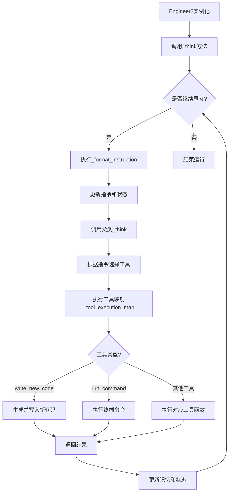
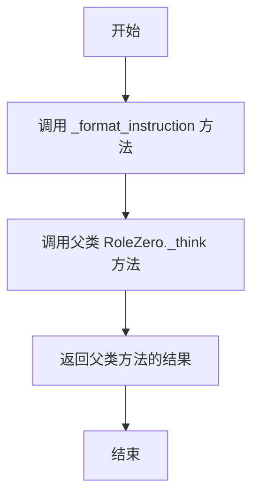
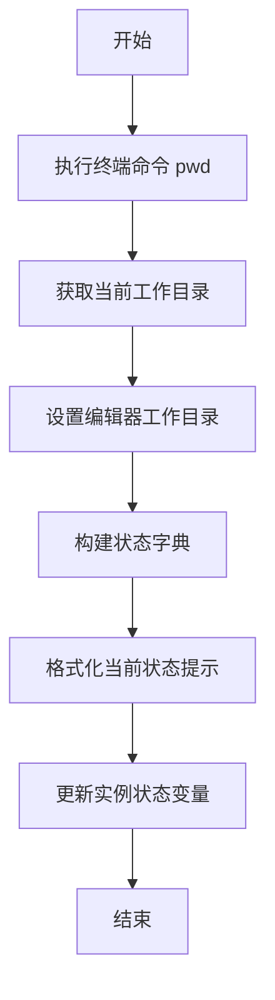
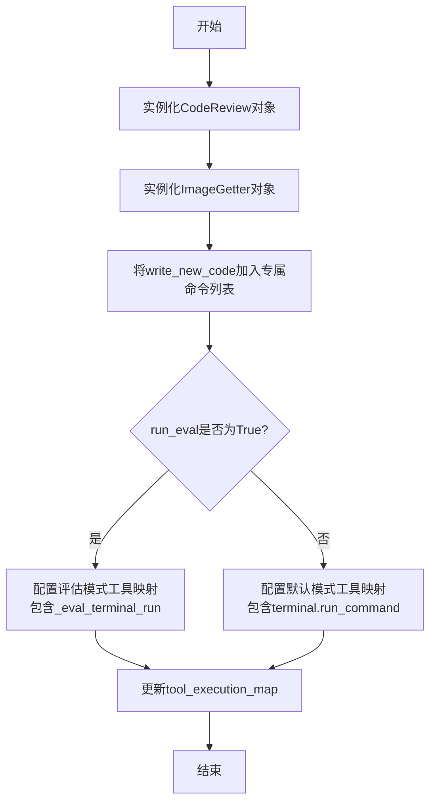
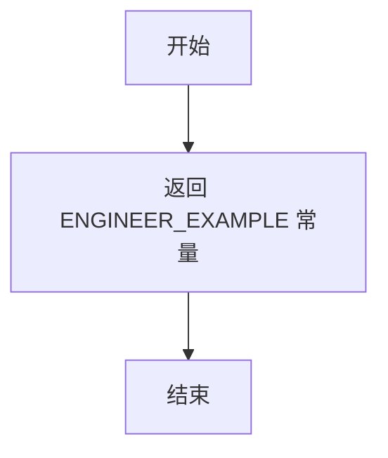
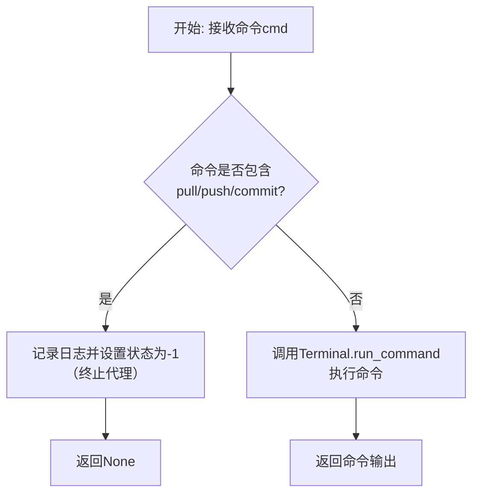
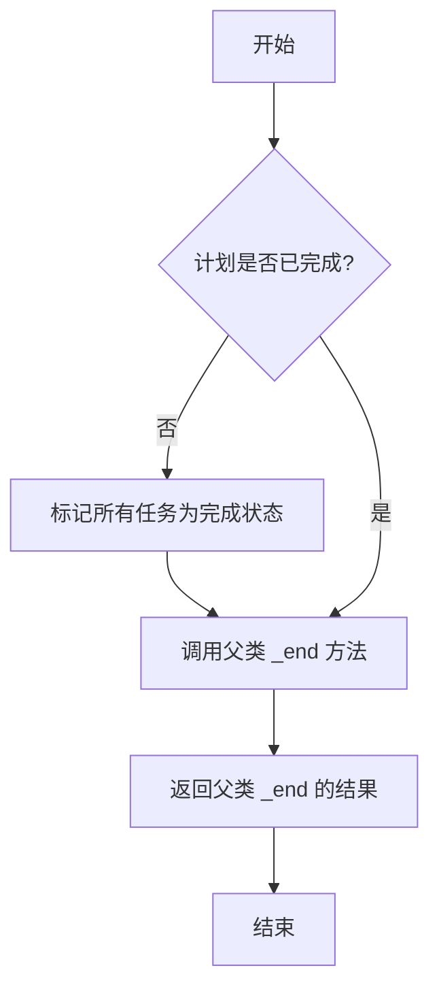

# `.\MetaGPT\metagpt\roles\di\engineer2.py` 详细设计文档

该文件定义了一个名为Engineer2的智能体角色，继承自RoleZero。该角色是一个具备游戏、应用和Web开发及部署能力的工程师。它通过整合多种工具（如终端操作、代码编辑、Git操作、代码审查、图像获取和部署）来执行开发任务，能够根据用户需求编写新代码、运行命令、管理版本控制并进行项目部署。核心功能是作为一个自主的开发助手，通过多轮思考和工具调用来完成复杂的软件开发工作流。

## 整体流程



## 类结构

```
RoleZero (父类)
└── Engineer2 (工程师角色)
    ├── 继承字段: name, profile, goal, instruction, ...
    ├── 特有字段: terminal, deployer, tools, run_eval, ...
    ├── 重写方法: _think, _format_instruction, _update_tool_execution, _retrieve_experience, _end
    └── 新增方法: write_new_code, _deploy_to_public, _eval_terminal_run
```

## 全局变量及字段


### `Engineer2.name`
    
角色的名称，默认为'Alex'，用于标识该工程师代理。

类型：`str`
    


### `Engineer2.profile`
    
角色的职业描述，默认为'Engineer'，定义了代理在系统中的角色类型。

类型：`str`
    


### `Engineer2.goal`
    
角色的核心目标，默认为'Take on game, app, web development and deployment.'，指导代理的行为方向。

类型：`str`
    


### `Engineer2.instruction`
    
角色的详细指令，从外部常量ENGINEER2_INSTRUCTION导入，定义了代理的具体行为准则。

类型：`str`
    


### `Engineer2.terminal`
    
终端工具实例，用于执行命令行操作，通过Field的default_factory进行延迟初始化。

类型：`Terminal`
    


### `Engineer2.deployer`
    
部署工具实例，用于将项目部署到公共环境，通过Field的default_factory进行延迟初始化。

类型：`Deployer`
    


### `Engineer2.tools`
    
代理可使用的工具名称列表，定义了其能力范围，包括计划、编辑、代码审查、部署等。

类型：`list[str]`
    


### `Engineer2.run_eval`
    
评估模式开关，当为True时，会使用特殊的工具执行映射（如_eval_terminal_run）以支持测试流程。

类型：`bool`
    


### `Engineer2.output_diff`
    
输出差异信息，当前代码中未显式使用，可能预留用于存储代码变更或比较结果。

类型：`str`
    


### `Engineer2.max_react_loop`
    
最大反应循环次数，默认为40，用于控制代理在解决问题时的最大迭代次数，防止无限循环。

类型：`int`
    
    

## 全局函数及方法

### `Engineer2._think`

该方法用于执行Engineer2角色的核心思考流程。它首先调用`_format_instruction`方法来格式化指令并更新当前状态，然后调用父类`RoleZero`的`_think`方法执行实际的思考逻辑，并返回其结果。

参数：
- 无显式参数。该方法是一个实例方法，通过`self`访问当前实例的属性和方法。

返回值：`bool`，表示思考过程是否成功完成。

#### 流程图



#### 带注释源码

```python
async def _think(self) -> bool:
    # 步骤1：格式化指令，更新当前终端和编辑器状态
    await self._format_instruction()
    # 步骤2：调用父类RoleZero的_think方法执行核心思考逻辑
    res = await super()._think()
    # 步骤3：返回父类方法的结果
    return res
```

### `Engineer2._format_instruction`

该方法用于格式化指令，动态获取并更新当前终端的工作目录和编辑器状态，并将这些信息整合到命令提示符中，为后续的代码生成或操作提供上下文环境。

参数：
-  `self`：`Engineer2`，当前`Engineer2`类的实例

返回值：`None`，无返回值

#### 流程图



#### 带注释源码

```python
async def _format_instruction(self):
    """
    显示当前的终端和编辑器状态。
    此信息将被动态添加到命令提示符中。
    """
    # 执行终端命令 `pwd` 以获取当前工作目录，并去除首尾空白字符
    current_directory = (await self.terminal.run_command("pwd")).strip()
    
    # 将获取到的当前目录设置为编辑器的工作目录
    self.editor._set_workdir(current_directory)
    
    # 构建一个包含当前编辑器打开文件和当前目录的状态字典
    state = {
        "editor_open_file": self.editor.current_file,
        "current_directory": current_directory,
    }
    
    # 使用状态字典格式化预设的当前状态提示模板，并去除首尾空白字符，
    # 然后将结果赋值给实例变量 `cmd_prompt_current_state`
    self.cmd_prompt_current_state = CURRENT_STATE.format(**state).strip()
```

### `Engineer2._update_tool_execution`

该方法用于更新`Engineer2`角色的工具执行映射表（`tool_execution_map`）。它根据`run_eval`标志的值，配置不同的工具函数映射。当`run_eval`为`True`时，会使用一个特殊的终端命令执行方法（`_eval_terminal_run`）来拦截特定的Git命令（如pull/push/commit）以结束任务；否则，使用默认的终端命令执行方法。此外，该方法还会将`Engineer2.write_new_code`方法添加到专属工具命令列表中。

参数：
- 无

返回值：`None`，无返回值

#### 流程图



#### 带注释源码

```python
def _update_tool_execution(self):
    # 实例化代码审查工具
    cr = CodeReview()
    # 实例化图片获取工具
    image_getter = ImageGetter()
    # 将本类的write_new_code方法添加到专属工具命令列表中
    self.exclusive_tool_commands.append("Engineer2.write_new_code")
    
    # 根据run_eval标志的值，配置不同的工具执行映射
    if self.run_eval is True:
        # 评估模式下的工具映射
        # 此模式下，Terminal.run_command被替换为_eval_terminal_run，
        # 用于拦截特定的Git命令来结束任务流程
        self.tool_execution_map.update(
            {
                "git_create_pull": git_create_pull,
                "Engineer2.write_new_code": self.write_new_code,
                "ImageGetter.get_image": image_getter.get_image,
                "CodeReview.review": cr.review,
                "CodeReview.fix": cr.fix,
                "Terminal.run_command": self._eval_terminal_run, # 特殊处理终端命令
                "RoleZero.ask_human": self._end,
                "RoleZero.reply_to_human": self._end,
                "Deployer.deploy_to_public": self._deploy_to_public,
            }
        )
    else:
        # 默认模式下的工具映射
        # 使用标准的terminal.run_command方法
        self.tool_execution_map.update(
            {
                "git_create_pull": git_create_pull,
                "Engineer2.write_new_code": self.write_new_code,
                "ImageGetter.get_image": image_getter.get_image,
                "CodeReview.review": cr.review,
                "CodeReview.fix": cr.fix,
                "Terminal.run_command": self.terminal.run_command, # 标准终端命令
                "Deployer.deploy_to_public": self._deploy_to_public,
            }
        )
```

### `Engineer2._retrieve_experience`

该方法用于检索并返回预设的工程师经验示例，作为代码生成或问题解决的参考上下文。

参数：
- 无

返回值：`str`，返回一个包含工程师经验示例的字符串常量。

#### 流程图



#### 带注释源码

```python
def _retrieve_experience(self) -> str:
    """
    检索并返回预设的工程师经验示例。
    此方法通常用于为代码生成或任务规划提供参考上下文。
    它直接返回一个从外部模块导入的全局常量。
    """
    # 直接返回从 `metagpt.strategy.experience_retriever` 模块导入的常量
    return ENGINEER_EXAMPLE
```

### `Engineer2.write_new_code`

该方法用于根据用户需求和计划状态，通过LLM生成新的代码文件并保存到指定路径。

参数：
- `path`：`str`，要创建的文件的绝对路径（如果提供的是相对路径，会尝试基于编辑器工作目录修正）
- `file_description`：`str`，文件内容的简要描述和重要说明，必须非常简洁，可以为空字符串

返回值：`str`，返回操作结果信息，格式为："The file {path} has been successfully created, with content:\n{code}"

#### 流程图

```mermaid
flowchart TD
    A[开始: write_new_code] --> B[修正文件路径<br>path = editor._try_fix_path(path)]
    B --> C[获取计划状态<br>plan_status, _ = get_plan_status]
    C --> D[构造LLM提示词<br>prompt = WRITE_CODE_PROMPT.format]
    D --> E[获取对话历史上下文<br>memory = self.rc.memory.get]
    E --> F[格式化LLM消息<br>context = self.llm.format_msg]
    F --> G[创建EditorReporter<br>异步报告文件创建开始]
    G --> H[调用LLM生成代码<br>rsp = await self.llm.aask]
    H --> I[解析代码文本<br>code = CodeParser.parse_code]
    I --> J[异步写入文件<br>await awrite(path, code)]
    J --> K[异步报告文件创建完成]
    K --> L[返回成功信息]
    L --> M[结束]
```

#### 带注释源码

```python
async def write_new_code(self, path: str, file_description: str = "") -> str:
    """Write a new code file.

    Args:
        path (str): The absolute path of the file to be created.
        file_description (optional, str): "Brief description and important notes of the file content, must be very concise and can be empty. Defaults to "".
    """
    # 如果路径不是绝对路径，尝试使用编辑器的工作目录进行修正
    path = self.editor._try_fix_path(path)
    # 获取当前计划的状态
    plan_status, _ = get_plan_status(planner=self.planner)
    # 根据用户需求、计划状态、文件路径和描述等信息构造LLM提示词
    prompt = WRITE_CODE_PROMPT.format(
        user_requirement=self.planner.plan.goal,
        plan_status=plan_status,
        file_path=path,
        file_description=file_description,
        file_name=os.path.basename(path),
    )
    # 从记忆中获取最近的对话历史（排除最后一条，可能是重复指令）
    memory = self.rc.memory.get(self.memory_k)[:-1]
    # 将历史消息和新的提示词组合，格式化为LLM可处理的消息列表
    context = self.llm.format_msg(memory + [UserMessage(content=prompt)])

    # 使用EditorReporter上下文管理器，用于异步报告代码生成过程（支持LLM流式输出）
    async with EditorReporter(enable_llm_stream=True) as reporter:
        # 报告代码文件创建开始，传递文件名和路径等元数据
        await reporter.async_report({"type": "code", "filename": Path(path).name, "src_path": path}, "meta")
        # 调用LLM，传入上下文和系统提示词，获取生成的代码响应
        rsp = await self.llm.aask(context, system_msgs=[WRITE_CODE_SYSTEM_PROMPT])
        # 从LLM响应中解析出纯代码部分
        code = CodeParser.parse_code(text=rsp)
        # 将生成的代码异步写入到指定路径的文件中
        await awrite(path, code)
        # 报告文件创建完成，传递文件路径
        await reporter.async_report(path, "path")

    # TODO: 考虑添加行号信息，为后续的编辑操作做准备。
    # 返回操作成功的消息，包含文件路径和生成的代码内容
    return f"The file {path} has been successfully created, with content:\n{code}"
```

### `Engineer2._deploy_to_public`

该方法用于将Web项目的构建产物（`dist_dir`）部署到公共环境。其核心功能是处理传入的`dist_dir`路径参数，确保其为绝对路径，然后调用`Deployer`实例的`deploy_to_public`方法执行实际的部署操作。

参数：
- `dist_dir`：`str`，Web项目构建后的产物目录路径。此参数应为绝对路径。

返回值：`Any`，返回`self.deployer.deploy_to_public(dist_dir)`的调用结果，具体类型和内容取决于`Deployer.deploy_to_public`方法的实现。

#### 流程图

```mermaid
flowchart TD
    A[开始: _deploy_to_public(dist_dir)] --> B{检查dist_dir是否为绝对路径?};
    B -- 是 --> D[调用deployer.deploy_to_public];
    B -- 否 --> C[尝试使用编辑器工作目录修正路径];
    C --> E{修正后的路径是否存在?};
    E -- 是 --> F[更新dist_dir为修正后的路径];
    F --> D;
    E -- 否 --> G[抛出ValueError异常];
    D --> H[返回部署结果];
    G --> I[结束];
    H --> I;
```

#### 带注释源码

```python
async def _deploy_to_public(self, dist_dir):
    """fix the dist_dir path to absolute path before deploying
    Args:
        dist_dir (str): The dist directory of the web project after run build. This must be an absolute path.
    """
    # 尝试使用编辑器的工作目录来修正路径。
    # 如果传入的dist_dir不是绝对路径，则尝试将其转换为基于编辑器工作目录的绝对路径。
    if not Path(dist_dir).is_absolute():
        default_dir = self.editor._try_fix_path(dist_dir)
        # 如果修正后的路径不存在，则抛出异常，因为部署需要一个有效的目录。
        if not default_dir.exists():
            raise ValueError("dist_dir must be an absolute path.")
        # 将dist_dir更新为修正后的绝对路径。
        dist_dir = default_dir
    # 调用Deployer实例的deploy_to_public方法执行实际的部署操作，并返回其结果。
    return await self.deployer.deploy_to_public(dist_dir)
```

### `Engineer2._eval_terminal_run`

该方法用于在评估模式下拦截并处理特定的终端命令（如 `pull`、`push`、`commit`）。当检测到这些命令时，它会终止当前工程师代理的运行流程，否则正常执行命令并返回输出。

参数：
- `cmd`：`str`，要执行的终端命令字符串。

返回值：`str`，命令执行的输出字符串。如果命令被拦截，则返回 `None`。

#### 流程图



#### 带注释源码

```python
async def _eval_terminal_run(self, cmd):
    """change command pull/push/commit to end."""
    # 检查命令中是否包含特定的Git操作关键词
    if any([cmd_key_word in cmd for cmd_key_word in ["pull", "push", "commit"]]):
        # 如果包含，则记录日志，表示当前测试用例已完成
        logger.info("Engineer2 use cmd:{cmd}\nCurrent test case is finished.")
        # 通过设置内部状态为-1来停止工程师代理的后续运行
        self._set_state(-1)
    else:
        # 如果不包含特定关键词，则正常执行终端命令
        command_output = await self.terminal.run_command(cmd)
    # 返回命令执行结果（如果命令被拦截，则返回None）
    return command_output
```

### `Engineer2._end`

该方法用于结束Engineer2角色的执行流程。它会检查当前计划是否已完成，如果未完成则标记所有任务为完成状态，然后调用父类的`_end`方法执行最终的清理和结束逻辑。

参数：无

返回值：`Awaitable[Any]`，表示异步操作的结果，通常是父类`_end`方法的返回值。

#### 流程图



#### 带注释源码

```python
async def _end(self):
    # 检查当前计划是否已经完成
    if not self.planner.plan.is_plan_finished():
        # 如果计划未完成，则强制将所有任务标记为完成状态
        self.planner.plan.finish_all_tasks()
    # 调用父类 RoleZero 的 _end 方法执行最终的结束逻辑
    return await super()._end()
```

## 关键组件


### Engineer2 类

Engineer2 类是 RoleZero 角色的一个具体实现，专门负责游戏、应用、Web 开发及部署任务。它通过集成多种工具（如终端、代码编辑器、Git、部署器等）和自定义的代码编写、部署逻辑，来执行复杂的软件开发工作流。

### 工具注册与执行映射

通过 `@register_tool` 装饰器将 `Engineer2` 类注册为工具，并定义了两种模式（默认模式和评估模式）下的工具执行映射 (`tool_execution_map`)。该映射将工具名称（如 `"Engineer2.write_new_code"`）与具体的函数或方法绑定，是角色执行动作的核心调度机制。

### 代码编写与文件创建 (`write_new_code`)

一个核心的类方法，用于根据用户需求、计划状态和文件描述，通过大语言模型生成新的代码文件并写入指定路径。它整合了提示词工程、LLM 交互、文件操作和进度报告，是自动化代码生成的关键组件。

### 部署路径处理 (`_deploy_to_public`)

一个内部方法，用于在部署到公共环境前，处理并验证构建产物目录 (`dist_dir`) 的路径。它确保路径是绝对路径，并利用编辑器的上下文进行路径修正，是部署流程中的关键前置步骤。

### 评估模式下的终端命令拦截 (`_eval_terminal_run`)

在评估模式 (`run_eval=True`) 下，此方法会拦截特定的 Git 命令（如 pull, push, commit），并将其视为任务完成的信号，从而优雅地终止工程师角色的执行循环。这是用于自动化测试和评估场景的特殊逻辑。

### 指令动态格式化 (`_format_instruction`)

在每次思考循环前，动态更新指令提示词，将当前工作目录和编辑器打开的文件状态等信息注入到系统提示中，为 LLM 提供最新的上下文环境。

### 经验检索 (`_retrieve_experience`)

从预设的经验库中检索并返回工程师相关的示例，用于在提示词中提供上下文学习（In-Context Learning）的素材，以提升 LLM 生成代码的质量和相关性。


## 问题及建议


### 已知问题

-   **硬编码的工具列表**：`tools` 列表是硬编码的，包含大量工具名称字符串。这降低了代码的灵活性，当需要添加、移除或修改可用工具时，必须直接修改源代码，违反了开闭原则，增加了维护成本。
-   **条件逻辑导致的代码重复**：`_update_tool_execution` 方法中存在基于 `run_eval` 标志的条件分支，导致 `tool_execution_map` 的更新逻辑在两个分支中大量重复（如 `git_create_pull`, `write_new_code` 等）。这不仅增加了代码量，也使得未来对工具映射的修改变得繁琐且容易出错。
-   **路径处理逻辑分散**：路径修正的逻辑分散在多个方法中（如 `write_new_code` 和 `_deploy_to_public` 都调用了 `self.editor._try_fix_path`）。这种重复表明路径处理可能应该被抽象为一个更通用、可复用的服务或工具方法。
-   **潜在的循环依赖风险**：`Engineer2` 类继承自 `RoleZero`，并在 `tools` 列表中包含了 `"Engineer2"` 和 `"RoleZero"`。虽然这可能是一种设计（如用于自省或递归调用），但需要清晰的文档说明其意图，否则容易引起混淆或意外的递归行为。
-   **`_eval_terminal_run` 方法职责模糊**：该方法名称为“评估终端运行”，但其核心逻辑是检测特定命令（pull/push/commit）来终止代理运行。这混淆了“命令执行”和“流程控制”的职责，使得方法的目的不单一，降低了可读性和可维护性。
-   **注释掉的代码**：代码中有一行被注释掉的导入 `# from metagpt.actions.write_code_review import ValidateAndRewriteCode` 和相关代码。这构成了“僵尸代码”，增加了代码库的混乱度，并可能误导开发者。

### 优化建议

-   **将工具列表配置化**：建议将 `tools` 列表从硬编码改为通过配置文件、环境变量或依赖注入的方式进行管理。这样可以实现不同场景（如开发、测试、生产）下工具的灵活配置，无需修改代码。
-   **重构 `_update_tool_execution` 方法**：消除 `run_eval` 分支中的重复代码。可以创建一个基础的工具映射，然后根据 `run_eval` 标志仅覆盖或添加需要特殊处理的方法（如 `Terminal.run_command` 和 `RoleZero` 的相关方法）。这符合 DRY（Don‘t Repeat Yourself）原则。
-   **统一路径处理服务**：考虑创建一个独立的 `PathResolver` 或 `WorkspaceManager` 类，专门负责处理与工作目录相关的路径转换和验证。`Engineer2` 和 `Editor` 等组件可以依赖此服务，从而集中路径处理逻辑，提高一致性和可测试性。
-   **明确自引用工具的意图**：如果 `tools` 列表中的 `"Engineer2"` 和 `"RoleZero"` 是设计所需，应在类文档字符串或关键方法注释中明确说明其用途（例如，用于实现特定的协作模式或任务委派），以避免误解。
-   **拆分 `_eval_terminal_run` 方法**：将流程控制逻辑（检测终止命令并设置状态）与命令执行逻辑分离。可以创建一个独立的 `_check_for_termination` 方法或在 `_think` 循环中增加检查点。让 `_eval_terminal_run` 只负责执行命令并返回结果，使其职责更清晰。
-   **清理注释代码**：立即移除被注释掉的 `ValidateAndRewriteCode` 相关代码行。如果该功能未来可能被需要，应通过版本控制系统（如 Git）的历史记录来追溯，而不是保留无效的注释。
-   **增强错误处理与日志**：在 `_deploy_to_public` 等方法中，当路径无效时，除了抛出 `ValueError`，可以记录更详细的错误上下文（如当前工作目录、传入的路径值）。在 `_eval_terminal_run` 中，终止代理时的日志信息可以更结构化，便于监控和调试。


## 其它


### 设计目标与约束

本模块 `Engineer2` 是 `RoleZero` 的一个具体实现，旨在作为一个具备完整开发、部署能力的智能体（Agent）。其核心设计目标是在一个交互式环境中，根据高层计划（Plan）和用户需求，自主执行代码编写、文件操作、终端命令执行、代码审查、版本控制（Git操作）、静态资源获取以及项目部署等一系列软件开发任务。主要约束包括：1) 必须在 `RoleZero` 框架定义的思考-行动循环内工作；2) 工具执行依赖于外部注册的工具函数和类方法；3) 代码生成和部分决策依赖于大语言模型（LLM）；4) 运行环境需要支持异步操作。

### 错误处理与异常设计

模块中的错误处理主要采用以下策略：
1.  **路径处理**：在 `write_new_code` 和 `_deploy_to_public` 方法中，对输入的相对路径尝试使用编辑器工作目录进行修正（`_try_fix_path`）。若修正后路径仍不存在或为非绝对路径，`_deploy_to_public` 会抛出 `ValueError`。
2.  **工具执行异常**：工具执行映射（`tool_execution_map`）中的函数（如 `Terminal.run_command`, `git_create_pull`）可能抛出执行异常（如命令执行失败、Git操作错误）。这些异常会向上传播，由 `RoleZero` 的 `_act` 循环或调用者处理。`_eval_terminal_run` 方法通过捕获特定命令（pull/push/commit）来主动终止任务，这是一种基于业务逻辑的流程控制，而非错误处理。
3.  **LLM交互异常**：`llm.aask` 调用可能因网络或模型问题失败，异常会向上抛出。
4.  **静默日志**：部分操作（如 `_eval_terminal_run` 中的流程终止）通过 `logger.info` 记录，但不中断程序流。

整体上，错误处理是防御性的（如路径检查），但多数外部依赖的异常处理职责被委托给了调用链上层或外部工具。

### 数据流与状态机

1.  **主数据流**：
    *   **输入**：继承自 `RoleZero`，主要输入是 `UserMessage` 形式的需求或指令，以及通过 `planner` 属性传递的详细开发计划（`Plan` 对象）。
    *   **处理**：在 `_think` 方法中，动态格式化指令，整合当前工作目录和编辑器状态。思考过程由父类 `RoleZero` 控制，决定下一步要执行哪个工具。
    *   **行动**：通过 `tool_execution_map` 查找并执行对应的工具函数。核心工具 `write_new_code` 会结合计划状态、文件路径和描述，构造提示词调用 LLM 生成代码，并写入文件。
    *   **输出**：工具执行的字符串结果（如成功消息、命令输出、生成的代码内容）作为行动的输出，存入记忆（`memory`），并可能影响后续的思考-行动循环。最终输出是完成计划任务或达到终止状态。

2.  **状态机**：
    *   本类本身没有显式的状态枚举，但继承了 `RoleZero` 的状态管理机制（如 `_set_state`）。
    *   关键状态转换触发点：
        *   `_eval_terminal_run`：当检测到 `git` 的 `pull`/`push`/`commit` 命令时，调用 `_set_state(-1)`，意图将智能体状态设置为终止，从而结束当前任务循环。
        *   `_end`：当调用 `ask_human` 或 `reply_to_human` 工具时触发，会检查计划是否完成，若未完成则标记所有任务为完成，然后调用父类的 `_end` 方法。
    *   状态信息嵌入：当前工作目录和打开的文件状态通过 `_format_instruction` 动态更新到 `cmd_prompt_current_state`，作为上下文的一部分影响 LLM 的决策。

### 外部依赖与接口契约

1.  **父类/框架依赖**：强依赖于 `RoleZero` 基类，必须实现 `_think`, `_update_tool_execution`, `_retrieve_experience` 等方法，并遵循其智能体运行生命周期。
2.  **LLM 服务**：依赖 `self.llm` 对象（通过 `RoleZero` 继承）提供 `aask` 和 `format_msg` 方法，用于生成代码和格式化消息。契约是返回可解析的文本响应。
3.  **工具注册与发现**：依赖 `@register_tool` 装饰器和 `metagpt.tools.tool_registry` 机制，将 `Engineer2` 类及其 `write_new_code` 方法注册为可用工具。
4.  **工具函数依赖**：
    *   `Terminal`, `Deployer`, `CodeReview`, `ImageGetter`：作为类字段或局部实例化，提供具体能力（命令执行、部署、代码审查、图片获取）。契约是其公开的方法（如 `run_command`, `deploy_to_public`, `review`, `get_image`）可被异步调用并返回预期结果。
    *   `git_create_pull`：作为全局函数导入，需符合 `tool_execution_map` 中定义的调用签名。
    *   `Editor`：通过继承的 `self.editor` 访问，提供 `_set_workdir`, `_try_fix_path`, `current_file` 等属性和方法。
5.  **数据模型/配置依赖**：
    *   `pydantic.Field`：用于字段定义和序列化控制（`exclude`）。
    *   来自 `metagpt.prompts.di.engineer2` 的提示词模板（`CURRENT_STATE`, `ENGINEER2_INSTRUCTION`, `WRITE_CODE_PROMPT`, `WRITE_CODE_SYSTEM_PROMPT`）。
    *   来自 `metagpt.strategy.experience_retriever` 的示例字符串 `ENGINEER_EXAMPLE`。
6.  **工具执行映射契约**：`_update_tool_execution` 方法定义了 `self.tool_execution_map`。这是一个关键接口契约，键为工具名称字符串，值为可调用对象。这些可调用对象必须接受定义的参数并返回字符串结果。`run_eval` 标志位切换了 `Terminal.run_command` 和 `RoleZero` 部分工具的具体实现。
7.  **文件系统**：依赖 `os`, `pathlib.Path` 进行路径操作和文件读写。
8.  **异步运行时**：依赖 `asyncio` 或兼容的异步环境，所有主要方法均为 `async`。

### 配置与参数化

1.  **类属性参数**：
    *   `name`, `profile`, `goal`, `instruction`：定义了智能体的基本身份和行为指南。
    *   `tools`：声明了本智能体可以访问和请求使用的工具列表。这是一个声明式配置，实际执行能力由 `_update_tool_execution` 中构建的 `tool_execution_map` 决定。
    *   `run_eval`：布尔标志，用于切换“评估模式”。在评估模式下，`Terminal.run_command` 被替换为 `_eval_terminal_run`，并对 `ask_human` 和 `reply_to_human` 工具进行了特殊映射，旨在测试场景下自动终止任务。
    *   `max_react_loop`：从 `RoleZero` 继承，限制思考-行动循环的最大次数。
2.  **实例字段参数**：
    *   `terminal`, `deployer`：通过 `Field(default_factory=...)` 配置，在实例化时自动创建。`exclude=True` 确保它们不被序列化。
3.  **运行时参数**：
    *   `planner.plan`：外部传入的计划对象，其状态（`plan_status`）和总体目标（`goal`）被 `write_new_code` 方法用作生成代码的上下文。
    *   `editor._workdir` 和 `current_file`：通过 `_format_instruction` 动态捕获并用于构建提示词。

### 安全考虑

1.  **命令执行**：`Terminal.run_command` 执行任意 shell 命令，存在命令注入风险。风险缓解依赖于：a) 智能体（LLM）决策的可靠性；b) 在评估模式（`_eval_terminal_run`）下对特定 Git 命令的拦截仅用于流程控制，而非安全过滤。在生产环境中，应对可执行的命令范围进行严格限制或沙箱化。
2.  **路径安全**：`write_new_code` 和 `_deploy_to_public` 中对路径进行解析和“修复”，存在路径遍历攻击的风险（如使用 `../../../etc/passwd`）。`_try_fix_path` 的内部实现至关重要，但代码中未展示。应确保其将路径规范在项目工作区内。
3.  **部署操作**：`_deploy_to_public` 调用 `Deployer.deploy_to_public`，可能涉及将目录内容发布到公共网络。需要确保 `dist_dir` 目录内容的正确性和安全性，避免泄露敏感信息或部署恶意代码。
4.  **外部内容获取**：`ImageGetter.get_image` 可能从网络下载图片，需防范恶意URL或内容。
5.  **依赖与供应链**：所有导入的库（如 `pydantic`, 自定义的 `metagpt.*` 模块）需要保持更新，以避免已知漏洞。


    