# `.\MetaGPT\metagpt\roles\di\role_zero.py` 详细设计文档

该代码定义了一个名为 RoleZero 的高级智能体角色，它继承自基础 Role 类，具备动态思考（React模式）、工具使用、经验检索、长期记忆和任务规划等能力。RoleZero 能够理解用户需求，通过LLM决策调用合适的工具（如浏览器、编辑器、终端命令等）来执行任务，支持与人类交互（询问和回复），并能从经验池中学习以优化未来的决策。

## 整体流程

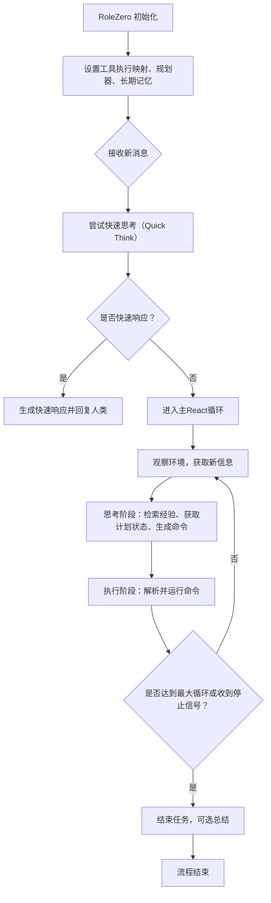

## 类结构

```
Role (基类)
└── RoleZero (动态思考与执行角色)
    ├── 内部组件:
    │   ├── Planner (任务规划器)
    │   ├── Editor (编辑器工具)
    │   ├── Browser (浏览器工具)
    │   ├── ToolRecommender (工具推荐器)
    │   ├── ExpRetriever (经验检索器)
    │   └── RoleZeroLongTermMemory (长期记忆)
    └── 关联工具类:
        ├── RunCommand
        ├── SearchEnhancedQA
        └── 其他通过tool_execution_map注册的工具
```

## 全局变量及字段


### `RoleZero.name`
    
角色的名称，默认为'Zero'。

类型：`str`
    


### `RoleZero.profile`
    
角色的简介或标签，默认为'RoleZero'。

类型：`str`
    


### `RoleZero.goal`
    
角色的目标描述，初始为空字符串。

类型：`str`
    


### `RoleZero.system_msg`
    
系统消息列表，用于LLM交互，默认为None以符合llm.aask的默认值。

类型：`Optional[list[str]]`
    


### `RoleZero.system_prompt`
    
系统提示词模板，用于构建LLM的系统指令。

类型：`str`
    


### `RoleZero.cmd_prompt`
    
命令生成提示词模板，用于指导LLM生成下一步操作命令。

类型：`str`
    


### `RoleZero.cmd_prompt_current_state`
    
当前状态描述，用于填充cmd_prompt模板。

类型：`str`
    


### `RoleZero.instruction`
    
角色指令，描述角色的核心行为准则。

类型：`str`
    


### `RoleZero.task_type_desc`
    
任务类型描述，用于在系统提示中提供更具体的上下文。

类型：`Optional[str]`
    


### `RoleZero.react_mode`
    
反应模式，固定为'react'，表示使用思考-行动循环。

类型：`Literal['react']`
    


### `RoleZero.max_react_loop`
    
最大反应循环次数，用于限制思考-行动循环的执行轮数。

类型：`int`
    


### `RoleZero.tools`
    
可用工具名称列表，使用特殊符号['<all>']表示使用所有已注册工具。

类型：`list[str]`
    


### `RoleZero.tool_recommender`
    
工具推荐器实例，用于根据上下文推荐合适的工具。

类型：`Optional[ToolRecommender]`
    


### `RoleZero.tool_execution_map`
    
工具执行映射字典，将工具命令名映射到对应的可调用函数。

类型：`Annotated[dict[str, Callable], Field(exclude=True)]`
    


### `RoleZero.special_tool_commands`
    
特殊工具命令列表，这些命令需要特殊处理或解析。

类型：`list[str]`
    


### `RoleZero.exclusive_tool_commands`
    
互斥工具命令列表，如果出现多个实例，只保留第一个。

类型：`list[str]`
    


### `RoleZero.editor`
    
编辑器工具实例，默认启用自动代码格式化。

类型：`Editor`
    


### `RoleZero.browser`
    
浏览器工具实例，用于网页交互操作。

类型：`Browser`
    


### `RoleZero.experience_retriever`
    
经验检索器实例，用于从经验池中检索相关历史经验。

类型：`Annotated[ExpRetriever, Field(exclude=True)]`
    


### `RoleZero.observe_all_msg_from_buffer`
    
是否从缓冲区观察所有消息，控制消息观察的范围。

类型：`bool`
    


### `RoleZero.command_rsp`
    
包含命令的原始字符串响应，来自LLM的输出。

类型：`str`
    


### `RoleZero.commands`
    
待执行的命令列表，每个命令是一个字典。

类型：`list[dict]`
    


### `RoleZero.memory_k`
    
用作历史上下文的记忆（消息）数量。

类型：`int`
    


### `RoleZero.use_fixed_sop`
    
是否使用固定的标准操作流程（SOP），如果为True则使用父类的_think和_act方法。

类型：`bool`
    


### `RoleZero.respond_language`
    
用于回复人类和发布消息的语言。

类型：`str`
    


### `RoleZero.use_summary`
    
是否在任务结束时进行总结。

类型：`bool`
    
    

## 全局函数及方法

### `RoleZero.set_plan_and_tool`

`RoleZero.set_plan_and_tool` 是 `RoleZero` 类的一个模型验证器方法，在模型初始化后自动调用。它的核心功能是初始化 `RoleZero` 实例的“反应模式”（react mode）、工具推荐器（tool recommender）、基础动作（Action）以及一个内部的规划器（Planner），为后续的动态思考和行动循环做好准备。

参数：
- `self`：`RoleZero`，`RoleZero` 类的当前实例。

返回值：`RoleZero`，返回配置完成后的 `RoleZero` 实例自身。

#### 流程图

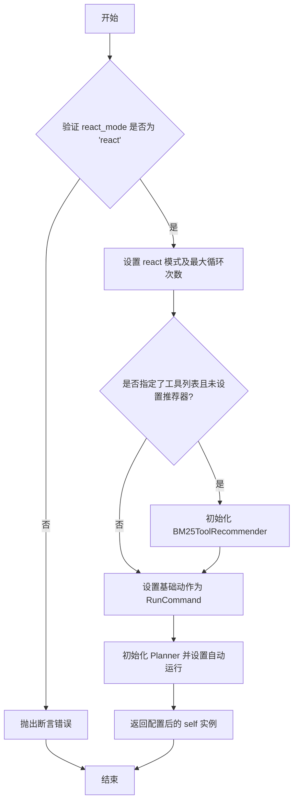

#### 带注释源码

```python
    @model_validator(mode="after")
    def set_plan_and_tool(self) -> "RoleZero":
        # We force using this parameter for DataAnalyst
        # 1. 强制验证 react_mode 必须为 'react'，这是 RoleZero 的工作模式
        assert self.react_mode == "react"

        # Roughly the same part as DataInterpreter.set_plan_and_tool
        # 2. 调用父类方法设置 react 模式及其最大循环次数
        self._set_react_mode(react_mode=self.react_mode, max_react_loop=self.max_react_loop)
        # 3. 如果提供了工具列表但没有设置工具推荐器，则初始化一个 BM25 推荐器
        if self.tools and not self.tool_recommender:
            self.tool_recommender = BM25ToolRecommender(tools=self.tools, force=True)
        # 4. 设置角色的基础动作为 RunCommand，这是执行工具命令的核心动作
        self.set_actions([RunCommand])

        # HACK: Init Planner, control it through dynamic thinking; Consider formalizing as a react mode
        # 5. 初始化一个 Planner 实例，用于在动态思考过程中管理任务规划。
        #    它使用角色的工作内存，并设置为自动运行模式。
        self.planner = Planner(goal="", working_memory=self.rc.working_memory, auto_run=True)

        # 6. 返回配置好的实例自身，以支持链式调用或 Pydantic 的验证流程
        return self
```

### `RoleZero.set_tool_execution`

该方法是一个模型验证器，在`RoleZero`类实例化后自动调用。它的核心功能是初始化并配置`tool_execution_map`字典，该字典将工具命令字符串映射到实际可调用的函数或方法，为后续的命令执行提供基础。它首先设置一个默认的映射（包含计划管理和人机交互工具），然后根据配置（如是否启用搜索）和内置工具（浏览器和编辑器）动态扩展该映射，最后调用一个可被子类覆盖的更新方法。

参数：
-  `self`：`RoleZero`，`RoleZero`类的实例

返回值：`RoleZero`，返回配置好的`RoleZero`实例自身

#### 流程图

```mermaid
flowchart TD
    A[开始 set_tool_execution] --> B[初始化默认工具执行映射<br>包含计划管理和人机交互工具]
    B --> C{配置启用搜索?}
    C -- 是 --> D[将SearchEnhancedQA.run加入映射]
    C -- 否 --> E
    D --> E[遍历浏览器工具方法列表<br>将Browser.{method}加入映射]
    E --> F[遍历编辑器工具方法列表<br>将Editor.{method}加入映射]
    F --> G[调用_update_tool_execution<br>允许子类扩展映射]
    G --> H[返回self]
```

#### 带注释源码

```python
    @model_validator(mode="after")
    def set_tool_execution(self) -> "RoleZero":
        # default map
        # 1. 初始化默认的工具执行映射。
        # 包含计划管理（Plan.*）和角色自身的人机交互方法（ask_human, reply_to_human）。
        self.tool_execution_map = {
            "Plan.append_task": self.planner.plan.append_task,
            "Plan.reset_task": self.planner.plan.reset_task,
            "Plan.replace_task": self.planner.plan.replace_task,
            "RoleZero.ask_human": self.ask_human,
            "RoleZero.reply_to_human": self.reply_to_human,
        }
        # 2. 根据配置决定是否添加搜索工具。
        if self.config.enable_search:
            self.tool_execution_map["SearchEnhancedQA.run"] = SearchEnhancedQA().run
        # 3. 动态添加浏览器工具的方法到映射中。
        # 遍历预定义的浏览器方法列表，通过getattr获取方法对象并存入映射。
        self.tool_execution_map.update(
            {
                f"Browser.{i}": getattr(self.browser, i)
                for i in [
                    "click",
                    "close_tab",
                    "go_back",
                    "go_forward",
                    "goto",
                    "hover",
                    "press",
                    "scroll",
                    "tab_focus",
                    "type",
                ]
            }
        )
        # 4. 动态添加编辑器工具的方法到映射中。
        # 遍历预定义的编辑器方法列表，通过getattr获取方法对象并存入映射。
        self.tool_execution_map.update(
            {
                f"Editor.{i}": getattr(self.editor, i)
                for i in [
                    "append_file",
                    "create_file",
                    "edit_file_by_replace",
                    "find_file",
                    "goto_line",
                    "insert_content_at_line",
                    "open_file",
                    "read",
                    "scroll_down",
                    "scroll_up",
                    "search_dir",
                    "search_file",
                    "similarity_search",
                    # "set_workdir",
                    "write",
                ]
            }
        )
        # 5. 调用一个可被子类覆盖的方法，为子类提供扩展工具映射的入口。
        # can be updated by subclass
        self._update_tool_execution()
        # 6. 返回配置好的实例自身，符合Pydantic模型验证器的要求。
        return self
```

### `RoleZero.set_longterm_memory`

这是一个 Pydantic 模型验证器方法，在 `RoleZero` 类实例化后自动调用。它的核心功能是根据配置决定是否为角色启用长时记忆（Long-Term Memory, LTM）。如果启用，它会使用配置中的参数初始化一个 `RoleZeroLongTermMemory` 实例，并将其设置为角色的记忆系统，从而替换掉默认的短期记忆。

参数：
-  `self`：`RoleZero`，当前 `RoleZero` 类的实例。

返回值：`RoleZero`，返回配置了长时记忆（如果启用）后的 `RoleZero` 实例自身。

#### 流程图

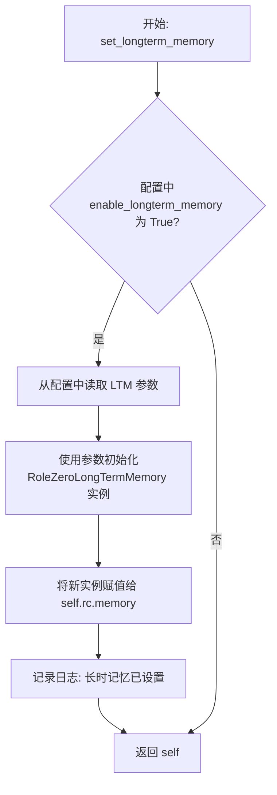

#### 带注释源码

```python
    @model_validator(mode="after")
    def set_longterm_memory(self) -> "RoleZero":
        """Set up long-term memory for the role if enabled in the configuration.

        If `enable_longterm_memory` is True, set up long-term memory.
        The role name will be used as the collection name.
        """

        # 检查配置中是否启用了长时记忆功能
        if self.config.role_zero.enable_longterm_memory:
            # 使用配置中的参数初始化长时记忆
            # **self.rc.memory.model_dump() 用于继承原有记忆的配置
            self.rc.memory = RoleZeroLongTermMemory(
                **self.rc.memory.model_dump(),
                persist_path=self.config.role_zero.longterm_memory_persist_path, # 持久化路径
                collection_name=self.name.replace(" ", ""), # 集合名称，使用角色名（去除空格）
                memory_k=self.config.role_zero.memory_k, # 记忆检索数量
                similarity_top_k=self.config.role_zero.similarity_top_k, # 相似度检索Top K
                use_llm_ranker=self.config.role_zero.use_llm_ranker, # 是否使用LLM重排序
            )
            # 记录初始化成功的日志
            logger.info(f"Long-term memory set for role '{self.name}'")

        # 返回实例自身，这是 Pydantic model_validator 的要求
        return self
```

### `RoleZero._update_tool_execution`

该方法是一个空实现，旨在被子类重写，用于更新或扩展 `RoleZero` 实例的 `tool_execution_map` 字典。`tool_execution_map` 是一个将工具命令名称映射到实际可调用函数或方法的字典。默认情况下，`RoleZero` 在 `set_tool_execution` 方法中初始化了一个包含基础工具（如浏览器、编辑器操作）和特殊命令（如询问人类）的映射。`_update_tool_execution` 方法为子类提供了一个钩子，可以在不修改父类核心逻辑的情况下，添加、移除或修改这个映射中的条目，从而实现自定义的工具执行逻辑。

参数：
- `self`：`RoleZero`，当前 `RoleZero` 类的实例。

返回值：`None`，该方法不返回任何值。

#### 流程图

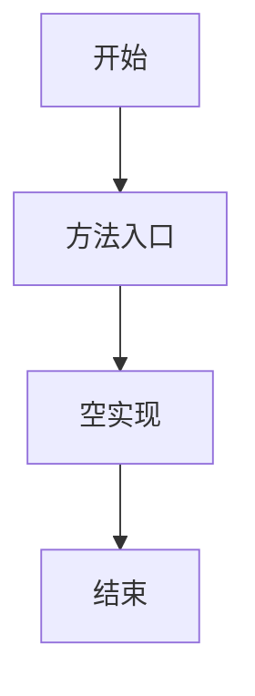

#### 带注释源码

```python
    def _update_tool_execution(self):
        # 这是一个空方法，作为钩子供子类重写。
        # 子类可以在此方法中修改 self.tool_execution_map 字典，
        # 例如添加新的工具命令映射或覆盖现有的映射。
        pass
```

### `RoleZero._think`

`RoleZero._think` 方法是 `RoleZero` 角色的核心决策引擎，在“react”模式下运行。它负责根据当前上下文（包括目标、计划状态、可用工具和历史经验）动态决定下一步行动。该方法通过整合经验检索、计划状态评估、工具推荐和LLM推理，生成一个包含后续要执行命令的响应字符串。如果启用了固定SOP（标准操作程序），则回退到父类的 `_think` 方法。

参数：

-  `self`：`RoleZero` 实例，表示当前角色对象。

返回值：`bool`，表示是否成功生成了待执行命令（即 `self.rc.todo` 是否被设置）。返回 `True` 表示已生成命令，可以进入 `_act` 阶段；返回 `False` 表示没有待处理任务，循环应终止。

#### 流程图

```mermaid
flowchart TD
    A[开始 _think] --> B{是否启用固定SOP?}
    B -->|是| C[调用父类 super()._think]
    B -->|否| D{self.rc.todo 是否为空?}
    D -->|是| E[返回 False]
    D -->|否| F[### 0. 准备阶段 ###]
    F --> F1[初始化 Planner 目标]
    F1 --> F2[检测并设置响应语言]
    F --> G[### 1. 经验检索 ###]
    G --> G1[调用 _retrieve_experience 获取示例]
    G --> H[### 2. 计划状态 ###]
    H --> H1[调用 get_plan_status 获取状态和当前任务]
    G --> I[### 3. 工具/命令信息 ###]
    I --> I1[通过 tool_recommender 推荐工具]
    I1 --> I2[构建工具信息 JSON]
    G --> J[### 角色指令与系统提示 ###]
    J --> J1[格式化系统提示 system_prompt]
    G --> K[### 动态决策 ###]
    K --> K1[格式化决策提示 cmd_prompt]
    G --> L[### 近期观察 ###]
    L --> L1[获取最近 memory_k 条记忆]
    L1 --> L2[解析浏览器动作]
    L2 --> L3[解析编辑器结果]
    L3 --> L4[解析图像信息]
    G --> M[### LLM 推理与报告 ###]
    M --> M1[使用 ThoughtReporter 报告“react”类型]
    M1 --> M2[调用 llm_cached_aask 获取命令响应 command_rsp]
    G --> N[### 响应去重检查 ###]
    N --> N1[调用 check_duplicates 避免重复响应]
    N1 --> O[返回 True]
    C --> P[返回父类 _think 的结果]
    E --> Q[结束]
    O --> Q
    P --> Q
```

#### 带注释源码

```python
async def _think(self) -> bool:
    """Useful in 'react' mode. Use LLM to decide whether and what to do next."""
    # 兼容性检查：如果启用了固定SOP，则直接使用父类的_think逻辑
    if self.use_fixed_sop:
        return await super()._think()

    ### 0. Preparation ###
    # 检查是否有待处理的任务（todo），如果没有则直接返回False，结束思考循环
    if not self.rc.todo:
        return False

    # 如果Planner的目标尚未设置，则从最新的一条记忆（通常是用户需求）中获取并设置为目标
    if not self.planner.plan.goal:
        self.planner.plan.goal = self.get_memories()[-1].content
        # 根据目标检测用户偏好的响应语言（如中文、英文）
        detect_language_prompt = DETECT_LANGUAGE_PROMPT.format(requirement=self.planner.plan.goal)
        self.respond_language = await self.llm.aask(detect_language_prompt)
    ### 1. Experience ###
    # 从经验池中检索与当前上下文相关的历史经验示例，以指导本次决策
    example = self._retrieve_experience()

    ### 2. Plan Status ###
    # 获取当前计划的整体状态和正在执行的具体任务，用于构建决策上下文
    plan_status, current_task = get_plan_status(planner=self.planner)

    ### 3. Tool/Command Info ###
    # 根据当前上下文，通过工具推荐器获取最可能用到的工具列表
    tools = await self.tool_recommender.recommend_tools()
    # 将工具信息（名称和模式）序列化为JSON字符串，供LLM参考
    tool_info = json.dumps({tool.name: tool.schemas for tool in tools})

    ### Role Instruction ###
    # 清理角色指令，并格式化系统提示，注入角色信息、任务类型描述、可用命令、经验示例和指令
    instruction = self.instruction.strip()
    system_prompt = self.system_prompt.format(
        role_info=self._get_prefix(),
        task_type_desc=self.task_type_desc,
        available_commands=tool_info,
        example=example,
        instruction=instruction,
    )

    ### Make Decision Dynamically ###
    # 格式化决策提示，包含当前状态、计划状态、当前任务和响应语言
    prompt = self.cmd_prompt.format(
        current_state=self.cmd_prompt_current_state,
        plan_status=plan_status,
        current_task=current_task,
        respond_language=self.respond_language,
    )

    ### Recent Observation ###
    # 获取最近的`memory_k`条历史消息作为上下文
    memory = self.rc.memory.get(self.memory_k)
    # 对记忆进行后处理：解析浏览器动作、编辑器操作结果和图像信息，使其对LLM更友好
    memory = await parse_browser_actions(memory, browser=self.browser)
    memory = await parse_editor_result(memory)
    memory = await parse_images(memory, llm=self.llm)

    # 将处理后的记忆和决策提示组合成LLM请求格式
    req = self.llm.format_msg(memory + [UserMessage(content=prompt)])
    # 准备用于经验缓存的状态数据
    state_data = dict(
        plan_status=plan_status,
        current_task=current_task,
        instruction=instruction,
    )
    # 使用ThoughtReporter来报告“react”类型的思考过程，并可能启用LLM流式输出
    async with ThoughtReporter(enable_llm_stream=True) as reporter:
        await reporter.async_report({"type": "react"})
        # 调用带有经验缓存的LLM问答，获取包含下一步命令的响应字符串
        self.command_rsp = await self.llm_cached_aask(req=req, system_msgs=[system_prompt], state_data=state_data)

    # 获取全部历史响应，用于去重检查，避免LLM产生重复或循环的指令
    rsp_hist = [mem.content for mem in self.rc.memory.get()]
    self.command_rsp = await check_duplicates(
        req=req,
        command_rsp=self.command_rsp,
        rsp_hist=rsp_hist,
        llm=self.llm,
        respond_language=self.respond_language,
    )

    # 成功生成命令，返回True，驱动角色进入执行（_act）阶段
    return True
```

### `RoleZero.llm_cached_aask`

该方法是一个经过经验缓存增强的异步方法，用于向大语言模型（LLM）发起提问。它通过`exp_cache`装饰器自动管理经验池，在请求时，`RoleZeroContextBuilder`会尝试从经验池中检索并添加相关经验到请求上下文中，而`RoleZeroSerializer`则负责提取请求中的关键部分存入经验池，以优化后续相似请求的响应。

参数：

-   `req`：`list[dict]`，包含用户消息等内容的请求列表。
-   `system_msgs`：`list[str]`，发送给LLM的系统提示信息列表。
-   `**kwargs`：`Any`，其他关键字参数，用于传递给底层的`exp_cache`装饰器。

返回值：`str`，LLM返回的文本响应。

#### 流程图

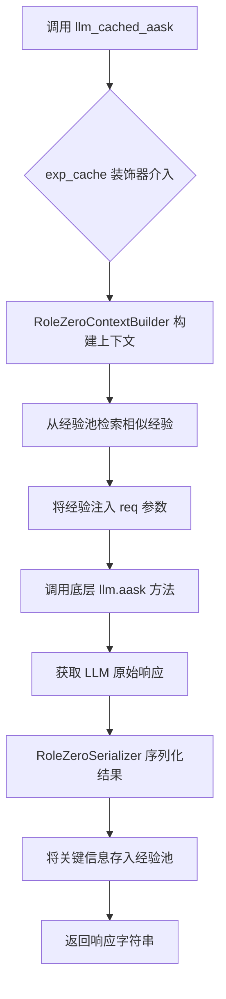

#### 带注释源码

```python
@exp_cache(context_builder=RoleZeroContextBuilder(), serializer=RoleZeroSerializer())
async def llm_cached_aask(self, *, req: list[dict], system_msgs: list[str], **kwargs) -> str:
    """Use `exp_cache` to automatically manage experiences.

    The `RoleZeroContextBuilder` attempts to add experiences to `req`.
    The `RoleZeroSerializer` extracts essential parts of `req` for the experience pool, trimming lengthy entries to retain only necessary parts.
    """
    # 调用父类或角色实例中的 llm.aask 方法，传入经过经验增强的请求和系统消息。
    return await self.llm.aask(req, system_msgs=system_msgs)
```

### `RoleZero._get_prefix`

该方法用于生成角色前缀信息，在基础角色前缀的基础上追加当前时间信息，以提供更丰富的上下文。

参数：

- `self`：`RoleZero`，当前`RoleZero`类的实例

返回值：`str`，包含基础角色信息和当前时间戳的字符串

#### 流程图

```mermaid
flowchart TD
    A[开始] --> B[调用父类方法<br>super()._get_prefix]
    B --> C[获取当前时间<br>datetime.now().strftime]
    C --> D[拼接基础前缀与时间信息]
    D --> E[返回完整前缀字符串]
    E --> F[结束]
```

#### 带注释源码

```python
def _get_prefix(self) -> str:
    # 获取格式化的当前时间字符串，格式为“年-月-日 时:分:秒”
    time_info = datetime.now().strftime("%Y-%m-%d %H:%M:%S")
    # 调用父类 Role 的 _get_prefix 方法获取基础角色信息，并拼接时间信息后返回
    return super()._get_prefix() + f" The current time is {time_info}."
```

### `RoleZero._act`

`RoleZero._act` 方法是 `RoleZero` 角色的核心执行方法，负责解析并执行由 `_think` 方法生成的命令列表。它首先解析命令响应字符串，将其转换为结构化的命令列表，然后依次执行这些命令。对于特殊命令（如结束任务、询问人类等），会进行特殊处理；对于常规工具命令，则通过 `tool_execution_map` 映射调用相应的工具函数。执行结果会被记录到角色的记忆中，并返回一个表示任务完成的 `AIMessage`。

参数：

- `self`：`RoleZero` 实例，表示当前角色对象。

返回值：`Message`，返回一个 `AIMessage` 对象，内容为任务完成的通知和命令执行的输出摘要。

#### 流程图

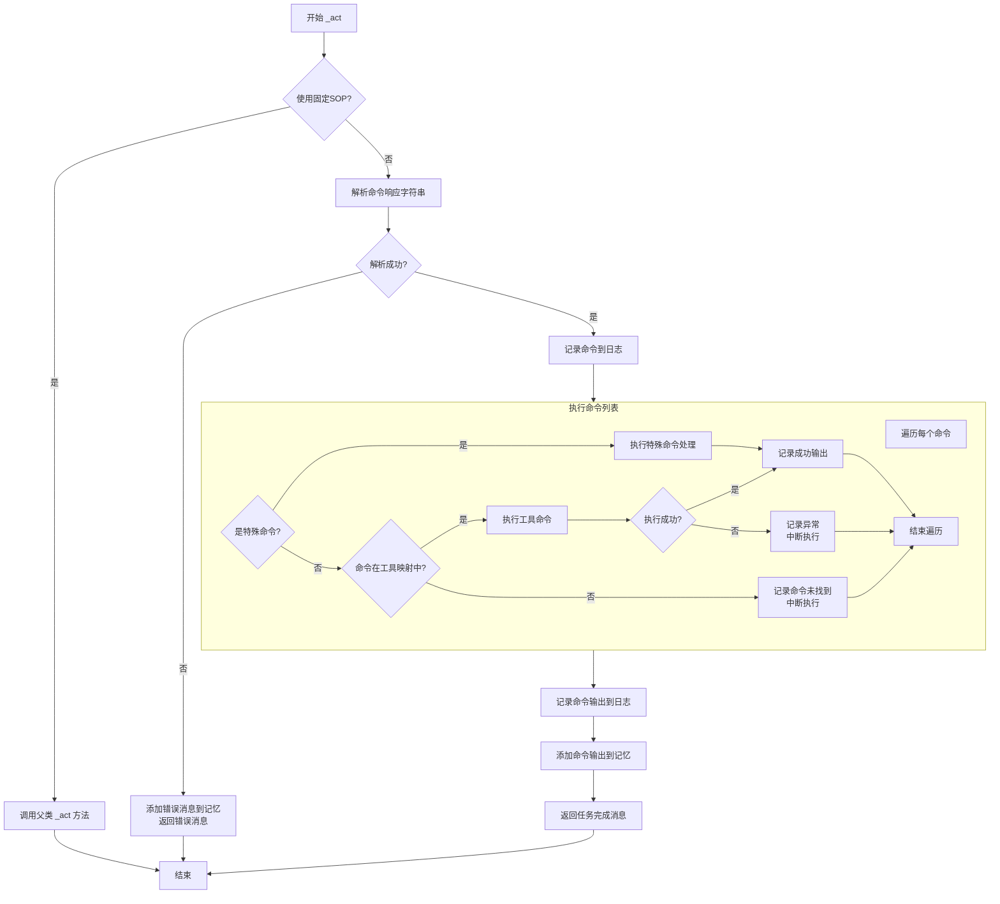

#### 带注释源码

```python
async def _act(self) -> Message:
    # 检查是否使用固定的标准操作流程（SOP）
    if self.use_fixed_sop:
        # 如果是，则调用父类 Role 的 _act 方法
        return await super()._act()

    # 1. 解析命令响应字符串
    # 使用 parse_commands 函数将 self.command_rsp 字符串解析为结构化的命令列表
    # 同时检查是否有重复的独占命令（如编辑文件命令）
    commands, ok, self.command_rsp = await parse_commands(
        command_rsp=self.command_rsp,
        llm=self.llm,
        exclusive_tool_commands=self.exclusive_tool_commands
    )
    # 将解析后的命令响应（可能被LLM修正过）添加到记忆中
    self.rc.memory.add(AIMessage(content=self.command_rsp))

    # 2. 检查解析是否成功
    if not ok:
        # 如果解析失败，commands 变量此时包含错误信息
        error_msg = commands
        # 将错误信息作为 UserMessage 添加到记忆，并标记由 RunCommand 引起
        self.rc.memory.add(UserMessage(content=error_msg, cause_by=RunCommand))
        # 直接返回错误消息
        return error_msg

    # 3. 记录解析成功的命令
    logger.info(f"Commands: \n{commands}")

    # 4. 执行命令列表
    outputs = await self._run_commands(commands)

    # 5. 记录命令执行输出
    logger.info(f"Commands outputs: \n{outputs}")

    # 6. 将命令执行输出添加到记忆
    self.rc.memory.add(UserMessage(content=outputs, cause_by=RunCommand))

    # 7. 返回任务完成消息
    # 构造一个 AIMessage，通知任务已完成，并附上执行输出的摘要
    return AIMessage(
        content=f"I have finished the task, please mark my task as finished. Outputs: {outputs}",
        sent_from=self.name,
        cause_by=RunCommand,
    )
```

### `RoleZero._react`

`RoleZero._react` 方法是 `RoleZero` 角色的核心反应循环。它首先尝试通过快速思考（`_quick_think`）来直接响应用户的简单请求。如果快速思考无法处理，则进入一个正式的“思考-行动”循环（`_think` 和 `_act`）。在这个循环中，角色会持续观察环境、思考下一步行动、执行命令，直到任务完成或达到最大循环次数。循环结束后，方法返回最后一次行动的结果消息。

参数：
- `self`：`RoleZero` 实例，表示当前的角色对象。

返回值：`Message`，表示角色在反应循环中生成或处理的最终消息。

#### 流程图

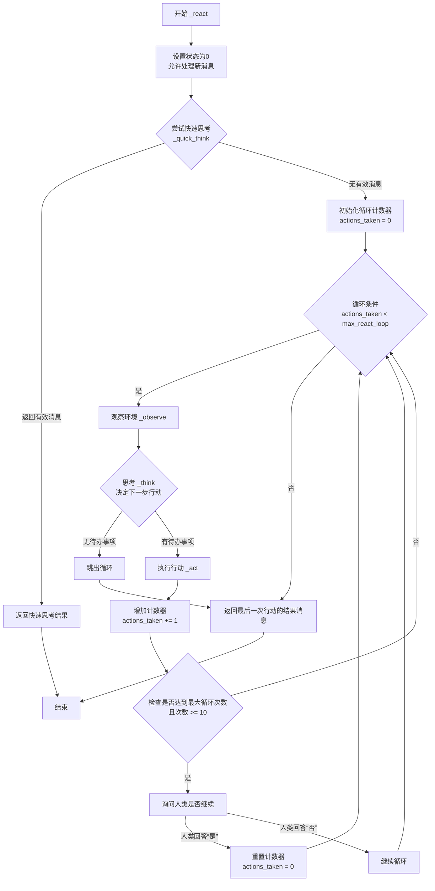

#### 带注释源码

```python
async def _react(self) -> Message:
    # NOTE: Diff 1: Each time landing here means news is observed, set todo to allow news processing in _think
    # 每次进入此方法意味着有新消息被观察到，设置状态为0以允许在 _think 中处理新消息。
    self._set_state(0)

    # problems solvable by quick thinking doesn't need to a formal think-act cycle
    # 尝试快速思考，处理那些不需要正式“思考-行动”循环的简单问题。
    quick_rsp, _ = await self._quick_think()
    if quick_rsp:
        return quick_rsp

    # 初始化行动计数器。
    actions_taken = 0
    # 初始化一个默认的响应消息，后续会被实际的行动结果覆盖。
    rsp = AIMessage(content="No actions taken yet", cause_by=Action)  # will be overwritten after Role _act
    # 进入主反应循环，直到达到最大循环次数。
    while actions_taken < self.rc.max_react_loop:
        # NOTE: Diff 2: Keep observing within _react, news will go into memory, allowing adapting to new info
        # 在 _react 循环内部持续观察，新消息会进入记忆，允许角色适应新信息。
        await self._observe()

        # think
        # 思考阶段：决定下一步要做什么。
        has_todo = await self._think()
        if not has_todo:
            # 如果没有待办事项，跳出循环。
            break
        # act
        # 行动阶段：执行思考后决定的命令。
        logger.debug(f"{self._setting}: {self.rc.state=}, will do {self.rc.todo}")
        rsp = await self._act()
        actions_taken += 1

        # post-check
        # 后置检查：如果最大循环次数较大（>=10）且已达到该次数，询问人类是否继续。
        if self.rc.max_react_loop >= 10 and actions_taken >= self.rc.max_react_loop:
            # If max_react_loop is a small value (e.g. < 10), it is intended to be reached and make the agent stop
            logger.warning(f"reached max_react_loop: {actions_taken}")
            human_rsp = await self.ask_human(
                "I have reached my max action rounds, do you want me to continue? Yes or no"
            )
            if "yes" in human_rsp.lower():
                # 如果人类回答“是”，重置计数器，继续循环。
                actions_taken = 0
    # 返回最后一次行动的结果消息。
    return rsp  # return output from the last action
```

### `RoleZero.format_quick_system_prompt`

该方法用于格式化快速思考（quick think）模式下的系统提示词。它通过调用父类的 `_get_prefix` 方法获取角色信息，并将其与预定义的快速思考示例（`QUICK_THINK_EXAMPLES`）一起，填充到快速思考系统提示词模板（`QUICK_THINK_SYSTEM_PROMPT`）中，生成一个完整的、包含上下文信息的系统提示字符串。

参数：
- 无

返回值：`str`，格式化后的系统提示字符串，用于指导大语言模型在快速思考模式下进行意图分类。

#### 流程图

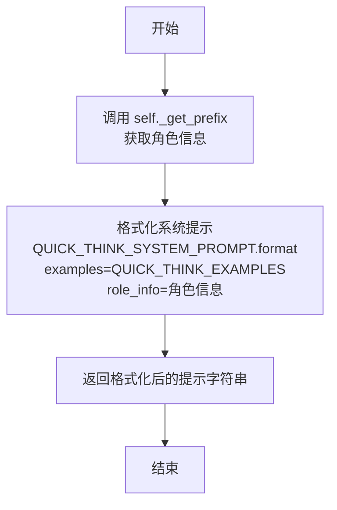

#### 带注释源码

```python
def format_quick_system_prompt(self) -> str:
    """Format the system prompt for quick thinking."""
    # 调用 QUICK_THINK_SYSTEM_PROMPT 的 format 方法，将预定义的示例（QUICK_THINK_EXAMPLES）
    # 和通过 self._get_prefix() 获取的当前角色信息作为参数，生成最终的提示字符串。
    return QUICK_THINK_SYSTEM_PROMPT.format(examples=QUICK_THINK_EXAMPLES, role_info=self._get_prefix())
```

### `RoleZero._quick_think`

该方法用于对用户输入进行快速思考与响应。它首先判断用户消息是否为新需求，然后通过LLM对用户意图进行分类（快速问题、模糊问题、搜索问题或任务）。根据分类结果，可能直接生成快速回答、执行搜索，或返回空结果以进入标准的思考-行动循环。如果生成了快速回答，会将其添加到记忆并回复给用户。

参数：

-  `self`：`RoleZero`，当前RoleZero实例的引用。

返回值：`Tuple[Message, str]`，返回一个元组。第一个元素是生成的快速响应消息（`AIMessage`），如果未生成则为`None`；第二个元素是LLM对用户意图的分类结果字符串（如“QUICK”、“SEARCH”、“TASK”等）。

#### 流程图

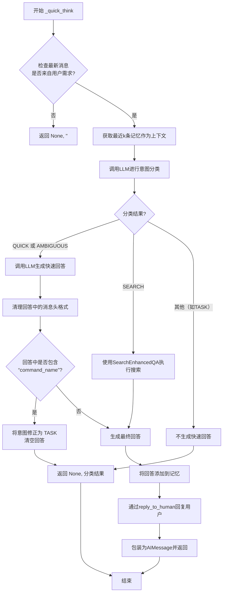

#### 带注释源码

```python
async def _quick_think(self) -> Tuple[Message, str]:
    # 初始化返回变量
    answer = ""
    rsp_msg = None

    # 步骤1: 路由判断 - 仅处理来自用户的新需求，避免处理Agent自身生成的消息以减少不必要的LLM调用
    if self.rc.news[-1].cause_by != any_to_str(UserRequirement):
        # Agents themselves won't generate quick questions, use this rule to reduce extra llm calls
        return rsp_msg, ""

    # 步骤2: 准备上下文并调用LLM进行意图分类
    # 获取最近的记忆作为分类的上下文
    memory = self.get_memories(k=self.memory_k)
    # 将记忆和快速思考提示词格式化为LLM请求
    context = self.llm.format_msg(memory + [UserMessage(content=QUICK_THINK_PROMPT)])
    # 使用ThoughtReporter报告分类过程
    async with ThoughtReporter() as reporter:
        await reporter.async_report({"type": "classify"})
        # 调用LLM，使用特定的系统提示词（包含示例和角色信息）进行意图分类
        intent_result = await self.llm.aask(context, system_msgs=[self.format_quick_system_prompt()])

    # 步骤3: 根据分类结果采取不同行动
    # 情况A: 被分类为快速问题(QUICK)或模糊问题(AMBIGUOUS)
    if "QUICK" in intent_result or "AMBIGUOUS" in intent_result:
        # 使用原始记忆上下文生成快速回答
        async with ThoughtReporter(enable_llm_stream=True) as reporter:
            await reporter.async_report({"type": "quick"})
            answer = await self.llm.aask(
                self.llm.format_msg(memory),
                system_msgs=[QUICK_RESPONSE_SYSTEM_PROMPT.format(role_info=self._get_prefix())],
            )
        # 清理回答：移除可能由LLM添加的“[Message] from A to B:”格式前缀
        pattern = r"\[Message\] from .+? to .+?:\s*"
        answer = re.sub(pattern, "", answer, count=1)

        # 后处理：检查生成的回答是否实际上包含命令（表明它可能是一个任务）。
        # 这是一个纠错逻辑，用于处理可能的误分类。
        if "command_name" in answer:
            # an actual TASK intent misclassified as QUICK, correct it here,
            # FIXME: a better way is to classify it correctly in the first place
            answer = ""
            intent_result = "TASK"  # 将意图修正为TASK

    # 情况B: 被分类为搜索问题(SEARCH)
    elif "SEARCH" in intent_result:
        # 将记忆内容拼接为查询字符串
        query = "\n".join(str(msg) for msg in memory)
        # 调用SearchEnhancedQA工具执行搜索
        answer = await SearchEnhancedQA().run(query)

    # 步骤4: 如果生成了有效回答，则处理回答
    if answer:
        # 将生成的快速回答作为AIMessage添加到角色的记忆中
        self.rc.memory.add(AIMessage(content=answer, cause_by=QUICK_THINK_TAG))
        # 调用reply_to_human方法将回答发送给用户
        await self.reply_to_human(content=answer)
        # 将回答包装成AIMessage对象，作为方法返回值的一部分
        rsp_msg = AIMessage(
            content=answer,
            sent_from=self.name,
            cause_by=QUICK_THINK_TAG,
        )

    # 步骤5: 返回结果
    # rsp_msg: 如果是快速回答则为AIMessage，否则为None
    # intent_result: LLM的原始分类结果（可能被修正过）
    return rsp_msg, intent_result
```

### `RoleZero._run_commands`

该方法负责执行一个命令列表。它遍历每个命令，根据命令类型（特殊命令或普通工具命令）调用相应的处理逻辑，收集执行结果或错误信息，并将所有输出合并为一个字符串返回。

参数：

- `commands`：`list`，一个字典列表，每个字典代表一个待执行的命令，包含`command_name`和`args`等键。

返回值：`str`，所有命令执行结果的汇总字符串，每个命令的输出以双换行分隔。

#### 流程图

```mermaid
flowchart TD
    A[开始: _run_commands(commands)] --> B{遍历commands列表};
    B --> C[取下一个命令cmd];
    C --> D{cmd是否为特殊命令?};
    D -- 是 --> E[调用_run_special_command(cmd)];
    E --> F[将特殊命令输出添加到结果列表];
    D -- 否 --> G{cmd.command_name是否在tool_execution_map中?};
    G -- 是 --> H[从map获取工具对象tool_obj];
    H --> I{是否为异步函数?};
    I -- 是 --> J[await tool_obj(**cmd['args'])];
    I -- 否 --> K[tool_obj(**cmd['args'])];
    J --> L[获取工具输出tool_output];
    K --> L;
    L --> M[将成功输出添加到结果列表];
    G -- 否 --> N[将“命令未找到”错误添加到结果列表];
    N --> O[break 停止执行];
    M --> P{执行是否发生异常?};
    P -- 是 --> Q[捕获异常，记录错误];
    Q --> O;
    P -- 否 --> R{是否还有下一个命令?};
    R -- 是 --> C;
    R -- 否 --> S[将结果列表用“\\n\\n”连接为字符串];
    F --> R;
    O --> S;
    S --> T[返回结果字符串];
```

#### 带注释源码

```python
async def _run_commands(self, commands) -> str:
    # 初始化一个列表来存储每个命令的输出
    outputs = []
    # 遍历传入的命令列表
    for cmd in commands:
        # 默认输出信息，表示命令已执行
        output = f"Command {cmd['command_name']} executed"
        # 首先检查是否为需要特殊处理的命令（如结束任务、询问人类等）
        if self._is_special_command(cmd):
            # 调用特殊命令处理方法
            special_command_output = await self._run_special_command(cmd)
            # 将特殊命令的输出附加到默认信息后，并添加到结果列表
            outputs.append(output + ":" + special_command_output)
            # 继续处理下一个命令
            continue
        # 如果是普通工具命令，检查是否在工具执行映射表中注册过
        if cmd["command_name"] in self.tool_execution_map:
            # 从映射表中获取对应的工具函数或方法对象
            tool_obj = self.tool_execution_map[cmd["command_name"]]
            try:
                # 判断工具对象是否为异步函数
                if inspect.iscoroutinefunction(tool_obj):
                    # 异步执行工具，并传入命令参数
                    tool_output = await tool_obj(**cmd["args"])
                else:
                    # 同步执行工具
                    tool_output = tool_obj(**cmd["args"])
                # 如果工具有返回结果，将其附加到输出信息中
                if tool_output:
                    output += f": {str(tool_output)}"
                # 将最终输出添加到结果列表
                outputs.append(output)
            except Exception as e:
                # 如果执行过程中发生异常，记录完整的异常堆栈信息
                tb = traceback.format_exc()
                logger.exception(str(e) + tb)
                # 将异常信息作为命令输出的一部分
                outputs.append(output + f": {tb}")
                # 遇到失败，中断后续所有命令的执行
                break
        else:
            # 如果命令未在映射表中找到，记录错误并中断执行
            outputs.append(f"Command {cmd['command_name']} not found.")
            break
    # 将所有命令的输出用两个换行符连接成一个字符串并返回
    outputs = "\n\n".join(outputs)
    return outputs
```

### `RoleZero._is_special_command`

该方法用于判断给定的命令是否为特殊命令。特殊命令是指那些需要特殊处理或检查的命令，例如计划任务完成、结束运行、询问人类或运行终端命令等。该方法通过检查命令名称是否在预定义的特殊命令列表中来做出判断。

参数：

- `cmd`：`dict`，包含命令信息的字典，其中`command_name`键表示命令名称。

返回值：`bool`，如果命令是特殊命令则返回`True`，否则返回`False`。

#### 流程图

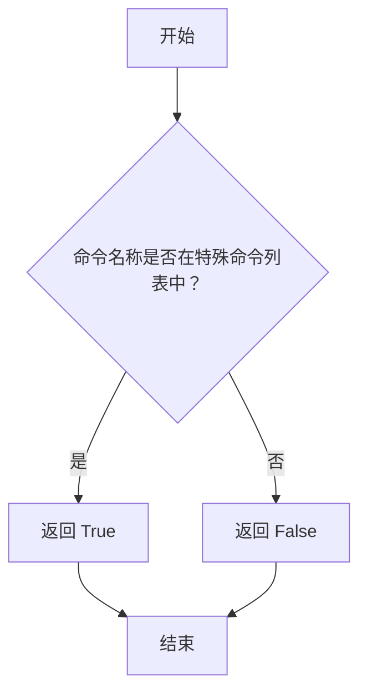

#### 带注释源码

```python
def _is_special_command(self, cmd) -> bool:
    """
    判断给定的命令是否为特殊命令。

    特殊命令是指那些需要特殊处理或检查的命令，例如计划任务完成、结束运行、询问人类或运行终端命令等。
    该方法通过检查命令名称是否在预定义的特殊命令列表中来做出判断。

    参数：
        cmd (dict): 包含命令信息的字典，其中`command_name`键表示命令名称。

    返回值：
        bool: 如果命令是特殊命令则返回`True`，否则返回`False`。
    """
    return cmd["command_name"] in self.special_tool_commands
```

### `RoleZero._run_special_command`

该方法用于处理`RoleZero`角色中的特殊命令。这些命令通常需要额外的逻辑检查、解析或特定的副作用处理，而不是简单地映射到工具函数执行。它根据传入的命令字典中的`command_name`，执行相应的特殊逻辑，并返回执行结果的字符串描述。

参数：

- `cmd`：`dict`，包含待执行命令信息的字典。字典中必须包含`command_name`键，用于标识要执行的特殊命令，以及`args`键（对于某些命令），用于传递命令参数。

返回值：`str`，返回命令执行后的输出字符串。对于`RoleZero.ask_human`命令，返回值是用户的回复；对于其他命令，返回值是描述命令执行结果的文本。

#### 流程图

```mermaid
flowchart TD
    A[开始: 接收命令字典 cmd] --> B{判断命令类型<br>cmd['command_name']}
    B -->|Plan.finish_current_task| C[调用 planner.plan.finish_current_task]
    C --> D[返回提示文本<br>“Current task is finished...”]
    B -->|end| E[调用 _end 方法]
    E --> F[返回 _end 方法的输出]
    B -->|RoleZero.ask_human| G[调用 ask_human 方法<br>传入 cmd['args']]
    G --> H{用户回复是否包含<br>“stop”或“<stop>”?}
    H -->|是| I[将回复加入记忆<br>并执行 end 命令]
    I --> J[返回 end 命令的输出]
    H -->|否| K[直接返回用户回复]
    B -->|Terminal.run_command| L[从 tool_execution_map 获取工具对象并执行]
    L --> M[调用 format_terminal_output 格式化输出]
    M --> N[返回格式化后的输出]
    B -->|其他| O[返回空字符串]
    D & F & J & K & N & O --> P[结束: 返回 command_output]
```

#### 带注释源码

```python
async def _run_special_command(self, cmd) -> str:
    """command requiring special check or parsing"""
    command_output = ""  # 初始化输出字符串

    # 1. 处理“完成当前计划任务”命令
    if cmd["command_name"] == "Plan.finish_current_task":
        # 检查计划是否已完成，若未完成则标记当前任务为完成
        if not self.planner.plan.is_plan_finished():
            self.planner.plan.finish_current_task()
        # 返回提示信息，指导下一步操作
        command_output = (
            "Current task is finished. If you no longer need to take action, use the command ‘end’ to stop."
        )

    # 2. 处理“结束”命令
    elif cmd["command_name"] == "end":
        # 调用内部 _end 方法处理结束逻辑（如总结、回复人类等）
        command_output = await self._end()
    
    # 3. 处理“向人类提问”命令
    elif cmd["command_name"] == "RoleZero.ask_human":
        # 调用 ask_human 方法向用户提问，传入命令参数
        human_response = await self.ask_human(**cmd["args"])
        # 检查用户回复是否要求停止
        if human_response.strip().lower().endswith(("stop", "<stop>")):
            # 如果是，将回复加入记忆，并自动执行 end 命令
            human_response += "The user has asked me to stop because I have encountered a problem."
            self.rc.memory.add(UserMessage(content=human_response, cause_by=RunCommand))
            end_output = "\nCommand end executed:"
            end_output += await self._end()
            return end_output  # 返回组合了提问回复和结束命令的输出
        # 如果用户没有要求停止，直接返回用户的回复
        return human_response
    
    # 4. 处理“运行终端命令”命令
    elif cmd["command_name"] == "Terminal.run_command":
        # 从工具执行映射中获取对应的工具函数
        tool_obj = self.tool_execution_map[cmd["command_name"]]
        # 执行终端命令
        tool_output = await tool_obj(**cmd["args"])
        # 对终端命令的输出进行格式化，确保其可见性
        command_output = format_terminal_output(cmd=cmd, raw_output=tool_output)
    
    # 5. 返回最终的处理结果
    return command_output
```

### `RoleZero._retrieve_experience`

该方法用于从经验检索器中检索与当前上下文相关的经验示例。它是`RoleZero`角色在动态思考（`_think`）过程中的一个关键步骤，旨在利用历史经验来指导当前任务的规划和执行。默认实现从角色的短期记忆中获取最近的对话上下文，并将其作为查询条件传递给`experience_retriever`以获取相似的经验。子类可以重写此方法以提供自定义的经验检索逻辑。

参数：
-  `self`：`RoleZero`，`RoleZero`类的实例，代表当前的角色对象。

返回值：`str`，返回一个字符串，该字符串是从经验检索器中获取的、与当前上下文最相关的经验示例。如果未找到相关经验，则可能返回空字符串。

#### 流程图

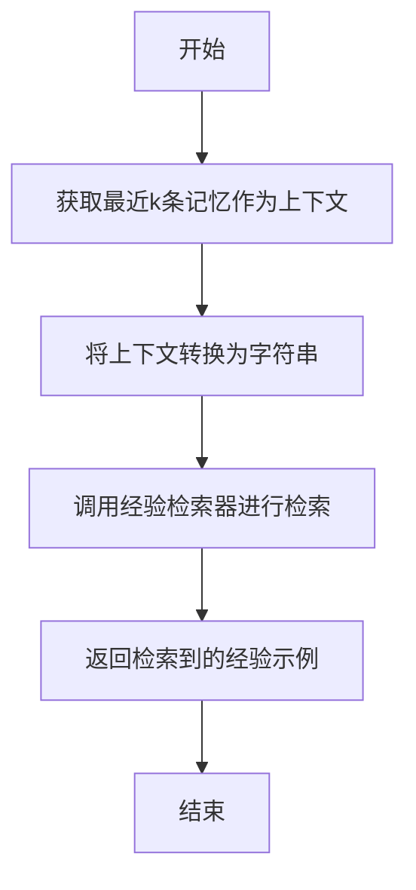

#### 带注释源码

```python
    def _retrieve_experience(self) -> str:
        """Default implementation of experience retrieval. Can be overwritten in subclasses."""
        # 从角色的短期内存中获取最近`self.memory_k`条消息作为上下文。
        # `self.memory_k`是一个配置参数，控制用于检索经验的上下文长度。
        context = [str(msg) for msg in self.rc.memory.get(self.memory_k)]
        # 将上下文列表连接成一个字符串，每条消息之间用两个换行符分隔。
        context = "\n\n".join(context)
        # 调用`experience_retriever`的`retrieve`方法，传入上下文字符串进行经验检索。
        # `experience_retriever`是一个实现了`ExpRetriever`接口的对象，负责从经验池中查找相似经验。
        example = self.experience_retriever.retrieve(context=context)
        # 返回检索到的经验示例字符串。如果未找到，`retrieve`方法可能返回空字符串或默认提示。
        return example
```

### `RoleZero.ask_human`

该方法用于在RoleZero执行任务过程中，当遇到失败、不确定的情况或需要向人类用户澄清时，向人类用户提问。它会将问题发送到环境（如MGXEnv），并等待并返回用户的响应。

参数：
- `question`：`str`，需要向人类用户提出的问题字符串。

返回值：`str`，返回从人类用户处获得的响应字符串。

#### 流程图

```mermaid
flowchart TD
    A[开始: ask_human(question)] --> B{环境是否为MGXEnv?};
    B -- 是 --> C[调用环境方法 env.ask_human];
    C --> D[等待并接收用户响应];
    D --> E[返回响应字符串];
    B -- 否 --> F[返回提示字符串<br>“Not in MGXEnv, command will not be executed.”];
    F --> E;
    E --> G[结束];
```

#### 带注释源码

```python
async def ask_human(self, question: str) -> str:
    """Use this when you fail the current task or if you are unsure of the situation encountered. Your response should contain a brief summary of your situation, ended with a clear and concise question."""
    # NOTE: Can be overwritten in remote setting
    from metagpt.environment.mgx.mgx_env import MGXEnv  # avoid circular import

    # 检查当前运行环境是否为MGXEnv类型
    if not isinstance(self.rc.env, MGXEnv):
        # 如果不是MGXEnv环境，则返回提示信息，表示命令不会被执行
        return "Not in MGXEnv, command will not be executed."
    # 如果是MGXEnv环境，则调用环境的ask_human方法，传入问题内容和发送者（self），并等待返回用户响应
    return await self.rc.env.ask_human(question, sent_from=self)
```

### `RoleZero.reply_to_human`

该方法用于在`RoleZero`角色需要向人类用户提供明确答案或解决方案时，向用户发送回复内容。它主要检查当前运行环境是否为`MGXEnv`，如果是，则调用环境的`reply_to_human`方法将内容发送给用户；否则，返回一个提示信息，表明命令无法执行。

参数：

- `content`：`str`，需要发送给人类用户的回复内容。

返回值：`str`，返回执行结果。如果环境是`MGXEnv`，则返回环境方法调用的结果；否则，返回提示字符串`"Not in MGXEnv, command will not be executed."`。

#### 流程图

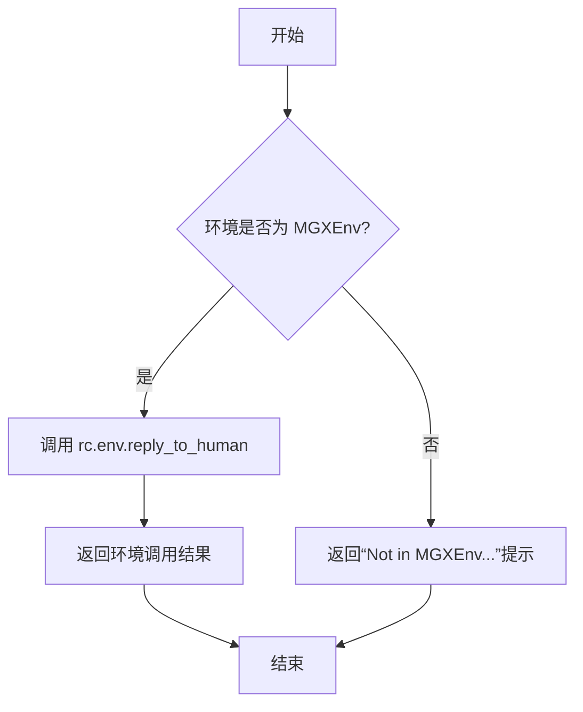

#### 带注释源码

```python
async def reply_to_human(self, content: str) -> str:
    """Reply to human user with the content provided. Use this when you have a clear answer or solution to the user's question."""
    # NOTE: Can be overwritten in remote setting
    from metagpt.environment.mgx.mgx_env import MGXEnv  # avoid circular import

    # 检查当前运行环境是否为 MGXEnv
    if not isinstance(self.rc.env, MGXEnv):
        # 如果不是 MGXEnv 环境，则返回提示信息，表示命令无法执行
        return "Not in MGXEnv, command will not be executed."
    # 如果是 MGXEnv 环境，则调用环境的 reply_to_human 方法，将内容发送给用户
    return await self.rc.env.reply_to_human(content, sent_from=self)
```

### `RoleZero._end`

`RoleZero._end` 方法是 `RoleZero` 角色的一个特殊命令处理函数，当接收到 `"end"` 命令时被调用。它的核心功能是优雅地结束当前角色的执行循环。该方法首先将角色的内部状态设置为结束（`-1`），然后检查最近的交互历史，确保在最终结束前已向人类用户发送了回复。如果发现尚未回复，它会生成一个总结性的回复并发送给用户。最后，如果启用了总结功能（`use_summary=True`），它会基于当前的任务记忆生成一个最终的任务总结。该方法旨在确保任务结束时有一个清晰的收尾和必要的沟通。

参数：
-  `self`：`RoleZero`，`RoleZero` 类的实例，代表当前执行的角色。
-  `**kwarg`：`dict`，可变关键字参数，当前方法实现中未使用，为未来扩展预留。

返回值：`str`，返回一个字符串。如果启用了总结功能（`use_summary=True`），则返回基于任务记忆生成的总结文本；否则返回空字符串。

#### 流程图

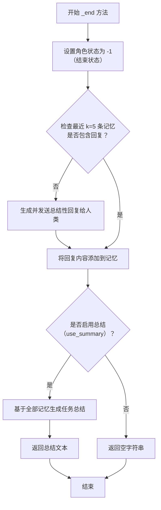

#### 带注释源码

```python
async def _end(self, **kwarg):
    # 1. 设置角色内部状态为 -1，标志执行循环结束
    self._set_state(-1)
    
    # 2. 获取最近的记忆作为上下文，用于生成回复和总结
    memory = self.rc.memory.get(self.memory_k)
    
    # 3. 检查最近5条交互历史中是否已包含对人类的回复
    #    这是为了确保在任务结束前，用户能得到一个明确的答复。
    if not any(["reply_to_human" in memory.content for memory in self.get_memories(k=5)]):
        logger.info("manually reply to human")
        # 3.1 格式化提示词，要求LLM生成一个面向人类的总结性回复
        reply_to_human_prompt = REPORT_TO_HUMAN_PROMPT.format(respond_language=self.respond_language)
        # 3.2 使用ThoughtReporter记录“quick”类型的思考过程（可能用于UI展示或日志）
        async with ThoughtReporter(enable_llm_stream=True) as reporter:
            await reporter.async_report({"type": "quick"})
            # 3.3 调用LLM生成回复内容
            reply_content = await self.llm.aask(self.llm.format_msg(memory + [UserMessage(reply_to_human_prompt)]))
        # 3.4 通过环境接口将回复发送给人类用户
        await self.reply_to_human(content=reply_content)
        # 3.5 将生成的回复作为AIMessage添加到角色记忆中
        self.rc.memory.add(AIMessage(content=reply_content, cause_by=RunCommand))
    
    # 4. 初始化输出字符串
    outputs = ""
    
    # 5. 如果配置要求进行任务总结，则生成最终总结
    if self.use_summary:
        logger.info("end current run and summarize")
        # 5.1 基于全部记忆和总结提示词，调用LLM生成任务总结
        outputs = await self.llm.aask(self.llm.format_msg(memory + [UserMessage(SUMMARY_PROMPT)]))
    
    # 6. 返回结果：如果生成了总结则返回总结文本，否则返回空字符串
    return outputs
```

## 关键组件


### 动态思考与执行循环 (React Mode)

核心的“思考-行动”循环，使RoleZero能够根据环境反馈动态规划并执行工具命令。它通过`_think`方法分析当前状态和记忆，生成下一步命令，再通过`_act`方法解析并执行这些命令，形成一个自主的、可适应变化的决策与执行流程。

### 工具执行映射 (Tool Execution Map)

一个将工具命令名称映射到实际可调用函数或方法的字典 (`tool_execution_map`)。它作为RoleZero的“技能库”，使其能够理解并执行如文件编辑、浏览器操作、任务规划等多样化的指令，是实现其多任务处理能力的基础。

### 经验检索与缓存 (Experience Retrieval & Caching)

通过`experience_retriever`和`exp_cache`装饰器实现的机制。它允许RoleZero从历史经验池中检索与当前上下文相似的解决方案，并在生成命令时利用缓存，旨在提升问题解决的效率和成功率，避免重复计算。

### 快速思考与响应 (Quick Think & Response)

一个用于处理简单或明确用户请求的快速路径。通过`_quick_think`方法，RoleZero可以绕过完整的“思考-行动”循环，直接调用LLM生成快速答案或执行搜索，提高了对简单查询的响应速度。

### 长期记忆系统 (Long-Term Memory System)

基于配置可选的`RoleZeroLongTermMemory`。它扩展了角色的基础记忆能力，能够持久化存储和检索历史交互信息，为角色提供更丰富的上下文，支持更复杂的多轮对话和任务连续性。

### 规划器集成 (Planner Integration)

集成了`Planner`及其`Plan`对象，用于管理复杂的、多步骤的任务。RoleZero可以通过特定的工具命令（如`Plan.append_task`）与规划器交互，动态地创建、修改和推进任务计划，实现目标分解与结构化执行。

### 特殊命令处理 (Special Command Handling)

对一类需要特殊逻辑或后处理的命令（如`end`, `ask_human`, `Plan.finish_current_task`）的集中处理机制。这些命令通常涉及流程控制、人机交互或状态管理，`_run_special_command`方法确保了它们被正确解析和执行。

### 人机交互接口 (Human-Agent Interaction Interface)

通过`ask_human`和`reply_to_human`方法定义的与人类用户通信的标准接口。这使RoleZero能够在执行过程中主动询问、确认信息或向用户报告结果，是实现有效人机协作的关键。

### 上下文构建与序列化 (Context Building & Serialization)

由`RoleZeroContextBuilder`和`RoleZeroSerializer`支持。前者负责为经验缓存构建合适的查询上下文，后者负责将复杂的交互状态序列化为可存储的经验条目，共同支撑了经验系统的有效运作。

### 命令去重与解析 (Command Deduplication & Parsing)

在`_think`和`_act`阶段，通过`check_duplicates`和`parse_commands`等工具函数，对LLM生成的原始命令响应进行清洗、去重和结构化解析，确保最终执行的命令列表是清晰、无冲突且格式正确的。


## 问题及建议


### 已知问题

-   **循环依赖风险**：`ask_human` 和 `reply_to_human` 方法中动态导入 `MGXEnv` 以避免循环依赖，这种做法在运行时可能导致性能开销，且代码结构不够清晰，增加了维护的复杂性。
-   **硬编码的魔法数字**：在 `_end` 方法中，检查最近消息是否包含 `reply_to_human` 时使用了硬编码的 `k=5`。这个数字缺乏明确的业务逻辑解释，可能无法适应所有场景，导致逻辑错误。
-   **异常处理粒度较粗**：在 `_run_commands` 方法中，当执行工具命令发生异常时，会中断整个命令列表的执行。这可能过于严格，某些命令的失败可能不应影响后续独立命令的执行。
-   **潜在的性能瓶颈**：`_think` 方法中，每次循环都会通过 `tool_recommender.recommend_tools()` 获取工具列表并序列化为 JSON (`tool_info`)。如果工具列表很大或推荐逻辑复杂，这可能成为性能瓶颈。
-   **状态管理复杂**：`_react` 方法中通过 `_set_state(0)` 来允许处理新消息，这种隐式的状态重置逻辑依赖于对父类 `Role` 内部机制的理解，增加了代码的认知负担和出错风险。
-   **字符串匹配的脆弱性**：在 `_quick_think` 方法中，使用字符串包含（如 `"QUICK" in intent_result`）来判断 LLM 的分类结果。这种方式容易受到 LLM 输出格式变化的影响，不够健壮。
-   **配置访问不一致**：在 `set_longterm_memory` 方法中，通过 `self.config.role_zero` 访问配置，而其他配置（如 `self.config.enable_search`）则直接访问。这种不一致性可能源于配置结构设计，但使用时需要注意。

### 优化建议

-   **重构依赖管理**：考虑重构项目结构，使用明确的导入或依赖注入模式来消除 `MGXEnv` 的循环依赖，使 `ask_human` 和 `reply_to_human` 的依赖关系更清晰、可测试。
-   **使用命名常量**：将 `_end` 方法中的魔法数字 `5` 定义为类级别的常量（如 `RECENT_MESSAGE_CHECK_COUNT`），并为其添加注释说明其业务含义，提高代码可读性和可维护性。
-   **细化异常处理策略**：在 `_run_commands` 方法中，根据命令类型或重要性实现更细粒度的异常处理。例如，可以允许非关键命令失败后继续执行，或提供配置选项让用户决定失败行为。
-   **缓存工具推荐结果**：考虑对 `tool_recommender.recommend_tools()` 的结果进行缓存，特别是在单次 `_think` 循环中结果不变的情况下。可以设置合理的缓存失效策略，以平衡性能与准确性。
-   **明确状态转换逻辑**：将 `_react` 方法中重置状态的逻辑封装成一个具有明确命名的方法（如 `_reset_for_new_cycle`），并在其中添加清晰的注释，解释为何以及何时需要重置状态。
-   **使用枚举或常量进行结果判断**：为 `_quick_think` 方法中的分类结果（如 `QUICK`, `TASK`, `SEARCH`）定义枚举类型。让 LLM 的输出匹配这些枚举值，或者至少使用更精确的正则表达式或解析逻辑，减少误判。
-   **统一配置访问模式**：审查整个类的配置使用方式，确保访问模式一致。如果 `role_zero` 是一个独立的配置块，确保所有相关配置都通过此路径访问，并在文档中明确说明配置结构。
-   **增强日志和可观测性**：在关键决策点（如 `_think` 生成命令、`_run_commands` 执行命令）添加更结构化的日志，记录输入、输出和上下文，便于调试和性能分析。
-   **考虑异步优化**：检查 `_run_commands` 中顺序执行命令的循环。如果命令之间没有依赖关系，可以考虑使用 `asyncio.gather` 并发执行，以提高 I/O 密集型操作的效率。


## 其它


### 设计目标与约束

RoleZero 的设计目标是作为一个能够动态思考与行动的通用智能体角色，它通过整合规划、工具执行、经验检索和长期记忆等能力，来处理复杂的、多步骤的任务。其核心约束包括：必须运行在 `react` 模式下以支持循环的思考-行动过程；工具执行依赖于一个预定义的映射表；与环境的交互（如询问人类）主要设计用于特定的 MGXEnv 环境；性能受限于配置的 `max_react_loop` 和上下文记忆长度 `memory_k`。

### 错误处理与异常设计

代码中的错误处理主要分散在工具执行和命令解析环节。在 `_run_commands` 方法中，每个命令的执行被包裹在 `try-except` 块中，捕获所有 `Exception`，记录详细的堆栈跟踪 (`traceback.format_exc()`)，并中断后续命令的执行。在 `_act` 方法中，`parse_commands` 函数会返回一个 `ok` 标志，如果解析失败，错误信息会被添加到记忆并返回。然而，整体缺乏统一的错误分类（如网络错误、权限错误、资源不足等）和分级处理策略（如重试、降级、上报）。`ask_human` 和 `reply_to_human` 方法在非 MGXEnv 环境下会直接返回提示信息，这是一种简单的环境适配性处理。

### 数据流与状态机

数据流围绕 `self.rc.memory`（记忆）和 `self.planner.plan`（计划）展开。外部输入（用户需求、工具输出）作为 `Message` 存入记忆。`_react` 循环驱动状态：观察 (`_observe`) 新消息 -> 思考 (`_think`) 生成命令 -> 执行 (`_act`) 命令 -> 结果存入记忆。`self.rc.state` 用于控制循环（0 为运行，-1 为结束）。`_quick_think` 作为一个旁路流程，对简单查询进行快速响应。计划状态（`plan_status`, `current_task`）作为上下文的一部分被注入到 LLM 的思考提示中，指导下一步行动。

### 外部依赖与接口契约

1.  **LLM 服务**：通过 `self.llm.aask` 和 `self.llm_cached_aask` 方法调用，依赖其返回结构化或非结构化的文本。`llm_cached_aask` 使用了经验缓存装饰器 `exp_cache`。
2.  **工具系统**：依赖 `ToolRecommender` 推荐工具，并通过 `tool_execution_map` 字典映射工具名到可调用对象。工具必须符合特定的命名和参数规范（如 `Editor.edit_file_by_replace`）。
3.  **环境 (Env)**：`ask_human` 和 `reply_to_human` 方法预期 `self.rc.env` 是 `MGXEnv` 的实例，并调用其对应方法。这是与外部用户界面或控制台交互的契约。
4.  **记忆存储**：默认使用短期记忆，当配置开启时，切换为 `RoleZeroLongTermMemory`，它可能依赖向量数据库进行持久化和检索。
5.  **配置系统**：通过 `self.config` 对象获取各项开关和参数（如 `enable_search`, `role_zero.enable_longterm_memory`）。

### 安全与权限考量

代码中直接执行通过 LLM 生成的命令（包括终端命令 `Terminal.run_command` 和文件编辑命令），这存在显著的安全风险（如注入恶意命令）。当前实现缺乏对命令的白名单过滤、沙箱执行环境或基于上下文的权限验证。`special_tool_commands` 和 `exclusive_tool_commands` 列表提供了一定程度的控制，但主要针对功能逻辑而非安全。在生成环境中部署前，必须引入严格的安全层。

### 可测试性与模拟

类的方法（如 `_think`, `_act`, `_run_commands`）具有相对清晰的输入输出，便于单元测试。可以通过 Mock 对象模拟 `self.llm`、`self.tool_execution_map` 中的工具函数、`self.rc.env` 以及 `self.rc.memory` 的行为。`use_fixed_sop` 开关允许回退到父类的固定流程，可用于对比测试或降级。然而，`_react` 循环和与外部工具的集成测试较为复杂，需要更全面的集成或端到端测试框架。

### 配置与初始化参数

类的字段即为其主要配置参数：
*   **核心行为**：`react_mode`, `max_react_loop`, `use_fixed_sop`, `use_summary`。
*   **记忆与上下文**：`memory_k`, `config.role_zero.enable_longterm_memory` 及相关参数。
*   **工具**：`tools`（工具列表），`tool_recommender`。
*   **提示工程**：`system_prompt`, `cmd_prompt`, `instruction`, `task_type_desc`。
*   **基础工具实例**：`editor`, `browser`。
初始化过程通过多个 `@model_validator(mode="after")` 方法串联，依次设置反应模式、计划器、工具执行映射和长期记忆。这种设计使得子类可以通过重写 `_update_tool_execution` 等方法来自定义配置。

### 性能考量与扩展性

*   **性能**：LLM 调用是主要瓶颈。`llm_cached_aask` 和 `_quick_think` 中的意图分类旨在减少不必要的复杂思考。`memory_k` 控制上下文长度，影响提示词大小和推理成本。工具执行（尤其是浏览器操作）可能是 I/O 密集型操作。
*   **扩展性**：
    *   **工具扩展**：通过向 `tools` 列表添加新工具名，并在 `_update_tool_execution` 方法中更新 `tool_execution_map` 来扩展。
    *   **流程扩展**：子类可以重写 `_think`, `_act`, `_retrieve_experience` 等方法以改变核心逻辑。
    *   **记忆扩展**：可通过配置切换不同的记忆实现。
    *   **规划扩展**：`Planner` 和 `Plan` 对象是可替换的组件。
    *   当前的 `_run_commands` 是顺序同步执行，对于可并行化的独立命令，存在优化为异步并行的空间。

    