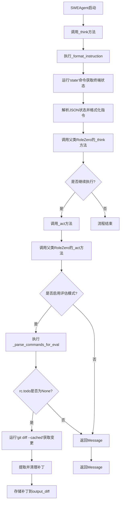
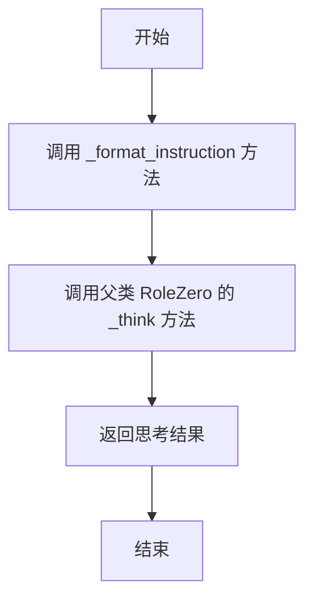
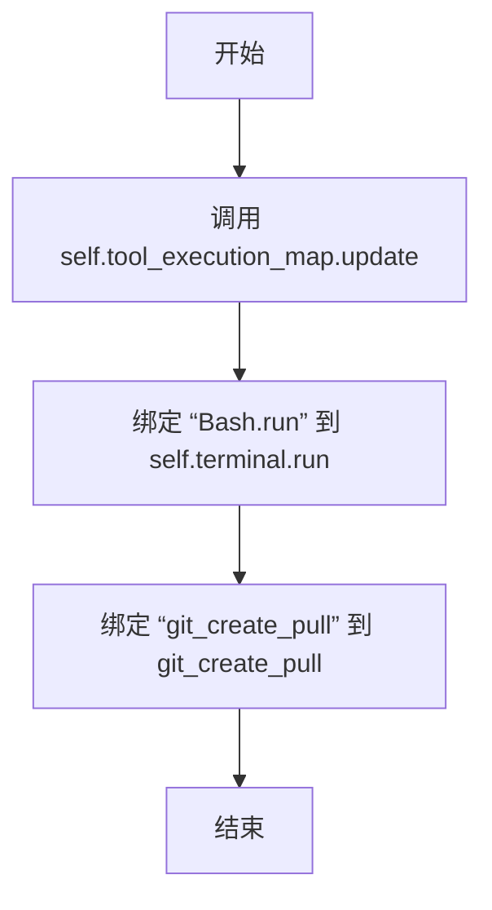
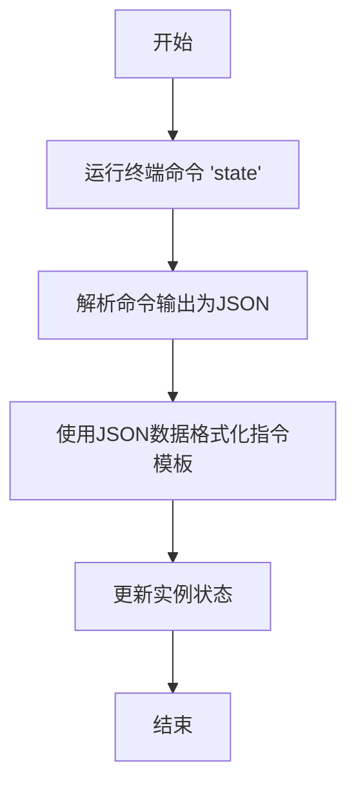
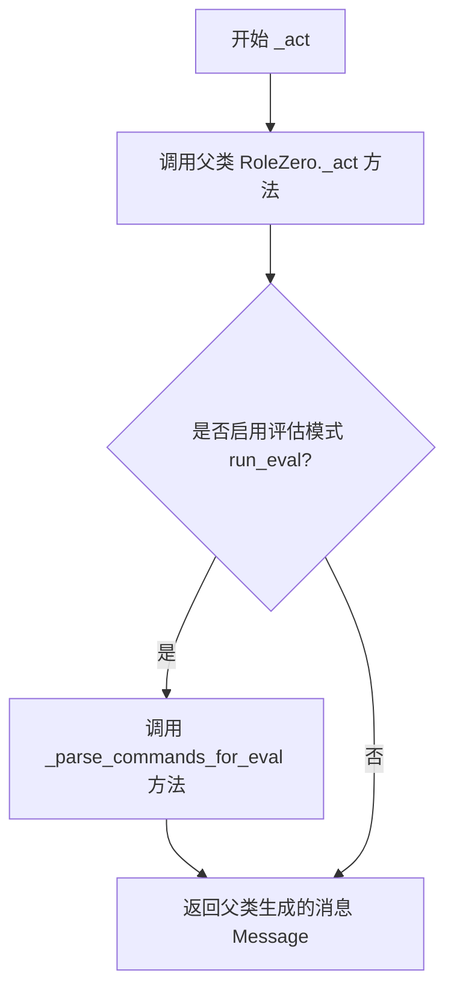
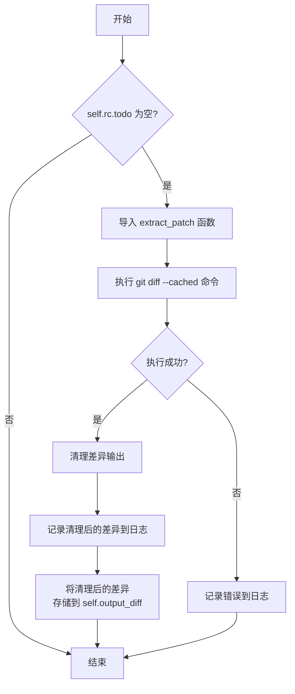
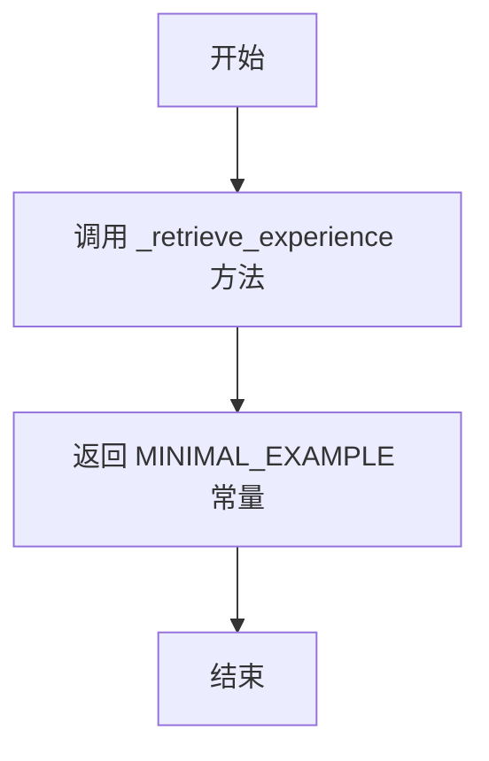

# `.\MetaGPT\metagpt\roles\di\swe_agent.py` 详细设计文档

该代码定义了一个名为SWEAgent的智能体类，它继承自RoleZero，专门用于解决GitHub问题或修复现有代码库中的错误。它通过集成Bash终端、浏览器操作、Git命令等工具，在一个受控环境中执行代码分析、修改和提交操作，并支持SWE-Bench评估模式以生成代码变更的差异补丁。

## 整体流程



## 类结构

```
RoleZero (父类)
└── SWEAgent (子类，GitHub问题解决智能体)
```

## 全局变量及字段


### `SWEAgent.name`
    
智能体的名称，默认值为 'Swen'。

类型：`str`
    


### `SWEAgent.profile`
    
智能体的角色描述，默认值为 'Issue Solver'。

类型：`str`
    


### `SWEAgent.goal`
    
智能体的核心目标，默认值为 'Resolve GitHub issue or bug in any existing codebase'。

类型：`str`
    


### `SWEAgent._instruction`
    
用于指导智能体下一步行动的指令模板，从 NEXT_STEP_TEMPLATE 导入。

类型：`str`
    


### `SWEAgent.tools`
    
智能体可使用的工具列表，包括 Bash、Browser、RoleZero 和 git_create_pull。

类型：`list[str]`
    


### `SWEAgent.terminal`
    
用于执行 Bash 命令的终端实例，通过 Field 配置默认工厂和排除序列化。

类型：`Bash`
    


### `SWEAgent.output_diff`
    
存储由 git diff 生成的代码变更补丁（patch）的字符串。

类型：`str`
    


### `SWEAgent.max_react_loop`
    
智能体反应循环的最大次数限制，默认值为 40。

类型：`int`
    


### `SWEAgent.run_eval`
    
一个标志，指示是否运行评估模式以生成和存储代码变更补丁。

类型：`bool`
    
    

## 全局函数及方法

### `SWEAgent._think`

该方法负责执行SWEAgent的思考过程。它首先调用`_format_instruction`方法来格式化指令，然后调用父类`RoleZero`的`_think`方法来完成实际的思考逻辑，并返回其结果。

参数：

- `self`：`SWEAgent`，当前SWEAgent实例的引用

返回值：`bool`，表示思考过程是否成功完成

#### 流程图



#### 带注释源码

```python
async def _think(self) -> bool:
    # 调用 _format_instruction 方法，格式化指令
    await self._format_instruction()
    # 调用父类 RoleZero 的 _think 方法，执行实际的思考逻辑
    res = await super()._think()
    # 返回思考结果
    return res
```

### `SWEAgent._update_tool_execution`

该方法用于更新 `SWEAgent` 实例的工具执行映射（`tool_execution_map`），将特定的工具名称（如 `"Bash.run"` 和 `"git_create_pull"`）与对应的可调用函数或方法进行绑定。这确保了当代理需要执行这些工具时，能够正确地找到并调用相应的实现。

参数：
- `self`：`SWEAgent`，`SWEAgent` 类的实例，用于访问和修改实例属性。

返回值：`None`，该方法不返回任何值，其作用是通过更新 `self.tool_execution_map` 来修改实例的内部状态。

#### 流程图



#### 带注释源码

```python
def _update_tool_execution(self):
    # 更新工具执行映射，将字符串标识符映射到实际的可调用对象
    self.tool_execution_map.update(
        {
            # 将 “Bash.run” 映射到当前终端实例的 run 方法
            "Bash.run": self.terminal.run,
            # 将 “git_create_pull” 映射到外部的 git_create_pull 函数
            "git_create_pull": git_create_pull,
        }
    )
```

### `SWEAgent._format_instruction`

该方法用于格式化SWE代理的指令消息。它通过运行终端中的“state”命令，将其输出解析为JSON，并使用该数据来格式化`_instruction`模板。

参数：

- `self`：`SWEAgent`，当前SWEAgent实例的引用

返回值：`None`，无返回值

#### 流程图



#### 带注释源码

```python
async def _format_instruction(self):
    """
    Formats the instruction message for the SWE agent.
    Runs the "state" command in the terminal, parses its output as JSON,
    and uses it to format the `_instruction` template.
    """
    # 运行终端命令 'state' 并获取输出
    state_output = await self.terminal.run("state")
    # 将输出解析为JSON格式
    bash_state = json.loads(state_output)
    # 使用解析后的JSON数据格式化指令模板，并更新实例状态
    self.cmd_prompt_current_state = CURRENT_BASH_STATE.format(**bash_state).strip()
```

### `SWEAgent._act`

`SWEAgent._act` 方法是 SWEAgent 角色执行其核心行动逻辑的入口。它继承并扩展了父类 `RoleZero` 的 `_act` 方法，在完成标准行动流程后，如果启用了评估模式 (`run_eval`)，会额外执行一个用于 SWE-Bench 评估的特定逻辑，以捕获并存储代码变更的差异（patch）。

参数：
- `self`：`SWEAgent` 实例，表示当前执行该方法的 SWEAgent 对象。

返回值：`Message`，返回父类 `_act` 方法执行后生成的消息对象，其中包含了本轮行动的结果或指令。

#### 流程图



#### 带注释源码

```python
async def _act(self) -> Message:
    # 1. 调用父类 RoleZero 的 _act 方法执行标准的行动逻辑。
    #    这通常包括基于当前观察和思考，选择并执行一个工具（如 Bash 命令），然后生成一个描述行动结果的消息。
    message = await super()._act()

    # 2. 检查是否启用了评估模式。
    #    该模式专为 SWE-Bench 评估设计，用于在任务结束时捕获代码变更。
    if self.run_eval:
        # 3. 如果启用了评估模式，则调用内部方法处理命令并生成代码差异。
        self._parse_commands_for_eval()

    # 4. 返回父类 _act 方法生成的消息。
    #    这个消息会被添加到角色的历史记录中，并可能用于触发下一轮的思考-行动循环。
    return message
```

### `SWEAgent._parse_commands_for_eval`

该方法用于在SWE-Agent评估场景中处理命令解析。当代理完成所有待办任务（即`self.rc.todo`为空）时，它会执行`git diff --cached`命令来获取暂存区的代码变更，并使用`extract_patch`函数清理差异输出。清理后的补丁字符串将被存储在`self.output_diff`字段中，以供后续评估使用。如果在处理过程中发生异常，错误信息会被记录到日志中。

参数：
-  `self`：`SWEAgent`，当前SWEAgent实例的引用

返回值：`None`，此方法不返回任何值，其作用是通过副作用更新`self.output_diff`字段。

#### 流程图



#### 带注释源码

```python
async def _parse_commands_for_eval(self):
    """
    Handles actions based on parsed commands.
    Parses commands, checks for a "submit" action, and generates a patch using `git diff`.
    Stores the cleaned patch in `output_diff`. Logs any exceptions.
    This function is specifically added for SWE bench evaluation.
    """
    # 如果 todo 切换为 None，表明这是最后一轮反应，Swe-Agent 将停止。使用 git diff 来存储所做的任何更改。
    if not self.rc.todo:
        # 动态导入 extract_patch 函数，用于清理 git diff 的输出
        from metagpt.tools.swe_agent_commands.swe_agent_utils import extract_patch

        try:
            # 执行 git diff --cached 命令，获取暂存区的代码变更
            diff_output = await self.terminal.run("git diff --cached")
            # 使用 extract_patch 函数清理原始的差异输出
            clear_diff = extract_patch(diff_output)
            # 将清理后的差异信息记录到日志中
            logger.info(f"Diff output: \n{clear_diff}")
            # 如果清理后的差异不为空，则将其存储到实例的 output_diff 字段中
            if clear_diff:
                self.output_diff = clear_diff
        except Exception as e:
            # 如果在执行过程中发生任何异常，将错误信息记录到错误日志中
            logger.error(f"Error during submission: {e}")
```

### `SWEAgent._retrieve_experience`

该方法用于检索并返回一个预定义的“最小示例”字符串，作为智能体（Agent）的经验或上下文信息，以辅助其在解决GitHub问题或代码库Bug时的决策过程。

参数：
- `self`：`SWEAgent`，当前SWEAgent实例的引用。

返回值：`str`，返回一个预定义的字符串常量`MINIMAL_EXAMPLE`，该常量包含了用于指导智能体行为的最小化示例或经验模板。

#### 流程图



#### 带注释源码

```python
def _retrieve_experience(self) -> str:
    # 直接返回预定义的 MINIMAL_EXAMPLE 字符串常量。
    # 该常量通常包含一个简化的任务执行示例或经验模板，
    # 用于在智能体决策时提供上下文参考。
    return MINIMAL_EXAMPLE
```

## 关键组件

### SWEAgent

SWEAgent 是一个基于 RoleZero 的智能体，专门用于解决 GitHub issue 或现有代码库中的 bug。它通过集成 Bash 终端、浏览器操作、git 操作等工具，结合特定的指令模板和状态管理，以多轮反应的方式自动化执行问题诊断和修复任务。

### 张量索引与惰性加载

代码中未直接涉及张量索引与惰性加载机制。该组件通常用于高效处理大规模数据或模型参数，但在此代码中未实现。

### 反量化支持

代码中未直接涉及反量化支持。该组件通常用于将量化后的数据（如模型权重）转换回原始精度，但在此代码中未实现。

### 量化策略

代码中未直接涉及量化策略。该组件通常用于将模型参数或数据从高精度转换为低精度以节省存储和计算资源，但在此代码中未实现。

## 问题及建议


### 已知问题

-   **硬编码的工具列表与依赖**：`tools` 列表中的工具名称（如 `"Bash"`, `"Browser:goto,scroll"`）是硬编码的字符串，这降低了代码的灵活性和可维护性。如果需要动态添加、移除或替换工具，必须修改类定义。
-   **潜在的 JSON 解析错误**：`_format_instruction` 方法中，`state_output` 被直接传递给 `json.loads()`。如果 `self.terminal.run("state")` 返回的不是有效的 JSON 字符串，将导致 `JSONDecodeError` 异常，且当前没有相应的错误处理逻辑。
-   **`_parse_commands_for_eval` 方法的职责模糊**：该方法仅在 `run_eval` 为 `True` 时执行，但其内部逻辑（检查 `rc.todo` 并生成 diff）与“解析命令”的名称不完全相符，更像是“评估模式下的最终提交处理”。这可能导致理解上的混淆。
-   **`output_diff` 字段的单一用途**：`output_diff` 字段仅在 `run_eval` 模式下由 `_parse_commands_for_eval` 方法填充，在其他模式下可能为空或未被使用。这暗示了类设计可能耦合了特定（评估）场景的逻辑。
-   **`_retrieve_experience` 方法返回硬编码示例**：该方法直接返回一个硬编码的常量 `MINIMAL_EXAMPLE`。这意味着所有实例共享相同的“经验”，无法根据任务上下文或历史进行个性化或动态的经验检索，限制了智能体的适应能力。

### 优化建议

-   **将工具配置外部化或参数化**：考虑将 `tools` 列表作为构造参数（`__init__` 参数）或在配置文件中定义，而不是硬编码在类属性中。这样可以更灵活地组合不同任务所需的工具集，提高代码的可复用性。
-   **增强 `_format_instruction` 的错误处理**：在 `json.loads(state_output)` 调用周围添加 `try-except` 块，捕获 `JSONDecodeError` 异常。可以记录错误、提供默认的 `bash_state` 值或重新抛出更具体的异常，以提高系统的健壮性。
-   **重命名 `_parse_commands_for_eval` 方法**：将方法名改为更贴切的名称，如 `_handle_final_submission_for_eval` 或 `_generate_and_store_patch`，以更准确地反映其仅在评估模式下处理最终提交并生成补丁的职责。
-   **重新评估 `output_diff` 字段的设计**：如果 `output_diff` 仅用于评估场景，考虑将其作为评估流程中的一个临时变量或通过一个专门的方法返回，而不是作为类的持久化字段。或者，明确其在不同模式下的用途并完善相关文档。
-   **实现动态的经验检索机制**：重构 `_retrieve_experience` 方法，使其能够根据当前任务、历史交互记录或外部知识库来检索更相关、更丰富的示例或指导。这可以显著提升智能体在不同问题上的表现和泛化能力。
-   **考虑将 `Bash` 工具注入而非硬编码**：虽然 `terminal` 字段通过 `Field(default_factory=Bash)` 创建，但 `tools` 列表中仍硬编码了 `"Bash"`。确保工具注册机制（`_update_tool_execution`）与实际的工具实例（`self.terminal`）保持一致，并考虑是否允许注入不同的命令行工具实现。


## 其它


### 设计目标与约束

本代码旨在实现一个基于智能体（Agent）的软件工程问题解决系统，专门用于自动处理GitHub Issue或修复现有代码库中的Bug。其核心设计目标是通过模拟人类开发者的思考与操作流程（如查看代码状态、执行终端命令、提交代码变更），在无需人工干预的情况下完成问题定位与修复。主要约束包括：必须与Git仓库和终端环境交互；需遵循特定的提示词模板来驱动决策；行动循环次数有上限（max_react_loop）；并需支持SWE-bench评估模式以输出标准化的代码补丁。

### 错误处理与异常设计

系统的错误处理主要围绕终端命令执行和Git操作展开。在`_format_instruction`方法中，通过`json.loads`解析终端`state`命令的输出，若输出非标准JSON格式将抛出`json.JSONDecodeError`异常，但当前代码未显式捕获此异常，可能导致整个运行流程中断。在`_parse_commands_for_eval`方法中，对`git diff`命令的执行和`extract_patch`函数的调用进行了`try-except`捕获，并将异常记录到日志中，防止评估流程因单点失败而崩溃，体现了对关键评估路径的容错设计。然而，其他工具方法（如`Bash.run`）的异常处理依赖于父类`RoleZero`或工具自身的实现，在本类中未做额外封装。

### 数据流与状态机

系统的核心数据流由`Message`对象驱动，并围绕`_think` -> `_act`的循环展开。初始指令`_instruction`经过`_format_instruction`方法格式化，其中嵌入了从终端`state`命令获取的当前Bash环境状态（`bash_state`）。格式化后的指令与从`_retrieve_experience`获取的示例（`MINIMAL_EXAMPLE`）一同作为上下文，输入给父类的决策逻辑以生成下一步动作（`todo`）。动作通过`tool_execution_map`映射到具体的工具函数（如`Bash.run`, `git_create_pull`）执行。在评估模式（`run_eval=True`）下，当动作循环结束时（`self.rc.todo`为`None`），会触发`_parse_commands_for_eval`，执行`git diff`生成代码变更补丁，并清洗后存储于`output_diff`字段，作为最终输出。整体状态由`RoleZero`的`rc`（运行时上下文）管理，本类通过`max_react_loop`控制循环次数。

### 外部依赖与接口契约

1.  **外部工具/服务依赖**：
    *   **Bash终端**：通过`metagpt.tools.libs.terminal.Bash`类执行所有命令行操作，是核心环境交互接口。契约要求终端能响应`state`、`git diff`等特定命令。
    *   **Git**：通过`git`命令行工具进行版本控制操作，是生成补丁和创建Pull Request的基础。
    *   **大语言模型（LLM）服务**：依赖父类`RoleZero`所集成的LLM，根据提示词生成决策与指令。契约由提示词模板（`NEXT_STEP_TEMPLATE`, `CURRENT_BASH_STATE`）定义。
    *   **SWE-bench评估框架**：`_parse_commands_for_eval`方法和`output_diff`字段的设计是为了与SWE-bench评估套件兼容，输出特定格式的补丁。

2.  **内部组件接口契约**：
    *   **父类`RoleZero`**：约定了`_think`、`_act`、`rc`（运行时上下文）、`tool_execution_map`等属性和方法的接口。本类通过覆写`_think`、`_act`、`_update_tool_execution`来注入特定逻辑。
    *   **工具执行映射**：通过`_update_tool_execution`方法，将字符串工具名（如`"Bash.run"`）映射到具体的可调用对象（如`self.terminal.run`），父类将根据此映射调用工具。
    *   **消息协议**：使用`metagpt.schema.Message`作为智能体间及内部传递信息的基本数据结构。

### 配置管理与环境要求

1.  **关键配置参数**：
    *   `max_react_loop` (int, default=40): 控制问题解决过程的最大反应循环次数，防止无限循环。
    *   `run_eval` (bool, default=False): 开关评估模式。为`True`时，会在运行结束时尝试提取并存储代码补丁。
    *   `_instruction` (str): 核心决策提示词模板，初始化为`NEXT_STEP_TEMPLATE`。
    *   `tools` (list[str]): 声明本角色可用的工具集列表。

2.  **环境与前提条件**：
    *   需要一个可用的Bash shell环境。
    *   目标代码库必须是一个Git仓库，并且`git`命令可访问。
    *   需要能够访问满足`RoleZero`要求的LLM服务（API密钥、端点等配置在更上层或环境变量中）。
    *   运行目录或环境应已预先切换到目标问题所在的代码库路径。

    