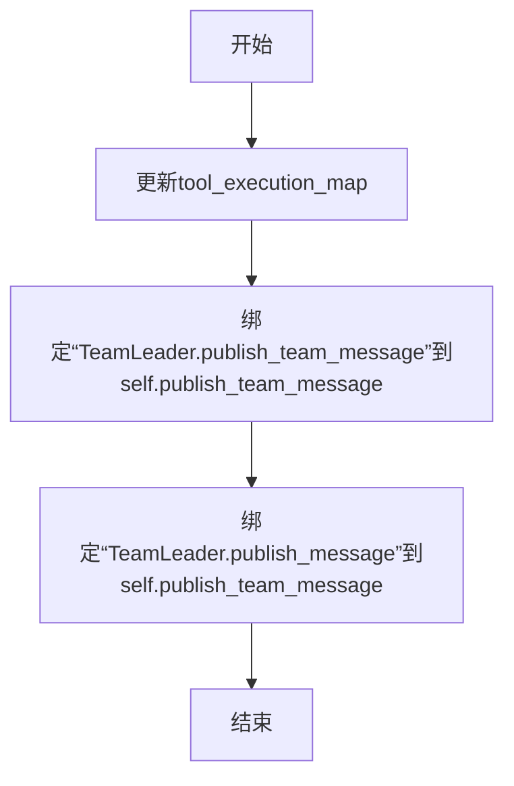
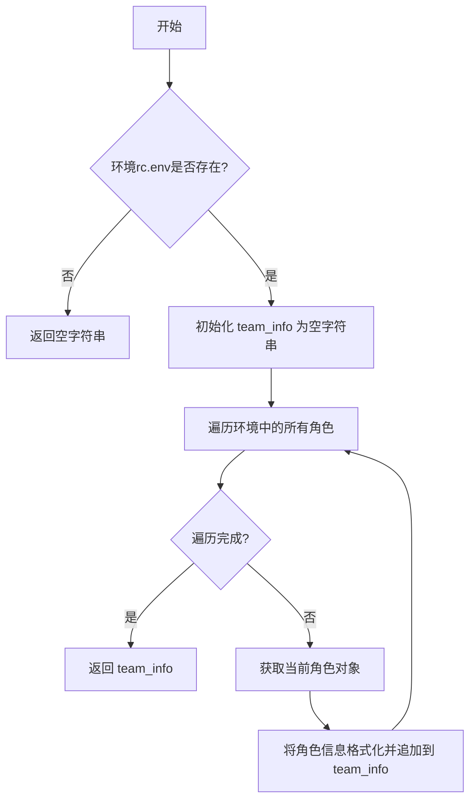
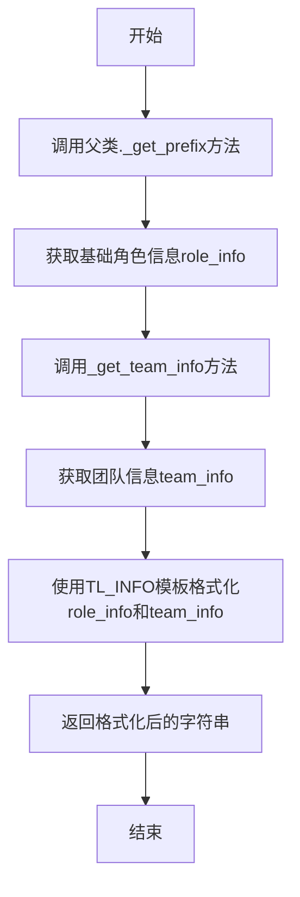
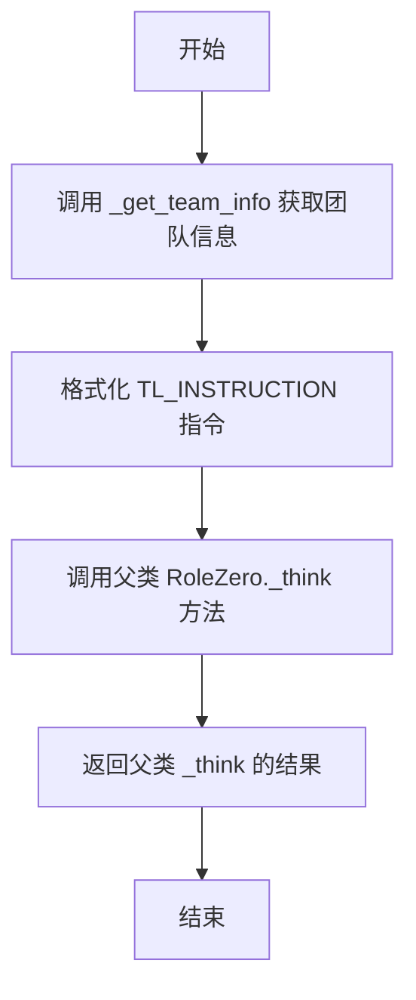
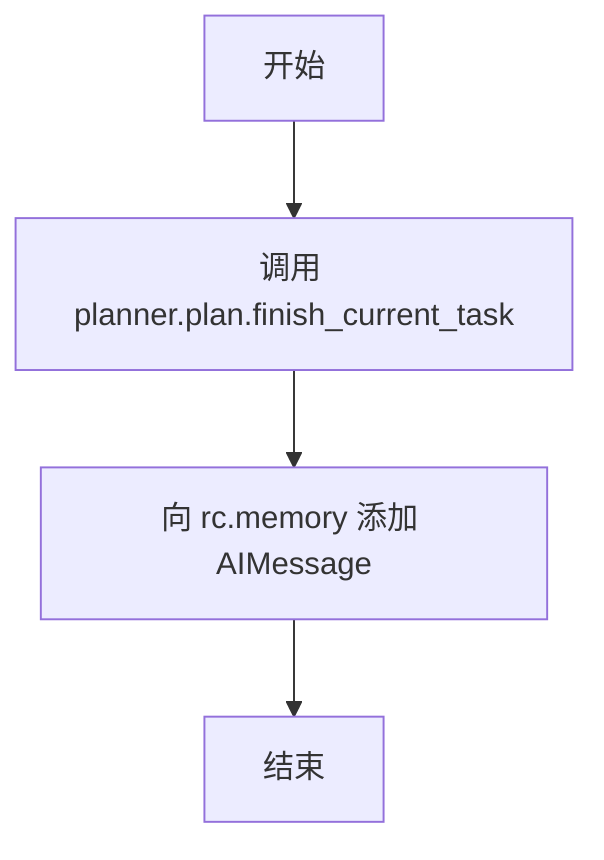

# `.\MetaGPT\metagpt\roles\di\team_leader.py` 详细设计文档

该代码定义了一个名为 TeamLeader 的智能体角色类，它继承自 RoleZero。TeamLeader 的核心功能是作为一个团队管理者，负责协调团队内其他成员的工作。它通过发布消息（publish_team_message）来向特定团队成员分配任务，并具备获取团队信息、思考决策、完成任务等能力，旨在组织一个多智能体团队以协助用户完成复杂目标。

## 整体流程

```mermaid
graph TD
    A[TeamLeader 被初始化] --> B[调用 _update_tool_execution 注册工具]
    B --> C{进入 _think 决策循环}
    C --> D[调用 _get_team_info 获取团队信息]
    D --> E[结合团队信息生成指令 (TL_INSTRUCTION)]
    E --> F[调用父类 RoleZero._think 进行决策]
    F --> G{决策结果是否需要发布消息?}
    G -- 是，调用 publish_team_message --> H[设置状态为等待 (_set_state(-1))]
    H --> I[创建 UserMessage 并指定接收者]
    I --> J[调用 publish_message 发布消息到环境]
    J --> K[消息被目标角色接收并处理]
    K --> C
    G -- 否，或调用 finish_current_task --> L[标记当前计划任务完成]
    L --> M[添加完成指令到记忆 (AIMessage)]
    M --> C
```

## 类结构

```
RoleZero (基础角色类，继承自 Role)
└── TeamLeader (团队领导者角色)
    ├── 继承自 RoleZero 的字段和方法
    ├── 新增/覆盖字段: experience_retriever, use_summary
    └── 新增/覆盖方法: _update_tool_execution, _get_team_info, _get_prefix, _think, publish_message, publish_team_message, finish_current_task
```

## 全局变量及字段


### `TEAMLEADER_NAME`
    
团队领导角色的默认名称常量

类型：`str`
    


### `QUICK_THINK_TAG`
    
标识快速思考消息的标签，用于在消息发布时进行特殊处理

类型：`str`
    


### `FINISH_CURRENT_TASK_CMD`
    
完成当前任务的命令文本，用于添加到内存中记录任务状态

类型：`str`
    


### `TL_INFO`
    
团队领导角色的信息提示模板，用于格式化角色和团队信息

类型：`str`
    


### `TL_INSTRUCTION`
    
团队领导角色的指令提示模板，用于指导其思考和决策

类型：`str`
    


### `TL_THOUGHT_GUIDANCE`
    
团队领导角色的思考指导文本，用于引导其推理过程

类型：`str`
    


### `TeamLeader.name`
    
角色的名称，继承自父类但被重写为TEAMLEADER_NAME常量

类型：`str`
    


### `TeamLeader.profile`
    
角色的简介，描述其为团队领导

类型：`str`
    


### `TeamLeader.goal`
    
角色的目标，即管理团队以协助用户

类型：`str`
    


### `TeamLeader.thought_guidance`
    
角色的思考指导文本，继承自父类但被重写为TL_THOUGHT_GUIDANCE常量

类型：`str`
    


### `TeamLeader.max_react_loop`
    
最大反应循环次数，允许团队领导在遇到错误或需要询问人类时进行额外轮次

类型：`int`
    


### `TeamLeader.tools`
    
角色可用的工具列表，包括计划、基础角色和团队领导自身

类型：`list[str]`
    


### `TeamLeader.experience_retriever`
    
经验检索器，用于从历史经验中学习，但被标记为排除在序列化之外

类型：`Annotated[ExpRetriever, Field(exclude=True)]`
    


### `TeamLeader.use_summary`
    
是否使用摘要功能的标志，当前未启用

类型：`bool`
    
    

## 全局函数及方法

### `TeamLeader.publish_team_message`

该方法用于向指定的团队成员发布一条消息，以启动或协调其工作。它会将消息封装为 `UserMessage` 并发布到环境中，同时暂停当前角色的状态以等待响应。

参数：

- `content`：`str`，要发送给团队成员的消息内容。
- `send_to`：`str`，接收消息的团队成员名称。

返回值：`None`，无返回值。

#### 流程图

```mermaid
flowchart TD
    A[开始] --> B{检查 send_to 是否为自身?}
    B -- 是 --> C[直接返回，避免自循环]
    B -- 否 --> D[调用 _set_state(-1) 暂停当前状态]
    D --> E[创建 UserMessage 对象]
    E --> F[调用 publish_message 发布消息]
    F --> G[结束]
```

#### 带注释源码

```python
def publish_team_message(self, content: str, send_to: str):
    """
    Publish a message to a team member, use member name to fill send_to args. You may copy the full original content or add additional information from upstream. This will make team members start their work.
    DONT omit any necessary info such as path, link, environment, programming language, framework, requirement, constraint from original content to team members because you are their sole info source.
    """
    # 每次发布消息时，将状态设置为 -1，暂停当前角色以等待响应
    self._set_state(-1)
    # 避免向自己发送消息，防止无限循环
    if send_to == self.name:
        return
    # 创建 UserMessage 对象，指定发送者、接收者和触发原因（RunCommand）
    # 调用 publish_message 方法，并显式指定 send_to 参数以覆盖默认值
    self.publish_message(
        UserMessage(content=content, sent_from=self.name, send_to=send_to, cause_by=RunCommand), send_to=send_to
    )
```

### `TeamLeader._update_tool_execution`

该方法用于更新`TeamLeader`角色的工具执行映射表，将特定的工具名称与对应的实例方法进行绑定，以便在角色执行过程中能够正确调用这些工具。

参数：
- `self`：`TeamLeader`，`TeamLeader`类的实例，代表当前团队领导者角色。

返回值：`None`，该方法不返回任何值，仅更新实例的内部状态。

#### 流程图



#### 带注释源码

```python
def _update_tool_execution(self):
    # 更新工具执行映射表，将工具名称与对应的实例方法进行关联
    self.tool_execution_map.update(
        {
            # 将工具名“TeamLeader.publish_team_message”绑定到当前实例的publish_team_message方法
            "TeamLeader.publish_team_message": self.publish_team_message,
            # 为“TeamLeader.publish_team_message”创建一个别名“TeamLeader.publish_message”，绑定到同一个方法
            "TeamLeader.publish_message": self.publish_team_message,  # alias
        }
    )
```

### `TeamLeader._get_team_info`

该方法用于获取当前环境中除自身（Team Leader）外所有团队成员的基本信息，并以格式化字符串的形式返回。

参数：
- `self`：`TeamLeader`，表示当前`TeamLeader`类的实例。

返回值：`str`，返回一个字符串，其中包含团队成员的信息。如果当前环境（`self.rc.env`）不存在，则返回空字符串。

#### 流程图



#### 带注释源码

```python
def _get_team_info(self) -> str:
    # 检查当前角色上下文（rc）中的环境（env）是否存在
    if not self.rc.env:
        # 如果环境不存在，则没有团队成员信息，返回空字符串
        return ""
    # 初始化一个空字符串，用于累积团队成员信息
    team_info = ""
    # 遍历环境中所有注册的角色（字典的值）
    for role in self.rc.env.roles.values():
        # 注释掉的代码：可以选择跳过团队领导者自身的信息
        # if role.profile == "Team Leader":
        #     continue
        # 将每个角色的名称、简介（profile）和目标（goal）格式化为一行，并追加到 team_info 字符串中
        team_info += f"{role.name}: {role.profile}, {role.goal}\n"
    # 返回包含所有团队成员信息的字符串
    return team_info
```

### `TeamLeader._get_prefix`

该方法用于生成团队领导者的前缀信息，结合了父类的基础角色信息和当前团队的成员信息。

参数：无

返回值：`str`，返回一个格式化后的字符串，包含角色信息和团队信息。

#### 流程图



#### 带注释源码

```python
def _get_prefix(self) -> str:
    # 调用父类RoleZero的_get_prefix方法，获取基础角色信息
    role_info = super()._get_prefix()
    # 调用自身的_get_team_info方法，获取当前团队信息
    team_info = self._get_team_info()
    # 使用TL_INFO模板（一个格式字符串）将角色信息和团队信息组合成最终的前缀字符串
    return TL_INFO.format(role_info=role_info, team_info=team_info)
```

### `TeamLeader._think`

该方法用于团队领导者在执行任务前的思考过程，主要职责是设置当前指令（instruction）并调用父类的 `_think` 方法进行决策。

参数：

-  `self`：`TeamLeader`，当前 `TeamLeader` 类的实例

返回值：`bool`，表示思考过程是否成功完成

#### 流程图



#### 带注释源码

```python
async def _think(self) -> bool:
    # 获取当前团队信息，用于构建指令
    self.instruction = TL_INSTRUCTION.format(team_info=self._get_team_info())
    # 调用父类 RoleZero 的 _think 方法执行核心思考逻辑
    return await super()._think()
```


### `TeamLeader.publish_message`

该方法重写了父类 `Role` 的 `publish_message` 方法，用于在团队环境中发布消息。其核心逻辑是：当在 `Role.run` 方法内部调用时（除了标记为“快速思考”的消息），默认将消息发送给“无接收者”（`send_to="no one"`），以防止在角色自身运行循环中触发其他角色的响应；当被动态调用（例如通过工具调用）时，则可以将消息发送给指定的团队成员。该方法最终通过环境（`env`）的 `publish_message` 方法将消息广播出去。

参数：

-  `msg`：`Message`，需要发布的消息对象。
-  `send_to`：`str`，默认为 `"no one"`。指定消息的接收者。如果消息的 `cause_by` 属性不是 `QUICK_THINK_TAG`，则此参数值将覆盖消息对象内部的 `send_to` 字段。

返回值：`None`，该方法不返回任何值。

#### 流程图

```mermaid
flowchart TD
    A[开始: publish_message(msg, send_to)] --> B{msg 是否有效?};
    B -- 否 --> C[结束: 直接返回];
    B -- 是 --> D{环境 rc.env 是否存在?};
    D -- 否 --> C;
    D -- 是 --> E{msg.cause_by 是否为 QUICK_THINK_TAG?};
    E -- 否 --> F[设置 msg.send_to = 传入的 send_to 参数];
    E -- 是 --> G[保持 msg.send_to 不变];
    F --> H;
    G --> H[调用 rc.env.publish_message(msg, publicer=self.profile)];
    H --> C;
```

#### 带注释源码

```python
def publish_message(self, msg: Message, send_to="no one"):
    """Overwrite Role.publish_message, send to no one if called within Role.run (except for quick think), send to the specified role if called dynamically."""
    # 1. 检查消息对象是否有效，无效则直接返回
    if not msg:
        return
    # 2. 检查运行上下文（rc）中的环境（env）是否存在，不存在则无法发布消息，直接返回
    if not self.rc.env:
        # If env does not exist, do not publish the message
        return
    # 3. 核心逻辑：判断消息的来源。
    #    如果消息不是由“快速思考”触发的（即不是在角色自身运行循环中产生的内部思考），
    #    则将传入的 `send_to` 参数值赋给消息对象的 `send_to` 字段。
    #    这样，当此方法被外部（如工具）调用时，可以指定接收者；而在内部循环中调用时，默认发送给“no one”。
    if msg.cause_by != QUICK_THINK_TAG:
        msg.send_to = send_to
    # 4. 调用环境对象的 publish_message 方法，将消息发布到环境中。
    #    `publicer=self.profile` 参数标识了消息的发布者。
    self.rc.env.publish_message(msg, publicer=self.profile)
```


### `TeamLeader.publish_team_message`

该方法用于团队领导者向指定的团队成员发布一条消息，以启动或协调该成员的工作。它会将消息封装为 `UserMessage` 并发布到环境中，同时将团队领导者的状态设置为等待响应。

参数：

- `content`：`str`，要发送给团队成员的消息内容。
- `send_to`：`str`，接收消息的团队成员名称。

返回值：`None`，无返回值。

#### 流程图

```mermaid
flowchart TD
    A[开始: publish_team_message] --> B{send_to 是否为自己?};
    B -- 是 --> C[返回，避免发送给自己];
    B -- 否 --> D[调用 _set_state(-1) 暂停等待响应];
    D --> E[创建 UserMessage 对象];
    E --> F[调用 publish_message 发送消息];
    F --> G[结束];
```

#### 带注释源码

```python
def publish_team_message(self, content: str, send_to: str):
    """
    向团队成员发布消息，使用成员名称填充 send_to 参数。
    你可以复制完整的原始内容或添加上游的附加信息。这将使团队成员开始工作。
    不要向团队成员省略任何必要信息，如路径、链接、环境、编程语言、框架、需求、约束等，因为你是他们唯一的信息来源。
    """
    # 每次发布消息时，将状态设置为 -1，以暂停并等待响应
    self._set_state(-1)
    # 避免向自己发送消息
    if send_to == self.name:
        return
    # 指定外部的 send_to 以覆盖默认的 "no one" 值。
    # 使用 UserMessage，因为来自自身的消息对其他角色来说类似于用户请求。
    self.publish_message(
        UserMessage(content=content, sent_from=self.name, send_to=send_to, cause_by=RunCommand), send_to=send_to
    )
```

### `TeamLeader.finish_current_task`

该方法用于标记团队当前正在执行的任务为完成状态，并向团队的工作记忆中添加一条表示任务完成的系统消息。

参数：
- 无

返回值：`None`，无返回值

#### 流程图



#### 带注释源码

```python
def finish_current_task(self):
    # 调用计划器（planner）中计划（plan）对象的 finish_current_task 方法，
    # 将当前正在执行的任务标记为完成状态。
    self.planner.plan.finish_current_task()
    
    # 创建一个内容为 FINISH_CURRENT_TASK_CMD 的 AI 消息对象，
    # 并将其添加到角色的记忆（rc.memory）中。
    # 这通常用于在团队内部广播或记录“当前任务已完成”这一事件。
    self.rc.memory.add(AIMessage(content=FINISH_CURRENT_TASK_CMD))
```

## 关键组件


### 张量索引与惰性加载

代码中未直接涉及张量操作或惰性加载机制。

### 反量化支持

代码中未涉及量化或反量化相关操作。

### 量化策略

代码中未涉及量化策略。

### 团队领导角色 (TeamLeader)

继承自RoleZero，负责管理一个团队以协助用户。它通过`publish_team_message`方法向团队成员分发任务，并协调团队工作流程。

### 经验检索器 (Experience Retriever)

通过`experience_retriever`字段（类型为`ExpRetriever`）实现，用于检索和利用过往经验来辅助决策。当前默认使用`SimpleExpRetriever`。

### 工具注册与执行映射 (Tool Registry & Execution Map)

通过`@register_tool`装饰器注册`TeamLeader`类及其`publish_team_message`方法为可用工具。`_update_tool_execution`方法将工具方法映射到`tool_execution_map`中，支持动态调用。

### 消息发布与协调机制 (Message Publishing & Coordination)

核心功能是协调团队。`publish_team_message`方法允许团队领导向特定成员发送消息以启动其工作。`publish_message`方法被重写以控制消息的发送目标（默认为“no one”），防止在角色运行循环中意外广播消息。

### 任务状态管理 (Task State Management)

`finish_current_task`方法用于标记当前计划中的任务为完成，并向记忆中添加一条完成指令消息。`_set_state(-1)`在发布团队消息时被调用，用于暂停团队领导以等待响应。


## 问题及建议


### 已知问题

-   **工具注册与使用不一致**：`TeamLeader` 类通过 `@register_tool` 装饰器注册了 `publish_team_message` 方法，但在 `_update_tool_execution` 方法中，除了注册同名工具外，还注册了一个别名 `"TeamLeader.publish_message"`。这可能导致工具调用时的歧义或混淆，特别是当 `publish_message` 方法本身是一个功能不同的覆盖方法时。
-   **状态管理逻辑可能不清晰**：在 `publish_team_message` 方法中，调用 `self._set_state(-1)` 来暂停角色以等待响应。这种硬编码的状态值（-1）可能缺乏明确的文档说明，使得状态机的逻辑对于其他开发者不够直观，容易在维护时引入错误。
-   **潜在的空环境（env）风险**：`_get_team_info` 和 `publish_message` 方法中都检查了 `self.rc.env` 是否存在。虽然这是防御性编程，但也暗示了 `env` 可能为 `None` 的场景。如果 `env` 在预期应存在的场景下为 `None`，可能意味着角色初始化或上下文设置存在问题，但当前代码仅选择静默处理（返回空字符串或不发布消息），可能掩盖了更深层次的配置或流程错误。
-   **向自身发送消息的静默处理**：`publish_team_message` 方法中，如果 `send_to` 参数等于 `self.name`，则直接 `return`。虽然这避免了循环，但调用者可能不知道消息未被发送，缺乏反馈机制。
-   **经验检索器（experience_retriever）字段的默认值**：`experience_retriever` 字段使用 `SimpleExpRetriever()` 作为默认值。如果 `SimpleExpRetriever` 的初始化有副作用或成本较高，这可能不是最佳实践。同时，该字段被 `Field(exclude=True)` 标记，其序列化/反序列化行为需要与框架的其它部分保持一致。

### 优化建议

-   **明确工具映射**：建议审查并清理 `_update_tool_execution` 方法中的工具映射。如果 `publish_message` 方法不应作为工具被直接调用，则应移除其别名注册。确保工具注册表与实际可执行的方法保持一致，提高代码的可读性和可维护性。
-   **增强状态管理的可读性**：考虑将硬编码的状态值（如 `-1`）定义为类常量（例如 `STATE_WAITING_FOR_RESPONSE = -1`），并添加注释说明其含义。这可以使状态转换逻辑更加清晰。
-   **强化环境（env）的验证与错误处理**：与其在多个方法中静默处理 `env` 为 `None` 的情况，不如在角色初始化或关键方法开始时进行更严格的验证。可以考虑添加日志记录或抛出更明确的异常，以便在开发或调试阶段快速发现问题。
-   **改进消息发送的反馈机制**：在 `publish_team_message` 方法中，当尝试向自身发送消息时，可以考虑记录一条警告日志，或者抛出一个明确的、可捕获的异常，让调用者知晓操作未成功执行。
-   **评估经验检索器的初始化策略**：评估 `SimpleExpRetriever` 的初始化成本。如果成本较高，可以考虑改为惰性初始化（例如，在 `__init__` 方法中设置为 `None`，在首次访问时创建实例）。同时，确认 `Field(exclude=True)` 的用法是否符合项目的数据序列化策略。
-   **考虑添加类型提示与文档**：为 `_set_state` 等方法添加更详细的类型提示和文档字符串，说明其参数和状态值的含义，有助于团队协作和代码理解。


## 其它


### 设计目标与约束

1.  **设计目标**：
    *   **团队管理**：作为`RoleZero`的派生类，`TeamLeader`的核心目标是管理一个由多个`Role`（角色）组成的团队，以协助用户完成复杂任务。
    *   **任务协调与分发**：通过`publish_team_message`方法，将用户需求或分解后的子任务分发给指定的团队成员，并触发其工作流程。
    *   **状态控制**：在发布消息后，通过`_set_state(-1)`暂停自身运行，等待团队成员响应，实现简单的同步或协调逻辑。
    *   **信息聚合与上下文提供**：在思考（`_think`）和生成指令前缀（`_get_prefix`）时，动态获取并整合团队信息（`_get_team_info`），为自身的决策提供上下文。
    *   **工具集成**：通过`_update_tool_execution`方法，将`publish_team_message`等关键方法注册为可被调用的工具，支持在规划或执行过程中动态调用。

2.  **设计约束**：
    *   **继承约束**：必须继承自`RoleZero`基类，遵循其生命周期（`run`、`_think`、`_act`、`_observe`）和状态管理机制。
    *   **环境依赖**：其核心功能（如获取团队信息、发布消息）严重依赖于`self.rc.env`（运行时环境）的存在和正确配置。若环境不存在，相关操作将静默失败或返回空值。
    *   **消息协议约束**：发布给团队成员的消息需遵循`Message`及其子类（如`UserMessage`）的格式规范，并正确设置`cause_by`、`sent_from`、`send_to`等字段以确保消息路由和处理的正确性。
    *   **工具注册约束**：作为可被调用的工具，其方法（如`publish_team_message`）需要通过`@register_tool`装饰器或`_update_tool_execution`方法进行注册，并遵循特定的签名和调用约定。
    *   **循环限制**：通过`max_react_loop = 3`限制了单次触发后的最大反应循环次数，以防止无限循环或过长的处理。

### 错误处理与异常设计

1.  **静默处理**：
    *   `publish_message`方法：当传入的`msg`参数为`None`或`self.rc.env`不存在时，方法直接返回，不执行任何操作，也不抛出异常。这是一种防御性编程，但可能掩盖调用错误。
    *   `_get_team_info`方法：当`self.rc.env`不存在时，直接返回空字符串`""`。
    *   `publish_team_message`方法：当`send_to`参数等于`self.name`（即尝试给自己发消息）时，直接返回，避免自循环。

2.  **依赖缺失**：
    *   代码中多处关键操作（如`self.rc.env.publish_message`， `self.rc.env.roles`）都假设`self.rc.env`已正确初始化。若未满足此前提，功能将失效。当前设计未对此进行显式的错误检查或抛出清晰的异常。

3.  **潜在异常点**：
    *   `self.planner.plan.finish_current_task()`（在`finish_current_task`方法中）：直接访问`self.planner.plan`的属性链，如果`planner`或`plan`未初始化或为`None`，将抛出`AttributeError`。
    *   `self.rc.memory.add(...)`：同样假设`self.rc.memory`已正确初始化。

4.  **异常处理建议**：
    *   在关键依赖（如`env`， `planner`， `memory`）缺失时，考虑抛出更具描述性的自定义异常（如`EnvironmentNotSetError`， `PlannerNotInitializedError`），以便于调试和问题定位。
    *   对于`publish_team_message`中的无效`send_to`（如不存在的角色名），当前逻辑会通过环境发布消息，但可能无法送达。可考虑增加验证逻辑，或在环境层面提供反馈。

### 数据流与状态机

1.  **主要数据流**：
    *   **团队信息流**：`_get_team_info` -> `_get_prefix` / `_think` -> 生成的提示词（`instruction`） -> 大模型（LLM）决策。
    *   **任务分发流**：外部调用或内部决策 -> `publish_team_message(content, send_to)` -> 创建`UserMessage` -> `publish_message` -> `self.rc.env.publish_message` -> 目标角色`Role`的收件箱。
    *   **状态控制流**：调用`publish_team_message` -> `_set_state(-1)` -> 导致`RoleZero`运行循环暂停 -> 等待被唤醒（例如，通过环境消息或外部触发）-> 状态恢复后继续`_think`或`_act`。

2.  **状态机（继承自`RoleZero`/`Role`）**：
    *   `TeamLeader`本身没有定义独立的状态枚举，但通过`_set_state(-1)`利用了基类的状态机制。状态`-1`通常表示“等待”或“暂停”。
    *   其生命周期由基类的`run`方法驱动，涉及`_think`（思考）、`_act`（行动）、`_observe`（观察）等状态的转换。`publish_team_message`中的`_set_state(-1)`是干预此自动状态循环的关键操作。

3.  **关键数据载体**：
    *   `Message`及其子类（`UserMessage`， `AIMessage`）：是角色间通信和与历史记忆（`memory`）交互的核心数据载体。`cause_by`字段用于标识消息的触发来源（如`RunCommand`）。

### 外部依赖与接口契约

1.  **外部类/模块依赖**：
    *   `metagpt.roles.di.role_zero.RoleZero`：直接父类，提供了核心的角色框架、反应循环和工具执行机制。
    *   `metagpt.schema.Message`， `UserMessage`， `AIMessage`：定义了消息的格式和类型。
    *   `metagpt.strategy.experience_retriever.ExpRetriever`， `SimpleExpRetriever`：用于经验检索的组件（虽然当前`use_summary: bool = False`可能未激活其完整功能）。
    *   `metagpt.tools.tool_registry.register_tool`：装饰器，用于将类或其方法注册到全局工具库中。
    *   `metagpt.actions.di.run_command.RunCommand`：作为`cause_by`的标识，表示消息是由运行命令触发的。
    *   `metagpt.const.TEAMLEADER_NAME`：常量，定义团队领导者的默认名称。
    *   `metagpt.prompts.di.*`：多个提示词模板（`TL_INFO`， `TL_INSTRUCTION`， `TL_THOUGHT_GUIDANCE`， `FINISH_CURRENT_TASK_CMD`， `QUICK_THINK_TAG`），提供了与大模型交互的文本模板。

2.  **接口契约**：
    *   `RoleZero`基类契约：必须实现或重写`_think`， `_act`， `_get_prefix`等方法，并遵循其预期的返回值和行为。
    *   `ExpRetriever`接口契约：`experience_retriever`字段需符合`ExpRetriever`接口（尽管当前可能未深度使用）。
    *   `register_tool`契约：使用`@register_tool(include_functions=[...])`装饰器，意味着`TeamLeader`类及其指定的方法（`publish_team_message`）将被暴露为一个可被其他组件或规划器发现和调用的工具。
    *   **环境(`rc.env`)契约**：假设环境对象提供了`roles`字典（用于获取团队信息）和`publish_message`方法（用于发布消息）。`TeamLeader`严重依赖于此环境接口的正确实现。
    *   **消息路由契约**：通过设置`Message`的`send_to`和`sent_from`字段，并与环境的`publish_message`逻辑配合，实现基于角色的消息路由。`TeamLeader`发布的`UserMessage`的`cause_by=RunCommand`可能被接收方角色用于特殊处理。

3.  **配置依赖**：
    *   通过`pydantic.Field(exclude=True)`对`experience_retriever`字段进行了序列化排除，表明该字段通常由内部逻辑管理，而非外部配置。

    