# `.\MetaGPT\metagpt\roles\engineer.py` 详细设计文档

该文件定义了一个Engineer角色类，它是MetaGPT框架中的一个核心角色，负责根据系统设计和任务列表编写、审查、总结代码，并支持增量迭代和代码计划变更。Engineer能够处理来自上游角色（如项目经理、架构师）的消息，根据不同的触发条件执行代码编写、代码总结或代码计划变更等动作，并将结果保存到项目仓库中。

## 整体流程

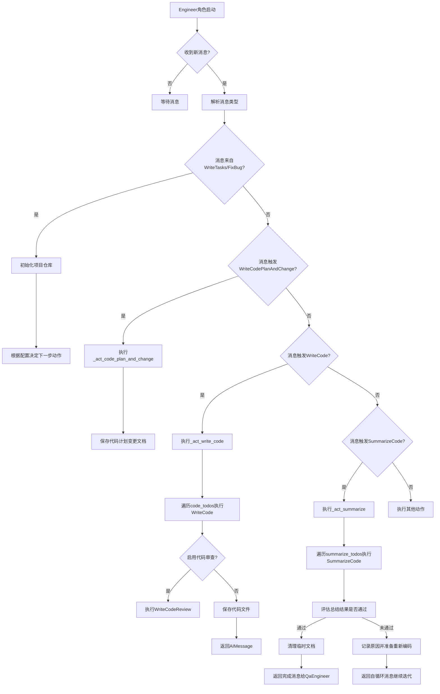

## 类结构

```
Role (基类)
└── Engineer
    ├── 类字段: name, profile, goal, constraints, n_borg, use_code_review, code_todos, summarize_todos, next_todo_action, n_summarize, input_args, repo
    ├── 类方法: __init__, _act_sp_with_cr, _act, _act_write_code, _act_summarize, _act_code_plan_and_change, _is_pass, _think, _new_coding_context, _new_coding_doc, _new_code_actions, _new_summarize_actions, _new_code_plan_and_change_action, _init_python_folder, _is_fixbug, _get_any_code_plan_and_change
    └── 属性: action_description
```

## 全局变量及字段


### `IS_PASS_PROMPT`
    
用于评估代码总结是否通过的提示词模板，通过LLM判断总结内容是否表明还有任务需要完成。

类型：`str`
    


### `Engineer.name`
    
工程师角色的名称，默认值为'Alex'。

类型：`str`
    


### `Engineer.profile`
    
工程师角色的描述，默认值为'Engineer'。

类型：`str`
    


### `Engineer.goal`
    
工程师角色的目标，即编写优雅、可读、可扩展、高效的代码。

类型：`str`
    


### `Engineer.constraints`
    
工程师角色的约束条件，要求代码符合谷歌风格标准，模块化且可维护，并使用与用户需求相同的语言。

类型：`str`
    


### `Engineer.n_borg`
    
用于控制并行处理任务的borg数量，默认值为1。

类型：`int`
    


### `Engineer.use_code_review`
    
指示是否启用代码审查的标志。

类型：`bool`
    


### `Engineer.code_todos`
    
存储待执行的WriteCode动作列表。

类型：`list`
    


### `Engineer.summarize_todos`
    
存储待执行的SummarizeCode动作列表。

类型：`list`
    


### `Engineer.next_todo_action`
    
指示下一个待执行动作的名称，用于AgentStore向用户展示。

类型：`str`
    


### `Engineer.n_summarize`
    
记录已执行的自动SummarizeCode动作次数，用于控制最大自动调用次数。

类型：`int`
    


### `Engineer.input_args`
    
存储从上游消息中解析出的输入参数，例如项目路径、变更的文件名等。

类型：`Optional[BaseModel]`
    


### `Engineer.repo`
    
项目仓库对象，提供对源代码、文档等资源的访问和操作接口。

类型：`Optional[ProjectRepo]`
    
    

## 全局函数及方法

### `Engineer.__init__`

初始化Engineer角色实例，设置默认属性、启用内存、配置初始动作和观察列表，并初始化待办事项列表。

参数：

- `self`：`Engineer`，当前Engineer实例
- `**kwargs`：`dict`，传递给父类Role的初始化参数

返回值：`None`，无返回值

#### 流程图

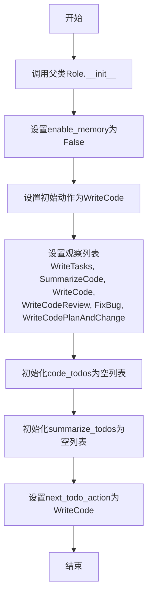

#### 带注释源码

```python
def __init__(self, **kwargs) -> None:
    # 调用父类Role的初始化方法，传入所有关键字参数
    super().__init__(**kwargs)
    # 禁用内存功能，表示该角色不保留历史消息
    self.enable_memory = False
    # 设置角色的初始动作为WriteCode，表示工程师的首要任务是编写代码
    self.set_actions([WriteCode])
    # 设置角色观察的消息类型，当收到这些类型的消息时会触发相应的处理逻辑
    self._watch([WriteTasks, SummarizeCode, WriteCode, WriteCodeReview, FixBug, WriteCodePlanAndChange])
    # 初始化代码待办事项列表，用于存储需要执行的代码编写任务
    self.code_todos = []
    # 初始化代码总结待办事项列表，用于存储需要执行的代码总结任务
    self.summarize_todos = []
    # 设置下一个待办动作为WriteCode，表示在初始化后首先执行代码编写
    self.next_todo_action = any_to_name(WriteCode)
```

### `Engineer._act_sp_with_cr`

该方法负责执行代码编写任务，并可选择性地进行代码审查。它遍历待处理的代码任务列表，对每个任务执行代码编写操作，如果启用了代码审查，则对生成的代码进行审查。最终，将编写或审查后的代码保存到项目仓库中，并返回发生变更的文件集合。

参数：

- `self`：`Engineer`，Engineer类的实例，包含当前角色的状态和配置。
- `review`：`bool`，指示是否对编写的代码进行审查，默认为False。

返回值：`Set[str]`，返回一个包含所有发生变更的文件名的集合。

#### 流程图

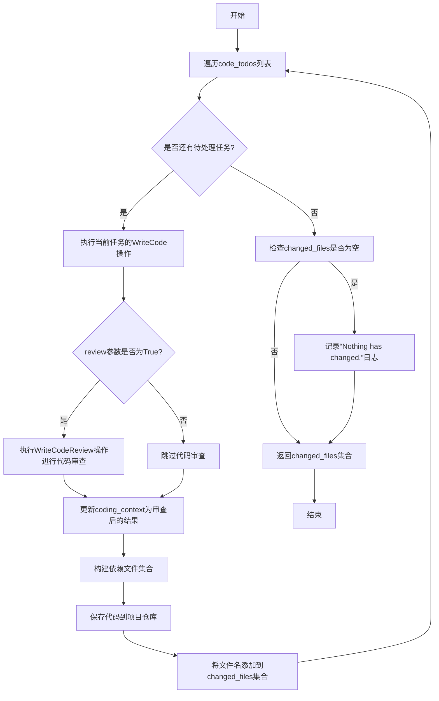

#### 带注释源码

```python
async def _act_sp_with_cr(self, review=False) -> Set[str]:
    # 初始化一个空集合，用于存储发生变更的文件名
    changed_files = set()
    # 遍历所有待处理的代码任务
    for todo in self.code_todos:
        """
        # 从历史数据中选择关键信息以减少提示长度（根据人类经验总结）：
        1. 所有来自架构师的信息
        2. 所有来自项目经理的信息
        3. 是否需要其他代码（当前需要）？
        TODO: 目标是不需要。在清晰的任务分解后，基于设计思路，应该能够在不依赖其他代码的情况下编写单个文件。如果做不到，意味着需要更清晰的定义。这是编写更长代码的关键。
        """
        # 执行当前任务的WriteCode操作，获取编码上下文
        coding_context = await todo.run()
        # 如果启用了代码审查，则执行审查操作
        if review:
            # 创建WriteCodeReview动作实例
            action = WriteCodeReview(
                i_context=coding_context,
                repo=self.repo,
                input_args=self.input_args,
                context=self.context,
                llm=self.llm,
            )
            # 初始化动作
            self._init_action(action)
            # 执行代码审查，更新编码上下文
            coding_context = await action.run()

        # 构建依赖文件集合，包括设计文档和任务文档
        dependencies = {coding_context.design_doc.root_relative_path, coding_context.task_doc.root_relative_path}
        # 如果启用了增量迭代功能，添加代码计划与变更文档作为依赖
        if self.config.inc:
            dependencies.add(coding_context.code_plan_and_change_doc.root_relative_path)
        # 将代码保存到项目仓库的源代码目录
        await self.repo.srcs.save(
            filename=coding_context.filename,
            dependencies=list(dependencies),
            content=coding_context.code_doc.content,
        )
        # 将保存的文件名添加到变更文件集合中
        changed_files.add(coding_context.code_doc.filename)
    # 如果没有文件发生变更，记录日志
    if not changed_files:
        logger.info("Nothing has changed.")
    # 返回发生变更的文件名集合
    return changed_files
```

### `Engineer._act`

`Engineer._act` 方法是 `Engineer` 角色的核心行动方法。它根据当前待办事项（`self.rc.todo`）的类型，决定执行哪种具体的行动模式：编写代码计划与变更、编写代码或总结代码。该方法充当了角色行为的路由器，将不同的消息触发导向相应的处理逻辑。

参数：

-  `self`：`Engineer` 类型，`Engineer` 角色的实例。
-  无其他显式参数。

返回值：`Message | None` 类型，返回一个 `AIMessage` 对象（包含行动结果或指示信息）或 `None`（当没有待办事项时）。

#### 流程图

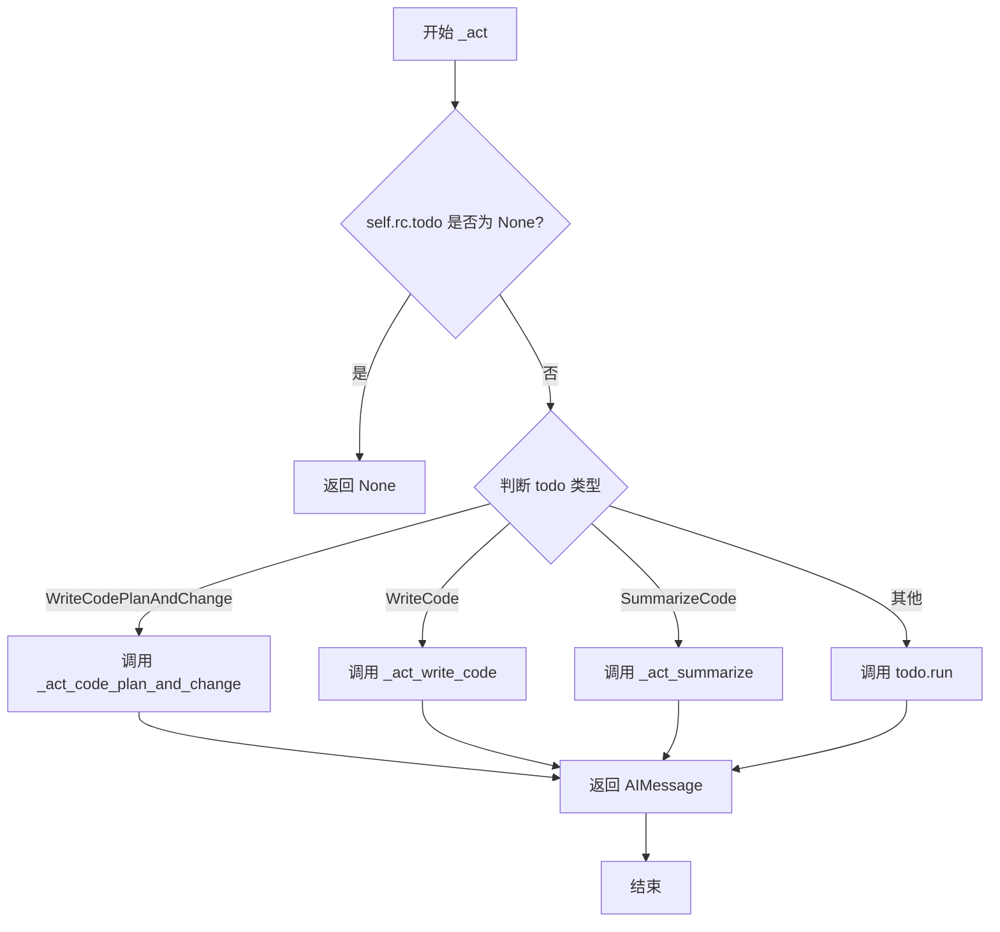

#### 带注释源码

```python
async def _act(self) -> Message | None:
    """Determines the mode of action based on whether code review is used."""
    # 1. 检查是否有待办事项，如果没有则返回None
    if self.rc.todo is None:
        return None
    # 2. 根据待办事项的类型，路由到不同的处理方法
    if isinstance(self.rc.todo, WriteCodePlanAndChange):
        # 2.1 如果是编写代码计划与变更，设置下一个待办动作为WriteCode，并执行对应方法
        self.next_todo_action = any_to_name(WriteCode)
        return await self._act_code_plan_and_change()
    if isinstance(self.rc.todo, WriteCode):
        # 2.2 如果是编写代码，设置下一个待办动作为SummarizeCode，并执行对应方法
        self.next_todo_action = any_to_name(SummarizeCode)
        return await self._act_write_code()
    if isinstance(self.rc.todo, SummarizeCode):
        # 2.3 如果是总结代码，设置下一个待办动作为WriteCode，并执行对应方法
        self.next_todo_action = any_to_name(WriteCode)
        return await self._act_summarize()
    # 2.4 对于其他类型的待办事项，直接执行其run方法
    return await self.rc.todo.run(self.rc.history)
```

### `Engineer._act_write_code`

该方法负责执行代码编写任务，可选择性地进行代码审查。它遍历`code_todos`列表中的每个待办任务，调用`WriteCode`动作生成代码，并根据`use_code_review`标志决定是否调用`WriteCodeReview`进行代码审查。最终，将生成的代码保存到项目仓库中，并返回一个空的`AIMessage`以触发后续流程。

参数：

- `self`：`Engineer`，当前`Engineer`实例的引用。
- 无其他显式参数。

返回值：`AIMessage`，一个空的`AIMessage`对象，其`cause_by`属性根据是否进行代码审查设置为`WriteCodeReview`或`WriteCode`，`send_to`属性设置为`MESSAGE_ROUTE_TO_SELF`，用于在角色内部触发消息路由。

#### 流程图

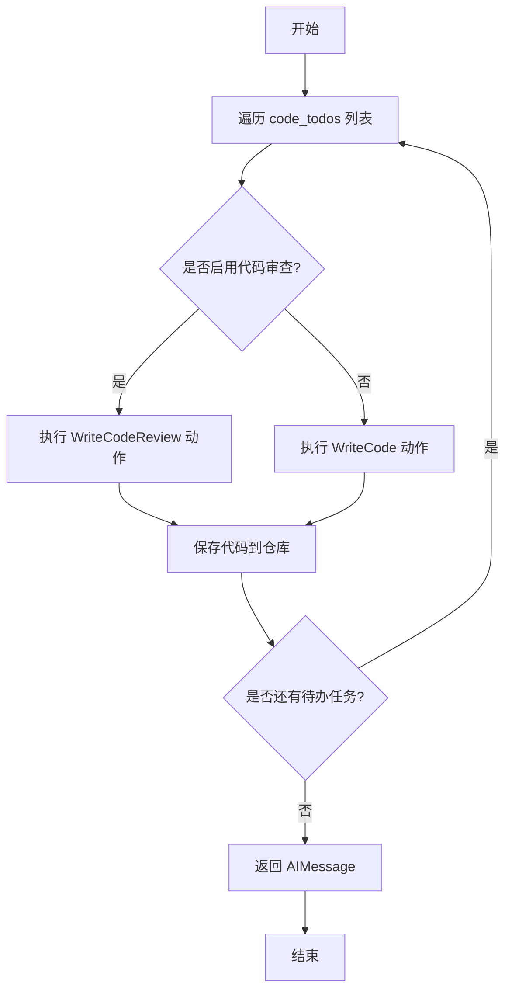

#### 带注释源码

```python
async def _act_write_code(self):
    # 调用 _act_sp_with_cr 方法执行代码编写，并根据 use_code_review 标志决定是否进行代码审查
    await self._act_sp_with_cr(review=self.use_code_review)
    # 返回一个空的 AIMessage，cause_by 根据是否进行代码审查设置为 WriteCodeReview 或 WriteCode，
    # send_to 设置为 MESSAGE_ROUTE_TO_SELF，用于在角色内部触发消息路由
    return AIMessage(
        content="",
        cause_by=WriteCodeReview if self.use_code_review else WriteCode,
        send_to=MESSAGE_ROUTE_TO_SELF
    )
```

### `Engineer._act_summarize`

该方法负责执行代码总结（SummarizeCode）动作。它会遍历`summarize_todos`列表中的每个待总结任务，生成代码总结文档，并根据总结结果判断是否需要进一步处理。如果总结通过，则清理相关文档；如果未通过，则记录原因并准备后续任务。最后，根据配置决定是否继续迭代总结或完成整个编码流程。

参数：

-  `self`：`Engineer`，Engineer实例自身

返回值：`AIMessage | None`，返回一个AIMessage对象，包含编码完成的信息或触发下一步动作的指令；如果没有任务则返回None。

#### 流程图

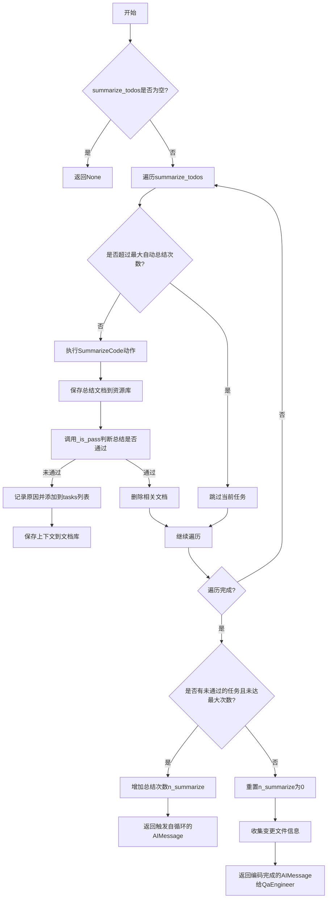

#### 带注释源码

```python
async def _act_summarize(self):
    """
    执行代码总结动作。
    遍历所有待总结的任务，生成总结文档，并根据结果决定后续流程。
    """
    tasks = []  # 用于存储未通过总结的任务上下文
    for todo in self.summarize_todos:
        # 检查是否超过最大自动总结次数限制
        if self.n_summarize >= self.config.max_auto_summarize_code:
            break
        # 执行SummarizeCode动作，生成代码总结
        summary = await todo.run()
        # 构建总结文件名（基于设计文档名）
        summary_filename = Path(todo.i_context.design_filename).with_suffix(".md").name
        # 收集依赖文件：设计文档、任务文档和所有相关代码文件
        dependencies = {todo.i_context.design_filename, todo.i_context.task_filename}
        for filename in todo.i_context.codes_filenames:
            rpath = self.repo.src_relative_path / filename
            dependencies.add(str(rpath))
        # 将总结保存到资源库的code_summary目录
        await self.repo.resources.code_summary.save(
            filename=summary_filename, content=summary, dependencies=dependencies
        )
        # 判断总结是否通过（是否还有待办事项）
        is_pass, reason = await self._is_pass(summary)
        if not is_pass:
            # 如果未通过，记录原因并准备后续任务
            todo.i_context.reason = reason
            tasks.append(todo.i_context.model_dump())
            # 将未通过的上下文保存到文档库，用于后续处理
            await self.repo.docs.code_summary.save(
                filename=Path(todo.i_context.design_filename).name,
                content=todo.i_context.model_dump_json(),
                dependencies=dependencies,
            )
        else:
            # 如果通过，删除之前可能保存的未通过记录
            await self.repo.docs.code_summary.delete(filename=Path(todo.i_context.design_filename).name)
    # 清空待总结任务列表
    self.summarize_todos = []
    logger.info(f"--max-auto-summarize-code={self.config.max_auto_summarize_code}")
    # 判断是否所有总结都通过或已达到最大迭代次数
    if not tasks or self.config.max_auto_summarize_code == 0:
        self.n_summarize = 0  # 重置总结次数
        # 收集所有变更的文件信息，用于最终消息
        kvs = self.input_args.model_dump()
        kvs["changed_src_filenames"] = [
            str(self.repo.srcs.workdir / i) for i in list(self.repo.srcs.changed_files.keys())
        ]
        if self.repo.docs.code_plan_and_change.changed_files:
            kvs["changed_code_plan_and_change_filenames"] = [
                str(self.repo.docs.code_plan_and_change.workdir / i)
                for i in list(self.repo.docs.code_plan_and_change.changed_files.keys())
            ]
        if self.repo.docs.code_summary.changed_files:
            kvs["changed_code_summary_filenames"] = [
                str(self.repo.docs.code_summary.workdir / i)
                for i in list(self.repo.docs.code_summary.changed_files.keys())
            ]
        # 返回编码完成的消息，通知QaEngineer进行下一步
        return AIMessage(
            content=f"Coding is complete. The source code is at {self.repo.workdir.name}/{self.repo.srcs.root_path}, containing: "
            + "\n".join(
                list(self.repo.resources.code_summary.changed_files.keys())
                + list(self.repo.srcs.changed_files.keys())
                + list(self.repo.resources.code_plan_and_change.changed_files.keys())
            ),
            instruct_content=AIMessage.create_instruct_value(kvs=kvs, class_name="SummarizeCodeOutput"),
            cause_by=SummarizeCode,
            send_to="Edward",  # QaEngineer的名称
        )
    # 如果还有未通过的任务且未达到最大次数，增加总结次数并触发自循环
    self.n_summarize += 1 if self.config.max_auto_summarize_code > self.n_summarize else 0
    return AIMessage(content="", cause_by=SummarizeCode, send_to=MESSAGE_ROUTE_TO_SELF)
```

### `Engineer._act_code_plan_and_change`

该方法负责执行`WriteCodePlanAndChange`动作，生成代码计划和变更文档，该文档将指导后续的`WriteCode`和`WriteCodeReview`操作。它会将生成的计划保存到项目仓库的文档和资源目录中，并返回一个表示操作完成的空消息。

参数：
-  `self`：`Engineer`，当前`Engineer`角色实例。

返回值：`AIMessage`，一个内容为空、表示操作已完成的AI消息，其`cause_by`属性设置为`WriteCodePlanAndChange`，`send_to`属性设置为`MESSAGE_ROUTE_TO_SELF`，用于触发后续的内部消息处理流程。

#### 流程图

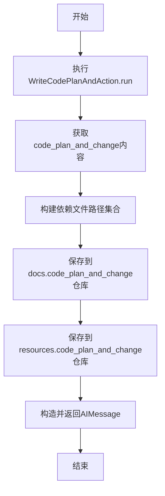

#### 带注释源码

```python
async def _act_code_plan_and_change(self):
    """Write code plan and change that guides subsequent WriteCode and WriteCodeReview"""
    # 1. 执行当前的待办事项（WriteCodePlanAndChange动作），生成代码计划和变更节点。
    node = await self.rc.todo.run()
    # 2. 从节点中提取结构化的代码计划与变更内容，并转换为JSON字符串。
    code_plan_and_change = node.instruct_content.model_dump_json()
    # 3. 构建依赖文件路径集合，包括需求文档、PRD、系统设计和任务文档。
    dependencies = {
        REQUIREMENT_FILENAME,
        str(Path(self.rc.todo.i_context.prd_filename).relative_to(self.repo.workdir)),
        str(Path(self.rc.todo.i_context.design_filename).relative_to(self.repo.workdir)),
        str(Path(self.rc.todo.i_context.task_filename).relative_to(self.repo.workdir)),
    }
    # 4. 根据设计文件名确定代码计划与变更文档的保存路径。
    code_plan_and_change_filepath = Path(self.rc.todo.i_context.design_filename)
    # 5. 将JSON格式的代码计划与变更内容保存到项目文档仓库的`code_plan_and_change`目录。
    await self.repo.docs.code_plan_and_change.save(
        filename=code_plan_and_change_filepath.name, content=code_plan_and_change, dependencies=dependencies
    )
    # 6. 将原始内容（可能为Markdown格式）保存到项目资源仓库的`code_plan_and_change`目录。
    await self.repo.resources.code_plan_and_change.save(
        filename=code_plan_and_change_filepath.with_suffix(".md").name,
        content=node.content,
        dependencies=dependencies,
    )
    # 7. 返回一个空的AIMessage，标志此步骤完成，并指示下一步由谁处理。
    return AIMessage(content="", cause_by=WriteCodePlanAndChange, send_to=MESSAGE_ROUTE_TO_SELF)
```

### `Engineer._is_pass`

该方法用于评估代码总结（summary）是否通过检查。它通过向LLM（大语言模型）发送一个特定的提示（`IS_PASS_PROMPT`），询问总结中是否还有需要完成的任务。如果LLM的响应中包含"YES"，则表示通过；否则表示未通过，并返回LLM的响应作为原因。

参数：
- `self`：`Engineer`，`Engineer`类的实例，提供上下文和LLM访问。
- `summary`：`str`，需要被评估的代码总结文本。

返回值：`tuple[bool, str]`，一个元组，第一个元素是布尔值，表示是否通过（`True`为通过，`False`为未通过）；第二个元素是字符串，包含LLM的原始响应，用于记录或作为未通过的原因。

#### 流程图

```mermaid
graph TD
    A[开始] --> B[构造提示词<br>IS_PASS_PROMPT.format<br>context=summary]
    B --> C[调用LLM<br>llm.aask]
    C --> D{LLM响应中<br>是否包含'YES'?}
    D -- 是 --> E[返回 (True, rsp)]
    D -- 否 --> F[返回 (False, rsp)]
    E --> G[结束]
    F --> G
```

#### 带注释源码

```python
async def _is_pass(self, summary) -> (str, str):
    # 1. 构造提示词：将代码总结（summary）填入预设的IS_PASS_PROMPT模板中。
    rsp = await self.llm.aask(msg=IS_PASS_PROMPT.format(context=summary), stream=False)
    # 2. 记录LLM的完整响应，便于调试和追踪。
    logger.info(rsp)
    # 3. 判断逻辑：检查LLM的响应字符串中是否包含"YES"。
    if "YES" in rsp:
        # 4. 如果包含"YES"，则认为总结通过，无需进一步操作。
        return True, rsp
    # 5. 如果不包含"YES"，则认为总结未通过，LLM的响应中可能包含了待办事项列表。
    return False, rsp
```

### `Engineer._think`

该方法负责根据接收到的消息（`Message`）来决定工程师（`Engineer`）角色下一步应该执行哪个动作（`Action`）。它分析消息的来源（`cause_by`）和内容，判断当前是应该创建新的代码编写任务、代码总结任务，还是代码计划与变更任务，并相应地设置待办事项（`self.rc.todo`）。它是工程师角色决策逻辑的核心。

参数：

- `self`：`Engineer`，`Engineer` 类的实例，代表工程师角色本身。

返回值：`bool`，返回一个布尔值，表示是否成功设置了新的待办动作（`self.rc.todo`）。如果设置了，返回 `True`；否则返回 `False`。

#### 流程图

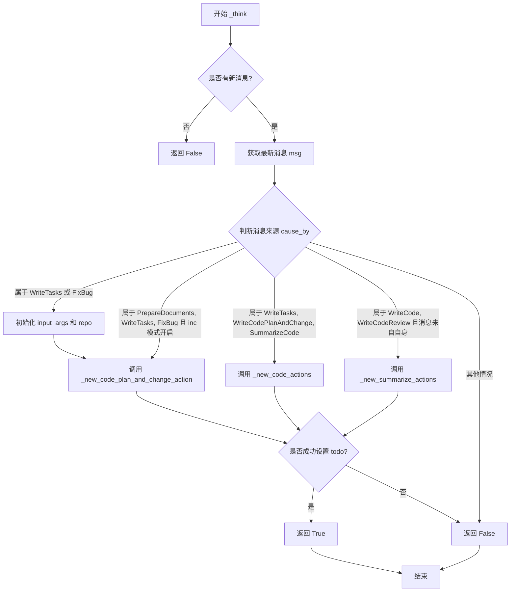

#### 带注释源码

```python
async def _think(self) -> bool:
    # 检查是否有新消息到达，如果没有则直接返回 False，表示无需行动。
    if not self.rc.news:
        return False
    # 获取消息队列中的第一条消息。
    msg = self.rc.news[0]
    # 从消息中提取指令内容，这通常包含触发动作所需的参数。
    input_args = msg.instruct_content
    # 如果消息是由 WriteTasks 或 FixBug 动作触发的，则初始化工程师的输入参数和项目仓库。
    if msg.cause_by in {any_to_str(WriteTasks), any_to_str(FixBug)}:
        self.input_args = input_args
        self.repo = ProjectRepo(input_args.project_path)
        # 如果仓库中尚未设置源代码路径，则自动探测并设置。
        if self.repo.src_relative_path is None:
            path = get_project_srcs_path(self.repo.workdir)
            self.repo.with_src_path(path)
    # 定义不同动作的触发过滤器集合。
    write_plan_and_change_filters = any_to_str_set([PrepareDocuments, WriteTasks, FixBug])
    write_code_filters = any_to_str_set([WriteTasks, WriteCodePlanAndChange, SummarizeCode])
    summarize_code_filters = any_to_str_set([WriteCode, WriteCodeReview])
    # 如果配置启用了增量模式（inc），并且消息来自计划与变更的触发源，则创建代码计划与变更任务。
    if self.config.inc and msg.cause_by in write_plan_and_change_filters:
        logger.debug(f"TODO WriteCodePlanAndChange:{msg.model_dump_json()}")
        await self._new_code_plan_and_change_action(cause_by=msg.cause_by)
        # 返回是否成功设置了待办事项。
        return bool(self.rc.todo)
    # 如果消息触发了代码编写任务（例如，来自任务分解或代码总结），则创建新的代码编写动作。
    if msg.cause_by in write_code_filters:
        logger.debug(f"TODO WriteCode:{msg.model_dump_json()}")
        await self._new_code_actions()
        return bool(self.rc.todo)
    # 如果消息触发了代码总结任务（例如，来自代码编写或代码审查，且消息是工程师自己发送的），则创建新的代码总结动作。
    if msg.cause_by in summarize_code_filters and msg.sent_from == any_to_str(self):
        logger.debug(f"TODO SummarizeCode:{msg.model_dump_json()}")
        await self._new_summarize_actions()
        return bool(self.rc.todo)
    # 如果消息不匹配任何已知的触发条件，则返回 False。
    return False
```

### `Engineer._new_coding_context`

该方法用于根据给定的源代码文件名和依赖关系，创建一个`CodingContext`对象。该上下文对象包含了编写或修改代码所需的所有相关信息，如设计文档、任务文档、现有代码文档以及代码计划变更文档（如果存在）。如果文件是自动生成的`__init__.py`，则返回`None`；如果无法找到必要的设计或任务文档，则抛出异常。

参数：

- `filename`：`str`，源代码文件的名称。
- `dependency`：`Dependency`，依赖关系对象，用于获取指定文件的依赖项。

返回值：`Optional[CodingContext]`，返回一个`CodingContext`对象，如果文件是`__init__.py`则返回`None`。

#### 流程图

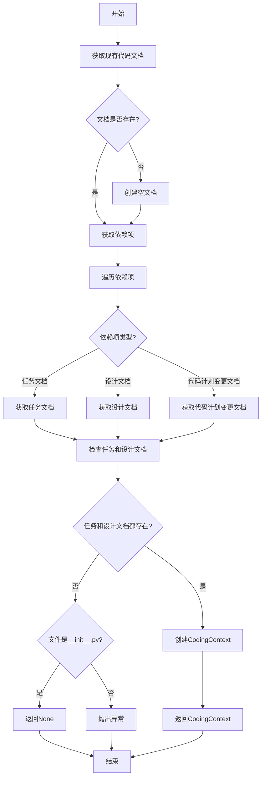

#### 带注释源码

```python
async def _new_coding_context(self, filename, dependency) -> Optional[CodingContext]:
    # 获取现有的代码文档，如果不存在则创建一个空的文档
    old_code_doc = await self.repo.srcs.get(filename)
    if not old_code_doc:
        old_code_doc = Document(root_path=str(self.repo.src_relative_path), filename=filename, content="")
    
    # 获取该文件的依赖项
    dependencies = {Path(i) for i in await dependency.get(old_code_doc.root_relative_path)}
    
    # 初始化任务文档、设计文档和代码计划变更文档
    task_doc = None
    design_doc = None
    code_plan_and_change_doc = await self._get_any_code_plan_and_change() if await self._is_fixbug() else None
    
    # 遍历依赖项，根据路径类型获取相应的文档
    for i in dependencies:
        if str(i.parent) == TASK_FILE_REPO:
            task_doc = await self.repo.docs.task.get(i.name)
        elif str(i.parent) == SYSTEM_DESIGN_FILE_REPO:
            design_doc = await self.repo.docs.system_design.get(i.name)
        elif str(i.parent) == CODE_PLAN_AND_CHANGE_FILE_REPO:
            code_plan_and_change_doc = await self.repo.docs.code_plan_and_change.get(i.name)
    
    # 检查任务文档和设计文档是否存在，如果不存在且文件不是__init__.py，则抛出异常
    if not task_doc or not design_doc:
        if filename == "__init__.py":  # `__init__.py` created by `init_python_folder`
            return None
        logger.error(f'Detected source code "{filename}" from an unknown origin.')
        raise ValueError(f'Detected source code "{filename}" from an unknown origin.')
    
    # 创建并返回CodingContext对象
    context = CodingContext(
        filename=filename,
        design_doc=design_doc,
        task_doc=task_doc,
        code_doc=old_code_doc,
        code_plan_and_change_doc=code_plan_and_change_doc,
    )
    return context
```

### `Engineer._new_coding_doc`

该方法根据给定的文件名和依赖关系，创建一个表示编码上下文的`Document`对象。它首先通过调用`_new_coding_context`方法构建一个`CodingContext`对象，然后将其序列化为JSON格式，并封装在一个`Document`对象中返回。如果`_new_coding_context`返回`None`（例如，对于由`init_python_folder`创建的`__init__.py`文件），则该方法也返回`None`。

参数：

- `filename`：`str`，需要创建编码文档的源代码文件名。
- `dependency`：`Any`，表示文件依赖关系的对象，用于获取与给定源代码文件相关的设计文档、任务文档和代码计划变更文档。

返回值：`Optional[Document]`，返回一个包含编码上下文JSON序列化内容的`Document`对象；如果无法创建编码上下文（例如，对于`__init__.py`文件），则返回`None`。

#### 流程图

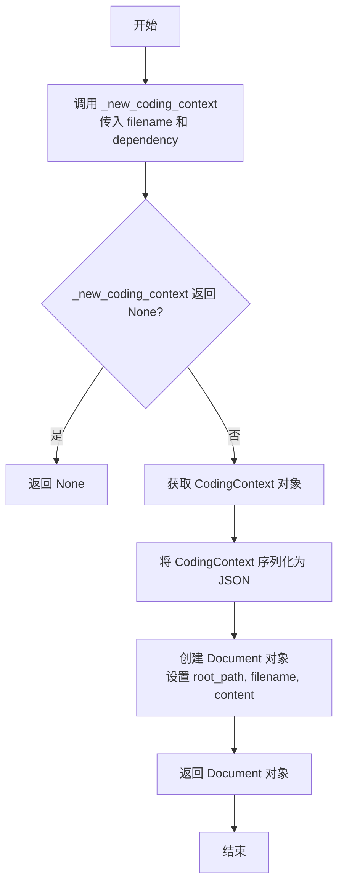

#### 带注释源码

```python
async def _new_coding_doc(self, filename, dependency) -> Optional[Document]:
    # 调用 _new_coding_context 方法，根据文件名和依赖关系构建编码上下文
    context = await self._new_coding_context(filename, dependency)
    # 如果 context 为 None（例如，对于 __init__.py 文件），则直接返回 None
    if not context:
        return None  # `__init__.py` created by `init_python_folder`
    # 将 CodingContext 对象序列化为 JSON 字符串，并创建一个 Document 对象
    coding_doc = Document(
        root_path=str(self.repo.src_relative_path),  # 设置文档的根路径
        filename=filename,  # 设置文件名
        content=context.model_dump_json()  # 设置内容为 CodingContext 的 JSON 表示
    )
    # 返回创建的 Document 对象
    return coding_doc
```

### `Engineer._new_code_actions`

该方法用于根据上游变更（如任务、设计文档的修改）或用户直接修改的源代码，创建新的`WriteCode`动作，以驱动代码的编写或更新。它会分析变更的文件，构建相应的编码上下文，并生成待执行的代码编写任务列表。

参数：

-  `self`：`Engineer`，`Engineer`类的实例，代表执行该方法的工程师角色。

返回值：`None`，该方法不直接返回值，但会更新实例的`code_todos`列表和`rc.todo`属性。

#### 流程图

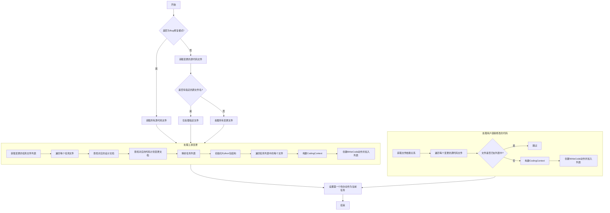

#### 带注释源码

```python
async def _new_code_actions(self):
    # 判断当前是否为Bug修复模式
    bug_fix = await self._is_fixbug()
    # 准备文件仓库：获取变更的源代码文件
    changed_src_files = self.repo.srcs.changed_files
    # 如果上下文指定了源文件名，则只处理该文件
    if self.context.kwargs.src_filename:
        changed_src_files = {self.context.kwargs.src_filename: ChangeType.UNTRACTED}
    # 如果是Bug修复模式，则处理所有源代码文件
    if bug_fix:
        changed_src_files = self.repo.srcs.all_files
    # 用于记录所有需要处理的变更文件上下文
    changed_files = Documents()
    
    # 第一部分：处理由上游变更（如任务、设计文档修改）引起的代码重写
    # 获取变更的任务文件名列表
    if hasattr(self.input_args, "changed_task_filenames"):
        changed_task_filenames = self.input_args.changed_task_filenames
    else:
        changed_task_filenames = [
            str(self.repo.docs.task.workdir / i) for i in list(self.repo.docs.task.changed_files.keys())
        ]
    # 遍历每个变更的任务文件
    for filename in changed_task_filenames:
        task_filename = Path(filename)
        design_filename = None
        # 获取变更的系统设计文件名列表
        if hasattr(self.input_args, "changed_system_design_filenames"):
            changed_system_design_filenames = self.input_args.changed_system_design_filenames
        else:
            changed_system_design_filenames = [
                str(self.repo.docs.system_design.workdir / i)
                for i in list(self.repo.docs.system_design.changed_files.keys())
            ]
        # 查找与当前任务文件对应的设计文档
        for i in changed_system_design_filenames:
            if task_filename.name == Path(i).name:
                design_filename = Path(i)
                break
        code_plan_and_change_filename = None
        # 获取变更的代码计划与变更文件名列表
        if hasattr(self.input_args, "changed_code_plan_and_change_filenames"):
            changed_code_plan_and_change_filenames = self.input_args.changed_code_plan_and_change_filenames
        else:
            changed_code_plan_and_change_filenames = [
                str(self.repo.docs.code_plan_and_change.workdir / i)
                for i in list(self.repo.docs.code_plan_and_change.changed_files.keys())
            ]
        # 查找与当前任务文件对应的代码计划变更文档
        for i in changed_code_plan_and_change_filenames:
            if task_filename.name == Path(i).name:
                code_plan_and_change_filename = Path(i)
                break
        # 加载设计文档、任务文档和代码计划变更文档
        design_doc = await Document.load(filename=design_filename, project_path=self.repo.workdir)
        task_doc = await Document.load(filename=task_filename, project_path=self.repo.workdir)
        code_plan_and_change_doc = await Document.load(
            filename=code_plan_and_change_filename, project_path=self.repo.workdir
        )
        # 从任务文档中解析出具体的任务文件列表
        task_list = self._parse_tasks(task_doc)
        # 为Python文件初始化包结构（创建__init__.py）
        await self._init_python_folder(task_list)
        # 遍历任务列表中的每个文件
        for task_filename in task_list:
            # 如果指定了只处理某个源文件，则跳过其他文件
            if self.context.kwargs.src_filename and task_filename != self.context.kwargs.src_filename:
                continue
            # 获取现有的代码文档，若不存在则创建空文档
            old_code_doc = await self.repo.srcs.get(task_filename)
            if not old_code_doc:
                old_code_doc = Document(
                    root_path=str(self.repo.src_relative_path), filename=task_filename, content=""
                )
            # 构建编码上下文（CodingContext）
            if not code_plan_and_change_doc:
                context = CodingContext(
                    filename=task_filename, design_doc=design_doc, task_doc=task_doc, code_doc=old_code_doc
                )
            else:
                context = CodingContext(
                    filename=task_filename,
                    design_doc=design_doc,
                    task_doc=task_doc,
                    code_doc=old_code_doc,
                    code_plan_and_change_doc=code_plan_and_change_doc,
                )
            # 将上下文封装为Document对象
            coding_doc = Document(
                root_path=str(self.repo.src_relative_path),
                filename=task_filename,
                content=context.model_dump_json(),
            )
            # 如果该文件已存在于变更列表中，记录警告（可能存在冲突）
            if task_filename in changed_files.docs:
                logger.warning(
                    f"Log to expose potential conflicts: {coding_doc.model_dump_json()} & "
                    f"{changed_files.docs[task_filename].model_dump_json()}"
                )
            # 将文档加入变更集合
            changed_files.docs[task_filename] = coding_doc
    # 根据所有收集到的变更文档，创建WriteCode动作列表
    self.code_todos = [
        WriteCode(i_context=i, repo=self.repo, input_args=self.input_args, context=self.context, llm=self.llm)
        for i in changed_files.docs.values()
    ]
    
    # 第二部分：处理用户直接修改的源代码文件（非由上游任务驱动）
    # 获取源代码文件的依赖关系图
    dependency = await self.repo.git_repo.get_dependency()
    for filename in changed_src_files:
        # 如果该文件已在第一部分被处理过，则跳过
        if filename in changed_files.docs:
            continue
        # 为每个变更的源代码文件构建编码上下文
        coding_doc = await self._new_coding_doc(filename=filename, dependency=dependency)
        if not coding_doc:
            continue  # 跳过由`init_python_folder`创建的`__init__.py`文件
        # 将文档加入变更集合
        changed_files.docs[filename] = coding_doc
        # 创建WriteCode动作并加入待办列表
        self.code_todos.append(
            WriteCode(
                i_context=coding_doc, repo=self.repo, input_args=self.input_args, context=self.context, llm=self.llm
            )
        )
    
    # 如果存在待办的代码编写任务，将第一个任务设置为当前要执行的动作
    if self.code_todos:
        self.set_todo(self.code_todos[0])
```

### `Engineer._new_summarize_actions`

该方法用于为代码库中的每个（系统设计文档，任务文档）对生成一个`SummarizeCode`动作，以汇总相关的源代码文件。它会遍历所有源代码文件，根据其依赖关系构建`CodeSummarizeContext`，并为每个唯一的上下文创建一个`SummarizeCode`动作，然后将其添加到`summarize_todos`列表中。

参数：

-  `self`：`Engineer`，`Engineer`类的实例，用于访问类属性和方法。

返回值：`None`，该方法不返回任何值，但会更新`self.summarize_todos`列表。

#### 流程图

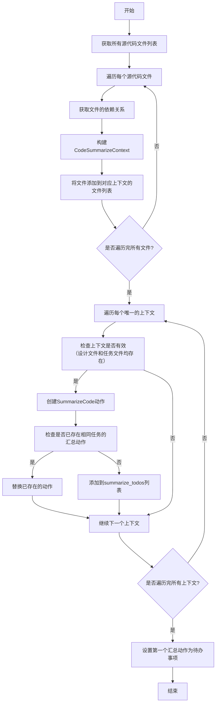

#### 带注释源码

```python
async def _new_summarize_actions(self):
    # 获取源代码仓库中的所有文件列表
    src_files = self.repo.srcs.all_files
    # 使用defaultdict初始化一个字典，键为CodeSummarizeContext，值为文件列表
    # 用于按上下文分组需要汇总的源代码文件
    summarizations = defaultdict(list)
    # 遍历每个源代码文件
    for filename in src_files:
        # 获取当前文件的依赖关系（如设计文档、任务文档等）
        dependencies = await self.repo.srcs.get_dependency(filename=filename)
        # 根据依赖文件列表构建CodeSummarizeContext对象
        ctx = CodeSummarizeContext.loads(filenames=list(dependencies))
        # 将当前文件名添加到对应上下文的文件列表中
        summarizations[ctx].append(filename)
    # 遍历每个唯一的上下文及其对应的文件列表
    for ctx, filenames in summarizations.items():
        # 检查上下文是否有效（必须包含设计文件和任务文件）
        # 如果无效，则跳过（例如由`init_python_folder`创建的`__init__.py`文件）
        if not ctx.design_filename or not ctx.task_filename:
            continue  # cause by `__init__.py` which is created by `init_python_folder`
        # 将文件列表赋值给上下文的codes_filenames属性
        ctx.codes_filenames = filenames
        # 创建一个新的SummarizeCode动作实例
        new_summarize = SummarizeCode(
            i_context=ctx, repo=self.repo, input_args=self.input_args, context=self.context, llm=self.llm
        )
        # 遍历现有的汇总动作列表，检查是否已存在相同任务的汇总动作
        for i, act in enumerate(self.summarize_todos):
            if act.i_context.task_filename == new_summarize.i_context.task_filename:
                # 如果存在，则替换为新的动作
                self.summarize_todos[i] = new_summarize
                new_summarize = None
                break
        # 如果不存在相同任务的汇总动作，则将新动作添加到列表中
        if new_summarize:
            self.summarize_todos.append(new_summarize)
    # 如果汇总动作列表不为空，则将第一个动作设置为待办事项
    if self.summarize_todos:
        self.set_todo(self.summarize_todos[0])
```

### `Engineer._new_code_plan_and_change_action`

该方法根据传入的触发原因（`cause_by`），创建一个`WriteCodePlanAndChange`动作，并将其设置为当前角色的待办事项（`self.rc.todo`）。它负责在增量开发模式下，基于需求文档或Bug报告，结合最新的产品需求文档（PRD）、系统设计文档和任务列表，生成代码变更计划，以指导后续的`WriteCode`和`WriteCodeReview`动作。

参数：

- `cause_by`：`str`，触发此方法的消息来源，用于区分是来自新需求（`PrepareDocuments`或`WriteTasks`）还是Bug修复（`FixBug`）。

返回值：`None`，此方法不直接返回值，但会设置`self.rc.todo`属性。

#### 流程图

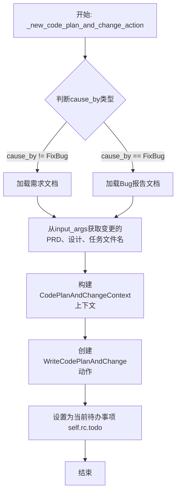

#### 带注释源码

```python
async def _new_code_plan_and_change_action(self, cause_by: str):
    """Create a WriteCodePlanAndChange action for subsequent to-do actions."""
    # 根据触发原因，准备不同的输入选项（需求或问题）
    options = {}
    if cause_by != any_to_str(FixBug):
        # 如果是新需求触发，加载需求文档内容
        requirement_doc = await Document.load(filename=self.input_args.requirements_filename)
        options["requirement"] = requirement_doc.content
    else:
        # 如果是Bug修复触发，加载问题报告内容
        fixbug_doc = await Document.load(filename=self.input_args.issue_filename)
        options["issue"] = fixbug_doc.content
    # 注释指出：如果存在多个不相关的需求，此逻辑可能有问题
    # 优先从input_args中获取变更的文件名（来自上游消息）
    if hasattr(self.input_args, "changed_prd_filenames"):
        code_plan_and_change_ctx = CodePlanAndChangeContext(
            requirement=options.get("requirement", ""),
            issue=options.get("issue", ""),
            prd_filename=self.input_args.changed_prd_filenames[0],
            design_filename=self.input_args.changed_system_design_filenames[0],
            task_filename=self.input_args.changed_task_filenames[0],
        )
    else:
        # 如果没有显式传递变更文件名，则从项目仓库中获取最新的相关文档
        code_plan_and_change_ctx = CodePlanAndChangeContext(
            requirement=options.get("requirement", ""),
            issue=options.get("issue", ""),
            prd_filename=str(self.repo.docs.prd.workdir / self.repo.docs.prd.all_files[0]),
            design_filename=str(self.repo.docs.system_design.workdir / self.repo.docs.system_design.all_files[0]),
            task_filename=str(self.repo.docs.task.workdir / self.repo.docs.task.all_files[0]),
        )
    # 创建WriteCodePlanAndChange动作实例，并设置为当前待办事项
    self.rc.todo = WriteCodePlanAndChange(
        i_context=code_plan_and_change_ctx,
        repo=self.repo,
        input_args=self.input_args,
        context=self.context,
        llm=self.llm,
    )
```

### `Engineer._init_python_folder`

该方法用于根据给定的任务列表，初始化Python包结构。它会遍历任务列表中的每个Python文件路径，确保其父目录存在，并调用`init_python_folder`函数来创建必要的`__init__.py`文件，从而将目录初始化为一个有效的Python包。

参数：

- `self`：`Engineer`，当前Engineer实例
- `task_list`：`List[str]`，包含任务文件路径的列表，每个路径可能指向一个Python文件

返回值：`None`，无返回值

#### 流程图

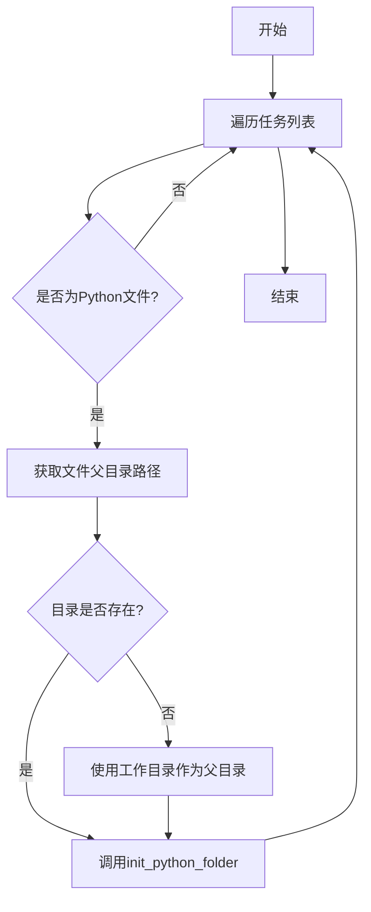

#### 带注释源码

```python
async def _init_python_folder(self, task_list: List[str]):
    # 遍历任务列表中的每个任务文件路径
    for i in task_list:
        # 将路径字符串转换为Path对象，便于操作
        filename = Path(i)
        # 检查文件扩展名是否为.py，只处理Python文件
        if filename.suffix != ".py":
            continue
        # 构建源代码目录下的父目录路径
        workdir = self.repo.srcs.workdir / filename.parent
        # 如果该目录不存在，则使用项目工作目录作为父目录
        if not workdir.exists():
            workdir = self.repo.workdir / filename.parent
        # 调用init_python_folder函数，初始化Python包结构
        await init_python_folder(workdir)
```

### `Engineer._is_fixbug`

该方法用于判断当前工程师角色是否处于修复Bug的模式。它通过检查`input_args`对象是否包含`issue_filename`属性来确定是否正在处理Bug修复任务。

参数：

-  `self`：`Engineer`，当前Engineer角色实例

返回值：`bool`，如果`input_args`存在且具有`issue_filename`属性，则返回`True`，表示处于修复Bug模式；否则返回`False`。

#### 流程图

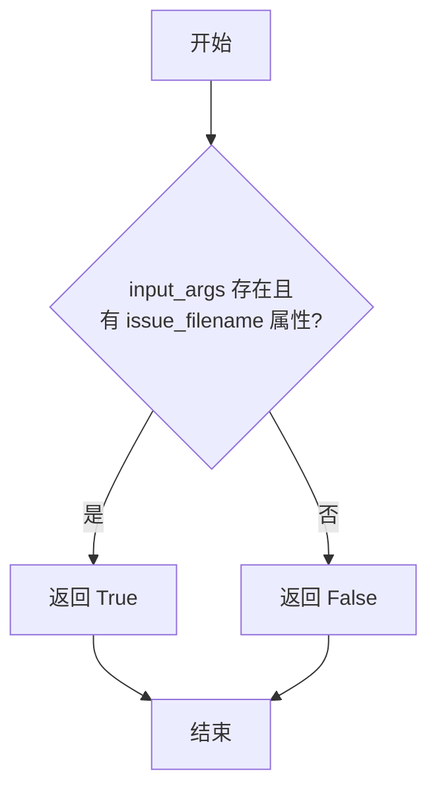

#### 带注释源码

```python
async def _is_fixbug(self) -> bool:
    # 判断当前是否处于修复Bug的模式
    # 通过检查 input_args 是否存在以及是否包含 issue_filename 属性来确定
    return bool(self.input_args and hasattr(self.input_args, "issue_filename"))
```

### `Engineer._get_any_code_plan_and_change`

该方法用于从项目的`code_plan_and_change`文档仓库中获取任意一个已更改且内容非空的代码计划与变更文档。它首先检查该仓库中所有已更改的文件，然后遍历这些文件，尝试加载每个文件对应的文档。一旦找到第一个内容非空的文档，就立即返回该文档对象。如果遍历完所有已更改文件后仍未找到符合条件的文档，则返回`None`。此方法主要用于在增量迭代或修复Bug的上下文中，为后续的代码编写或代码审查提供指导性的计划文档。

参数：

-  `self`：`Engineer`，当前`Engineer`角色实例的引用。

返回值：`Optional[Document]`，返回找到的第一个内容非空的`Document`对象，如果未找到则返回`None`。

#### 流程图

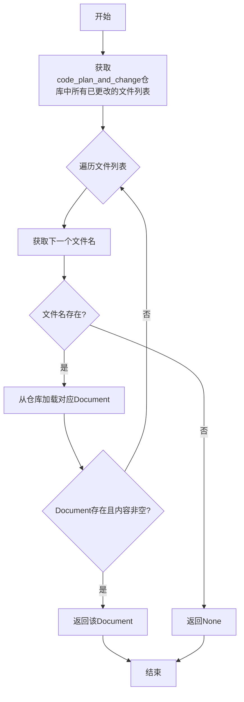

#### 带注释源码

```python
async def _get_any_code_plan_and_change(self) -> Optional[Document]:
    # 获取code_plan_and_change文档仓库中所有已更改文件的字典，键为文件名，值为变更类型
    changed_files = self.repo.docs.code_plan_and_change.changed_files
    # 遍历所有已更改文件的文件名
    for filename in changed_files.keys():
        # 根据文件名从code_plan_and_change仓库中加载对应的Document对象
        doc = await self.repo.docs.code_plan_and_change.get(filename)
        # 检查加载的Document对象是否存在且其内容字段不为空
        if doc and doc.content:
            # 如果找到符合条件的文档，立即返回
            return doc
    # 如果遍历完所有文件都未找到符合条件的文档，则返回None
    return None
```

### `Engineer.action_description`

`action_description` 是一个属性（property），用于返回当前角色（Engineer）下一步应该执行的动作描述。AgentStore 使用此属性向用户展示当前角色应该采取的行动。

参数：无（这是一个属性，没有显式参数）

返回值：`str`，返回一个字符串，描述当前角色下一步应该执行的动作名称。

#### 流程图

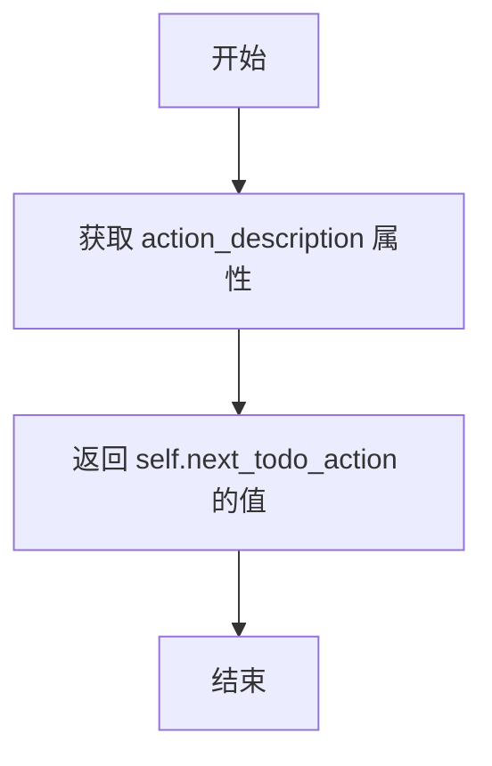

#### 带注释源码

```python
@property
def action_description(self) -> str:
    """
    AgentStore 使用此属性向用户展示当前角色应该采取的行动。
    返回一个字符串，描述当前角色下一步应该执行的动作名称。
    """
    return self.next_todo_action
```

## 关键组件

### Engineer角色类

Engineer类是MetaGPT框架中的一个核心角色，负责根据上游任务和设计文档编写、审查、总结代码，并支持增量迭代和Bug修复。它通过监听特定类型的消息来触发不同的编码相关动作，并管理代码的生成、评审、总结和计划变更的整个生命周期。

### 消息驱动的工作流

代码的核心运行流程由消息驱动。Engineer角色通过`_watch`方法监听来自`WriteTasks`、`SummarizeCode`、`WriteCode`、`WriteCodeReview`、`FixBug`、`WriteCodePlanAndChange`等动作的消息。在`_think`方法中，根据接收到的消息类型（`cause_by`）和配置，决定下一步要执行的动作（`todo`），例如创建新的编码任务、生成代码总结或制定代码变更计划。

### 项目仓库管理 (ProjectRepo)

`ProjectRepo`实例（`self.repo`）是Engineer与项目文件系统交互的核心组件。它封装了对源代码（`srcs`）、设计文档（`docs.system_design`）、任务文档（`docs.task`）、代码计划变更文档（`docs.code_plan_and_change`）和代码总结文档（`docs.code_summary`）等不同文件仓库的读写操作，并跟踪文件的变更状态和依赖关系。

### 动作（Action）系统

Engineer通过创建和执行不同的`Action`子类实例来完成具体工作。关键动作包括：
- `WriteCode`: 根据`CodingContext`生成或修改源代码。
- `WriteCodeReview`: 对生成的代码进行审查。
- `SummarizeCode`: 对已编写的代码进行总结，评估其完整性。
- `WriteCodePlanAndChange`: 在增量开发或修复Bug时，制定详细的代码变更计划。
- `FixBug`: 处理Bug修复请求（通过消息触发，但动作本身由其他角色或流程发起）。

### 上下文对象

系统使用多个结构化的上下文对象（Pydantic Model）在不同动作间传递信息：
- `CodingContext`: 包含编写单个代码文件所需的所有信息，如文件名、设计文档、任务文档、现有代码文档和代码变更计划文档。
- `CodeSummarizeContext`: 包含代码总结所需的信息，如相关的设计文件和任务文件，以及待总结的代码文件列表。
- `CodePlanAndChangeContext`: 包含创建代码变更计划所需的信息，如需求描述、问题描述以及相关的PRD、系统设计和任务文档路径。

### 增量迭代与Bug修复支持

通过`self.config.inc`标志和`_is_fixbug`方法，Engineer能够区分常规开发、增量迭代和Bug修复场景。在增量迭代或修复Bug时，会优先使用`WriteCodePlanAndChange`动作产生的`code_plan_and_change_doc`来指导`WriteCode`动作，确保代码变更与计划一致。

### 依赖分析与文件变更跟踪

Engineer利用`ProjectRepo`和底层的`GitRepository`来分析源代码文件之间的依赖关系（`get_dependency`）。它跟踪上游文档（任务、设计）的变更（`changed_files`），并据此决定需要重新生成或修改哪些源代码文件，确保代码与最新的设计和任务要求同步。

### 自动化代码总结与质量门禁

通过`SummarizeCode`动作和`_is_pass`方法，Engineer实现了自动化的代码总结和质量检查。生成的代码总结会被LLM评估，如果未通过检查（需要进一步工作），则会生成新的任务上下文并继续循环；如果通过，则标志着当前编码任务的完成，并可能将工作交接给QA工程师（`QaEngineer`）。

## 问题及建议


### 已知问题

-   **代码复杂度与职责过重**：`Engineer` 类的 `_act`、`_think`、`_new_code_actions` 等方法逻辑复杂，承担了任务解析、上下文构建、动作调度、文件管理等多种职责，违反了单一职责原则，导致代码难以理解、测试和维护。
-   **硬编码与魔法值**：代码中存在多处硬编码的字符串，如 `"__init__.py"`、`"Edward"`（QA工程师名称）、`MESSAGE_ROUTE_TO_SELF` 以及各类文件仓库路径常量（如 `TASK_FILE_REPO`）。这些魔法值降低了代码的可读性和可维护性，变更时容易出错。
-   **脆弱的条件判断逻辑**：在 `_think` 方法中，通过字符串比较（`msg.cause_by in any_to_str_set(...)`）来决定后续动作，这种逻辑耦合度高且脆弱。当新增或修改动作类型时，需要同步修改此处的判断条件，容易遗漏。
-   **潜在的循环依赖与无限循环风险**：`_act_summarize` 方法中，根据 `SummarizeCode` 的结果可能再次触发 `SummarizeCode` 动作（通过发送消息给 `MESSAGE_ROUTE_TO_SELF`）。虽然通过 `n_summarize` 和 `max_auto_summarize_code` 进行了次数限制，但整体流程的循环逻辑（`_think` -> `_act` -> 发消息 -> `_think` ...）若设计不当，存在陷入死循环或非预期迭代的风险。
-   **异常处理不完善**：在 `_new_coding_context` 等方法中，虽然对 `task_doc` 或 `design_doc` 缺失的情况进行了错误日志记录和抛出异常，但对于其他潜在异常（如文件IO错误、JSON解析错误、网络请求失败等）缺乏足够的捕获和处理，可能导致程序意外崩溃。
-   **数据状态管理分散**：`code_todos`、`summarize_todos`、`next_todo_action`、`n_summarize` 等多个实例变量用于管理内部状态，它们的更新散落在多个方法中（如 `_act`、`_think`、`_new_code_actions`），状态流转不清晰，增加了理解和调试的难度。
-   **注释中的待办事项（TODO）**：代码注释中遗留了未完成的TODO项（例如在 `_act_sp_with_cr` 方法中关于历史信息筛选的TODO），这表明部分设计或功能尚未完全实现或需要后续优化。

### 优化建议

-   **重构以遵循单一职责原则**：
    -   考虑将庞大的 `Engineer` 类拆分为多个更小、职责更明确的类或组件。例如，可以分离出 `TaskProcessor`（负责解析任务和构建上下文）、`ActionScheduler`（负责任务队列和动作调度）、`FileManager`（负责与 `ProjectRepo` 的交互和文件操作）。
    -   使用策略模式来封装不同的行为模式（如带评审的编码、纯编码、总结等），替代 `_act` 方法中复杂的 `if isinstance` 判断链。
-   **消除魔法值，增强可配置性**：
    -   将硬编码的字符串（如QA角色名 `"Edward"`）提取为类常量或配置文件项。
    -   对于文件路径和仓库标识，考虑使用枚举（Enum）或配置对象来管理，减少字符串散落。
-   **改进消息路由与动作触发机制**：
    -   引入更明确的消息类型或事件机制，替代基于字符串 `cause_by` 的过滤逻辑。可以定义一套清晰的事件枚举，每个事件对应明确的处理逻辑，使 `_think` 方法更简洁、更易扩展。
    -   考虑使用状态机或工作流引擎来显式地管理角色（Engineer）的状态转换和动作序列，使流程更可视化、可控。
-   **加强异常处理与日志记录**：
    -   在关键操作（如文件读写、网络请求、模型调用）周围添加更细致的 `try-except` 块，捕获特定异常并进行适当处理（如重试、降级、记录详细错误信息后安全退出）。
    -   优化日志输出，在关键决策点、状态变更处和异常情况下记录更具信息量的日志，便于问题追踪。
-   **集中化状态管理**：
    -   考虑引入一个专门的状态对象（State Object）来集中管理 `Engineer` 的运行时状态（如待办列表、当前动作、计数器等）。这可以使状态变更更透明，并简化相关方法的参数传递。
-   **实现TODO并完善文档**：
    -   评估并实现代码注释中遗留的TODO项，特别是关于历史信息筛选和任务清晰度定义的部分，这可能对生成代码的质量和效率有重要影响。
    -   补充和更新类、方法及复杂逻辑块的文档字符串（docstring），确保其准确反映当前实现，并解释关键设计决策。
-   **提升代码可测试性**：
    -   通过上述重构（如依赖注入、职责分离），可以显著提高代码的可测试性。为关键组件编写单元测试和集成测试，确保核心逻辑的正确性和重构的安全性。
    -   考虑使用Mock对象来隔离对外部系统（如LLM、文件系统、Git仓库）的依赖，使测试更快速、稳定。


## 其它


### 设计目标与约束

该模块的核心设计目标是实现一个能够根据上游任务、设计文档和代码变更计划，自动生成、审查和汇总代码的工程师角色。其主要约束包括：代码需符合Google风格指南，具备可读性、可扩展性和高效性；支持增量迭代开发模式；能够处理来自不同上游角色（如项目经理、架构师）的消息，并据此动态调整工作流；需要与项目仓库（ProjectRepo）紧密集成，管理源代码、设计文档、任务文档等多种文件类型。

### 错误处理与异常设计

模块中的错误处理主要通过日志记录和异常抛出实现。关键操作如文件加载失败（`Document.load`）、依赖解析异常、上下文创建失败（`_new_coding_context`）等，会记录错误日志（`logger.error`）并抛出`ValueError`等异常。对于异步消息处理中的潜在问题（如消息未就绪），代码注释指出已添加处理逻辑。`_is_pass`方法通过解析LLM响应来判断代码汇总是否通过，但未对LLM响应格式异常做显式处理，存在潜在风险。

### 数据流与状态机

数据流主要由消息驱动。外部消息（`Message`）通过`_watch`方法订阅，触发`_think`进行路由决策，进而调用`_act`执行相应动作（写代码、写计划、汇总）。内部状态通过`code_todos`、`summarize_todos`、`next_todo_action`、`n_summarize`等字段管理。状态转换依赖于消息的`cause_by`属性和配置（如`config.inc`）。核心状态机包括：空闲等待消息 -> 解析消息创建待办项 -> 执行待办项（WriteCode/WriteCodePlanAndChange/SummarizeCode） -> 生成结果消息 -> 返回空闲或触发下一轮待办。

### 外部依赖与接口契约

**外部依赖：**
1.  **LLM服务**：通过`self.llm.aask`调用，用于代码生成、审查、汇总和通过性判断。
2.  **项目仓库（ProjectRepo）**：核心外部依赖，提供源代码、设计文档、任务文档的读写、依赖管理和版本控制（通过`GitRepository`）功能。
3.  **多种Action类**：如`WriteCode`、`WriteCodeReview`、`SummarizeCode`、`WriteCodePlanAndChange`、`WriteTasks`、`FixBug`、`PrepareDocuments`。Engineer与这些Action通过`run`方法交互，并依赖其定义的输入输出上下文（如`CodingContext`, `CodeSummarizeContext`）。

**接口契约：**
1.  **消息订阅契约**：通过`_watch`方法声明关注的消息类型（`WriteTasks`, `SummarizeCode`等）。Engineer期望接收符合`Message` schema的消息，特别是`cause_by`和`instruct_content`字段用于决策和获取输入参数。
2.  **Action初始化契约**：在创建各种Action实例（如`WriteCode`）时，需要传递`i_context`、`repo`、`input_args`、`context`、`llm`等参数，这构成了与这些Action组件的协作契约。
3.  **文件存储契约**：与`ProjectRepo`的各个子仓库（`srcs`, `docs.system_design`, `docs.task`, `resources.code_summary`等）交互，遵循特定的文件名、内容和依赖关系格式进行文件保存。

    