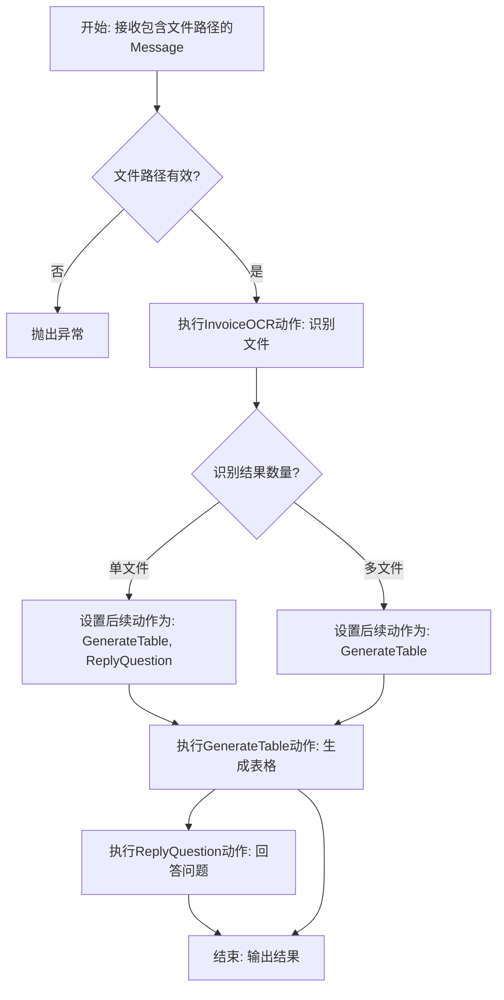
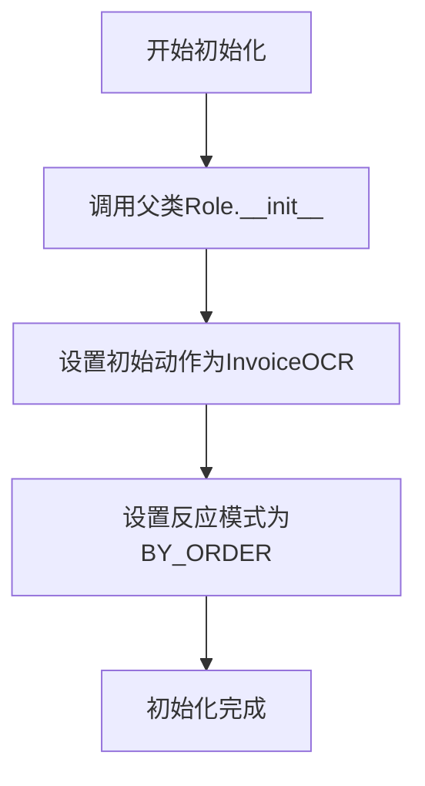
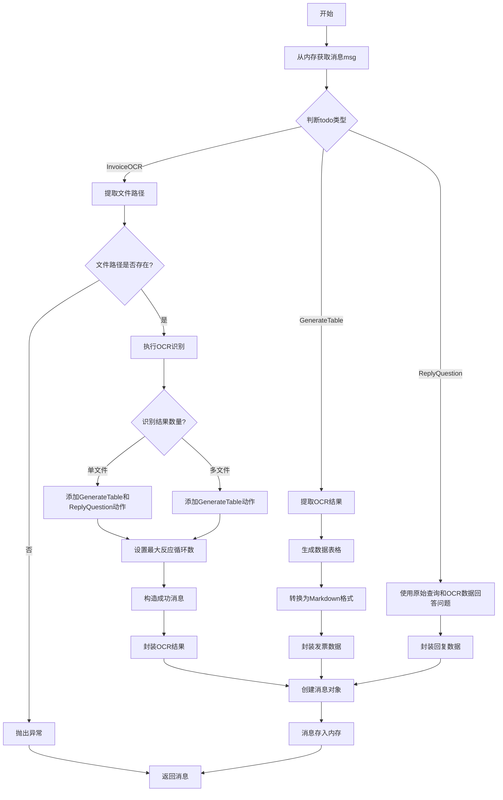

# `.\MetaGPT\metagpt\roles\invoice_ocr_assistant.py` 详细设计文档

该代码实现了一个发票OCR助手角色，核心功能是接收发票文件路径，通过OCR识别发票内容，根据识别结果生成包含收款方、城市、总金额、开票日期等关键信息的表格，并支持对单个发票文件的识别结果进行问答。

## 整体流程



## 类结构

```
BaseModel (Pydantic基类)
├── InvoicePath
├── OCRResults
├── InvoiceData
└── ReplyData
Role (MetaGPT基类)
└── InvoiceOCRAssistant
```

## 全局变量及字段


### `InvoicePath.file_path`
    
发票文件的路径，用于指定需要处理的发票文件位置。

类型：`Path`
    


### `OCRResults.ocr_result`
    
存储OCR识别结果的JSON字符串，包含从发票文件中提取的文本信息。

类型：`str`
    


### `InvoiceData.invoice_data`
    
存储结构化发票数据的列表，每个元素是一个字典，包含收款方、城市、总金额和开票日期等信息。

类型：`list[dict]`
    


### `ReplyData.content`
    
存储回复内容，用于封装对用户问题的回答或处理结果。

类型：`str`
    


### `InvoiceOCRAssistant.name`
    
角色的名称，标识该OCR助手的身份。

类型：`str`
    


### `InvoiceOCRAssistant.profile`
    
角色的简要描述，说明其功能和职责。

类型：`str`
    


### `InvoiceOCRAssistant.goal`
    
角色的核心目标，即OCR识别发票文件并生成主要信息表格。

类型：`str`
    


### `InvoiceOCRAssistant.constraints`
    
角色的约束条件或要求，当前为空字符串。

类型：`str`
    


### `InvoiceOCRAssistant.language`
    
生成发票表格时使用的语言，默认为中文。

类型：`str`
    


### `InvoiceOCRAssistant.filename`
    
当前处理的发票文件的名称，用于标识和记录文件。

类型：`str`
    


### `InvoiceOCRAssistant.origin_query`
    
存储用户原始查询内容，用于后续的问题回答处理。

类型：`str`
    


### `InvoiceOCRAssistant.orc_data`
    
存储单个文件的OCR识别结果，用于支持基于识别结果的问答功能。

类型：`Optional[list]`
    
    

## 全局函数及方法

### `InvoiceOCRAssistant.__init__`

该方法用于初始化`InvoiceOCRAssistant`角色实例。它首先调用父类`Role`的构造函数以完成基础初始化，然后为该角色设置默认的初始动作（`InvoiceOCR`），并指定角色的反应模式为按顺序执行（`BY_ORDER`）。

参数：

-  `kwargs`：`dict`，用于接收传递给父类`Role`构造函数的任意关键字参数。

返回值：`None`，构造函数不返回任何值。

#### 流程图



#### 带注释源码

```python
def __init__(self, **kwargs):
    # 调用父类Role的构造函数，传入所有关键字参数以完成基础角色属性的初始化
    super().__init__(**kwargs)
    # 为该角色设置初始动作列表，这里只包含InvoiceOCR这一个动作
    self.set_actions([InvoiceOCR])
    # 设置角色的反应模式为“按顺序执行”，即按actions列表中的顺序依次执行动作
    self._set_react_mode(react_mode=RoleReactMode.BY_ORDER.value)
```

### `InvoiceOCRAssistant._act`

该方法根据角色当前待执行的动作（`todo`）执行相应的发票OCR处理流程。它首先从内存中获取消息，然后根据动作类型执行OCR识别、生成表格或回答问题，最后将结果封装为消息并存入内存。

参数：

- `self`：`InvoiceOCRAssistant`，当前角色实例
- 无显式参数

返回值：`Message`，包含执行结果的消息对象

#### 流程图



#### 带注释源码

```python
async def _act(self) -> Message:
    """Perform an action as determined by the role.

    Returns:
        A message containing the result of the action.
    """
    # 从角色上下文的内存中获取最近的一条消息
    msg = self.rc.memory.get(k=1)[0]
    # 获取当前待执行的动作
    todo = self.rc.todo
    
    # 判断动作类型并执行相应逻辑
    if isinstance(todo, InvoiceOCR):
        # 保存原始查询内容
        self.origin_query = msg.content
        # 提取消息中的文件路径信息
        invoice_path: InvoicePath = msg.instruct_content
        file_path = invoice_path.file_path
        self.filename = file_path.name
        
        # 验证文件路径是否存在
        if not file_path:
            raise Exception("Invoice file not uploaded")
        
        # 执行OCR识别
        resp = await todo.run(file_path)
        actions = list(self.actions)
        
        # 根据识别结果数量决定后续动作
        if len(resp) == 1:
            # 单文件：支持生成表格和回答问题
            actions.extend([GenerateTable, ReplyQuestion])
            self.orc_data = resp[0]  # 保存OCR数据供后续使用
        else:
            # 多文件：仅生成表格
            actions.append(GenerateTable)
        
        # 更新动作列表和最大反应循环数
        self.set_actions(actions)
        self.rc.max_react_loop = len(self.actions)
        
        # 准备响应内容
        content = INVOICE_OCR_SUCCESS
        resp = OCRResults(ocr_result=json.dumps(resp))
        
    elif isinstance(todo, GenerateTable):
        # 提取OCR识别结果
        ocr_results: OCRResults = msg.instruct_content
        # 生成表格数据
        resp = await todo.run(json.loads(ocr_results.ocr_result), self.filename)
        
        # 将数据转换为Markdown表格格式
        df = pd.DataFrame(resp)
        markdown_table = df.to_markdown(index=False)
        content = f"{markdown_table}\n\n\n"
        resp = InvoiceData(invoice_data=resp)
        
    else:
        # 回答基于OCR结果的问题
        resp = await todo.run(self.origin_query, self.orc_data)
        content = resp
        resp = ReplyData(content=resp)
    
    # 创建消息对象并存入内存
    msg = Message(content=content, instruct_content=resp)
    self.rc.memory.add(msg)
    return msg
```

## 关键组件

### InvoiceOCR

OCR识别发票文件，支持PDF、PNG、JPG和ZIP格式，提取发票文本信息。

### GenerateTable

根据OCR识别结果，生成包含收款方、城市、总金额和开票日期等主要信息的发票数据表格。

### ReplyQuestion

基于单个文件的OCR识别结果，支持对发票内容进行提问和回答。

## 问题及建议


### 已知问题

-   **异常处理不完整**：在 `_act` 方法中，当 `file_path` 为空时，直接抛出通用的 `Exception`，这不利于上层调用者进行精确的错误处理和恢复。同时，代码中缺少对 `json.loads`、文件读取等操作可能引发的异常（如 `JSONDecodeError`、`FileNotFoundError`）的捕获和处理。
-   **状态管理依赖消息传递**：角色（Role）的内部状态（如 `self.orc_data`、`self.filename`）通过解析消息内容（`msg.instruct_content`）来设置，并将中间结果（如 `OCRResults`、`InvoiceData`）封装回消息进行传递。这种强耦合于消息传递机制的状态管理方式，使得业务逻辑与通信协议深度绑定，降低了代码的内聚性和可测试性。
-   **职责边界模糊**：`InvoiceOCRAssistant` 类的 `_act` 方法承担了过多职责，包括解析输入、根据动作类型执行不同分支的业务逻辑、格式化输出（如将 DataFrame 转换为 Markdown）、以及管理内部动作列表和反应循环。这违反了单一职责原则，导致方法冗长且难以维护。
-   **数据模型使用不一致**：代码中定义了多个 Pydantic 模型（如 `InvoicePath`, `OCRResults`），但在 `_act` 方法中，对于 `ReplyQuestion` 动作的结果，直接使用了字符串 `content = resp`，而不是封装到 `ReplyData` 模型中，存在不一致性。
-   **硬编码与魔法值**：`INVOICE_OCR_SUCCESS` 作为成功提示语被硬编码引入。角色名称 `name="Stitch"` 和语言 `language="ch"` 也被硬编码在类属性中，降低了配置的灵活性。
-   **潜在的循环依赖与初始化顺序**：在 `__init__` 中调用 `self.set_actions` 和 `self._set_react_mode`，这些方法可能依赖于父类 `Role` 的复杂初始化状态。如果父类的初始化逻辑发生变化，可能会引入难以察觉的运行时错误。

### 优化建议

-   **细化异常处理**：定义业务相关的自定义异常类（如 `InvoiceFileNotFoundError`, `InvalidInvoiceDataError`），并在 `_act` 方法及 `todo.run` 调用处进行捕获和转换。使用更具体的异常类型（如 `ValueError`）替代通用的 `Exception`，并为可能失败的操作（IO、JSON解析）添加 `try-except` 块。
-   **解耦状态管理与消息传递**：考虑将核心的业务状态（如当前处理的文件信息、OCR原始数据）作为角色的内部属性进行管理，而不是完全通过消息的 `instruct_content` 字段传递。可以设计一个清晰的内部状态机或上下文对象来管理任务执行过程中的数据流，使业务逻辑更独立。
-   **重构 `_act` 方法，明确职责**：将 `_act` 方法中的不同动作分支拆分为独立的私有方法（如 `_act_on_invoice_ocr`, `_act_on_generate_table`, `_act_on_reply_question`）。每个方法只负责处理特定动作的逻辑，使主方法结构更清晰，便于单元测试和维护。
-   **统一数据模型的使用**：确保所有动作的输出都通过对应的 Pydantic 模型进行封装和类型校验。例如，`ReplyQuestion` 动作的结果也应包装进 `ReplyData` 模型，以保持接口的一致性并利用 Pydantic 的数据验证功能。
-   **外部化配置**：将硬编码的字符串（如成功提示语、默认角色名、语言）提取到配置文件或环境变量中。可以通过角色的构造函数参数 (`__init__`) 或配置文件来注入这些值，提高角色的可配置性和复用性。
-   **增强初始化过程的清晰度与健壮性**：审查父类 `Role` 的初始化逻辑，确保在子类 `__init__` 中调用父类方法后，所有依赖的父类属性都已正确初始化。考虑将动作设置和反应模式设置移至一个明确的 `setup` 或 `post_init` 方法中，或者在文档中明确初始化顺序的要求。
-   **补充类型注解与文档**：为 `_act` 方法中的局部变量（如 `resp`）添加更精确的类型注解。为复杂的业务逻辑步骤添加行内注释或文档字符串，说明其意图和关键处理点。
-   **考虑性能与资源**：如果处理的文件很大或数量很多，`InvoiceOCR.run` 可能成为性能瓶颈。建议评估其实现，考虑是否支持异步流式处理或分块处理。对于生成的 `DataFrame` 和 `Markdown` 字符串，如果数据量极大，需注意内存占用。


## 其它


### 设计目标与约束

本模块旨在构建一个发票OCR识别助手，能够处理PDF、PNG、JPG及ZIP格式的发票文件。其核心设计目标包括：
1.  **功能完整性**：支持从上传的发票文件中提取文本信息，并生成包含收款方、城市、总金额、开票日期等关键信息的结构化表格。对于单个文件，还需支持基于OCR结果的问答功能。
2.  **角色驱动架构**：遵循MetaGPT框架的`Role`基类设计模式，通过定义角色的目标、约束和行为（`Actions`）来组织业务流程，确保代码结构清晰且易于扩展。
3.  **顺序执行流程**：采用`RoleReactMode.BY_ORDER`模式，严格按`InvoiceOCR` -> `GenerateTable` -> (可选)`ReplyQuestion`的顺序执行动作，保证数据处理逻辑的连贯性。
4.  **数据封装与类型安全**：利用`Pydantic`的`BaseModel`对输入、输出及中间数据进行强类型定义和验证，提升代码的健壮性和可维护性。
5.  **结果格式化**：将生成的表格数据转换为Markdown格式的字符串，便于在支持Markdown的环境（如聊天界面）中清晰展示。

主要约束包括：
*   依赖MetaGPT框架的`Role`、`Action`及`Message`等基础组件。
*   OCR识别能力由外部的`InvoiceOCR`动作提供。
*   当前设计为同步顺序执行，可能不适用于需要高并发或复杂工作流编排的场景。

### 错误处理与异常设计

模块中的错误处理策略如下：
1.  **输入验证**：在`_act`方法中，检查`InvoicePath`模型中的`file_path`是否为空。若为空，直接抛出`Exception("Invoice file not uploaded")`异常。这是对用户未上传文件这一关键前置条件的防御性检查。
2.  **动作执行异常**：`todo.run()`方法在执行具体的OCR、生成表格或问答动作时，可能因文件损坏、OCR服务异常、数据处理错误等原因抛出异常。当前代码未显式捕获这些异常，意味着它们将向上层调用者（MetaGPT框架）传播，由框架的统一错误处理机制进行处理或展示给用户。
3.  **数据反序列化风险**：在`GenerateTable`分支中，使用`json.loads(ocr_results.ocr_result)`将字符串反序列化为Python对象。如果`ocr_result`字段包含无效的JSON字符串，此操作将引发`json.JSONDecodeError`异常。当前代码未处理此潜在风险。
4.  **类型转换安全**：使用`pd.DataFrame(resp)`创建DataFrame时，假设`resp`是一个结构一致的字典列表。如果`resp`结构异常或包含无法处理的数据类型，`pandas`可能抛出`ValueError`等异常。当前代码未包含相关异常处理。

总体而言，错误处理较为基础，主要依赖前置条件检查和异常向上传播。对于生产环境，建议在关键步骤（如文件操作、数据解析、外部服务调用）增加更细致的异常捕获、日志记录和用户友好的错误信息返回。

### 数据流与状态机

模块的数据流与角色状态紧密耦合，遵循一个明确的状态转换流程：

1.  **初始状态**：角色初始化后，设置动作为`[InvoiceOCR]`，反应模式为`BY_ORDER`，等待触发。
2.  **触发与输入**：外部通过`Role`的`run`或类似机制，向角色的记忆（`rc.memory`）中添加一个`Message`。该消息的`content`应包含用户指令，`instruct_content`应是一个`InvoicePath`对象，其中封装了发票文件的路径。
3.  **状态S1 - 执行OCR (`InvoiceOCR`)**：
    *   **输入**：从记忆中获得`Message`，从中提取`InvoicePath`。
    *   **处理**：调用`InvoiceOCR.run(file_path)`执行OCR识别。
    *   **输出与状态转换**：
        *   若识别结果为单文件（`len(resp) == 1`），则保存`resp[0]`到`self.orc_data`，并将后续动作扩展为`[InvoiceOCR, GenerateTable, ReplyQuestion]`，设置`max_react_loop=3`。
        *   若为多文件，则后续动作为`[InvoiceOCR, GenerateTable]`，设置`max_react_loop=2`。
    *   **生成消息**：创建一个新的`Message`，其`content`为成功提示`INVOICE_OCR_SUCCESS`，`instruct_content`为封装了OCR结果的`OCRResults`对象。将此消息存入记忆。
4.  **状态S2 - 生成表格 (`GenerateTable`)**：
    *   **输入**：从记忆中获得上一步生成的`Message`，从中提取`OCRResults`。
    *   **处理**：解析OCR结果，调用`GenerateTable.run(...)`生成结构化数据列表，并使用`pandas`将其转换为Markdown表格字符串。
    *   **输出与状态转换**：创建新的`Message`，`content`为Markdown表格字符串，`instruct_content`为封装了表格数据的`InvoiceData`对象。存入记忆。如果是多文件流程，至此结束。
5.  **状态S3 - 回答问题 (`ReplyQuestion`)**：
    *   **输入**：使用最初保存的`self.origin_query`（用户原始问题）和`self.orc_data`（单个文件的OCR数据）。
    *   **处理**：调用`ReplyQuestion.run(...)`基于OCR数据回答问题。
    *   **输出**：创建新的`Message`，`content`为回答文本，`instruct_content`为封装回答的`ReplyData`对象。存入记忆。流程结束。

**状态机总结**：角色根据`rc.todo`指向的当前动作和`rc.max_react_loop`控制的总步数，在`S1`->`S2`->(可选)`S3`的状态间顺序迁移。每个状态消耗一个“反应循环”，处理特定的输入并产生特定的输出和消息，驱动流程向前。

### 外部依赖与接口契约

1.  **框架依赖**:
    *   `metagpt`: 核心框架依赖。具体包括：
        *   `Role`: 角色基类，提供角色运行的基本机制（`_act`, `react`, `set_actions`等）。
        *   `RoleReactMode`: 定义角色反应模式的枚举。
        *   `Message`: 用于在角色间或角色内部传递信息的核心数据结构。
        *   `Action`子类 (`InvoiceOCR`, `GenerateTable`, `ReplyQuestion`): 定义了具体的业务能力。本模块通过`todo.run()`调用它们，依赖其实现细节和返回格式。

2.  **数据模型依赖**:
    *   `BaseModel` (来自 `pydantic`): 用于定义强类型的输入输出数据结构 (`InvoicePath`, `OCRResults`, `InvoiceData`, `ReplyData`)。这构成了与外部调用者及其他`Action`之间清晰的接口契约。

3.  **第三方库依赖**:
    *   `pandas` (`pd`): 用于将列表形式的表格数据转换为Markdown格式字符串。依赖`DataFrame.to_markdown()`方法。
    *   `json`: 用于序列化(`json.dumps`)和反序列化(`json.loads`)OCR结果数据。

4.  **接口契约**:
    *   **输入契约**: `_act`方法期望`self.rc.memory`中的最新消息(`msg`)的`instruct_content`属性在不同阶段分别为`InvoicePath`、`OCRResults`类型。
    *   **输出契约**: `_act`方法始终返回一个`Message`对象。该对象的`instruct_content`属性在不同阶段分别为`OCRResults`、`InvoiceData`、`ReplyData`类型，为后续步骤或外部消费者提供结构化数据。
    *   **动作调用契约**: 调用`InvoiceOCR.run()`需传入`Path`对象；调用`GenerateTable.run()`需传入OCR结果列表和文件名；调用`ReplyQuestion.run()`需传入原始查询字符串和OCR数据列表。这些契约由对应的`Action`类定义。
    *   **提示词依赖**: 使用`metagpt.prompts.invoice_ocr.INVOICE_OCR_SUCCESS`作为OCR成功后的提示信息。该常量的具体内容由框架或项目定义。

这些依赖和契约共同定义了模块的边界和协作方式，任何变更都可能影响模块的功能和集成。

    