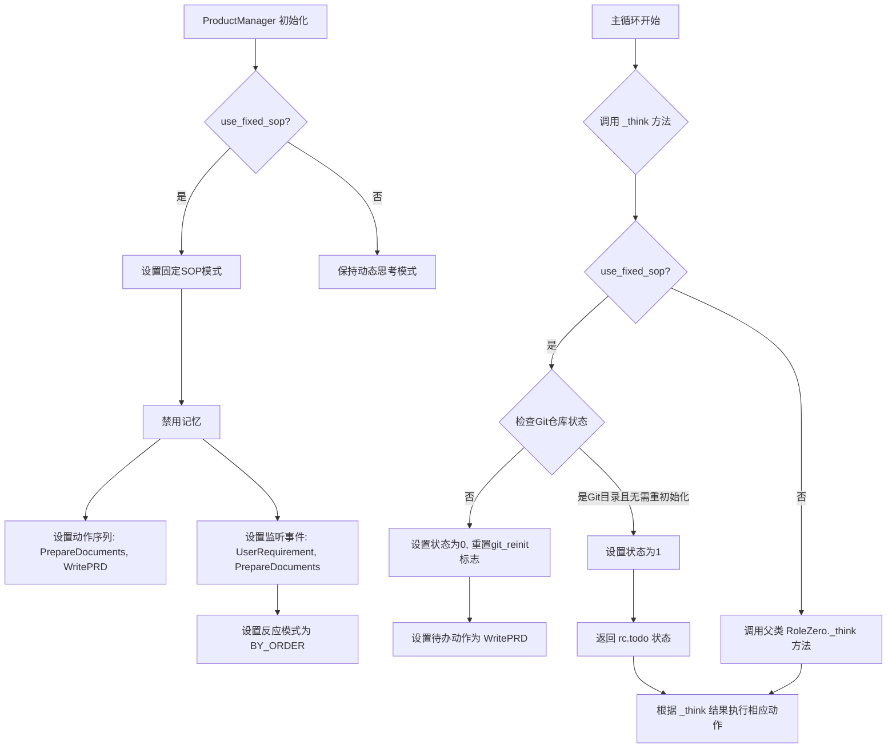
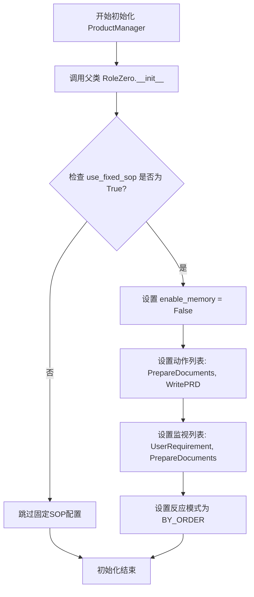
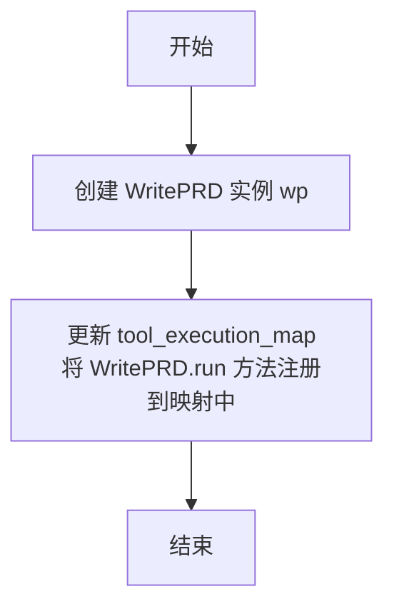
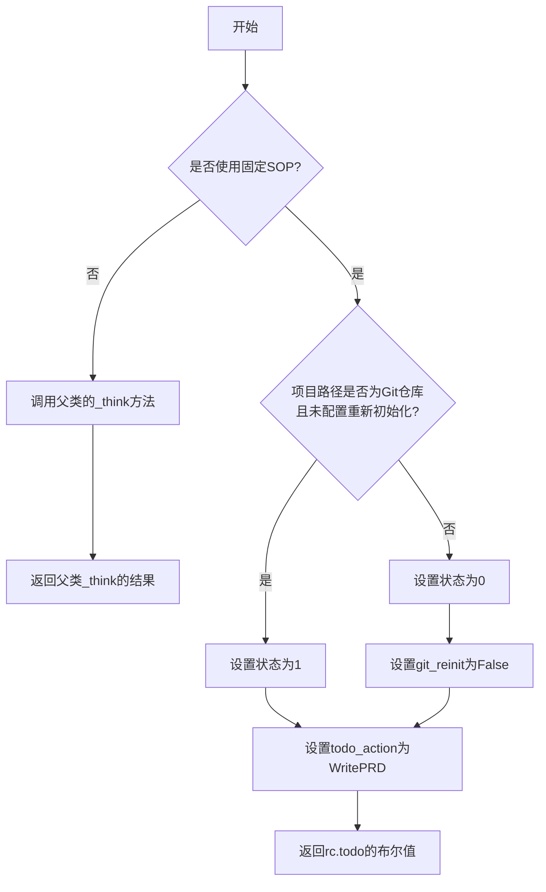

# `.\MetaGPT\metagpt\roles\product_manager.py` 详细设计文档

该代码定义了一个产品经理角色类，继承自RoleZero。其核心功能是作为多智能体协作系统中的产品经理，负责根据用户需求，通过执行一系列预定义或动态决策的动作（如准备文档、编写产品需求文档PRD、使用浏览器、编辑器、增强搜索等工具），来创建产品需求文档或进行市场/竞品研究。它支持两种工作模式：固定标准操作流程（SOP）模式和动态思考模式。

## 整体流程



## 类结构

```
RoleZero (基类)
└── ProductManager (产品经理角色类)
```

## 全局变量及字段


### `ProductManager.name`
    
产品经理角色的名称，默认值为'Alice'。

类型：`str`
    


### `ProductManager.profile`
    
角色描述，标识为'Product Manager'。

类型：`str`
    


### `ProductManager.goal`
    
角色的核心目标，即创建产品需求文档或进行市场/竞品研究。

类型：`str`
    


### `ProductManager.constraints`
    
角色的行为约束，要求使用与用户需求相同的语言以确保沟通顺畅。

类型：`str`
    


### `ProductManager.instruction`
    
角色的详细指令，从PRODUCT_MANAGER_INSTRUCTION导入。

类型：`str`
    


### `ProductManager.tools`
    
角色可使用的工具列表，包括RoleZero、浏览器、编辑器、增强搜索问答等。

类型：`list[str]`
    


### `ProductManager.todo_action`
    
当前待执行的动作，通过any_to_name(WritePRD)初始化为'WritePRD'。

类型：`str`
    
    

## 全局函数及方法

### `ProductManager.__init__`

该方法用于初始化`ProductManager`类的实例。它首先调用父类`RoleZero`的构造函数，然后根据`use_fixed_sop`标志位配置实例的行为。如果启用了固定标准操作流程（SOP），它会禁用记忆功能，设置一系列动作（`PrepareDocuments`和`WritePRD`），并指定需要监视的动作（`UserRequirement`和`PrepareDocuments`），同时将反应模式设置为按顺序执行。

参数：

- `kwargs`：`dict`，可变关键字参数，用于传递给父类`RoleZero`的构造函数，以初始化继承的属性。

返回值：`None`，构造函数不返回任何值。

#### 流程图



#### 带注释源码

```python
def __init__(self, **kwargs) -> None:
    # 调用父类 RoleZero 的构造函数，传递所有关键字参数以初始化继承的属性
    super().__init__(**kwargs)
    # 检查是否启用了固定的标准操作流程（SOP）
    if self.use_fixed_sop:
        # 如果启用了固定SOP，则禁用记忆功能
        self.enable_memory = False
        # 设置角色要执行的动作序列：首先准备文档，然后编写PRD
        # PrepareDocuments 动作会将结果发送给当前角色自身
        self.set_actions([PrepareDocuments(send_to=any_to_str(self)), WritePRD])
        # 设置角色需要监视（响应）的动作：用户需求和准备文档动作
        self._watch([UserRequirement, PrepareDocuments])
        # 将角色的反应模式设置为按顺序执行，即严格按照动作列表的顺序执行
        self.rc.react_mode = RoleReactMode.BY_ORDER
```

### `ProductManager._update_tool_execution`

该方法用于更新 `ProductManager` 实例的工具执行映射（`tool_execution_map`），将 `WritePRD` 动作的 `run` 方法注册到该映射中，以便在角色执行流程中能够调用此工具。

参数：
- 无

返回值：`None`，无返回值

#### 流程图



#### 带注释源码

```python
def _update_tool_execution(self):
    # 创建一个 WritePRD 动作的实例
    wp = WritePRD()
    # 更新角色的工具执行映射（tool_execution_map）
    # tool2name 函数将 WritePRD 类及其 'run' 方法名与 wp.run 方法对象关联起来
    # 这允许角色在后续执行流程中通过映射调用 WritePRD 的 run 方法
    self.tool_execution_map.update(tool2name(WritePRD, ["run"], wp.run))
```

### `ProductManager._think`

该方法用于决定产品经理角色下一步要执行的操作。根据配置（是否使用固定SOP）和项目状态（是否为Git仓库），它会设置相应的内部状态和待办动作，并返回一个布尔值指示是否有待执行的动作。

参数：

- 无显式参数，但方法内部访问了实例属性（如 `self.use_fixed_sop`, `self.config.project_path` 等）。

返回值：`bool`，表示当前是否有待执行的动作（`self.rc.todo` 是否为真）。

#### 流程图



#### 带注释源码

```python
async def _think(self) -> bool:
    """Decide what to do"""
    # 如果不使用固定的标准操作流程（SOP），则直接调用父类（RoleZero）的_think方法
    if not self.use_fixed_sop:
        return await super()._think()

    # 如果使用固定SOP，则根据项目路径是否为Git仓库来决定状态
    # 检查项目路径是否为Git仓库目录，并且配置中未要求重新初始化Git
    if GitRepository.is_git_dir(self.config.project_path) and not self.config.git_reinit:
        # 如果是Git仓库且不需要重新初始化，设置内部状态为1
        self._set_state(1)
    else:
        # 如果不是Git仓库或需要重新初始化，设置内部状态为0
        self._set_state(0)
        # 将配置中的git_reinit标志设置为False，避免后续重复初始化
        self.config.git_reinit = False
        # 将待执行动作设置为WritePRD（编写产品需求文档）
        self.todo_action = any_to_name(WritePRD)
    # 返回self.rc.todo的布尔值，指示当前是否有待执行的动作
    return bool(self.rc.todo)
```

## 关键组件


### RoleZero 基类

ProductManager 继承自 RoleZero，这是一个用于构建具有复杂决策和工具执行能力的智能代理角色的基础框架，提供了状态管理、动作执行和反应循环等核心机制。

### 固定流程模式 (Fixed SOP)

通过 `use_fixed_sop` 标志控制，当启用时，ProductManager 将遵循一个预定义的、顺序执行的流程，包括初始化项目、准备文档和编写产品需求文档（PRD），并禁用记忆功能以简化流程。

### 工具集成与执行映射

ProductManager 集成了多种工具（如 Browser, Editor, SearchEnhancedQA），并通过 `tool_execution_map` 动态管理工具方法的执行映射，特别是将 WritePRD 动作的 `run` 方法注册到执行映射中，以实现灵活的工具调用。

### 状态驱动的动作调度

根据项目环境（如 Git 仓库是否存在）和配置（`git_reinit`），通过 `_set_state` 方法动态调整内部状态，并据此决定下一步要执行的动作（`todo_action`），实现了基于上下文的状态机逻辑。

### 产品需求文档生成流程

核心功能是生成产品需求文档，通过组合 `PrepareDocuments` 和 `WritePRD` 两个动作，在固定流程模式下，按顺序执行文档准备和 PRD 撰写任务，完成从用户需求到结构化产品文档的转换。


## 问题及建议


### 已知问题

-   **工具列表定义不一致**：`tools` 类字段中包含了字符串 `"RoleZero"`，而其他工具使用的是类名（如 `Browser.__name__`）。`"RoleZero"` 可能是一个笔误或硬编码的字符串，这可能导致工具查找或初始化时出现错误或混淆。
-   **状态管理逻辑可能不健壮**：在 `_think` 方法中，状态切换（`_set_state`）依赖于 `GitRepository.is_git_dir` 的检查结果。如果 `project_path` 配置不当或不存在，此检查可能引发异常或导致非预期的状态。同时，`git_reinit` 标志的修改逻辑与状态设置紧密耦合，增加了理解和管理状态的复杂度。
-   **潜在的循环依赖或初始化顺序问题**：`_update_tool_execution` 方法在 `__init__` 中未被调用，而是在 `_think` 或其他流程中可能被调用。如果 `WritePRD` 类的初始化或 `wp.run` 方法依赖于 `ProductManager` 实例的某些未完全初始化的属性，可能会导致运行时错误。
-   **硬编码的默认值**：`name` 和 `todo_action` 等字段被硬编码为特定值（如 `"Alice"`, `WritePRD`）。这降低了代码的灵活性，使得在创建不同实例或适应不同场景时可能需要子类化或直接修改属性。

### 优化建议

-   **统一工具标识符**：将 `tools` 列表中的 `"RoleZero"` 替换为 `RoleZero.__name__` 或从 `RoleZero` 类中获取的规范名称，以保持列表内元素类型和来源的一致性，避免潜在的运行时匹配错误。
-   **增强状态管理的健壮性和清晰度**：
    -   在 `_think` 方法中访问 `self.config.project_path` 前，添加空值或路径有效性检查。
    -   考虑将状态转换逻辑（特别是与 Git 仓库和 `git_reinit` 标志相关的部分）封装到一个独立的方法中，如 `_determine_state_based_on_git`，以提高代码的可读性和可测试性。
    -   明确文档说明 `git_reinit` 标志的预期生命周期和由谁负责重置它。
-   **明确工具执行映射的初始化时机**：如果 `_update_tool_execution` 是必要的，应在 `__init__` 方法中或在一个明确的初始化方法中调用它，以确保 `tool_execution_map` 在角色开始执行任何动作前已正确配置。同时，检查 `WritePRD` 实例（`wp`）的创建是否依赖于完全初始化的上下文。
-   **提高配置灵活性**：
    -   考虑通过 `__init__` 方法的参数或配置文件来设置 `name`、`todo_action` 等默认值，允许在实例化时进行定制。
    -   对于 `todo_action`，可以提供一个类方法或属性来动态解析默认动作，而不是硬编码字符串。
-   **代码结构与维护性**：
    -   `_think` 方法包含了固定流程（`use_fixed_sop` 为 True 时）和父类逻辑。如果条件分支变得复杂，考虑将固定流程提取到单独的方法（如 `_think_fixed_sop`）中。
    -   添加更详细的文档字符串，说明 `use_fixed_sop` 标志如何影响角色的行为流，以及不同状态（0, 1）的具体含义。


## 其它


### 设计目标与约束

本模块旨在实现一个产品经理角色，其核心设计目标是将用户需求转化为结构化的产品需求文档（PRD）或市场/竞品研究报告。主要约束包括：必须使用与用户需求相同的语言以确保沟通无缝；支持两种工作模式（固定SOP模式与动态思考模式）；需集成外部工具（如浏览器、编辑器、增强搜索）以辅助信息收集与文档编写；代码结构需继承自`RoleZero`基类以复用角色交互框架。

### 错误处理与异常设计

当前代码中未显式定义错误处理逻辑，异常可能来源于：1）父类`RoleZero`或工具类（如`Browser`、`Editor`）的方法调用失败；2）异步操作（如`_think`方法）中的运行时错误；3）配置项（如`project_path`）无效导致的`GitRepository`操作异常。建议增加异常捕获与日志记录，特别是在`_think`和`_update_tool_execution`方法中，确保角色状态机在异常时能优雅降级或提供明确错误信息。

### 数据流与状态机

数据流始于`UserRequirement`动作，触发角色反应链。在固定SOP模式下，状态由`_set_state`控制：状态0表示初始化/准备阶段，触发`PrepareDocuments`；状态1表示PRD编写阶段，触发`WritePRD`。状态转换依赖`GitRepository.is_git_dir`检查。工具执行映射（`tool_execution_map`）在`_update_tool_execution`中动态更新，将`WritePRD.run`方法注册为可执行工具。整体流程为线性状态机，由`rc.react_mode = RoleReactMode.BY_ORDER`确保动作顺序执行。

### 外部依赖与接口契约

外部依赖包括：1）`metagpt.actions`中的`UserRequirement`、`WritePRD`、`PrepareDocuments`、`SearchEnhancedQA`，定义动作输入/输出格式；2）`metagpt.tools.libs`中的`Browser`和`Editor`，提供外部工具接口；3）`metagpt.utils.git_repository.GitRepository`，用于项目路径的Git状态检查；4）`PRODUCT_MANAGER_INSTRUCTION`提示词模板，约束角色行为。接口契约体现为：`_watch`方法订阅特定动作消息；`set_actions`定义动作序列；`tool_execution_map`遵循工具名称到执行函数的映射协议。

### 配置管理与环境假设

角色行为由`config`对象（继承自基类）控制，关键配置项包括：`use_fixed_sop`（切换工作模式）、`project_path`（Git仓库路径）、`git_reinit`（控制Git重新初始化）。环境假设包括：1）Python环境已安装MetaGPT及相关工具依赖；2）`project_path`路径可访问且可能为Git仓库；3）在固定SOP模式下，`PrepareDocuments`和`WritePRD`动作能正确处理输入/输出。配置缺乏验证逻辑，可能因路径无效或依赖缺失导致运行时失败。

### 安全与合规考虑

代码涉及外部工具执行（如浏览器、编辑器），可能带来安全风险：1）`Browser`工具可能访问外部网络资源，需防范恶意URL或内容注入；2）`Editor`工具可能修改本地文件，需确保路径安全且权限受控；3）`SearchEnhancedQA`可能查询外部数据源，需注意数据隐私与合规性。当前实现未包含输入消毒、访问控制或审计日志，建议增加安全边界，特别是在生产环境中部署时。

### 测试策略与可观测性

模块缺乏内置测试点，可测试性包括：1）`_think`方法在不同模式下的状态决策逻辑；2）`_update_tool_execution`的工具映射正确性；3）固定SOP模式下的动作序列触发。建议添加单元测试覆盖状态转换、异常分支，并集成模拟工具以验证端到端流程。可观测性方面，可增加结构化日志记录角色状态变化、工具调用结果及错误信息，便于调试与监控。

### 扩展性与维护性

角色设计支持通过`tools`列表扩展新工具，但工具集成需手动更新`tool_execution_map`。固定SOP模式的动作序列硬编码在`__init__`中，缺乏动态配置能力。未来扩展可能包括：1）支持更多产品管理动作（如用户调研、原型设计）；2）允许通过配置文件定义SOP流程；3）增强工具的动态发现与注册机制。当前代码结构清晰，但继承自`RoleZero`可能带来基类变更的耦合风险。


    