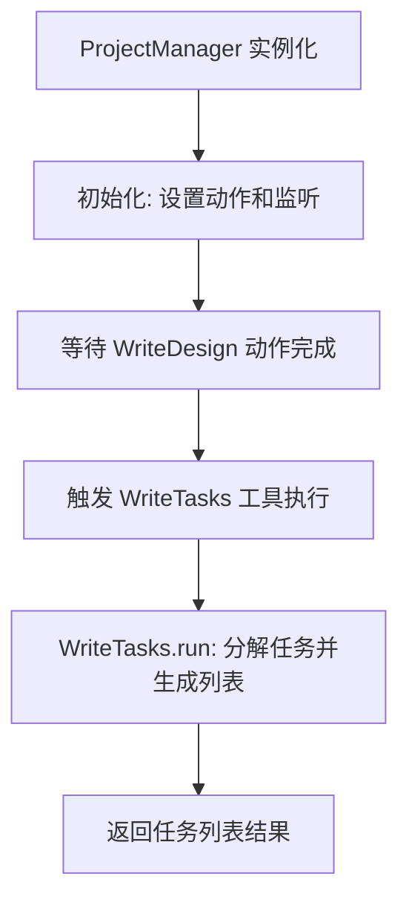
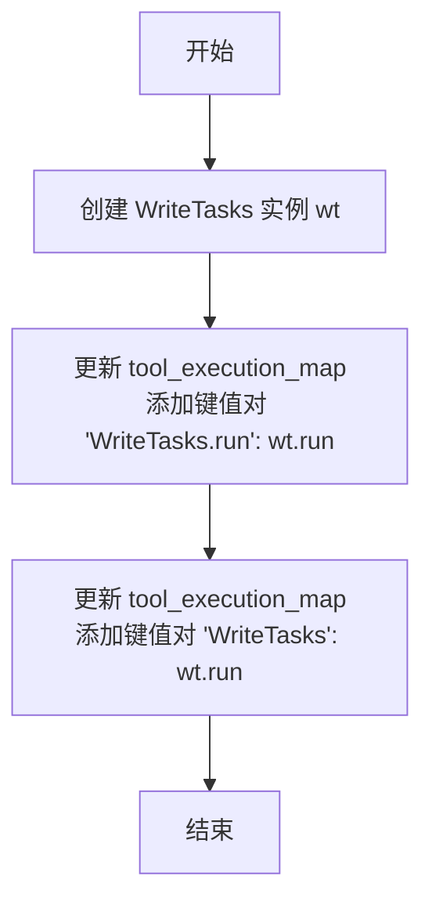

# `.\MetaGPT\metagpt\roles\project_manager.py` 详细设计文档

该文件定义了一个名为 ProjectManager 的类，它继承自 RoleZero，代表一个项目管理者的角色。其核心功能是接收产品需求文档（PRD）或技术设计方案，通过调用 WriteTasks 工具来分解任务、生成任务列表，并分析任务间的依赖关系，以确定需要优先开始的模块。

## 整体流程



## 类结构

```
RoleZero (父类)
└── ProjectManager (子类)
```

## 全局变量及字段


### `ProjectManager.name`
    
项目经理角色的名称，默认值为'Eve'。

类型：`str`
    


### `ProjectManager.profile`
    
角色描述，标识为'Project Manager'。

类型：`str`
    


### `ProjectManager.goal`
    
项目经理的目标：根据PRD/技术设计分解任务、生成任务列表并分析任务依赖关系以启动先决模块。

类型：`str`
    


### `ProjectManager.constraints`
    
项目经理的约束条件：使用与用户需求相同的语言。

类型：`str`
    


### `ProjectManager.instruction`
    
指导项目经理使用WriteTasks工具编写项目任务列表的指令。

类型：`str`
    


### `ProjectManager.max_react_loop`
    
最大反应循环次数，当前设置为1，用于控制任务执行的迭代次数。

类型：`int`
    


### `ProjectManager.tools`
    
项目经理可使用的工具列表，包括编辑器操作、RoleZero和WriteTasks。

类型：`list[str]`
    


### `ProjectManager.enable_memory`
    
控制是否启用记忆功能的标志，当前设置为False。

类型：`bool`
    


### `ProjectManager._actions`
    
存储角色可执行的动作列表，在初始化时设置为[WriteTasks]。

类型：`list`
    


### `ProjectManager._watch`
    
存储角色需要监视的动作列表，在初始化时设置为[WriteDesign]。

类型：`list`
    
    

## 全局函数及方法

### `ProjectManager.__init__`

ProjectManager类的构造函数，用于初始化项目管理器实例。它首先调用父类RoleZero的构造函数，然后设置实例的特定属性，包括禁用内存、设置动作列表以及监视WriteDesign动作。此外，它还通过调用`_update_tool_execution`方法更新工具执行映射，确保WriteTasks工具的正确注册和执行。

参数：

- `kwargs`：`dict`，关键字参数，用于传递给父类RoleZero的构造函数，允许灵活地初始化父类的属性。

返回值：`None`，构造函数不返回任何值。

#### 流程图

```mermaid
flowchart TD
    A[开始] --> B[调用父类RoleZero的__init__方法]
    B --> C[设置enable_memory为False]
    C --> D[设置actions为[WriteTasks]]
    D --> E[设置_watch为[WriteDesign]]
    E --> F[调用_update_tool_execution方法]
    F --> G[结束]
```

#### 带注释源码

```python
def __init__(self, **kwargs) -> None:
    # 调用父类RoleZero的构造函数，传递所有关键字参数
    super().__init__(**kwargs)
    # 注意：以下初始化设置仅在self.use_fixed_sop更改为True时生效
    # 禁用内存功能，避免在项目初始化阶段使用内存
    self.enable_memory = False
    # 设置项目管理器的动作列表，当前仅包含WriteTasks动作
    self.set_actions([WriteTasks])
    # 设置监视列表，项目管理器将监视WriteDesign动作的触发
    self._watch([WriteDesign])
    # 更新工具执行映射，确保WriteTasks工具能够被正确调用
    self._update_tool_execution()
```

### `ProjectManager._update_tool_execution`

该方法用于更新 `ProjectManager` 实例的工具执行映射表。具体来说，它创建一个 `WriteTasks` 动作的实例，并将该动作的 `run` 方法注册到 `tool_execution_map` 字典中，以便后续可以通过工具名称（如 `"WriteTasks.run"` 或别名 `"WriteTasks"`）来调用该动作。

参数：
- 无

返回值：`None`，无返回值

#### 流程图



#### 带注释源码

```python
def _update_tool_execution(self):
    # 创建一个 WriteTasks 动作的实例
    wt = WriteTasks()
    # 更新工具执行映射表，将 WriteTasks 动作的 run 方法注册到映射表中
    # 这里注册了两个键：一个是完整的 'WriteTasks.run'，另一个是别名 'WriteTasks'
    # 这样可以通过不同的键名来调用同一个方法
    self.tool_execution_map.update(
        {
            "WriteTasks.run": wt.run,
            "WriteTasks": wt.run,  # alias
        }
    )
```

## 关键组件


### RoleZero 角色基类

作为项目管理器（ProjectManager）的父类，提供了角色（Role）的基础框架，包括状态管理、动作（Action）执行和工具（Tool）调用等核心机制。

### WriteTasks 动作

一个具体的动作（Action），其核心功能是根据产品需求文档（PRD）或技术设计文档，将项目目标分解为具体的、可执行的任务列表，并分析任务间的依赖关系。

### 工具执行映射 (tool_execution_map)

一个用于将工具名称（如“WriteTasks”）映射到其实际执行方法（如 `WriteTasks.run`）的字典，实现了对工具的动态调用，支持别名机制。

### 观察列表 (_watch)

一个用于声明当前角色需要关注（监听）哪些其他角色或动作输出的列表。在本代码中，项目管理器被设置为观察 `WriteDesign` 动作的输出，以此作为触发自身任务分解流程的输入。


## 问题及建议


### 已知问题

-   **工具执行映射逻辑不一致**：`_update_tool_execution` 方法中，为 `WriteTasks` 工具设置了两个映射键（`"WriteTasks.run"` 和 `"WriteTasks"`），这种别名机制可能导致调用逻辑不清晰或产生歧义，增加维护复杂度。
-   **硬编码的工具列表**：`tools` 属性被硬编码为 `["Editor:write,read,similarity_search", "RoleZero", "WriteTasks"]`。当 `ProjectManager` 类的行为或依赖的工具发生变化时，需要手动更新此列表，容易导致代码不一致。
-   **初始化逻辑与配置分离**：`__init__` 方法中的 `self.set_actions([WriteTasks])` 和 `self._watch([WriteDesign])` 是核心行为配置，但它们与类属性 `tools` 和 `instruction` 中的描述是分离的。这种配置分散在多个地方，增加了理解和维护的难度。
-   **未使用的类属性**：`instruction` 和 `max_react_loop` 属性在当前的类实现中似乎没有被直接使用（例如，在 `_update_tool_execution` 或主要流程中），这可能意味着它们是冗余的，或者其用途与当前实现不匹配。
-   **潜在的循环依赖风险**：`tools` 列表中包含了 `"RoleZero"`，而 `ProjectManager` 本身继承自 `RoleZero`。这可能导致在工具解析或执行时产生循环依赖或逻辑混淆。

### 优化建议

-   **统一工具映射管理**：建议重构 `_update_tool_execution` 方法，使用一个清晰、一致的策略来映射工具名到其执行函数。可以考虑移除别名，或通过一个中心化的配置来管理这些映射，以提高代码的可读性和可维护性。
-   **动态生成或集中管理工具列表**：`tools` 列表应从类的实际行为（如 `set_actions` 和 `_watch` 中设置的内容）动态生成，或者集中在一个配置结构中管理。这样可以避免硬编码，确保工具列表与类的实际能力保持一致。
-   **整合初始化配置**：将行为配置（如设置 Actions 和 Watches）与相关的类属性（如 `goal`, `constraints`, `tools`）更紧密地整合。可以考虑使用一个配置类或字典来集中管理所有角色配置，然后在 `__init__` 中统一应用。
-   **清理未使用的属性**：审查 `instruction` 和 `max_react_loop` 属性的用途。如果它们确实未被使用，应考虑移除以避免混淆。如果它们是为未来功能预留的，应添加注释说明其预期用途。
-   **明确工具依赖关系**：重新评估 `tools` 列表中包含 `"RoleZero"` 的必要性。如果这不是一个工具而是一个角色引用，应将其从工具列表中移除，或更明确地定义其在此上下文中的作用，以消除循环依赖的歧义。
-   **增强代码注释与文档**：在 `__init__` 方法中关于 `enable_memory = False` 和 `use_fixed_sop` 的注释表明存在一些特定的设计考量或未来变更点。建议为这些配置点添加更详细的文档，解释其当前状态和未来演变的可能方向。


## 其它


### 设计目标与约束

本模块的设计目标是实现一个项目管理者（ProjectManager）角色，该角色继承自RoleZero，专门负责在接收到产品设计文档（WriteDesign）后，自动分解任务、生成任务列表并分析任务依赖关系。其核心约束包括：1) 必须使用与用户需求相同的语言进行任务分解；2) 当前实现中，反应循环（react_loop）被限制为1次，这可能会限制处理复杂文件读写和搜索操作的能力，是一个已知的技术债务；3) 角色默认禁用了记忆功能（enable_memory = False），并遵循一套固定的标准操作流程（SOP）。

### 错误处理与异常设计

当前代码中未显式定义错误处理逻辑。错误处理主要依赖于其父类`RoleZero`以及所使用工具（如`WriteTasks`、`Editor`）的内部异常处理机制。例如，`WriteTasks.run`方法在执行过程中可能因输入数据格式错误、依赖服务不可用或内部逻辑失败而抛出异常，这些异常会向上传播到`ProjectManager`的`_act`或`react`方法中。由于`max_react_loop`被设置为1，任何未捕获的异常都可能导致单次执行中断。未来优化应考虑增加更细粒度的异常捕获、重试机制以及友好的错误状态反馈。

### 数据流与状态机

1.  **触发**：`ProjectManager`实例通过`_watch`方法监听`WriteDesign`动作。当上游角色（如架构师）完成设计并生成`WriteDesign`结果消息时，会触发`ProjectManager`的`react`流程。
2.  **执行**：在`react`循环中（本次循环仅执行一次），`ProjectManager`根据其`instruction`（“使用WriteTasks工具编写项目任务列表”）和`goal`，调用其`set_actions`中定义的`WriteTasks`动作。
3.  **工具映射**：通过`_update_tool_execution`方法，将工具名`"WriteTasks"`及其`run`方法注册到`tool_execution_map`中，供动作执行时调用。
4.  **输出**：`WriteTasks.run`方法接收`WriteDesign`的输出作为输入，进行处理后，生成结构化的任务列表作为`ProjectManager`的输出。该输出可能以消息形式发布，供下游角色（如工程师）消费。
5.  **状态**：作为一个`Role`，其核心状态由父类管理，包括对消息的订阅、动作历史等。本类通过`enable_memory=False`明确了其无记忆、单次执行的轻量级状态特性。

### 外部依赖与接口契约

1.  **父类依赖**：强依赖于`metagpt.roles.di.role_zero.RoleZero`，继承了其角色交互、动作执行、消息处理的基础框架。
2.  **动作依赖**：强依赖于`metagpt.actions.WriteTasks`类。`ProjectManager`的功能通过调用`WriteTasks().run()`方法实现。`WriteTasks`的输入输出接口定义了本角色的核心契约。
3.  **触发依赖**：通过`_watch([WriteDesign])`声明了对`metagpt.actions.design_api.WriteDesign`动作输出消息的依赖。这是本角色启动执行的唯一外部触发器。
4.  **工具依赖**：`tools`属性列出了`"Editor:write,read,similarity_search"`、`"RoleZero"`、`"WriteTasks"`，表明其潜在能力范围，但当前直接使用的只有`WriteTasks`。`Editor`工具可能被`WriteTasks`内部使用。
5.  **配置/环境依赖**：代码运行依赖于MetaGPT框架的整体环境配置，包括LLM配置、知识库设置等，这些通过父类`__init__`中的`kwargs`参数传入。

### 配置管理与可扩展性

1.  **硬编码配置**：角色的关键属性如`name`、`profile`、`goal`、`constraints`、`instruction`、`max_react_loop`、`tools`均在类定义中硬编码。这降低了运行时动态配置的灵活性。
2.  **初始化配置**：在`__init__`方法中固定设置了`enable_memory = False`和`set_actions([WriteTasks])`。这些配置决定了角色的行为模式，目前不具备通过参数覆盖的能力。
3.  **扩展点**：
    *   **动作扩展**：可以通过重写`set_actions`方法或在初始化后修改`self.actions`列表来增加或替换动作，例如增加任务评审或优先级排序动作。
    *   **工具扩展**：可以通过修改`tools`列表和更新`tool_execution_map`来引入新的工具能力。
    *   **流程扩展**：将`max_react_loop`从固定值改为可配置，并重写`_act`或`react`方法，可以实现更复杂的多步骤交互逻辑。
    *   **监听扩展**：通过修改`_watch`列表，可以使角色响应更多类型的事件或消息。

### 安全性与合规性考虑

1.  **输入安全**：`ProjectManager`本身不直接处理用户原始输入，其输入是经过上游角色（如产品经理、架构师）处理的`WriteDesign`结果。安全性依赖于上游角色对输入内容的过滤、校验以及`WriteTasks`工具内部对提示词（Prompt）的构造和安全处理。
2.  **输出合规**：生成的“任务列表”内容需符合项目规范和技术伦理。这依赖于`WriteTasks`工具所集成的LLM模型本身的合规性训练以及提示词中对输出格式和内容的约束。
3.  **权限与访问控制**：代码中未体现资源访问权限控制。如果其使用的工具（如`Editor`）涉及文件系统操作，那么文件路径的访问权限应在框架层面或工具内部进行管理，防止越权访问。
4.  **数据隐私**：在任务分解过程中，可能会处理包含敏感信息的项目需求或设计文档。需要确保整个MetaGPT框架的数据传输、存储以及LLM API调用符合相关的数据隐私保护规定（如GDPR）。

    