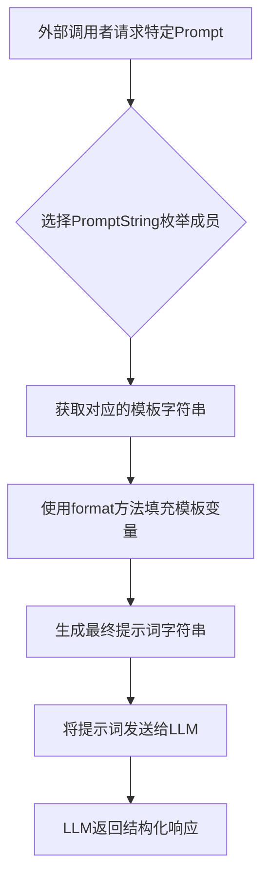

# `.\MetaGPT\metagpt\roles\prompt.py` 详细设计文档

该代码文件定义了一个用于构建和格式化提示词（Prompt）的模块，主要服务于基于大型语言模型（LLM）的智能体（Agent）系统。它通过一个枚举类 `PromptString` 集中管理了多种任务场景（如反思、计划制定、反应决策、闲聊等）的提示词模板，并提供了通用的提示词前缀、格式指令和后缀，旨在标准化智能体与LLM的交互流程，确保响应的结构化和可控性。

## 整体流程



## 类结构

```
PromptString (枚举类)
├── REFLECTION_QUESTIONS
├── REFLECTION_INSIGHTS
├── IMPORTANCE
├── RECENT_ACTIVITY
├── MAKE_PLANS
├── EXECUTE_PLAN
├── REACT
├── GOSSIP
└── HAS_HAPPENED
```

## 全局变量及字段


### `PREFIX`
    
定义AI代理对话的通用前缀，用于引导AI使用工具回答问题。

类型：`str`
    


### `FORMAT_INSTRUCTIONS`
    
定义AI代理在思考-行动循环中应遵循的严格输出格式模板。

类型：`str`
    


### `SUFFIX`
    
定义AI代理对话的通用后缀，用于启动对话并注入用户输入和代理的临时思考记录。

类型：`str`
    


### `OUTPUT_FORMAT`
    
定义AI代理在完成任务或需要继续行动时的两种标准输出格式，用于规范最终响应。

类型：`str`
    


### `PromptString.REFLECTION_QUESTIONS`
    
用于引导AI基于一系列记忆描述，提炼出三个最突出的高层次问题的提示词模板。

类型：`str`
    


### `PromptString.REFLECTION_INSIGHTS`
    
用于引导AI基于一系列记忆字符串，推断出五个高层次见解的提示词模板。

类型：`str`
    


### `PromptString.IMPORTANCE`
    
用于引导AI（扮演记忆重要性评估角色）根据角色档案和记忆描述，评估记忆重要性等级（1-10）的提示词模板。

类型：`str`
    


### `PromptString.RECENT_ACTIVITY`
    
用于引导AI基于角色的记忆描述，生成其近期活动简要总结的提示词模板。

类型：`str`
    


### `PromptString.MAKE_PLANS`
    
用于引导AI（扮演计划生成角色）根据角色信息、当前思考和上下文，为角色制定新计划的提示词模板。

类型：`str`
    


### `PromptString.EXECUTE_PLAN`
    
用于引导AI（扮演特定角色）在给定上下文、记忆、对话历史和使用工具的情况下，执行特定任务的提示词模板。

类型：`str`
    


### `PromptString.REACT`
    
用于引导AI（扮演特定角色）根据当前上下文和新发生的事件，决定对当前计划采取【推迟、继续、取消】中何种行动的提示词模板。

类型：`str`
    


### `PromptString.GOSSIP`
    
用于引导AI（扮演特定角色）基于其记忆描述，生成对其他在场角色感兴趣的话题的提示词模板。

类型：`str`
    


### `PromptString.HAS_HAPPENED`
    
用于引导AI根据一系列观察描述和待判定事件，判断该事件是否已发生并返回结果的提示词模板。

类型：`str`
    
    

## 全局函数及方法


## 关键组件


### 提示模板系统

定义了一系列用于驱动智能体（Agent）行为的结构化字符串模板，这些模板遵循特定的格式（如ReAct、Chain-of-Thought），用于指导智能体进行思考、规划、执行和反思。

### 枚举类 PromptString

将不同类型的提示模板定义为枚举值，便于在代码中通过名称引用，提高了代码的可读性和可维护性，避免了硬编码字符串。

### 格式化指令 (FORMAT_INSTRUCTIONS)

定义了智能体在生成响应时必须遵循的标准化输出格式（如Thoughts/Action/Action Input/Observation），确保智能体行为的一致性和可解析性。

### 前缀与后缀 (PREFIX, SUFFIX)

为智能体的交互会话提供了固定的开场白（PREFIX）和结束语（SUFFIX）模板，用于构建完整的、上下文相关的提示。

### 反思与洞察生成 (REFLECTION_QUESTIONS, REFLECTION_INSIGHTS)

提供用于从记忆描述中提取高层次问题或洞察的专用提示模板，支持智能体的自我反思和知识提炼能力。

### 记忆重要性评估 (IMPORTANCE)

提供了一个基于角色档案和记忆描述来量化记忆重要性的提示模板，包含多个示例以指导评估逻辑。

### 活动总结与计划制定 (RECENT_ACTIVITY, MAKE_PLANS)

提供用于生成近期活动摘要和制定未来计划的提示模板，其中`MAKE_PLANS`模板要求生成结构化的计划列表，并考虑地点、时间等约束。

### 计划执行与角色扮演 (EXECUTE_PLAN)

提供了一个复杂的、用于指导智能体在角色扮演场景中执行任务的提示模板，它整合了角色档案、位置上下文、记忆、对话历史等丰富信息，并强制要求遵循特定的决策流程（思考-行动-观察循环）。

### 计划状态决策 (REACT)

提供了一个决策框架，指导智能体根据当前上下文（如新事件、对话状态）决定是否继续、推迟或取消当前计划，强调了社交互动的优先级。

### 社交互动与事件检测 (GOSSIP, HAS_HAPPENED)

`GOSSIP`模板用于生成基于记忆的、面向其他角色的闲谈内容。`HAS_HAPPENED`模板用于根据观察记录判断某个特定事件是否已经发生，并返回结构化结果。

### 输出格式约束 (OUTPUT_FORMAT)

明确规定了智能体响应的两种强制格式（任务完成或未完成），确保下游系统能够可靠地解析智能体的输出状态。


## 问题及建议


### 已知问题

-   **硬编码的提示词模板**：所有提示词字符串都以硬编码方式存储在 `PromptString` 枚举类中。这使得修改、扩展或国际化（i18n）提示词变得非常困难，需要直接修改源代码。
-   **缺乏结构化配置**：提示词模板中的变量（如 `{tool_names}`, `{input}`）与代码逻辑紧密耦合，但缺乏一个中心化的配置或验证机制来确保所有必需的变量在运行时都被正确替换，容易导致运行时错误。
-   **枚举项命名与值不一致**：`PromptString` 枚举的成员名称（如 `REFLECTION_QUESTIONS`）是常量名，但其值是一个完整的提示词字符串。这种命名方式未能清晰反映其内容是“模板”或“格式”，可能造成理解上的混淆。
-   **潜在的维护负担**：部分提示词模板非常长且复杂（例如 `MAKE_PLANS`, `EXECUTE_PLAN`），直接以字符串形式嵌入代码中，降低了可读性，并使得针对特定模板的细微调整变得繁琐且易错。
-   **模板字符串格式不一致**：虽然大部分使用 `{variable}` 格式，但存在像 `FORMAT_INSTRUCTIONS` 中使用 `[{tool_names}]` 这样的变体，且 `OUTPUT_FORMAT` 作为独立常量存在，与 `PromptString` 枚举分离，导致管理上的不一致。

### 优化建议

-   **外部化提示词配置**：将提示词模板移出代码，存储到外部配置文件（如 JSON、YAML）或数据库中。这样可以实现动态更新、环境特定配置以及更便捷的版本管理。
-   **创建提示词模板管理器**：设计一个 `PromptTemplate` 类或模块，负责加载、验证和渲染提示词。该类可以：
    -   提供类型提示，确保变量替换的类型安全。
    -   实现模板继承或组合，以减少重复内容（例如，将 `PREFIX`, `FORMAT_INSTRUCTIONS`, `SUFFIX` 组合到其他模板中）。
    -   添加对模板语法（如 Jinja2）的支持，以支持条件逻辑、循环等高级功能。
-   **重构 `PromptString` 枚举**：考虑将其重构为更清晰的结构。例如，可以定义一个 `PromptTemplate` 数据类，包含 `name`、`template`、`required_vars` 等属性，然后在一个配置集合中管理这些对象，而非使用枚举。
-   **拆分复杂模板**：对于极其复杂的模板（如 `EXECUTE_PLAN`），可以将其拆分为多个逻辑部分，通过模板组合或引用的方式在管理器中进行组装，提高可读性和可维护性。
-   **统一模板格式和常量管理**：确保所有模板变量使用一致的格式（如 `{{ variable }}` 以避免与 Python 的 f-string 冲突，或坚持使用 `{variable}` 但做好转义）。将 `OUTPUT_FORMAT` 等独立常量也纳入统一的提示词管理体系。
-   **增加输入验证和默认值**：在模板渲染层，增加对输入变量的验证，并为可选变量提供合理的默认值，防止因缺失变量导致的模板渲染失败。


## 其它


### 设计目标与约束

本模块的核心设计目标是提供一个可配置、可扩展的提示词模板库，用于驱动一个基于大语言模型的智能体系统。其核心约束包括：1) 所有提示词必须遵循预定义的、结构化的格式（如Thoughts/Action/Observation循环），以确保智能体输出的可解析性和可控性；2) 提示词需要高度参数化，能够动态注入角色信息、记忆、上下文、工具列表等变量，以适应不同的任务场景；3) 代码结构需清晰，便于维护和添加新的提示词模板。

### 错误处理与异常设计

当前代码未显式定义错误处理逻辑。潜在的异常场景包括：1) 在格式化提示词字符串时，若传入的参数字典缺少必需的键（如 `{input}`, `{agent_scratchpad}`），将引发 `KeyError`；2) 使用 `Enum` 成员时，若访问不存在的成员将引发 `AttributeError`。优化方向是：在调用 `PromptString` 枚举值并调用 `.value.format(...)` 的地方进行封装，捕获 `KeyError` 并提供更友好的错误信息，或使用 `str.format_map` 并提供一个包含默认值的字典。

### 数据流与状态机

本模块是静态的数据定义模块，不包含运行时状态机。其主要数据流是：外部调用者根据任务类型（如反思、计划、执行）选择对应的 `PromptString` 枚举成员，获取其字符串模板，然后使用具体的上下文数据（如角色信息、记忆、工具列表）对模板进行格式化（`str.format`），生成最终发送给大语言模型的提示词。这是一个单向的、无状态的“模板 + 数据 => 提示词”的数据流。

### 外部依赖与接口契约

1.  **内部依赖**：无。本模块是自包含的，仅依赖Python标准库（`enum`）。
2.  **外部依赖**：无直接的第三方库依赖。但本模块定义的提示词模板高度依赖于与之交互的大语言模型（LLM）的理解和遵循能力。这是一种隐式的、非代码层面的契约。
3.  **接口契约（对调用者）**：
    *   **输入**：调用者必须为每个 `PromptString` 模板提供所有必需的格式化参数。参数列表由模板字符串中的 `{placeholder}` 定义。
    *   **输出**：模块输出格式化的字符串，该字符串符合特定任务的结构化指令（如包含 `Thoughts:`，`Action:` 等部分）。调用者负责将此字符串发送给LLM并解析其响应。

### 安全与合规考虑

1.  **提示词注入**：由于提示词模板中直接使用了用户或外部提供的输入（如 `{input}`, `{memory_descriptions}`），存在提示词注入风险。恶意输入可能破坏预设的指令结构，导致模型行为异常或泄露敏感信息。需要在数据传入格式化函数前进行严格的清洗、转义或验证。
2.  **内容安全**：生成的提示词可能引导模型产生不当内容。需要在系统层面（如在使用此提示词的LLM调用层）添加内容过滤或后处理机制。
3.  **隐私数据**：模板中明确处理角色个人资料（`private_bio`）、记忆等敏感信息。需确保这些数据在存储、传输和使用过程中符合隐私保护规定（如匿名化、加密）。

    