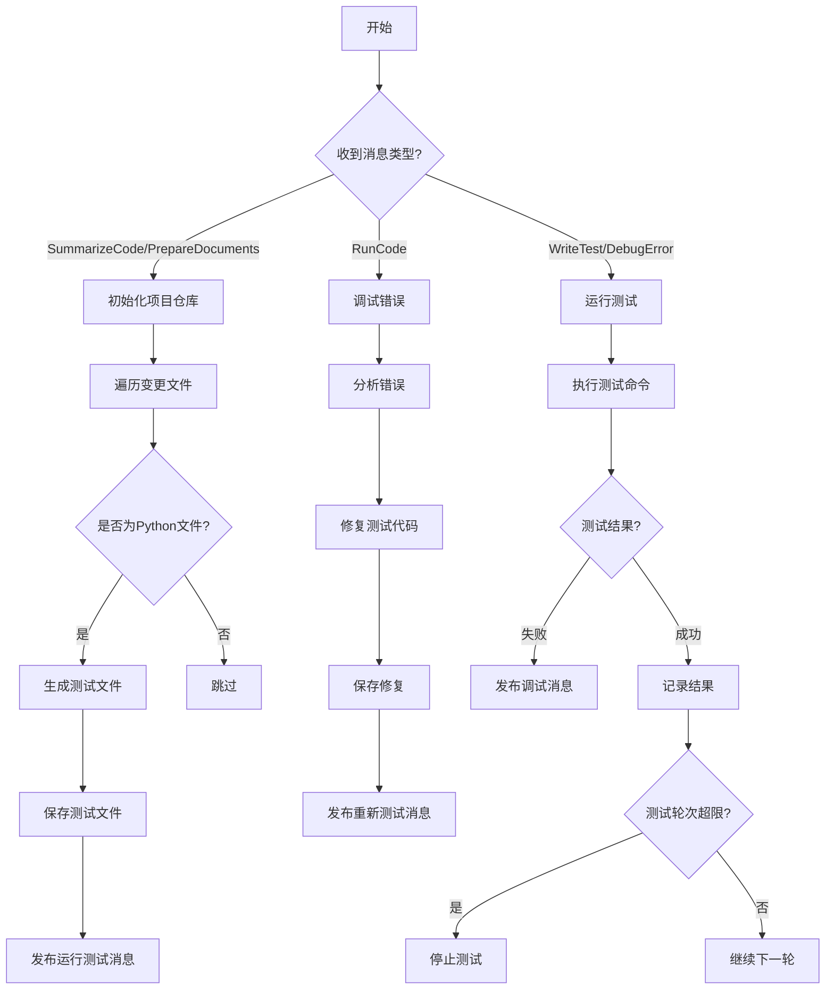
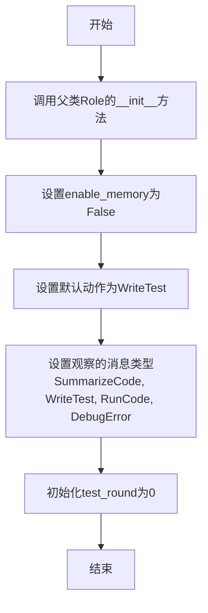
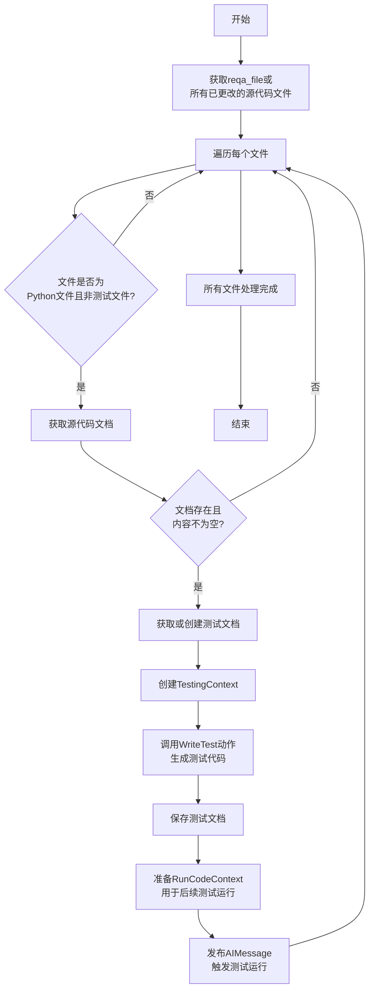
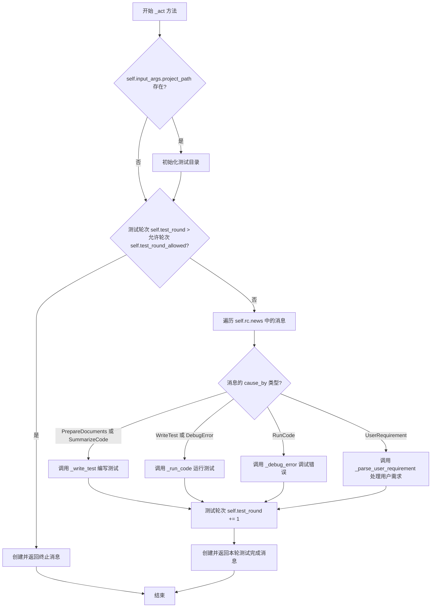
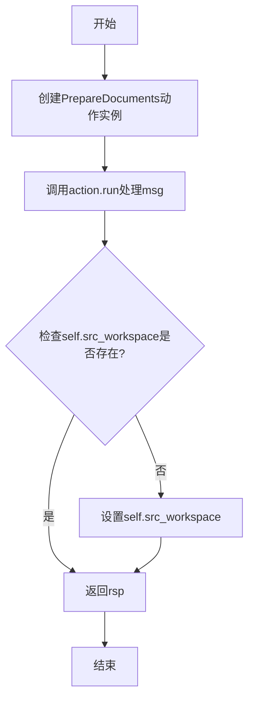
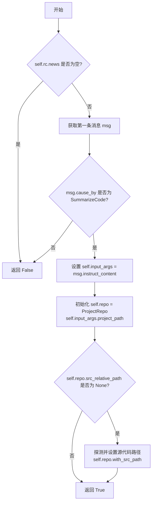

# `.\MetaGPT\metagpt\roles\qa_engineer.py` 详细设计文档

该代码实现了一个QA工程师角色，负责自动化测试流程，包括根据代码变更编写测试用例、运行测试、调试错误，并与工程师角色协作，确保代码质量。

## 整体流程



## 类结构

```
Role (基类)
└── QaEngineer (QA工程师角色)
    ├── 字段: name, profile, goal, constraints, test_round_allowed, test_round, repo, input_args
    ├── 方法: __init__, _write_test, _run_code, _debug_error, _act, _parse_user_requirement, _think
```

## 全局变量及字段


### `QaEngineer.name`
    
角色的名称，默认为'Edward'，用于标识该QA工程师实例。

类型：`str`
    


### `QaEngineer.profile`
    
角色的职业描述，固定为'QaEngineer'，定义了该角色在系统中的职责。

类型：`str`
    


### `QaEngineer.goal`
    
角色的核心目标，即编写全面且健壮的测试以确保代码按预期工作且无缺陷。

类型：`str`
    


### `QaEngineer.constraints`
    
角色在编写测试代码时必须遵守的约束条件，例如遵循PEP8标准、模块化、易读易维护等。

类型：`str`
    


### `QaEngineer.test_round_allowed`
    
允许的最大测试轮次，默认为5，用于控制测试循环以避免无限执行。

类型：`int`
    


### `QaEngineer.test_round`
    
当前已执行的测试轮次计数器，用于跟踪测试进度并与最大允许轮次比较。

类型：`int`
    


### `QaEngineer.repo`
    
项目仓库的引用，用于访问源代码、测试代码和输出文件，初始为None并在运行时动态设置。

类型：`Optional[ProjectRepo]`
    


### `QaEngineer.input_args`
    
输入参数对象，通常包含项目路径等配置信息，用于初始化项目环境和指导测试流程。

类型：`Optional[BaseModel]`
    
    

## 全局函数及方法

### `QaEngineer.__init__`

该方法用于初始化`QaEngineer`类的实例，设置其基本属性、禁用记忆功能、配置默认动作和观察的消息类型，并初始化测试轮次计数器。

参数：

-  `kwargs`：`dict`，用于传递给父类`Role`的初始化方法的关键字参数。

返回值：`None`，无返回值。

#### 流程图



#### 带注释源码

```python
def __init__(self, **kwargs):
    # 调用父类Role的初始化方法，传入所有关键字参数
    super().__init__(**kwargs)
    # 禁用该角色的记忆功能
    self.enable_memory = False

    # FIXME: 此处略显hack，仅初始化一个动作以规避_think()逻辑，
    # 将在未来更新中重写_think()方法
    # 设置角色的默认动作为WriteTest
    self.set_actions([WriteTest])
    # 设置角色观察的消息类型，当收到这些类型的消息时会触发相应处理
    self._watch([SummarizeCode, WriteTest, RunCode, DebugError])
    # 初始化测试轮次计数器
    self.test_round = 0
```

### `QaEngineer._write_test`

该方法负责为源代码文件生成对应的单元测试文件。它遍历所有已更改的源代码文件，为每个非测试的Python文件创建一个测试文件，调用`WriteTest`动作来生成测试代码，保存测试文件，并准备运行测试的上下文信息，最后发布一个消息以触发后续的测试运行流程。

参数：

- `message`：`Message`，触发测试编写流程的消息，通常包含需要测试的代码文件信息。

返回值：`None`，该方法不返回任何值，但会通过发布消息来驱动后续的测试运行流程。

#### 流程图



#### 带注释源码

```python
async def _write_test(self, message: Message) -> None:
    # 获取reqa_file或所有已更改的源代码文件
    reqa_file = self.context.kwargs.reqa_file or self.config.reqa_file
    changed_files = {reqa_file} if reqa_file else set(self.repo.srcs.changed_files.keys())
    
    # 遍历每个已更改的文件
    for filename in changed_files:
        # 跳过非Python文件或已经是测试文件的情况
        if not filename or "test" in filename:
            continue
        # 获取源代码文档
        code_doc = await self.repo.srcs.get(filename)
        if not code_doc or not code_doc.content:
            continue
        if not code_doc.filename.endswith(".py"):
            continue
        
        # 获取或创建对应的测试文档
        test_doc = await self.repo.tests.get("test_" + code_doc.filename)
        if not test_doc:
            test_doc = Document(
                root_path=str(self.repo.tests.root_path), 
                filename="test_" + code_doc.filename, 
                content=""
            )
        
        logger.info(f"Writing {test_doc.filename}..")
        # 创建测试上下文
        context = TestingContext(filename=test_doc.filename, test_doc=test_doc, code_doc=code_doc)
        
        # 调用WriteTest动作生成测试代码
        context = await WriteTest(i_context=context, context=self.context, llm=self.llm).run()
        
        # 使用EditorReporter报告测试生成进度
        async with EditorReporter(enable_llm_stream=True) as reporter:
            await reporter.async_report({"type": "test", "filename": test_doc.filename}, "meta")
            
            # 保存测试文档，并建立与源代码的依赖关系
            doc = await self.repo.tests.save_doc(
                doc=context.test_doc, 
                dependencies={context.code_doc.root_relative_path}
            )
            await reporter.async_report(self.repo.workdir / doc.root_relative_path, "path")
        
        # 准备运行测试的上下文信息
        run_code_context = RunCodeContext(
            command=["python", context.test_doc.root_relative_path],
            code_filename=context.code_doc.filename,
            test_filename=context.test_doc.filename,
            working_directory=str(self.repo.workdir),
            additional_python_paths=[str(self.repo.srcs.workdir)],
        )
        
        # 发布消息以触发后续的测试运行流程
        self.publish_message(
            AIMessage(
                content=run_code_context.model_dump_json(), 
                cause_by=WriteTest, 
                send_to=MESSAGE_ROUTE_TO_SELF
            )
        )
    
    logger.info(f"Done {str(self.repo.tests.workdir)} generating.")
```

### `QaEngineer._run_code`

该方法负责执行测试代码。它从传入的消息中加载运行上下文，获取对应的源代码和测试代码文档，然后调用`RunCode`动作来执行测试。执行完成后，它会将测试结果保存到输出文件中，并根据测试结果的摘要决定下一步的消息路由（是继续自循环测试，还是将问题转发给工程师处理）。

参数：

- `msg`：`Message`，包含序列化的`RunCodeContext`信息的消息对象，用于加载测试运行的上下文。

返回值：`None`，该方法不直接返回值，其作用是通过发布消息来驱动后续的工作流。

#### 流程图

```mermaid
flowchart TD
    A[开始: _run_code(msg)] --> B[从msg.content加载RunCodeContext]
    B --> C{获取源代码文档?}
    C -->|否| D[返回]
    C -->|是| E{获取测试代码文档?}
    E -->|否| D
    E -->|是| F[将源码和测试码<br>设置到context中]
    F --> G[执行RunCode动作]
    G --> H[保存测试结果到文件]
    H --> I[解析测试结果摘要<br>决定接收者]
    I --> J{接收者是Engineer?}
    J -->|是| K[发布消息给工程师Alex]
    J -->|否| L[发布消息给自己<br>进行下一轮]
    K & L --> M[结束]
```

#### 带注释源码

```python
async def _run_code(self, msg):
    # 1. 从传入的消息内容中反序列化出运行代码的上下文信息
    run_code_context = RunCodeContext.loads(msg.content)
    
    # 2. 根据上下文中的文件名，从源代码仓库获取对应的源代码文档
    src_doc = await self.repo.srcs.get(run_code_context.code_filename)
    if not src_doc:
        return  # 如果源代码不存在，则直接返回，不执行测试
    
    # 3. 根据上下文中的文件名，从测试代码仓库获取对应的测试代码文档
    test_doc = await self.repo.tests.get(run_code_context.test_filename)
    if not test_doc:
        return  # 如果测试代码不存在，则直接返回
    
    # 4. 将获取到的源代码和测试代码内容设置到运行上下文中
    run_code_context.code = src_doc.content
    run_code_context.test_code = test_doc.content
    
    # 5. 创建并执行RunCode动作，传入配置好的上下文，获取运行结果
    result = await RunCode(i_context=run_code_context, context=self.context, llm=self.llm).run()
    
    # 6. 设置输出文件名（通常为测试文件名加.json后缀），并将运行结果序列化后保存到输出仓库
    run_code_context.output_filename = run_code_context.test_filename + ".json"
    await self.repo.test_outputs.save(
        filename=run_code_context.output_filename,
        content=result.model_dump_json(),
        dependencies={src_doc.root_relative_path, test_doc.root_relative_path},
    )
    
    # 7. 清理上下文中的代码内容，避免在后续序列化消息时包含过大载荷
    run_code_context.code = None
    run_code_context.test_code = None
    
    # 8. 解析运行结果的摘要，以决定下一步消息的接收者（是工程师还是自己）
    recipient = parse_recipient(result.summary)
    mappings = {"Engineer": "Alex", "QaEngineer": "Edward"}
    
    # 9. 根据解析出的接收者，构造并发布相应的AIMessage，驱动后续流程
    if recipient != "Engineer":
        # 如果接收者不是工程师（例如是自己），则发布消息给自己，触发下一轮测试或调试
        self.publish_message(
            AIMessage(
                content=run_code_context.model_dump_json(),
                cause_by=RunCode,
                instruct_content=self.input_args,
                send_to=MESSAGE_ROUTE_TO_SELF,
            )
        )
    else:
        # 如果接收者是工程师，则准备相关数据并发布消息给工程师（Alex）
        kvs = self.input_args.model_dump()
        kvs["changed_test_filenames"] = [
            str(self.repo.tests.workdir / i) for i in list(self.repo.tests.changed_files.keys())
        ]
        self.publish_message(
            AIMessage(
                content=run_code_context.model_dump_json(),
                cause_by=RunCode,
                instruct_content=self.input_args,
                send_to=mappings.get(recipient, MESSAGE_ROUTE_TO_NONE),
            )
        )
```

### `QaEngineer._debug_error`

该方法用于处理测试运行失败后的错误调试流程。当接收到一个由`RunCode`动作触发的消息（包含测试运行失败的上下文信息）时，该方法会调用`DebugError`动作来分析错误、生成修复后的测试代码，并将修复后的代码保存回测试文件。随后，它会发布一个新的消息，指示需要重新运行修复后的测试，从而形成一个“调试-运行”的循环。

参数：

- `self`：`QaEngineer`，`QaEngineer`类的当前实例。
- `msg`：`Message`，包含测试运行失败上下文信息（`RunCodeContext`的JSON字符串）的消息对象。

返回值：`None`，该方法不返回任何值，其作用是通过发布消息来驱动后续的测试运行流程。

#### 流程图

```mermaid
flowchart TD
    A[开始: _debug_error(msg)] --> B[从msg.content加载RunCodeContext]
    B --> C[调用DebugError.run<br/>传入上下文、仓库、输入参数等]
    C --> D[获取修复后的测试代码]
    D --> E[将修复后的代码保存到<br/>repo.tests仓库]
    E --> F[重置RunCodeContext中的output字段]
    F --> G[发布新的AIMessage<br/>内容为更新后的RunCodeContext<br/>cause_by设为DebugError<br/>发送给自己]
    G --> H[结束]
```

#### 带注释源码

```python
async def _debug_error(self, msg):
    # 1. 从传入的消息内容中反序列化出测试运行的上下文信息
    run_code_context = RunCodeContext.loads(msg.content)
    
    # 2. 调用DebugError动作来执行调试。
    #    传入的参数包括：运行上下文(run_code_context)、代码仓库(self.repo)、
    #    输入参数(self.input_args)、角色上下文(self.context)和语言模型(self.llm)。
    #    该动作会分析错误并返回修复后的测试代码。
    code = await DebugError(
        i_context=run_code_context, 
        repo=self.repo, 
        input_args=self.input_args, 
        context=self.context, 
        llm=self.llm
    ).run()
    
    # 3. 将DebugError动作返回的修复后的测试代码，保存回原始的测试文件中。
    await self.repo.tests.save(filename=run_code_context.test_filename, content=code)
    
    # 4. 清空运行上下文中的输出信息，为下一次运行做准备。
    run_code_context.output = None
    
    # 5. 发布一个新的AIMessage，其内容为更新后的RunCodeContext（已序列化为JSON）。
    #    这个消息的cause_by被标记为DebugError，并发送给自己(MESSAGE_ROUTE_TO_SELF)。
    #    这将触发QaEngineer的观察机制，在下一轮_act中，这个消息会被识别为来自`test_filters`（包含DebugError），
    #    从而调用`_run_code`方法重新运行修复后的测试，形成调试循环。
    self.publish_message(
        AIMessage(
            content=run_code_context.model_dump_json(), 
            cause_by=DebugError, 
            send_to=MESSAGE_ROUTE_TO_SELF
        )
    )
```

### `QaEngineer._act`

`QaEngineer._act` 方法是 `QaEngineer` 角色的核心行为方法。它根据当前消息队列中的消息类型，决定并执行相应的测试工作流：编写测试、运行测试或调试错误。该方法还负责管理测试轮次，并在超过允许的最大测试轮次时终止流程。

参数：

-  `self`：`QaEngineer` 实例，表示当前执行该方法的 QA 工程师角色对象。

返回值：`Message`，返回一个 `AIMessage` 对象，用于通知系统当前测试轮次的结果或终止测试流程。

#### 流程图



#### 带注释源码

```python
async def _act(self) -> Message:
    # 1. 如果输入参数中指定了项目路径，则初始化测试目录的Python环境
    if self.input_args.project_path:
        await init_python_folder(self.repo.tests.workdir)

    # 2. 检查是否超过允许的最大测试轮次，如果是，则创建并返回终止消息
    if self.test_round > self.test_round_allowed:
        kvs = self.input_args.model_dump()
        kvs["changed_test_filenames"] = [
            str(self.repo.tests.workdir / i) for i in list(self.repo.tests.changed_files.keys())
        ]
        result_msg = AIMessage(
            content=f"Exceeding {self.test_round_allowed} rounds of tests, stop. "
            + "\n".join(list(self.repo.tests.changed_files.keys())),
            cause_by=WriteTest,
            instruct_content=AIMessage.create_instruct_value(kvs=kvs, class_name="WriteTestOutput"),
            send_to=MESSAGE_ROUTE_TO_NONE,
        )
        return result_msg

    # 3. 定义消息过滤器，用于根据消息的 cause_by 字段判断消息类型
    code_filters = any_to_str_set({PrepareDocuments, SummarizeCode})
    test_filters = any_to_str_set({WriteTest, DebugError})
    run_filters = any_to_str_set({RunCode})

    # 4. 遍历消息队列中的新消息，根据消息类型执行相应操作
    for msg in self.rc.news:
        # 根据观察到的消息类型决定执行什么操作，目前由人工定义，
        # 未来可能移至 _think 方法，即让智能体自行决定
        if msg.cause_by in code_filters:
            # 工程师编写了代码，是时候为其编写测试了
            await self._write_test(msg)
        elif msg.cause_by in test_filters:
            # 我编写或调试了测试代码，是时候运行它了
            await self._run_code(msg)
        elif msg.cause_by in run_filters:
            # 我运行了测试代码，是时候修复可能存在的错误了
            await self._debug_error(msg)
        elif msg.cause_by == any_to_str(UserRequirement):
            # 收到用户需求，调用专门的方法处理
            return await self._parse_user_requirement(msg)

    # 5. 完成一轮处理后，增加测试轮次计数
    self.test_round += 1

    # 6. 准备本轮测试完成的消息内容，包含已更改的测试文件列表
    kvs = self.input_args.model_dump()
    kvs["changed_test_filenames"] = [
        str(self.repo.tests.workdir / i) for i in list(self.repo.tests.changed_files.keys())
    ]

    # 7. 创建并返回本轮测试完成的消息
    return AIMessage(
        content=f"Round {self.test_round} of tests done",
        instruct_content=AIMessage.create_instruct_value(kvs=kvs, class_name="WriteTestOutput"),
        cause_by=WriteTest,
        send_to=MESSAGE_ROUTE_TO_NONE,
    )
```

### `QaEngineer._parse_user_requirement`

该方法用于解析用户需求消息，提取关键信息（如项目路径和特定的测试文件），并调用`PrepareDocuments`动作来处理这些信息，最终返回一个包含处理结果的`AIMessage`。

参数：

- `msg`：`Message`，包含用户原始需求的消息对象。

返回值：`AIMessage`，包含`PrepareDocuments`动作处理后的响应消息。

#### 流程图



#### 带注释源码

```python
async def _parse_user_requirement(self, msg: Message) -> AIMessage:
    # 创建一个PrepareDocuments动作实例，用于处理用户需求
    # send_to参数指定消息接收者为当前QaEngineer实例
    # key_descriptions参数定义了从用户需求中提取的关键字段及其描述
    action = PrepareDocuments(
        send_to=any_to_str(self),
        key_descriptions={
            "project_path": 'the project path if exists in "Original Requirement"',
            "reqa_file": 'the file name to rewrite unit test if exists in "Original Requirement"',
        },
        context=self.context,
    )
    # 运行PrepareDocuments动作，传入用户需求消息进行处理
    rsp = await action.run([msg])
    # 如果self.src_workspace尚未设置，则根据git仓库信息初始化它
    if not self.src_workspace:
        self.src_workspace = self.git_repo.workdir / self.git_repo.workdir.name
    # 返回PrepareDocuments动作的处理结果
    return rsp
```

### `QaEngineer._think`

该方法用于处理接收到的消息，并根据消息类型初始化`QaEngineer`角色的内部状态。具体来说，当接收到由`SummarizeCode`动作触发的消息时，该方法会从消息中提取指令内容（`instruct_content`），并将其解析为`input_args`，同时初始化项目仓库（`repo`）对象。如果项目仓库的源代码路径未设置，则会自动探测并设置源代码路径。

参数：

-  `self`：`QaEngineer`，`QaEngineer`类的实例，表示当前的质量保证工程师角色。

返回值：`bool`，返回一个布尔值，表示是否成功处理了消息。如果存在待处理的消息且消息由`SummarizeCode`触发，则返回`True`；否则返回`False`。

#### 流程图



#### 带注释源码

```python
async def _think(self) -> bool:
    # 检查是否有新消息
    if not self.rc.news:
        # 如果没有新消息，返回 False，表示无需进一步行动
        return False
    # 获取第一条新消息
    msg = self.rc.news[0]
    # 判断消息是否由 SummarizeCode 动作触发
    if msg.cause_by == any_to_str(SummarizeCode):
        # 从消息中提取指令内容，作为输入参数
        self.input_args = msg.instruct_content
        # 根据输入参数中的项目路径初始化项目仓库对象
        self.repo = ProjectRepo(self.input_args.project_path)
        # 如果仓库的源代码相对路径未设置，则自动探测并设置
        if self.repo.src_relative_path is None:
            path = get_project_srcs_path(self.repo.workdir)
            self.repo.with_src_path(path)
    # 返回 True，表示已处理消息，可以进入 _act 阶段
    return True
```

## 关键组件


### 张量索引与惰性加载

通过 `ProjectRepo` 类管理项目源代码、测试代码和测试输出，利用 `Document` 对象和 `get`/`save` 方法实现按需加载和保存文件内容，避免一次性加载所有文件。

### 反量化支持

通过 `RunCodeContext` 类封装运行测试所需的上下文信息（如命令、工作目录、代码内容等），并使用其 `model_dump_json` 和 `loads` 方法在消息传递过程中序列化和反序列化这些复杂数据结构。

### 量化策略

通过 `TestingContext` 和 `RunCodeContext` 等上下文类，将测试编写、代码运行和错误调试等任务所需的参数和状态进行封装和传递，实现任务参数的固化和量化管理。


## 问题及建议


### 已知问题

-   **循环依赖与职责模糊**：`QaEngineer` 类在 `_act` 方法中直接根据消息类型（`cause_by`）决定执行 `_write_test`、`_run_code` 或 `_debug_error`。这种硬编码的逻辑将消息路由、测试流程控制和具体执行逻辑耦合在一起，违反了单一职责原则，使得代码难以扩展和维护。例如，新增一个测试阶段（如性能测试）需要修改多个地方的判断逻辑。
-   **状态管理复杂**：`test_round` 和 `test_round_allowed` 用于控制测试轮次，但 `_act` 方法在每次调用时都会递增 `test_round`，无论本轮是否实际执行了测试。这可能导致计数不准确。同时，测试状态（如当前轮次、已更改文件）分散在多个地方管理，增加了状态不一致的风险。
-   **初始化逻辑存在缺陷**：在 `__init__` 方法中，注释提到“FIXME: a bit hack here, only init one action to circumvent _think() logic”。这表明当前通过只初始化一个 `WriteTest` 动作来绕过 `_think` 方法的默认逻辑是一种临时解决方案，架构设计不清晰，长期来看不可维护。
-   **异常处理不足**：代码中缺乏对关键操作（如文件读取、测试运行、消息解析）的异常处理。例如，`_write_test` 中如果 `code_doc` 为空或内容为空，只是跳过，但没有记录警告或错误，可能导致静默失败。`_run_code` 中如果 `src_doc` 或 `test_doc` 获取失败直接返回，没有后续处理。
-   **硬编码的映射和路径**：`_run_code` 方法中存在硬编码的映射 `mappings = {"Engineer": "Alex", "QaEngineer": "Edward"}`，这降低了角色的灵活性。同时，文件路径的构建（如 `str(self.repo.tests.workdir / i)`）和命令（如 `["python", context.test_doc.root_relative_path]`）是硬编码的，不利于跨平台或配置化。
-   **资源可能未正确释放**：代码中使用了 `EditorReporter` 的上下文管理器，但在 `_write_test` 的循环中，每次迭代都创建新的 `WriteTest` 和 `EditorReporter` 实例。如果 `changed_files` 很多，可能会造成资源（如LLM连接、文件句柄）的频繁创建和销毁，影响性能。
-   **消息内容序列化/反序列化风险**：`RunCodeContext` 通过 `model_dump_json()` 和 `loads()` 在消息中传递。如果 `RunCodeContext` 的模型定义发生变化（如字段重命名、类型更改），旧版本序列化的消息可能无法正确反序列化，导致运行时错误。

### 优化建议

-   **引入明确的状态机或工作流引擎**：将测试流程（写测试 -> 运行测试 -> 调试错误）抽象为一个明确的状态机或使用工作流引擎（如使用 `metagpt` 框架内可能的工作流支持）。每个状态对应一个清晰的职责（如 `WriteTestState`、`RunTestState`、`DebugState`），由状态机负责路由和状态转换。这可以解耦消息处理、流程控制和具体操作，提高代码的可读性和可扩展性。
-   **重构 `_think` 和 `_act` 方法**：遵循框架的设计意图，让 `_think` 方法真正负责决策（决定下一步执行哪个动作），`_act` 方法负责执行选定的动作。移除 `_act` 方法中基于 `cause_by` 的复杂 `if-elif` 链。可以考虑使用策略模式，将不同消息类型的处理逻辑封装成独立的策略类。
-   **加强状态管理和封装**：将测试轮次、当前测试文件集等状态封装到一个专门的 `TestingSession` 或 `QaContext` 对象中。这个对象负责状态的正确更新、验证和持久化（如果需要）。确保 `test_round` 只在完成一轮有效测试后递增。
-   **完善异常处理与日志记录**：在文件操作、外部命令执行（`RunCode`）、LLM调用等可能失败的地方添加 `try-except` 块。捕获异常后，应记录详细的错误日志（包括上下文信息），并根据情况决定是重试、跳过还是上报失败。避免静默失败。
-   **使用配置代替硬编码**：将角色映射（如 `"Engineer" -> "Alex"`）、测试命令模板、文件路径规则等提取到配置文件或 `Role` 的属性中。例如，可以添加 `test_command_template` 字段，允许根据不同环境（Windows/Linux）或项目类型进行配置。
-   **优化资源使用**：考虑在 `_write_test` 循环外部初始化可重用的资源（如 `EditorReporter`，如果支持）。评估是否可以将多个文件的测试生成批量化处理，以减少与外部服务（如LLM）的交互次数。确保所有实现了 `__aenter__`/`__aexit__` 或 `__enter__`/`__exit__` 的对象都被正确用于上下文管理。
-   **定义消息版本契约**：对于通过消息传递的复杂数据结构（如 `RunCodeContext`），考虑定义版本号。在反序列化时，可以检查版本号并采取兼容性处理（如忽略未知字段、提供默认值）。或者，考虑传递文件的引用（如RFC 135所述）而非完整序列化对象，以降低耦合。
-   **分离关注点**：将 `_parse_user_requirement` 方法的功能（处理用户需求，初始化项目）进一步分离。这部分逻辑可能更适合放在角色初始化或一个独立的 `SetupPhase` 中。使 `QaEngineer` 的核心职责更聚焦于测试生命周期管理。
-   **添加单元测试**：为 `QaEngineer` 的关键方法（尤其是状态转换和消息处理逻辑）编写单元测试。使用模拟（Mock）来隔离外部依赖（如 `ProjectRepo`、`LLM`、`Actions`），确保核心逻辑的正确性和健壮性。


## 其它


### 设计目标与约束

本模块旨在实现一个自动化质量保证工程师角色，其核心设计目标是在一个多智能体协作的软件开发环境中，自动为工程师编写的代码生成、执行和调试单元测试。主要约束包括：1) 测试代码需遵循PEP8等代码规范，保证模块化、可读性和可维护性；2) 测试轮次有上限（默认为5轮），以防止无限循环；3) 遵循RFC 116和RFC 135等内部架构规范，进行消息传递和文件管理；4) 与项目仓库（ProjectRepo）紧密集成，实现代码、测试及输出文件的版本化管理。

### 错误处理与异常设计

模块的错误处理主要依赖于Python的异常机制和日志记录。关键操作（如文件读写、LLM调用）通过`try-except`块捕获异常，并使用`logger`记录错误信息，避免进程崩溃。对于测试执行失败（由`RunCode`动作返回的结果指示），模块通过`DebugError`动作尝试修复测试代码。模块未显式定义自定义异常类，依赖底层动作（如`WriteTest`, `RunCode`, `DebugError`）抛出的异常和Pydantic模型验证错误。消息路由失败时，使用`MESSAGE_ROUTE_TO_NONE`作为兜底策略。

### 数据流与状态机

数据流围绕`Message`对象和`ProjectRepo`仓库展开。外部触发（如`SummarizeCode`消息）初始化`input_args`和`repo`状态。核心状态机由`_act`方法驱动，根据消息的`cause_by`字段决定状态转移：
1.  **代码就绪态** (`PrepareDocuments`, `SummarizeCode`消息): 触发`_write_test`，进入测试生成态。
2.  **测试生成态** (`WriteTest`, `DebugError`消息): 触发`_run_code`，进入测试执行态。
3.  **测试执行态** (`RunCode`消息): 分析执行结果。若失败，触发`_debug_error`回到测试生成态；若成功或达到轮次上限，进入结束态。
4.  **结束态**: 发送包含测试结果或终止信息的消息。
状态数据（如当前测试轮次`test_round`、变更的文件列表）随消息和仓库状态流转。

### 外部依赖与接口契约

1.  **内部动作依赖**: 强依赖于`metagpt.actions`模块中的`WriteTest`、`RunCode`、`DebugError`、`SummarizeCode`、`PrepareDocuments`、`UserRequirement`。通过调用其`run`方法并传递特定上下文（如`TestingContext`, `RunCodeContext`）进行协作。
2.  **数据模型依赖**: 依赖于`metagpt.schema`中的`Message`、`AIMessage`、`Document`、`RunCodeContext`、`TestingContext`。`Message`是智能体间通信的基本单元，其`cause_by`、`instruct_content`、`send_to`字段是路由和状态判断的关键。
3.  **工具类依赖**: 依赖于`metagpt.utils.project_repo.ProjectRepo`进行文件系统操作和依赖管理；依赖于`metagpt.utils.report.EditorReporter`进行报告生成。
4.  **配置与常量依赖**: 依赖于`metagpt.const`中的`MESSAGE_ROUTE_TO_*`常量进行消息路由。
5.  **隐式契约**:
    *   `WriteTest`动作的`run`方法应返回更新后的`TestingContext`。
    *   `RunCode`动作的`run`方法应返回包含执行摘要（`summary`字段）的结果对象，该摘要用于解析下一步接收者（`parse_recipient`）。
    *   `DebugError`动作的`run`方法应返回修复后的测试代码字符串。
    *   `ProjectRepo`的`srcs`、`tests`、`test_outputs`属性分别提供源代码、测试代码、测试输出文件的文档管理接口。

### 并发与性能考量

模块设计为在异步事件循环中运行（使用`async/await`）。文件I/O操作（如`repo.save_doc`）和LLM调用（通过动作的`run`方法）是主要的潜在性能瓶颈，均被设计为异步操作以避免阻塞。`_write_test`方法中对每个变更文件串行生成测试，对于大量文件可能成为性能瓶颈。测试轮次限制（`test_round_allowed`）是一种防止长时间运行的控制机制。当前未使用显式的并行处理（如`asyncio.gather`）来同时处理多个文件的测试生成。

### 安全与合规性

模块操作局限于指定的项目目录（通过`ProjectRepo`管理），未涉及跨网络操作或敏感数据访问，因此主要安全考虑在于文件系统安全（如路径遍历攻击）。通过使用`ProjectRepo`的路径管理，风险较低。合规性方面，强调生成的测试代码需符合PEP8等编码规范。对LLM的使用依赖外部动作的实现，本模块不直接处理与LLM服务相关的API密钥或数据隐私问题。

### 测试策略

模块自身的测试策略应覆盖：
1.  **单元测试**: 针对`_write_test`、`_run_code`、`_debug_error`、`_think`、`_act`等方法，模拟不同的输入消息和仓库状态，验证状态转移和消息发布的正确性。
2.  **集成测试**: 与`ProjectRepo`、`WriteTest`、`RunCode`、`DebugError`等依赖组件集成，测试完整的“生成-执行-调试”工作流。
3.  **模拟（Mocking）**: 需要大量使用Mock对象来模拟`ProjectRepo`的方法（如`get`、`save_doc`）、动作的`run`方法返回值、以及`Message`对象，以隔离测试环境。
4.  **场景测试**: 测试达到最大测试轮次、处理空文件、处理非Python文件等边界和异常场景。

    