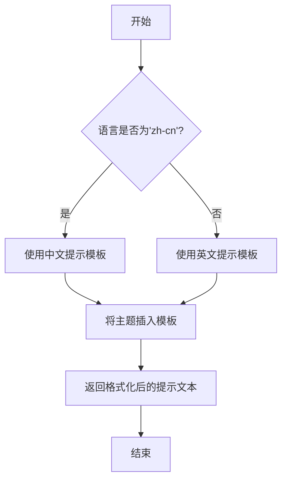
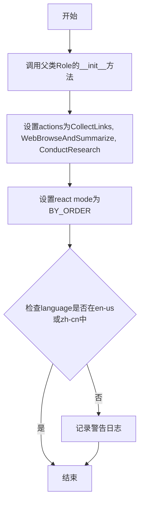
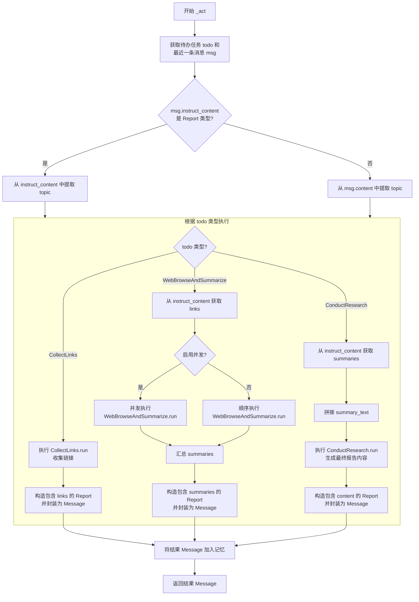
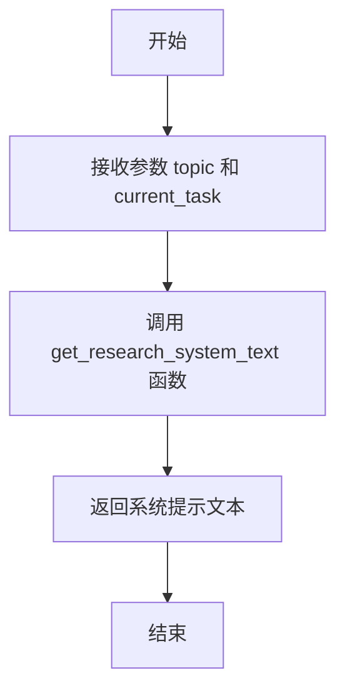
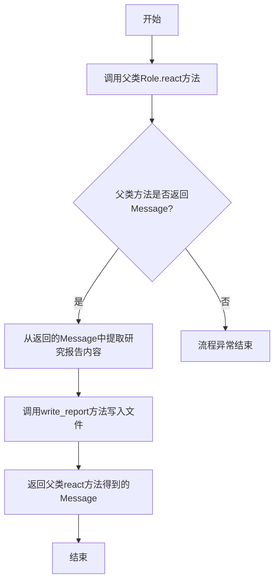
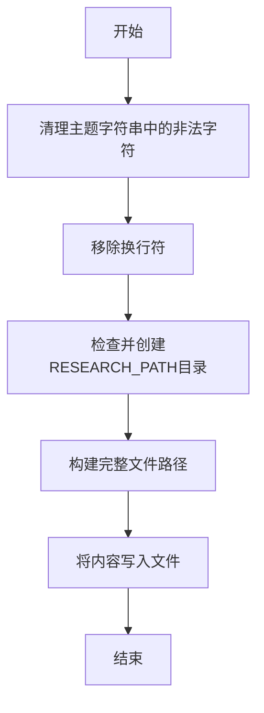

# `.\MetaGPT\metagpt\roles\researcher.py` 详细设计文档

该代码实现了一个 Researcher 角色，用于自动化信息收集和研究。它通过顺序执行三个动作（CollectLinks、WebBrowseAndSummarize、ConductResearch）来收集指定主题的网络链接、浏览并总结网页内容，最后生成一份综合研究报告，并将报告保存为 Markdown 文件。

## 整体流程

```mermaid
graph TD
    A[开始: Researcher.run(topic)] --> B[初始化 Researcher 角色]
    B --> C[设置动作序列: CollectLinks -> WebBrowseAndSummarize -> ConductResearch]
    C --> D{执行 _act 方法}
    D --> E{判断当前动作类型}
    E -- CollectLinks --> F[运行 CollectLinks 收集链接]
    F --> G[生成包含链接的 Message]
    E -- WebBrowseAndSummarize --> H[获取上一步的链接]
    H --> I{是否启用并发?}
    I -- 是 --> J[并发执行 WebBrowseAndSummarize]
    I -- 否 --> K[顺序执行 WebBrowseAndSummarize]
    J --> L[生成包含摘要的 Message]
    K --> L
    E -- ConductResearch --> M[获取上一步的摘要]
    M --> N[运行 ConductResearch 生成最终报告]
    N --> O[生成包含报告内容的 Message]
    G --> P[将 Message 存入记忆]
    L --> P
    O --> P
    P --> Q{是否所有动作完成?}
    Q -- 否 --> D
    Q -- 是 --> R[调用 react 方法]
    R --> S[从最终 Message 中提取报告]
    S --> T[调用 write_report 保存报告]
    T --> U[结束]
```

## 类结构

```
BaseModel (Pydantic)
└── Report (数据模型)
Role (元角色基类)
└── Researcher (研究者角色)
    ├── 继承自 Role
    ├── 使用 Report 模型
    └── 依赖 Actions: CollectLinks, WebBrowseAndSummarize, ConductResearch
```

## 全局变量及字段


### `RESEARCH_PATH`
    
存储研究报告文件的目录路径常量，用于指定研究报告的保存位置。

类型：`Path`
    


### `Report.topic`
    
研究报告的主题或标题，用于标识研究内容的核心主题。

类型：`str`
    


### `Report.links`
    
存储研究过程中收集的链接，键为查询关键词，值为对应的URL列表。

类型：`dict[str, list[str]]`
    


### `Report.summaries`
    
存储网页浏览和摘要的结果，每个元素为(URL, 摘要内容)的元组。

类型：`list[tuple[str, str]]`
    


### `Report.content`
    
最终生成的研究报告内容，包含完整的分析结果和结论。

类型：`str`
    


### `Researcher.name`
    
研究员的名称标识，默认为'David'，用于区分不同的研究员实例。

类型：`str`
    


### `Researcher.profile`
    
研究员的角色描述，默认为'Researcher'，用于说明角色的职责和功能。

类型：`str`
    


### `Researcher.goal`
    
研究员的核心目标，默认为'Gather information and conduct research'，定义角色的主要任务。

类型：`str`
    


### `Researcher.constraints`
    
研究员的约束条件，默认为'Ensure accuracy and relevance of information'，限制研究过程中的行为准则。

类型：`str`
    


### `Researcher.language`
    
研究报告使用的语言，默认为'en-us'，支持'en-us'和'zh-cn'两种语言选项。

类型：`str`
    


### `Researcher.enable_concurrency`
    
控制是否启用并发执行网页浏览和摘要任务，默认为True以提高效率。

类型：`bool`
    
    

## 全局函数及方法

### `main`

`main` 函数是 Researcher 角色的异步入口点，用于启动研究任务。它接收一个主题、语言和并发控制参数，创建一个 Researcher 实例，并运行该角色以生成研究报告。

参数：

- `topic`：`str`，研究主题
- `language`：`str`，研究语言，默认为 "en-us"
- `enable_concurrency`：`bool`，是否启用并发，默认为 True

返回值：`None`，无返回值

#### 流程图

```mermaid
graph TD
    A[开始] --> B[接收参数 topic, language, enable_concurrency]
    B --> C[创建 Researcher 实例]
    C --> D[调用 role.run(topic) 启动研究流程]
    D --> E[执行 CollectLinks 收集链接]
    E --> F[执行 WebBrowseAndSummarize 浏览并总结]
    F --> G[执行 ConductResearch 生成最终报告]
    G --> H[将报告写入文件]
    H --> I[结束]
```

#### 带注释源码

```python
async def main(topic: str, language: str = "en-us", enable_concurrency: bool = True):
    # 创建 Researcher 实例，传入语言和并发控制参数
    role = Researcher(language=language, enable_concurrency=enable_concurrency)
    # 运行 Researcher 角色，传入研究主题
    await role.run(topic)
```

### `get_research_system_text`

该函数是一个全局函数，用于根据给定的研究主题和语言，生成一个系统提示文本。这个提示文本旨在指导AI模型（如GPT）如何执行研究任务，包括如何搜索、总结信息以及撰写研究报告。它通过组合预定义的模板和动态传入的主题及语言参数来构建最终的提示。

参数：

- `topic`：`str`，研究主题或查询内容。
- `language`：`str`，生成提示文本的语言，支持"en-us"（英语）和"zh-cn"（中文）。

返回值：`str`，返回一个格式化的系统提示字符串，用于指导研究任务的执行。

#### 流程图



#### 带注释源码

```python
def get_research_system_text(topic: str, language: str = "en-us") -> str:
    """
    根据给定的主题和语言生成研究系统提示文本。

    该函数返回一个系统提示，指导AI如何执行研究任务，包括搜索、总结和报告撰写。
    提示文本会根据指定的语言（英语或中文）进行本地化。

    Args:
        topic (str): 研究主题或查询内容。
        language (str, optional): 提示文本的语言，默认为"en-us"（英语）。
                                  支持"en-us"和"zh-cn"。

    Returns:
        str: 格式化的系统提示字符串。
    """
    # 中文提示模板
    if language == "zh-cn":
        return f"""你是一位资深研究员。
        请根据以下研究主题进行研究：
        {topic}

        请确保你从多个可靠来源收集信息，并对信息进行批判性分析。
        你的最终报告应全面、准确，并针对该主题的现有知识提供新的见解。
        报告应结构良好，包含引言、正文和结论，并引用所有来源。"""
    # 英文提示模板（默认）
    return f"""You are a seasoned researcher.
    Please conduct research on the following topic:
    {topic}

    Ensure you gather information from multiple reliable sources and critically analyze the information.
    Your final report should be comprehensive, accurate, and provide new insights on the topic's existing knowledge.
    The report should be well-structured with an introduction, body, and conclusion, and cite all sources."""
```

### `Researcher.__init__`

该方法用于初始化Researcher角色实例，继承父类Role的初始化逻辑，并设置Researcher特有的行为（actions）和反应模式（react mode）。同时，它会检查语言设置是否在已测试的范围内，若不在则发出警告。

参数：

- `**kwargs`：`dict`，可变关键字参数，用于接收传递给父类Role的初始化参数

返回值：`None`，无返回值

#### 流程图



#### 带注释源码

```python
def __init__(self, **kwargs):
    # 调用父类Role的初始化方法，传递所有关键字参数
    super().__init__(**kwargs)
    # 设置Researcher角色的行为列表，包括收集链接、网页浏览与总结、进行研究
    self.set_actions([CollectLinks, WebBrowseAndSummarize, ConductResearch])
    # 设置反应模式为按顺序执行，并指定行为数量
    self._set_react_mode(RoleReactMode.BY_ORDER.value, len(self.actions))
    # 检查语言设置是否在已测试的范围内（en-us或zh-cn），若不在则记录警告日志
    if self.language not in ("en-us", "zh-cn"):
        logger.warning(f"The language `{self.language}` has not been tested, it may not work.")
```

### `Researcher._act`

该方法实现了研究员角色的核心执行逻辑，根据当前待办任务（`self.rc.todo`）的类型，执行不同的研究步骤：收集链接、浏览并总结网页、或撰写最终研究报告。它处理输入消息，协调不同动作的执行，并将每个步骤的结果封装为带有`Report`对象的`Message`，存入记忆并返回。

参数：
-  `self`：`Researcher`，`Researcher`类实例，表示执行该方法的角色对象。

返回值：`Message`，返回一个`Message`对象，其`instruct_content`属性包含了当前步骤（收集链接、总结或最终报告）的`Report`数据。

#### 流程图



#### 带注释源码

```python
async def _act(self) -> Message:
    # 1. 记录日志，获取当前待执行的动作（todo）和上下文中的最新消息（msg）。
    logger.info(f"{self._setting}: to do {self.rc.todo}({self.rc.todo.name})")
    todo = self.rc.todo
    msg = self.rc.memory.get(k=1)[0]

    # 2. 确定研究主题（topic）。如果上一条消息的指令内容已经是Report对象，则从中提取topic；否则使用消息的文本内容。
    if isinstance(msg.instruct_content, Report):
        instruct_content = msg.instruct_content
        topic = instruct_content.topic
    else:
        topic = msg.content

    # 3. 获取针对当前任务和主题的系统提示文本。
    research_system_text = self.research_system_text(topic, todo)

    # 4. 根据当前待办动作（todo）的类型，执行不同的分支逻辑。
    if isinstance(todo, CollectLinks):
        # 分支 A: 执行“收集链接”动作。
        links = await todo.run(topic, 4, 4)
        # 构造返回消息，其指令内容为包含链接的Report。
        ret = Message(
            content="", instruct_content=Report(topic=topic, links=links), role=self.profile, cause_by=todo
        )
    elif isinstance(todo, WebBrowseAndSummarize):
        # 分支 B: 执行“浏览并总结”动作。
        # 从上一阶段的Report中获取需要浏览的链接字典。
        links = instruct_content.links
        # 为每个查询-链接对创建一个异步任务（生成器表达式）。
        todos = (
            todo.run(*url, query=query, system_text=research_system_text) for (query, url) in links.items() if url
        )
        # 根据并发开关，选择并发或顺序执行所有浏览总结任务。
        if self.enable_concurrency:
            summaries = await asyncio.gather(*todos)
        else:
            summaries = [await i for i in todos]
        # 扁平化处理结果，并过滤掉空摘要，形成（url, summary）列表。
        summaries = list((url, summary) for i in summaries for (url, summary) in i.items() if summary)
        # 构造返回消息，其指令内容为包含摘要列表的Report。
        ret = Message(
            content="", instruct_content=Report(topic=topic, summaries=summaries), role=self.profile, cause_by=todo
        )
    else:
        # 分支 C: 执行“进行研究”（撰写报告）动作。假定todo是ConductResearch类型。
        # 从上一阶段的Report中获取所有摘要。
        summaries = instruct_content.summaries
        # 将所有摘要拼接成一个文本块，用于生成最终报告。
        summary_text = "\n---\n".join(f"url: {url}\nsummary: {summary}" for (url, summary) in summaries)
        # 执行研究动作，生成最终的报告内容。
        content = await self.rc.todo.run(topic, summary_text, system_text=research_system_text)
        # 构造返回消息，其指令内容为包含最终报告内容的Report。
        ret = Message(
            content="",
            instruct_content=Report(topic=topic, content=content),
            role=self.profile,
            cause_by=self.rc.todo,
        )

    # 5. 将本步骤产生的结果消息添加到角色的记忆（memory）中。
    self.rc.memory.add(ret)
    # 6. 返回结果消息。
    return ret
```

### `Researcher.research_system_text`

该方法用于生成研究任务的系统提示文本。它根据给定的研究主题和当前任务，调用一个辅助函数来获取相应的系统提示文本，主要用于向后兼容，并允许子类基于主题定义自己的系统提示。

参数：

- `topic`：`str`，研究主题
- `current_task`：`Action`，当前正在执行的任务

返回值：`str`，生成的系统提示文本

#### 流程图



#### 带注释源码

```python
def research_system_text(self, topic, current_task: Action) -> str:
    """BACKWARD compatible
    This allows sub-class able to define its own system prompt based on topic.
    return the previous implementation to have backward compatible
    Args:
        topic:
        language:

    Returns: str
    """
    # 调用辅助函数 get_research_system_text，传入主题和语言参数，生成系统提示文本
    return get_research_system_text(topic, self.language)
```

### `Researcher.react`

该方法重写了父类 `Role` 的 `react` 方法，在完成研究任务（即父类 `react` 方法执行完毕）后，将生成的研究报告内容写入到本地文件中。

参数：
- 无显式参数。该方法继承并重写父类方法，其参数与父类 `Role.react` 方法一致。

返回值：`Message`，返回父类 `react` 方法执行后得到的消息对象，其中包含了研究报告的内容。

#### 流程图



#### 带注释源码

```python
async def react(self) -> Message:
    # 1. 调用父类 Role 的 react 方法执行标准角色反应流程（思考、行动等），并获取最终的消息。
    msg = await super().react()
    # 2. 从返回的消息中提取 instruct_content，其类型应为 Report。
    report = msg.instruct_content
    # 3. 调用 write_report 方法，将研究报告的主题和内容写入到本地文件中。
    self.write_report(report.topic, report.content)
    # 4. 返回父类 react 方法得到的原始消息对象。
    return msg
```

### `Researcher.write_report`

该方法用于将研究报告的内容写入到指定文件路径的Markdown文件中。它首先对报告主题进行文件名安全化处理，确保文件名不包含非法字符，然后检查并创建必要的目录，最后将报告内容写入文件。

参数：

- `topic`：`str`，研究报告的主题，用于生成文件名
- `content`：`str`，研究报告的内容，将被写入到文件中

返回值：`None`，该方法没有返回值

#### 流程图



#### 带注释源码

```python
def write_report(self, topic: str, content: str):
    # 清理主题字符串中的非法字符，确保文件名安全
    filename = re.sub(r'[\\/:"*?<>|]+', " ", topic)
    # 移除换行符，进一步清理文件名
    filename = filename.replace("\n", "")
    # 检查RESEARCH_PATH目录是否存在，如果不存在则创建
    if not RESEARCH_PATH.exists():
        RESEARCH_PATH.mkdir(parents=True)
    # 构建完整的文件路径
    filepath = RESEARCH_PATH / f"{filename}.md"
    # 将报告内容写入到文件中
    filepath.write_text(content)
```

## 关键组件


### Researcher角色

一个专门负责信息收集和研究的智能体角色，通过顺序执行收集链接、网页浏览与总结、研究分析三个动作来完成研究任务。

### 角色动作链（BY_ORDER模式）

定义了Researcher角色按固定顺序执行CollectLinks、WebBrowseAndSummarize、ConductResearch三个动作的工作流程。

### 研究报告模型（Report）

用于在研究过程中传递和存储结构化数据的Pydantic模型，包含主题、链接、摘要列表和最终报告内容。

### 并发处理支持

通过`enable_concurrency`标志和`asyncio.gather`实现WebBrowseAndSummarize动作的并行执行，提高多网页处理的效率。

### 研究报告持久化

将最终生成的研究报告以Markdown格式保存到本地文件系统，文件名自动从主题生成并处理特殊字符。

### 系统提示词生成

通过`research_system_text`方法为不同研究任务生成相应的系统提示词，支持多语言和向后兼容。


## 问题及建议


### 已知问题

-   **并发控制逻辑不清晰**：`enable_concurrency` 标志在 `WebBrowseAndSummarize` 任务中控制并发执行，但在 `ConductResearch` 任务中未应用。这可能导致在启用并发时，研究阶段成为性能瓶颈，与整体设计意图不一致。
-   **错误处理机制缺失**：代码中大量使用 `await` 进行异步操作，但未包含任何 `try-except` 块来处理网络请求失败、解析错误或文件写入异常。这可能导致程序在遇到外部服务不稳定或无效数据时意外崩溃。
-   **内存使用可能无限增长**：`self.rc.memory.add(ret)` 会持续添加消息到内存中，但没有任何清理机制（如基于数量或时间的过期策略）。在长时间运行或处理大量主题时，可能导致内存泄漏。
-   **文件路径安全性不足**：`write_report` 方法使用简单的正则表达式和字符串替换来清理文件名，但可能无法处理所有操作系统上的非法字符或路径遍历攻击（如果主题来自不可信来源）。例如，`../` 序列可能未被完全过滤。
-   **语言支持警告过于简单**：构造函数中对未测试语言（非 `en-us` 或 `zh-cn`）仅记录警告。如果系统提示模板 (`get_research_system_text`) 不支持该语言，可能导致后续操作（如总结、研究）产生无意义或低质量的结果，而不仅仅是“可能不工作”。
-   **`instruct_content` 类型假设风险**：在 `_act` 方法中，代码假设 `msg.instruct_content` 要么是 `Report` 类型，要么其 `content` 字段可直接作为主题。如果传入的消息不符合此模式（例如，来自其他角色的消息），可能导致 `AttributeError`（如访问 `topic` 属性）或逻辑错误（将任意内容作为研究主题）。

### 优化建议

-   **统一并发策略**：将 `enable_concurrency` 的控制逻辑抽象到一个通用的任务执行器中，应用于所有可并发的操作步骤（如 `CollectLinks`, `WebBrowseAndSummarize`, `ConductResearch` 中的子任务），确保行为一致且易于维护。
-   **增强健壮性**：
    -   在 `_act` 方法中的每个 `await` 调用周围添加异常处理，至少记录错误并允许角色从可恢复的错误中继续（例如，跳过失败的链接，使用默认值）。
    -   在 `write_report` 中添加文件写入的异常处理。
    -   考虑对 `instruct_content` 进行类型检查或使用 Pydantic 的 `validate_arguments` 装饰器，确保数据契约清晰。
-   **实现内存管理**：为 `self.rc.memory` 引入一个容量限制或基于LRU（最近最少使用）的清理策略，防止在长期运行的进程中无限制增长。
-   **强化文件命名**：使用更安全的库（如 `pathvalidate` 或 `werkzeug.utils.secure_filename`）来净化文件名，并确保生成的路径在预期目录内（使用 `os.path.join` 和检查 `..`）。
-   **改进语言处理**：将语言检查从构造函数移至 `research_system_text` 方法或相关 Action 中。对于不支持的语言，可以提供更明确的错误信息、回退到默认语言，或抛出一个可捕获的异常，而不是静默地继续可能导致错误输出的操作。
-   **明确数据流契约**：在类或方法文档中明确说明 `Message` 对象在 `memory` 中的预期格式，特别是 `instruct_content` 字段在不同处理阶段（CollectLinks -> WebBrowseAndSummarize -> ConductResearch）的类型演变。考虑使用更严格的类型注解或自定义的 `Message` 子类来区分不同阶段的消息。
-   **代码结构优化**：`_act` 方法中的条件分支较长，可考虑将每个 `todo` 类型（CollectLinks, WebBrowseAndSummarize, ConductResearch）的处理逻辑提取到单独的方法中，以提高可读性和可测试性。
-   **配置化路径**：虽然 `RESEARCH_PATH` 是一个常量，但可以考虑使其可通过角色构造函数参数或环境变量进行配置，提高灵活性。


## 其它


### 设计目标与约束

该代码旨在实现一个自动化的网络信息研究员角色，能够根据给定主题收集相关链接、浏览网页并总结内容，最终生成一份研究报告。设计目标包括：支持并发执行以提高效率，允许自定义语言（目前支持英文和中文），并确保信息的准确性和相关性。约束条件包括：必须遵循特定的执行顺序（收集链接 -> 浏览总结 -> 生成报告），依赖外部网络资源，且需要处理潜在的网页访问失败或内容解析错误。

### 错误处理与异常设计

代码中的错误处理主要通过日志记录和异常传播实现。例如，在 `_act` 方法中，如果 `instruct_content` 不是 `Report` 类型，则回退到使用 `msg.content` 作为主题，并通过日志记录警告。在并发执行 `WebBrowseAndSummarize` 时，如果启用并发，使用 `asyncio.gather` 收集结果，但未显式处理单个任务失败的情况，这可能导致整个并发组失败。此外，文件写入操作（`write_report`）未包含异常处理，如果文件路径无效或权限不足，可能引发运行时错误。

### 数据流与状态机

数据流始于用户输入的研究主题，通过 `Message` 对象在角色内部传递。状态机遵循 `RoleReactMode.BY_ORDER` 模式，顺序执行三个动作：`CollectLinks`、`WebBrowseAndSummarize`、`ConductResearch`。每个动作的输出作为下一个动作的输入，最终状态是生成研究报告并保存为文件。`Report` 类作为数据容器，在不同动作间传递链接、摘要和最终内容。

### 外部依赖与接口契约

外部依赖包括：`pydantic` 用于数据验证，`asyncio` 用于并发处理，`re` 用于文件名清理，`fire` 用于命令行接口。接口契约方面：`Researcher` 类继承自 `Role`，必须实现 `_act` 方法；`Action` 子类（如 `CollectLinks`）需提供 `run` 方法；`Message` 类需包含 `instruct_content` 字段以传递结构化数据。此外，依赖 `RESEARCH_PATH` 全局常量定义报告保存路径。

### 并发与性能设计

代码通过 `enable_concurrency` 标志控制是否并发执行 `WebBrowseAndSummarize` 任务。启用并发时，使用 `asyncio.gather` 并行处理多个链接，以提高整体性能。然而，并发数未做限制，可能因同时发起过多网络请求导致资源竞争或服务拒绝。性能优化空间包括：引入连接池管理、设置最大并发数、缓存已访问的网页内容以减少重复请求。

### 配置与扩展性

配置项包括 `language`（语言）和 `enable_concurrency`（并发开关），通过构造函数参数传入。扩展性方面：`research_system_text` 方法允许子类根据主题自定义系统提示；`set_actions` 支持动态更换动作序列；`Report` 模型可扩展字段以适应新的研究需求。但当前设计未提供插件机制或配置外部化（如从文件加载），限制了部署灵活性。

### 安全与合规性

代码涉及网络爬取和内容总结，可能面临安全与合规风险：未实现 robots.txt 检查，可能违反网站访问策略；未处理敏感信息过滤，可能导致隐私泄露；文件写入未验证内容安全性，存在注入风险。建议增加访问频率限制、内容审核机制，并遵循相关法律法规（如 GDPR）。

### 测试与维护策略

当前代码缺乏单元测试和集成测试覆盖，特别是并发逻辑和错误路径。维护策略建议：为每个 `Action` 子类编写测试用例，模拟网络请求；使用 `pytest-asyncio` 测试异步代码；引入代码覆盖率工具。此外，依赖库版本未固定，可能导致未来更新时兼容性问题，建议使用 `requirements.txt` 或 `pyproject.toml` 管理依赖。

    