# `.\MetaGPT\metagpt\roles\role.py` 详细设计文档

该文件定义了一个智能体（Agent）框架的核心角色（Role）类，实现了基于消息驱动的多智能体协作系统。Role 类封装了智能体的身份信息（名称、目标、约束等）、行为逻辑（观察、思考、行动循环）和状态管理，支持多种反应模式（ReAct、按顺序执行、规划执行），能够通过消息队列与环境和其他智能体进行异步通信与协作。

## 整体流程

```mermaid
graph TD
    A[开始: Role.run()] --> B[调用 _observe()]
    B --> C{是否有新消息?}
    C -- 否 --> D[返回 None，等待]
    C -- 是 --> E[根据 react_mode 选择反应策略]
    E --> F{react_mode?}
    F -- REACT/BY_ORDER --> G[调用 _react()]
    F -- PLAN_AND_ACT --> H[调用 _plan_and_act()]
    G --> I[循环: _think() -> _act()]
    H --> J[循环: 规划 -> _act_on_task()]
    I --> K[生成最终响应消息]
    J --> K
    K --> L[调用 publish_message() 发送响应]
    L --> M[结束]
```

## 类结构

```
BaseModel (Pydantic)
├── RoleContext (运行时上下文)
└── Role (核心角色类)
    ├── 继承: BaseRole
    ├── 继承: SerializationMixin
    └── 继承: ContextMixin
```

## 全局变量及字段


### `PREFIX_TEMPLATE`
    
角色系统提示词模板，用于定义角色的基本身份、名称和目标。

类型：`str`
    


### `CONSTRAINT_TEMPLATE`
    
角色约束条件模板，用于在系统提示词中添加角色的行为限制。

类型：`str`
    


### `STATE_TEMPLATE`
    
状态选择提示词模板，用于指导角色根据对话历史选择下一个执行阶段。

类型：`str`
    


### `ROLE_TEMPLATE`
    
角色响应模板，用于在特定对话阶段生成基于历史和当前状态的响应。

类型：`str`
    


### `RoleContext.env`
    
角色运行的环境，提供消息路由和与其他角色交互的上下文。

类型：`BaseEnvironment`
    


### `RoleContext.msg_buffer`
    
角色的私有消息接收缓冲区，用于异步接收和处理消息。

类型：`MessageQueue`
    


### `RoleContext.memory`
    
角色的长期记忆存储，用于保存历史对话和重要信息。

类型：`Memory`
    


### `RoleContext.working_memory`
    
角色的工作记忆，用于临时存储当前任务相关的信息。

类型：`Memory`
    


### `RoleContext.state`
    
角色的当前状态索引，-1表示初始或终止状态，其他值对应actions列表中的索引。

类型：`int`
    


### `RoleContext.todo`
    
角色当前要执行的动作对象。

类型：`Action`
    


### `RoleContext.watch`
    
角色关注的动作类型集合，用于过滤接收到的消息。

类型：`set[str]`
    


### `RoleContext.news`
    
新接收到的消息列表，目前未使用。

类型：`list[Type[Message]]`
    


### `RoleContext.react_mode`
    
角色的反应模式，决定如何选择和执行动作。

类型：`RoleReactMode`
    


### `RoleContext.max_react_loop`
    
在REACT模式下最大反应循环次数，防止无限循环。

类型：`int`
    


### `Role.name`
    
角色的名称，用于标识和消息路由。

类型：`str`
    


### `Role.profile`
    
角色的职业或身份描述，用于生成系统提示词。

类型：`str`
    


### `Role.goal`
    
角色的目标描述，定义角色要完成的主要任务。

类型：`str`
    


### `Role.constraints`
    
角色的行为约束条件，限制角色的决策和行动范围。

类型：`str`
    


### `Role.desc`
    
角色的详细描述，可以覆盖默认的系统提示词生成。

类型：`str`
    


### `Role.is_human`
    
标识角色是否为人类用户，为True时使用HumanProvider作为LLM。

类型：`bool`
    


### `Role.enable_memory`
    
是否启用内存功能，禁用后可节省内存但角色将无状态。

类型：`bool`
    


### `Role.role_id`
    
角色的唯一标识符，用于序列化和恢复。

类型：`str`
    


### `Role.states`
    
角色状态的文本描述列表，对应actions中的各个动作。

类型：`list[str]`
    


### `Role.actions`
    
角色可以执行的动作列表，每个动作对应一个能力。

类型：`list[SerializeAsAny[Action]]`
    


### `Role.rc`
    
角色的运行时上下文，包含所有运行时状态和数据。

类型：`RoleContext`
    


### `Role.addresses`
    
角色的消息订阅地址集合，用于接收特定标签的消息。

类型：`set[str]`
    


### `Role.planner`
    
计划器对象，用于PLAN_AND_ACT模式下的任务规划和执行。

类型：`Planner`
    


### `Role.recovered`
    
标识角色是否从中断状态恢复，用于继续之前的执行流程。

类型：`bool`
    


### `Role.latest_observed_msg`
    
记录最近观察到的消息，用于恢复中断后的状态。

类型：`Optional[Message]`
    


### `Role.observe_all_msg_from_buffer`
    
是否将缓冲区中的所有消息保存到内存，为True时角色能感知所有消息而不仅限于关注的动作。

类型：`bool`
    
    

## 全局函数及方法

### `RoleReactMode.values`

这是一个类方法，用于获取`RoleReactMode`枚举类中所有枚举成员的值列表。

参数：

- `cls`：`Type[RoleReactMode]`，表示`RoleReactMode`类本身，由Python在调用类方法时自动传入。

返回值：`list[str]`，返回一个包含所有枚举成员值的列表。

#### 流程图

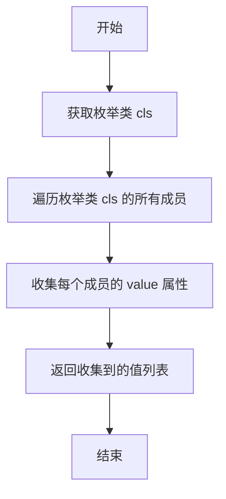

#### 带注释源码

```python
    @classmethod
    def values(cls):
        # 返回一个列表，包含枚举类 cls 中所有成员的 value 属性
        return [item.value for item in cls]
```

### `RoleContext.important_memory`

该方法用于检索与角色关注的行动（`watch`）相关的信息。它通过调用 `self.memory.get_by_actions(self.watch)` 来获取与这些行动相关的消息列表。

参数：

- 无显式参数，但依赖于 `self.watch` 属性。

返回值：`list[Message]`，返回与角色关注的行动相关的消息列表。

#### 流程图

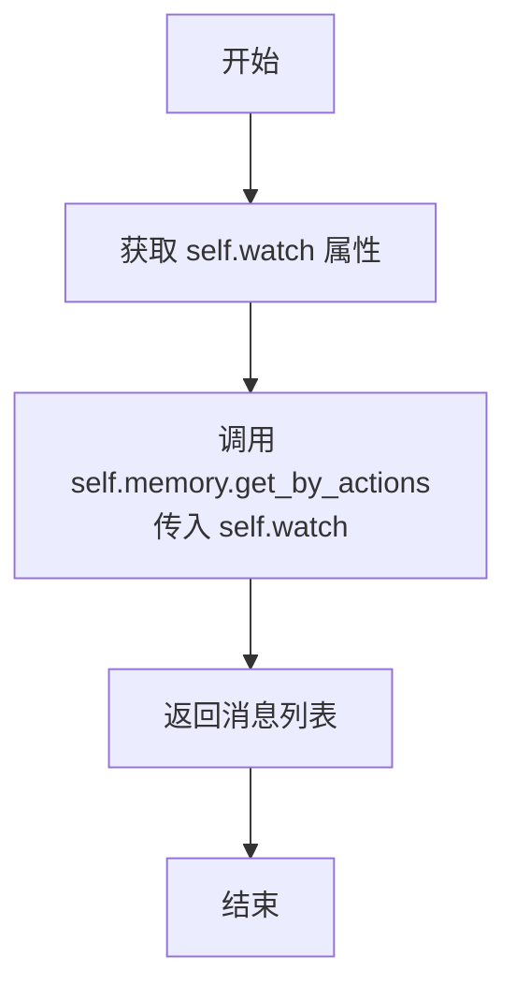

#### 带注释源码

```python
@property
def important_memory(self) -> list[Message]:
    """Retrieve information corresponding to the attention action."""
    # 调用 memory 的 get_by_actions 方法，传入 watch 集合
    # 返回与这些行动相关的消息列表
    return self.memory.get_by_actions(self.watch)
```

### `RoleContext.history`

`RoleContext.history` 是一个属性（property），用于获取角色上下文（RoleContext）中存储的历史消息列表。它通过调用 `self.memory.get()` 方法，返回内存中存储的所有消息，这些消息记录了角色在运行过程中的交互历史。

参数：无

返回值：`list[Message]`，返回一个包含所有历史消息的列表。

#### 流程图

```mermaid
flowchart TD
    A[开始] --> B[调用 self.memory.get()]
    B --> C[返回历史消息列表]
    C --> D[结束]
```

#### 带注释源码

```python
@property
def history(self) -> list[Message]:
    """Retrieve the history of messages stored in memory."""
    return self.memory.get()  # 调用 memory 的 get 方法获取所有历史消息
```

### `Role.validate_role_extra`

该方法是一个模型验证器，在`Role`类实例化后自动调用，用于处理和验证角色的额外配置参数，确保角色对象的初始状态和行为符合预期。

参数：

- `self`：`Role`，当前`Role`类的实例，包含角色的所有属性和配置。

返回值：`Role`，返回经过验证和处理后的`Role`实例本身。

#### 流程图

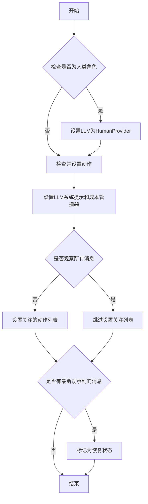

#### 带注释源码

```python
@model_validator(mode="after")
def validate_role_extra(self):
    # 调用内部方法处理角色的额外配置
    self._process_role_extra()
    # 返回处理后的角色实例
    return self

def _process_role_extra(self):
    # 获取模型额外的配置参数，如果没有则使用空字典
    kwargs = self.model_extra or {}

    # 如果角色标记为人类，则设置LLM为HumanProvider
    if self.is_human:
        self.llm = HumanProvider(None)

    # 检查并设置角色的动作列表
    self._check_actions()
    # 设置LLM的系统提示为角色前缀
    self.llm.system_prompt = self._get_prefix()
    # 设置LLM的成本管理器为上下文中的成本管理器
    self.llm.cost_manager = self.context.cost_manager
    # 如果不观察所有消息，则设置关注的动作列表，默认为UserRequirement
    if not self.observe_all_msg_from_buffer:
        self._watch(kwargs.pop("watch", [UserRequirement]))

    # 如果有最新观察到的消息，标记角色为恢复状态
    if self.latest_observed_msg:
        self.recovered = True
```

### `Role._process_role_extra`

该方法在Role对象初始化后自动调用，用于处理Role的额外配置和初始化逻辑。它根据Role的属性（如是否为人类、是否观察所有消息等）来设置相应的行为，并初始化相关的组件。

参数：

- `self`：`Role`，当前Role实例，用于访问和修改Role的属性。

返回值：`None`，该方法不返回任何值，仅用于初始化Role的内部状态。

#### 流程图

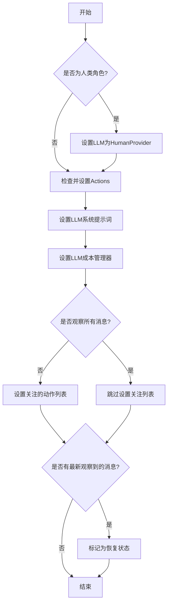

#### 带注释源码

```python
def _process_role_extra(self):
    # 获取Role的额外配置参数
    kwargs = self.model_extra or {}

    # 如果Role被标记为人类，则使用HumanProvider作为LLM
    if self.is_human:
        self.llm = HumanProvider(None)

    # 检查并初始化Actions
    self._check_actions()
    # 设置LLM的系统提示词
    self.llm.system_prompt = self._get_prefix()
    # 设置LLM的成本管理器
    self.llm.cost_manager = self.context.cost_manager
    # 如果不观察所有消息，则设置关注的动作列表
    if not self.observe_all_msg_from_buffer:
        self._watch(kwargs.pop("watch", [UserRequirement]))

    # 如果存在最新观察到的消息，则标记Role为恢复状态
    if self.latest_observed_msg:
        self.recovered = True
```

### `Role.todo`

这是一个属性（property），用于获取当前角色（Role）需要执行的动作（Action）。它返回存储在角色上下文（RoleContext）中的 `todo` 字段，该字段表示角色下一步要执行的动作。

参数：无

返回值：`Action`，表示当前角色需要执行的动作。

#### 流程图

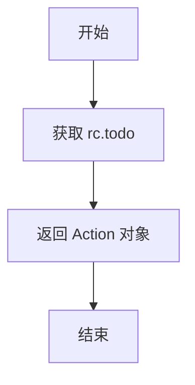

#### 带注释源码

```python
@property
def todo(self) -> Action:
    """Get action to do"""
    return self.rc.todo  # 返回角色上下文中存储的待执行动作
```

### `Role.set_todo`

设置角色待执行的动作，并更新该动作的上下文。

参数：
- `value`：`Optional[Action]`，要设置的动作实例。如果为 `None`，则清除当前待执行动作。

返回值：`None`，此方法不返回任何值。

#### 流程图

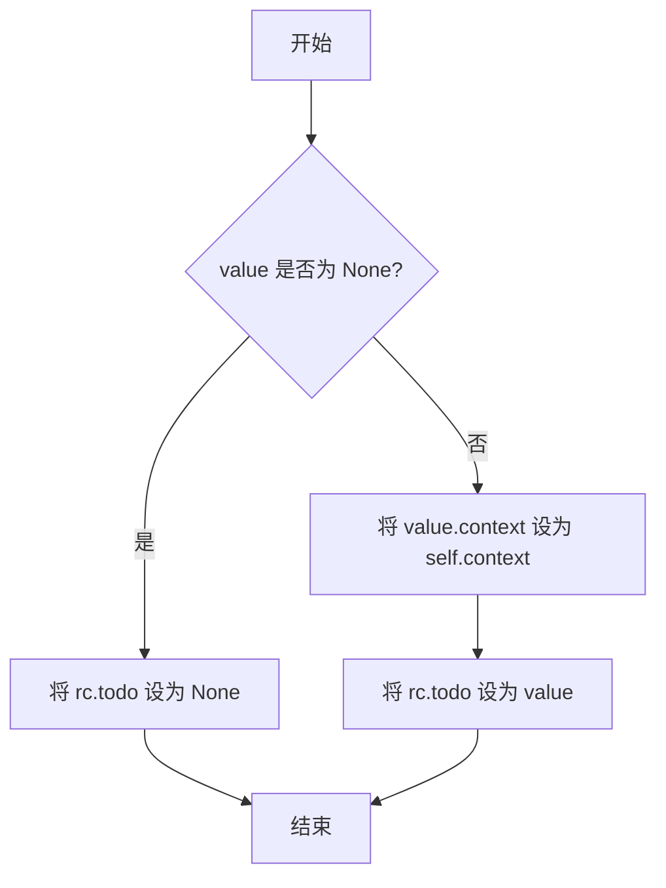

#### 带注释源码

```python
def set_todo(self, value: Optional[Action]):
    """Set action to do and update context"""
    # 如果传入的 value 是一个有效的 Action 对象
    if value:
        # 将该 Action 的上下文（context）设置为当前 Role 的上下文
        value.context = self.context
    # 将 Role 的运行时上下文（rc）中的待办事项（todo）设置为传入的 value
    # 如果 value 为 None，则清除待办事项
    self.rc.todo = value
```

### `Role.prompt_schema`

`Role.prompt_schema` 是一个属性（property），用于获取当前角色（Role）实例配置中定义的提示词（prompt）的格式规范。它不执行任何计算或逻辑，仅作为访问器返回配置对象中的 `prompt_schema` 字段值。该属性通常用于确定生成或处理提示词时应遵循的结构（例如 JSON 或 Markdown）。

参数：
- 无显式参数。作为属性，其值通过 `self.config.prompt_schema` 获取。

返回值：`str`，返回配置中定义的提示词格式规范字符串。

#### 流程图

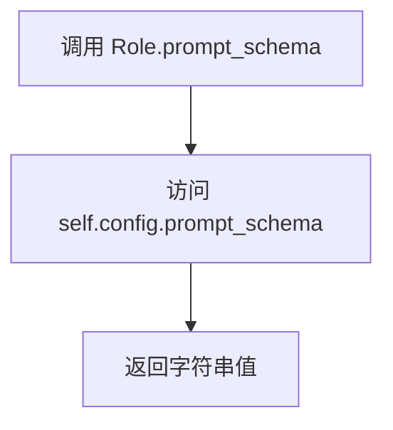

#### 带注释源码

```python
    @property
    def prompt_schema(self):
        """Prompt schema: json/markdown"""
        # 直接返回配置对象中的 `prompt_schema` 字段值。
        # 该字段定义了提示词应遵循的格式，例如 'json' 或 'markdown'。
        return self.config.prompt_schema
```

### `Role.project_name`

这是一个属性（property），用于获取和设置角色所属项目的名称。它实际上是对 `self.config.project_name` 的封装，提供了对项目名称的统一访问和修改接口。

参数：
- 无显式参数。作为属性，其 `getter` 和 `setter` 方法通过 `self` 访问实例内部状态。

返回值：
- `getter` 返回值类型：`str`，返回当前配置中存储的项目名称。
- `setter` 返回值类型：`None`，用于设置项目名称。

#### 流程图

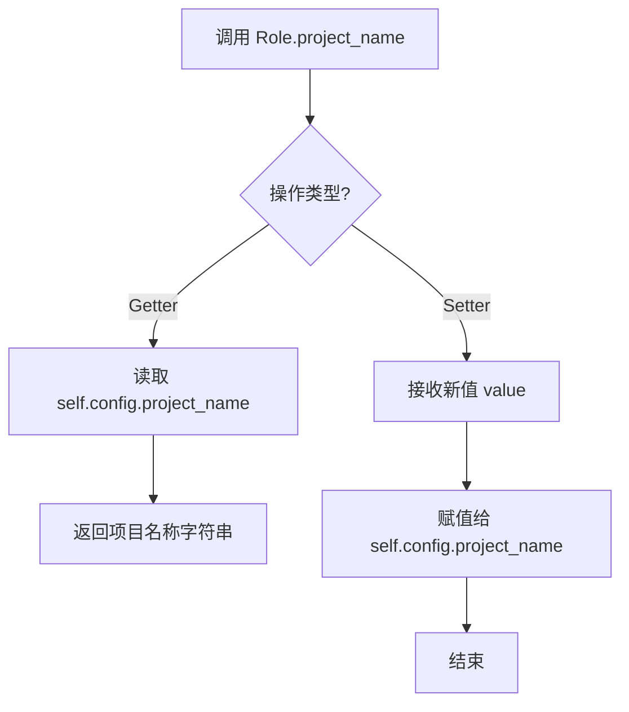

#### 带注释源码

```python
    @property
    def project_name(self):
        """项目名称的 getter 方法。
        返回当前角色配置中存储的项目名称。
        """
        return self.config.project_name

    @project_name.setter
    def project_name(self, value):
        """项目名称的 setter 方法。
        将传入的值设置给角色配置中的项目名称字段。
        Args:
            value (str): 要设置的新项目名称。
        """
        self.config.project_name = value
```

### `Role.project_name.setter`

这是一个属性设置器（setter）方法，用于设置 `Role` 实例的 `project_name` 属性。它实际上将传入的值赋值给 `Role` 实例内部 `config` 对象的 `project_name` 属性。

参数：
- `self`：`Role` 类型，表示 `Role` 类的当前实例。
- `value`：`Any` 类型，表示要设置的新项目名称。

返回值：`None` 类型，此方法不返回任何值，仅执行赋值操作。

#### 流程图

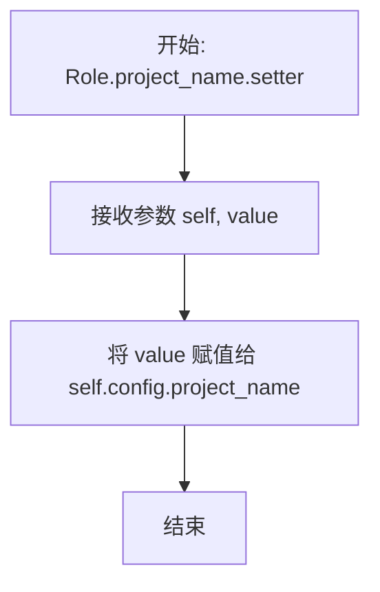

#### 带注释源码

```python
    @project_name.setter
    def project_name(self, value):
        # 将传入的 value 赋值给当前 Role 实例的 config 对象的 project_name 属性
        self.config.project_name = value
```

### `Role.project_path`

这是一个只读属性，用于获取当前角色所属项目的根目录路径。它从角色的配置对象中读取 `project_path` 属性。

参数：无

返回值：`str`，表示项目根目录的路径字符串。

#### 流程图

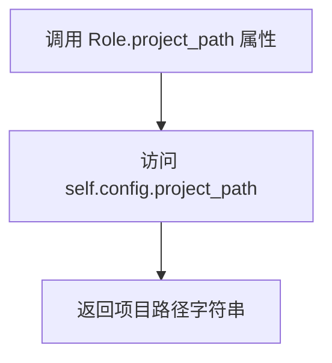

#### 带注释源码

```python
@property
def project_path(self):
    # 从角色的配置对象中获取并返回项目根目录路径
    return self.config.project_path
```

### `Role.check_addresses`

该方法是一个模型验证器，在`Role`对象初始化后自动调用。它的主要功能是确保`Role`对象的`addresses`字段（一个字符串集合）不为空。如果为空，它会根据`Role`对象的字符串表示和`name`属性来初始化`addresses`。

参数：

-  `self`：`Role`类型，表示当前`Role`对象实例。

返回值：`Role`类型，返回经过验证和可能修改后的`Role`对象实例本身。

#### 流程图

```mermaid
flowchart TD
    A[开始] --> B{self.addresses 是否为空?}
    B -- 是 --> C[使用 any_to_str(self) 和 self.name 初始化 addresses]
    C --> D[返回 self]
    B -- 否 --> D
```

#### 带注释源码

```python
    @model_validator(mode="after")
    def check_addresses(self):
        # 检查当前Role实例的addresses集合是否为空
        if not self.addresses:
            # 如果为空，则使用该对象的字符串表示和其名称来初始化addresses集合
            # any_to_str(self) 获取对象的唯一字符串标识，self.name 是角色名称
            self.addresses = {any_to_str(self), self.name} if self.name else {any_to_str(self)}
        # 返回当前对象实例，这是Pydantic模型验证器的要求
        return self
```

### `Role._reset`

该方法用于重置角色的状态，清空其状态列表和动作列表，通常在设置新动作时调用。

参数：
- 无参数

返回值：`None`，无返回值

#### 流程图

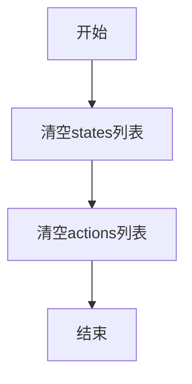

#### 带注释源码

```python
def _reset(self):
    """重置角色的状态，清空状态列表和动作列表。"""
    self.states = []  # 清空状态列表
    self.actions = []  # 清空动作列表
```

### `Role._setting`

这是一个只读属性，用于获取角色的格式化描述字符串。它返回一个结合了角色名称和角色配置的字符串，格式为 `{name}({profile})`。

参数：
- 无参数。

返回值：`str`，返回一个格式为 `"{self.name}({self.profile})"` 的字符串，用于标识和描述角色。

#### 流程图

```mermaid
flowchart TD
    A[开始] --> B[获取 self.name 和 self.profile]
    B --> C[格式化字符串<br>f"{self.name}({self.profile})"]
    C --> D[返回格式化后的字符串]
    D --> E[结束]
```

#### 带注释源码

```python
    @property
    def _setting(self):
        # 这是一个属性装饰器，将方法转换为只读属性。
        # 当访问 `role._setting` 时，会调用此方法。
        # 返回一个格式化的字符串，包含角色的名称和配置信息。
        return f"{self.name}({self.profile})"
```

### `Role._check_actions`

该方法用于检查和初始化角色（Role）所关联的动作（Action）列表。它会遍历所有动作，确保每个动作都正确设置了上下文（Context）、语言模型（LLM）和前缀（Prefix）。如果动作尚未实例化，则会进行实例化。该方法通常在角色初始化或动作列表更新时调用，以确保所有动作都处于可执行状态。

参数：

- `self`：`Role`，当前角色实例，用于访问和操作角色的属性和方法。

返回值：`Role`，返回当前角色实例，支持链式调用。

#### 流程图

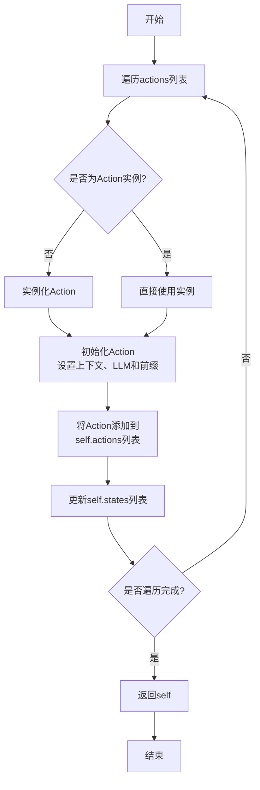

#### 带注释源码

```python
def _check_actions(self):
    """Check actions and set llm and prefix for each action."""
    # 调用set_actions方法，传入当前actions列表，进行统一处理
    self.set_actions(self.actions)
    # 返回当前角色实例，支持链式调用
    return self
```

### `Role._init_action`

该方法用于初始化一个Action对象，将其与当前Role的上下文、LLM和前缀进行关联，确保Action在执行时能够正确访问Role的配置和环境信息。

参数：

- `action`：`Action`，需要初始化的Action对象

返回值：`None`，无返回值

#### 流程图

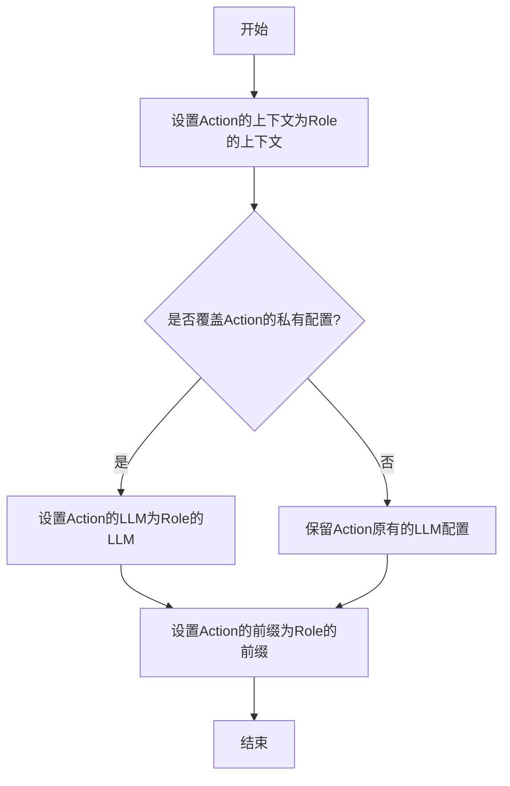

#### 带注释源码

```python
def _init_action(self, action: Action):
    # 将当前Role的上下文设置给Action，确保Action能够访问Role的环境和配置
    action.set_context(self.context)
    
    # 判断是否需要覆盖Action的私有LLM配置
    # 如果Action没有私有配置（private_config为False），则覆盖其LLM为Role的LLM
    override = not action.private_config
    action.set_llm(self.llm, override=override)
    
    # 设置Action的前缀为Role的前缀，确保Action的提示词模板与Role保持一致
    action.set_prefix(self._get_prefix())
```

### `Role.set_action`

该方法用于向角色添加一个动作。它会将传入的动作实例化（如果需要），初始化该动作的上下文、LLM和前缀，然后将其添加到角色的动作列表中，并更新状态列表。

参数：

- `action`：`Action`，要添加的动作实例或动作类

返回值：`None`，无返回值

#### 流程图

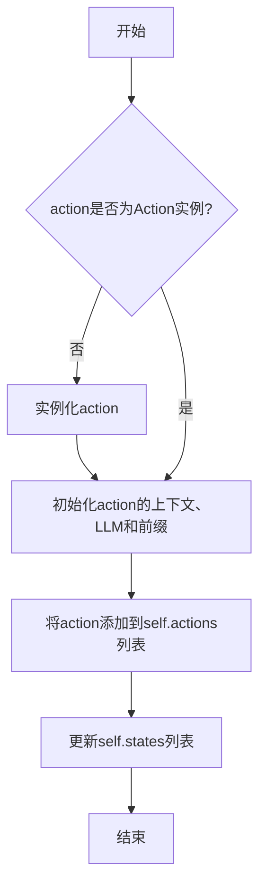

#### 带注释源码

```python
def set_action(self, action: Action):
    """Add action to the role."""
    self.set_actions([action])  # 调用set_actions方法，将单个动作包装成列表传入
```

### `Role.set_actions`

该方法用于为角色（Role）设置一系列动作（Action）。它会重置角色的状态和动作列表，然后初始化并添加传入的动作列表。每个动作都会被初始化（设置上下文、LLM和前缀），并添加到角色的动作列表中，同时更新状态列表以反映这些动作。

参数：

- `actions`：`list[Union[Action, Type[Action]]]`，要设置的动作列表，可以是动作实例或动作类。

返回值：`None`，无返回值。

#### 流程图

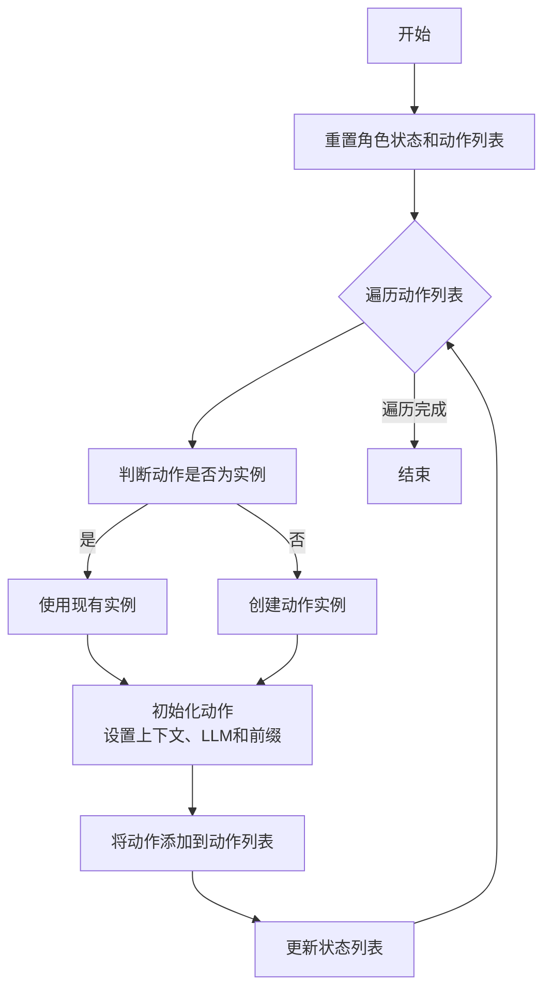

#### 带注释源码

```python
def set_actions(self, actions: list[Union[Action, Type[Action]]]):
    """Add actions to the role.

    Args:
        actions: list of Action classes or instances
    """
    # 重置角色的状态和动作列表
    self._reset()
    # 遍历传入的动作列表
    for action in actions:
        # 如果动作不是Action的实例（即传入的是动作类），则创建实例
        if not isinstance(action, Action):
            i = action(context=self.context)
        else:
            # 如果动作已经是实例，检查是否为人类角色且LLM不是HumanProvider
            if self.is_human and not isinstance(action.llm, HumanProvider):
                logger.warning(
                    f"is_human attribute does not take effect, "
                    f"as Role's {str(action)} was initialized using LLM, "
                    f"try passing in Action classes instead of initialized instances"
                )
            i = action
        # 初始化动作（设置上下文、LLM和前缀）
        self._init_action(i)
        # 将动作添加到角色的动作列表中
        self.actions.append(i)
        # 更新状态列表，添加动作的索引和名称
        self.states.append(f"{len(self.actions) - 1}. {action}")
```

### `Role._set_react_mode`

该方法用于设置角色对观察到的消息做出反应时的策略模式。它定义了角色在 `_think` 阶段如何选择要执行的动作，特别是当角色能够执行多个动作时。该方法支持三种反应模式：`"react"`（标准的 ReAct 循环）、`"by_order"`（按顺序切换动作）和 `"plan_and_act"`（先计划后执行动作序列）。根据选择的模式，该方法会配置相应的最大反应循环次数或初始化计划器。

参数：

- `react_mode`：`str`，反应模式，必须是 `RoleReactMode` 枚举值之一（`"react"`、`"by_order"`、`"plan_and_act"`）。
- `max_react_loop`：`int`，最大反应循环次数，仅在 `react_mode` 为 `"react"` 时有效，用于防止角色无限循环反应。默认值为 `1`。
- `auto_run`：`bool`，是否自动运行计划器，仅在 `react_mode` 为 `"plan_and_act"` 时有效。默认值为 `True`。

返回值：`None`，该方法不返回任何值，仅修改角色的内部状态。

#### 流程图

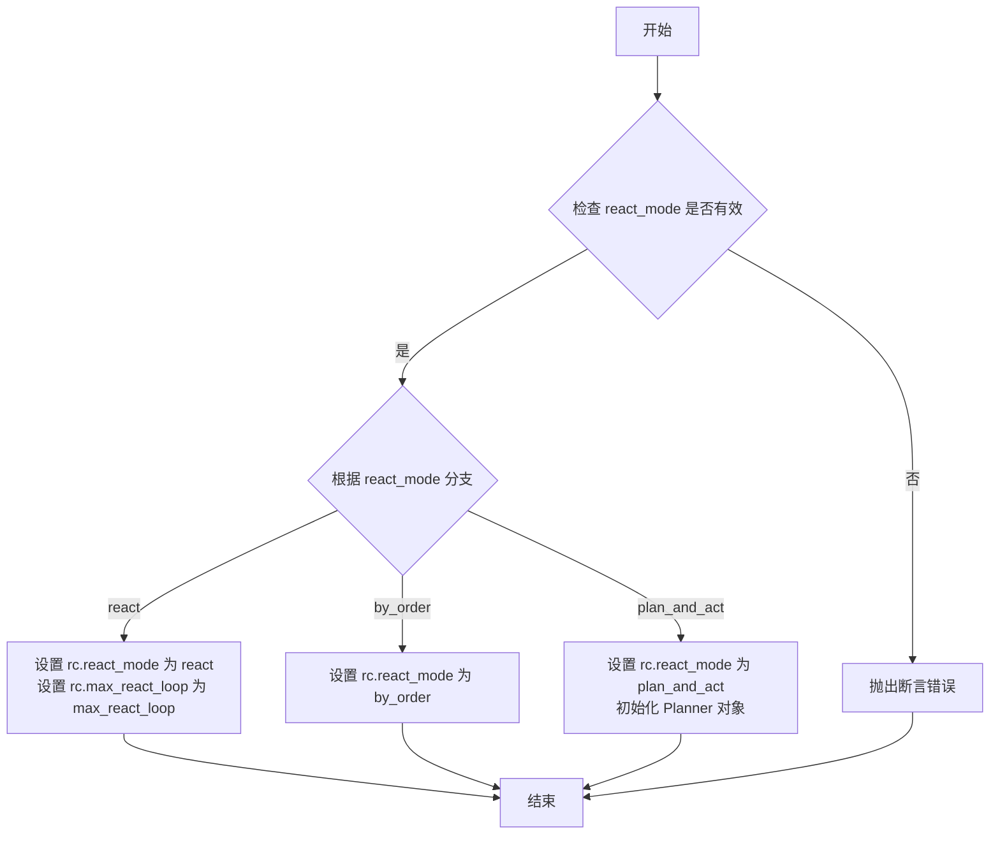

#### 带注释源码

```python
def _set_react_mode(self, react_mode: str, max_react_loop: int = 1, auto_run: bool = True):
    """Set strategy of the Role reacting to observed Message. Variation lies in how
    this Role elects action to perform during the _think stage, especially if it is capable of multiple Actions.

    Args:
        react_mode (str): Mode for choosing action during the _think stage, can be one of:
                    "react": standard think-act loop in the ReAct paper, alternating thinking and acting to solve the task, i.e. _think -> _act -> _think -> _act -> ...
                             Use llm to select actions in _think dynamically;
                    "by_order": switch action each time by order defined in _init_actions, i.e. _act (Action1) -> _act (Action2) -> ...;
                    "plan_and_act": first plan, then execute an action sequence, i.e. _think (of a plan) -> _act -> _act -> ...
                                    Use llm to come up with the plan dynamically.
                    Defaults to "react".
        max_react_loop (int): Maximum react cycles to execute, used to prevent the agent from reacting forever.
                              Take effect only when react_mode is react, in which we use llm to choose actions, including termination.
                              Defaults to 1, i.e. _think -> _act (-> return result and end)
    """
    # 1. 参数验证：确保传入的 react_mode 是预定义的合法值之一。
    assert react_mode in RoleReactMode.values(), f"react_mode must be one of {RoleReactMode.values()}"
    # 2. 设置反应模式：将用户指定的模式存储到角色的运行时上下文（rc）中。
    self.rc.react_mode = react_mode
    # 3. 模式特定配置：
    #    - 如果模式是 "react"，则设置最大反应循环次数，防止无限循环。
    if react_mode == RoleReactMode.REACT:
        self.rc.max_react_loop = max_react_loop
    #    - 如果模式是 "plan_and_act"，则初始化一个计划器（Planner）对象。
    #      计划器将用于生成和执行动作序列，auto_run 参数控制计划器是否自动运行。
    elif react_mode == RoleReactMode.PLAN_AND_ACT:
        self.planner = Planner(goal=self.goal, working_memory=self.rc.working_memory, auto_run=auto_run)
    # 注意：对于 "by_order" 模式，除了设置 react_mode 外，无需其他特殊配置。
```

### `Role._watch`

该方法用于设置角色关注的动作类型。角色会在其个人消息缓冲区中筛选出由这些关注的动作触发的消息，以便在 `_observe` 阶段进行处理。

参数：

- `actions`：`Iterable[Type[Action]] | Iterable[Action]`，一个可迭代对象，包含角色需要关注的 `Action` 类或实例。

返回值：`None`，该方法没有返回值。

#### 流程图

```mermaid
flowchart TD
    A[开始] --> B[接收参数 actions]
    B --> C{actions 是否为空?}
    C -- 是 --> D[结束]
    C -- 否 --> E[遍历 actions]
    E --> F[将每个 action 转换为字符串标识]
    F --> G[将标识添加到 rc.watch 集合中]
    G --> H[结束]
```

#### 带注释源码

```python
def _watch(self, actions: Iterable[Type[Action]] | Iterable[Action]):
    """Watch Actions of interest. Role will select Messages caused by these Actions from its personal message
    buffer during _observe.
    """
    # 将传入的 actions 参数中的每个元素转换为字符串标识，并存储到 rc.watch 集合中。
    # any_to_str 函数用于将 Action 类或实例转换为唯一的字符串表示。
    self.rc.watch = {any_to_str(t) for t in actions}
```

### `Role.is_watch`

该方法用于检查给定的 `caused_by` 字符串是否在角色的关注集合（`self.rc.watch`）中。它通常用于在 `_observe` 方法中过滤消息，判断角色是否应该对特定类型的消息做出反应。

参数：
- `caused_by`：`str`，表示消息的起因，通常是一个动作（Action）的字符串标识。

返回值：`bool`，如果 `caused_by` 在角色的关注集合中则返回 `True`，否则返回 `False`。

#### 流程图

```mermaid
graph TD
    A[开始] --> B{检查 caused_by 是否在 self.rc.watch 中}
    B -->|是| C[返回 True]
    B -->|否| D[返回 False]
    C --> E[结束]
    D --> E
```

#### 带注释源码

```python
def is_watch(self, caused_by: str):
    # 检查传入的 caused_by 字符串是否在角色的关注集合（self.rc.watch）中
    # self.rc.watch 是一个字符串集合，包含了角色关注的动作类型
    return caused_by in self.rc.watch
```

### `Role.set_addresses`

该方法用于设置角色（Role）接收消息的地址标签。角色通过订阅这些地址标签，可以从环境中接收带有相应标签的消息，这些消息会被放入角色的私有消息缓冲区（`msg_buffer`）中，供后续的 `_observe` 方法处理。默认情况下，角色会订阅自己的名称（`name`）和字符串表示（`any_to_str(self)`）作为地址标签。

参数：

- `addresses`：`Set[str]`，一个字符串集合，表示角色希望接收的消息的地址标签。

返回值：`None`，该方法没有返回值。

#### 流程图

```mermaid
flowchart TD
    A[开始] --> B[接收参数 addresses]
    B --> C[将 addresses 赋值给 self.addresses]
    C --> D{检查 self.rc.env 是否存在?}
    D -- 是 --> E[调用 self.rc.env.set_addresses(self, self.addresses)]
    E --> F[结束]
    D -- 否 --> F
```

#### 带注释源码

```python
def set_addresses(self, addresses: Set[str]):
    """Used to receive Messages with certain tags from the environment. Message will be put into personal message
    buffer to be further processed in _observe. By default, a Role subscribes Messages with a tag of its own name
    or profile.
    """
    # 将传入的地址标签集合赋值给实例变量 self.addresses
    self.addresses = addresses
    # 检查角色是否已关联到一个环境（Environment）对象
    if self.rc.env:  # According to the routing feature plan in Chapter 2.2.3.2 of RFC 113
        # 如果环境存在，则调用环境的 set_addresses 方法，
        # 将当前角色和其地址标签注册到环境中，以便环境进行消息路由
        self.rc.env.set_addresses(self, self.addresses)
```

### `Role._set_state`

该方法用于更新角色的当前状态，并根据状态设置待执行的动作（todo）。如果状态值有效（大于等于0），则从动作列表中选取对应的动作作为待执行动作；如果状态值为-1，则表示初始或终止状态，待执行动作为None。

参数：

- `state`：`int`，表示要设置的新状态值。有效范围为-1到动作列表长度减1，其中-1表示初始或终止状态。

返回值：`None`，无返回值。

#### 流程图

```mermaid
flowchart TD
    A[开始] --> B[设置rc.state = state]
    B --> C{state >= 0?}
    C -- 是 --> D[设置todo为actions[state]]
    C -- 否 --> E[设置todo为None]
    D --> F[记录调试日志]
    E --> F
    F --> G[结束]
```

#### 带注释源码

```python
def _set_state(self, state: int):
    """Update the current state."""
    self.rc.state = state  # 更新角色上下文中的状态值
    logger.debug(f"actions={self.actions}, state={state}")  # 记录调试信息，显示当前动作列表和状态
    # 根据状态值设置待执行动作：如果状态有效则选择对应动作，否则设为None
    self.set_todo(self.actions[self.rc.state] if state >= 0 else None)
```

### `Role.set_env`

该方法用于设置角色工作的环境。角色可以在环境中进行通信，并通过观察接收消息。设置环境后，会更新角色的系统提示和成本管理器，并重置角色的动作列表以更新LLM和前缀。

参数：

- `env`：`BaseEnvironment`，角色将要工作的环境实例。

返回值：`None`，该方法不返回任何值。

#### 流程图

```mermaid
flowchart TD
    A[开始] --> B[设置角色环境 rc.env = env]
    B --> C{env 是否不为空?}
    C -->|是| D[设置环境地址 env.set_addresses<br>更新系统提示和成本管理器<br>重置动作列表]
    C -->|否| E[结束]
    D --> E
```

#### 带注释源码

```python
def set_env(self, env: BaseEnvironment):
    """Set the environment in which the role works. The role can talk to the environment and can also receive
    messages by observing."""
    self.rc.env = env  # 将传入的环境实例赋值给角色的运行时上下文
    if env:  # 如果环境实例不为空
        env.set_addresses(self, self.addresses)  # 在环境中设置角色的地址，用于消息路由
        self.llm.system_prompt = self._get_prefix()  # 更新LLM的系统提示，以反映新的环境信息
        self.llm.cost_manager = self.context.cost_manager  # 更新成本管理器
        self.set_actions(self.actions)  # 重置动作列表，以更新每个动作的LLM和前缀
```

### `Role.name`

这是一个属性（property），用于获取角色的名称。它返回`self._setting.name`，其中`self._setting`是一个格式化字符串，包含了角色的名称和简介。

参数：无

返回值：`str`，角色的名称

#### 流程图

```mermaid
flowchart TD
    A[开始] --> B[获取 self._setting.name]
    B --> C[返回角色名称]
    C --> D[结束]
```

#### 带注释源码

```python
@property
def name(self):
    """Get the role name"""
    return self._setting.name
```

### `Role._get_prefix`

该方法用于生成角色的系统提示前缀。它根据角色的属性（如描述、目标、约束等）以及环境信息，构建一个用于指导角色行为的文本前缀。

参数：

- `self`：`Role`，当前角色实例

返回值：`str`，生成的角色系统提示前缀

#### 流程图

```mermaid
flowchart TD
    A[开始] --> B{self.desc 是否非空?}
    B -- 是 --> C[返回 self.desc]
    B -- 否 --> D[使用 PREFIX_TEMPLATE 格式化<br>profile, name, goal]
    D --> E{self.constraints 是否非空?}
    E -- 是 --> F[添加 CONSTRAINT_TEMPLATE 格式化 constraints]
    E -- 否 --> G{self.rc.env 是否存在且<br>self.rc.env.desc 非空?}
    F --> G
    G -- 是 --> H[获取环境中其他角色名<br>并添加环境描述到前缀]
    G -- 否 --> I[返回构建好的前缀]
    H --> I
    C --> I
```

#### 带注释源码

```python
def _get_prefix(self):
    """Get the role prefix"""
    if self.desc:
        # 如果角色有自定义描述，直接返回该描述作为前缀
        return self.desc

    # 使用模板格式化角色的基本信息：身份、名称、目标
    prefix = PREFIX_TEMPLATE.format(**{"profile": self.profile, "name": self.name, "goal": self.goal})

    if self.constraints:
        # 如果角色有约束条件，将其添加到前缀中
        prefix += CONSTRAINT_TEMPLATE.format(**{"constraints": self.constraints})

    if self.rc.env and self.rc.env.desc:
        # 如果角色处于某个环境中，并且环境有描述，则添加环境信息
        # 获取环境中所有角色的名称
        all_roles = self.rc.env.role_names()
        # 过滤掉当前角色自己，得到其他角色的名称
        other_role_names = ", ".join([r for r in all_roles if r != self.name])
        # 构建环境描述字符串
        env_desc = f"You are in {self.rc.env.desc} with roles({other_role_names})."
        # 将环境描述添加到前缀中
        prefix += env_desc
    # 返回最终构建好的前缀字符串
    return prefix
```

### `Role._think`

该方法用于让角色思考下一步要执行的动作。它会根据当前状态、历史记录和可用的动作列表，决定下一个状态（即要执行的动作）。如果无法继续思考或没有动作可执行，则返回 `False`。

参数：

- `self`：`Role` 类型，表示当前角色实例。

返回值：`bool` 类型，返回 `True` 表示成功选择了下一个动作，返回 `False` 表示无法继续思考或没有动作可执行。

#### 流程图

```mermaid
flowchart TD
    A[开始] --> B{动作数量是否为1?}
    B -- 是 --> C[设置状态为0]
    C --> D[返回True]
    B -- 否 --> E{是否从恢复状态继续?}
    E -- 是 --> F[设置恢复状态]
    F --> G[返回True]
    E -- 否 --> H{反应模式是否为BY_ORDER?}
    H -- 是 --> I[按顺序设置下一个状态]
    I --> J{状态是否有效?}
    J -- 是 --> D
    J -- 否 --> K[返回False]
    H -- 否 --> L[生成提示词并调用LLM]
    L --> M[解析LLM返回的状态]
    M --> N{状态是否有效?}
    N -- 是 --> O[设置状态]
    O --> D
    N -- 否 --> P[设置状态为-1]
    P --> Q[返回True]
```

#### 带注释源码

```python
async def _think(self) -> bool:
    """考虑下一步要做什么，并决定下一个动作。如果无法继续，则返回 False。"""
    # 如果只有一个动作，则只能执行这个动作
    if len(self.actions) == 1:
        self._set_state(0)
        return True

    # 如果是从恢复状态继续，则直接设置恢复的状态
    if self.recovered and self.rc.state >= 0:
        self._set_state(self.rc.state)  # 从恢复状态继续执行动作
        self.recovered = False  # 避免 max_react_loop 失效
        return True

    # 如果反应模式是按顺序执行，则按顺序设置下一个状态
    if self.rc.react_mode == RoleReactMode.BY_ORDER:
        if self.rc.max_react_loop != len(self.actions):
            self.rc.max_react_loop = len(self.actions)
        self._set_state(self.rc.state + 1)
        return self.rc.state >= 0 and self.rc.state < len(self.actions)

    # 生成提示词，用于让 LLM 选择下一个状态
    prompt = self._get_prefix()
    prompt += STATE_TEMPLATE.format(
        history=self.rc.history,
        states="\n".join(self.states),
        n_states=len(self.states) - 1,
        previous_state=self.rc.state,
    )

    # 调用 LLM 获取下一个状态
    next_state = await self.llm.aask(prompt)
    next_state = extract_state_value_from_output(next_state)
    logger.debug(f"{prompt=}")

    # 验证 LLM 返回的状态是否有效
    if (not next_state.isdigit() and next_state != "-1") or int(next_state) not in range(-1, len(self.states)):
        logger.warning(f"无效的状态返回值: {next_state=}，将设置为 -1")
        next_state = -1
    else:
        next_state = int(next_state)
        if next_state == -1:
            logger.info(f"结束动作，{next_state=}")

    # 设置下一个状态
    self._set_state(next_state)
    return True
```

### `Role._act`

该方法执行角色当前待办的动作（`self.rc.todo`），运行该动作并处理其返回结果，最终将结果封装为消息对象存入角色记忆并返回。

参数：
-  `self`：`Role`，当前角色实例

返回值：`Message`，封装了动作执行结果的消息对象

#### 流程图

```mermaid
flowchart TD
    A[开始] --> B[记录日志：角色将执行的动作]
    B --> C[异步运行动作：await self.rc.todo.run]
    C --> D{判断返回结果类型}
    D -- ActionOutput/ActionNode --> E[封装为AIMessage]
    D -- Message --> F[直接使用返回的Message]
    D -- 其他类型 --> G[封装为AIMessage<br>（内容为response或空字符串）]
    E --> H[将消息添加到角色记忆]
    F --> H
    G --> H
    H --> I[返回消息对象]
    I --> J[结束]
```

#### 带注释源码

```python
async def _act(self) -> Message:
    # 记录日志，显示角色名称和即将执行的动作
    logger.info(f"{self._setting}: to do {self.rc.todo}({self.rc.todo.name})")
    
    # 异步执行当前待办动作，传入历史消息作为上下文
    response = await self.rc.todo.run(self.rc.history)
    
    # 根据动作返回结果的类型，封装成适当的Message对象
    if isinstance(response, (ActionOutput, ActionNode)):
        # 如果返回的是ActionOutput或ActionNode，封装为AIMessage
        msg = AIMessage(
            content=response.content,
            instruct_content=response.instruct_content,
            cause_by=self.rc.todo,  # 消息由当前动作触发
            sent_from=self,  # 发送者为当前角色
        )
    elif isinstance(response, Message):
        # 如果返回的已经是Message对象，直接使用
        msg = response
    else:
        # 其他类型（如字符串），封装为AIMessage，内容为response或空字符串
        msg = AIMessage(content=response or "", cause_by=self.rc.todo, sent_from=self)
    
    # 将生成的消息添加到角色的记忆（memory）中
    self.rc.memory.add(msg)

    # 返回封装好的消息对象
    return msg
```

### `Role._observe`

该方法负责从角色的私有消息缓冲区中读取未处理的消息，并根据订阅规则过滤出感兴趣的消息，将其存储到角色的记忆中，同时记录最新观察到的消息。

参数：

-  `self`：`Role`，当前角色实例

返回值：`int`，返回本次观察到的新消息数量

#### 流程图

```mermaid
flowchart TD
    A[开始] --> B{是否处于恢复状态<br>且存在最新观察消息?}
    B -- 是 --> C[从记忆中查找<br>相对于最新消息的新消息]
    B -- 否 --> D[从消息缓冲区<br>弹出所有消息]
    C --> E[将查找到的消息<br>作为news]
    D --> E
    E --> F[获取旧消息列表]
    F --> G[过滤news<br>基于订阅规则]
    G --> H{是否观察所有消息?}
    H -- 是 --> I[将所有news<br>批量存入记忆]
    H -- 否 --> J[仅将过滤后的news<br>批量存入记忆]
    I --> K[记录最新观察消息]
    J --> K
    K --> L[记录日志]
    L --> M[返回新消息数量]
```

#### 带注释源码

```python
async def _observe(self) -> int:
    """Prepare new messages for processing from the message buffer and other sources."""
    # 1. 读取未处理的消息
    news = []
    # 如果处于恢复状态且有最新观察消息，则从记忆中查找相对于该消息的新消息
    if self.recovered and self.latest_observed_msg:
        news = self.rc.memory.find_news(observed=[self.latest_observed_msg], k=10)
    # 否则，从消息缓冲区中弹出所有消息
    if not news:
        news = self.rc.msg_buffer.pop_all()
    # 2. 获取已处理过的旧消息，用于去重
    old_messages = [] if not self.enable_memory else self.rc.memory.get()
    # 3. 过滤出感兴趣的新消息：消息的触发者（cause_by）在关注列表中，或者消息的接收者（send_to）包含本角色
    self.rc.news = [
        n for n in news if (n.cause_by in self.rc.watch or self.name in n.send_to) and n not in old_messages
    ]
    # 4. 根据配置决定将哪些消息存入记忆
    if self.observe_all_msg_from_buffer:
        # 保存缓冲区中的所有新消息到记忆，角色可能不对其做出反应但可以感知到它们
        self.rc.memory.add_batch(news)
    else:
        # 仅保存感兴趣的新消息到记忆
        self.rc.memory.add_batch(self.rc.news)
    # 5. 记录最新观察到的消息（如果有的话）
    self.latest_observed_msg = self.rc.news[-1] if self.rc.news else None  # record the latest observed msg

    # 设计规则说明：
    # 如果需要进一步分类Message对象，可以使用Message.set_meta函数。
    # msg_buffer是一个接收缓冲区，避免在其中添加消息数据和操作。
    # 6. 记录观察到的消息日志（仅显示前20个字符）
    news_text = [f"{i.role}: {i.content[:20]}..." for i in self.rc.news]
    if news_text:
        logger.debug(f"{self._setting} observed: {news_text}")
    # 7. 返回本次观察到的新消息数量
    return len(self.rc.news)
```

### `Role.publish_message`

该方法用于发布消息。如果角色属于某个环境（env），则角色的消息将被广播到该环境中。如果消息的接收者只包含角色自身，则直接将消息放入角色的私有消息缓冲区；否则，如果环境存在，则将消息发布到环境中。

参数：

- `msg`：`Message`，要发布的消息对象

返回值：`None`，无返回值

#### 流程图

```mermaid
graph TD
    A[开始] --> B{消息是否为空?}
    B -->|是| C[结束]
    B -->|否| D{消息发送目标是否包含 MESSAGE_ROUTE_TO_SELF?}
    D -->|是| E[将发送目标替换为角色自身]
    D -->|否| F{发送者是否为空或为 MESSAGE_ROUTE_TO_SELF?}
    F -->|是| G[设置发送者为角色自身]
    F -->|否| H{所有接收者是否都是角色自身?}
    H -->|是| I[将消息放入私有缓冲区]
    H -->|否| J{环境是否存在?}
    J -->|否| C
    J -->|是| K{消息是否为 AIMessage 且无代理?}
    K -->|是| L[为消息设置代理]
    K -->|否| M[通过环境发布消息]
    L --> M
    I --> C
    M --> C
```

#### 带注释源码

```python
def publish_message(self, msg):
    """如果角色属于某个环境，则角色的消息将被广播到该环境"""
    if not msg:  # 检查消息是否为空
        return  # 如果为空，直接返回

    # 处理消息发送目标中的特殊标记 MESSAGE_ROUTE_TO_SELF
    if MESSAGE_ROUTE_TO_SELF in msg.send_to:
        msg.send_to.add(any_to_str(self))  # 将发送目标替换为角色自身
        msg.send_to.remove(MESSAGE_ROUTE_TO_SELF)  # 移除特殊标记

    # 如果消息发送者为空或为特殊标记，则设置为角色自身
    if not msg.sent_from or msg.sent_from == MESSAGE_ROUTE_TO_SELF:
        msg.sent_from = any_to_str(self)

    # 如果所有接收者都是角色自身，则将消息放入私有缓冲区
    if all(to in {any_to_str(self), self.name} for to in msg.send_to):
        self.put_message(msg)  # 调用私有方法放入缓冲区
        return  # 直接返回，不发布到环境

    # 如果环境不存在，则不发布消息
    if not self.rc.env:
        return

    # 如果消息是 AIMessage 类型且未设置代理，则为其设置代理
    if isinstance(msg, AIMessage) and not msg.agent:
        msg.with_agent(self._setting)

    # 通过环境发布消息
    self.rc.env.publish_message(msg)
```

### `Role.put_message`

将消息放入角色对象的私有消息接收缓冲区中。

参数：

- `message`：`Message`，要放入缓冲区的消息对象

返回值：`None`，无返回值

#### 流程图

```mermaid
flowchart TD
    A[开始] --> B{message 是否为空?}
    B -- 是 --> C[直接返回]
    B -- 否 --> D[调用 rc.msg_buffer.push(message)]
    D --> E[结束]
```

#### 带注释源码

```python
def put_message(self, message):
    """Place the message into the Role object's private message buffer."""
    # 检查消息是否为空，如果为空则直接返回，不做任何操作
    if not message:
        return
    # 将非空的消息推入角色的私有消息缓冲区（rc.msg_buffer）
    self.rc.msg_buffer.push(message)
```

### `Role._react`

`Role._react` 方法是 `Role` 类的核心反应循环实现，遵循标准的 ReAct（Reasoning-Acting）模式。该方法在给定的最大反应循环次数内，循环执行“思考-行动”步骤。在每次循环中，首先调用 `_think` 方法决定下一步要执行的动作（或决定终止），然后调用 `_act` 方法执行该动作并生成响应。循环持续直到达到最大循环次数或 `_think` 指示没有更多待办事项。该方法最终返回最后一次 `_act` 执行产生的消息。

参数：
-  `self`：`Role` 类型，表示当前 `Role` 实例。

返回值：`Message` 类型，返回最后一次 `_act` 执行生成的 `AIMessage` 对象，其中包含动作执行的结果。

#### 流程图

```mermaid
graph TD
    A[开始 _react] --> B[初始化 actions_taken = 0, rsp = 占位消息]
    B --> C{actions_taken < max_react_loop?}
    C -- 是 --> D[调用 _think 决定下一步]
    D --> E{_think 返回 has_todo?}
    E -- 否 --> F[跳出循环]
    E -- 是 --> G[记录状态和待办动作]
    G --> H[调用 _act 执行动作]
    H --> I[更新 rsp 为 _act 返回的消息]
    I --> J[actions_taken += 1]
    J --> C
    C -- 否 --> K[返回最后一次的 rsp]
    F --> K
    K --> L[结束]
```

#### 带注释源码

```python
async def _react(self) -> Message:
    """Think first, then act, until the Role _think it is time to stop and requires no more todo.
    This is the standard think-act loop in the ReAct paper, which alternates thinking and acting in task solving, i.e. _think -> _act -> _think -> _act -> ...
    Use llm to select actions in _think dynamically
    """
    # 初始化动作执行计数器和响应消息。响应消息初始化为一个占位符。
    actions_taken = 0
    rsp = AIMessage(content="No actions taken yet", cause_by=Action)  # will be overwritten after Role _act

    # 在最大反应循环次数限制内进行循环
    while actions_taken < self.rc.max_react_loop:
        # 1. 思考阶段：决定下一步做什么
        has_todo = await self._think()
        # 如果 _think 返回 False，表示没有更多待办事项，则跳出循环
        if not has_todo:
            break

        # 2. 行动阶段：执行 _think 阶段决定的动作
        logger.debug(f"{self._setting}: {self.rc.state=}, will do {self.rc.todo}")
        rsp = await self._act()  # 执行动作，并将返回的消息更新为当前响应
        actions_taken += 1  # 增加已执行动作计数

    # 返回最后一次 _act 执行产生的消息
    return rsp
```

### `Role._plan_and_act`

该方法实现了角色的"计划与执行"反应模式。首先，它会检查是否存在一个已制定的计划；如果没有，它会基于最新的用户需求创建一个初始计划。然后，它会循环执行计划中的任务，直到所有任务完成。对于每个任务，它会调用 `_act_on_task` 方法来执行具体的操作，并处理执行结果（如审查、确认或更新计划）。最后，它将完成的计划作为响应返回，并添加到角色的持久化记忆中。

参数：

-  `self`：`Role`，当前角色实例

返回值：`Message`，返回一个表示已完成计划的消息对象

#### 流程图

```mermaid
flowchart TD
    A[开始] --> B{计划是否存在?}
    B -- 否 --> C[基于最新用户需求创建初始计划]
    C --> D
    B -- 是 --> D{当前任务存在?}
    D -- 是 --> E[执行当前任务]
    E --> F[处理任务结果]
    F --> D
    D -- 否 --> G[获取并返回完成的计划]
    G --> H[将计划添加到持久化记忆]
    H --> I[结束]
```

#### 带注释源码

```python
async def _plan_and_act(self) -> Message:
    """first plan, then execute an action sequence, i.e. _think (of a plan) -> _act -> _act -> ... Use llm to come up with the plan dynamically."""
    # 检查是否存在计划，如果没有，则基于最新的用户需求创建初始计划
    if not self.planner.plan.goal:
        # create initial plan and update it until confirmation
        goal = self.rc.memory.get()[-1].content  # retreive latest user requirement
        await self.planner.update_plan(goal=goal)

    # 循环执行计划中的任务，直到所有任务完成
    while self.planner.current_task:
        task = self.planner.current_task
        logger.info(f"ready to take on task {task}")

        # 执行当前任务
        task_result = await self._act_on_task(task)

        # 处理任务结果，如审查、确认或更新计划
        await self.planner.process_task_result(task_result)

    # 获取并返回完成的计划作为响应
    rsp = self.planner.get_useful_memories()[0]  # return the completed plan as a response
    rsp.role = "assistant"
    rsp.sent_from = self._setting

    # 将计划添加到角色的持久化记忆中
    self.rc.memory.add(rsp)  # add to persistent memory

    return rsp
```

### `Role._act_on_task`

该方法是一个抽象方法，用于处理计划中的具体任务。当角色处于`PLAN_AND_ACT`反应模式时，`_plan_and_act`方法会调用此方法来执行当前任务。具体的角色子类必须实现此方法，以定义如何执行任务并返回结果。

参数：
- `current_task`：`Task`，当前需要处理的任务对象。

返回值：`TaskResult`，任务执行的结果。

#### 流程图

```mermaid
flowchart TD
    A[开始] --> B{当前任务是否有效?}
    B -- 是 --> C[执行具体任务处理逻辑]
    C --> D[生成任务结果 TaskResult]
    D --> E[返回 TaskResult]
    B -- 否 --> F[抛出异常或返回错误结果]
    F --> E
```

#### 带注释源码

```python
async def _act_on_task(self, current_task: Task) -> TaskResult:
    """Taking specific action to handle one task in plan

    Args:
        current_task (Task): current task to take on

    Raises:
        NotImplementedError: Specific Role must implement this method if expected to use planner

    Returns:
        TaskResult: Result from the actions
    """
    raise NotImplementedError
```

### `Role.react`

该方法定义了角色（Role）对观察到的消息（Message）做出反应的核心逻辑。它根据角色上下文（RoleContext）中设置的`react_mode`选择不同的反应策略：标准ReAct循环（`REACT`）、按顺序执行（`BY_ORDER`）或先规划后执行（`PLAN_AND_ACT`）。该方法协调了角色的思考（`_think`）和行动（`_act`）过程，是角色自主决策和任务执行的关键入口点。

参数：
- `self`：`Role`，当前角色实例

返回值：`Message`，角色执行完反应策略后产生的最终消息，通常包含行动的结果或规划的输出。

#### 流程图

```mermaid
flowchart TD
    A[开始 react] --> B{判断 react_mode}
    B -- REACT 或 BY_ORDER --> C[调用 _react 方法]
    B -- PLAN_AND_ACT --> D[调用 _plan_and_act 方法]
    C --> E[执行标准 ReAct 循环]
    D --> F[执行规划与执行循环]
    E --> G[重置状态为 -1]
    F --> G
    G --> H{返回消息是 AIMessage?}
    H -- 是 --> I[设置消息的 agent 属性]
    H -- 否 --> J[直接返回消息]
    I --> J
    J --> K[结束 react]
```

#### 带注释源码

```python
async def react(self) -> Message:
    """Entry to one of three strategies by which Role reacts to the observed Message"""
    # 根据角色上下文中设置的 react_mode 选择不同的反应策略
    if self.rc.react_mode == RoleReactMode.REACT or self.rc.react_mode == RoleReactMode.BY_ORDER:
        # 策略1: 标准 ReAct 循环或按顺序执行
        rsp = await self._react()
    elif self.rc.react_mode == RoleReactMode.PLAN_AND_ACT:
        # 策略2: 先规划后执行
        rsp = await self._plan_and_act()
    else:
        # 如果遇到不支持的 react_mode，抛出异常
        raise ValueError(f"Unsupported react mode: {self.rc.react_mode}")
    # 当前反应周期结束，重置角色的状态为 -1，并将待办事项（todo）设为 None
    self._set_state(state=-1)
    # 如果返回的消息是 AIMessage 类型，为其设置 agent 属性，标识消息的发送者
    if isinstance(rsp, AIMessage):
        rsp.with_agent(self._setting)
    # 返回最终的消息
    return rsp
```

### `Role.get_memories`

该方法用于获取角色（Role）最近的内存记录。它是一个包装器，返回该角色最近k条内存消息。当k=0时，返回所有内存消息。

参数：

- `k`：`int`，可选参数，默认为0。指定要获取的内存消息数量。如果k=0，则返回所有内存消息。

返回值：`list[Message]`，返回一个消息列表，包含角色最近的内存记录。

#### 流程图

```mermaid
graph TD
    A[开始] --> B{检查k的值}
    B -- k=0 --> C[获取所有内存消息]
    B -- k>0 --> D[获取最近k条内存消息]
    C --> E[返回内存消息列表]
    D --> E
    E --> F[结束]
```

#### 带注释源码

```python
def get_memories(self, k=0) -> list[Message]:
    """A wrapper to return the most recent k memories of this role, return all when k=0"""
    return self.rc.memory.get(k=k)
```

### `Role.run`

`Role.run` 方法是 `Role` 类的主要执行入口。它遵循“观察-思考-行动”的循环模式：首先观察环境中的新消息，然后根据观察结果进行思考并决定下一步行动，最后执行行动并发布结果。该方法支持通过 `with_message` 参数注入测试消息，以驱动角色的初始行为。

参数：

- `with_message`：`Message | str | list[str] | None`，用于测试或初始化的消息。如果提供，该消息会被放入角色的私有消息缓冲区，以触发后续的观察和反应流程。在正常的工作流中，应使用 `publish_message` 或 `put_message` 来传递消息。

返回值：`Message | None`，返回角色在本次运行中产生的最终响应消息。如果没有新消息需要处理（即观察阶段未发现新消息），则返回 `None`。

#### 流程图

```mermaid
flowchart TD
    A[开始: Role.run(with_message)] --> B{with_message 参数是否提供?}
    B -->|是| C[将消息转换为 Message 对象并放入消息缓冲区]
    B -->|否| D[直接进入观察阶段]
    C --> D
    D --> E[调用 _observe 方法观察新消息]
    E --> F{是否有新消息?}
    F -->|否| G[记录日志并返回 None]
    F -->|是| H[调用 react 方法进行反应]
    H --> I[重置待办动作为 None]
    I --> J[发布响应消息到环境]
    J --> K[返回响应消息]
    G --> L[结束]
    K --> L
```

#### 带注释源码

```python
@role_raise_decorator
async def run(self, with_message=None) -> Message | None:
    """Observe, and think and act based on the results of the observation"""
    # 1. 处理传入的测试或初始化消息
    if with_message:
        msg = None
        if isinstance(with_message, str):
            msg = Message(content=with_message)
        elif isinstance(with_message, Message):
            msg = with_message
        elif isinstance(with_message, list):
            msg = Message(content="\n".join(with_message))
        # 如果没有指定消息的起因，默认为用户需求
        if not msg.cause_by:
            msg.cause_by = UserRequirement
        # 将消息放入角色的私有消息缓冲区
        self.put_message(msg)
    
    # 2. 观察阶段：从消息缓冲区获取新消息
    if not await self._observe():
        # 如果没有新信息，记录日志并返回 None
        logger.debug(f"{self._setting}: no news. waiting.")
        return

    # 3. 反应阶段：根据观察结果进行思考并行动
    rsp = await self.react()

    # 4. 重置待办动作为 None，表示当前反应循环结束
    self.set_todo(None)
    # 5. 将响应消息发布到环境中，以便中继给订阅者
    self.publish_message(rsp)
    # 6. 返回响应消息
    return rsp
```

### `Role.is_idle`

`is_idle` 是 `Role` 类的一个只读属性，用于判断当前角色是否处于空闲状态。空闲状态意味着角色没有需要处理的新消息、没有待执行的动作，并且其内部消息缓冲区为空。

参数：无

返回值：`bool`，如果角色处于空闲状态则返回 `True`，否则返回 `False`。

#### 流程图

```mermaid
flowchart TD
    A[开始] --> B{是否有新消息<br>rc.news 非空?}
    B -- 是 --> C[返回 False]
    B -- 否 --> D{是否有待执行动作<br>rc.todo 非空?}
    D -- 是 --> C
    D -- 否 --> E{消息缓冲区是否为空<br>rc.msg_buffer.empty()?}
    E -- 否 --> C
    E -- 是 --> F[返回 True]
```

#### 带注释源码

```python
@property
def is_idle(self) -> bool:
    """If true, all actions have been executed."""
    # 检查三个条件是否同时满足：
    # 1. self.rc.news 为空列表：表示没有需要处理的新消息。
    # 2. self.rc.todo 为 None：表示没有待执行的 Action 对象。
    # 3. self.rc.msg_buffer.empty() 为 True：表示内部消息接收缓冲区为空。
    # 只有这三个条件都满足时，角色才被认为是空闲的。
    return not self.rc.news and not self.rc.todo and self.rc.msg_buffer.empty()
```

### `Role._think`

该方法用于让角色思考下一步应该执行哪个动作。它会根据当前的状态、历史消息以及可用的动作列表，通过LLM（或简单逻辑）来决定下一个状态。如果只有一个动作可用，则直接选择该动作；如果处于恢复模式，则继续执行之前的状态；否则，会根据配置的反应模式（如`react`、`by_order`、`plan_and_act`）进行决策。最终返回一个布尔值，表示是否还有待执行的动作。

参数：

-  `self`：`Role`，当前角色实例

返回值：`bool`，表示是否还有待执行的动作（True表示有，False表示没有）

#### 流程图

```mermaid
graph TD
    A[开始] --> B{动作数量是否为1?}
    B -->|是| C[设置状态为0]
    C --> D[返回True]
    B -->|否| E{是否处于恢复模式且状态>=0?}
    E -->|是| F[设置状态为恢复状态]
    F --> G[恢复标志置为False]
    G --> D
    E -->|否| H{反应模式是否为by_order?}
    H -->|是| I[状态+1]
    I --> J{状态是否在有效范围内?}
    J -->|是| D
    J -->|否| K[返回False]
    H -->|否| L[构造提示词并调用LLM]
    L --> M[解析LLM返回的下一个状态]
    M --> N{状态是否有效?}
    N -->|是| O[设置状态]
    O --> D
    N -->|否| P[状态置为-1]
    P --> D
```

#### 带注释源码

```python
async def _think(self) -> bool:
    """考虑下一步该做什么，并决定下一个动作。如果没有可执行的动作，返回False。"""
    # 如果只有一个动作，则直接执行该动作
    if len(self.actions) == 1:
        self._set_state(0)
        return True

    # 如果处于恢复模式且状态有效，则继续执行之前的状态
    if self.recovered and self.rc.state >= 0:
        self._set_state(self.rc.state)  # 从恢复状态继续执行
        self.recovered = False  # 避免max_react_loop失效
        return True

    # 如果反应模式为by_order，则按顺序切换动作
    if self.rc.react_mode == RoleReactMode.BY_ORDER:
        if self.rc.max_react_loop != len(self.actions):
            self.rc.max_react_loop = len(self.actions)
        self._set_state(self.rc.state + 1)
        return self.rc.state >= 0 and self.rc.state < len(self.actions)

    # 构造提示词，用于LLM决策下一个状态
    prompt = self._get_prefix()
    prompt += STATE_TEMPLATE.format(
        history=self.rc.history,
        states="\n".join(self.states),
        n_states=len(self.states) - 1,
        previous_state=self.rc.state,
    )

    # 调用LLM获取下一个状态
    next_state = await self.llm.aask(prompt)
    next_state = extract_state_value_from_output(next_state)
    logger.debug(f"{prompt=}")

    # 验证LLM返回的状态是否有效
    if (not next_state.isdigit() and next_state != "-1") or int(next_state) not in range(-1, len(self.states)):
        logger.warning(f"Invalid answer of state, {next_state=}, will be set to -1")
        next_state = -1
    else:
        next_state = int(next_state)
        if next_state == -1:
            logger.info(f"End actions with {next_state=}")

    # 设置下一个状态
    self._set_state(next_state)
    return True
```

### `Role.act`

该方法用于执行角色当前待办的动作（`self.rc.todo`），运行该动作并生成一个消息作为响应。如果动作的输出是特定类型（如`ActionOutput`或`ActionNode`），则会将其转换为`AIMessage`；否则，将创建一个包含响应内容的`AIMessage`。执行完成后，该消息会被添加到角色的记忆中。

参数：

-  `self`：`Role`，当前角色实例

返回值：`Message`，执行动作后生成的消息

#### 流程图

```mermaid
flowchart TD
    A[开始] --> B[记录日志：执行动作]
    B --> C[运行动作，获取响应]
    C --> D{响应类型判断}
    D -- ActionOutput/ActionNode --> E[创建AIMessage<br>包含内容和指令内容]
    D -- Message --> F[直接使用响应消息]
    D -- 其他 --> G[创建AIMessage<br>仅包含内容]
    E --> H[添加消息到记忆]
    F --> H
    G --> H
    H --> I[返回消息]
    I --> J[结束]
```

#### 带注释源码

```python
async def _act(self) -> Message:
    # 记录日志，显示当前角色正在执行的动作
    logger.info(f"{self._setting}: to do {self.rc.todo}({self.rc.todo.name})")
    
    # 运行当前待办动作，传入历史消息作为上下文，获取响应
    response = await self.rc.todo.run(self.rc.history)
    
    # 根据响应类型创建相应的消息对象
    if isinstance(response, (ActionOutput, ActionNode)):
        # 如果响应是ActionOutput或ActionNode类型，创建AIMessage并包含指令内容
        msg = AIMessage(
            content=response.content,
            instruct_content=response.instruct_content,
            cause_by=self.rc.todo,  # 消息由当前动作触发
            sent_from=self,  # 消息发送者为当前角色
        )
    elif isinstance(response, Message):
        # 如果响应已经是Message类型，直接使用
        msg = response
    else:
        # 其他类型，创建AIMessage，内容为响应或空字符串
        msg = AIMessage(content=response or "", cause_by=self.rc.todo, sent_from=self)
    
    # 将生成的消息添加到角色的记忆中
    self.rc.memory.add(msg)

    # 返回生成的消息
    return msg
```

### `Role.action_description`

`action_description` 是 `Role` 类的一个属性（property），用于获取当前角色应该执行的动作的描述。它主要用于 SDK API，供 AgentStore RPC 和 Agent 使用，以向用户展示当前角色应该采取什么行动。该属性提供了默认实现，但子类（如 `Engineer`）可以根据需要覆盖此属性以提供更具体的描述。

参数：
- 无参数（这是一个属性，不接受参数）。

返回值：`str`，返回一个描述当前角色应该执行的动作的字符串。如果角色有当前待执行的动作（`self.rc.todo`），则返回该动作的描述或名称；如果没有待执行的动作但角色有预定义的动作列表，则返回第一个动作的名称；如果都没有，则返回空字符串。

#### 流程图

```mermaid
flowchart TD
    A[开始] --> B{是否有待执行动作<br>self.rc.todo?}
    B -- 是 --> C{动作是否有描述<br>self.rc.todo.desc?}
    C -- 是 --> D[返回 self.rc.todo.desc]
    C -- 否 --> E[返回 any_to_name(self.rc.todo)]
    B -- 否 --> F{是否有预定义动作列表<br>self.actions?}
    F -- 是 --> G[返回 any_to_name(self.actions[0])]
    F -- 否 --> H[返回空字符串]
    D --> I[结束]
    E --> I
    G --> I
    H --> I
```

#### 带注释源码

```python
@property
def action_description(self) -> str:
    """
    Export SDK API, used by AgentStore RPC and Agent.
    AgentStore uses this attribute to display to the user what actions the current role should take.
    `Role` provides the default property, and this property should be overridden by children classes if necessary,
    as demonstrated by the `Engineer` class.
    """
    # 检查是否有当前待执行的动作
    if self.rc.todo:
        # 如果动作有描述，则返回描述
        if self.rc.todo.desc:
            return self.rc.todo.desc
        # 否则返回动作的名称
        return any_to_name(self.rc.todo)
    # 如果没有待执行的动作，但角色有预定义的动作列表，则返回第一个动作的名称
    if self.actions:
        return any_to_name(self.actions[0])
    # 如果既没有待执行的动作也没有预定义的动作列表，则返回空字符串
    return ""
```

## 关键组件

### Role类

Role类是MetaGPT框架中的核心Agent/角色基类，定义了智能体的基本结构、行为模式（如思考-行动循环）以及与环境的交互方式。它负责管理角色的状态、记忆、可执行动作，并提供了多种反应模式（如REACT、PLAN_AND_ACT）来驱动角色完成任务。

### RoleContext类

RoleContext类是Role的运行时上下文，封装了角色执行任务所需的核心状态和数据，包括环境引用、消息缓冲区、记忆系统、当前状态、待执行动作以及观察的动作集合等。它作为Role的内部状态管理器，隔离了角色的核心逻辑与运行时数据。

### RoleReactMode枚举

RoleReactMode枚举定义了角色响应观察到的消息时，在`_think`阶段选择动作的三种策略模式：`REACT`（标准的ReAct思考-行动循环）、`BY_ORDER`（按动作定义顺序执行）和`PLAN_AND_ACT`（先规划后执行动作序列）。它规范了角色的行为决策逻辑。

### 消息系统（Message, MessageQueue）

消息系统是角色间通信的基石，包含`Message`数据类和`MessageQueue`队列。`Role`通过`publish_message`发送消息到环境，通过`put_message`将消息放入私有缓冲区，并通过`_observe`从缓冲区读取和处理订阅的消息，实现了异步、解耦的通信机制。

### 记忆系统（Memory）

记忆系统由`Memory`类实现，负责存储和管理角色的历史消息。`RoleContext`中包含`memory`和`working_memory`，分别用于长期记忆和工作记忆。角色通过记忆来获取历史上下文（`rc.history`）和关注的重要信息（`rc.important_memory`），以支持其决策过程。

### 动作系统（Action）

动作系统以`Action`类为基础，代表角色可执行的具体任务单元。`Role`通过`actions`字段管理一系列动作，并在`_think`阶段决定执行哪个动作（`rc.todo`）。动作的执行（`_act`）会产生`Message`或`ActionOutput`作为结果，并更新角色的记忆。

### 规划器（Planner）

规划器是`Planner`类的实例，在`PLAN_AND_ACT`反应模式下使用。它负责将高层次目标分解为具体的任务序列（`Task`），并管理任务的执行状态和结果处理（`TaskResult`）。`Role`的`_plan_and_act`方法依赖于规划器来协调多步骤任务的执行。

### 环境交互（BaseEnvironment）

环境交互通过`BaseEnvironment`接口实现。`Role`通过`set_env`方法与环境关联，从而能够向环境`publish_message`广播消息，并通过环境的路由功能接收发送给其`addresses`的消息。环境是角色间消息传递的中介。

### 序列化支持（SerializationMixin）

序列化支持由`SerializationMixin`提供，使`Role`类能够被序列化和反序列化。结合Pydantic的`BaseModel`基类，它确保了角色配置和状态可以持久化存储、传输和恢复，支持了角色的可复用性和分布式部署。

## 问题及建议


### 已知问题

-   **循环依赖风险**：`Role`类通过`RoleContext`的`env`字段引用了`BaseEnvironment`，而`BaseEnvironment`很可能也持有对`Role`的引用（例如，用于管理成员和消息路由）。这种双向引用在序列化（`exclude=True`）和垃圾回收时可能带来复杂性，并增加了代码的耦合度。
-   **`news`字段未充分利用**：`RoleContext`中的`news`字段被标记为`TODO not used`，表明该字段已定义但当前在代码逻辑中未发挥实际作用，属于无效的代码残留，可能引起混淆。
-   **`_act_on_task`方法未实现**：`_plan_and_act`反应模式依赖于`_act_on_task`方法来处理具体任务，但基类中的该方法仅抛出`NotImplementedError`。这意味着任何使用`PLAN_AND_ACT`模式但未重写此方法的子类在运行时都会崩溃，错误提示不够友好。
-   **状态管理逻辑复杂**：`_think`方法中包含了多种状态切换逻辑（如恢复状态`recovered`、单动作模式、不同`react_mode`的处理），使得方法冗长且条件分支众多，降低了可读性和可维护性。特别是对LLM返回的状态值进行验证和转换的逻辑（`extract_state_value_from_output`）与核心流程交织在一起。
-   **消息过滤逻辑可能遗漏**：在`_observe`方法中，消息过滤条件为`n.cause_by in self.rc.watch or self.name in n.send_to`。当`self.name`为空字符串时，`self.name in n.send_to`可能产生非预期的匹配（例如，空字符串是否在任何字符串中？），这依赖于Python的具体行为，存在潜在风险。
-   **`set_env`方法副作用不明确**：`set_env`方法不仅设置环境，还会重置动作的`llm`和`prefix`。这个隐式的重置行为可能不是调用者的预期，尤其是在环境动态变化的场景下，可能导致角色行为的不稳定。
-   **`_get_prefix`方法环境描述拼接**：在`_get_prefix`中，当环境描述存在时，会拼接其他角色名称。如果`other_role_names`列表为空（即环境中只有自己），则会拼接`with roles().`，生成不通顺的自然语言提示，可能影响LLM理解。

### 优化建议

-   **解耦角色与环境**：考虑引入消息中间件或事件总线模式。`Role`不直接持有`env`引用，而是通过一个轻量级的消息代理接口进行通信。这可以降低耦合，使`Role`更易于独立测试和复用，同时简化序列化逻辑。
-   **清理未使用字段**：移除`RoleContext`中的`news`字段，或明确其用途并实现相关逻辑。如果暂无计划使用，应删除该字段以避免混淆和内存占用。
-   **提供`_act_on_task`的默认实现或抽象基类**：将`_act_on_task`方法改为抽象方法，并使用`@abstractmethod`装饰器，让Python在类定义时即提示子类必须实现。或者，提供一个基于现有`_react`循环的默认实现，作为回退方案，提高框架的健壮性。
-   **重构状态机，分离关注点**：将`_think`方法拆分为更小的函数，例如：`_should_recover`、`_decide_next_state_single_action`、`_decide_next_state_by_llm`。将状态值验证和提取的逻辑（`extract_state_value_from_output`）封装为一个独立的工具函数，并在调用后清晰处理。考虑引入明确的状态机模式（如`state pattern`）来管理不同`react_mode`下的状态转移。
-   **明确消息过滤条件**：优化`_observe`中的过滤逻辑。将`self.name in n.send_to`改为更明确的检查，例如`n.send_to and (self.name in n.send_to or any_to_str(self) in n.send_to)`，并确保`self.name`不为空时才有意义。可以在`Role`初始化时进行校验。
-   **分离`set_env`的关注点**：将`set_env`重命名为`bind_to_environment`或类似名称，以更准确反映其行为。将重置动作的逻辑提取到一个独立的方法（如`_sync_actions_with_env`）中，并由调用者显式决定是否调用。在文档中明确说明该方法会触发的副作用。
-   **优化提示词生成逻辑**：在`_get_prefix`方法中，检查`other_role_names`列表。如果为空，则调整环境描述的文本，例如改为`You are in {self.rc.env.desc}.`，避免生成语法上不完整的句子。
-   **增强异步消息处理的健壮性**：`rc.msg_buffer`是`MessageQueue`类型，用于异步消息更新。建议在`put_message`和`publish_message`方法中添加更详细的日志记录（如消息ID、发送目标），并考虑对缓冲区满或异常情况下的处理策略（例如，丢弃最旧消息或抛出警告）。
-   **考虑性能优化**：`rc.memory.get()`和`rc.important_memory`可能会频繁调用。如果`Memory`内部存储很大，应考虑缓存机制或提供更高效的数据结构来支持按动作（`cause_by`）的快速检索，特别是在`watch`集合较大的场景下。


## 其它


### 设计目标与约束

本模块（`Role`类）是MetaGPT智能体框架的核心组件，旨在定义一个可执行、可观察、可通信的智能体（Agent）基础模型。其核心设计目标包括：
1.  **角色抽象**：将智能体抽象为具有特定身份（`profile`）、目标（`goal`）和行为能力（`actions`）的实体，支持通过自然语言指令驱动。
2.  **反应循环**：实现标准的“观察-思考-行动”（OODA/ReAct）循环，使智能体能够基于环境信息动态决策和执行动作。
3.  **消息驱动**：建立基于发布-订阅模式的消息通信机制，支持智能体与环境及其他智能体之间的异步、解耦交互。
4.  **状态管理**：维护角色的内部状态（`rc.state`）、记忆（短期与工作记忆）以及待执行动作（`todo`），支持复杂的行为序列和中断恢复。
5.  **灵活的策略**：支持多种反应策略（`react_mode`），包括标准的ReAct循环、按顺序执行动作以及先规划后执行的模式，以适应不同任务需求。
6.  **可扩展与可序列化**：通过Pydantic模型基类实现，支持字段验证、序列化/反序列化，并允许通过继承和组合轻松扩展新功能。

主要约束包括：
*   **性能**：消息缓冲、记忆检索和LLM调用可能成为性能瓶颈，需注意循环复杂度和异步处理。
*   **内存**：默认启用记忆（`enable_memory=True`）可能带来内存开销，对于无状态或原子角色可禁用。
*   **依赖**：强依赖于`BaseEnvironment`、`Message`体系、`Action`类以及LLM提供商（`HumanProvider`或其它LLM），构成了框架的核心依赖网络。

### 错误处理与异常设计

模块采用分层和防御式的错误处理策略：
1.  **输入验证**：利用Pydantic的`model_validator`（如`validate_role_extra`, `check_addresses`）在对象构造时进行数据验证和初始化。`_check_actions`确保动作列表的合法性。
2.  **断言与参数检查**：在关键方法如`_set_react_mode`中使用`assert`确保传入参数（`react_mode`）的合法性。
3.  **异常传播**：
    *   核心异步方法（`run`, `react`, `_think`, `_act`, `_observe`）可能抛出异常，调用方需负责捕获和处理。例如，`_act`中`action.run`的异常会向上传播。
    *   `role_raise_decorator`装饰器用于包装`run`方法，可能用于统一的错误日志记录或转换，但具体实现未在代码中展示。
4.  **容错与默认值**：
    *   `_think`方法中对LLM返回的无效状态（`next_state`）进行检测并降级处理（设置为-1）。
    *   `_observe`中处理`news`为空的情况，避免索引错误。
    *   `publish_message`和`put_message`方法对空消息进行早期返回，提高鲁棒性。
5.  **未实现异常**：抽象方法`_act_on_task`明确抛出`NotImplementedError`，强制子类在启用`PLAN_AND_ACT`模式时实现具体逻辑。
6.  **日志记录**：广泛使用`logger`（debug, info, warning级别）记录流程、状态转换、异常情况和关键决策点，辅助调试和监控，而非直接抛出异常中断流程。

### 数据流与状态机

模块内部存在清晰的数据流和隐式状态机：
1.  **主数据流（`run`方法）**：
    *   **输入**：通过`put_message`或`publish_message`注入到`rc.msg_buffer`的`Message`对象，或通过`run`方法的`with_message`参数直接输入。
    *   **处理**：
        1.  **观察（`_observe`）**：从`rc.msg_buffer`弹出新消息，根据`rc.watch`（关注的Action类型）或`send_to`地址过滤出`rc.news`，并存入`rc.memory`。
        2.  **反应（`react`）**：根据`rc.react_mode`选择策略（`_react`或`_plan_and_act`）。
            *   `_react`（REACT/BY_ORDER模式）：循环执行`_think`（决策下一步动作）-> `_act`（执行动作生成消息）。`_think`可能使用LLM或简单状态递增。
            *   `_plan_and_act`模式：与`Planner`组件交互，处理任务（`Task`）并生成结果。
        3.  **输出**：反应循环最终产生一个`Message`对象（通常是`AIMessage`）。
    *   **输出**：通过`publish_message`将输出消息发送到`rc.env`（环境）进行路由，或通过`put_message`放回自己的缓冲区。
2.  **状态机（隐含于`rc.state`与`_think`）**：
    *   **状态**：`rc.state`表示当前状态索引，对应`self.actions`列表中的动作。-1表示初始或终止状态（`todo`为`None`）。
    *   **转换**：
        *   `_set_state(state)`：执行状态转换，并设置对应的`rc.todo`。
        *   `_think`：状态转换的决策引擎。在REACT模式下，使用LLM根据历史（`rc.history`）和可用状态（`self.states`）选择下一个状态索引。在BY_ORDER模式下简单递增。在PLAN_AND_ACT模式下，决策由`Planner`驱动。
        *   `_act`：执行当前状态（`rc.todo`）对应的动作，动作输出会作为新消息添加到`rc.memory`，可能触发后续的状态转换。
    *   **终止条件**：`_think`返回`False`，或达到`max_react_loop`限制，或LLM选择状态-1。
3.  **记忆数据流**：
    *   `rc.memory`：存储角色处理过的所有消息（历史），作为`_think`决策和`_act`执行的关键输入。
    *   `rc.working_memory`：供`Planner`组件使用，用于规划过程中的临时信息存储。
    *   `rc.msg_buffer`：临时存储接收到的原始消息，等待`_observe`处理。

### 外部依赖与接口契约

1.  **强依赖组件**：
    *   `BaseEnvironment` (`rc.env`)：角色运行的环境，提供消息路由（`publish_message`）、地址订阅（`set_addresses`）功能。角色通过环境与其他角色通信。
    *   `Action` 类体系：定义角色的具体行为能力。`Role`通过`actions`列表持有Action实例，并通过`rc.todo`执行当前动作。契约：Action必须实现`run`方法。
    *   `Message` 类体系 (`Message`, `AIMessage`, `UserRequirement`等)：角色间通信的数据单元。契约：需包含`content`, `cause_by`, `send_to`, `sent_from`等字段。
    *   `LLM` Provider (`self.llm`)：提供大语言模型能力，用于`_think`决策、`Action`执行等。通过`HumanProvider`支持人工交互。
    *   `Memory` & `MessageQueue`：分别提供持久化存储和异步消息缓冲功能。
    *   `Planner`：在`PLAN_AND_ACT`模式下，负责任务规划与管理。

2.  **接口契约（对外暴露的API）**：
    *   **初始化契约**：通过`name`, `profile`, `goal`, `constraints`, `actions`等参数配置角色。
    *   **消息输入契约**：
        *   `put_message(message: Message)`: 外部调用者或环境向角色私有缓冲区插入消息。
        *   `run(with_message: Optional[Union[str, Message, List]] = None)`: 启动角色运行周期的主要异步接口。
    *   **消息输出契约**：`publish_message(msg: Message)`: 角色向环境发布消息。
    *   **状态查询契约**：
        *   `is_idle: bool`: 判断角色是否空闲（无新消息、无待办动作、缓冲区空）。
        *   `get_memories(k: int = 0) -> List[Message]`: 获取角色记忆。
    *   **SDK API契约**（用于AgentStore RPC）：
        *   `async think() -> Action`: 观察并思考，返回下一步动作。
        *   `async act() -> ActionOutput`: 执行当前动作，返回结果。
        *   `action_description: str`: 获取当前或默认动作的描述。

3.  **配置依赖**：依赖全局或上下文中的`config`对象（通过`self.config`访问），获取如`prompt_schema`, `project_name`等配置信息。

4.  **序列化契约**：继承`SerializationMixin`，暗示角色实例需支持序列化与反序列化，可能用于持久化或网络传输。

    