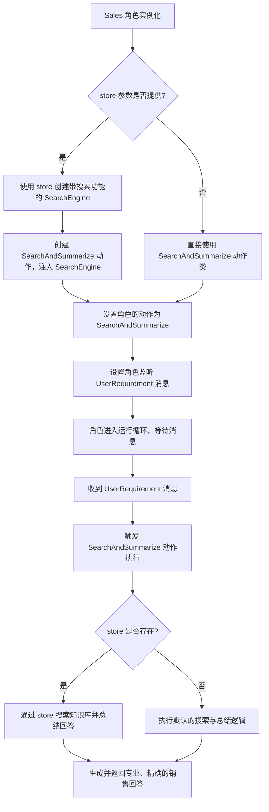
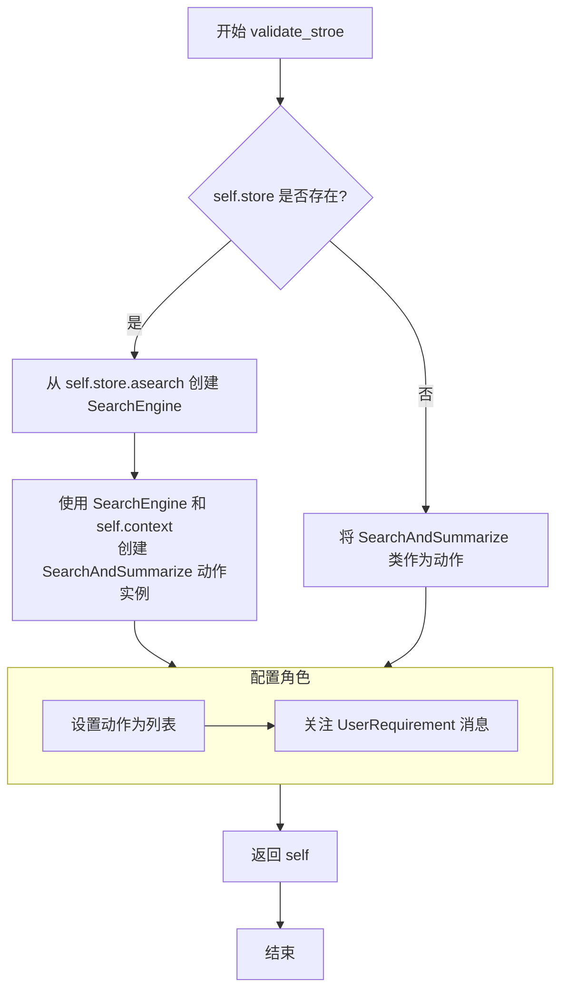

# `.\MetaGPT\metagpt\roles\sales.py` 详细设计文档

该文件定义了一个名为 `Sales` 的角色类，它继承自 `Role` 基类。该角色模拟一位名为 John Smith 的零售销售顾问，其核心功能是接收用户需求（`UserRequirement`），并基于一个可选的、实现了特定搜索接口的 `store` 对象（提供知识库）来执行搜索与总结（`SearchAndSummarize`）动作，从而专业、精确地回答客户问题。当知识库中没有相关信息时，它会如实告知无法回答。

## 整体流程



## 类结构

```
Role (基类，来自 metagpt.roles)
└── Sales (零售销售顾问角色)
    ├── 继承自 Role 的字段和方法
    ├── 自定义字段: name, profile, desc, store
    └── 自定义方法: validate_stroe (模型验证器)
```

## 全局变量及字段


### `Sales.name`
    
角色的名称，默认为'John Smith'，表示销售顾问的姓名

类型：`str`
    


### `Sales.profile`
    
角色的职业描述，默认为'Retail Sales Guide'，表示零售销售顾问

类型：`str`
    


### `Sales.desc`
    
角色的详细描述，说明其职责、行为准则和响应方式

类型：`str`
    


### `Sales.store`
    
可选的商店对象，必须实现SearchInterface接口，用于提供搜索功能

类型：`Optional[object]`
    
    

## 全局函数及方法

### `Sales.validate_stroe`

该方法是一个模型验证器，在`Sales`类实例化后自动调用。它的核心功能是根据`store`字段的值，动态配置`Sales`角色的行为。如果`store`不为`None`，则使用其提供的异步搜索功能创建一个自定义的`SearchEngine`，并据此初始化一个`SearchAndSummarize`动作；否则，直接使用`SearchAndSummarize`类。最后，它将配置好的动作设置为角色的默认动作，并指定角色需要关注`UserRequirement`消息。

参数：
-  `self`：`Sales`，`Sales`类的实例

返回值：`Sales`，返回经过验证和配置后的`Sales`实例自身。

#### 流程图



#### 带注释源码

```python
    @model_validator(mode="after")  # 这是一个Pydantic模型验证器，在模型实例化后运行
    def validate_stroe(self):
        # 检查实例的 `store` 字段是否已设置（不为 None）
        if self.store:
            # 如果 store 存在，使用其 `asearch` 方法（必须实现 SearchInterface）和配置中的代理设置来创建一个 SearchEngine 实例
            search_engine = SearchEngine.from_search_func(search_func=self.store.asearch, proxy=self.config.proxy)
            # 使用上面创建的搜索引擎和当前角色的上下文（context）来实例化一个 SearchAndSummarize 动作
            action = SearchAndSummarize(search_engine=search_engine, context=self.context)
        else:
            # 如果 store 不存在，则直接将 SearchAndSummarize 类（而非实例）赋值给 action 变量
            action = SearchAndSummarize
        # 将 action（可能是一个实例或一个类）放入一个列表中，并设置为该角色的动作列表
        self.set_actions([action])
        # 指定该角色需要监听（watch）UserRequirement 类型的消息
        self._watch([UserRequirement])
        # 返回配置好的角色实例自身，这是 Pydantic 验证器的要求
        return self
```

## 关键组件


### 角色定义与配置

通过继承`Role`基类并定义`name`、`profile`、`desc`等字段，创建了一个具体的销售角色"John Smith"，明确了其职责范围和行为约束。

### 依赖注入与工具集成

通过`store`字段支持外部知识库的注入，并在验证器中动态创建`SearchEngine`工具，实现了角色能力与外部数据源的解耦和灵活组合。

### 动作绑定与消息订阅

在模型验证器`validate_stroe`中，根据配置动态设置角色的核心动作（`SearchAndSummarize`）并订阅用户需求消息（`UserRequirement`），定义了角色的核心行为流。

### 验证后初始化

使用Pydantic的`@model_validator(mode="after")`装饰器，在模型字段赋值完成后执行自定义初始化逻辑，确保角色对象构建完成后其内部状态（如动作、观察列表）是正确且完整的。


## 问题及建议


### 已知问题

-   **`store` 字段的类型定义不精确**：`store` 字段的类型被定义为 `Optional[object]`，这过于宽泛且不符合类型提示的最佳实践。它应该被限定为实现特定接口（如 `SearchInterface`）的类，但目前仅通过注释说明，缺乏运行时和静态检查的保障。
-   **`validate_stroe` 方法名存在拼写错误**：方法名 `validate_stroe` 应为 `validate_store`，这是一个明显的拼写错误，会影响代码的可读性和可维护性。
-   **`store` 字段的默认值可能引发混淆**：`store` 字段的默认值为 `None`，但在 `model_validator` 中，当 `store` 为 `None` 时，会创建一个没有实际搜索功能的 `SearchAndSummarize` 动作。这可能导致角色在未配置 `store` 的情况下行为不符合预期，且错误信息不明确。
-   **硬编码的配置依赖**：在 `validate_stroe` 方法中，直接访问 `self.config.proxy` 来配置 `SearchEngine`。这假设 `self.config` 对象一定存在且包含 `proxy` 属性，增加了与外部配置结构的耦合，降低了代码的灵活性和可测试性。
-   **`SearchAndSummarize` 类的使用不一致**：当 `store` 存在时，实例化 `SearchAndSummarize` 并传入 `search_engine` 和 `context`；当 `store` 不存在时，直接将 `SearchAndSummarize` 类（而非实例）传递给 `set_actions`。这种不一致性可能导致后续处理逻辑复杂化或出错。

### 优化建议

-   **使用更精确的类型注解**：为 `store` 字段定义一个协议（Protocol）或抽象基类（ABC），例如 `SearchInterface`，并将其作为类型提示（如 `Optional[SearchInterface]`）。这可以提高代码的清晰度，并利用静态类型检查工具（如 mypy）提前发现类型不匹配的问题。
-   **修正方法名拼写错误**：将 `validate_stroe` 方法重命名为 `validate_store`，以符合命名规范并提升代码质量。
-   **明确 `store` 为 `None` 时的行为**：考虑在 `store` 为 `None` 时，抛出一个明确的异常或记录一个警告，提示用户必须提供有效的 `store` 实例，或者提供一个有明确说明的“无操作”或“模拟”实现，而不是静默地使用一个可能无法正常工作的默认行为。
-   **解耦配置依赖**：将 `proxy` 等配置项作为参数传递给 `Sales` 类的构造函数或 `validate_store` 方法，而不是直接从 `self.config` 中读取。这样可以使类的依赖关系更清晰，便于单元测试和在不同配置环境下的使用。
-   **统一 `SearchAndSummarize` 的初始化逻辑**：无论 `store` 是否存在，都实例化 `SearchAndSummarize` 类。当 `store` 为 `None` 时，可以传入一个 `None` 或一个模拟的 `SearchEngine` 实例到 `SearchAndSummarize` 中，并在其内部处理无可用搜索引擎的情况。这可以使 `set_actions` 接收的列表元素类型保持一致，简化后续逻辑。
-   **增强 `model_validator` 的健壮性**：在 `validate_store` 方法中，可以增加对 `self.store.asearch` 方法存在性的检查（如果使用了动态接口），并提供更友好的错误信息。同时，考虑将 `self.set_actions([action])` 和 `self._watch([UserRequirement])` 这部分与验证逻辑分离，使其更专注于验证和准备数据。


## 其它


### 设计目标与约束

1.  **设计目标**：
    *   创建一个能够模拟专业零售销售顾问行为的智能体（Role）。
    *   该智能体应基于给定的知识库（通过 `store` 对象提供）来回答用户问题，确保回答的准确性和专业性。
    *   当用户问题超出知识库范围时，应明确告知用户无法回答，避免提供猜测性或误导性信息。
    *   通过集成搜索与总结（`SearchAndSummarize`）动作，实现从知识库中检索并提炼信息以生成回答的核心流程。

2.  **设计约束**：
    *   **依赖注入**：`Sales` 角色的核心功能依赖于一个外部的 `store` 对象，该对象必须实现特定的搜索接口（`tools.SearchInterface` 的 `asearch` 方法）。这要求外部系统必须提供兼容的搜索功能。
    *   **配置依赖**：`SearchEngine` 的初始化依赖于 `self.config.proxy`，这意味着角色的运行环境需要正确配置网络代理设置（如果需要）。
    *   **响应式设计**：角色被设计为响应 `UserRequirement` 类型的消息，其行为由接收到的用户需求触发。
    *   **框架约束**：代码基于 `metagpt` 框架，必须遵循其 `Role`、`Action`、`Message` 等组件的设计模式和生命周期。

### 错误处理与异常设计

1.  **初始化阶段 (`validate_store` 方法)**：
    *   **`store` 对象验证**：虽然代码通过类型提示 `Optional[object]` 和 `Field` 的 `exclude=True` 允许 `store` 为 `None`，但 `validate_store` 方法逻辑区分了有无 `store` 的情况。如果 `store` 为 `None`，则使用默认的 `SearchAndSummarize` 类（可能依赖其他默认搜索源）。如果 `store` 存在但未正确实现 `asearch` 方法，在 `SearchEngine.from_search_func` 调用时可能会引发 `AttributeError` 或其他运行时异常。当前代码未显式捕获此类异常。

2.  **运行时阶段 (由 `metagpt` 框架管理)**：
    *   **`SearchAndSummarize` 动作执行**：当角色处理 `UserRequirement` 消息并运行 `SearchAndSummarize` 动作时，潜在的异常可能包括：
        *   `SearchEngine` 执行搜索时的网络错误、超时或API错误。
        *   知识库 (`store`) 查询失败或返回异常格式的数据。
        *   信息总结过程中出现处理错误。
    *   这些异常的处理责任主要委托给 `metagpt` 框架的 `Action` 执行机制和 `Role` 的 `_act` 或 `react` 方法。本类未定义自定义的错误处理逻辑。

3.  **建议的增强**：
    *   在 `validate_store` 中，可以增加对 `store` 对象是否具有 `asearch` 可调用属性的检查，并提供更清晰的错误信息。
    *   可以考虑在 `Sales` 角色中重写 `_act` 或相关方法，以捕获 `SearchAndSummarize` 运行时的特定异常，并转换为对用户友好的错误消息（例如，“暂时无法访问知识库，请稍后再试”）。

### 数据流与状态机

1.  **数据流**：
    *   **输入**：用户需求，以 `UserRequirement` 消息的形式发布到环境（`Environment`）中。
    *   **触发**：`Sales` 角色订阅 (`_watch`) 了 `UserRequirement` 消息。当此类消息出现时，角色被激活。
    *   **处理**：角色执行其设定的动作 (`SearchAndSummarize`)。
        *   该动作使用 `SearchEngine`。
        *   `SearchEngine` 调用 `store.asearch(query)` 从外部知识库获取原始信息。
        *   `SearchAndSummarize` 对获取的原始信息进行加工、总结。
    *   **输出**：`SearchAndSummarize` 动作产生的结果（总结后的答案）会被封装成 `Message`，可能发布回环境或直接返回。

2.  **状态机（简化）**：
    *   **初始状态**：`Sales` 角色实例化，`validate_store` 执行完毕，动作列表和消息订阅设置完成。
    *   **等待状态**：角色空闲，监听环境中的消息。
    *   **触发状态**：收到 `UserRequirement` 消息。
    *   **执行状态**：调用 `SearchAndSummarize` 动作的 `run` 方法。
    *   **输出状态**：生成响应消息。
    *   **返回等待状态**：处理完毕，继续监听消息。
    *   *(注：更复杂的状态如重试、失败处理依赖于框架的默认行为，未在本类中自定义)。*

### 外部依赖与接口契约

1.  **外部依赖**：
    *   **`metagpt` 框架**：核心依赖，提供了 `Role`, `Action`, `Message`, `Environment` 等基础抽象和运行机制。
    *   **`pydantic` 库**：用于数据验证和设置管理（`BaseModel`, `Field`, `model_validator`）。
    *   **`store` 对象 (外部知识库接口)**：这是最关键的外部依赖。它不是一个具体的库，而是一个必须由调用方提供的、符合特定接口的对象。

2.  **接口契约**：
    *   **`store` 对象契约**：
        *   **方法**：必须提供一个名为 `asearch` 的方法。
        *   **签名**：`async def asearch(query: str, ...) -> Any:` (具体返回类型由 `SearchEngine` 和 `SearchAndSummarize` 的预期决定，通常是可迭代的搜索结果列表或字符串)。
        *   **语义**：该方法应能异步地根据查询字符串 `query` 在知识库中进行搜索，并返回相关结果。`Sales` 角色和 `SearchEngine` 不关心 `store` 的内部实现，只依赖此异步搜索接口。
    *   **`SearchAndSummarize` 动作契约**：`Sales` 角色期望 `SearchAndSummarize` 动作能够接收 `SearchEngine` 或作为类引用，并在被调用时执行搜索-总结流程，最终返回一个文本响应。
    *   **`UserRequirement` 消息契约**：角色期望接收到的 `UserRequirement` 消息包含有效的用户查询内容，通常通过消息的 `content` 属性访问。

    