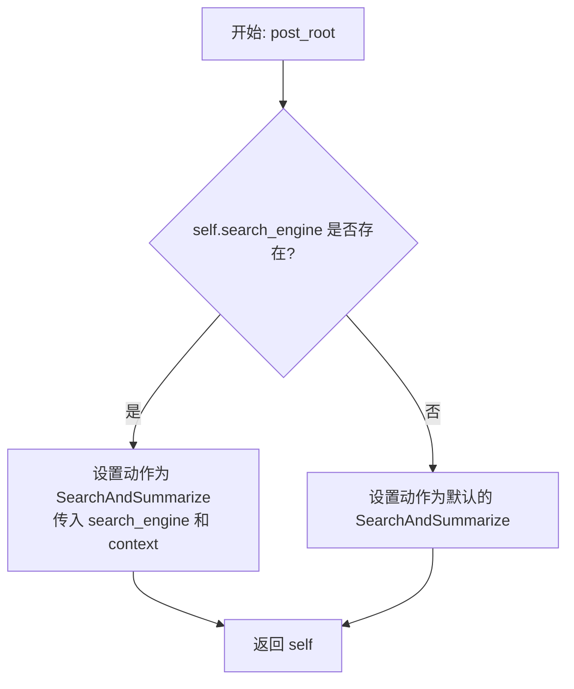
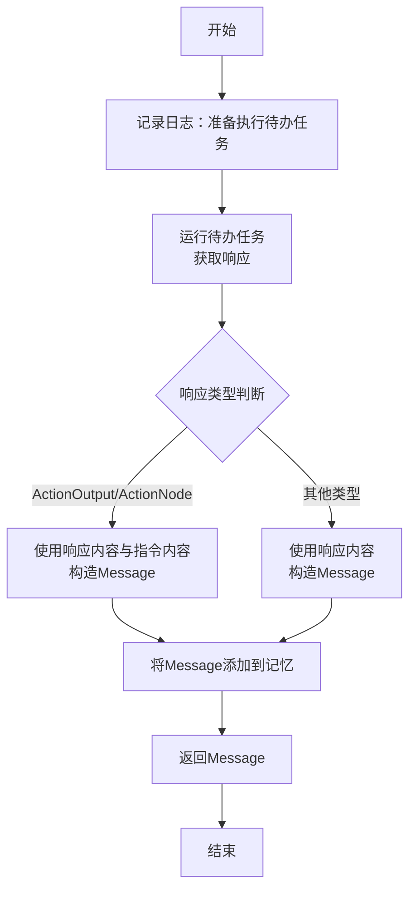
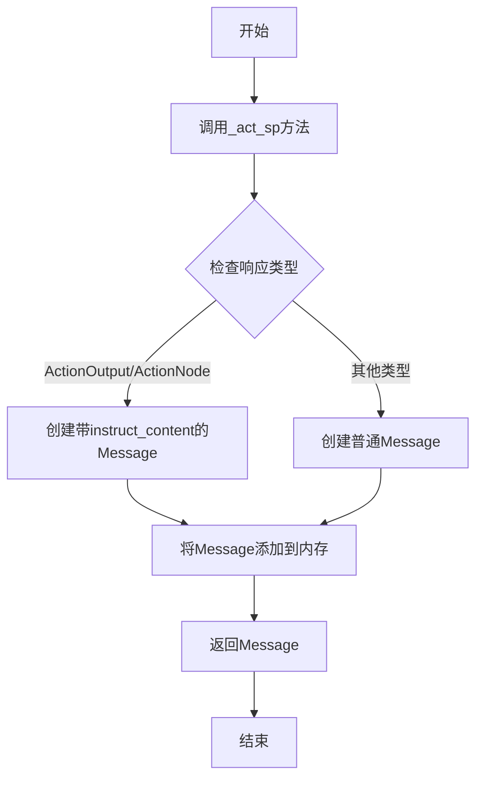

# `.\MetaGPT\metagpt\roles\searcher.py` 详细设计文档

该文件定义了一个名为Searcher的角色类，继承自Role基类。其核心功能是作为一个智能助手，为用户提供搜索服务。它通过配置的搜索引擎执行搜索和总结操作，并将结果封装为消息格式存储到记忆中。

## 整体流程

```mermaid
graph TD
    A[开始: Searcher角色初始化] --> B{是否配置了search_engine?}
    B -- 是 --> C[设置SearchAndSummarize动作(带引擎)]
    B -- 否 --> D[设置SearchAndSummarize动作(不带引擎)]
    C --> E[等待执行动作]
    D --> E
    E --> F[调用_act方法]
    F --> G[调用_act_sp方法]
    G --> H[从记忆获取输入并执行rc.todo.run]
    H --> I{返回结果类型?}
    I -- ActionOutput/ActionNode --> J[创建Message(包含instruct_content)]
    I -- 其他 --> K[创建Message(仅content)]
    J --> L[将Message添加到记忆]
    K --> L
    L --> M[返回Message]
```

## 类结构

```
Role (基类)
└── Searcher (搜索服务角色)
    ├── 继承自Role的字段和方法
    ├── 新增字段: name, profile, goal, constraints, search_engine
    ├── 新增方法: post_root, _act_sp, _act
```

## 全局变量及字段


### `Searcher.name`
    
角色的名称，默认为'Alice'，用于标识Searcher实例。

类型：`str`
    


### `Searcher.profile`
    
角色的配置文件或描述，默认为'Smart Assistant'，定义Searcher的角色类型。

类型：`str`
    


### `Searcher.goal`
    
角色的目标，固定为'Provide search services for users'，描述Searcher的核心任务。

类型：`str`
    


### `Searcher.constraints`
    
角色的约束条件，固定为'Answer is rich and complete'，定义Searcher执行任务时的限制或要求。

类型：`str`
    


### `Searcher.search_engine`
    
可选的搜索引擎实例，用于执行搜索操作，如果未提供则使用默认配置。

类型：`Optional[SearchEngine]`
    
    

## 全局函数及方法

### `Searcher.post_root`

该方法是一个Pydantic模型验证器，在Searcher类实例初始化后自动调用。其主要功能是根据`search_engine`字段的值，动态设置角色的动作（Action）。如果提供了搜索引擎实例，则创建一个使用该引擎和当前上下文的`SearchAndSummarize`动作；否则，创建一个默认的`SearchAndSummarize`动作。这确保了Searcher角色在初始化后立即具备执行搜索任务的能力。

参数：
-  `self`：`Searcher`，Searcher类的当前实例

返回值：`Searcher`，返回配置好动作的Searcher实例自身

#### 流程图



#### 带注释源码

```
    @model_validator(mode="after")
    def post_root(self):
        # 检查当前实例是否配置了 search_engine
        if self.search_engine:
            # 如果配置了，则创建一个与特定搜索引擎和上下文绑定的 SearchAndSummarize 动作
            self.set_actions([SearchAndSummarize(search_engine=self.search_engine, context=self.context)])
        else:
            # 如果没有配置搜索引擎，则设置一个默认的 SearchAndSummarize 动作
            self.set_actions([SearchAndSummarize])
        # 返回配置好的实例自身，这是 Pydantic 模型验证器的要求
        return self
```

### `Searcher._act_sp`

该方法执行单进程搜索动作，从待办任务中获取搜索请求，运行搜索并总结，然后将结果封装为消息存入记忆并返回。

参数：

-  `self`：`Searcher`，Searcher 类的实例，包含角色配置、搜索引擎等上下文信息。

返回值：`Message`，返回封装了搜索结果的 Message 对象，该对象将被添加到角色的记忆中。

#### 流程图



#### 带注释源码

```python
async def _act_sp(self) -> Message:
    """Performs the search action in a single process."""
    # 记录日志，表明当前角色准备执行其待办任务
    logger.info(f"{self._setting}: to do {self.rc.todo}({self.rc.todo.name})")
    # 从记忆（通常存储了用户查询）中获取第0条信息，并运行待办任务（SearchAndSummarize）
    response = await self.rc.todo.run(self.rc.memory.get(k=0))

    # 判断响应类型，如果是ActionOutput或ActionNode，则提取其内容和指令内容
    if isinstance(response, (ActionOutput, ActionNode)):
        msg = Message(
            content=response.content,
            instruct_content=response.instruct_content,
            role=self.profile,
            cause_by=self.rc.todo,
        )
    else:
        # 否则，直接将响应内容作为消息内容
        msg = Message(content=response, role=self.profile, cause_by=self.rc.todo)
    # 将构造好的消息添加到角色的记忆中
    self.rc.memory.add(msg)
    # 返回该消息
    return msg
```

### `Searcher._act`

该方法用于确定Searcher角色的行动模式，并调用单进程搜索方法执行搜索操作。

参数：无

返回值：`Message`，返回包含搜索结果的Message对象

#### 流程图



#### 带注释源码

```python
async def _act(self) -> Message:
    """Determines the mode of action for the searcher."""
    # 调用单进程搜索方法执行实际的搜索操作
    return await self._act_sp()
```

## 关键组件


### Searcher 角色类

一个继承自 `Role` 的特定角色类，负责响应用户请求，通过调用搜索引擎获取信息并进行总结，最终将结果封装为消息返回。

### SearchAndSummarize 动作

一个具体的 `Action` 类（通过 `self.rc.todo` 引用），由 `Searcher` 角色调用，其核心功能是执行搜索查询并对搜索结果进行摘要总结。

### SearchEngine 搜索引擎

一个外部工具类，作为 `Searcher` 角色的依赖项被注入，负责执行底层的网络搜索操作，是获取原始信息的关键组件。

### 消息处理与内存管理

`Searcher` 角色通过 `_act_sp` 方法执行动作，将 `SearchAndSummarize` 动作产生的结果（无论是 `ActionOutput`、`ActionNode` 还是原始字符串）封装成标准化的 `Message` 对象，并存入角色的记忆 (`self.rc.memory`) 中，实现了信息的标准化流转和状态持久化。


## 问题及建议


### 已知问题

-   **`post_root` 方法逻辑不健壮**：`post_root` 方法在 `search_engine` 为 `None` 时，会创建一个不带 `search_engine` 参数的 `SearchAndSummarize` 实例。这依赖于 `SearchAndSummarize` 类内部能处理 `search_engine` 为 `None` 的情况，否则可能导致运行时错误。当前代码将这一关键依赖的检查推迟到了 `SearchAndSummarize` 内部，增加了模块间的耦合和不确定性。
-   **`_act_sp` 方法对 `rc.memory.get(k=0)` 的依赖不明确**：`_act_sp` 方法从内存中获取索引为0的消息作为 `SearchAndSummarize` 动作的输入。这种硬编码的索引访问方式缺乏灵活性，且未明确说明内存中消息的结构和顺序要求，使得代码行为难以预测和维护。
-   **`_act` 方法仅为 `_act_sp` 的简单包装**：`_act` 方法直接调用 `_act_sp`，没有体现出其作为“确定行动模式”的职责。这表明当前设计可能处于过渡状态，或者 `_act` 方法的命名和职责定义不够清晰。
-   **硬编码的角色属性**：`name` 和 `profile` 字段被硬编码为 `"Alice"` 和 `"Smart Assistant"`。虽然提供了默认值，但作为可配置角色，这些值应该更容易在实例化时被覆盖，目前的 `Field(default=...)` 方式在实例化时仍需显式传入才能修改，不够直观。
-   **缺乏输入验证和错误处理**：代码中没有对 `search_engine` 参数的有效性进行充分验证（例如，检查其是否具有必要的方法）。`_act_sp` 方法中对于 `response` 类型的判断和处理也相对基础，如果 `response` 是其他未预期的类型，可能导致错误。

### 优化建议

-   **增强 `post_root` 方法的健壮性**：建议在 `post_root` 方法中或通过 Pydantic 字段验证器，对 `search_engine` 进行更明确的检查。如果 `search_engine` 为 `None`，可以记录警告日志、抛出更有意义的异常，或者提供一个安全的默认行为（如使用一个兜底的搜索客户端）。这能使错误更早暴露，逻辑更清晰。
-   **明确 `_act_sp` 方法的输入来源**：重构 `_act_sp` 方法，使其输入不依赖于固定的内存索引。可以考虑从 `self.rc` 中获取更明确的上下文信息，或者修改 `Role` 基类的设计，让子类能更清晰地指定其动作的输入数据来源。增加相关注释说明输入数据的预期格式。
-   **重构或重命名 `_act` 方法**：如果 `_act` 方法未来会支持多种行动模式（如单进程、多进程），则应在此方法中添加模式选择逻辑。如果当前设计就是单进程，考虑将 `_act` 方法合并到 `_act_sp` 中，或者将 `_act_sp` 重命名为 `_act` 以简化结构。
-   **提供更灵活的角色属性配置**：考虑将 `name` 和 `profile` 的默认值设置为 `None`，并在 `__init__` 或验证器中提供更具描述性的默认值（例如，基于类名生成）。或者，提供一个类级别的配置方式来更容易地修改这些默认值。
-   **增加输入验证和错误处理**：在 `post_root` 或字段验证器中，验证 `search_engine` 对象是否具备必要的接口（如 `run` 方法）。在 `_act_sp` 中，对 `response` 的类型检查可以更严格，并为未知类型添加 `else` 分支或抛出 `TypeError`。同时，对 `await self.rc.todo.run(...)` 的调用进行 `try-except` 包装，捕获可能的异步执行异常，并记录或上抛。
-   **考虑依赖注入的明确性**：`search_engine` 作为可选依赖，其生命周期管理和注入方式可以更明确。考虑是否强制要求提供 `search_engine`，或者提供一个工厂方法来创建默认的 `SearchEngine` 实例，使角色创建逻辑更自包含。


## 其它


### 设计目标与约束

本模块旨在实现一个智能搜索代理角色，能够响应用户请求，利用搜索引擎获取信息并进行总结。主要设计目标包括：1) 封装搜索与总结的复杂流程，提供简洁的接口；2) 与现有角色（Role）框架无缝集成，复用其生命周期管理和消息处理机制；3) 支持可插拔的搜索引擎，便于扩展和测试。核心约束包括：1) 必须遵循父类`Role`定义的执行流程和状态管理约定；2) 搜索结果的输出格式需符合`Message` schema，以支持系统内的消息路由；3) 异步执行以支持高并发场景。

### 错误处理与异常设计

当前代码未显式处理潜在异常。主要风险点包括：1) `search_engine`为`None`时，`SearchAndSummarize`动作的初始化或执行可能失败；2) `self.rc.todo.run`异步调用可能因网络、搜索引擎API错误或内部逻辑问题抛出异常；3) `self.rc.memory.get(k=0)`可能因内存为空而返回`None`。建议的改进是：在`_act_sp`方法中使用`try-except`块捕获异常，并返回一个包含错误信息的`Message`，或记录错误日志后重新抛出由上层统一处理，确保角色执行链的健壮性。

### 数据流与状态机

数据流始于外部调用`Role`的`run`方法。1) `run`触发`_think`->`_act`循环。2) 本类的`_act`方法直接调用`_act_sp`。3) `_act_sp`从内存（`self.rc.memory`）获取最新消息作为查询输入。4) 调用当前待执行动作`self.rc.todo`（即`SearchAndSummarize`实例）的`run`方法，传入查询。5) `SearchAndSummarize`执行搜索并生成总结，返回`ActionOutput`/`ActionNode`或字符串。6) `_act_sp`将返回结果封装成`Message`对象。7) 该`Message`被添加回内存，并作为方法返回值。状态机遵循`Role`基类定义：`_think`决定动作（此处固定为`SearchAndSummarize`），`_act`执行动作并更新内存。

### 外部依赖与接口契约

1.  **父类依赖**：强依赖`metagpt.roles.Role`基类，需遵循其`_think`、`_act`、`set_actions`、`run`等方法的契约和`self.rc`（RoleContext）的使用方式。
2.  **动作依赖**：依赖`metagpt.actions.SearchAndSummarize`类。`Searcher`通过`set_actions`设置该动作，并通过`self.rc.todo.run()`调用它。`SearchAndSummarize`的`run`方法需接受一个字符串或`Message`作为输入，并返回`ActionOutput`、`ActionNode`或字符串。
3.  **引擎依赖**：可选依赖`metagpt.tools.search_engine.SearchEngine`。通过`search_engine`字段注入，并传递给`SearchAndSummarize`构造函数。`SearchEngine`需实现特定的搜索接口（代码中未展示，但`SearchAndSummarize`会调用）。
4.  **数据结构依赖**：依赖`metagpt.schema.Message`用于输入/输出，依赖`metagpt.actions.action_output.ActionOutput`和`metagpt.actions.action_node.ActionNode`用于处理动作的返回结果。
5.  **配置与日志**：依赖`pydantic`进行数据验证，依赖`metagpt.logs.logger`进行日志记录。

### 并发与生命周期管理

并发模型由`Role`基类的异步`run`方法决定。`Searcher`实例的`_act`和`_act_sp`方法均为`async`，支持在异步事件循环中并发执行多个搜索任务。生命周期与`Role`实例绑定：初始化（`__init__`或Pydantic验证器`post_root`）-> 设置动作 -> 外部调用`run` -> 内部循环执行`_think`和`_act` -> 返回最终消息。`search_engine`作为依赖，其生命周期（如创建、连接、关闭）应由`Searcher`的创建者或外部容器管理，`Searcher`仅持有其引用。

### 配置与初始化

配置主要通过Pydantic模型的字段默认值和验证器完成。`name`、`profile`、`goal`、`constraints`有默认值。关键的`search_engine`字段为可选，通过`post_root`这个`@model_validator(mode="after")`进行后初始化逻辑：根据`search_engine`是否存在，决定如何初始化`SearchAndSummarize`动作（传入引擎和上下文，或不传入）。这种设计允许灵活构造：可以传入预配置的引擎，也可以在无引擎时依赖`SearchAndSummarize`内部的默认或备用实现。初始化逻辑与动作设置紧密耦合。

### 测试策略建议

1.  **单元测试**：Mock `SearchEngine`和`SearchAndSummarize.run`方法，测试`_act_sp`对不同返回类型（`ActionOutput`、字符串）的处理是否正确封装`Message`。测试`post_root`验证器在`search_engine`有无两种情况下的动作设置。
2.  **集成测试**：使用真实的或模拟的`SearchEngine`，测试`Searcher`与`SearchAndSummarize`的完整工作流，验证从输入查询到输出总结`Message`的端到端功能。
3.  **异常测试**：测试当`search_engine`为`None`且`SearchAndSummarize`内部需要它时，或当`run`方法抛出异常时，系统的行为是否符合预期（例如，是否记录错误、返回错误消息）。
4.  **角色框架集成测试**：将`Searcher`置于完整的角色执行循环中，测试其与`Role`基类的`run`、`memory`等组件的交互是否正确。

    