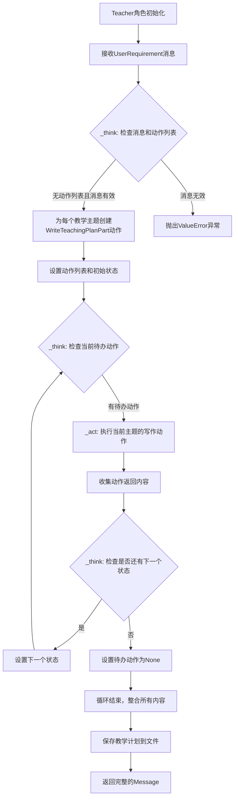
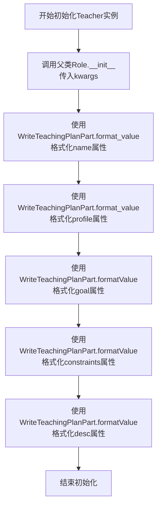
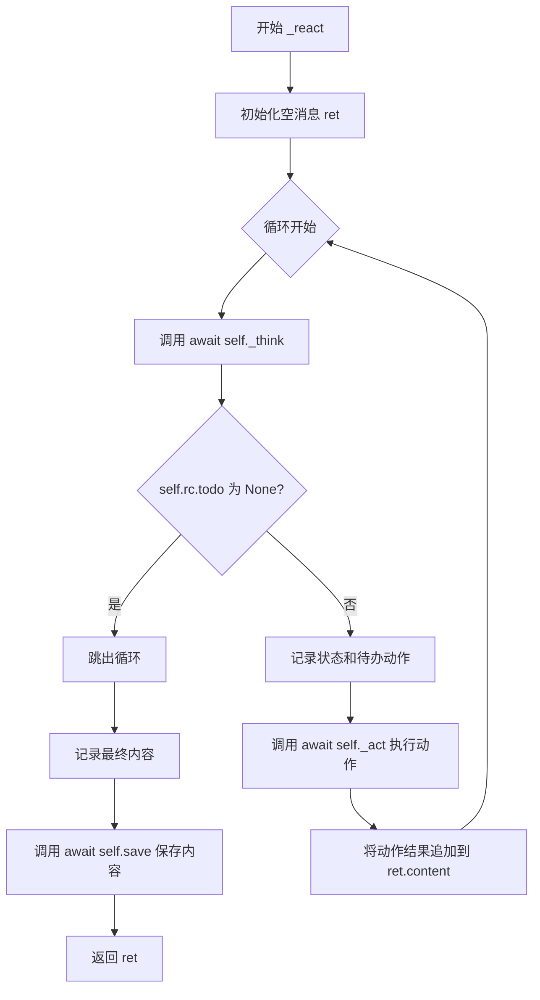
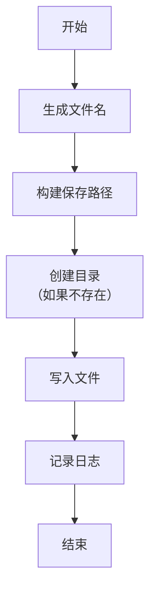
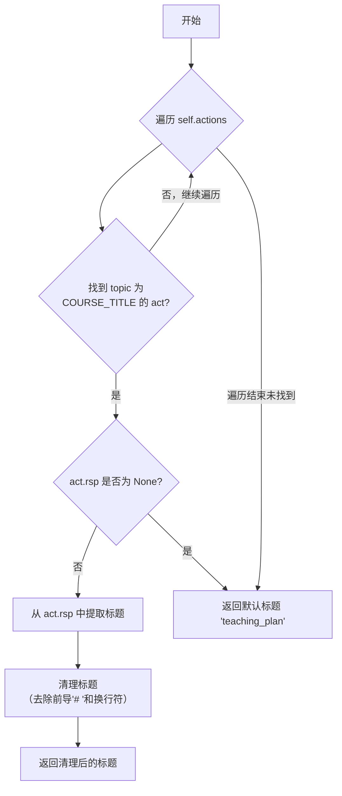

# `.\MetaGPT\metagpt\roles\teacher.py` 详细设计文档

该文件定义了一个Teacher类，继承自Role基类，用于在智能体商店中扮演可配置的教师角色。其核心功能是接收用户需求，按教学计划的不同主题部分（如课程标题、教学目标等）逐步生成完整的教学计划文档，并将最终结果保存为Markdown文件。

## 整体流程



## 类结构

```
Role (元角色基类)
└── Teacher (教师角色)
    ├── 继承字段: name, profile, goal, constraints, desc
    ├── 继承方法: _think, _react, _act 等
    ├── 新增方法: save, new_file_name, course_title
    └── 关联类: WriteTeachingPlanPart, TeachingPlanBlock, Message
```

## 全局变量及字段


### `Teacher.name`
    
教师角色的名称，默认为'Lily'，可通过配置替换

类型：`str`
    


### `Teacher.profile`
    
教师角色的简介模板，包含可替换的{teaching_language}占位符

类型：`str`
    


### `Teacher.goal`
    
教师角色的目标描述模板，包含可替换的{language}占位符

类型：`str`
    


### `Teacher.constraints`
    
教师角色的约束条件模板，包含可替换的{language}占位符

类型：`str`
    


### `Teacher.desc`
    
教师角色的详细描述，可通过配置替换

类型：`str`
    
    

## 全局函数及方法

### `Teacher.__init__`

该方法用于初始化`Teacher`类的实例，继承自父类`Role`的初始化逻辑，并对`Teacher`特有的属性（如`name`、`profile`、`goal`、`constraints`、`desc`）进行动态格式化处理，使其能够根据上下文（`self.context`）中的配置（如教学语言、目标语言等）生成最终的值。

参数：

- `kwargs`：`dict`，可变关键字参数，用于接收传递给父类`Role.__init__`的初始化参数。

返回值：`None`，构造函数无返回值。

#### 流程图



#### 带注释源码

```python
def __init__(self, **kwargs):
    # 调用父类Role的构造函数，传入所有关键字参数，完成基础角色的初始化
    super().__init__(**kwargs)
    # 使用WriteTeachingPlanPart类的静态方法format_value，根据当前上下文(self.context)动态格式化name属性
    self.name = WriteTeachingPlanPart.format_value(self.name, self.context)
    # 使用WriteTeachingPlanPart类的静态方法format_value，根据当前上下文(self.context)动态格式化profile属性
    self.profile = WriteTeachingPlanPart.format_value(self.profile, self.context)
    # 使用WriteTeachingPlanPart类的静态方法format_value，根据当前上下文(self.context)动态格式化goal属性
    self.goal = WriteTeachingPlanPart.format_value(self.goal, self.context)
    # 使用WriteTeachingPlanPart类的静态方法format_value，根据当前上下文(self.context)动态格式化constraints属性
    self.constraints = WriteTeachingPlanPart.format_value(self.constraints, self.context)
    # 使用WriteTeachingPlanPart类的静态方法format_value，根据当前上下文(self.context)动态格式化desc属性
    self.desc = WriteTeachingPlanPart.format_value(self.desc, self.context)
```

### `Teacher._think`

该方法用于控制教师角色的思考流程，决定是否继续执行下一个教学计划部分。它检查当前是否有待执行的动作，如果没有则根据用户需求初始化一系列教学计划部分的动作。然后根据当前状态决定是否推进到下一个状态或结束思考。

参数：

-  `self`：`Teacher`，当前教师角色实例

返回值：`bool`，返回 `True` 表示可以继续推理（有下一个状态或动作），返回 `False` 表示推理无法继续（所有状态已完成）

#### 流程图

```mermaid
graph TD
    A[开始] --> B{self.actions 为空?}
    B -- 是 --> C{self.rc.news 有效且由 UserRequirement 触发?}
    C -- 否 --> D[抛出 ValueError]
    C -- 是 --> E[遍历 TeachingPlanBlock.TOPICS<br>为每个主题创建 WriteTeachingPlanPart 动作]
    E --> F[self.set_actions(actions)]
    F --> G{self.rc.todo 为 None?}
    B -- 否 --> G
    G -- 是 --> H[self._set_state(0)]
    H --> I[返回 True]
    G -- 否 --> J{self.rc.state + 1 < len(self.states)?}
    J -- 是 --> K[self._set_state(self.rc.state + 1)]
    K --> I
    J -- 否 --> L[self.set_todo(None)]
    L --> M[返回 False]
```

#### 带注释源码

```python
async def _think(self) -> bool:
    """Everything will be done part by part."""
    # 检查是否有已设置的动作列表，如果没有则进行初始化
    if not self.actions:
        # 验证消息队列中的最新消息是否有效且由用户需求触发
        if not self.rc.news or self.rc.news[0].cause_by != any_to_str(UserRequirement):
            raise ValueError("Lesson content invalid.")
        actions = []
        # 打印教学计划主题列表（调试用）
        print(TeachingPlanBlock.TOPICS)
        # 遍历所有教学计划主题，为每个主题创建一个写作动作
        for topic in TeachingPlanBlock.TOPICS:
            act = WriteTeachingPlanPart(i_context=self.rc.news[0].content, topic=topic, llm=self.llm)
            actions.append(act)
        # 将创建的动作列表设置到角色中
        self.set_actions(actions)

    # 检查当前是否有待执行的动作
    if self.rc.todo is None:
        # 如果没有待执行动作，将状态重置为0（开始第一个动作）
        self._set_state(0)
        return True  # 可以继续推理

    # 检查是否还有下一个状态
    if self.rc.state + 1 < len(self.states):
        # 如果有下一个状态，推进到下一个状态
        self._set_state(self.rc.state + 1)
        return True  # 可以继续推理

    # 所有状态已完成，清除待执行动作
    self.set_todo(None)
    return False  # 推理无法继续
```


### `Teacher._react`

`Teacher._react` 方法是 `Teacher` 角色的核心反应循环。它负责驱动角色完成其目标——分部分编写教学计划。该方法通过循环调用 `_think` 方法来决定下一步行动，然后执行相应的动作 (`_act`)，并将所有动作的结果累积到一个 `Message` 对象中。当 `_think` 方法指示没有更多动作需要执行时，循环结束，最终将累积的内容保存到文件并返回。

参数：
-  `self`：`Teacher` 类型，表示 `Teacher` 角色的当前实例。

返回值：`Message`，一个包含最终拼接而成的完整教学计划内容的 `Message` 对象。

#### 流程图



#### 带注释源码

```python
async def _react(self) -> Message:
    # 初始化一个空的 Message 对象，用于累积所有部分的教学计划内容。
    ret = Message(content="")
    # 进入反应循环，持续思考并行动，直到没有更多待办事项。
    while True:
        # 步骤1: 思考。调用 _think 方法来确定下一步应该做什么。
        # _think 会设置 self.rc.todo（下一个要执行的动作）或将其设为 None（表示结束）。
        await self._think()
        # 步骤2: 检查循环终止条件。如果没有待办事项，则退出循环。
        if self.rc.todo is None:
            break
        # 步骤3: 记录当前状态和即将执行的动作，用于调试。
        logger.debug(f"{self._setting}: {self.rc.state=}, will do {self.rc.todo}")
        # 步骤4: 行动。执行 self.rc.todo 所指向的动作，并获取结果消息。
        msg = await self._act()
        # 步骤5: 拼接内容。如果不是第一部分，则在内容间添加分隔符。
        if ret.content != "":
            ret.content += "\n\n\n"
        # 将本次动作产生的内容追加到总内容中。
        ret.content += msg.content
    # 循环结束后，记录完整的教学计划内容（INFO级别）。
    logger.info(ret.content)
    # 步骤6: 持久化。调用 save 方法将完整内容保存到文件中。
    await self.save(ret.content)
    # 步骤7: 返回包含完整教学计划内容的 Message 对象。
    return ret
```


### `Teacher.save`

该方法用于将教学计划内容保存到指定文件中。它首先根据课程标题生成文件名，然后在工作空间目录下创建`teaching_plan`文件夹（如果不存在），最后将内容写入该文件并记录日志。

参数：

- `self`：`Teacher`，当前`Teacher`实例
- `content`：`str`，要保存的教学计划内容

返回值：`None`，无返回值

#### 流程图



#### 带注释源码

```python
async def save(self, content):
    """Save teaching plan"""
    # 1. 根据课程标题生成文件名
    filename = Teacher.new_file_name(self.course_title)
    # 2. 构建保存路径：工作空间路径下的`teaching_plan`目录
    pathname = self.config.workspace.path / "teaching_plan"
    # 3. 创建目录（如果目录不存在）
    pathname.mkdir(exist_ok=True)
    # 4. 拼接完整的文件路径
    pathname = pathname / filename
    # 5. 异步写入内容到文件
    await awrite(pathname, content)
    # 6. 记录保存成功的日志信息
    logger.info(f"Save to:{pathname}")
```


### `Teacher.new_file_name`

这是一个静态方法，用于根据课程标题生成一个合法的文件名。它会将标题中的非法字符替换为下划线，并确保文件名以指定的扩展名结尾。

参数：

-  `lesson_title`：`str`，课程标题，将作为文件名的基础。
-  `ext`：`str`，可选参数，默认为 `".md"`，指定生成文件名的扩展名。

返回值：`str`，处理后的合法文件名。

#### 流程图

```mermaid
flowchart TD
    A[开始: 输入 lesson_title, ext] --> B{lesson_title 是否为空?}
    B -- 是 --> C[返回 ext]
    B -- 否 --> D[定义非法字符正则表达式<br/>illegal_chars = r'[#@$%!*&\\/:*?"<>|\n\t \']']
    D --> E[使用 re.sub 将 illegal_chars 替换为 '_']
    E --> F[将处理后的字符串与 ext 拼接]
    F --> G[使用 re.sub 将连续的 '_' 替换为单个 '_']
    G --> H[返回最终文件名]
```

#### 带注释源码

```python
    @staticmethod
    def new_file_name(lesson_title, ext=".md"):
        """Create a related file name based on `lesson_title` and `ext`."""
        # 定义需要被替换的特殊字符正则表达式模式。
        illegal_chars = r'[#@$%!*&\\/:*?"<>|\n\t \']'
        # 使用正则表达式将特殊字符替换为下划线。
        filename = re.sub(illegal_chars, "_", lesson_title) + ext
        # 将连续的下划线替换为单个下划线，并返回最终结果。
        return re.sub(r"_+", "_", filename)
```


### `Teacher.course_title`

这是一个属性方法（property），用于从教学计划动作中提取课程标题。它会遍历教师角色的所有动作，找到专门处理课程标题的动作（`TeachingPlanBlock.COURSE_TITLE`），然后从该动作的响应中提取并清理出课程标题。如果找不到对应的动作或响应为空，则返回默认标题。

参数：
-  `self`：`Teacher`，`Teacher` 类的实例，代表当前教师角色。

返回值：`str`，提取并清理后的课程标题字符串，如果提取失败则返回默认标题 `"teaching_plan"`。

#### 流程图



#### 带注释源码

```
    @property
    def course_title(self):
        """Return course title of teaching plan"""
        # 定义默认标题，用于在无法提取时返回
        default_title = "teaching_plan"
        # 遍历教师角色中的所有动作（actions）
        for act in self.actions:
            # 检查当前动作的主题是否为“课程标题”
            if act.topic != TeachingPlanBlock.COURSE_TITLE:
                # 如果不是，则跳过当前动作，继续检查下一个
                continue
            # 如果找到了处理课程标题的动作，但它的响应（rsp）为空
            if act.rsp is None:
                # 则返回默认标题
                return default_title
            # 从动作的响应中提取标题
            # 1. 去除响应字符串开头可能存在的'#'、空格和换行符
            title = act.rsp.lstrip("# \n")
            # 2. 检查标题中是否包含换行符（即响应可能包含多行内容）
            if "\n" in title:
                # 找到第一个换行符的位置
                ix = title.index("\n")
                # 只取第一行作为课程标题
                title = title[0:ix]
            # 返回清理后的标题
            return title
        # 如果遍历完所有动作都没有找到处理课程标题的动作，则返回默认标题
        return default_title
```


## 关键组件


### Teacher 角色类

Teacher 类继承自 Role 基类，是一个可配置的教师角色，用于按部分生成特定语言的教学计划。它通过配置支持替换母语和教学语言，并管理从需求分析到计划生成、保存的完整工作流。

### 教学计划块 (TeachingPlanBlock)

TeachingPlanBlock 是一个枚举或常量集合（在导入的 `WriteTeachingPlanPart` 中定义），定义了教学计划的结构化组成部分（如 COURSE_TITLE, TOPICS 等），为 Teacher 角色按主题生成计划内容提供了蓝图。

### 编写教学计划部分动作 (WriteTeachingPlanPart)

WriteTeachingPlanPart 是一个 Action 类，负责根据给定的主题和上下文，利用大语言模型（LLM）生成教学计划的特定部分（如课程标题、某个教学主题的内容）。它是 Teacher 角色执行具体写作任务的核心组件。

### 角色状态机与反应循环 (Role State Machine & React Loop)

Teacher 角色内部维护了一个基于状态（`self.rc.state`）的反应循环（`_react` 方法）。`_think` 方法根据当前状态和待办事项（`self.rc.todo`）决定下一步行动（设置要执行的 Action），驱动角色按顺序完成所有教学计划部分的编写。这是角色自主决策和工作流控制的关键机制。

### 文件命名与保存机制

包含 `new_file_name` 静态方法和 `save` 实例方法。`new_file_name` 通过正则表达式清理课程标题中的非法字符来生成安全的文件名。`save` 方法将最终生成的教学计划内容写入到工作空间指定目录下的文件中，实现了成果的持久化存储。


## 问题及建议


### 已知问题

-   **初始化逻辑依赖外部格式化**：`__init__` 方法中，`name`、`profile`、`goal`、`constraints`、`desc` 等属性的值依赖于 `WriteTeachingPlanPart.format_value` 方法进行格式化。这导致 `Teacher` 类的初始化逻辑与 `WriteTeachingPlanPart` 类强耦合，降低了 `Teacher` 类的独立性和可测试性。如果 `WriteTeachingPlanPart.format_value` 的行为发生变化或不可用，`Teacher` 类的初始化将失败。
-   **课程标题提取逻辑脆弱**：`course_title` 属性通过遍历 `self.actions` 并查找特定主题 (`TeachingPlanBlock.COURSE_TITLE`) 的 `WriteTeachingPlanPart` 动作来提取标题。这个逻辑假设 `actions` 列表已正确初始化且包含所需动作，并且 `act.rsp` 已正确填充。如果这些前提条件不满足（例如，在 `_think` 中设置 actions 之前访问该属性），将返回默认标题，可能导致后续文件命名不准确。
-   **文件命名方法为静态方法**：`new_file_name` 被定义为静态方法，但它使用了 `Teacher` 类的类名。虽然这本身不是错误，但将其作为实例方法可能更符合面向对象的设计原则，特别是如果未来需要根据实例状态调整命名规则。
-   **`_think` 方法中的硬编码依赖**：`_think` 方法在初始化 `actions` 时，直接检查 `self.rc.news[0].cause_by != any_to_str(UserRequirement)`。这硬编码了对特定消息类型 (`UserRequirement`) 的依赖，使得角色逻辑不够通用。如果希望 `Teacher` 角色响应其他类型的触发消息，需要修改此方法。
-   **潜在的循环依赖风险**：`Teacher` 类从 `metagpt.actions.write_teaching_plan` 导入了 `TeachingPlanBlock` 和 `WriteTeachingPlanPart`。同时，`WriteTeachingPlanPart` 可能（根据命名推测）是一个动作类，而角色类通常使用动作类。这种相互导入在复杂项目中可能形成循环依赖，影响代码结构和可维护性。

### 优化建议

-   **解耦初始化逻辑**：考虑将 `WriteTeachingPlanPart.format_value` 的调用从 `__init__` 中移除。可以将格式化后的值作为参数传递给 `Teacher` 的构造函数，或者让 `Teacher` 类自己实现一个简单的字符串格式化方法（如果逻辑不复杂）。这样可以减少外部依赖，使 `Teacher` 类更加自包含。
-   **增强 `course_title` 属性的健壮性**：在 `course_title` 属性的 getter 方法中，增加对 `self.actions` 是否为 `None` 或空的检查。可以考虑将课程标题的提取和缓存逻辑放在 `_think` 或 `_react` 方法中，在 actions 被成功设置并执行后，将结果存储在一个实例变量（如 `self._course_title`）中，然后让 `course_title` 属性返回这个缓存的值。这可以避免在错误的时间点访问未初始化的数据。
-   **将 `new_file_name` 改为实例方法**：将 `new_file_name` 方法从静态方法改为实例方法。这样，如果需要，它可以访问实例的属性（例如 `self.course_title` 的原始形式）来辅助生成文件名，使方法更具灵活性。当前调用方式 `Teacher.new_file_name(...)` 可以改为 `self.new_file_name(...)`。
-   **使 `_think` 的触发条件可配置**：将 `_think` 方法中对 `UserRequirement` 的硬编码检查改为可配置的。例如，可以在 `Teacher` 类中引入一个类变量或实例变量（如 `trigger_message_type`）来指定触发角色开始思考的消息类型。这样提高了角色的可复用性。
-   **审查并简化模块依赖**：检查 `metagpt.actions.write_teaching_plan` 模块是否真的需要被 `Teacher` 导入，或者是否可以通过更抽象的接口（例如基类或协议）来依赖。如果存在循环依赖的风险，考虑使用依赖注入或重构代码结构来打破循环。确保导入关系是清晰和单向的。
-   **增加错误处理和日志**：在 `_think` 方法中，当 `self.rc.news` 为空或不符合条件时，抛出了 `ValueError`。可以考虑提供更详细的错误信息。在 `save` 方法中，文件写入操作 `awrite` 可能失败，可以增加 `try-except` 块来捕获 `IOError` 等异常，并记录相关日志，而不是让异常直接抛出导致程序中断。
-   **考虑异步上下文管理**：`save` 方法执行了文件写入的异步操作。如果 `Teacher` 角色在多个地方被使用并保存文件，考虑实现异步上下文管理器（`__aenter__`, `__aexit__`）来确保资源（如文件句柄）的正确管理，尽管当前使用 `awrite` 可能已处理了部分问题。


## 其它


### 设计目标与约束

1. **设计目标**：
   - 实现一个可配置的教师角色，能够根据配置生成指定语言的教学计划。
   - 支持按部分（part-by-part）生成教学计划，每个部分对应一个特定的教学主题。
   - 将生成的教学计划保存为文件，便于后续使用和分享。

2. **设计约束**：
   - 教师角色的名称、简介、目标和约束条件必须支持动态配置，通过上下文进行格式化。
   - 教学计划的生成必须基于用户提供的课程内容，且内容必须有效。
   - 生成的文件名必须合法，避免使用特殊字符，确保跨平台兼容性。

### 错误处理与异常设计

1. **异常处理**：
   - 在 `_think` 方法中，如果 `self.actions` 为空且没有有效的课程内容，会抛出 `ValueError` 异常，提示“Lesson content invalid.”。
   - 文件操作（如创建目录、写入文件）可能引发 `OSError` 或 `IOError`，但代码中未显式处理，依赖调用方或上层框架处理。

2. **错误预防**：
   - 通过 `new_file_name` 方法清理文件名中的非法字符，防止文件系统错误。
   - 在 `course_title` 属性中，如果无法获取有效的课程标题，会返回默认标题“teaching_plan”，避免空值或异常。

### 数据流与状态机

1. **数据流**：
   - 输入：用户通过 `Message` 提供课程内容，触发教师角色的 `_react` 方法。
   - 处理：教师角色根据课程内容，按主题生成教学计划的各个部分，每个部分由 `WriteTeachingPlanPart` 动作处理。
   - 输出：生成完整的教学计划内容，保存为 Markdown 文件，并返回包含内容的 `Message` 对象。

2. **状态机**：
   - 教师角色通过 `_think` 方法管理状态，状态由 `self.rc.state` 表示。
   - 初始状态为 0，每完成一个教学计划部分，状态递增，直到所有部分完成。
   - 状态转换由 `_set_state` 方法控制，确保按顺序处理每个主题。

### 外部依赖与接口契约

1. **外部依赖**：
   - `metagpt.actions.UserRequirement`：用于验证用户提供的课程内容是否有效。
   - `metagpt.actions.write_teaching_plan.WriteTeachingPlanPart`：用于生成教学计划的各个部分。
   - `metagpt.utils.common.awrite`：用于异步写入文件。
   - `re` 模块：用于文件名清理，确保文件名合法。

2. **接口契约**：
   - `_think` 方法：返回 `bool` 类型，表示是否继续推理。返回 `False` 时，表示所有部分已完成。
   - `_react` 方法：返回 `Message` 对象，包含生成的教学计划内容。
   - `save` 方法：异步保存教学计划内容到文件，无返回值。
   - `new_file_name` 静态方法：接收课程标题和文件扩展名，返回合法的文件名。
   - `course_title` 属性：返回课程标题，用于文件名生成。

### 性能与可扩展性

1. **性能考虑**：
   - 教学计划的生成是异步的，适合处理大量或复杂的课程内容。
   - 文件名清理使用正则表达式，可能对性能有轻微影响，但通常可接受。

2. **可扩展性**：
   - 教师角色的配置支持动态格式化，便于扩展新的语言或教学场景。
   - 教学计划的主题列表（`TeachingPlanBlock.TOPICS`）可扩展，支持添加或修改主题。
   - 文件保存路径和格式可配置，便于集成到不同工作流中。

### 安全与合规性

1. **安全性**：
   - 文件名清理防止路径遍历攻击，确保文件操作在指定目录内。
   - 用户提供的课程内容在 `_think` 方法中验证，避免无效或恶意内容。

2. **合规性**：
   - 生成的文件名符合常见操作系统的命名规范，避免使用保留字符。
   - 教学计划内容以 Markdown 格式保存，便于阅读和共享。

### 测试与维护

1. **测试建议**：
   - 单元测试应覆盖 `_think` 方法的状态转换和异常处理。
   - 集成测试应验证教学计划生成和文件保存的完整流程。
   - 文件名清理逻辑应通过边界测试，确保特殊字符正确处理。

2. **维护建议**：
   - 教师角色的配置参数应文档化，便于后续修改或扩展。
   - 文件保存路径应支持环境变量或配置文件，提高灵活性。
   - 日志记录应详细，便于调试和监控生成过程。

    