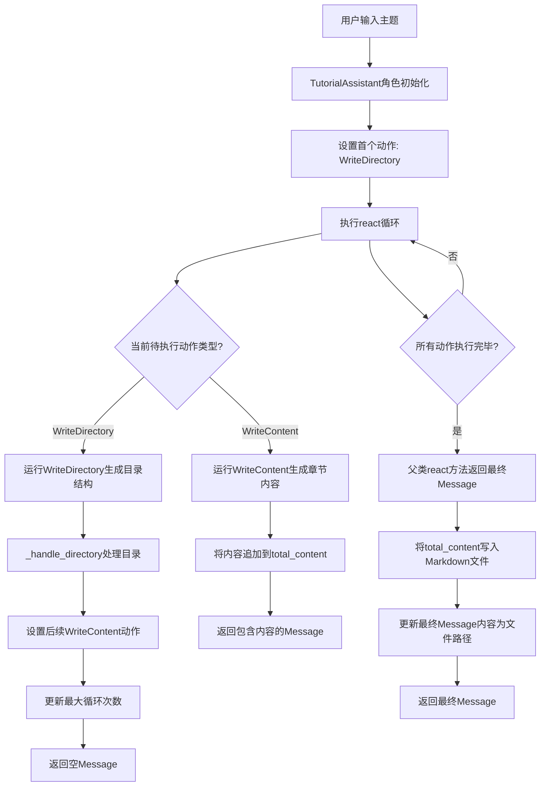
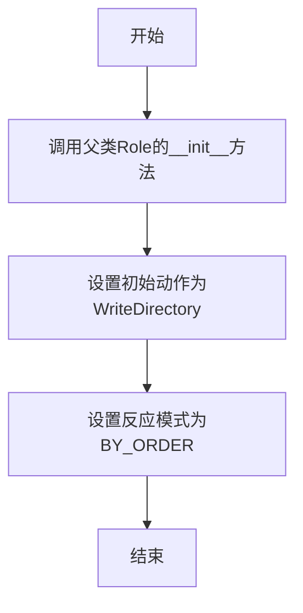
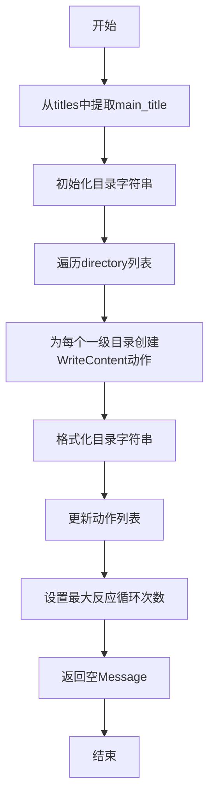
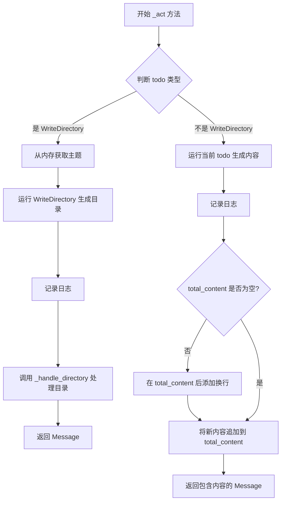

# `.\MetaGPT\metagpt\roles\tutorial_assistant.py` 详细设计文档

该代码定义了一个名为TutorialAssistant的角色类，其核心功能是接收一个主题句子，通过协调一系列动作（如生成目录和内容），自动生成结构化的Markdown格式教程文档，并最终将文档保存到本地文件系统中。

## 整体流程



## 类结构

```
Role (元角色基类)
└── TutorialAssistant (教程助手)
    ├── WriteDirectory (生成目录动作)
    └── WriteContent (生成内容动作)
```

## 全局变量及字段


### `TutorialAssistant.name`
    
角色的名称，默认为'Stitch'。

类型：`str`
    


### `TutorialAssistant.profile`
    
角色的简介，默认为'Tutorial Assistant'。

类型：`str`
    


### `TutorialAssistant.goal`
    
角色的目标，默认为'Generate tutorial documents'。

类型：`str`
    


### `TutorialAssistant.constraints`
    
角色的约束条件，默认为'Strictly follow Markdown's syntax, with neat and standardized layout'。

类型：`str`
    


### `TutorialAssistant.language`
    
生成教程文档的语言，默认为'Chinese'。

类型：`str`
    


### `TutorialAssistant.topic`
    
用户输入的教程主题。

类型：`str`
    


### `TutorialAssistant.main_title`
    
教程的主标题，从目录结构中提取。

类型：`str`
    


### `TutorialAssistant.total_content`
    
最终生成的完整教程文档内容。

类型：`str`
    
    

## 全局函数及方法

### `TutorialAssistant.__init__`

初始化 `TutorialAssistant` 类的实例，设置角色的默认行为，包括指定初始动作（编写目录）和反应模式（按顺序执行）。

参数：

- `kwargs`：`dict`，可变关键字参数，用于传递给父类 `Role` 的初始化方法，允许自定义角色的属性。

返回值：`None`，此方法不返回任何值。

#### 流程图



#### 带注释源码

```python
def __init__(self, **kwargs):
    # 调用父类Role的初始化方法，传递所有关键字参数
    super().__init__(**kwargs)
    # 设置角色的初始动作为WriteDirectory，并指定语言为当前实例的语言属性
    self.set_actions([WriteDirectory(language=self.language)])
    # 设置角色的反应模式为按顺序执行（BY_ORDER）
    self._set_react_mode(react_mode=RoleReactMode.BY_ORDER.value)
```

### `TutorialAssistant._handle_directory`

该方法用于处理教程文档的目录结构。它接收一个包含标题和目录结构的字典，解析并格式化目录，同时更新角色的动作列表以包含后续的“编写内容”动作，并设置反应循环的最大次数。

参数：

- `titles`：`Dict`，一个包含标题和目录结构的字典，例如 `{"title": "xxx", "directory": [{"dir 1": ["sub dir 1", "sub dir 2"]}]}`

返回值：`Message`，一个空的消息对象，用于在角色反应流程中传递控制。

#### 流程图



#### 带注释源码

```python
async def _handle_directory(self, titles: Dict) -> Message:
    """Handle the directories for the tutorial document.

    Args:
        titles: A dictionary containing the titles and directory structure,
                such as {"title": "xxx", "directory": [{"dir 1": ["sub dir 1", "sub dir 2"]}]}

    Returns:
        A message containing information about the directory.
    """
    # 从传入的字典中提取主标题，并存储到实例变量中
    self.main_title = titles.get("title")
    # 初始化目录字符串，以主标题开头
    directory = f"{self.main_title}\n"
    # 将主标题以Markdown一级标题格式添加到总内容中
    self.total_content += f"# {self.main_title}"
    # 获取当前角色已有的动作列表
    actions = list(self.actions)
    # 遍历目录结构中的每个一级目录
    for first_dir in titles.get("directory"):
        # 为每个一级目录创建一个WriteContent动作，并添加到动作列表中
        actions.append(WriteContent(language=self.language, directory=first_dir))
        # 获取一级目录的键名（即目录标题）
        key = list(first_dir.keys())[0]
        # 将一级目录标题添加到目录字符串中
        directory += f"- {key}\n"
        # 遍历该一级目录下的所有二级目录
        for second_dir in first_dir[key]:
            # 将每个二级目录标题添加到目录字符串中，使用缩进表示层级关系
            directory += f"  - {second_dir}\n"
    # 用更新后的动作列表替换角色原有的动作
    self.set_actions(actions)
    # 设置角色反应循环的最大次数为当前动作列表的长度
    self.rc.max_react_loop = len(self.actions)
    # 返回一个空的Message对象，标志此步骤处理完成
    return Message()
```

### `TutorialAssistant._act`

`_act` 方法是 `TutorialAssistant` 角色的核心行动方法。它根据当前待办事项（`self.rc.todo`）的类型执行不同的逻辑：如果待办事项是 `WriteDirectory`，则生成教程目录结构；否则，生成教程的具体内容。每次执行都会更新角色的内部状态（如 `self.total_content`），并返回一个包含执行结果的 `Message` 对象。

参数：

-  `self`：`TutorialAssistant` 类型，表示 `TutorialAssistant` 类的当前实例。

返回值：`Message`，返回一个包含操作结果（如生成的目录或内容）的 `Message` 对象。

#### 流程图



#### 带注释源码

```python
async def _act(self) -> Message:
    """Perform an action as determined by the role.

    Returns:
        A message containing the result of the action.
    """
    # 1. 获取当前待执行的动作
    todo = self.rc.todo

    # 2. 判断动作类型是否为 WriteDirectory（生成目录）
    if type(todo) is WriteDirectory:
        # 2.1 从角色上下文的记忆（memory）中获取最新的消息，其内容应为用户输入的主题
        msg = self.rc.memory.get(k=1)[0]
        self.topic = msg.content

        # 2.2 执行 WriteDirectory 动作，生成教程的目录结构
        resp = await todo.run(topic=self.topic)
        logger.info(resp)  # 记录生成的目录信息到日志

        # 2.3 调用内部方法处理生成的目录结构，并返回一个空的 Message
        return await self._handle_directory(resp)

    # 3. 如果当前动作不是 WriteDirectory，则认为是 WriteContent（生成具体内容）
    # 3.1 执行当前动作（WriteContent），生成教程的某个章节内容
    resp = await todo.run(topic=self.topic)
    logger.info(resp)  # 记录生成的内容到日志

    # 3.2 如果总内容（total_content）不为空，则在追加新内容前添加分隔符
    if self.total_content != "":
        self.total_content += "\n\n\n"

    # 3.3 将新生成的内容追加到总内容中
    self.total_content += resp

    # 3.4 返回一个包含生成内容的 Message 对象，并标明发送者角色
    return Message(content=resp, role=self.profile)
```

### `TutorialAssistant.react`

`TutorialAssistant.react` 方法是 `TutorialAssistant` 角色的主要反应循环入口。它首先调用父类的 `react` 方法，执行角色定义的一系列动作（如生成目录和内容），然后将生成的完整教程内容保存为 Markdown 文件，并返回该文件的路径信息。

参数：
-  `self`：`TutorialAssistant` 类型，`TutorialAssistant` 类的实例。

返回值：`Message` 类型，返回一个 `Message` 对象，其 `content` 字段包含了最终生成的教程文件的完整路径。

#### 流程图

```mermaid
graph TD
    A[开始 react] --> B[调用父类 Role.react 方法];
    B --> C{父类 react 执行完成?};
    C -- 是 --> D[获取父类返回的 Message 对象 msg];
    D --> E[基于当前时间生成文件存储路径 root_path];
    E --> F[将 total_content 写入 root_path/{main_title}.md 文件];
    F --> G[将 msg.content 更新为文件路径];
    G --> H[返回更新后的 msg 对象];
    C -- 否 --> I[处理异常或等待];
    I --> B;
```

#### 带注释源码

```python
async def react(self) -> Message:
    # 1. 调用父类 Role 的 react 方法，执行角色预定义的动作序列（WriteDirectory -> WriteContent...）
    #    这些动作会填充 `self.main_title` 和 `self.total_content` 字段。
    msg = await super().react()

    # 2. 生成一个基于当前时间的目录路径，用于存放输出的教程文件。
    #    TUTORIAL_PATH 是一个基础路径常量。
    root_path = TUTORIAL_PATH / datetime.now().strftime("%Y-%m-%d_%H-%M-%S")

    # 3. 将累积的教程内容 `self.total_content` 写入到指定路径的 Markdown 文件中。
    #    文件名由 `self.main_title` 决定。
    await File.write(root_path, f"{self.main_title}.md", self.total_content.encode("utf-8"))

    # 4. 将返回消息的 `content` 字段更新为生成的文件的完整路径。
    msg.content = str(root_path / f"{self.main_title}.md")

    # 5. 返回包含文件路径信息的消息。
    return msg
```

## 关键组件


### WriteDirectory

负责根据给定的主题生成教程文档的目录结构，包括主标题和章节层级。

### WriteContent

负责根据目录结构生成具体的教程内容，支持多语言，并遵循Markdown语法规范。

### RoleReactMode.BY_ORDER

定义了角色的反应模式为顺序执行，确保动作（如生成目录、生成内容）按预定的顺序依次执行。

### File.write

用于将生成的教程内容（Markdown格式）异步写入到文件系统中，支持指定路径、文件名和编码。

### TUTORIAL_PATH

定义了教程文档存储的基础路径常量，用于组织和管理生成的文档文件。


## 问题及建议


### 已知问题

-   **硬编码的语言设置**：`TutorialAssistant` 类的 `language` 字段默认设置为 `"Chinese"`，这限制了其生成其他语言教程的能力，降低了代码的通用性和可配置性。
-   **文件保存路径的潜在冲突**：`react` 方法使用当前时间（精确到秒）作为文件夹名称来保存文件。如果在同一秒内运行多个实例，可能导致文件路径冲突和数据覆盖。
-   **`_handle_directory` 方法中的类型假设**：该方法假设 `titles` 字典中的 `"directory"` 键对应的值是一个列表，且列表中的每个元素都是字典。如果输入数据的结构不符合此假设，可能导致运行时错误（如 `KeyError` 或 `TypeError`）。
-   **`_act` 方法中的类型检查**：使用 `type(todo) is WriteDirectory` 进行类型检查，这不如使用 `isinstance(todo, WriteDirectory)` 健壮，因为后者能正确处理子类实例。
-   **缺乏错误处理**：代码中没有对文件写入操作（`File.write`）或异步操作（`todo.run`）可能抛出的异常进行捕获和处理，这可能导致程序意外崩溃。
-   **状态管理依赖特定顺序**：`_act` 方法依赖于 `self.rc.todo` 的执行顺序来管理状态（如首次运行 `WriteDirectory`，后续运行 `WriteContent`）。如果 `self.actions` 列表的顺序被意外修改，或 `Role` 基类的反应循环逻辑发生变化，可能导致流程错误。

### 优化建议

-   **将语言设置为可配置参数**：建议将 `language` 字段的默认值设为 `None` 或一个更通用的默认值（如 `"English"`），并通过 `__init__` 方法的参数允许外部传入，以增强灵活性。
-   **改进文件保存命名策略**：在生成文件保存路径时，除了时间戳，可以加入一个随机字符串或唯一标识符（如 `uuid`），或者使用主题 (`self.topic`) 的一部分来构造文件名，以避免潜在的冲突。
-   **增强 `_handle_directory` 方法的鲁棒性**：在访问 `titles` 字典的键和进行迭代之前，添加数据验证和类型检查。例如，使用 `.get()` 方法并提供默认值，或在使用前检查 `isinstance(titles.get('directory'), list)`。
-   **使用 `isinstance` 进行类型检查**：将 `_act` 方法中的 `type(todo) is WriteDirectory` 改为 `isinstance(todo, WriteDirectory)`，以提高代码的健壮性和可扩展性。
-   **添加异常处理**：在 `react` 和 `_act` 方法中，特别是在执行 `File.write` 和 `todo.run` 的地方，添加 `try-except` 块来捕获可能的异常（如 `IOError`, `RuntimeError`），并进行适当的日志记录或错误恢复，避免程序完全中断。
-   **明确状态转换逻辑**：考虑将 `_handle_directory` 中构建后续 `WriteContent` 动作列表的逻辑，以及 `_act` 中区分首次和后续动作的逻辑，封装成更清晰的状态管理方法或使用状态模式，以减少对隐式顺序的依赖。
-   **分离关注点**：`react` 方法目前承担了保存文件并修改返回消息内容的职责。考虑将文件保存的逻辑提取到一个单独的方法（如 `_save_tutorial`）中，使 `react` 方法更专注于协调反应流程，提高代码的可测试性和可维护性。


## 其它


### 设计目标与约束

本模块的核心设计目标是创建一个能够根据用户输入的一个主题句子，自动生成结构化、格式规范的Markdown教程文档的智能助手。其核心约束包括：1) 严格遵循Markdown语法规范，确保生成文档的布局整洁、标准化；2) 生成过程需遵循预定义的、顺序化的流程（先生成目录大纲，再填充各章节内容）；3) 最终输出为特定格式（.md文件）并保存至指定路径。

### 错误处理与异常设计

当前代码中显式的错误处理逻辑较为有限。主要依赖于`metagpt`框架底层`Action`（如`WriteDirectory`, `WriteContent`）的`run`方法内部可能进行的异常捕获和处理，以及`File.write`方法的潜在IO异常。`TutorialAssistant`类本身未对`await todo.run(...)`的调用结果进行异常检查，也未对文件写入失败的情况进行处理。这可能导致运行时错误未被捕获，进程异常终止，或用户无法得知生成失败的具体原因。

### 数据流与状态机

数据流始于用户通过`Message`传入的一个主题句子（`self.topic`）。状态转换如下：
1.  **初始状态**：角色初始化，设置第一个动作为`WriteDirectory`。
2.  **生成目录状态**：执行`WriteDirectory.run`，根据主题生成目录结构字典。随后进入`_handle_directory`方法，解析字典，设置`main_title`，构建目录文本，并为每个一级目录创建`WriteContent`动作，更新待执行动作列表。
3.  **生成内容状态**：循环执行`_act`方法，依次调用每个`WriteContent`动作的`run`方法，生成对应章节的Markdown内容，并拼接到`total_content`中。
4.  **完成与持久化状态**：所有动作执行完毕后，在`react`方法覆盖中，将累积的`total_content`写入到以时间戳命名的目录下的Markdown文件中，并更新返回消息的内容为文件路径。
状态机的驱动由父类`Role`的`react`循环机制控制，`TutorialAssistant`通过`_set_react_mode(RoleReactMode.BY_ORDER.value)`将其设置为顺序执行模式。

### 外部依赖与接口契约

1.  **内部依赖（MetaGPT框架）**:
    *   `Role`基类：提供角色反应循环、记忆、上下文等基础机制。
    *   `WriteDirectory`, `WriteContent`动作类：核心的内容生成能力，本类通过`set_actions`和`run`方法调用它们，契约是它们接受`topic`、`language`、`directory`等参数并返回结构化的数据或文本。
    *   `Message`类：用于在角色间或内部传递信息。
    *   `TUTORIAL_PATH`常量：定义了教程文件的输出根目录。
    *   `File`工具类：提供文件写入的异步接口。
    *   `logger`：用于记录信息日志。
2.  **语言与格式约束**：生成内容需符合`self.language`（默认为中文）和Markdown语法。
3.  **运行环境**：依赖Python异步运行时（asyncio）。

### 并发与性能考量

代码基于异步I/O（`async/await`）编写，这有利于在等待LLM响应或文件IO时释放控制权，提高整体系统的吞吐量。然而，当前实现是顺序执行每个`WriteContent`动作，章节内容生成是串行的，未利用潜在的并发机会（例如并行生成多个章节）。对于长教程，这可能导致总生成时间较长。性能瓶颈主要在于外部`Action`（如调用大语言模型）的响应延迟。

### 安全与合规性

1.  **内容安全**：生成内容的安全性依赖于底层`WriteDirectory`和`WriteContent`动作所使用的大语言模型的内容安全策略和过滤机制。本模块未额外进行内容审查或过滤。
2.  **路径安全**：文件保存路径使用了当前时间戳来创建唯一目录，避免了文件名冲突，但未对用户输入的`self.topic`或生成的`self.main_title`进行文件名安全字符过滤，如果标题包含特殊字符（如`/`, `:`, `*`等），可能导致文件创建失败或路径遍历风险。`File.write`的具体实现可能处理了部分情况，但此处存在潜在风险。
3.  **资源消耗**：生成过程会消耗大语言模型的Token，需注意成本控制。本模块自身未设置生成篇幅或复杂度的限制。

### 配置与可扩展性

1.  **硬编码配置**：角色的`name`, `profile`, `goal`, `constraints`, `language`等属性在类定义中硬编码，限制了实例化时的灵活性。虽然可通过`**kwargs`传入`__init__`并由父类处理，但当前代码未展示覆盖这些默认值的用法。
2.  **扩展点**：
    *   `_handle_directory`方法：可以覆盖此方法来定制目录结构的处理逻辑。
    *   `_act`方法：可以覆盖此方法来改变单个动作执行前后的行为。
    *   `react`方法：已覆盖，用于添加文件保存的后处理逻辑，这是主要的输出扩展点。
    *   通过替换或增加`self.actions`列表中的`Action`，可以改变生成流程（例如，在生成内容后添加一个`ReviewContent`动作）。
3.  **输出定制**：输出文件的路径格式（`TUTORIAL_PATH / timestamp`）和文件名（`{self.main_title}.md`）是固定的，无法通过配置轻松修改。

### 测试策略建议

1.  **单元测试**：
    *   `_handle_directory`方法：测试其能否正确解析输入字典，设置`main_title`和`total_content`头部，正确创建并添加`WriteContent`动作，以及计算`max_react_loop`。
    *   `_act`方法：测试在`todo`为`WriteDirectory`和`WriteContent`两种分支下的逻辑，特别是内容拼接部分。
    *   `react`方法：测试文件是否被正确写入预期路径，以及返回消息的内容是否正确更新为文件路径。可使用临时目录和模拟（mock）`File.write`进行测试。
2.  **集成测试**：模拟完整的角色运行流程，使用Mock替代真实的`WriteDirectory`和`WriteContent`动作，验证从输入主题到最终生成文件路径的端到端流程。
3.  **场景测试**：测试不同语言设置、包含特殊字符的主题、生成空内容或异常内容时的行为。

    