# `.\MetaGPT\metagpt\schema.py` 详细设计文档

该文件是MetaGPT项目的核心数据模型定义模块，提供了用于智能体间通信、任务规划、文档管理、代码上下文和序列化等功能的Pydantic基类。它定义了Message、Task、Plan、Document、MessageQueue等核心数据结构，以及用于代码生成、测试和运行的上下文类，构成了整个多智能体协作系统的基础数据契约。

## 整体流程

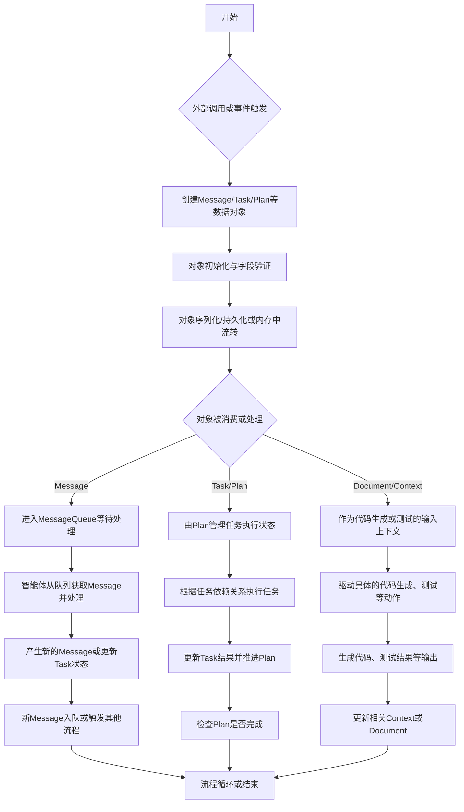

## 类结构

```
BaseModel (Pydantic基类)
├── SerializationMixin (序列化混入类)
├── SimpleMessage (简单消息)
├── Document (文档模型)
├── Documents (文档集合)
├── Resource (资源描述)
├── Message (核心消息模型)
│   ├── UserMessage
│   ├── SystemMessage
│   └── AIMessage
├── Task (任务模型)
├── TaskResult (任务结果)
├── Plan (任务计划模型)
├── MessageQueue (消息队列)
├── BaseContext (上下文基类, 抽象类)
│   ├── CodingContext
│   ├── TestingContext
│   ├── RunCodeContext
│   └── RunCodeResult
├── CodeSummarizeContext
├── CodePlanAndChangeContext
├── UMLClassMeta (UML元数据基类)
│   ├── UMLClassAttribute
│   ├── UMLClassMethod
│   └── UMLClassView
├── BaseEnum (枚举基类)
└── LongTermMemoryItem (长时记忆项)
```

## 全局变量及字段


### `T`
    
泛型类型变量，用于表示继承自BaseModel的类型约束。

类型：`TypeVar`
    


### `SimpleMessage.content`
    
消息的文本内容。

类型：`str`
    


### `SimpleMessage.role`
    
消息发送者的角色标识。

类型：`str`
    


### `Document.root_path`
    
文档相对于项目根目录的路径。

类型：`str`
    


### `Document.filename`
    
文档的文件名。

类型：`str`
    


### `Document.content`
    
文档的文本内容。

类型：`str`
    


### `Documents.docs`
    
文档集合，键为文件名，值为Document实例。

类型：`Dict[str, Document]`
    


### `Resource.resource_type`
    
资源的类型标识。

类型：`str`
    


### `Resource.value`
    
资源的具体内容字符串。

类型：`str`
    


### `Resource.description`
    
资源的解释说明。

类型：`str`
    


### `Message.id`
    
消息的唯一标识符，用于消息追踪和路由。

类型：`str`
    


### `Message.content`
    
消息的自然语言内容，用于用户或代理。

类型：`str`
    


### `Message.instruct_content`
    
结构化指令内容，通常由ActionOutput或BaseModel子类表示。

类型：`Optional[BaseModel]`
    


### `Message.role`
    
消息发送者的角色，如system/user/assistant。

类型：`str`
    


### `Message.cause_by`
    
触发此消息的动作或事件的类名。

类型：`str`
    


### `Message.sent_from`
    
消息发送者的标识符。

类型：`str`
    


### `Message.send_to`
    
消息接收者的标识符集合。

类型：`set[str]`
    


### `Message.metadata`
    
消息的元数据，用于存储额外信息。

类型：`Dict[str, Any]`
    


### `Task.task_id`
    
任务的唯一标识符。

类型：`str`
    


### `Task.dependent_task_ids`
    
当前任务依赖的其他任务ID列表。

类型：`list[str]`
    


### `Task.instruction`
    
任务的执行指令或描述。

类型：`str`
    


### `Task.task_type`
    
任务的类型标识。

类型：`str`
    


### `Task.code`
    
任务相关的代码内容。

类型：`str`
    


### `Task.result`
    
任务的执行结果。

类型：`str`
    


### `Task.is_success`
    
任务是否执行成功的标志。

类型：`bool`
    


### `Task.is_finished`
    
任务是否已完成的标志。

类型：`bool`
    


### `Task.assignee`
    
任务分配的执行者标识。

类型：`str`
    


### `TaskResult.code`
    
任务执行过程中生成的代码。

类型：`str`
    


### `TaskResult.result`
    
任务执行的结果描述。

类型：`str`
    


### `TaskResult.is_success`
    
任务是否执行成功的标志。

类型：`bool`
    


### `Plan.goal`
    
计划的目标描述。

类型：`str`
    


### `Plan.context`
    
计划的上下文信息。

类型：`str`
    


### `Plan.tasks`
    
计划中的任务列表。

类型：`list[Task]`
    


### `Plan.task_map`
    
任务ID到Task实例的映射，用于快速查找。

类型：`dict[str, Task]`
    


### `Plan.current_task_id`
    
当前正在执行的任务ID。

类型：`str`
    


### `MessageQueue._queue`
    
内部消息队列，用于异步消息处理。

类型：`Queue`
    


### `CodingContext.filename`
    
代码文件的名称。

类型：`str`
    


### `CodingContext.design_doc`
    
设计文档的实例。

类型：`Optional[Document]`
    


### `CodingContext.task_doc`
    
任务文档的实例。

类型：`Optional[Document]`
    


### `CodingContext.code_doc`
    
代码文档的实例。

类型：`Optional[Document]`
    


### `CodingContext.code_plan_and_change_doc`
    
代码计划和变更文档的实例。

类型：`Optional[Document]`
    


### `TestingContext.filename`
    
测试文件的名称。

类型：`str`
    


### `TestingContext.code_doc`
    
被测试代码的文档实例。

类型：`Document`
    


### `TestingContext.test_doc`
    
测试文档的实例。

类型：`Optional[Document]`
    


### `RunCodeContext.mode`
    
代码运行模式，如'script'或'test'。

类型：`str`
    


### `RunCodeContext.code`
    
待运行的代码字符串。

类型：`Optional[str]`
    


### `RunCodeContext.code_filename`
    
代码文件的名称。

类型：`str`
    


### `RunCodeContext.test_code`
    
测试代码字符串。

类型：`Optional[str]`
    


### `RunCodeContext.test_filename`
    
测试文件的名称。

类型：`str`
    


### `RunCodeContext.command`
    
运行代码时使用的命令行参数列表。

类型：`List[str]`
    


### `RunCodeContext.working_directory`
    
代码运行的工作目录路径。

类型：`str`
    


### `RunCodeContext.additional_python_paths`
    
运行代码时附加的Python路径列表。

类型：`List[str]`
    


### `RunCodeContext.output_filename`
    
输出文件的名称。

类型：`Optional[str]`
    


### `RunCodeContext.output`
    
代码运行的输出内容。

类型：`Optional[str]`
    


### `RunCodeResult.summary`
    
代码运行结果的摘要。

类型：`str`
    


### `RunCodeResult.stdout`
    
代码运行的标准输出内容。

类型：`str`
    


### `RunCodeResult.stderr`
    
代码运行的标准错误输出内容。

类型：`str`
    


### `CodeSummarizeContext.design_filename`
    
设计文件的名称。

类型：`str`
    


### `CodeSummarizeContext.task_filename`
    
任务文件的名称。

类型：`str`
    


### `CodeSummarizeContext.codes_filenames`
    
代码文件的名称列表。

类型：`List[str]`
    


### `CodeSummarizeContext.reason`
    
代码总结的原因描述。

类型：`str`
    


### `CodePlanAndChangeContext.requirement`
    
需求描述。

类型：`str`
    


### `CodePlanAndChangeContext.issue`
    
问题描述。

类型：`str`
    


### `CodePlanAndChangeContext.prd_filename`
    
产品需求文档的文件名。

类型：`str`
    


### `CodePlanAndChangeContext.design_filename`
    
设计文档的文件名。

类型：`str`
    


### `CodePlanAndChangeContext.task_filename`
    
任务文档的文件名。

类型：`str`
    


### `UMLClassMeta.name`
    
UML类或成员的名称。

类型：`str`
    


### `UMLClassMeta.visibility`
    
UML类或成员的可见性标识，如'+'、'#'、'-'。

类型：`str`
    


### `UMLClassAttribute.value_type`
    
UML类属性的值类型。

类型：`str`
    


### `UMLClassAttribute.default_value`
    
UML类属性的默认值。

类型：`str`
    


### `UMLClassMethod.args`
    
UML类方法的参数列表。

类型：`List[UMLClassAttribute]`
    


### `UMLClassMethod.return_type`
    
UML类方法的返回值类型。

类型：`str`
    


### `UMLClassView.attributes`
    
UML类的属性列表。

类型：`List[UMLClassAttribute]`
    


### `UMLClassView.methods`
    
UML类的方法列表。

类型：`List[UMLClassMethod]`
    


### `LongTermMemoryItem.message`
    
长期记忆项中存储的消息实例。

类型：`Message`
    


### `LongTermMemoryItem.created_at`
    
长期记忆项的创建时间戳。

类型：`Optional[float]`
    
    

## 全局函数及方法

### `SerializationMixin.serialize`

该方法用于将当前实例序列化为JSON格式并保存到指定文件。如果未提供文件路径，则使用类默认的序列化路径。序列化过程中，如果发生异常，会被`handle_exception`装饰器捕获并返回`None`。

参数：

- `file_path`：`str`，可选参数，指定保存序列化数据的JSON文件路径。如果未提供，则使用`get_serialization_path`方法生成的默认路径。

返回值：`str`，返回保存序列化数据的文件路径。如果序列化过程中发生异常，则返回`None`。

#### 流程图

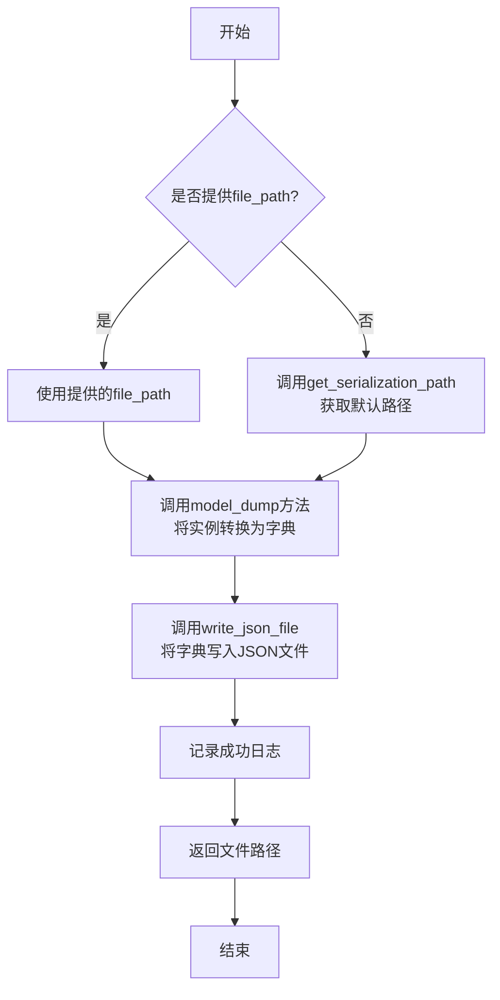

#### 带注释源码

```python
@handle_exception
def serialize(self, file_path: str = None) -> str:
    """Serializes the current instance to a JSON file.

    If an exception occurs, `handle_exception` will catch it and return `None`.

    Args:
        file_path (str, optional): The path to the JSON file where the instance will be saved. Defaults to None.

    Returns:
        str: The path to the JSON file where the instance was saved.
    """

    # 如果未提供文件路径，则使用类默认的序列化路径
    file_path = file_path or self.get_serialization_path()

    # 将当前实例转换为字典格式
    serialized_data = self.model_dump()

    # 将字典数据写入JSON文件，use_fallback=True表示写入失败时尝试使用备用方法
    write_json_file(file_path, serialized_data, use_fallback=True)
    # 记录序列化成功的调试日志
    logger.debug(f"{self.__class__.__qualname__} serialization successful. File saved at: {file_path}")

    # 返回保存序列化数据的文件路径
    return file_path
```

### `SerializationMixin.deserialize`

`SerializationMixin.deserialize` 是一个类方法，用于从指定的 JSON 文件中读取数据，并将其反序列化为当前类的一个实例。如果未提供文件路径，则使用类默认的序列化路径。该方法被 `@handle_exception` 装饰器包裹，以捕获并处理可能发生的异常。

参数：

- `file_path`：`str`，可选参数，指定要读取的 JSON 文件路径。如果未提供，则使用类默认的序列化路径。

返回值：`BaseModel`，返回反序列化后的类实例。

#### 流程图

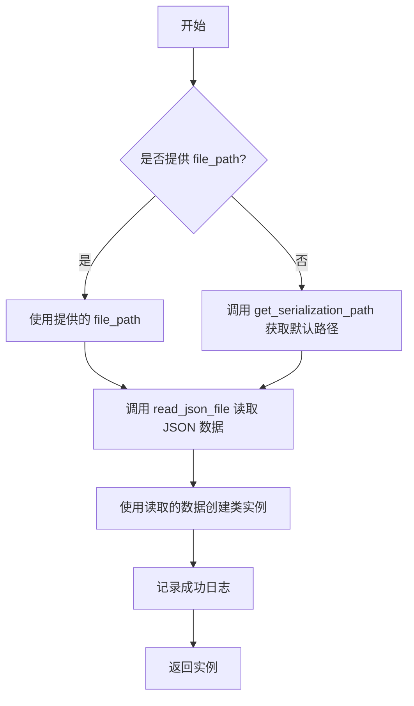

#### 带注释源码

```python
@classmethod
@handle_exception
def deserialize(cls, file_path: str = None) -> BaseModel:
    """Deserializes a JSON file to an instance of cls.

    If an exception occurs, `handle_exception` will catch it and return `None`.

    Args:
        file_path (str, optional): The path to the JSON file to read from. Defaults to None.

    Returns:
        An instance of the cls.
    """

    # 如果未提供文件路径，则使用类默认的序列化路径
    file_path = file_path or cls.get_serialization_path()

    # 从指定路径读取 JSON 数据
    data: dict = read_json_file(file_path)

    # 使用读取的数据创建类实例
    model = cls(**data)
    # 记录成功日志
    logger.debug(f"{cls.__qualname__} deserialization successful. Instance created from file: {file_path}")

    # 返回创建的实例
    return model
```

### `SerializationMixin.get_serialization_path`

该方法是一个类方法，用于根据调用它的类名生成一个默认的序列化文件路径。它不依赖于任何实例状态，通过类名构造一个标准化的文件路径，用于序列化（保存）和反序列化（加载）类的实例。

参数：
-  `cls`：`Type[SerializationMixin]`，调用此方法的类本身（类方法的第一个参数）。

返回值：`str`，返回一个字符串，表示序列化文件的完整路径。该路径由常量 `SERDESER_PATH` 和类名拼接而成，格式为 `{SERDESER_PATH}/{ClassName}.json`。

#### 流程图

```mermaid
flowchart TD
    A[开始] --> B[获取调用类的类名<br>cls.__qualname__]
    B --> C[拼接路径<br>SERDESER_PATH / f"{cls.__qualname__}.json"]
    C --> D[将Path对象转换为字符串]
    D --> E[返回文件路径字符串]
    E --> F[结束]
```

#### 带注释源码

```python
@classmethod
def get_serialization_path(cls) -> str:
    """Get the serialization path for the class.

    This method constructs a file path for serialization based on the class name.
    The default path is constructed as './workspace/storage/ClassName.json', where 'ClassName'
    is the name of the class.

    Returns:
        str: The path to the serialization file.
    """
    # 使用类名（cls.__qualname__）和预定义的常量 SERDESER_PATH 来构建文件路径。
    # Path对象通过 '/' 运算符进行路径拼接，最后转换为字符串返回。
    return str(SERDESER_PATH / f"{cls.__qualname__}.json")
```

### `Document.get_meta`

该方法用于获取文档的元数据，返回一个新的`Document`实例，该实例包含与原文档相同的根路径和文件名，但内容为空。

参数：
- 无

返回值：`Document`，一个新的`Document`实例，包含原文档的根路径和文件名。

#### 流程图

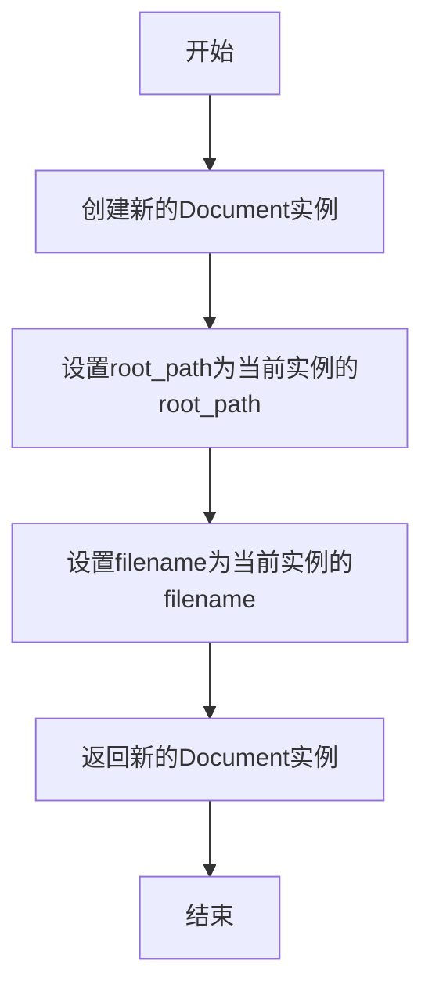

#### 带注释源码

```python
def get_meta(self) -> Document:
    """Get metadata of the document.

    :return: A new Document instance with the same root path and filename.
    """

    return Document(root_path=self.root_path, filename=self.filename)
```

### `Document.root_relative_path`

这是一个计算文档相对于其根目录的完整路径的属性。它通过将文档的根路径（`root_path`）和文件名（`filename`）连接起来，生成一个表示文档在文件系统中位置的相对路径字符串。

参数：
- 无参数。这是一个属性（property），不接受参数。

返回值：`str`，返回一个字符串，表示文档相对于其根目录的完整路径。

#### 流程图

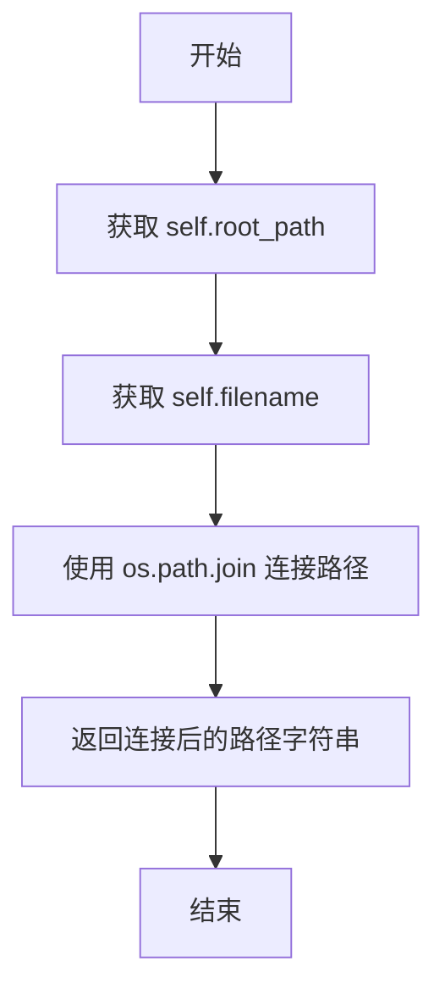

#### 带注释源码

```python
@property
def root_relative_path(self):
    """Get relative path from root of git repository.

    :return: relative path from root of git repository.
    """
    # 使用 os.path.join 方法将根路径和文件名安全地连接起来
    # 这确保了路径分隔符在不同操作系统下的正确性
    return os.path.join(self.root_path, self.filename)
```

### `Document.__str__`

该方法重写了 `__str__` 魔术方法，用于将 `Document` 对象转换为字符串表示形式。它直接返回文档的 `content` 字段内容，使得 `Document` 对象在需要字符串上下文中（如打印、日志记录）能够自动显示其核心内容。

参数：
- `self`：`Document` 类型，表示当前 `Document` 实例。

返回值：`str` 类型，返回文档的 `content` 字段内容。

#### 流程图

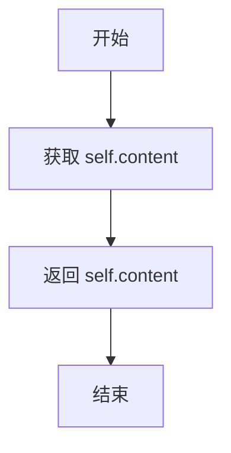

#### 带注释源码

```python
def __str__(self):
    # 直接返回文档的 content 字段内容
    return self.content
```

### `Document.__repr__`

该方法返回文档对象的字符串表示，主要用于调试和日志输出。它直接返回文档的内容字符串，使得在打印或日志中能够直观地看到文档的实际内容。

参数：

- `self`：`Document`，当前文档实例

返回值：`str`，文档的内容字符串

#### 流程图

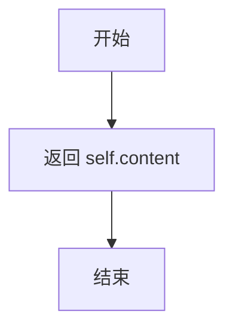

#### 带注释源码

```python
def __repr__(self):
    # 返回文档的内容字符串作为对象的表示
    return self.content
```

### `Document.load`

`Document.load` 是一个类方法，用于从指定的文件路径异步加载文档内容，并创建一个 `Document` 实例。它会读取文件内容，并根据可选的 `project_path` 参数设置文档的根路径和文件名。

参数：

- `filename`：`Union[str, Path]`，要加载的文件的路径。
- `project_path`：`Optional[Union[str, Path]]`，可选的项目根路径，用于计算文档的相对路径。

返回值：`Optional[Document]`，成功时返回一个 `Document` 实例，如果文件不存在则返回 `None`。

#### 流程图

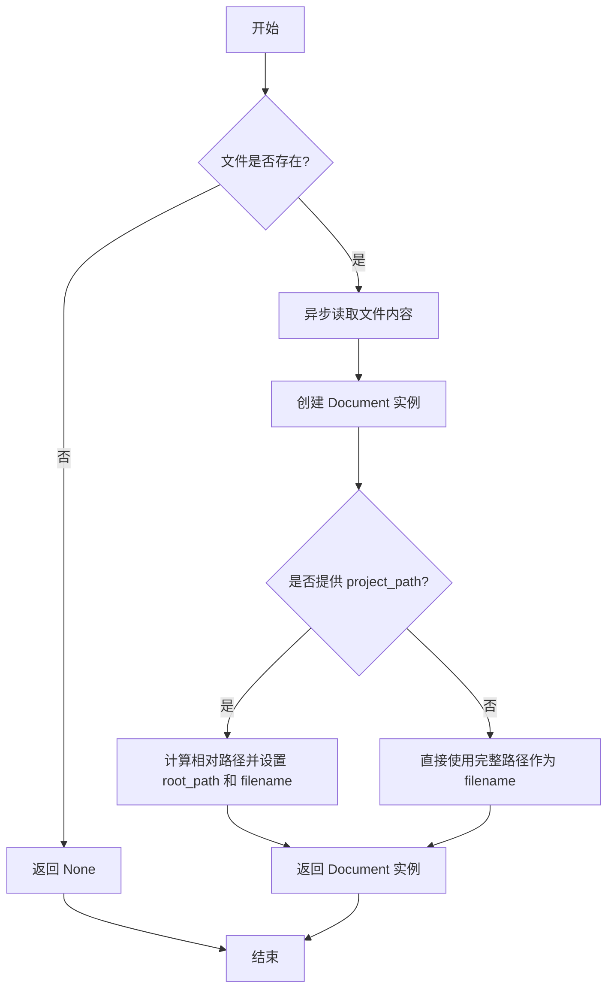

#### 带注释源码

```python
@classmethod
async def load(
    cls, filename: Union[str, Path], project_path: Optional[Union[str, Path]] = None
) -> Optional["Document"]:
    """
    Load a document from a file.

    Args:
        filename (Union[str, Path]): The path to the file to load.
        project_path (Optional[Union[str, Path]], optional): The path to the project. Defaults to None.

    Returns:
        Optional[Document]: The loaded document, or None if the file does not exist.

    """
    # 检查文件是否存在，如果不存在则返回 None
    if not filename or not Path(filename).exists():
        return None
    # 异步读取文件内容
    content = await aread(filename=filename)
    # 创建 Document 实例，初始时使用完整路径作为 filename
    doc = cls(content=content, filename=str(filename))
    # 如果提供了 project_path 并且文件路径相对于 project_path，则计算相对路径
    if project_path and Path(filename).is_relative_to(project_path):
        # 设置 root_path 为相对于 project_path 的父目录
        doc.root_path = Path(filename).relative_to(project_path).parent
        # 设置 filename 为文件名（不含路径）
        doc.filename = Path(filename).name
    return doc
```

### `Documents.from_iterable`

`Documents.from_iterable` 是一个类方法，用于从一个可迭代的 `Document` 对象集合创建一个 `Documents` 实例。它遍历传入的 `Document` 对象，以每个文档的文件名作为键，文档本身作为值，构建一个字典，并最终用这个字典初始化并返回一个新的 `Documents` 对象。

参数：

- `documents`：`Iterable[Document]`，一个包含 `Document` 实例的可迭代对象（如列表、元组等）。

返回值：`Documents`，一个新的 `Documents` 实例，其内部的 `docs` 字典包含了传入的所有文档。

#### 流程图

```mermaid
flowchart TD
    A[开始: from_iterable(documents)] --> B{检查 documents 是否为空?}
    B -- 是 --> C[返回空字典的 Documents 实例]
    B -- 否 --> D[遍历 documents 中的每个 Document 对象]
    D --> E[以 doc.filename 为键, doc 为值<br>存入字典 docs]
    E --> F[遍历结束?]
    F -- 否 --> D
    F -- 是 --> G[使用 docs 字典创建并返回 Documents 实例]
    G --> H[结束]
```

#### 带注释源码

```python
    @classmethod
    def from_iterable(cls, documents: Iterable[Document]) -> Documents:
        """Create a Documents instance from a list of Document instances.

        :param documents: A list of Document instances.
        :return: A Documents instance.
        """

        # 使用字典推导式，遍历传入的 documents 可迭代对象。
        # 对于其中的每一个 Document 对象 `doc`，使用其 `filename` 属性作为键，`doc` 本身作为值。
        # 这样构建了一个字典 `docs`，键是文件名，值是对应的 Document 对象。
        docs = {doc.filename: doc for doc in documents}
        
        # 调用 Documents 类的构造函数（通过 `cls`），传入构建好的 `docs` 字典，
        # 创建并返回一个新的 Documents 实例。
        return Documents(docs=docs)
```

### `Documents.to_action_output`

将 `Documents` 实例转换为 `ActionOutput` 实例，以便在动作系统中使用。该方法将文档集合序列化为 JSON 字符串，并封装到 `ActionOutput` 中，同时保留原始的 `Documents` 对象作为指令内容。

参数：

-  `self`：`Documents`，当前 `Documents` 实例

返回值：`ActionOutput`，包含序列化文档内容的 `ActionOutput` 实例

#### 流程图

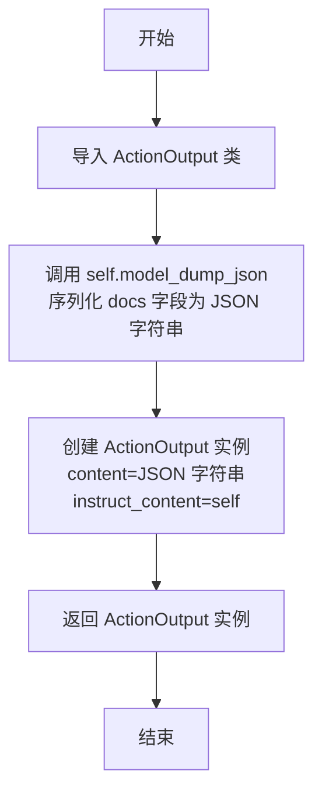

#### 带注释源码

```python
def to_action_output(self) -> "ActionOutput":
    """Convert to action output string.

    :return: A string representing action output.
    """
    # 导入 ActionOutput 类，避免循环导入
    from metagpt.actions.action_output import ActionOutput

    # 使用 Pydantic 的 model_dump_json 方法将当前实例的 docs 字段序列化为 JSON 字符串
    # 创建 ActionOutput 实例，content 为 JSON 字符串，instruct_content 为当前 Documents 实例
    return ActionOutput(content=self.model_dump_json(), instruct_content=self)
```

### `Message.check_id`

`Message.check_id` 是一个类方法，用于在 Pydantic 模型字段验证阶段检查并确保 `Message` 实例的 `id` 字段具有一个有效的值。如果传入的 `id` 为空（例如空字符串或 `None`），该方法会生成一个新的 UUID 字符串作为默认值，从而保证每个 `Message` 实例都有一个唯一的标识符。

参数：

- `id`：`str`，待验证的 `Message` 实例的 `id` 字段值。

返回值：`str`，验证并处理后的 `id` 值。如果输入为空，则返回一个新的 UUID 十六进制字符串。

#### 流程图

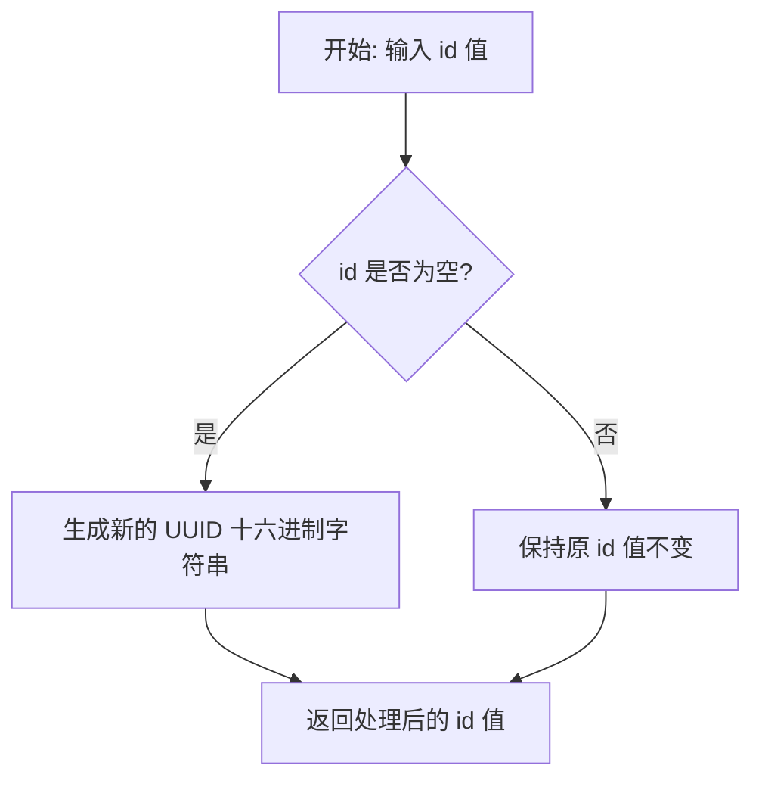

#### 带注释源码

```python
    @field_validator("id", mode="before")
    @classmethod
    def check_id(cls, id: str) -> str:
        # 检查传入的 id 值是否为空（如空字符串或 None）
        # 如果为空，则使用 uuid 模块生成一个新的唯一标识符（UUID）并转换为十六进制字符串
        # 如果不为空，则直接返回原值
        return id if id else uuid.uuid4().hex
```

### `Message.check_instruct_content`

`Message.check_instruct_content` 是一个类方法，用于在 `Message` 对象初始化时，对 `instruct_content` 字段进行验证和转换。它的核心功能是：当 `instruct_content` 以字典形式提供时，根据字典中的元数据（如类名、模块名或映射关系）动态地将其反序列化为对应的 Pydantic `BaseModel` 子类的实例。这确保了 `instruct_content` 字段在 `Message` 对象内部始终以结构化的对象形式存在，便于后续的类型安全操作和数据访问。

参数：

- `ic`：`Any`，传入的 `instruct_content` 原始值，可能为 `None`、字典或 `BaseModel` 实例。

返回值：`BaseModel`，转换后的 `instruct_content` 对象。如果输入为 `None` 或非字典，则直接返回原值。

#### 流程图

```mermaid
flowchart TD
    A[开始: 输入 ic] --> B{ic 是否为 None 或非 dict?}
    B -- 是 --> C[直接返回 ic]
    B -- 否 --> D{dict 中是否包含 'class' 键?}
    D -- 否 --> E[抛出 KeyError: 缺少必要键]
    D -- 是 --> F{dict 中是否包含 'mapping' 键?}
    F -- 是 --> G[处理 ActionNode 兼容格式<br>导入 ActionNode 类并创建模型]
    F -- 否 --> H{dict 中是否包含 'module' 键?}
    H -- 是 --> I[处理标准 BaseModel 子类<br>根据 module 和 class 动态导入类]
    H -- 否 --> E
    G --> J[使用 dict['value'] 初始化模型对象]
    I --> J
    J --> K[返回模型对象]
    C --> L[结束]
    K --> L
    E --> L
```

#### 带注释源码

```python
    @field_validator("instruct_content", mode="before")
    @classmethod
    def check_instruct_content(cls, ic: Any) -> BaseModel:
        # 如果 ic 存在且为字典，并且包含 'class' 键，则需要进行反序列化
        if ic and isinstance(ic, dict) and "class" in ic:
            if "mapping" in ic:
                # 兼容自定义的 ActionOutput 格式。
                # 1. 将存储的映射字符串转换回字典。
                mapping = actionoutput_str_to_mapping(ic["mapping"])
                # 2. 动态导入 ActionNode 类（避免循环导入）。
                actionnode_class = import_class("ActionNode", "metagpt.actions.action_node")
                # 3. 使用类名和映射关系动态创建一个 Pydantic 模型类。
                ic_obj = actionnode_class.create_model_class(class_name=ic["class"], mapping=mapping)
            elif "module" in ic:
                # 处理标准的 BaseModel 子类。
                # 根据模块路径和类名动态导入对应的类。
                ic_obj = import_class(ic["class"], ic["module"])
            else:
                # 如果既没有 'mapping' 也没有 'module'，则无法确定如何构建对象，抛出异常。
                raise KeyError("missing required key to init Message.instruct_content from dict")
            # 使用字典中的 'value' 部分（即实际数据）来实例化上面创建或导入的模型类。
            ic = ic_obj(**ic["value"])
        # 返回处理后的 ic（可能是原值，也可能是新创建的 BaseModel 实例）。
        return ic
```

### `Message.check_cause_by`

`Message.check_cause_by` 是一个类方法，用于验证和规范化 `Message` 类中 `cause_by` 字段的值。它确保 `cause_by` 字段始终是一个字符串，如果传入的值为空或 `None`，则提供一个默认值。

参数：

- `cls`：`Type[Message]`，`Message` 类本身，用于类方法的上下文。
- `cause_by`：`Any`，传入的 `cause_by` 字段的原始值，可以是任何类型。

返回值：`str`，规范化后的字符串值，表示消息的起因。

#### 流程图

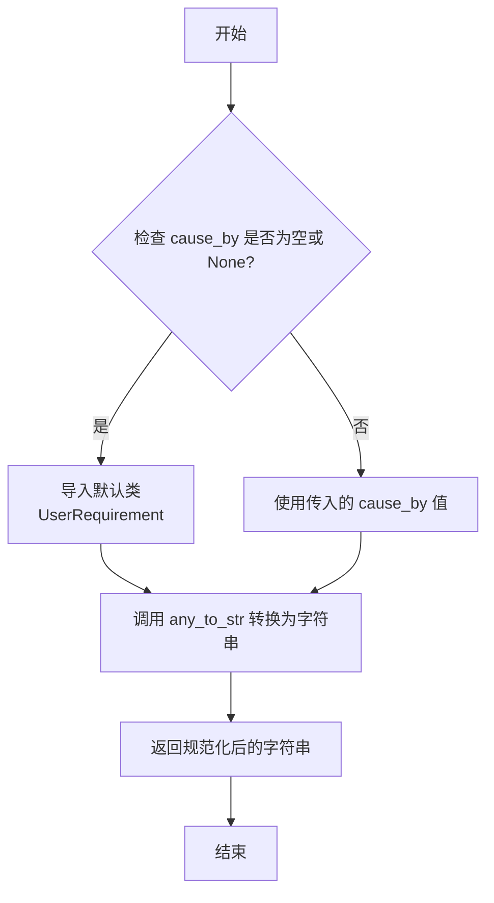

#### 带注释源码

```python
    @field_validator("cause_by", mode="before")
    @classmethod
    def check_cause_by(cls, cause_by: Any) -> str:
        # 如果 cause_by 为空或 None，则导入默认的 UserRequirement 类作为默认值
        # 否则，使用传入的 cause_by 值
        # 最后，调用 any_to_str 函数将值转换为字符串并返回
        return any_to_str(cause_by if cause_by else import_class("UserRequirement", "metagpt.actions.add_requirement"))
```

### `Message.check_sent_from`

`Message.check_sent_from` 是一个类方法，用于在 `Message` 对象初始化时验证和转换 `sent_from` 字段。它确保 `sent_from` 字段被正确转换为字符串类型，如果传入的值为空，则将其设置为空字符串。

参数：

- `sent_from`：`Any`，表示消息发送者的原始值，可以是任何类型。

返回值：`str`，转换后的字符串类型的 `sent_from` 值。

#### 流程图

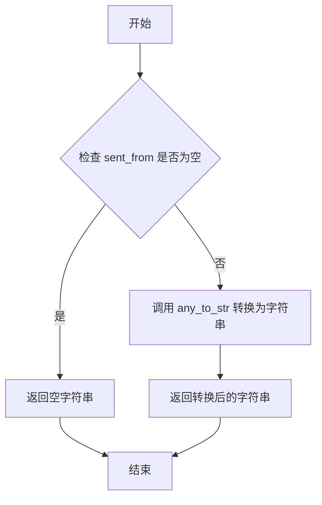

#### 带注释源码

```python
@field_validator("sent_from", mode="before")
@classmethod
def check_sent_from(cls, sent_from: Any) -> str:
    # 如果 sent_from 不为空，则使用 any_to_str 函数将其转换为字符串
    # 如果 sent_from 为空，则返回空字符串
    return any_to_str(sent_from if sent_from else "")
```

### `Message.check_send_to`

`Message.check_send_to` 是一个类方法，用于在 `Message` 对象初始化时验证和转换 `send_to` 字段。它确保 `send_to` 字段被正确转换为一个字符串集合，如果输入为空，则默认设置为包含 `MESSAGE_ROUTE_TO_ALL` 的集合。

参数：

- `send_to`：`Any`，表示消息的接收者，可以是任何类型（如字符串、列表、集合等），但最终会被转换为字符串集合。

返回值：`set`，返回一个包含字符串的集合，表示消息的接收者。

#### 流程图

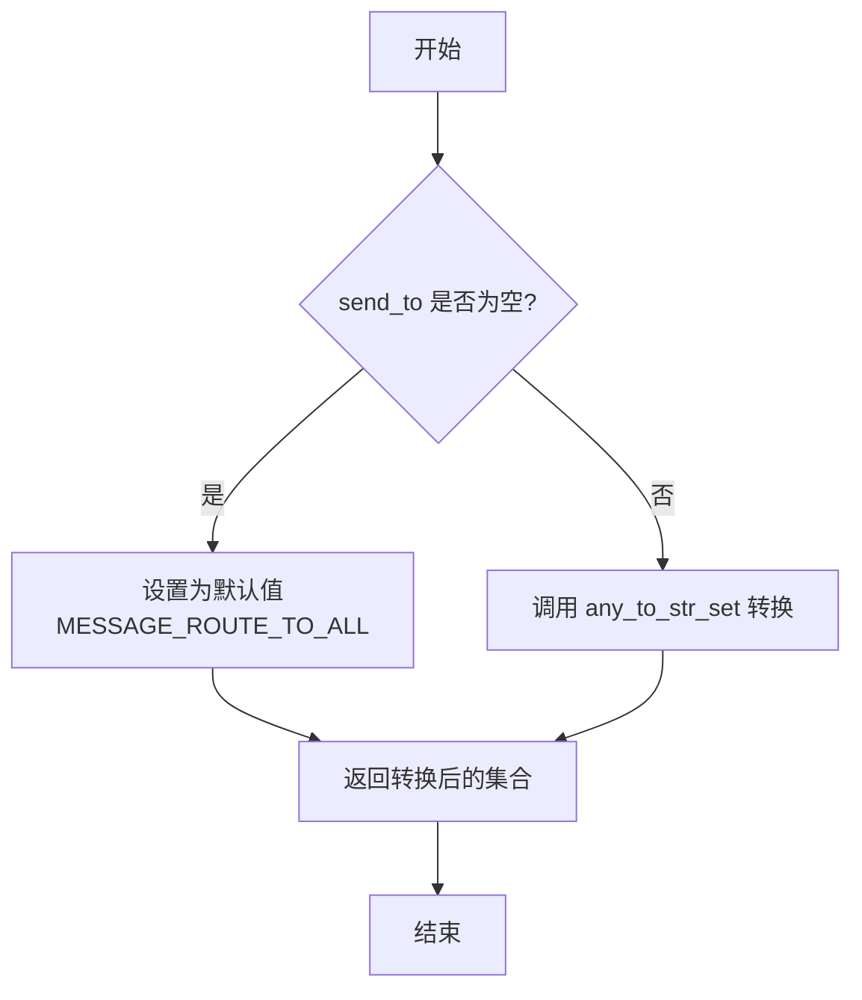

#### 带注释源码

```python
@field_validator("send_to", mode="before")
@classmethod
def check_send_to(cls, send_to: Any) -> set:
    """
    验证和转换 `send_to` 字段。
    
    如果 `send_to` 为空，则将其设置为包含 `MESSAGE_ROUTE_TO_ALL` 的默认集合。
    否则，调用 `any_to_str_set` 函数将其转换为字符串集合。
    
    Args:
        send_to (Any): 输入的 `send_to` 值，可以是任何类型。
    
    Returns:
        set: 转换后的字符串集合。
    """
    return any_to_str_set(send_to if send_to else {MESSAGE_ROUTE_TO_ALL})
```

### `Message.ser_send_to`

`ser_send_to` 是 `Message` 类的一个字段序列化器方法，用于在将 `Message` 实例序列化为 JSON 格式时，将 `send_to` 字段（一个 Python `set` 类型）转换为一个 JSON 可序列化的 `list` 类型。

参数：

- `self`：`Message`，`Message` 类的实例。
- `send_to`：`set`，需要被序列化的 `send_to` 字段的值，它是一个字符串集合。

返回值：`list`，返回一个包含 `send_to` 集合中所有元素的列表，以便于 JSON 序列化。

#### 流程图

```mermaid
flowchart TD
    A[开始: ser_send_to(self, send_to)] --> B{输入 send_to 是否为 set?}
    B -- 是 --> C[使用 list(send_to) 转换为列表]
    C --> D[返回列表]
    B -- 否 --> E[可能引发类型错误或返回非预期结果]
    E --> F[结束]
    D --> F
```

#### 带注释源码

```python
    @field_serializer("send_to", mode="plain")
    def ser_send_to(self, send_to: set) -> list:
        # 将 send_to 字段（一个集合）转换为列表，以便 JSON 序列化。
        # 这是因为 JSON 标准不支持 Python 的 set 类型。
        return list(send_to)
```

### `Message.ser_instruct_content`

该方法用于序列化 `Message` 类中的 `instruct_content` 字段。`instruct_content` 是一个可选的 `BaseModel` 实例，该方法将其转换为一个字典结构，以便于 JSON 序列化。转换后的字典包含类名、模块名（或映射信息）以及模型数据，确保在序列化和反序列化过程中能够正确重建对象。

参数：

- `self`：`Message` 实例，包含要序列化的 `instruct_content` 字段。
- `ic`：`BaseModel`，要序列化的 `instruct_content` 字段值。

返回值：`Union[dict, None]`，返回一个包含序列化信息的字典，如果 `instruct_content` 为 `None`，则返回 `None`。

#### 流程图

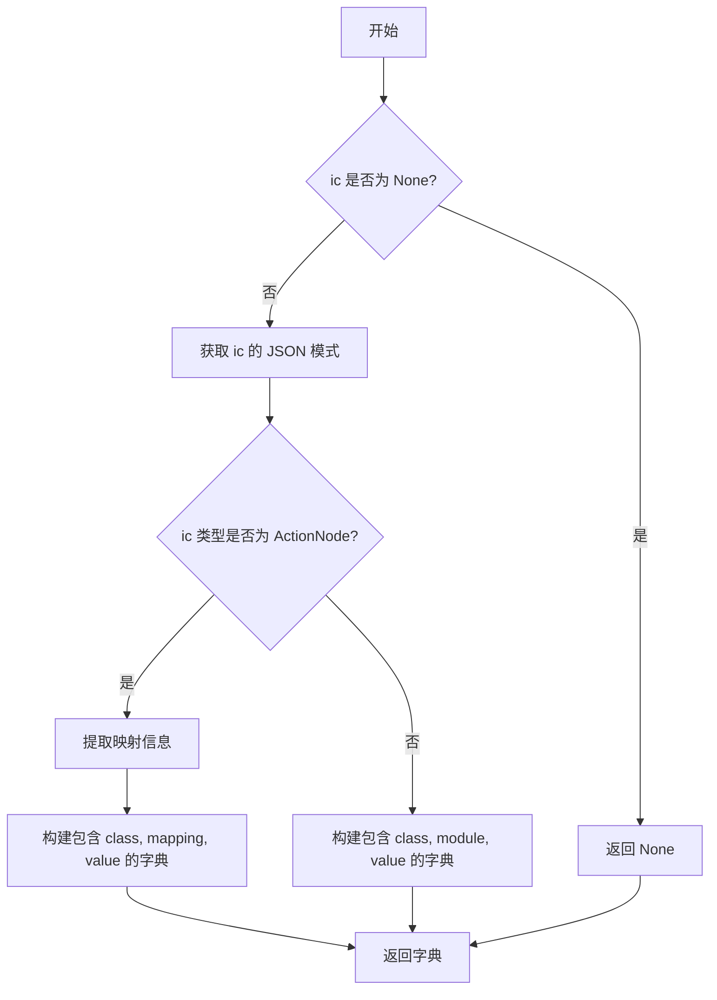

#### 带注释源码

```python
@field_serializer("instruct_content", mode="plain")
def ser_instruct_content(self, ic: BaseModel) -> Union[dict, None]:
    # 初始化返回字典为 None
    ic_dict = None
    # 检查 instruct_content 是否存在
    if ic:
        # 获取 instruct_content 的 JSON 模式
        schema = ic.model_json_schema()
        # 获取 instruct_content 的类型字符串
        ic_type = str(type(ic))
        # 检查是否为 ActionNode 类型（自定义的 ActionOutput）
        if "<class 'metagpt.actions.action_node" in ic_type:
            # 从 JSON 模式中提取映射信息
            mapping = actionoutout_schema_to_mapping(schema)
            # 将映射信息转换为字符串格式
            mapping = actionoutput_mapping_to_str(mapping)

            # 构建包含类名、映射信息和模型数据的字典
            ic_dict = {"class": schema["title"], "mapping": mapping, "value": ic.model_dump()}
        else:
            # 对于其他 BaseModel 子类，构建包含类名、模块名和模型数据的字典
            ic_dict = {"class": schema["title"], "module": ic.__module__, "value": ic.model_dump()}
    # 返回序列化后的字典或 None
    return ic_dict
```

### `Message.__init__`

初始化一个消息对象，用于在智能体之间传递信息。该方法接受消息内容和其他可选参数，并设置消息的各个属性，如发送者、接收者、原因等。

参数：

- `content`：`str`，消息的自然语言内容
- `**data`：`Any`，其他可选参数，用于设置消息的其他属性，如`role`、`cause_by`、`sent_from`等

返回值：`None`，无返回值

#### 流程图

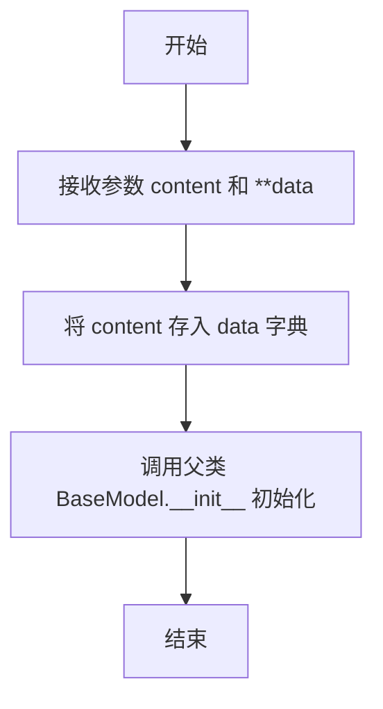

#### 带注释源码

```python
def __init__(self, content: str = "", **data: Any):
    # 将传入的 content 参数存入 data 字典中，如果 data 中已有 content 则保留原值
    data["content"] = data.get("content", content)
    # 调用父类 BaseModel 的 __init__ 方法，传入 data 字典进行初始化
    super().__init__(**data)
```

### `Message.__setattr__`

重写属性设置器，用于在设置特定路由相关属性（`cause_by`、`sent_from`、`send_to`）时，自动将非字符串类型的参数值转换为字符串或字符串集合，以确保这些字段的数据类型符合预期。对于其他属性，则保持原有行为。

参数：

- `key`：`str`，要设置的属性名称。
- `val`：`Any`，要设置的属性值。

返回值：`None`，此方法不返回任何值，仅修改对象内部状态。

#### 流程图

```mermaid
flowchart TD
    A[开始: __setattr__(key, val)] --> B{判断 key 类型}
    B -- key == MESSAGE_ROUTE_CAUSE_BY --> C[调用 any_to_str(val) 转换]
    B -- key == MESSAGE_ROUTE_FROM --> D[调用 any_to_str(val) 转换]
    B -- key == MESSAGE_ROUTE_TO --> E[调用 any_to_str_set(val) 转换]
    B -- 其他 --> F[保持 val 不变]
    C --> G[调用父类 __setattr__(key, new_val)]
    D --> G
    E --> G
    F --> G
    G --> H[结束]
```

#### 带注释源码

```python
def __setattr__(self, key, val):
    """Override `@property.setter`, convert non-string parameters into string parameters."""
    # 检查要设置的属性名是否为预定义的路由相关常量
    if key == MESSAGE_ROUTE_CAUSE_BY:
        # 如果是 cause_by 属性，使用 any_to_str 函数将值转换为字符串
        new_val = any_to_str(val)
    elif key == MESSAGE_ROUTE_FROM:
        # 如果是 sent_from 属性，使用 any_to_str 函数将值转换为字符串
        new_val = any_to_str(val)
    elif key == MESSAGE_ROUTE_TO:
        # 如果是 send_to 属性，使用 any_to_str_set 函数将值转换为字符串集合
        new_val = any_to_str_set(val)
    else:
        # 对于其他属性，保持原值不变
        new_val = val
    # 调用父类（BaseModel）的 __setattr__ 方法，使用转换后的新值设置属性
    super().__setattr__(key, new_val)
```

### `Message.__str__`

该方法用于生成`Message`对象的字符串表示形式，便于日志记录、调试或直接输出。它会根据`instruct_content`字段是否存在，决定返回包含结构化指令内容还是原始文本内容的格式化字符串。

参数：

- `self`：`Message`，当前`Message`实例

返回值：`str`，返回一个格式为`"{role}: {content}"`的字符串。如果`instruct_content`存在，则`content`部分是其`model_dump()`的字典表示；否则，`content`部分是原始的`self.content`字符串。

#### 流程图

```mermaid
flowchart TD
    A[开始] --> B{instruct_content<br>是否存在?}
    B -- 是 --> C[获取instruct_content的<br>model_dump字典]
    C --> D[格式化字符串:<br>role: dict]
    B -- 否 --> E[使用原始content]
    E --> F[格式化字符串:<br>role: content]
    D --> G[返回字符串]
    F --> G
```

#### 带注释源码

```python
def __str__(self):
    # 如果存在结构化的指令内容（instruct_content），则优先使用它
    if self.instruct_content:
        # 将instruct_content对象序列化为字典，并格式化为字符串
        return f"{self.role}: {self.instruct_content.model_dump()}"
    # 否则，使用原始的文本内容（content）
    return f"{self.role}: {self.content}"
```

### `Message.__repr__`

该方法返回`Message`对象的字符串表示形式，用于调试和日志记录。它直接调用`__str__`方法，确保`repr()`和`str()`的输出一致。

参数：无

返回值：`str`，返回`Message`对象的字符串表示形式。

#### 流程图

```mermaid
flowchart TD
    Start[开始] --> CallStr[调用 __str__ 方法]
    CallStr --> Return[返回 __str__ 的结果]
    Return --> End[结束]
```

#### 带注释源码

```python
def __repr__(self):
    # 直接调用 __str__ 方法，确保 repr() 和 str() 的输出一致
    return self.__str__()
```

### `Message.rag_key`

该方法用于为消息对象生成一个用于检索增强生成（RAG）的键。它直接返回消息的`content`字段内容，作为该消息在向量数据库等检索系统中的索引键或查询依据。

参数：
- `self`：`Message`，当前消息对象实例。

返回值：`str`，返回消息的`content`字段字符串，作为RAG操作的键。

#### 流程图

```mermaid
flowchart TD
    A[开始] --> B[调用 rag_key 方法]
    B --> C[返回 self.content]
    C --> D[结束]
```

#### 带注释源码

```python
def rag_key(self) -> str:
    """For search"""
    # 直接返回消息的文本内容，作为RAG系统的检索键。
    return self.content
```

### `Message.to_dict`

该方法将 `Message` 对象转换为一个字典，该字典包含 `role` 和 `content` 两个键值对，主要用于与大型语言模型（LLM）进行交互时，提供符合其输入格式要求的数据结构。

参数：

- 无

返回值：`dict`，返回一个包含 `role` 和 `content` 键的字典，其中 `role` 是消息发送者的角色（如 "user"、"assistant"、"system"），`content` 是消息的文本内容。

#### 流程图

```mermaid
flowchart TD
    A[开始] --> B[获取Message对象的role属性]
    B --> C[获取Message对象的content属性]
    C --> D[构造字典<br>{'role': role, 'content': content}]
    D --> E[返回字典]
    E --> F[结束]
```

#### 带注释源码

```python
def to_dict(self) -> dict:
    """Return a dict containing `role` and `content` for the LLM call.l"""
    # 直接返回一个字典，包含当前Message实例的role和content属性。
    # 这个格式通常用于向OpenAI等LLM API发送消息。
    return {"role": self.role, "content": self.content}
```

### `Message.dump`

将 `Message` 对象序列化为 JSON 字符串。

参数：

-  `self`：`Message`，当前 `Message` 实例

返回值：`str`，表示当前 `Message` 对象序列化后的 JSON 字符串

#### 流程图

```mermaid
flowchart TD
    A[开始] --> B[调用 model_dump_json 方法]
    B --> C[配置 exclude_none=True, warnings=False]
    C --> D[返回 JSON 字符串]
    D --> E[结束]
```

#### 带注释源码

```python
def dump(self) -> str:
    """Convert the object to json string"""
    # 调用 Pydantic BaseModel 的 model_dump_json 方法进行序列化
    # exclude_none=True: 排除值为 None 的字段
    # warnings=False: 禁用序列化过程中的警告信息
    return self.model_dump_json(exclude_none=True, warnings=False)
```

### `Message.load`

`Message.load` 是一个静态方法，用于将 JSON 字符串反序列化为 `Message` 对象。它处理 JSON 解析，并确保 `id` 字段在反序列化后得到正确恢复。

参数：

- `val`：`str`，包含 JSON 格式消息数据的字符串。

返回值：`Optional[Message]`，成功时返回反序列化的 `Message` 对象，失败时返回 `None`。

#### 流程图

```mermaid
flowchart TD
    A[开始: 输入JSON字符串 val] --> B{val 是否为有效JSON?}
    B -- 是 --> C[解析JSON为字典 m]
    C --> D{字典 m 中是否包含 'id' 键?}
    D -- 是 --> E[提取 id 值并删除字典中的 'id' 键]
    D -- 否 --> F[跳过 id 处理]
    E --> G[使用剩余字典数据创建 Message 对象 msg]
    F --> G
    G --> H{id 值是否存在?}
    H -- 是 --> I[将 id 赋值给 msg.id]
    H -- 否 --> J[保持 msg.id 为默认值]
    I --> K[返回 msg 对象]
    J --> K
    B -- 否 --> L[记录 JSON 解析错误日志]
    L --> M[返回 None]
```

#### 带注释源码

```python
    @staticmethod
    @handle_exception(exception_type=JSONDecodeError, default_return=None)
    def load(val):
        """Convert the json string to object."""

        try:
            # 尝试将输入的 JSON 字符串解析为 Python 字典
            m = json.loads(val)
            # 从字典中提取 'id' 字段的值
            id = m.get("id")
            # 如果字典中存在 'id' 键，则将其删除，避免在后续创建 Message 对象时重复处理
            if "id" in m:
                del m["id"]
            # 使用剩余的字典数据创建 Message 对象
            msg = Message(**m)
            # 如果之前提取到了 id 值，则将其赋值给新创建的 Message 对象
            if id:
                msg.id = id
            # 返回成功创建的 Message 对象
            return msg
        except JSONDecodeError as err:
            # 如果 JSON 解析失败，记录错误日志
            logger.error(f"parse json failed: {val}, error:{err}")
        # 在异常或解析失败时返回 None
        return None
```

### `Message.parse_resources`

`parse_resources` 是 `Message` 类的一个静态方法，用于解析消息内容中隐含的资源信息。它通过调用大语言模型（LLM）来分析原始需求文本，提取出其中提到的资源（如文件、数据、工具等），并以结构化的 JSON 格式返回。该方法主要用于将自然语言需求转化为可操作的资源列表，为后续的原子动作提供上下文适配能力。

参数：

- `llm`：`BaseLLM`，用于执行自然语言处理和分析任务的大语言模型实例。
- `key_descriptions`：`Dict[str, str]`，可选参数，一个字典，用于为返回的 JSON 对象中的特定键提供额外的描述信息。默认为 `None`。

返回值：`Dict`，一个字典，包含解析出的资源列表（`resources` 键，值为 `Resource` 对象列表）以及其他可能的键（如 `reason` 和 `key_descriptions` 中定义的键）。

#### 流程图

```mermaid
graph TD
    A[开始] --> B{消息内容是否为空?};
    B -- 是 --> C[返回空字典];
    B -- 否 --> D[构建包含原始需求的提示内容];
    D --> E[构建返回格式说明];
    E --> F{是否提供 key_descriptions?};
    F -- 是 --> G[将 key_descriptions 添加到返回格式中];
    F -- 否 --> H;
    G --> H;
    H --> I[调用 LLM 进行分析];
    I --> J[从 LLM 响应中解析 JSON 数据];
    J --> K[将 resources 列表转换为 Resource 对象];
    K --> L[返回包含解析结果的字典];
    L --> M[结束];
```

#### 带注释源码

```python
    async def parse_resources(self, llm: "BaseLLM", key_descriptions: Dict[str, str] = None) -> Dict:
        """
        `parse_resources` corresponds to the in-context adaptation capability of the input of the atomic action,
        which will be migrated to the context builder later.

        Args:
            llm (BaseLLM): The instance of the BaseLLM class.
            key_descriptions (Dict[str, str], optional): A dictionary containing descriptions for each key,
                if provided. Defaults to None.

        Returns:
            Dict: A dictionary containing parsed resources.

        """
        # 1. 检查消息内容是否为空，为空则直接返回空字典
        if not self.content:
            return {}
        # 2. 构建发送给 LLM 的提示内容，包含原始需求
        content = f"## Original Requirement\n```text\n{self.content}\n```\n"
        # 3. 构建返回格式说明，要求 LLM 返回一个 Markdown JSON 对象
        return_format = (
            "Return a markdown JSON object with:\n"
            '- a "resources" key contain a list of objects. Each object with:\n'
            '  - a "resource_type" key explain the type of resource;\n'
            '  - a "value" key containing a string type of resource content;\n'
            '  - a "description" key explaining why;\n'
        )
        # 4. 如果提供了 key_descriptions，将其添加到返回格式说明中
        key_descriptions = key_descriptions or {}
        for k, v in key_descriptions.items():
            return_format += f'- a "{k}" key containing {v};\n'
        # 5. 添加固定的 'reason' 键
        return_format += '- a "reason" key explaining why;\n'
        # 6. 组合指令：列出所有资源并遵循指定的返回格式
        instructions = ['Lists all the resources contained in the "Original Requirement".', return_format]
        # 7. 异步调用 LLM 进行分析
        rsp = await llm.aask(msg=content, system_msgs=instructions)
        # 8. 从 LLM 的响应中解析出 JSON 代码块
        json_data = CodeParser.parse_code(text=rsp, lang="json")
        # 9. 将 JSON 字符串加载为 Python 字典
        m = json.loads(json_data)
        # 10. 将字典中的 'resources' 列表中的每个字典项转换为 Resource 对象
        m["resources"] = [Resource(**i) for i in m.get("resources", [])]
        # 11. 返回包含解析结果的字典
        return m
```

### `Message.add_metadata`

该方法用于向消息对象的元数据字典中添加一个键值对。如果键已存在，则更新其值；如果不存在，则创建新的键值对。

参数：
- `key`：`str`，要添加或更新的元数据键。
- `value`：`str`，与键关联的元数据值。

返回值：`None`，该方法不返回任何值，直接修改当前消息对象的`metadata`字段。

#### 流程图

```mermaid
flowchart TD
    A[开始] --> B[接收参数 key 和 value]
    B --> C{key 是否已存在于<br>self.metadata 中?}
    C -- 是 --> D[更新 self.metadata[key] = value]
    C -- 否 --> E[创建新键值对<br>self.metadata[key] = value]
    D --> F[结束]
    E --> F
```

#### 带注释源码

```python
def add_metadata(self, key: str, value: str):
    # 将键值对存储到消息的元数据字典中。
    # 如果键已存在，则覆盖其值；如果不存在，则创建新的条目。
    self.metadata[key] = value
```

### `Message.create_instruct_value`

`Message.create_instruct_value` 是一个静态方法，用于根据传入的键值对字典动态创建一个 Pydantic BaseModel 子类的实例。该方法主要用于在运行时根据数据动态生成一个结构化的数据模型，常用于将非结构化的数据（如字典）转换为具有类型验证的 Pydantic 模型对象，以便于后续的处理和序列化。

参数：

- `kvs`：`Dict[str, Any]`，一个字典，其中键为字符串，值为任意类型。该字典定义了要创建的动态模型的字段及其对应的值。
- `class_name`：`str`，可选参数，指定要创建的动态模型的类名。如果未提供，将自动生成一个以 "DM" 开头的随机类名。

返回值：`BaseModel`，返回一个根据传入的字典动态创建的 Pydantic BaseModel 子类的实例，该实例已用传入的字典值进行验证和初始化。

#### 流程图

```mermaid
flowchart TD
    A[开始] --> B{是否提供 class_name?}
    B -- 否 --> C[生成随机类名]
    B -- 是 --> D[使用提供的类名]
    C --> E[使用 pydantic.create_model 创建动态类]
    D --> E
    E --> F[使用 model_validate 验证并初始化实例]
    F --> G[返回动态模型实例]
    G --> H[结束]
```

#### 带注释源码

```python
@staticmethod
def create_instruct_value(kvs: Dict[str, Any], class_name: str = "") -> BaseModel:
    """
    根据给定的字典动态创建一个 Pydantic BaseModel 子类。

    该方法使用 `pydantic.create_model` 函数，基于传入的字典键值对动态生成一个模型类。
    每个字典键成为模型的一个字段，其类型由对应值的类型推断，并使用 `...` 表示该字段是必需的。
    然后，使用 `model_validate` 方法将字典验证并转换为该动态类的实例。

    参数:
        kvs: 一个字典，用于定义动态模型的字段和值。
        class_name: 要创建的动态模型的类名。如果为空，则生成一个随机名称。

    返回:
        一个填充了给定数据的 Pydantic BaseModel 子类实例。
    """
    # 如果没有提供类名，则生成一个以 "DM" 开头的随机类名
    if not class_name:
        class_name = "DM" + uuid.uuid4().hex[0:8]
    # 使用 pydantic.create_model 动态创建模型类。
    # **{key: (value.__class__, ...)} 为每个键值对创建一个字段，
    # 字段类型为值的类，并使用 `...` 表示该字段是必需的。
    dynamic_class = create_model(class_name, **{key: (value.__class__, ...) for key, value in kvs.items()})
    # 使用 model_validate 方法验证字典并创建模型实例
    return dynamic_class.model_validate(kvs)
```

### `Message.is_user_message`

该方法用于判断当前消息是否为用户消息。它通过检查消息的`role`字段是否等于"user"来确定消息的来源是否为用户。

参数：无

返回值：`bool`，如果消息的`role`字段为"user"，则返回`True`，否则返回`False`。

#### 流程图

```mermaid
flowchart TD
    A[开始] --> B{检查 role 字段}
    B -->|role == 'user'| C[返回 True]
    B -->|role != 'user'| D[返回 False]
    C --> E[结束]
    D --> E
```

#### 带注释源码

```python
def is_user_message(self) -> bool:
    # 判断消息的 role 字段是否为 "user"
    return self.role == "user"
```

### `Message.is_ai_message`

该方法用于判断当前消息对象是否为AI（助手）生成的消息。它通过检查消息的`role`字段是否为`"assistant"`来实现。

参数：
- `self`：`Message`，当前消息对象实例。

返回值：`bool`，如果消息的`role`字段为`"assistant"`，则返回`True`，表示是AI消息；否则返回`False`。

#### 流程图

```mermaid
flowchart TD
    A[开始] --> B{检查 self.role 是否为 'assistant'}
    B -- 是 --> C[返回 True]
    B -- 否 --> D[返回 False]
    C --> E[结束]
    D --> E
```

#### 带注释源码

```python
def is_ai_message(self) -> bool:
    # 检查当前消息的`role`字段是否等于"assistant"
    # 如果是，则返回True，表示是AI生成的消息；否则返回False
    return self.role == "assistant"
```

### `UserMessage.__init__`

`UserMessage` 类的构造函数，用于创建一个代表用户消息的 `Message` 对象。它强制设置消息的 `role` 属性为 `"user"`，并调用父类 `Message` 的构造函数。

参数：

- `content`：`str`，消息的文本内容。
- `**kwargs`：`Any`，其他传递给父类 `Message` 构造函数的可选关键字参数（例如 `id`, `instruct_content`, `cause_by` 等）。

返回值：`None`，此方法不显式返回值，它初始化一个 `UserMessage` 实例。

#### 流程图

```mermaid
flowchart TD
    A[开始: UserMessage.__init__] --> B[从kwargs中移除'role'键]
    B --> C[调用父类Message.__init__<br>设置role='user', content=content, **kwargs]
    C --> D[结束: UserMessage实例初始化完成]
```

#### 带注释源码

```python
def __init__(self, content: str, **kwargs):
    # 移除可能传入的'role'参数，确保UserMessage的角色固定为'user'
    kwargs.pop("role", None)
    # 调用父类Message的构造函数，显式设置role='user'，并传入内容和其余参数
    super().__init__(content=content, role="user", **kwargs)
```

### `SystemMessage.__init__`

该方法用于初始化一个系统消息对象，继承自`Message`类，并强制设置消息的角色为"system"。它接收消息内容和其他可选参数，确保消息的`role`字段被正确设置为系统消息。

参数：

- `content`：`str`，系统消息的内容文本。
- `**kwargs`：`Any`，其他可选参数，用于传递给父类`Message`的初始化方法。

返回值：`None`，该方法不返回任何值，仅初始化对象。

#### 流程图

```mermaid
flowchart TD
    A[开始] --> B[接收参数 content 和 **kwargs]
    B --> C[从 kwargs 中移除 'role' 键]
    C --> D[调用父类 Message.__init__<br>设置 role='system', content=content, **kwargs]
    D --> E[结束]
```

#### 带注释源码

```python
def __init__(self, content: str, **kwargs):
    # 从 kwargs 中移除 'role' 键，确保系统消息的角色不会被覆盖
    kwargs.pop("role", None)
    # 调用父类 Message 的初始化方法，强制设置 role 为 'system'
    super().__init__(content=content, role="system", **kwargs)
```

### `AIMessage.__init__`

AIMessage类的构造函数，用于创建一个代表AI助手消息的实例。它继承自Message类，并自动设置消息角色为"assistant"，同时允许通过关键字参数传递其他消息属性。

参数：

- `content`：`str`，消息的文本内容
- `**kwargs`：`Any`，其他传递给父类Message构造函数的可选参数

返回值：`None`，构造函数不返回任何值

#### 流程图

```mermaid
flowchart TD
    Start[开始] --> CheckRole{检查kwargs中是否有role参数}
    CheckRole -->|有| RemoveRole[移除role参数]
    CheckRole -->|无| KeepKwargs[保持kwargs不变]
    RemoveRole --> CallParent[调用父类Message.__init__<br/>设置role='assistant']
    KeepKwargs --> CallParent
    CallParent --> End[结束]
```

#### 带注释源码

```python
def __init__(self, content: str, **kwargs):
    # 移除kwargs中可能存在的'role'参数，确保AI消息的角色固定为'assistant'
    kwargs.pop("role", None)
    # 调用父类Message的构造函数，传入内容、固定角色和其他参数
    super().__init__(content=content, role="assistant", **kwargs)
```

### `AIMessage.with_agent`

该方法用于为AIMessage实例添加一个元数据键值对，标识该消息是由哪个代理（agent）生成的，并返回修改后的消息实例自身，以支持链式调用。

参数：

- `name`：`str`，代理的名称，将作为值存储在消息的元数据中，键为常量`AGENT`。

返回值：`AIMessage`，返回添加了代理元数据后的当前AIMessage实例自身。

#### 流程图

```mermaid
flowchart TD
    A[开始] --> B[接收参数 name]
    B --> C[调用 self.add_metadata<br>key=AGENT, value=name]
    C --> D[返回 self]
    D --> E[结束]
```

#### 带注释源码

```python
def with_agent(self, name: str):
    # 调用父类Message的add_metadata方法，向当前消息的metadata字典中添加一个键值对。
    # 键为常量AGENT，值为传入的代理名称name。
    self.add_metadata(key=AGENT, value=name)
    # 返回当前实例self，支持链式调用，例如：msg.with_agent("Coder").with_agent("Tester")
    return self
```

### `AIMessage.agent`

`AIMessage.agent` 是一个只读属性（property），用于从 `AIMessage` 实例的 `metadata` 字典中获取与键 `AGENT` 关联的值。如果该键不存在，则返回空字符串 `""`。此属性提供了一种便捷的方式来访问消息关联的代理名称。

参数：
- 无显式参数。作为属性，它通过 `self` 访问当前 `AIMessage` 实例的内部状态。

返回值：`str`，返回存储在 `metadata` 字典中键为 `AGENT` 的值（代理名称），如果键不存在则返回空字符串 `""`。

#### 流程图

```mermaid
flowchart TD
    A[开始: 访问 AIMessage.agent 属性] --> B[从 self.metadata 字典中<br>查找键 AGENT]
    B --> C{键 AGENT 是否存在?}
    C -- 是 --> D[返回对应的值]
    C -- 否 --> E[返回空字符串 ""]
    D --> F[结束]
    E --> F
```

#### 带注释源码

```python
    @property
    def agent(self) -> str:
        # 从当前实例的 metadata 字典中获取键为 AGENT 的值。
        # 如果键不存在，get 方法返回默认值空字符串 ""。
        return self.metadata.get(AGENT, "")
```

### `Task.reset`

该方法用于重置任务的状态，将任务的代码、结果、成功标志和完成标志恢复到初始状态。

参数：无

返回值：`None`，无返回值

#### 流程图

```mermaid
flowchart TD
    A[开始] --> B[重置代码为空字符串]
    B --> C[重置结果为空字符串]
    C --> D[设置成功标志为False]
    D --> E[设置完成标志为False]
    E --> F[结束]
```

#### 带注释源码

```python
def reset(self):
    # 将任务的代码重置为空字符串
    self.code = ""
    # 将任务的结果重置为空字符串
    self.result = ""
    # 将任务的成功标志重置为False
    self.is_success = False
    # 将任务的完成标志重置为False
    self.is_finished = False
```

### `Task.update_task_result`

该方法用于更新任务的结果，将传入的`TaskResult`对象中的代码和结果追加到当前任务的代码和结果字段中，并更新任务的成功状态。

参数：

- `task_result`：`TaskResult`，包含任务执行结果的对象，包括代码、结果和成功状态。

返回值：`None`，该方法不返回任何值，直接修改当前任务对象的字段。

#### 流程图

```mermaid
flowchart TD
    A[开始] --> B[接收TaskResult参数]
    B --> C[将task_result.code追加到self.code]
    C --> D[将task_result.result追加到self.result]
    D --> E[将task_result.is_success赋值给self.is_success]
    E --> F[结束]
```

#### 带注释源码

```python
def update_task_result(self, task_result: TaskResult):
    # 将传入的TaskResult对象中的代码追加到当前任务的代码字段
    self.code = self.code + "\n" + task_result.code
    # 将传入的TaskResult对象中的结果追加到当前任务的结果字段
    self.result = self.result + "\n" + task_result.result
    # 将传入的TaskResult对象中的成功状态赋值给当前任务的成功状态字段
    self.is_success = task_result.is_success
```

### `Plan._topological_sort`

该方法对给定的任务列表进行拓扑排序，确保任务按照其依赖关系（`dependent_task_ids`）的顺序执行。它使用深度优先搜索（DFS）遍历任务图，将任务按依赖顺序排列，使得没有依赖的任务排在前面，有依赖的任务在其所有依赖项之后。

参数：

- `tasks`：`list[Task]`，一个包含`Task`对象的列表，这些任务可能无序且包含依赖关系。

返回值：`list[Task]`，返回一个按拓扑顺序（依赖顺序）排序的`Task`对象列表。

#### 流程图

```mermaid
flowchart TD
    A[开始] --> B[构建任务映射 task_map<br>和依赖字典 dependencies]
    B --> C[初始化 sorted_tasks 和 visited 集合]
    C --> D[遍历 tasks 列表]
    D --> E{任务是否已访问?}
    E -->|是| F[跳过]
    E -->|否| G[标记为已访问]
    G --> H[递归访问所有依赖任务]
    H --> I[将当前任务加入 sorted_tasks]
    I --> J[返回 sorted_tasks]
    F --> D
    J --> K[结束]
```

#### 带注释源码

```python
def _topological_sort(self, tasks: list[Task]):
    # 将任务列表转换为字典，键为任务ID，值为任务对象，便于快速查找
    task_map = {task.task_id: task for task in tasks}
    # 构建依赖字典，键为任务ID，值为该任务依赖的其他任务ID集合
    dependencies = {task.task_id: set(task.dependent_task_ids) for task in tasks}
    # 初始化排序后的任务列表和已访问集合
    sorted_tasks = []
    visited = set()

    # 定义内部递归函数，用于深度优先遍历依赖图
    def visit(task_id):
        # 如果任务已访问，直接返回，避免重复处理
        if task_id in visited:
            return
        # 标记当前任务为已访问
        visited.add(task_id)
        # 递归访问当前任务的所有依赖任务
        for dependent_id in dependencies.get(task_id, []):
            visit(dependent_id)
        # 所有依赖任务处理完毕后，将当前任务加入排序列表
        sorted_tasks.append(task_map[task_id])

    # 遍历所有任务，开始拓扑排序
    for task in tasks:
        visit(task.task_id)

    # 返回按依赖顺序排序的任务列表
    return sorted_tasks
```

### `Plan.add_tasks`

该方法用于将新的任务列表集成到现有计划中，确保依赖顺序得到维护。它根据当前任务列表的状态执行两种主要功能：如果现有任务列表为空，则对新任务进行拓扑排序以确保基于依赖关系的正确执行顺序，并将其设置为当前任务；如果存在现有任务，则将新任务与现有任务合并，保留基于`task_id`和`instruction`的公共前缀，并追加新任务的剩余部分。最后，更新当前任务为合并列表中第一个未完成的任务。

参数：

- `tasks`：`list[Task]`，要添加到计划中的任务列表（可能无序）。

返回值：`None`，该方法更新计划的内部状态，不返回任何值。

#### 流程图

```mermaid
flowchart TD
    A[开始] --> B{任务列表是否为空?}
    B -- 是 --> C[对新任务进行拓扑排序]
    C --> D[将排序后的任务设置为当前任务]
    B -- 否 --> E[计算现有任务与新任务的公共前缀长度]
    E --> F[合并公共前缀与新任务的剩余部分]
    F --> G[更新任务列表为合并后的列表]
    D --> H[更新当前任务ID为第一个未完成的任务]
    G --> H
    H --> I[更新任务映射表]
    I --> J[结束]
```

#### 带注释源码

```python
def add_tasks(self, tasks: list[Task]):
    """
    将新任务集成到现有计划中，确保依赖顺序得到维护。

    此方法根据当前任务列表的状态执行两种主要功能：
    1. 如果没有现有任务，则对新任务进行拓扑排序以确保基于依赖关系的正确执行顺序，并将其设置为当前任务。
    2. 如果存在现有任务，则将新任务与现有任务合并。它保留基于`task_id`和`instruction`的公共前缀，并追加新任务的剩余部分。
       当前任务更新为合并列表中第一个未完成的任务。

    参数：
        tasks (list[Task]): 要添加到计划中的任务列表（可能无序）。

    返回值：
        None: 该方法更新计划的内部状态，但不返回任何内容。
    """
    if not tasks:
        return

    # 对新任务进行拓扑排序以确保正确的依赖顺序
    new_tasks = self._topological_sort(tasks)

    if not self.tasks:
        # 如果没有现有任务，将新任务设置为当前任务
        self.tasks = new_tasks

    else:
        # 计算现有任务与新任务之间的公共前缀长度
        prefix_length = 0
        for old_task, new_task in zip(self.tasks, new_tasks):
            if old_task.task_id != new_task.task_id or old_task.instruction != new_task.instruction:
                break
            prefix_length += 1

        # 将公共前缀与新任务的剩余部分合并
        final_tasks = self.tasks[:prefix_length] + new_tasks[prefix_length:]
        self.tasks = final_tasks

    # 更新当前任务ID为合并列表中第一个未完成的任务
    self._update_current_task()

    # 更新任务映射表以便通过ID快速访问任务
    self.task_map = {task.task_id: task for task in self.tasks}
```

### `Plan.reset_task`

重置指定任务及其所有下游依赖任务的状态，将任务标记为未完成并清空其执行结果，然后更新当前任务指针。

参数：

- `task_id`：`str`，要重置的任务ID

返回值：`None`，无返回值

#### 流程图

```mermaid
flowchart TD
    A[开始: reset_task(task_id)] --> B{task_id 是否在 task_map 中?}
    B -->|否| C[结束]
    B -->|是| D[获取任务对象 task]
    D --> E[调用 task.reset() 重置任务状态]
    E --> F[遍历所有任务 dep_task]
    F --> G{dep_task 是否依赖 task_id?}
    G -->|是| H[递归调用 reset_task(dep_task.task_id)]
    G -->|否| I[继续遍历]
    H --> I
    I --> J{是否遍历完成?}
    J -->|否| F
    J -->|是| K[调用 _update_current_task 更新当前任务]
    K --> C
```

#### 带注释源码

```python
def reset_task(self, task_id: str):
    """
    重置一个任务及其所有下游依赖任务的状态。

    该方法执行以下操作：
    1. 检查任务ID是否存在于任务映射中。
    2. 如果存在，获取该任务对象并调用其`reset()`方法，将任务标记为未完成并清空代码和结果。
    3. 递归重置所有依赖该任务的下游任务，确保依赖链的一致性。
    4. 最后调用`_update_current_task()`更新当前任务指针。

    Args:
        task_id (str): 要重置的任务ID。

    Returns:
        None: 该方法不返回任何值，直接修改Plan对象内部状态。
    """
    # 检查任务ID是否存在于任务映射中
    if task_id in self.task_map:
        # 获取任务对象
        task = self.task_map[task_id]
        # 调用任务的reset方法，清空执行状态
        task.reset()
        # 遍历所有任务，查找依赖当前任务的下游任务
        for dep_task in self.tasks:
            if task_id in dep_task.dependent_task_ids:
                # 递归重置下游任务
                # 注意：如果任务依赖关系存在循环，可能导致无限递归
                self.reset_task(dep_task.task_id)

    # 更新当前任务指针
    self._update_current_task()
```

### `Plan._replace_task`

该方法用于替换计划中已存在的任务。它会根据新任务的ID找到并替换现有任务，然后重置所有依赖于该任务的下游任务，以确保依赖关系的一致性。

参数：

- `new_task`：`Task`，新的任务对象，用于替换现有任务

返回值：`None`，无返回值

#### 流程图

```mermaid
flowchart TD
    A[开始] --> B{new_task.task_id 是否在 task_map 中?}
    B -->|是| C[替换任务]
    B -->|否| D[抛出断言错误]
    C --> E[更新 task_map]
    E --> F[更新 tasks 列表]
    F --> G[重置依赖任务]
    G --> H[更新当前任务]
    H --> I[结束]
    D --> I
```

#### 带注释源码

```python
def _replace_task(self, new_task: Task):
    """
    根据 task_id 替换现有任务为新任务，并重置所有依赖于该任务的任务。

    参数:
        new_task (Task): 用于替换现有任务的新任务。

    返回:
        None
    """
    # 断言新任务的 task_id 必须存在于 task_map 中
    assert new_task.task_id in self.task_map
    # 在 task_map 中替换任务
    self.task_map[new_task.task_id] = new_task
    # 在 tasks 列表中替换任务
    for i, task in enumerate(self.tasks):
        if task.task_id == new_task.task_id:
            self.tasks[i] = new_task
            break

    # 重置所有依赖于新任务的任务
    for task in self.tasks:
        if new_task.task_id in task.dependent_task_ids:
            self.reset_task(task.task_id)

    # 更新当前任务
    self._update_current_task()
```

### `Plan._append_task`

该方法用于向现有任务序列的末尾追加一个新任务。它会检查新任务是否已存在（若存在则发出警告），并验证其依赖任务是否都在当前计划中。然后将新任务添加到任务列表和任务映射中，并更新当前任务。

参数：

- `new_task`：`Task`，要追加的新任务对象

返回值：`None`，无返回值

#### 流程图

```mermaid
flowchart TD
    A[开始] --> B{新任务ID是否已存在?}
    B -- 是 --> C[记录警告: 任务已存在]
    B -- 否 --> D{所有依赖任务都存在?}
    D -- 否 --> E[抛出断言错误]
    D -- 是 --> F[将新任务追加到任务列表]
    F --> G[将新任务添加到任务映射]
    G --> H[调用_update_current_task更新状态]
    H --> I[结束]
    C --> F
```

#### 带注释源码

```python
def _append_task(self, new_task: Task):
    """
    向现有任务序列的末尾追加一个新任务

    参数:
        new_task (Task): 要追加到现有任务序列的新任务

    返回:
        None
    """
    # 检查新任务是否已存在于当前计划中，若存在则发出警告
    if self.has_task_id(new_task.task_id):
        logger.warning(
            "Task already in current plan, should use replace_task instead. Overwriting the existing task."
        )

    # 断言验证：新任务的所有依赖任务都必须存在于当前计划中
    assert all(
        [self.has_task_id(dep_id) for dep_id in new_task.dependent_task_ids]
    ), "New task has unknown dependencies"

    # 将新任务追加到任务列表末尾
    self.tasks.append(new_task)
    # 将新任务添加到任务映射中以便快速访问
    self.task_map[new_task.task_id] = new_task
    # 更新当前任务状态（包括拓扑排序和当前任务ID）
    self._update_current_task()
```

### `Plan.has_task_id`

检查给定的任务ID是否存在于当前计划的任务映射中。

参数：

- `task_id`：`str`，要检查的任务ID

返回值：`bool`，如果任务ID存在于任务映射中则返回`True`，否则返回`False`

#### 流程图

```mermaid
flowchart TD
    A[开始] --> B{task_id 是否在 task_map 中?}
    B -->|是| C[返回 True]
    B -->|否| D[返回 False]
    C --> E[结束]
    D --> E
```

#### 带注释源码

```python
def has_task_id(self, task_id: str) -> bool:
    # 检查给定的任务ID是否存在于任务映射字典中
    return task_id in self.task_map
```

### `Plan._update_current_task`

该方法用于更新计划中的当前任务。它首先对任务列表进行拓扑排序以确保依赖顺序正确，然后更新任务映射表以便快速访问。接着，它遍历任务列表，找到第一个未完成的任务，将其设置为当前任务。最后，通过`TaskReporter`报告当前任务状态。

参数：

-  `self`：`Plan`，当前计划实例

返回值：`None`，无返回值

#### 流程图

```mermaid
flowchart TD
    A[开始] --> B[对任务列表进行拓扑排序]
    B --> C[更新任务映射表]
    C --> D[遍历任务列表]
    D --> E{任务是否完成?}
    E -->|是| F[继续遍历下一个任务]
    F --> D
    E -->|否| G[设置当前任务ID]
    G --> H[通过TaskReporter报告任务状态]
    H --> I[结束]
```

#### 带注释源码

```python
def _update_current_task(self):
    # 对任务列表进行拓扑排序，确保依赖顺序正确
    self.tasks = self._topological_sort(self.tasks)
    # 更新任务映射表，以便通过任务ID快速访问任务
    self.task_map = {task.task_id: task for task in self.tasks}

    # 初始化当前任务ID为空
    current_task_id = ""
    # 遍历任务列表，找到第一个未完成的任务
    for task in self.tasks:
        if not task.is_finished:
            current_task_id = task.task_id
            break
    # 设置当前任务ID
    self.current_task_id = current_task_id
    # 通过TaskReporter报告当前任务状态
    TaskReporter().report({"tasks": [i.model_dump() for i in self.tasks], "current_task_id": current_task_id})
```

### `Plan.current_task`

这是一个只读属性，用于获取当前计划中需要执行的任务。它通过 `current_task_id` 在内部任务映射中查找对应的 `Task` 对象。

参数：
- 无

返回值：`Task`，当前计划中需要执行的任务对象。如果 `current_task_id` 不存在于任务映射中，则返回 `None`。

#### 流程图

```mermaid
flowchart TD
    A[开始] --> B{current_task_id 存在?}
    B -- 是 --> C[从 task_map 中获取 Task 对象]
    C --> D[返回 Task 对象]
    B -- 否 --> E[返回 None]
    D --> F[结束]
    E --> F
```

#### 带注释源码

```python
@property
def current_task(self) -> Task:
    """Find current task to execute

    Returns:
        Task: the current task to be executed
    """
    # 通过 self.current_task_id 在 self.task_map 字典中查找对应的 Task 对象。
    # 如果找不到，则使用 dict.get 方法返回 None。
    return self.task_map.get(self.current_task_id, None)
```

### `Plan.finish_current_task`

该方法用于标记当前任务为已完成，并自动将计划中的当前任务指针更新为下一个未完成的任务。

参数：
- 无

返回值：`None`，无返回值

#### 流程图

```mermaid
flowchart TD
    A[开始] --> B{当前任务ID存在?}
    B -- 是 --> C[设置当前任务.is_finished = True]
    C --> D[调用 _update_current_task 更新任务状态]
    D --> E[结束]
    B -- 否 --> E
```

#### 带注释源码

```python
def finish_current_task(self):
    """Finish current task, set Task.is_finished=True, set current task to next task"""
    # 检查是否存在当前任务ID
    if self.current_task_id:
        # 将当前任务标记为已完成
        self.current_task.is_finished = True
        # 调用内部方法更新任务状态，包括重新排序任务列表和设置新的当前任务
        self._update_current_task()  # set to next task
```

### `Plan.finish_all_tasks`

该方法用于将计划（Plan）中的所有任务（Task）标记为已完成。它会循环调用 `finish_current_task` 方法，直到当前任务（`current_task`）为 `None`（即所有任务都已标记为完成）。每次调用 `finish_current_task` 都会将当前任务标记为完成（`is_finished=True`）并更新 `current_task_id` 指向下一个未完成的任务。

参数：
- 无

返回值：`None`，无返回值

#### 流程图

```mermaid
flowchart TD
    A[开始] --> B{当前任务<br>current_task 存在?}
    B -- 是 --> C[调用 finish_current_task]
    C --> B
    B -- 否 --> D[结束]
```

#### 带注释源码

```python
def finish_all_tasks(self):
    "Finish all tasks."
    # 循环条件：当 current_task 属性返回一个有效的 Task 对象时继续循环
    while self.current_task:
        # 调用 finish_current_task 方法
        # 该方法会将 self.current_task.is_finished 设置为 True
        # 并调用 _update_current_task 来将 current_task_id 更新为下一个未完成的任务
        self.finish_current_task()
```

### `Plan.is_plan_finished`

该方法用于检查计划中的所有任务是否都已标记为完成。

参数：

- 无显式参数（`self` 参数指向当前 `Plan` 实例）

返回值：`bool`，如果计划中的所有任务都已标记为完成（即 `task.is_finished` 为 `True`），则返回 `True`；否则返回 `False`。

#### 流程图

```mermaid
flowchart TD
    A[开始] --> B[初始化完成标志为 True]
    B --> C{遍历所有任务}
    C --> D[检查当前任务是否完成]
    D -- 是 --> C
    D -- 否 --> E[设置完成标志为 False]
    E --> F[结束遍历]
    C -- 所有任务遍历完毕 --> G[返回完成标志]
    F --> G
    G --> H[结束]
```

#### 带注释源码

```python
def is_plan_finished(self) -> bool:
    """Check if all tasks are finished"""
    # 使用生成器表达式遍历 self.tasks 列表中的所有任务
    # all() 函数检查可迭代对象中的所有元素是否都为 True
    # 这里检查每个任务的 is_finished 属性是否为 True
    return all(task.is_finished for task in self.tasks)
```

### `Plan.get_finished_tasks`

该方法用于获取计划中所有已完成的任务，并按照正确的线性化顺序返回。

参数：
- `self`：`Plan`，当前计划实例

返回值：`list[Task]`，包含所有已完成任务的列表，按照任务依赖关系排序。

#### 流程图

```mermaid
flowchart TD
    A[开始] --> B[初始化空列表 finished_tasks]
    B --> C[遍历计划中的所有任务 tasks]
    C --> D{任务是否已完成？<br>task.is_finished}
    D -- 是 --> E[将任务添加到 finished_tasks 列表]
    D -- 否 --> F[继续遍历下一个任务]
    E --> F
    F --> C
    C --> G[遍历结束]
    G --> H[返回 finished_tasks 列表]
    H --> I[结束]
```

#### 带注释源码

```python
def get_finished_tasks(self) -> list[Task]:
    """return all finished tasks in correct linearized order

    Returns:
        list[Task]: list of finished tasks
    """
    # 使用列表推导式遍历 self.tasks 中的所有任务
    # 对于每个任务 task，检查其 is_finished 属性是否为 True
    # 如果为 True，则将该任务包含在返回的列表中
    return [task for task in self.tasks if task.is_finished]
```

### `Plan.append_task`

该方法用于向计划（Plan）中追加一个新的任务。它会创建一个新的Task对象，并调用内部方法`_append_task`将其添加到任务列表的末尾。如果新任务依赖于其他任务，则必须确保这些依赖任务已经存在于当前计划中。

参数：

- `task_id`：`str`，新任务的唯一标识符
- `dependent_task_ids`：`list[str]`，新任务所依赖的任务ID列表
- `instruction`：`str`，新任务的指令描述
- `assignee`：`str`，负责执行该任务的角色名称
- `task_type`：`str`，任务类型（可选参数，默认为空字符串）

返回值：`None`，该方法不返回任何值，直接修改Plan对象的状态

#### 流程图

```mermaid
flowchart TD
    A[开始: append_task] --> B[创建新Task对象]
    B --> C{任务ID是否已存在?}
    C -->|是| D[记录警告日志]
    C -->|否| E[检查依赖任务是否存在]
    D --> E
    E --> F{所有依赖都存在?}
    F -->|否| G[抛出断言错误]
    F -->|是| H[将新任务添加到任务列表末尾]
    H --> I[更新任务映射表]
    I --> J[更新当前任务ID]
    J --> K[结束]
```

#### 带注释源码

```python
def append_task(
    self, task_id: str, dependent_task_ids: list[str], instruction: str, assignee: str, task_type: str = ""
):
    """
    Append a new task with task_id (number) to the end of existing task sequences.
    If dependent_task_ids is not empty, the task will depend on the tasks with the ids in the list.
    Note that the assignee should be the 'name' of the role.
    """
    # 创建新的Task对象，包含所有必要的任务属性
    new_task = Task(
        task_id=task_id,
        dependent_task_ids=dependent_task_ids,
        instruction=instruction,
        assignee=assignee,
        task_type=task_type,
    )
    # 调用内部方法实际执行追加操作
    return self._append_task(new_task)
```

### `Plan.replace_task`

该方法用于替换计划中已存在的任务。它会根据提供的任务ID找到对应的任务，并用新的任务信息（依赖任务ID、指令、执行者）替换它。替换后，所有依赖于该任务的任务都会被重置，以确保计划的正确性。

参数：

- `task_id`：`str`，要替换的任务的ID
- `new_dependent_task_ids`：`list[str]`，新任务的依赖任务ID列表
- `new_instruction`：`str`，新任务的指令内容
- `new_assignee`：`str`，新任务的执行者

返回值：`None`，该方法不返回任何值，直接修改计划对象的状态

#### 流程图

```mermaid
flowchart TD
    A[开始] --> B[创建新Task对象]
    B --> C[调用内部方法_replace_task]
    C --> D{新任务ID是否在task_map中?}
    D -- 是 --> E[替换task_map中的任务]
    E --> F[替换tasks列表中的任务]
    F --> G[重置所有依赖此任务的任务]
    G --> H[更新当前任务]
    H --> I[结束]
    D -- 否 --> J[抛出断言错误]
    J --> I
```

#### 带注释源码

```python
def replace_task(self, task_id: str, new_dependent_task_ids: list[str], new_instruction: str, new_assignee: str):
    """Replace an existing task (can be current task) based on task_id, and reset all tasks depending on it."""
    # 根据参数创建新的Task对象
    new_task = Task(
        task_id=task_id,
        dependent_task_ids=new_dependent_task_ids,
        instruction=new_instruction,
        assignee=new_assignee,
    )
    # 调用内部_replace_task方法执行实际替换逻辑
    return self._replace_task(new_task)
```

### `MessageQueue.pop`

从消息队列中弹出一个消息。如果队列为空，则返回 `None`。

参数：

- 无

返回值：`Message | None`，返回队列中的下一个消息，如果队列为空则返回 `None`。

#### 流程图

```mermaid
flowchart TD
    A[开始] --> B{尝试从队列获取消息}
    B -->|成功| C[标记任务完成]
    C --> D[返回消息]
    B -->|队列为空| E[返回 None]
    D --> F[结束]
    E --> F
```

#### 带注释源码

```python
def pop(self) -> Message | None:
    """Pop one message from the queue."""
    try:
        # 尝试非阻塞地从队列中获取一个消息
        item = self._queue.get_nowait()
        if item:
            # 如果成功获取到消息，标记该任务为已完成
            self._queue.task_done()
        # 返回获取到的消息
        return item
    except QueueEmpty:
        # 如果队列为空，捕获 QueueEmpty 异常并返回 None
        return None
```

### `MessageQueue.pop_all`

该方法用于从消息队列中弹出所有当前存在的消息，并以列表形式返回。它通过循环调用`pop`方法，直到队列为空为止。

参数：无

返回值：`List[Message]`，返回一个包含所有从队列中弹出的消息的列表。

#### 流程图

```mermaid
flowchart TD
    A[开始] --> B[初始化空列表 ret]
    B --> C{调用 pop 方法}
    C --> D[是否返回消息?]
    D -- 是 --> E[将消息添加到 ret]
    E --> C
    D -- 否 --> F[返回 ret]
    F --> G[结束]
```

#### 带注释源码

```python
def pop_all(self) -> List[Message]:
    """Pop all messages from the queue."""
    ret = []  # 初始化一个空列表，用于存储弹出的消息
    while True:  # 进入无限循环
        msg = self.pop()  # 调用 pop 方法尝试从队列中弹出一条消息
        if not msg:  # 如果 pop 方法返回 None（表示队列为空）
            break  # 跳出循环
        ret.append(msg)  # 将弹出的消息添加到结果列表中
    return ret  # 返回包含所有弹出消息的列表
```

### `MessageQueue.push`

将消息推入消息队列。

参数：

- `msg`：`Message`，要推入队列的消息对象

返回值：`None`，无返回值

#### 流程图

```mermaid
flowchart TD
    A[开始] --> B[接收消息参数 msg]
    B --> C{msg 是否为 Message 类型?}
    C -- 是 --> D[调用 _queue.put_nowait(msg) 推入队列]
    C -- 否 --> E[抛出异常或忽略]
    D --> F[结束]
    E --> F
```

#### 带注释源码

```python
def push(self, msg: Message):
    """Push a message into the queue."""
    self._queue.put_nowait(msg)
```

### `MessageQueue.empty`

该方法用于检查消息队列是否为空。

参数：无

返回值：`bool`，如果队列为空则返回 `True`，否则返回 `False`

#### 流程图

```mermaid
flowchart TD
    A[开始] --> B[调用底层队列的empty方法]
    B --> C{队列是否为空?}
    C -->|是| D[返回True]
    C -->|否| E[返回False]
    D --> F[结束]
    E --> F
```

#### 带注释源码

```python
def empty(self):
    """Return true if the queue is empty."""
    return self._queue.empty()
```

### `MessageQueue.dump`

将`MessageQueue`对象转换为JSON字符串。该方法会临时取出队列中的所有消息，将它们序列化为JSON格式，然后重新放回队列中，确保队列状态不变。

参数：

- 无显式参数。

返回值：`str`，返回一个包含队列中所有消息JSON字符串的JSON数组字符串。如果队列为空，则返回`"[]"`。

#### 流程图

```mermaid
flowchart TD
    A[开始] --> B{队列是否为空?}
    B -- 是 --> C[返回 "[]"]
    B -- 否 --> D[初始化结果列表和消息暂存列表]
    D --> E{尝试从队列中获取消息<br>（超时1秒）}
    E -- 成功获取到消息 --> F[将消息序列化并添加到结果列表<br>将消息添加到暂存列表]
    F --> E
    E -- 超时 --> G[将暂存列表中的所有消息重新放回队列]
    G --> H[将结果列表转换为JSON字符串]
    H --> I[返回JSON字符串]
```

#### 带注释源码

```python
async def dump(self) -> str:
    """Convert the `MessageQueue` object to a json string."""
    # 如果队列为空，直接返回空数组的JSON字符串
    if self.empty():
        return "[]"

    lst = []  # 用于存储序列化后的消息字符串
    msgs = []  # 用于临时存储从队列中取出的消息对象
    try:
        # 循环尝试从队列中获取消息，设置1秒超时
        while True:
            item = await wait_for(self._queue.get(), timeout=1.0)
            if item is None:
                break  # 如果获取到None（通常表示队列结束信号），则退出循环
            msgs.append(item)  # 将消息对象存入临时列表
            lst.append(item.dump())  # 调用消息的dump方法序列化，并存入结果列表
            self._queue.task_done()  # 标记队列中的该项任务已完成
    except asyncio.TimeoutError:
        # 当等待1秒后仍未获取到新消息，认为队列已空，退出循环
        logger.debug("Queue is empty, exiting...")
    finally:
        # 无论是否发生异常，都将临时取出的所有消息重新放回队列，保持队列原始状态
        for m in msgs:
            self._queue.put_nowait(m)
    # 将结果列表转换为JSON字符串并返回
    return json.dumps(lst, ensure_ascii=False)
```

### `MessageQueue.load`

`MessageQueue.load` 是一个静态方法，用于将 JSON 字符串反序列化为 `MessageQueue` 对象。它解析 JSON 数据，将其中的每条消息数据转换为 `Message` 对象，并依次推入新创建的 `MessageQueue` 实例的内部队列中。

参数：

- `data`：`str`，包含序列化消息列表的 JSON 字符串。

返回值：`MessageQueue`，返回一个填充了反序列化消息的新 `MessageQueue` 对象。

#### 流程图

```mermaid
flowchart TD
    A[开始: 输入JSON字符串 data] --> B{尝试解析JSON};
    B -- 成功 --> C[创建新的MessageQueue实例 queue];
    C --> D[遍历JSON列表中的每个元素 i];
    D --> E[调用 Message.load(i) 反序列化为Message对象 msg];
    E --> F[将 msg 推入 queue._queue];
    F --> G{列表中还有元素?};
    G -- 是 --> D;
    G -- 否 --> H[返回 queue 对象];
    B -- 失败<br>JSONDecodeError --> I[记录警告日志];
    I --> J[返回空的 queue 对象];
```

#### 带注释源码

```python
    @staticmethod
    def load(data) -> "MessageQueue":
        """Convert the json string to the `MessageQueue` object."""
        # 1. 创建一个新的 MessageQueue 实例
        queue = MessageQueue()
        try:
            # 2. 尝试将输入的 JSON 字符串解析为 Python 列表
            lst = json.loads(data)
            # 3. 遍历列表中的每个元素（每个元素应是一个序列化的 Message 字符串）
            for i in lst:
                # 4. 使用 Message 类的静态方法 `load` 将字符串反序列化为 Message 对象
                msg = Message.load(i)
                # 5. 将反序列化得到的 Message 对象推入队列的内部队列中
                queue.push(msg)
        except JSONDecodeError as e:
            # 6. 如果 JSON 解析失败，记录警告日志（队列将保持为空）
            logger.warning(f"JSON load failed: {data}, error:{e}")

        # 7. 返回填充了消息（或为空）的 MessageQueue 对象
        return queue
```

### `BaseContext.loads`

`BaseContext.loads` 是一个类方法，用于将 JSON 字符串反序列化为 `BaseContext` 或其子类的实例。它封装了 JSON 解析和对象构造的过程，并提供了异常处理机制。

参数：

- `cls`：`Type[T]`，调用此方法的类对象，用于实例化具体的 `BaseContext` 子类。
- `val`：`str`，需要反序列化的 JSON 格式字符串。

返回值：`Optional[T]`，如果反序列化成功，则返回一个 `BaseContext` 子类的实例；如果发生异常，则返回 `None`。

#### 流程图

```mermaid
flowchart TD
    A[开始: loads(cls, val)] --> B{val 是否为有效 JSON 字符串?}
    B -- 是 --> C[json.loads(val) 解析为字典 i]
    C --> D[使用 cls(**i) 构造实例]
    D --> E[返回实例]
    B -- 否<br>或解析/构造异常 --> F[handle_exception 装饰器捕获异常]
    F --> G[返回 None]
    E --> H[结束]
    G --> H
```

#### 带注释源码

```python
    @classmethod
    @handle_exception  # 装饰器：捕获方法执行过程中的异常，发生异常时返回 None
    def loads(cls: Type[T], val: str) -> Optional[T]:
        # 1. 将输入的 JSON 字符串 `val` 解析为 Python 字典 `i`
        i = json.loads(val)
        # 2. 使用解析后的字典 `i` 作为关键字参数，调用类 `cls` 的构造函数，创建并返回一个实例。
        #    这里的 `cls` 是 `BaseContext` 或其子类。
        return cls(**i)
```

### `CodeSummarizeContext.loads`

`CodeSummarizeContext.loads` 是一个静态方法，用于根据提供的文件名列表创建一个 `CodeSummarizeContext` 实例。该方法会遍历文件名列表，并根据文件路径与预定义的存储库路径（`SYSTEM_DESIGN_FILE_REPO` 和 `TASK_FILE_REPO`）的相对关系，将文件分类为设计文件或任务文件，并设置到返回的上下文对象中。

参数：

- `filenames`：`List`，一个包含文件路径的列表，用于初始化 `CodeSummarizeContext` 实例。

返回值：`CodeSummarizeContext`，一个包含设计文件名和任务文件名的上下文对象。

#### 流程图

```mermaid
flowchart TD
    A[开始] --> B[创建空的 CodeSummarizeContext 实例]
    B --> C{遍历 filenames 列表}
    C --> D[检查文件路径是否相对于 SYSTEM_DESIGN_FILE_REPO]
    D -- 是 --> E[设置 ctx.design_filename]
    D -- 否 --> F[检查文件路径是否相对于 TASK_FILE_REPO]
    F -- 是 --> G[设置 ctx.task_filename]
    F -- 否 --> H[跳过该文件]
    E --> C
    G --> C
    H --> C
    C --> I[遍历结束]
    I --> J[返回 ctx]
    J --> K[结束]
```

#### 带注释源码

```python
@staticmethod
def loads(filenames: List) -> CodeSummarizeContext:
    """
    根据提供的文件名列表创建一个 CodeSummarizeContext 实例。
    该方法会遍历文件名列表，并根据文件路径与预定义的存储库路径（SYSTEM_DESIGN_FILE_REPO 和 TASK_FILE_REPO）
    的相对关系，将文件分类为设计文件或任务文件，并设置到返回的上下文对象中。

    Args:
        filenames (List): 一个包含文件路径的列表，用于初始化 CodeSummarizeContext 实例。

    Returns:
        CodeSummarizeContext: 一个包含设计文件名和任务文件名的上下文对象。
    """
    # 创建一个空的 CodeSummarizeContext 实例
    ctx = CodeSummarizeContext()
    
    # 遍历提供的文件名列表
    for filename in filenames:
        # 检查文件路径是否相对于 SYSTEM_DESIGN_FILE_REPO
        if Path(filename).is_relative_to(SYSTEM_DESIGN_FILE_REPO):
            # 如果是，将其设置为设计文件名
            ctx.design_filename = str(filename)
            continue
        # 检查文件路径是否相对于 TASK_FILE_REPO
        if Path(filename).is_relative_to(TASK_FILE_REPO):
            # 如果是，将其设置为任务文件名
            ctx.task_filename = str(filename)
            continue
    # 返回初始化后的上下文对象
    return ctx
```

### `CodeSummarizeContext.__hash__`

该方法为`CodeSummarizeContext`类定义了哈希函数，用于生成该类的实例的哈希值。哈希值基于实例的`design_filename`和`task_filename`两个字段计算得出，这使得`CodeSummarizeContext`的实例可以作为字典的键或集合的元素。

参数：

- `self`：`CodeSummarizeContext`，当前`CodeSummarizeContext`类的实例。

返回值：`int`，返回基于`design_filename`和`task_filename`字段计算出的哈希值。

#### 流程图

```mermaid
flowchart TD
    A[开始] --> B[获取实例的design_filename和task_filename字段]
    B --> C[将两个字段组合成元组]
    C --> D[计算元组的哈希值]
    D --> E[返回哈希值]
    E --> F[结束]
```

#### 带注释源码

```python
def __hash__(self):
    # 使用实例的design_filename和task_filename字段创建一个元组
    # 然后计算该元组的哈希值并返回
    return hash((self.design_filename, self.task_filename))
```

### `UMLClassMeta.name_to_visibility`

该方法是一个静态方法，用于根据类成员（属性或方法）的名称推断其在UML类图中的可见性符号。

参数：

- `name`：`str`，类成员（属性或方法）的名称。

返回值：`str`，返回一个表示UML可见性的字符串符号：
    - `"+"` 表示公共（public）
    - `"#"` 表示保护（protected）
    - `"-"` 表示私有（private）

#### 流程图

```mermaid
flowchart TD
    A[开始: 输入成员名称 name] --> B{name 是否为 '__init__'?}
    B -- 是 --> C[返回 '+' (公共)]
    B -- 否 --> D{name 是否以 '__' 开头?}
    D -- 是 --> E[返回 '-' (私有)]
    D -- 否 --> F{name 是否以 '_' 开头?}
    F -- 是 --> G[返回 '#' (保护)]
    F -- 否 --> H[返回 '+' (公共)]
    C --> I[结束]
    E --> I
    G --> I
    H --> I
```

#### 带注释源码

```python
    @staticmethod
    def name_to_visibility(name: str) -> str:
        # 检查是否为构造函数 __init__，在UML中通常表示为公共方法
        if name == "__init__":
            return "+"
        # 检查是否以双下划线开头，这通常表示Python的私有成员
        if name.startswith("__"):
            return "-"
        # 检查是否以单下划线开头，这通常表示Python的保护成员
        elif name.startswith("_"):
            return "#"
        # 其他情况视为公共成员
        return "+"
```

### `UMLClassAttribute.get_mermaid`

该方法用于生成 UML 类图中属性的 Mermaid 语法表示。

参数：

- `self`：`UMLClassAttribute`，当前 UML 类属性实例
- `align`：`int`，缩进级别，默认为 1

返回值：`str`，表示该属性的 Mermaid 语法字符串

#### 流程图

```mermaid
flowchart TD
    A[开始] --> B[初始化 content 字符串]
    B --> C[添加缩进]
    C --> D[添加可见性符号]
    D --> E{属性是否有类型?}
    E -->|是| F[添加类型并移除空格]
    E -->|否| G[跳过类型添加]
    F --> H[提取属性名]
    G --> H
    H --> I{属性是否有默认值?}
    I -->|是| J{类型是否为字符串?}
    I -->|否| K[结束属性行]
    J -->|是| L[添加带引号的默认值]
    J -->|否| M[添加原始默认值]
    L --> K
    M --> K
    K --> N[返回 content 字符串]
```

#### 带注释源码

```python
def get_mermaid(self, align=1) -> str:
    # 初始化内容字符串，根据缩进级别添加制表符
    content = "".join(["\t" for i in range(align)]) + self.visibility
    # 如果属性有类型，则添加类型（移除空格）
    if self.value_type:
        content += self.value_type.replace(" ", "") + " "
    # 提取属性名（如果包含冒号则取后半部分）
    name = self.name.split(":", 1)[1] if ":" in self.name else self.name
    content += name
    # 如果属性有默认值，则添加默认值
    if self.default_value:
        content += "="
        # 如果类型不是字符串，直接添加默认值；否则添加带引号的默认值
        if self.value_type not in ["str", "string", "String"]:
            content += self.default_value
        else:
            content += '"' + self.default_value.replace('"', "") + '"'
    # 返回生成的 Mermaid 语法字符串
    return content
```

### `UMLClassMethod.get_mermaid`

该方法用于生成UML类方法的Mermaid格式字符串表示，包括方法的可见性、名称、参数列表和返回类型。

参数：

- `self`：`UMLClassMethod`，当前UMLClassMethod实例
- `align`：`int`，缩进级别，默认为1

返回值：`str`，表示UML类方法的Mermaid格式字符串

#### 流程图

```mermaid
flowchart TD
    A[开始] --> B[初始化content字符串]
    B --> C[添加缩进]
    C --> D[添加可见性符号]
    D --> E[提取方法名]
    E --> F[添加方法名和括号]
    F --> G[遍历参数列表]
    G --> H[调用参数的get_mermaid方法]
    H --> I[拼接参数字符串]
    I --> J{是否还有参数?}
    J -- 是 --> G
    J -- 否 --> K[添加返回类型]
    K --> L[返回content字符串]
    L --> M[结束]
```

#### 带注释源码

```python
def get_mermaid(self, align=1) -> str:
    # 初始化content字符串，根据缩进级别添加制表符
    content = "".join(["\t" for i in range(align)]) + self.visibility
    
    # 提取方法名，如果方法名中包含冒号，则取冒号后的部分
    name = self.name.split(":", 1)[1] if ":" in self.name else self.name
    
    # 添加方法名和左括号
    content += name + "("
    
    # 遍历参数列表，调用每个参数的get_mermaid方法，并拼接参数字符串
    content += ",".join([v.get_mermaid(align=0) for v in self.args])
    
    # 添加右括号
    content += ")"
    
    # 如果存在返回类型，则添加返回类型
    if self.return_type:
        content += " " + self.return_type.replace(" ", "")
    
    # 返回生成的Mermaid格式字符串
    return content
```

### `UMLClassView.get_mermaid`

该方法用于生成当前UML类视图的Mermaid格式字符串表示，主要用于类图的文本化描述。

参数：

- `self`：`UMLClassView`，当前UML类视图实例
- `align`：`int`，缩进级别，默认为1，用于控制生成字符串的缩进

返回值：`str`，返回表示当前UML类视图的Mermaid格式字符串

#### 流程图

```mermaid
flowchart TD
    A[开始] --> B[初始化content字符串]
    B --> C[添加类定义开始行]
    C --> D[遍历所有属性]
    D --> E[调用属性的get_mermaid方法<br>并添加到content]
    E --> F{是否还有属性?}
    F -- 是 --> D
    F -- 否 --> G[遍历所有方法]
    G --> H[调用方法的get_mermaid方法<br>并添加到content]
    H --> I{是否还有方法?}
    I -- 是 --> G
    I -- 否 --> J[添加类定义结束行]
    J --> K[返回content字符串]
    K --> L[结束]
```

#### 带注释源码

```python
def get_mermaid(self, align=1) -> str:
    """
    生成当前UML类视图的Mermaid格式字符串表示
    
    Args:
        align: 缩进级别，默认为1，用于控制生成字符串的缩进
    
    Returns:
        表示当前UML类视图的Mermaid格式字符串
    """
    # 初始化内容字符串，添加类定义开始行
    # 使用指定缩进级别创建类定义开始标记
    content = "".join(["\t" for i in range(align)]) + "class " + self.name + "{\n"
    
    # 遍历所有属性，调用每个属性的get_mermaid方法
    # 将属性定义添加到内容字符串中
    for v in self.attributes:
        content += v.get_mermaid(align=align + 1) + "\n"
    
    # 遍历所有方法，调用每个方法的get_mermaid方法
    # 将方法定义添加到内容字符串中
    for v in self.methods:
        content += v.get_mermaid(align=align + 1) + "\n"
    
    # 添加类定义结束行
    # 使用指定缩进级别创建类定义结束标记
    content += "".join(["\t" for i in range(align)]) + "}\n"
    
    # 返回完整的Mermaid格式字符串
    return content
```

### `UMLClassView.load_dot_class_info`

该方法是一个类方法，用于将 `DotClassInfo` 对象（包含从源代码解析出的类信息）转换为 `UMLClassView` 对象（用于生成Mermaid类图的结构化表示）。它遍历 `DotClassInfo` 中的属性和方法，为每个元素创建对应的 `UMLClassAttribute` 和 `UMLClassMethod` 对象，并设置其可见性、类型、默认值等元数据，最终组装成一个完整的类视图。

参数：

- `dot_class_info`：`DotClassInfo`，包含从源代码解析出的原始类信息（如类名、属性、方法等）。

返回值：`UMLClassView`，一个结构化的类视图对象，包含类名、属性列表和方法列表，可直接用于生成Mermaid类图。

#### 流程图

```mermaid
flowchart TD
    A[开始: load_dot_class_info] --> B[获取类名和可见性]
    B --> C[创建UMLClassView实例]
    C --> D{遍历属性?}
    D -- 是 --> E[为每个属性创建<br>UMLClassAttribute]
    E --> F[添加到class_view.attributes]
    F --> D
    D -- 否 --> G{遍历方法?}
    G -- 是 --> H[为每个方法创建<br>UMLClassMethod]
    H --> I[遍历方法参数<br>创建UMLClassAttribute]
    I --> J[设置方法返回类型]
    J --> K[添加到class_view.methods]
    K --> G
    G -- 否 --> L[返回UMLClassView实例]
    L --> M[结束]
```

#### 带注释源码

```python
@classmethod
def load_dot_class_info(cls, dot_class_info: DotClassInfo) -> UMLClassView:
    """
    将DotClassInfo对象转换为UMLClassView对象。
    
    参数:
        dot_class_info: 包含从源代码解析出的类信息的对象。
        
    返回:
        一个结构化的UMLClassView对象，包含类名、属性和方法信息。
    """
    # 1. 确定类的可见性（基于类名，但类名通常不包含可见性前缀，这里使用默认逻辑）
    visibility = UMLClassView.name_to_visibility(dot_class_info.name)
    
    # 2. 创建UMLClassView实例，初始化类名和可见性
    class_view = cls(name=dot_class_info.name, visibility=visibility)
    
    # 3. 遍历DotClassInfo中的属性，为每个属性创建UMLClassAttribute对象
    for i in dot_class_info.attributes.values():
        # 3.1 确定属性的可见性（基于属性名，如私有属性以'__'开头）
        visibility = UMLClassAttribute.name_to_visibility(i.name)
        # 3.2 创建属性对象，包含名称、可见性、类型和默认值
        attr = UMLClassAttribute(name=i.name, visibility=visibility, value_type=i.type_, default_value=i.default_)
        # 3.3 将属性添加到类视图的属性列表中
        class_view.attributes.append(attr)
    
    # 4. 遍历DotClassInfo中的方法，为每个方法创建UMLClassMethod对象
    for i in dot_class_info.methods.values():
        # 4.1 确定方法的可见性（基于方法名，如私有方法以'__'开头）
        visibility = UMLClassMethod.name_to_visibility(i.name)
        # 4.2 创建方法对象，包含名称、可见性和返回类型
        method = UMLClassMethod(name=i.name, visibility=visibility, return_type=i.return_args.type_)
        
        # 4.3 遍历方法的参数，为每个参数创建UMLClassAttribute对象
        for j in i.args:
            arg = UMLClassAttribute(name=j.name, value_type=j.type_, default_value=j.default_)
            method.args.append(arg)
        
        # 4.4 设置方法的返回类型（从DotClassInfo中获取）
        method.return_type = i.return_args.type_
        # 4.5 将方法添加到类视图的方法列表中
        class_view.methods.append(method)
    
    # 5. 返回完整的UMLClassView对象
    return class_view
```

### `BaseEnum.__new__`

`BaseEnum.__new__` 是 `BaseEnum` 类的构造方法，用于创建枚举成员实例。它根据传入的值和描述，构造并返回一个枚举成员对象。该方法支持字符串和整数类型的枚举，并为每个枚举成员设置值和描述属性。

参数：

- `cls`：`Type[BaseEnum]`，表示当前枚举类。
- `value`：`Any`，表示枚举成员的值。
- `desc`：`Optional[str]`，表示枚举成员的描述，默认为 `None`。

返回值：`BaseEnum`，返回构造的枚举成员实例。

#### 流程图

```mermaid
flowchart TD
    A[开始] --> B{判断 cls 是否为 str 子类?}
    B -- 是 --> C[使用 str.__new__ 创建对象]
    B -- 否 --> D{判断 cls 是否为 int 子类?}
    D -- 是 --> E[使用 int.__new__ 创建对象]
    D -- 否 --> F[使用 object.__new__ 创建对象]
    C --> G[设置 obj._value_ = value]
    E --> G
    F --> G
    G --> H[设置 obj.desc = desc]
    H --> I[返回 obj]
    I --> J[结束]
```

#### 带注释源码

```python
def __new__(cls, value, desc=None):
    """
    Construct an instance of the enum member.

    Args:
        cls: The class.
        value: The value of the enum member.
        desc: The description of the enum member. Defaults to None.
    """
    # 根据枚举类的类型（str 或 int 子类）选择合适的构造方法创建对象
    if issubclass(cls, str):
        obj = str.__new__(cls, value)
    elif issubclass(cls, int):
        obj = int.__new__(cls, value)
    else:
        obj = object.__new__(cls)
    # 设置枚举成员的值
    obj._value_ = value
    # 设置枚举成员的描述
    obj.desc = desc
    # 返回构造的枚举成员实例
    return obj
```

### `LongTermMemoryItem.rag_key`

该方法用于为长时记忆项生成一个用于检索增强生成（RAG）的键。它通过返回其内部 `Message` 对象的 `content` 字段来实现，将消息的自然语言内容作为检索的关键标识。

参数：
- `self`：`LongTermMemoryItem`，当前 `LongTermMemoryItem` 实例。

返回值：`str`，返回内部 `Message` 对象的 `content` 字段的字符串值，作为该记忆项的检索键。

#### 流程图

```mermaid
flowchart TD
    A[开始] --> B[调用 rag_key 方法]
    B --> C[访问 self.message.content]
    C --> D[返回 content 字符串]
    D --> E[结束]
```

#### 带注释源码

```python
def rag_key(self) -> str:
    # 该方法返回内部 Message 对象的 content 字段。
    # 在 RAG 系统中，此 content 通常作为向量化存储和相似性检索的查询依据。
    return self.message.content
```

## 关键组件

### SerializationMixin

提供序列化与反序列化的基础功能，允许类实例通过JSON文件进行持久化存储和恢复。

### Document

表示一个文档实体，包含文件路径、名称和内容，支持从文件系统异步加载文档内容。

### Documents

文档集合类，用于管理多个Document实例，并提供转换为ActionOutput的功能。

### Resource

用于Message类解析资源时的数据结构，包含资源类型、值和描述。

### Message

核心消息类，用于在系统、用户和AI代理之间传递结构化信息，支持内容、指令内容、路由元数据等，并具备序列化、资源解析和动态指令内容创建能力。

### UserMessage/SystemMessage/AIMessage

继承自Message的特定角色消息类，分别代表用户、系统和AI助手的消息，便于与OpenAI等API格式兼容。

### Task

表示一个具体的任务单元，包含任务ID、依赖、指令、代码、结果、状态和执行者等信息。

### TaskResult

任务执行结果的数据结构，包含生成的代码、执行结果和成功状态。

### Plan

任务计划类，管理一系列有序的Task，支持任务的添加、替换、重置、拓扑排序以及当前任务跟踪。

### MessageQueue

支持异步操作的消息队列，用于在生产者和消费者之间安全地传递Message对象。

### BaseContext

上下文数据的抽象基类，提供从JSON字符串加载数据的能力。

### CodingContext/TestingContext/RunCodeContext/RunCodeResult/CodeSummarizeContext/CodePlanAndChangeContext

各种特定场景下的上下文数据类，分别用于编码、测试、运行代码、代码总结和代码计划变更等场景，封装了相关操作所需的所有信息。

### UMLClassMeta/UMLClassAttribute/UMLClassMethod/UMLClassView

用于生成Mermaid类图的结构化数据类，能够从代码分析结果（DotClassInfo）中加载并生成类、属性和方法的可视化表示。

### BaseEnum

枚举基类，扩展了标准Enum，允许为每个枚举值附加描述信息。

### LongTermMemoryItem

长期记忆项，包装一个Message及其创建时间戳，用于知识库或记忆存储。

## 问题及建议

### 已知问题

-   **`Message` 类 `__setattr__` 方法存在潜在问题**：该方法重写了属性设置逻辑，用于将特定路由字段（如 `cause_by`, `sent_from`, `send_to`）的值转换为字符串或字符串集合。然而，它直接使用 `super().__setattr__(key, new_val)`，这可能绕过 Pydantic 的验证和序列化逻辑，导致数据状态不一致或验证失败。
-   **`Plan` 类 `reset_task` 方法存在无限递归风险**：该方法在重置一个任务时，会递归地重置所有依赖于该任务的下游任务。如果任务依赖图中存在循环依赖（例如，任务A依赖于任务B，同时任务B也依赖于任务A），此方法将导致无限递归和栈溢出。代码中的注释（`FIXME`）已指出此问题。
-   **`MessageQueue.dump` 方法存在数据竞争和状态不一致风险**：该方法在异步环境下尝试清空队列、序列化消息，然后再将消息放回队列。虽然使用了 `asyncio.wait_for` 和超时机制，但在高并发场景下，从队列取出到放回之间，其他协程可能已经修改了队列状态，导致消息丢失、重复或顺序错乱。
-   **`Message.check_instruct_content` 验证器逻辑复杂且脆弱**：该方法尝试从字典反序列化 `instruct_content` 字段，支持两种不同的格式（包含 `"mapping"` 键或 `"module"` 键）。这种动态类型创建和导入逻辑增加了代码的复杂性和维护成本，且错误处理不够健壮（例如，`KeyError` 可能未被妥善处理）。
-   **`SerializationMixin.serialize` 和 `deserialize` 方法异常处理过于宽泛**：这两个方法使用 `@handle_exception` 装饰器，在发生任何异常时都返回 `None`。这可能导致调用方难以区分不同类型的错误（如文件不存在、权限错误、数据格式错误等），不利于调试和错误恢复。
-   **`Documents.to_action_output` 方法存在循环导入风险**：该方法内部动态导入 `ActionOutput` 类（`from metagpt.actions.action_output import ActionOutput`）。由于 `schema.py` 可能被其他模块广泛导入，这种内联导入容易导致循环导入错误，尤其是在复杂的模块依赖关系中。
-   **`UMLClassView` 相关类的方法 `get_mermaid` 字符串拼接效率低下**：这些方法在循环中使用字符串拼接（`+=`）来生成 Mermaid 图表代码。对于包含大量属性或方法的类，这种操作会产生大量中间字符串对象，影响性能。
-   **`LongTermMemoryItem` 的 `created_at` 字段默认值使用 `time.time`**：`Field(default_factory=time.time)` 会在每次创建模型实例时调用 `time.time()`。然而，如果实例是通过 `model_validate` 等反序列化方式创建的，此默认工厂不会被执行，可能导致字段值为 `None`，与预期类型 `float` 不符。

### 优化建议

-   **重构 `Message.__setattr__` 方法**：建议移除 `__setattr__` 的重写，改为在对应的 `@field_validator` 中完成类型转换。Pydantic V2 的验证器是处理输入数据规范化的推荐方式，能确保数据的一致性和验证流程的完整性。
-   **为 `Plan` 类添加依赖环检测**：在 `add_tasks` 或 `_topological_sort` 方法中，实现一个检查机制（如使用深度优先搜索并跟踪递归栈）来检测任务依赖图中是否存在循环。若发现循环依赖，应抛出明确的异常，而不是冒险进入递归。
-   **重新设计 `MessageQueue` 的序列化机制**：考虑为 `MessageQueue` 实现一个线程/协程安全的快照机制。例如，可以引入一个锁来保护队列在 `dump` 操作期间的独占访问，或者设计一个无锁的、基于事件日志的持久化方案来避免直接操作运行中的队列。
-   **简化 `Message` 中 `instruct_content` 的序列化/反序列化策略**：评估是否可以将 `instruct_content` 的多种格式统一为一种。如果必须支持多种格式，建议将反序列化逻辑提取到独立的、职责明确的工厂类或工具函数中，并进行充分的单元测试。
-   **细化 `SerializationMixin` 的异常处理**：将 `@handle_exception` 替换为更具体的异常捕获和处理逻辑。至少应区分 I/O 错误、数据验证错误和序列化错误，并向调用方提供更有意义的错误信息或异常类型。
-   **消除 `Documents.to_action_output` 的循环导入风险**：将 `ActionOutput` 的导入移到文件顶部，或者通过延迟导入（如使用 `importlib.import_module`）在需要时再加载。更好的方法是重新审视模块依赖，看是否可以通过接口抽象来解耦。
-   **优化 Mermaid 代码生成性能**：将 `UMLClassView.get_mermaid` 及其相关方法中的字符串拼接改为使用 `str.join()` 方法或 `io.StringIO`。这可以显著减少内存分配和复制操作，提升生成大图时的效率。
-   **明确 `LongTermMemoryItem.created_at` 的赋值时机**：如果 `created_at` 必须仅在对象创建时（而非反序列化时）赋值，可以考虑在 `__init__` 方法中显式设置。如果反序列化时也需要，则应确保序列化的数据中包含该字段，并移除 `default_factory`，或使用 `validate_default=True` 确保验证器会处理它。
-   **增加类型注解的完备性**：代码中部分方法（如 `Message.parse_resources`）的参数或返回值类型注解可以更加具体（例如，使用 `from typing import TYPE_CHECKING` 来避免循环导入，并为 `BaseLLM` 提供前向引用）。这有助于静态类型检查工具（如 mypy）更好地工作，提前发现类型错误。
-   **考虑使用 Pydantic V2 的新特性**：例如，对于 `Message` 中复杂的 `instruct_content` 字段，可以探索使用 `Union` 类型与自定义的反序列化逻辑（通过 `@field_validator` 或 `@model_validator`）来替代当前的手动字典解析，使模型定义更清晰。

## 其它


### 设计目标与约束

本模块（`schema.py`）是 MetaGPT 框架的核心数据模型定义模块。其主要设计目标是：
1.  **统一数据契约**：为框架内跨组件（如 Agent、Action、环境等）的数据交换提供标准化的、强类型的数据结构，确保数据的一致性和可序列化能力。
2.  **支持异步与事件驱动**：通过 `Message` 和 `MessageQueue` 等类，构建基于消息传递的异步通信机制，支撑 Agent 间的协作与工作流。
3.  **抽象与扩展性**：通过基类（如 `BaseModel`、`BaseContext`）和 Mixin（如 `SerializationMixin`）提供通用能力，并通过泛型、动态模型创建（`create_instruct_value`）等机制支持特定场景的灵活扩展。
4.  **与外部系统集成**：定义的结构（如 `Message`）需兼容 OpenAI API 等外部 LLM 服务的调用格式；`Document` 等类需支持文件系统的读写操作。
5.  **性能与内存考量**：`MessageQueue` 需高效处理大量异步消息；`Plan` 中的任务依赖管理需避免循环依赖导致的无限递归。

主要约束包括：
*   **Pydantic 依赖**：所有核心数据模型均继承自 `pydantic.BaseModel`，依赖于 Pydantic 的数据验证、序列化/反序列化能力。
*   **Python 异步生态**：`MessageQueue` 依赖于 `asyncio.Queue`，要求运行在异步环境中。
*   **向后兼容性**：`Message` 类的 `instruct_content` 字段序列化格式需兼容历史版本（自定义 `ActionOutput` 与标准 `BaseModel` 子类）。

### 错误处理与异常设计

模块内的错误处理策略如下：
1.  **全局异常处理装饰器**：`SerializationMixin` 的 `serialize` 和 `deserialize` 方法以及 `Message.load` 静态方法使用了 `@handle_exception` 装饰器。该装饰器会捕获指定异常（默认为 `Exception`），记录错误日志，并返回一个安全的默认值（如 `None`），防止单个序列化/反序列化失败导致整个流程中断。
2.  **特定异常捕获**：
    *   `Message.load` 方法显式捕获 `JSONDecodeError`，在 JSON 解析失败时记录错误并返回 `None`。
    *   `MessageQueue.dump` 和 `load` 方法捕获 `asyncio.TimeoutError` 和 `JSONDecodeError`，分别处理队列超时和 JSON 格式错误，保证操作的鲁棒性。
3.  **数据验证与转换**：利用 Pydantic 的 `field_validator` 对 `Message` 的 `id`, `instruct_content`, `cause_by`, `sent_from`, `send_to` 字段进行输入清洗和类型转换。例如，为空字段提供默认值（如 UUID），将类引用转换为字符串表示等。验证失败会抛出 Pydantic 验证错误。
4.  **防御性编程**：
    *   `Document.load` 在加载文件前检查路径是否存在。
    *   `Plan._append_task` 在添加任务时检查任务 ID 是否已存在和依赖任务是否存在，并通过断言和日志进行提醒。
    *   `Plan.reset_task` 方法注释中提示了循环依赖可能导致无限递归的风险（FIXME）。

### 数据流与状态机

1.  **核心数据流 - 消息 (`Message`)**：
    *   **创建**：由用户、Agent 或 Action 创建，包含内容、角色、起因、发送者、接收者等信息。
    *   **路由**：通过 `sent_from`、`send_to`、`cause_by` 字段决定消息的流向。`MESSAGE_ROUTE_TO_ALL` 表示广播。
    *   **传递与存储**：消息被放入 `MessageQueue` 队列中，等待消费。也可被序列化存储或加载。
    *   **消费与处理**：Agent 从队列中获取消息，根据 `cause_by` 触发相应的 `Action` 进行处理。处理结果可能生成新的 `Message`，形成工作流。
    *   **转换**：`Message.to_dict()` 可转换为适合 LLM API 调用的格式；`Message.dump()`/`load()` 用于 JSON 持久化。

2.  **任务执行状态机 - 计划 (`Plan`)**：
    *   **状态**：每个 `Task` 有 `is_finished` 和 `is_success` 状态。整个 `Plan` 有 `current_task_id` 指向待执行任务。
    *   **状态转移**：
        *   **添加/重置/替换任务** (`add_tasks`, `reset_task`, `replace_task`)：会更新任务列表和依赖关系，并触发 `_update_current_task` 重新计算当前任务。
        *   **完成任务** (`finish_current_task`)：将当前任务标记为完成，并移向下一个未完成任务。
        *   **拓扑排序**：任何任务列表的变更都会通过 `_topological_sort` 确保执行顺序符合依赖关系。
    *   **数据关联**：`Task` 的 `result` 和 `code` 字段随 `update_task_result` 而更新。

3.  **上下文数据流**：`CodingContext`、`TestingContext`、`RunCodeContext` 等 `BaseContext` 子类，用于在特定的 Action 链（如编码、测试、运行）中携带阶段性的、结构化的输入和输出数据，实现上下文在动作间的传递。

### 外部依赖与接口契约

1.  **Pydantic (`pydantic.BaseModel`)**：
    *   **契约**：所有数据模型必须继承自 `BaseModel`，以获得字段声明、类型验证、序列化(`model_dump`, `model_dump_json`)/反序列化(`model_validate`)能力。
    *   **用途**：是模块内所有数据结构的基石。

2.  **OpenAI API 消息格式**：
    *   **契约**：`Message.to_dict()` 方法返回 `{"role": "...", "content": "..."}` 格式的字典。
    *   **用途**：使 `Message` 对象可以直接用于调用兼容此格式的 LLM API。

3.  **文件系统 (`Document` 类)**：
    *   **契约**：`Document.load` 方法接受文件路径，返回包含文件内容的 `Document` 对象。`root_path` 和 `filename` 共同定位文件。
    *   **用途**：抽象化文件操作，为 `FileRepository` 等组件提供文档对象。

4.  **LLM 接口 (`BaseLLM`)**：
    *   **契约**：`Message.parse_resources` 方法接受一个 `BaseLLM` 实例（类型提示为 `"BaseLLM"`），通过其 `aask` 方法进行交互。
    *   **用途**：为消息内容解析提供 LLM 能力，属于上下文构建的一部分。

5.  **工具注册表 (`register_tool`)**：
    *   **契约**：`Plan` 类使用 `@register_tool` 装饰器，将其 `append_task`, `reset_task`, `replace_task`, `finish_current_task` 方法注册为工具。
    *   **用途**：使 `Plan` 对象的方法能够被框架内其他部分（如某些 Agent）作为可调用的工具发现和使用。

6.  **序列化路径常量 (`SERDESER_PATH`)**：
    *   **契约**：`SerializationMixin.get_serialization_path` 使用 `SERDESER_PATH` 常量构建默认存储路径。
    *   **用途**：统一序列化文件的存储位置。

### 配置管理与环境变量

模块本身不直接管理配置文件或环境变量。但其行为受到上层模块导入的常量的影响：
*   **路径常量**：`SERDESER_PATH` (序列化存储)、`SYSTEM_DESIGN_FILE_REPO`、`TASK_FILE_REPO`（在 `CodeSummarizeContext.loads` 中使用）等常量定义了文件系统上的关键路径。这些常量通常在 `metagpt.const` 模块中定义，可能源自配置或硬编码。
*   **消息路由常量**：`MESSAGE_ROUTE_TO_ALL`, `MESSAGE_ROUTE_CAUSE_BY` 等用于 `Message` 路由逻辑的常量，也定义在 `metagpt.const` 中。
模块的设计假设这些常量在运行时是可用且正确的。

### 安全考虑

1.  **输入验证**：
    *   Pydantic 模型天然提供了对字段类型和值的验证。
    *   `Document.load` 在读取文件前检查路径存在性，避免无效 IO 操作。
    *   `Message.load` 和 `MessageQueue.load` 在解析 JSON 时捕获异常，防止恶意或畸形的 JSON 数据导致程序崩溃。

2.  **路径遍历防护**：代码中使用了 `Path` 对象和 `is_relative_to` 方法（如 `CodeSummarizeContext.loads`），这有助于安全地处理相对路径，但模块本身未显式净化用户输入的路径以防止目录遍历攻击。此责任应上移至调用方或 `FileRepository` 等封装层。

3.  **动态代码执行风险**：`RunCodeContext` 包含 `command` 和 `code` 字段，最终可能用于执行系统命令或 Python 代码。模块仅负责定义数据结构，实际的执行由其他组件（如 `ExecuteCodeAction`）完成，该组件必须严格处理这些参数，避免注入攻击。

4.  **敏感信息泄露**：`Message` 内容可能包含用户需求、代码等敏感信息。序列化到磁盘（`serialize`）或转换为 JSON（`dump`）时，需注意存储介质的权限和日志输出级别（当前使用 `logger.debug` 记录序列化信息，较为安全）。

    