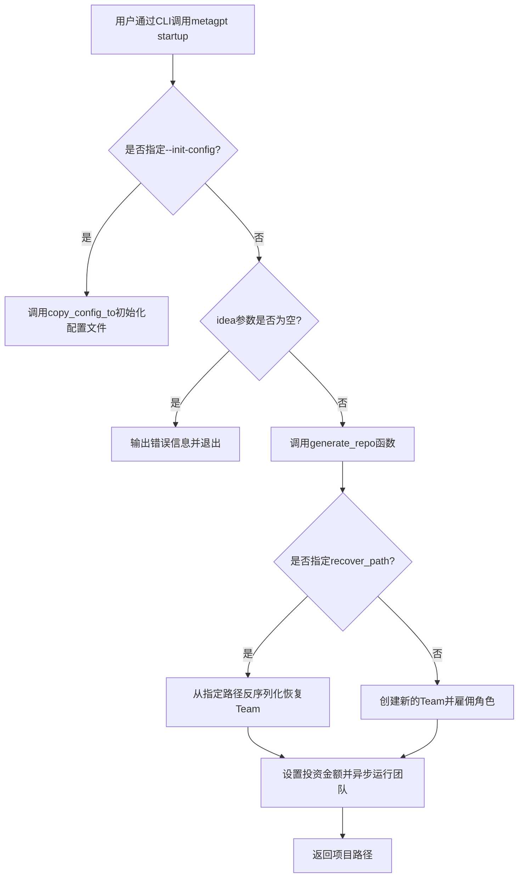
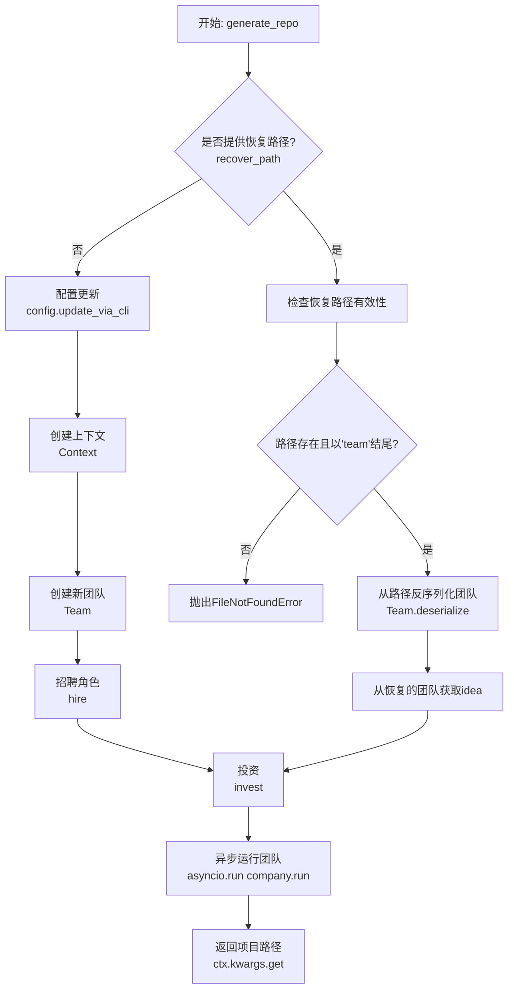
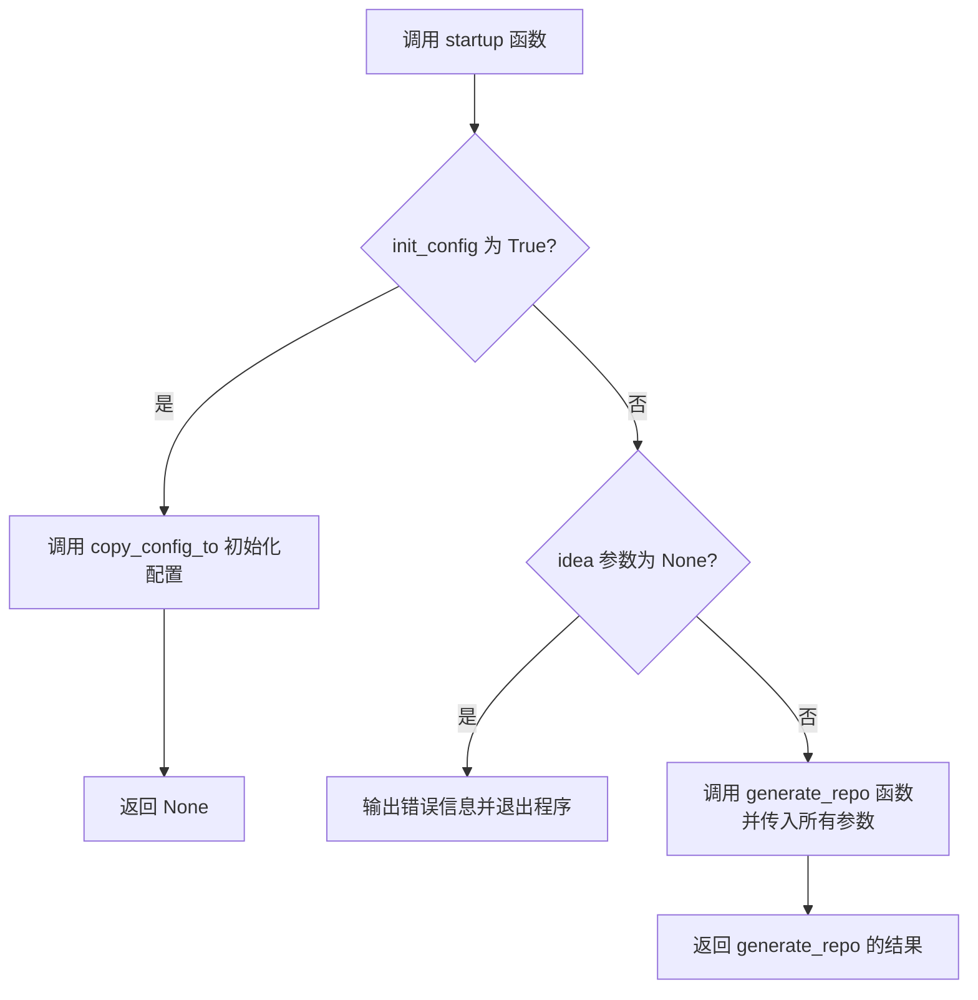
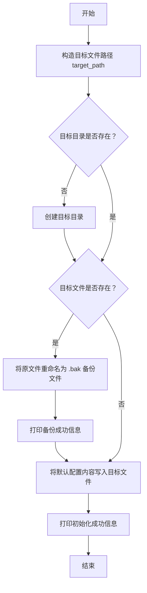
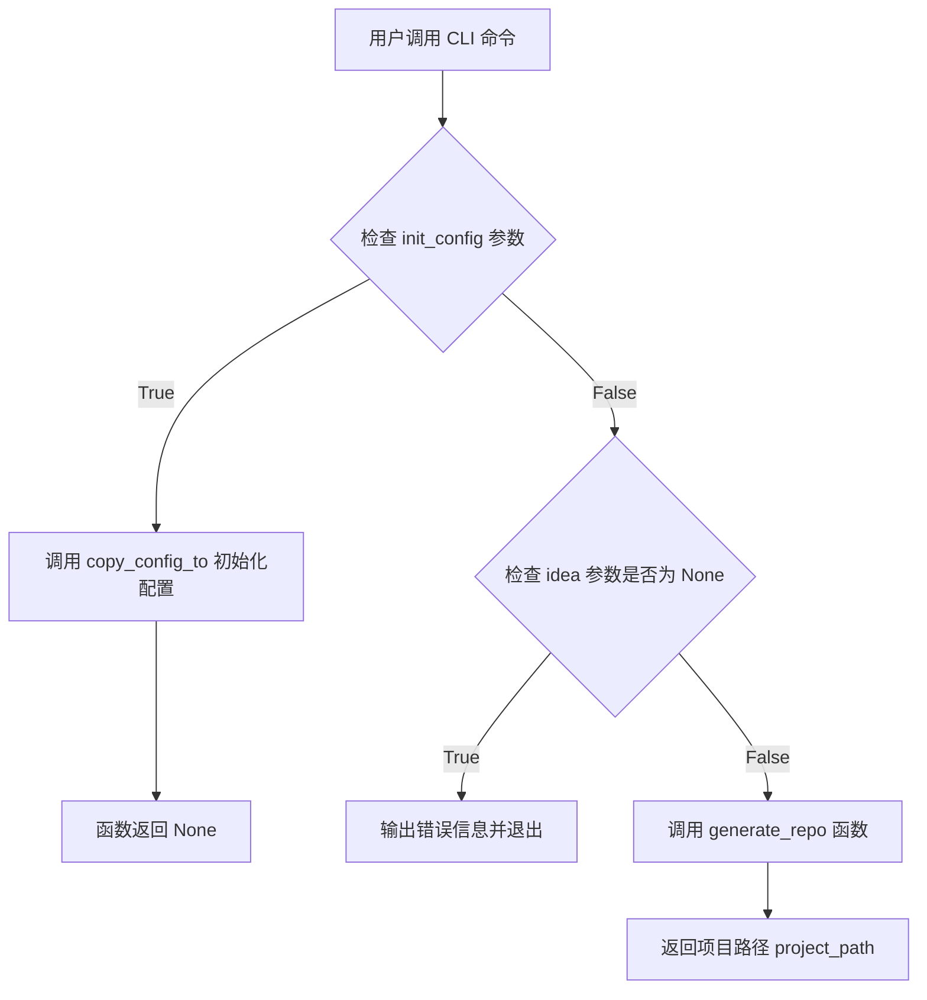
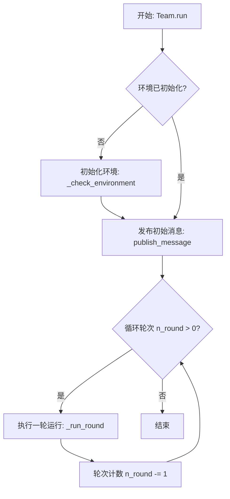
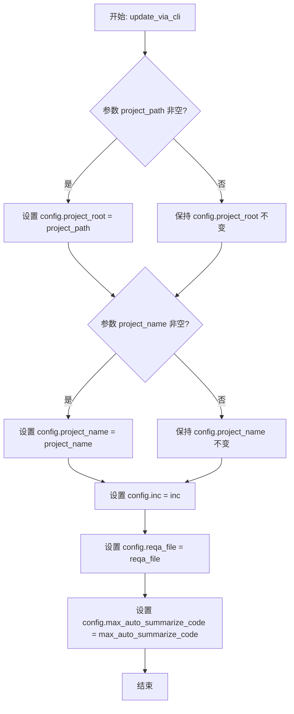

# `.\MetaGPT\metagpt\software_company.py` 详细设计文档

该文件是MetaGPT项目的命令行入口点，核心功能是接收用户输入（如创意想法、投资金额、项目名称等参数），初始化一个由多个AI角色（如产品经理、架构师、工程师等）组成的虚拟团队，并运行多轮模拟来协作生成软件项目代码。它支持创建新项目、从序列化状态恢复项目以及初始化配置文件。

## 整体流程



## 类结构

```
startup.py (主脚本)
├── 全局函数
│   ├── generate_repo
│   └── copy_config_to
├── Typer CLI 命令
│   └── startup
└── 全局变量
    ├── app (Typer实例)
    └── DEFAULT_CONFIG (配置模板字符串)
```

## 全局变量及字段


### `app`
    
Typer应用实例，用于定义和管理命令行接口（CLI）的命令和参数。

类型：`typer.Typer`
    


### `DEFAULT_CONFIG`
    
默认的配置文件内容字符串，包含LLM（大语言模型）等基础配置的YAML模板。

类型：`str`
    


    

## 全局函数及方法


### `generate_repo`

`generate_repo` 函数是 MetaGPT 项目的核心启动逻辑，负责根据用户提供的创意（idea）和一系列配置参数，初始化一个由多个 AI 角色（如产品经理、架构师、工程师等）组成的虚拟团队，并驱动该团队进行多轮协作，最终生成一个软件项目。该函数支持从零开始创建新项目，也支持从序列化状态恢复现有项目。

参数：

-  `idea`：`str`，项目的核心创意或需求描述，例如“创建一个 2048 游戏”。
-  `investment`：`float`，投资金额（美元），用于控制团队的资源。
-  `n_round`：`int`，团队协作的模拟轮数。
-  `code_review`：`bool`，是否启用代码审查。
-  `run_tests`：`bool`，是否启用测试（目前代码中已注释，未实际启用）。
-  `implement`：`bool`，是否启用代码实现（目前代码中已注释，未实际启用）。
-  `project_name`：`str`，项目的唯一名称，如“game_2048”。
-  `inc`：`bool`，是否为增量模式，用于与现有代码仓库协同工作。
-  `project_path`：`str`，指定旧版本项目的目录路径，以满足增量需求。
-  `reqa_file`：`str`，指定用于重写质量保证代码的源文件名。
-  `max_auto_summarize_code`：`int`，自动调用“SummarizeCode”操作的最大次数，用于调试工作流。
-  `recover_path`：`str`，从现有的序列化存储文件路径恢复项目。

返回值：`str`，返回项目生成的根目录路径（`project_path`）。

#### 流程图



#### 带注释源码

```python
def generate_repo(
    idea, # 核心创意，字符串类型
    investment=3.0, # 投资金额，浮点数，默认3.0
    n_round=5, # 模拟轮数，整数，默认5
    code_review=True, # 是否启用代码审查，布尔值，默认True
    run_tests=False, # 是否启用测试，布尔值，默认False（当前未使用）
    implement=True, # 是否启用实现，布尔值，默认True（当前未使用）
    project_name="", # 项目名称，字符串，默认空
    inc=False, # 增量模式标志，布尔值，默认False
    project_path="", # 项目路径，字符串，默认空
    reqa_file="", # 质量保证文件，字符串，默认空
    max_auto_summarize_code=0, # 最大自动总结代码次数，整数，默认0
    recover_path=None, # 恢复路径，字符串，默认None
):
    """Run the startup logic. Can be called from CLI or other Python scripts."""
    # 动态导入，避免循环依赖或启动时加载所有模块
    from metagpt.config2 import config
    from metagpt.context import Context
    from metagpt.roles import (
        Architect,
        DataAnalyst,
        Engineer2,
        ProductManager,
        TeamLeader,
    )
    from metagpt.team import Team

    # 1. 根据命令行参数更新全局配置
    config.update_via_cli(project_path, project_name, inc, reqa_file, max_auto_summarize_code)
    # 2. 使用更新后的配置创建运行时上下文
    ctx = Context(config=config)

    # 3. 判断是创建新团队还是从文件恢复团队
    if not recover_path:
        # 3.1 创建新团队流程
        company = Team(context=ctx)
        # 3.2 为团队招聘一系列预定义的角色
        company.hire(
            [
                TeamLeader(), # 团队领导
                ProductManager(), # 产品经理
                Architect(), # 架构师
                Engineer2(), # 工程师
                # ProjectManager(), # 项目经理（已注释）
                DataAnalyst(), # 数据分析师
            ]
        )
        # （注释掉的代码显示了根据`implement`和`run_tests`参数动态招聘工程师和QA工程师的逻辑）
    else:
        # 3.3 从文件恢复团队流程
        stg_path = Path(recover_path) # 将路径字符串转换为Path对象
        # 3.4 验证恢复路径的有效性
        if not stg_path.exists() or not str(stg_path).endswith("team"):
            raise FileNotFoundError(f"{recover_path} not exists or not endswith `team`")
        # 3.5 从序列化文件反序列化团队对象
        company = Team.deserialize(stg_path=stg_path, context=ctx)
        # 3.6 从恢复的团队对象中获取idea，覆盖传入的参数
        idea = company.idea

    # 4. 为团队注入资金（影响资源分配）
    company.invest(investment)
    # 5. 异步运行团队的核心协作循环，传入轮数和创意
    asyncio.run(company.run(n_round=n_round, idea=idea))

    # 6. 从上下文中获取最终生成的项目路径并返回
    return ctx.kwargs.get("project_path")
```


### `startup`

`startup` 函数是 MetaGPT 命令行工具的主入口点，用于启动一个新的 AI 项目。它解析用户通过命令行提供的参数，并根据这些参数（如是否初始化配置、是否恢复项目等）决定执行流程。其核心功能是协调项目生成过程，包括配置初始化、团队创建、投资注入以及异步运行多轮次的项目开发模拟。

参数：

-  `idea`：`str`，项目的核心创意描述，例如“创建一个 2048 游戏”。如果未提供，程序将报错退出。
-  `investment`：`float`，投资到 AI 公司的美元金额，用于控制项目资源。
-  `n_round`：`int`，项目模拟运行的轮次数。
-  `code_review`：`bool`，是否启用代码审查。
-  `run_tests`：`bool`，是否启用 QA 以添加和运行测试。
-  `implement`：`bool`，是否启用代码实现。
-  `project_name`：`str`，项目的唯一名称，例如“game_2048”。
-  `inc`：`bool`，增量模式。用于与现有代码仓库协作。
-  `project_path`：`str`，指定旧版本项目的目录路径，以满足增量需求。
-  `reqa_file`：`str`，指定用于重写质量保证代码的源文件名。
-  `max_auto_summarize_code`：`int`，自动调用“SummarizeCode”操作的最大次数，-1 表示无限制。用于调试工作流。
-  `recover_path`：`str`，从现有的序列化存储中恢复项目的路径。
-  `init_config`：`bool`，是否初始化 MetaGPT 的配置文件。

返回值：`Any`（实际为 `None` 或 `str`），当 `init_config` 为 `True` 时返回 `None`；否则返回 `generate_repo` 函数的结果，通常是一个项目路径字符串。

#### 流程图



#### 带注释源码

```python
@app.command("", help="Start a new project.")  # 使用 Typer 装饰器定义 CLI 命令
def startup(
    idea: str = typer.Argument(None, help="Your innovative idea, such as 'Create a 2048 game.'"),
    investment: float = typer.Option(default=3.0, help="Dollar amount to invest in the AI company."),
    n_round: int = typer.Option(default=5, help="Number of rounds for the simulation."),
    code_review: bool = typer.Option(default=True, help="Whether to use code review."),
    run_tests: bool = typer.Option(default=False, help="Whether to enable QA for adding & running tests."),
    implement: bool = typer.Option(default=True, help="Enable or disable code implementation."),
    project_name: str = typer.Option(default="", help="Unique project name, such as 'game_2048'."),
    inc: bool = typer.Option(default=False, help="Incremental mode. Use it to coop with existing repo."),
    project_path: str = typer.Option(
        default="",
        help="Specify the directory path of the old version project to fulfill the incremental requirements.",
    ),
    reqa_file: str = typer.Option(
        default="", help="Specify the source file name for rewriting the quality assurance code."
    ),
    max_auto_summarize_code: int = typer.Option(
        default=0,
        help="The maximum number of times the 'SummarizeCode' action is automatically invoked, with -1 indicating "
        "unlimited. This parameter is used for debugging the workflow.",
    ),
    recover_path: str = typer.Option(default=None, help="recover the project from existing serialized storage"),
    init_config: bool = typer.Option(default=False, help="Initialize the configuration file for MetaGPT."),
):
    """Run a startup. Be a boss."""  # 函数文档字符串
    if init_config:  # 检查是否要初始化配置
        copy_config_to()  # 调用配置初始化函数
        return  # 初始化完成后直接返回

    if idea is None:  # 检查核心创意参数是否缺失
        typer.echo("Missing argument 'IDEA'. Run 'metagpt --help' for more information.")  # 输出错误信息
        raise typer.Exit()  # 抛出退出异常，终止程序

    # 调用核心的项目生成函数，并传递所有参数
    return generate_repo(
        idea,
        investment,
        n_round,
        code_review,
        run_tests,
        implement,
        project_name,
        inc,
        project_path,
        reqa_file,
        max_auto_summarize_code,
        recover_path,
    )
```


### `copy_config_to`

该函数用于初始化 MetaGPT 的配置文件。它会检查默认配置文件路径下是否存在配置文件，如果存在则将其备份为 `.bak` 文件，然后创建一个新的配置文件，内容为预定义的默认配置。

参数：
- 无参数

返回值：`None`，无返回值

#### 流程图



#### 带注释源码

```python
def copy_config_to():
    """Initialize the configuration file for MetaGPT."""
    # 1. 构造配置文件的完整目标路径
    target_path = CONFIG_ROOT / "config2.yaml"

    # 2. 确保目标文件的父目录存在，如果不存在则创建
    target_path.parent.mkdir(parents=True, exist_ok=True)

    # 3. 如果目标配置文件已经存在，则将其重命名为 .bak 文件进行备份
    if target_path.exists():
        backup_path = target_path.with_suffix(".bak")
        target_path.rename(backup_path)
        # 4. 打印备份文件的位置信息
        print(f"Existing configuration file backed up at {backup_path}")

    # 5. 将预定义的默认配置内容写入目标文件
    target_path.write_text(DEFAULT_CONFIG, encoding="utf-8")
    # 6. 打印新配置文件的位置信息
    print(f"Configuration file initialized at {target_path}")
```

### `Typer.command`

这是一个使用 Typer 库定义的 CLI 命令装饰器。它用于将 `startup` 函数注册为一个命令行接口命令，当用户在终端中运行 `metagpt` 并传入相应参数时，会调用此函数。该命令是 MetaGPT 项目的主要入口点，用于启动一个由 AI 角色组成的“公司”来执行给定的创意项目。

参数：

- `idea`：`str`，用户的创新想法，例如“创建一个 2048 游戏”。这是一个必需的位置参数。
- `investment`：`float`，投资到 AI 公司的美元金额。默认值为 3.0。
- `n_round`：`int`，模拟运行的轮数。默认值为 5。
- `code_review`：`bool`，是否启用代码审查。默认值为 `True`。
- `run_tests`：`bool`，是否启用 QA 以添加和运行测试。默认值为 `False`。
- `implement`：`bool`，启用或禁用代码实现。默认值为 `True`。
- `project_name`：`str`，唯一的项目名称，例如“game_2048”。默认值为空字符串。
- `inc`：`bool`，增量模式。用于与现有代码仓库协作。默认值为 `False`。
- `project_path`：`str`，指定旧版本项目的目录路径以满足增量需求。默认值为空字符串。
- `reqa_file`：`str`，指定用于重写质量保证代码的源文件名。默认值为空字符串。
- `max_auto_summarize_code`：`int`，自动调用“SummarizeCode”操作的最大次数，-1 表示无限制。此参数用于调试工作流。默认值为 0。
- `recover_path`：`str`，从现有的序列化存储中恢复项目。默认值为 `None`。
- `init_config`：`bool`，初始化 MetaGPT 的配置文件。默认值为 `False`。

返回值：`str`，返回项目路径（`project_path`），该路径由内部函数 `generate_repo` 从上下文中提取并返回。

#### 流程图



#### 带注释源码

```python
@app.command("", help="Start a new project.")  # 使用 Typer 装饰器将函数注册为 CLI 命令，命令名为空字符串（即根命令），帮助信息为“Start a new project.”
def startup(
    idea: str = typer.Argument(None, help="Your innovative idea, such as 'Create a 2048 game.'"),  # 定义必需的位置参数 `idea`，类型为字符串，帮助信息描述其用途
    investment: float = typer.Option(default=3.0, help="Dollar amount to invest in the AI company."),  # 定义可选参数 `investment`，类型为浮点数，默认值 3.0
    n_round: int = typer.Option(default=5, help="Number of rounds for the simulation."),  # 定义可选参数 `n_round`，类型为整数，默认值 5
    code_review: bool = typer.Option(default=True, help="Whether to use code review."),  # 定义可选参数 `code_review`，类型为布尔值，默认值 True
    run_tests: bool = typer.Option(default=False, help="Whether to enable QA for adding & running tests."),  # 定义可选参数 `run_tests`，类型为布尔值，默认值 False
    implement: bool = typer.Option(default=True, help="Enable or disable code implementation."),  # 定义可选参数 `implement`，类型为布尔值，默认值 True
    project_name: str = typer.Option(default="", help="Unique project name, such as 'game_2048'."),  # 定义可选参数 `project_name`，类型为字符串，默认值空字符串
    inc: bool = typer.Option(default=False, help="Incremental mode. Use it to coop with existing repo."),  # 定义可选参数 `inc`，类型为布尔值，默认值 False
    project_path: str = typer.Option(
        default="",
        help="Specify the directory path of the old version project to fulfill the incremental requirements.",  # 定义可选参数 `project_path`，类型为字符串，默认值空字符串，帮助信息说明其用于增量模式
    ),
    reqa_file: str = typer.Option(
        default="", help="Specify the source file name for rewriting the quality assurance code."  # 定义可选参数 `reqa_file`，类型为字符串，默认值空字符串，帮助信息说明其用于指定重写 QA 代码的文件
    ),
    max_auto_summarize_code: int = typer.Option(
        default=0,
        help="The maximum number of times the 'SummarizeCode' action is automatically invoked, with -1 indicating "
        "unlimited. This parameter is used for debugging the workflow.",  # 定义可选参数 `max_auto_summarize_code`，类型为整数，默认值 0，帮助信息说明其用于控制自动代码总结的次数
    ),
    recover_path: str = typer.Option(default=None, help="recover the project from existing serialized storage"),  # 定义可选参数 `recover_path`，类型为字符串，默认值 None，帮助信息说明其用于从序列化存储恢复项目
    init_config: bool = typer.Option(default=False, help="Initialize the configuration file for MetaGPT."),  # 定义可选参数 `init_config`，类型为布尔值，默认值 False，帮助信息说明其用于初始化配置文件
):
    """Run a startup. Be a boss."""  # 函数的文档字符串，简要描述功能
    if init_config:  # 检查 `init_config` 参数是否为 True
        copy_config_to()  # 如果为 True，则调用 `copy_config_to` 函数来初始化配置文件
        return  # 初始化配置后直接返回，不执行后续逻辑

    if idea is None:  # 检查必需的 `idea` 参数是否为 None
        typer.echo("Missing argument 'IDEA'. Run 'metagpt --help' for more information.")  # 如果为 None，则输出错误信息
        raise typer.Exit()  # 抛出 Typer 的 Exit 异常以终止程序

    return generate_repo(  # 调用核心的 `generate_repo` 函数，并传入所有参数
        idea,
        investment,
        n_round,
        code_review,
        run_tests,
        implement,
        project_name,
        inc,
        project_path,
        reqa_file,
        max_auto_summarize_code,
        recover_path,
    )
```


### `Team.hire`

该方法用于为团队（`Team` 实例）雇佣（添加）一个或多个角色（`Role` 实例）。它将传入的角色列表添加到团队的成员列表中，并为每个角色设置其所属的团队上下文。

参数：
-  `roles`：`list[Role]`，一个包含要雇佣的`Role`实例的列表。

返回值：`None`，该方法不返回任何值。

#### 流程图

```mermaid
flowchart TD
    A[开始：调用 Team.hire(roles)] --> B{检查 roles 参数是否为列表?};
    B -- 是 --> C[遍历 roles 列表];
    B -- 否 --> D[抛出异常或忽略];
    C --> E[对于列表中的每个 role];
    E --> F[将 role 添加到 self._roles 列表中];
    F --> G[设置 role 的团队上下文<br>role.set_team(self)];
    G --> H{是否还有下一个 role?};
    H -- 是 --> E;
    H -- 否 --> I[结束];
    D --> I;
```

#### 带注释源码

```python
def hire(self, roles: list[Role]):
    """
    雇佣（添加）一个或多个角色到团队中。
    参数:
        roles (list[Role]): 要添加到团队的角色列表。
    """
    # 遍历传入的角色列表
    for role in roles:
        # 将角色实例添加到团队的内部成员列表 `_roles` 中
        self._roles.append(role)
        # 为角色设置其所属的团队上下文，使角色知道自己是哪个团队的成员
        role.set_team(self)
```


### `Team.invest`

该方法为团队注入初始资金，设置每个角色的初始预算分配。它根据投资金额计算每个角色的预算，并将预算分配给团队中的每个成员角色。

参数：

-  `investment`：`float`，投资的美元金额，用于分配给团队中的各个角色

返回值：`None`，无返回值

#### 流程图

```mermaid
flowchart TD
    A[开始] --> B{investment > 0?}
    B -- 是 --> C[计算每个角色的预算<br/>budget_per_role = investment / len(roles)]
    C --> D[遍历团队中的每个角色]
    D --> E[设置角色预算<br/>role.set_budget(budget_per_role)]
    E --> F{是否还有下一个角色?}
    F -- 是 --> D
    F -- 否 --> G[结束]
    B -- 否 --> G
```

#### 带注释源码

```python
def invest(self, investment: float):
    """
    为团队注入资金。
    根据投资金额计算每个角色的预算，并分配给每个角色。
    Args:
        investment (float): 投资的美元金额。
    """
    # 检查投资金额是否为正数
    if investment <= 0:
        return

    # 计算每个角色应得的平均预算
    # 团队中的角色数量通过 `self.roles` 获取
    budget_per_role = investment / len(self.roles)

    # 遍历团队中的所有角色
    for role in self.roles:
        # 为每个角色设置其预算
        role.set_budget(budget_per_role)
```


### `Team.run`

`Team.run` 方法是 MetaGPT 框架中团队协作执行的核心异步方法。它负责启动并运行一个由多个 AI 角色（如产品经理、架构师、工程师等）组成的虚拟团队，通过多轮次的异步消息传递与任务执行，将用户输入的创意（`idea`）逐步转化为具体的软件项目产出（如代码、文档等）。该方法封装了团队从初始化、角色间协作到最终任务完成的完整生命周期。

参数：

-  `n_round`：`int`，指定团队模拟运行的轮次数量。每一轮代表一次完整的“发布-订阅-处理”消息循环，控制着团队协作的深度和迭代次数。
-  `idea`：`str`，项目的核心创意或需求描述。这是驱动整个团队工作的初始输入和最终目标。

返回值：`None`，此方法为异步执行方法，不直接返回结果，其产出（如生成的代码文件）会通过团队内部角色的行动（`Action`）输出到指定的项目路径中。

#### 流程图



#### 带注释源码

```python
    async def run(self, n_round: int = 5, idea: str = ""):
        """
        Run the team for n_round times.
        运行团队 n_round 轮次。
        Args:
            n_round (int): The number of rounds to run the team. 团队运行的轮次数。
            idea (str): The idea to run the team with. 运行团队的初始想法。
        """
        # 检查并初始化运行环境，确保所有必要的组件（如消息队列、角色状态）已就绪。
        await self._check_environment()
        # 将初始的创意（idea）作为一条系统消息发布到团队的消息系统中，启动整个协作流程。
        self.publish_message(message=Message(role="BOSS", content=idea, cause_by=UserRequirement))
        # 循环执行指定轮次。每一轮中，团队内的所有角色会根据当前消息队列中的内容进行反应、执行动作并产生新的消息。
        while n_round > 0:
            await self._run_round()  # 执行单轮团队协作
            n_round -= 1  # 轮次计数器减一
        return
```


### `Team.deserialize`

`Team.deserialize` 是一个类方法，用于从指定的序列化存储路径（`stg_path`）中恢复一个 `Team` 对象（即一个“公司”或团队）的完整状态。它通过读取序列化文件，重建团队结构、成员角色、内部状态（如想法、投资额）以及上下文环境，从而允许中断的项目流程从中断点继续执行。

参数：

-  `stg_path`：`pathlib.Path`，指向包含团队序列化数据的文件或目录路径。通常是以 `"team"` 结尾的文件。
-  `context`：`metagpt.context.Context`，用于恢复团队运行的新上下文环境，包含配置等信息。

返回值：`metagpt.team.Team`，返回一个从序列化状态恢复的、功能完整的 `Team` 对象。

#### 流程图

```mermaid
flowchart TD
    A[开始: Team.deserialize(stg_path, context)] --> B{检查 stg_path 有效性};
    B -- 路径无效 --> C[抛出 FileNotFoundError];
    B -- 路径有效 --> D[从 stg_path 加载序列化数据];
    D --> E[使用加载的数据和 context 实例化 Team 对象];
    E --> F[返回恢复的 Team 对象];
    F --> G[结束];
```

#### 带注释源码

```python
# 注意：以下代码是基于提供的上下文和 MetaGPT 项目常见模式推断出的 `Team.deserialize` 方法实现。
# 实际源码可能略有不同，但核心逻辑一致。

@classmethod
def deserialize(cls, stg_path: Path, context: "Context") -> "Team":
    """
    从序列化存储中恢复团队状态。

    Args:
        stg_path (Path): 序列化数据的存储路径。
        context (Context): 新的运行上下文。

    Returns:
        Team: 恢复后的团队实例。

    Raises:
        FileNotFoundError: 如果序列化文件不存在或路径格式不正确。
    """
    # 1. 验证序列化文件路径
    # 通常，序列化文件是一个以特定后缀（如 "team"）结尾的文件或目录。
    # 这里检查路径是否存在且符合预期格式。
    if not stg_path.exists() or not str(stg_path).endswith("team"):
        raise FileNotFoundError(f"{stg_path} does not exist or does not end with 'team'")

    # 2. 从文件系统加载序列化数据
    # 这可能涉及读取 pickle 文件、JSON 文件或特定格式的目录结构。
    # 加载的数据应包含团队的核心属性，如角色列表、内部状态等。
    # 伪代码：serialized_data = load_from_disk(stg_path)
    serialized_data = cls._load_serialized_data(stg_path)

    # 3. 使用加载的数据和提供的上下文创建新的 Team 实例
    # 类方法 `cls` 指代 `Team` 类本身。
    # 这里可能调用一个内部构造函数或使用 `__new__` 和 `__init__` 的组合。
    # 伪代码：team_instance = cls.__new__(cls)
    #         team_instance.__dict__.update(serialized_data)
    #         team_instance.context = context  # 注入新的上下文
    team_instance = cls._reconstruct_from_data(serialized_data, context)

    # 4. 返回恢复的团队对象
    # 此时，团队已准备好继续执行（例如，调用 `company.run`）。
    return team_instance
```


### `config.update_via_cli`

此方法用于通过命令行接口（CLI）提供的参数来更新全局配置对象 `config`。它接收来自 `startup` 命令的参数，并将它们设置到配置对象中，以便后续的团队构建和项目执行流程使用。该方法的核心功能是将用户通过命令行指定的项目路径、名称、增量模式等运行时选项同步到系统的配置管理器中。

参数：

-  `project_path`：`str`，指定旧版本项目的目录路径，用于满足增量开发需求。
-  `project_name`：`str`，项目的唯一名称，例如 `'game_2048'`。
-  `inc`：`bool`，是否启用增量模式。用于与现有代码仓库协同工作。
-  `reqa_file`：`str`，指定用于重写质量保证代码的源文件名。
-  `max_auto_summarize_code`：`int`，自动调用 `SummarizeCode` 操作的最大次数，-1 表示无限制，主要用于调试工作流。

返回值：`None`，此方法不返回任何值，其作用是通过副作用修改全局配置对象。

#### 流程图



#### 带注释源码

```python
def update_via_cli(self, project_path: str = "", project_name: str = "", inc: bool = False, reqa_file: str = "", max_auto_summarize_code: int = 0):
    """
    通过命令行参数更新配置。
    此方法通常在 `startup` 命令中被调用，用于将运行时选项应用到配置中。
    Args:
        project_path (str): 项目根目录路径。如果提供，将覆盖配置中的 `project_root`。
        project_name (str): 项目名称。如果提供，将覆盖配置中的 `project_name`。
        inc (bool): 是否启用增量开发模式。
        reqa_file (str): 质量保证（ReQA）相关的源文件路径。
        max_auto_summarize_code (int): 自动代码总结的最大执行次数限制。
    """
    # 如果提供了项目路径，则更新配置中的项目根目录
    if project_path:
        self.project_root = project_path
    # 如果提供了项目名称，则更新配置中的项目名称
    if project_name:
        self.project_name = project_name
    # 设置增量模式标志
    self.inc = inc
    # 设置质量保证文件路径
    self.reqa_file = reqa_file
    # 设置自动代码总结的最大次数
    self.max_auto_summarize_code = max_auto_summarize_code
```


## 关键组件


### 项目启动与团队管理

负责解析用户输入参数，初始化项目配置，创建或恢复一个由多个AI角色（如团队领导、产品经理、架构师、工程师等）组成的虚拟团队，并驱动团队执行多轮协作以完成项目目标。

### 配置管理

负责加载、更新和管理应用程序的运行时配置，支持通过命令行参数动态覆盖配置项，并提供了初始化默认配置文件的功能。

### 命令行接口 (CLI)

提供用户与应用程序交互的命令行界面，定义启动命令及其参数，处理用户输入，并将参数传递给核心的业务逻辑函数。

### 序列化与恢复

支持将团队状态序列化保存到文件系统，并能够从指定的序列化文件路径恢复团队状态，以实现项目进度的持久化和断点续传。

### 异步任务执行

利用异步编程模型来协调和管理团队中多个AI角色的并发执行流程，确保模拟的回合制协作能够高效运行。


## 问题及建议


### 已知问题

-   **同步与异步混合调用**：`generate_repo` 函数是一个同步函数，但其内部通过 `asyncio.run(company.run(...))` 调用了异步方法。这种模式在嵌套的事件循环或某些上下文中（如已存在运行中的事件循环）可能导致运行时错误。
-   **硬编码的团队角色**：`generate_repo` 函数中创建团队时，硬编码了 `TeamLeader`, `ProductManager`, `Architect`, `Engineer2`, `DataAnalyst` 等角色。这使得团队组成缺乏灵活性，无法根据不同的项目需求（例如，不需要数据分析师的项目）动态调整。
-   **配置初始化逻辑耦合**：`startup` 命令函数中，`init_config` 选项的处理逻辑与项目生成的主逻辑耦合在一起。这降低了函数的单一职责性，使得测试和理解变得复杂。
-   **错误处理不充分**：在 `recover_path` 路径恢复逻辑中，仅检查了路径是否存在以及是否以 `"team"` 结尾，错误信息不够具体。此外，整个流程中缺乏对潜在异常（如网络错误、权限错误、序列化/反序列化失败）的捕获和处理。
-   **参数传递冗余**：`startup` 命令函数几乎将所有参数原样传递给 `generate_repo` 函数，这造成了参数列表的重复和维护负担。如果 `generate_repo` 的参数发生变化，`startup` 函数也必须同步更新。
-   **全局默认配置字符串**：`DEFAULT_CONFIG` 作为全局字符串常量存在，虽然当前简单，但如果配置变得复杂或需要支持多环境，这种方式将难以维护和扩展。

### 优化建议

-   **统一异步入口**：将 `generate_repo` 函数改为异步函数（`async def`），并在最外层（例如 `startup` 函数或 `__main__` 入口）调用 `asyncio.run`。这符合异步编程的最佳实践，能避免潜在的事件循环冲突。
-   **参数化团队角色配置**：将团队角色列表作为 `generate_repo` 函数的一个可选参数（例如 `roles: Optional[List[Role]] = None`）。当未提供时，使用当前默认列表作为后备。这提高了代码的灵活性和可测试性。
-   **分离配置初始化职责**：将 `init_config` 相关的逻辑完全分离到 `copy_config_to` 函数中。在 `startup` 函数中，如果 `init_config` 为 True，则直接调用 `copy_config_to()` 并返回，使函数职责更清晰。
-   **增强错误处理与日志记录**：
    -   在 `recover_path` 检查中，提供更详细的错误信息（例如，是文件不存在还是格式不符）。
    -   使用 `try...except` 块包裹核心业务逻辑（如 `company.run`），捕获可能出现的异常，并记录日志或向用户提供友好的错误提示。
    -   考虑对文件操作（如 `target_path.write_text`）添加异常处理。
-   **使用参数对象或字典**：考虑将 `generate_repo` 的众多参数封装到一个 `ProjectConfig` 数据类或字典中。`startup` 函数负责构建这个配置对象，然后将其传递给 `generate_repo`。这可以简化函数签名，提高可读性和可维护性。
-   **外部化默认配置**：将 `DEFAULT_CONFIG` 的内容移动到一个单独的模板文件（如 `config2.yaml.template`）中。`copy_config_to` 函数读取该模板文件并写入目标位置。这样做便于管理和更新默认配置，也支持更复杂的配置模板。
-   **添加类型注解完整性**：为 `generate_repo` 函数添加完整的返回类型注解（目前缺失）。为所有函数参数和返回值添加精确的类型提示，以提高代码的清晰度和工具支持（如静态类型检查）。
-   **提高代码可测试性**：将 `generate_repo` 函数中的依赖（如从 `metagpt` 模块的导入）通过参数注入，而不是在函数内部硬编码导入。这允许在单元测试中轻松模拟这些依赖。


## 其它


### 设计目标与约束

本模块是MetaGPT项目的核心命令行入口，旨在提供一个用户友好的界面，通过模拟一个由AI角色（如产品经理、架构师、工程师等）组成的“公司”来协作生成软件项目代码。其核心设计目标是：**将复杂的多智能体协作流程封装为简单的命令行参数，允许用户通过一个“想法”（idea）快速启动并生成可运行的代码仓库**。主要约束包括：1) 必须与底层的`metagpt`库深度集成，正确初始化配置和上下文；2) 需要支持两种主要运行模式：全新项目启动和从序列化状态恢复；3) 作为CLI工具，必须提供清晰的参数说明和错误提示。

### 错误处理与异常设计

模块的错误处理主要分为两类：**用户输入验证**和**运行时异常捕获**。
1.  **用户输入验证**：在`startup`函数中，通过`typer`检查`idea`参数是否为`None`，若缺失则打印帮助信息并退出。在`generate_repo`函数中，对`recover_path`参数进行验证，检查路径是否存在且以`"team"`结尾，否则抛出`FileNotFoundError`。
2.  **运行时异常捕获**：当前代码中未显式捕获`asyncio.run(company.run(...))`可能抛出的底层异常（如网络错误、LLM API调用失败等）。这些异常会直接向上抛出，导致CLI命令执行失败。这是一种“快速失败”（fail-fast）策略，依赖外部调用者或用户处理。`copy_config_to`函数在备份已存在的配置文件时，可能遇到文件权限或磁盘空间问题，但未做处理。

### 数据流与状态机

模块的核心数据流围绕`generate_repo`函数展开：
1.  **输入**：用户通过CLI提供的参数（idea, investment, n_round等）以及通过`config.update_via_cli`更新的配置。
2.  **处理**：
    *   **初始化阶段**：根据`recover_path`选择路径。若为空，则创建新的`Team`（公司）并雇佣一系列角色（`TeamLeader`, `ProductManager`等），初始化项目状态。若不为空，则从指定路径反序列化恢复已有的`Team`状态。
    *   **执行阶段**：调用`company.invest(investment)`设置预算，然后异步运行`company.run(n_round=n_round, idea=idea)`。此过程驱动多个AI角色进行多轮对话与协作，生成需求、设计、代码等产物。
3.  **输出**：最终的项目代码文件会生成在由配置决定的目录（`project_path`）中。`generate_repo`函数返回该路径。整个`Team`的执行过程隐含一个**多轮循环的状态机**，每轮中角色根据当前上下文（需求文档、设计文档、代码文件等）决定行动，更新共享上下文，推动项目状态演进。

### 外部依赖与接口契约

1.  **外部库依赖**：
    *   `typer`：用于构建命令行接口，定义参数、选项和帮助文本。
    *   `asyncio`：用于运行异步的团队协作流程（`company.run`）。
    *   `pathlib`：用于跨平台的文件路径操作。
    *   `metagpt`：核心业务逻辑库，依赖其`config2`, `Context`, `roles`, `team`等模块。
2.  **接口契约**：
    *   **对`metagpt`库的调用契约**：必须按照约定初始化`config`和`Context`。`Team`类的`hire`、`invest`、`run`方法以及`deserialize`类方法需被正确调用。
    *   **配置文件契约**：`copy_config_to`函数假设`CONFIG_ROOT`路径可写，并生成符合`config2.py`解析规则的YAML格式配置文件。
    *   **序列化/反序列化契约**：恢复项目时（`recover_path`），要求提供的路径必须是通过`Team.serialize()`方法生成的、且以`"team"`结尾的存储目录。
    *   **命令行接口契约**：作为可执行脚本，需响应`--help`，并严格按定义的参数类型（str, int, float, bool）和默认值处理输入。

    