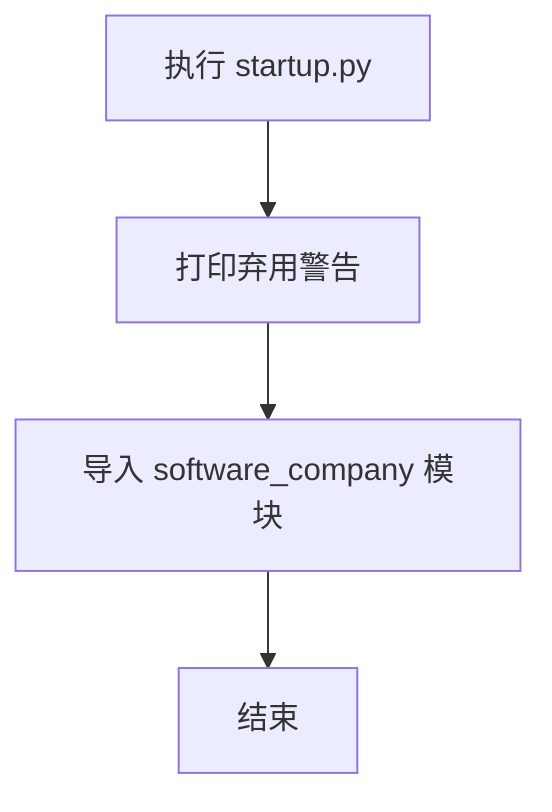

# `.\MetaGPT\metagpt\startup.py` 详细设计文档

该文件是一个已弃用的启动脚本，其核心功能已被迁移至 `software_company.py` 文件中。当前文件仅包含一个弃用声明和导入语句，不包含任何实际业务逻辑。

## 整体流程



## 类结构

```
无类层次结构
```

## 全局变量及字段


    

## 全局函数及方法


## 关键组件


### 代码废弃与迁移

该文件已被标记为废弃，其核心功能（启动逻辑）已迁移至新的主文件 `software_company.py`。当前文件仅作为遗留代码存在，不包含任何实际功能组件。


## 问题及建议


### 已知问题

-   **文件已废弃且功能缺失**：当前 `startup.py` 文件已被标记为 `DEPRECATED`，其核心功能已迁移至 `software_company.py`。这意味着此文件已不再包含任何有效的业务逻辑或执行流程，仅作为一个废弃的占位符存在，容易引起混淆。
-   **缺乏明确的废弃指引**：代码注释仅说明了文件已废弃并将被移除，但未提供任何关于替代方案（`software_company.py`）的具体使用指引、迁移路径或版本弃用计划，不利于开发者平滑过渡。
-   **存在维护风险**：保留一个已声明废弃但未实际移除的空文件，会增加项目结构的复杂性，并可能在未来的代码审查、依赖分析或重构中被误认为有效代码，导致不必要的维护开销。

### 优化建议

-   **立即移除废弃文件**：建议直接删除 `startup.py` 文件，以消除混淆并简化项目结构。这是处理已明确废弃且无迁移逻辑代码的最清晰方式。
-   **完善废弃与迁移文档**：如果因某些原因（如兼容性）需要暂时保留文件，应在文件头部添加更详细的注释，说明废弃原因、替代文件 (`software_company.py`) 的完整路径、功能差异以及具体的迁移步骤或示例。同时，在项目的 `README` 或相关文档中同步更新此信息。
-   **使用版本管理工具标记**：在删除文件前，确保在版本控制系统（如 Git）的提交信息中清晰记录此次删除行为，并引用相关的任务或决策记录，以便追溯。
-   **建立代码废弃流程**：建议团队建立统一的代码废弃与清理流程。例如，在代码中标记 `DEPRECATED` 后，设定一个明确的版本或时间窗口后自动移除，并通过 CI/CD 流程进行检测和提醒，避免废弃代码长期滞留。


## 其它


### 设计目标与约束

该代码文件 `startup.py` 的设计目标已明确为“弃用”。其主要约束是：作为遗留代码，其原有功能已迁移至 `software_company.py` 文件。当前文件的存在仅作为过渡，用于防止直接删除导致的引用错误，并明确告知开发者应使用新的实现。其核心设计目标是零功能、零依赖，仅提供清晰的弃用说明。

### 错误处理与异常设计

本文件不包含任何业务逻辑，因此没有自定义的错误处理或异常设计。如果被其他代码导入或执行，不会引发功能性的错误。唯一的“异常”情况是开发者忽略了文件顶部的弃用警告而继续使用它，但这属于开发流程和文档遵循问题，而非运行时异常。

### 数据流与状态机

本文件不处理任何数据，也没有状态变化。它是一个静态的、声明性的文件。其“数据流”仅限于文件被读取时，其中的注释文本信息被传达给开发者。不存在任何状态机。

### 外部依赖与接口契约

本文件没有任何外部依赖（不导入任何模块）。它也不定义或实现任何可供外部调用的接口、函数或类。因此，不存在需要维护的接口契约。其唯一对外的影响是通过模块导入系统暴露一个名为 `startup` 的模块对象，该对象不包含任何有效属性。

### 安全与合规性考虑

由于文件不包含可执行代码，仅包含注释，因此不存在代码注入、数据泄露等常规安全风险。从合规性角度看，清晰的弃用注释有助于遵循代码维护和清理的最佳实践，避免遗留未使用代码造成的维护负担和潜在混淆。

### 部署与配置

此文件无需特殊部署或配置。作为源代码的一部分，它应随项目一起分发。在最终移除前，其存在不影响应用程序的打包、部署或运行。没有环境变量、配置文件或启动参数与之相关。

### 测试策略

无需为弃用存根文件编写或执行单元测试、集成测试或端到端测试。任何试图测试该文件原有功能的测试用例都应已被迁移或更新，以指向 `software_company.py` 中的新实现。代码覆盖率工具应忽略此文件。

### 文档与知识传递

本文件自身即是其核心文档，通过顶部的多行注释明确传达了弃用状态和迁移目标。这构成了项目知识库的一部分，用于告知所有开发者该模块的当前状态和正确行动路径（即停止使用并转向新模块）。在架构文档中，应将其标记为“已弃用”。

    