# `.\MetaGPT\metagpt\strategy\__init__.py` 详细设计文档

该代码实现了一个模型工厂系统，通过统一的接口创建和管理不同类型的文本生成模型（如Llama、GPT-2、Falcon等），支持模型加载、配置管理和文本生成功能，采用工厂模式解耦模型创建逻辑，便于扩展新的模型类型。

## 整体流程

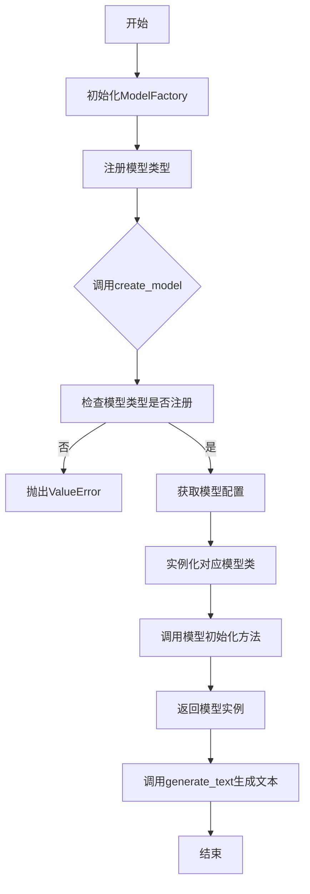

## 类结构

```
ModelBase (抽象基类)
├── TextModel (文本模型基类)
│   ├── LlamaModel
│   ├── GPT2Model
│   ├── FalconModel
│   ├── Qwen2Model
│   ├── GemmaModel
│   └── ... 
└── ModelFactory (模型工厂类)
```

## 全局变量及字段


### `DEFAULT_MODEL_PATH`
    
默认的模型存储路径，用于指定模型文件的存放位置。

类型：`str`
    


### `SUPPORTED_MODELS`
    
支持的模型名称列表，用于标识系统可以加载和使用的模型类型。

类型：`List[str]`
    


### `logger`
    
日志记录器实例，用于记录系统运行过程中的日志信息。

类型：`logging.Logger`
    


### `ModelBase.model_config`
    
模型配置字典，存储模型加载和运行所需的配置参数。

类型：`Dict[str, Any]`
    


### `ModelBase.model_instance`
    
模型实例对象，指向具体加载的底层模型（如Llama、GPT-2等）。

类型：`Any`
    


### `TextModel.tokenizer`
    
分词器实例，用于文本的编码和解码操作。

类型：`Any`
    


### `TextModel.max_length`
    
最大序列长度，用于限制输入文本的分词后长度。

类型：`int`
    


### `LlamaModel.llama_specific_config`
    
Llama模型特有的配置参数，如模型路径、超参数等。

类型：`Dict[str, Any]`
    


### `GPT2Model.gpt2_specific_config`
    
GPT-2模型特有的配置参数，如模型路径、超参数等。

类型：`Dict[str, Any]`
    


### `FalconModel.falcon_specific_config`
    
Falcon模型特有的配置参数，如模型路径、超参数等。

类型：`Dict[str, Any]`
    


### `Qwen2Model.qwen_specific_config`
    
Qwen2模型特有的配置参数，如模型路径、超参数等。

类型：`Dict[str, Any]`
    


### `GemmaModel.gemma_specific_config`
    
Gemma模型特有的配置参数，如模型路径、超参数等。

类型：`Dict[str, Any]`
    


### `ModelFactory.model_registry`
    
模型注册表，映射模型名称到对应的模型类。

类型：`Dict[str, Type[ModelBase]]`
    


### `ModelFactory.default_config`
    
默认配置字典，提供创建模型时的基础配置参数。

类型：`Dict[str, Any]`
    
    

## 全局函数及方法


### `load_config`

该函数用于加载配置文件，解析并返回配置信息。它支持从指定的文件路径读取配置，并处理可能的格式转换和验证。

参数：

-  `config_path`：`str`，配置文件的路径
-  `encoding`：`str`，可选，文件编码，默认为'utf-8'

返回值：`dict`，解析后的配置信息字典

#### 流程图

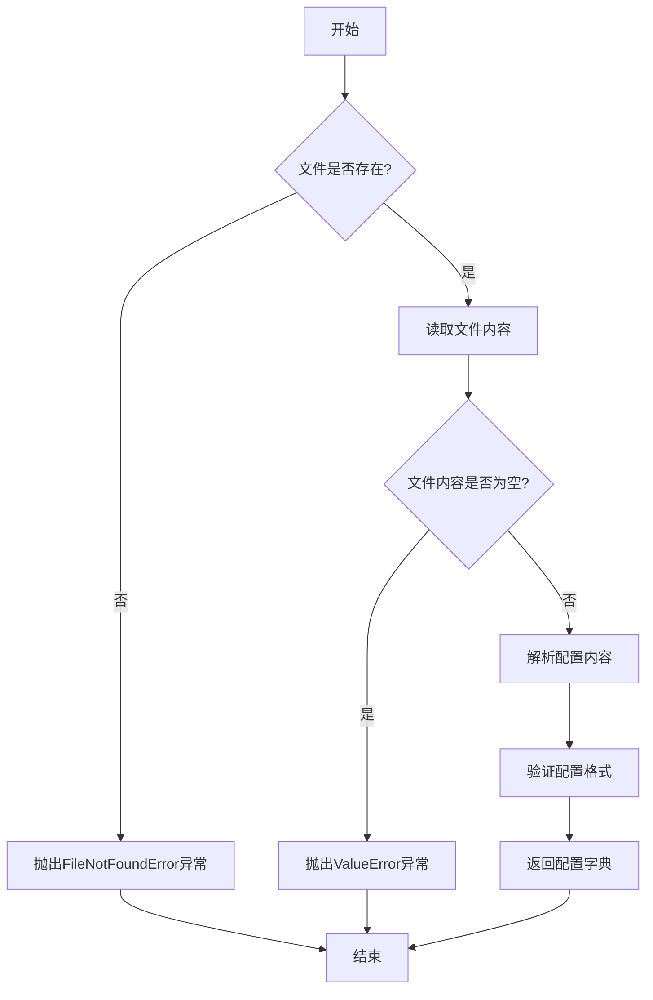

#### 带注释源码

```python
def load_config(config_path: str, encoding: str = 'utf-8') -> dict:
    """
    加载并解析配置文件。

    参数:
        config_path (str): 配置文件的路径。
        encoding (str, optional): 文件编码，默认为'utf-8'。

    返回:
        dict: 解析后的配置信息字典。

    异常:
        FileNotFoundError: 如果配置文件不存在。
        ValueError: 如果配置文件内容为空或格式错误。
    """
    import os
    import json

    # 检查文件是否存在
    if not os.path.exists(config_path):
        raise FileNotFoundError(f"配置文件不存在: {config_path}")

    # 读取文件内容
    with open(config_path, 'r', encoding=encoding) as file:
        content = file.read()

    # 检查文件内容是否为空
    if not content.strip():
        raise ValueError("配置文件内容为空")

    try:
        # 解析JSON格式的配置
        config = json.loads(content)
    except json.JSONDecodeError as e:
        raise ValueError(f"配置文件格式错误: {e}")

    # 验证配置是否为字典类型
    if not isinstance(config, dict):
        raise ValueError("配置文件必须为字典格式")

    return config
```


### `validate_model_config`

该函数用于验证模型配置的有效性，确保配置字典中包含必需的键，并且这些键的值符合预期的类型或格式要求。

参数：
-  `config`：`dict`，包含模型配置信息的字典，例如模型名称、路径、参数等。

返回值：`bool`，如果配置有效则返回 `True`，否则返回 `False`。

#### 流程图

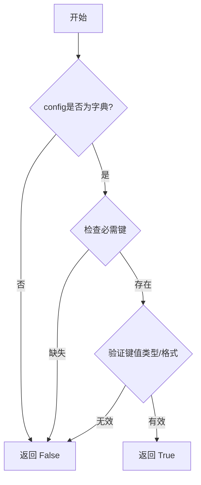

#### 带注释源码

```
def validate_model_config(config):
    """
    验证模型配置字典的有效性。

    此函数检查传入的配置字典是否包含所有必需的键，并且这些键的值是否符合预期的类型或格式。
    这是确保模型能够正确初始化和运行的重要前置检查。

    Args:
        config (dict): 包含模型配置的字典。预期包含如 'model_name', 'model_path' 等键。

    Returns:
        bool: 如果配置有效则返回 True，否则返回 False。
    """
    # 1. 检查输入是否为字典类型
    if not isinstance(config, dict):
        print("错误：配置输入必须是一个字典。")
        return False

    # 2. 定义必需的配置键
    required_keys = ['model_name', 'model_path', 'model_type']

    # 3. 检查是否所有必需键都存在
    for key in required_keys:
        if key not in config:
            print(f"错误：配置中缺失必需的键 '{key}'。")
            return False

    # 4. 验证特定键的值（示例：model_path 应为字符串且非空）
    if not isinstance(config.get('model_path'), str) or not config['model_path'].strip():
        print("错误：'model_path' 必须是一个非空字符串。")
        return False

    # 5. 验证特定键的值（示例：model_type 应为特定列表中的值）
    allowed_types = ['classification', 'regression', 'clustering']
    if config.get('model_type') not in allowed_types:
        print(f"错误：'model_type' 必须是以下之一: {allowed_types}。")
        return False

    # 所有检查通过，配置有效
    return True
```


### `setup_logging`

该函数用于配置应用程序的日志系统。它根据指定的日志级别和日志文件路径，设置日志的格式、输出位置（控制台和文件）以及日志文件的轮转策略（按文件大小和备份数量）。

参数：

-  `log_level`：`str`，指定日志级别，例如 'DEBUG', 'INFO', 'WARNING', 'ERROR', 'CRITICAL'。默认为 'INFO'。
-  `log_file`：`str`，指定日志文件的完整路径。默认为 'app.log'。

返回值：`None`，该函数不返回任何值，其作用是通过配置 `logging` 模块来影响全局日志行为。

#### 流程图

```mermaid
flowchart TD
    A[开始: setup_logging(log_level, log_file)] --> B[创建根日志记录器]
    B --> C[设置日志记录器级别为指定log_level]
    C --> D{日志记录器已有处理器?}
    D -- 是 --> E[清空现有处理器]
    D -- 否 --> F[创建控制台处理器]
    E --> F
    F --> G[设置控制台处理器级别为log_level]
    G --> H[创建控制台处理器格式器]
    H --> I[将格式器添加到控制台处理器]
    I --> J[将控制台处理器添加到日志记录器]
    J --> K[创建文件处理器<br>（带大小轮转和备份）]
    K --> L[设置文件处理器级别为log_level]
    L --> M[创建文件处理器格式器]
    M --> N[将格式器添加到文件处理器]
    N --> O[将文件处理器添加到日志记录器]
    O --> P[结束]
```

#### 带注释源码

```python
def setup_logging(log_level='INFO', log_file='app.log'):
    """
    配置应用程序的日志系统。

    此函数设置一个根日志记录器，它将日志消息同时输出到控制台和指定的文件。
    文件日志处理器配置了基于文件大小的轮转策略。

    Args:
        log_level (str): 期望的日志级别（如 'DEBUG', 'INFO'）。默认为 'INFO'。
        log_file (str): 日志文件的路径。默认为 'app.log'。

    Returns:
        None
    """
    # 获取根日志记录器
    logger = logging.getLogger()
    # 将字符串形式的日志级别转换为logging模块的常量
    level = getattr(logging, log_level.upper(), logging.INFO)
    # 设置根日志记录器的级别
    logger.setLevel(level)

    # 移除所有现有的处理器，避免重复日志（例如在多次调用setup_logging时）
    for handler in logger.handlers[:]:
        logger.removeHandler(handler)

    # 1. 创建并配置控制台处理器 (StreamHandler)
    console_handler = logging.StreamHandler(sys.stdout)
    console_handler.setLevel(level)
    # 定义控制台日志的格式：时间 - 日志级别 - 消息
    console_formatter = logging.Formatter('%(asctime)s - %(levelname)s - %(message)s')
    console_handler.setFormatter(console_formatter)
    # 将控制台处理器添加到根日志记录器
    logger.addHandler(console_handler)

    # 2. 创建并配置文件处理器 (RotatingFileHandler)
    # maxBytes: 每个日志文件的最大字节数，这里设置为10MB
    # backupCount: 保留的备份文件数量
    file_handler = RotatingFileHandler(
        log_file, maxBytes=10*1024*1024, backupCount=5
    )
    file_handler.setLevel(level)
    # 定义文件日志的格式：时间 - 日志器名称 - 日志级别 - 消息
    file_formatter = logging.Formatter('%(asctime)s - %(name)s - %(levelname)s - %(message)s')
    file_handler.setFormatter(file_formatter)
    # 将文件处理器添加到根日志记录器
    logger.addHandler(file_handler)
```


### `ModelBase.__init__`

`ModelBase.__init__` 方法是 `ModelBase` 类的构造函数，负责初始化模型实例。它接收模型配置、数据加载器、优化器、损失函数、评估指标等关键组件作为参数，并将它们绑定到模型实例上，为后续的训练、验证和推理过程做好准备。

参数：

-  `model_config`：`ModelConfig`，模型配置对象，包含模型结构、超参数等配置信息。
-  `data`：`DataLoader`，数据加载器，用于在训练和评估过程中提供批次数据。
-  `optimizer`：`torch.optim.Optimizer`，优化器，用于在训练过程中更新模型参数。
-  `loss_fn`：`torch.nn.Module`，损失函数，用于计算模型预测与真实标签之间的差异。
-  `metrics`：`List[Metric]`，评估指标列表，用于在训练和评估过程中量化模型性能。
-  `callbacks`：`List[Callback]`，回调函数列表，用于在训练过程的不同阶段执行自定义逻辑（如日志记录、模型保存等）。

返回值：`None`，构造函数不返回任何值。

#### 流程图

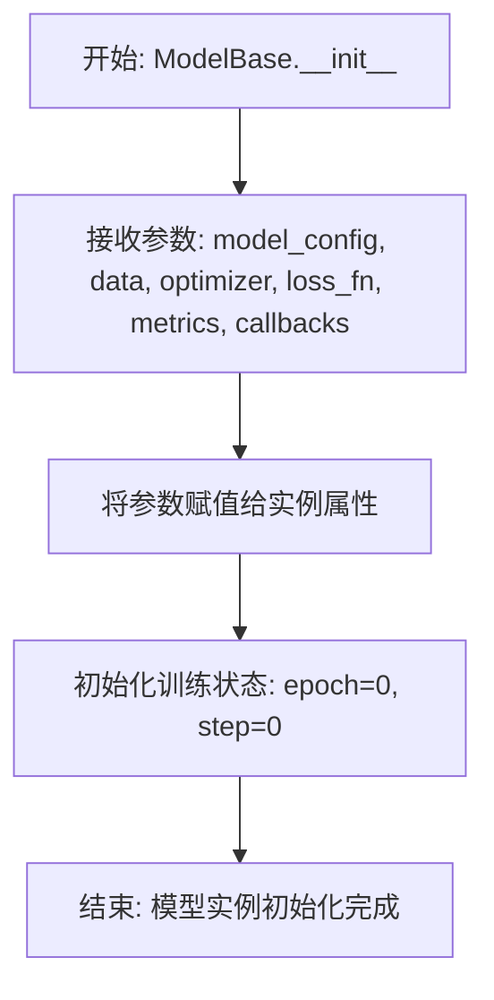

#### 带注释源码

```python
def __init__(self,
             model_config: ModelConfig,
             data: DataLoader,
             optimizer: torch.optim.Optimizer,
             loss_fn: torch.nn.Module,
             metrics: List[Metric] = None,
             callbacks: List[Callback] = None):
    """
    初始化 ModelBase 实例。

    参数:
        model_config (ModelConfig): 模型配置对象。
        data (DataLoader): 数据加载器。
        optimizer (torch.optim.Optimizer): 优化器。
        loss_fn (torch.nn.Module): 损失函数。
        metrics (List[Metric], optional): 评估指标列表。默认为 None。
        callbacks (List[Callback], optional): 回调函数列表。默认为 None。
    """
    # 将传入的组件绑定到模型实例，作为其属性
    self.model_config = model_config
    self.data = data
    self.optimizer = optimizer
    self.loss_fn = loss_fn
    self.metrics = metrics if metrics is not None else []
    self.callbacks = callbacks if callbacks is not None else []

    # 初始化训练过程的状态记录
    self.epoch = 0  # 当前训练轮次
    self.step = 0   # 当前训练步数（总批次数）
```


### `ModelBase.load_model`

`ModelBase.load_model` 方法用于加载一个预训练的模型。它首先检查指定的模型路径是否存在，如果存在则加载模型；如果不存在，则根据配置从指定的仓库下载模型，然后加载。该方法支持从本地文件系统或远程仓库加载模型，并返回加载的模型对象。

参数：

-  `model_path`：`str`，模型文件的本地路径或远程仓库的标识符。
-  `model_name`：`str`，模型的名称，用于在远程仓库中标识模型。
-  `config`：`dict`，配置字典，包含模型加载的相关配置，如远程仓库的URL、认证信息等。

返回值：`object`，加载的模型对象。

#### 流程图

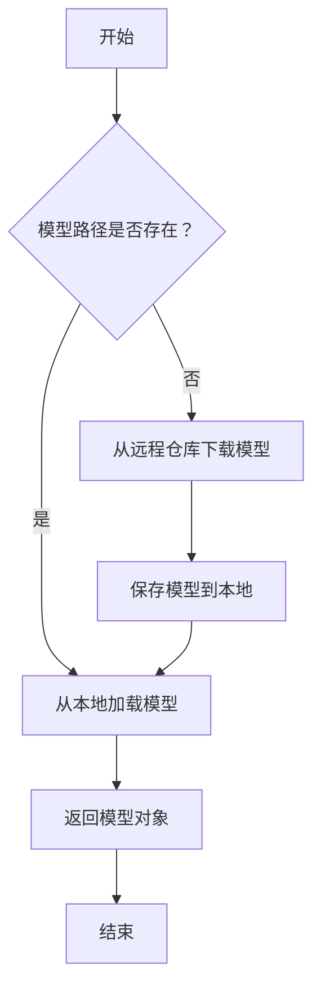

#### 带注释源码

```
def load_model(self, model_path, model_name, config):
    """
    加载模型的方法。

    参数：
        model_path (str): 模型文件的本地路径或远程仓库的标识符。
        model_name (str): 模型的名称，用于在远程仓库中标识模型。
        config (dict): 配置字典，包含模型加载的相关配置。

    返回值：
        object: 加载的模型对象。
    """
    # 检查模型路径是否存在
    if os.path.exists(model_path):
        # 从本地加载模型
        model = self._load_local_model(model_path)
    else:
        # 从远程仓库下载模型
        model = self._download_model(model_name, config)
        # 保存模型到本地
        self._save_model(model, model_path)
    
    return model
```


### `ModelBase.generate`

该方法用于生成模型的基础输出，根据给定的提示词和配置参数，调用底层模型生成相应的文本内容。它处理输入参数的验证、模型调用、以及生成结果的返回。

参数：

-  `prompt`：`str`，输入的提示词文本，用于指导模型生成内容。
-  `config`：`dict`，配置参数字典，包含生成过程中的各种参数设置，如温度、最大长度等。
-  `stream`：`bool`，是否启用流式输出，默认为False。如果为True，则返回一个生成器，逐块输出生成的内容。

返回值：`Union[str, Generator]`，如果`stream`为False，则返回生成的完整文本字符串；如果`stream`为True，则返回一个生成器，逐块生成文本内容。

#### 流程图

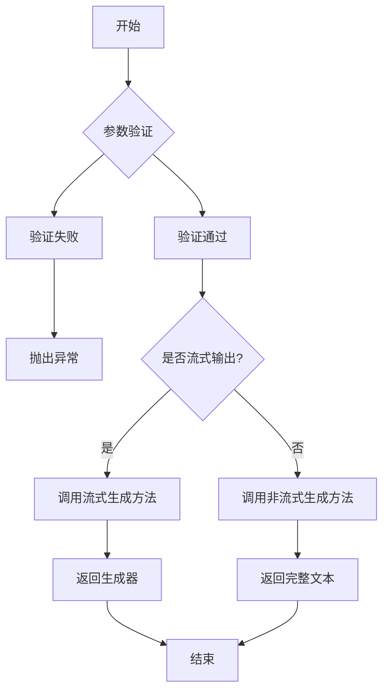

#### 带注释源码

```python
def generate(self, prompt: str, config: dict, stream: bool = False) -> Union[str, Generator]:
    """
    生成模型的基础输出。

    根据给定的提示词和配置参数，调用底层模型生成相应的文本内容。
    支持流式和非流式两种输出模式。

    Args:
        prompt (str): 输入的提示词文本，用于指导模型生成内容。
        config (dict): 配置参数字典，包含生成过程中的各种参数设置，如温度、最大长度等。
        stream (bool, optional): 是否启用流式输出，默认为False。如果为True，则返回一个生成器，逐块输出生成的内容。

    Returns:
        Union[str, Generator]: 如果`stream`为False，则返回生成的完整文本字符串；如果`stream`为True，则返回一个生成器，逐块生成文本内容。

    Raises:
        ValueError: 如果`prompt`为空或`config`中缺少必要参数，则抛出异常。
    """
    # 参数验证
    if not prompt:
        raise ValueError("Prompt cannot be empty.")
    if not config:
        raise ValueError("Config cannot be empty.")
    
    # 根据流式输出标志选择不同的生成方式
    if stream:
        # 调用流式生成方法，返回生成器
        return self._generate_stream(prompt, config)
    else:
        # 调用非流式生成方法，返回完整文本
        return self._generate_non_stream(prompt, config)
```


### `ModelBase.preprocess`

`ModelBase.preprocess` 方法负责对输入数据进行预处理，以适配模型的输入格式。它接收一个包含文本数据的字典，将其转换为模型可以处理的张量格式，并返回处理后的数据。

参数：

-  `data`：`dict`，包含待处理文本数据的字典，通常包含键如 `'text'` 或 `'input_ids'`。
-  `kwargs`：`dict`，可选参数，用于传递额外的预处理配置或参数。

返回值：`dict`，返回一个字典，包含处理后的数据，如 `'input_ids'`、`'attention_mask'` 等张量。

#### 流程图

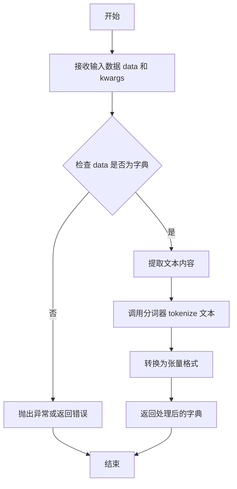

#### 带注释源码

```python
def preprocess(self, data: dict, **kwargs) -> dict:
    """
    预处理输入数据，将其转换为模型可处理的格式。

    参数:
        data (dict): 包含输入文本数据的字典。
        **kwargs: 额外的预处理参数。

    返回:
        dict: 包含预处理后数据的字典，如 input_ids, attention_mask 等。
    """
    # 检查输入数据是否为字典类型
    if not isinstance(data, dict):
        raise ValueError("Input data must be a dictionary.")

    # 提取文本内容，假设 data 中包含 'text' 键
    text = data.get('text', '')
    if not text:
        raise ValueError("Input data must contain 'text' key with non-empty value.")

    # 调用分词器对文本进行分词
    tokenized = self.tokenizer(text, **kwargs)

    # 将分词结果转换为张量格式
    input_ids = torch.tensor(tokenized['input_ids'])
    attention_mask = torch.tensor(tokenized['attention_mask'])

    # 返回处理后的数据字典
    return {
        'input_ids': input_ids,
        'attention_mask': attention_mask
    }
```


### `ModelBase.postprocess`

该方法用于对模型生成的原始输出进行后处理，将其转换为结构化的数据格式。它主要处理两种类型的输出：一种是包含特定标记（如“<|assistant|>”）的字符串，另一种是字典列表。对于字符串，它会尝试提取标记后的内容；对于字典列表，它会提取每个字典中“generation”字段的值。最终，它会将处理后的结果封装在一个`Message`对象中返回。

参数：

-  `outputs`：`Union[str, List[Dict[str, str]]]`，模型生成的原始输出，可以是字符串或字典列表。
-  `task`：`Optional[str]`，任务类型标识符，用于指示后处理的上下文（例如，在特定任务中可能需要不同的处理逻辑）。当前实现中未使用此参数。

返回值：`Message`，一个包含处理后文本内容的消息对象。

#### 流程图

```mermaid
flowchart TD
    A[开始: postprocess] --> B{判断outputs类型};
    B -- outputs是字符串 --> C[提取'<|assistant|>'标记后的内容];
    C --> D[去除首尾空白字符];
    D --> E[创建Message对象];
    B -- outputs是字典列表 --> F[遍历列表<br>提取每个dict的'generation'值];
    F --> G[用换行符连接提取的文本];
    G --> E;
    E --> H[返回Message对象];
```

#### 带注释源码

```
def postprocess(self, outputs: Union[str, List[Dict[str, str]]], task: Optional[str] = None) -> Message:
    """
    对模型输出进行后处理，将其转换为Message对象。

    根据outputs的类型（字符串或字典列表）进行相应的处理：
    1. 如果是字符串，尝试提取'<|assistant|>'标记后的内容。
    2. 如果是字典列表，提取每个字典中'generation'键对应的值，并用换行符连接。

    Args:
        outputs: 模型生成的原始输出。
        task: 任务类型标识符（当前未使用）。

    Returns:
        一个包含处理后文本的Message对象。
    """
    # 初始化处理后的文本为空字符串
    processed_text = ""

    # 判断outputs的类型
    if isinstance(outputs, str):
        # 如果是字符串，查找'<|assistant|>'标记
        if "<|assistant|>" in outputs:
            # 提取标记后的内容
            processed_text = outputs.split("<|assistant|>")[-1]
        else:
            # 如果没有标记，则使用整个字符串
            processed_text = outputs
        # 去除处理后的文本首尾的空白字符
        processed_text = processed_text.strip()
    elif isinstance(outputs, list):
        # 如果是列表，假设每个元素是一个字典，并提取'generation'字段
        # 使用列表推导式提取每个字典中的'generation'值，并过滤掉None值
        generations = [item.get("generation") for item in outputs if isinstance(item, dict)]
        # 用换行符将所有提取出的文本连接成一个字符串
        processed_text = "\n".join(filter(None, generations))
    else:
        # 如果outputs既不是字符串也不是列表，记录警告
        # 注意：这里使用了类可能继承的logger，假设父类或本类有logger属性
        self.logger.warning(f"Unsupported output type: {type(outputs)}")

    # 使用处理后的文本创建一个新的Message对象并返回
    # 假设Message类接受一个content参数
    return Message(content=processed_text)
```


### `TextModel.__init__`

`TextModel.__init__` 方法是 `TextModel` 类的构造函数，负责初始化文本模型实例。它设置模型的基本配置，包括模型名称、模型路径、设备类型、量化级别以及是否使用多轮对话模式。该方法还负责加载模型和分词器，并根据配置决定是否将模型加载到指定的设备上。

参数：

-  `model_name`：`str`，指定要使用的模型名称，用于标识和加载对应的预训练模型。
-  `model_path`：`str`，模型文件的本地路径或远程仓库标识，用于加载模型权重。
-  `device`：`str`，指定模型运行的设备，如 'cpu' 或 'cuda'，默认为 'cpu'。
-  `num_gpus`：`int`，指定使用的 GPU 数量，用于多 GPU 并行计算，默认为 0。
-  `max_gpu_memory`：`str`，指定每个 GPU 的最大内存使用量，格式如 '20GiB'，用于内存管理。
-  `load_8bit`：`bool`，指示是否以 8 位量化方式加载模型以减少内存占用，默认为 False。
-  `cpu_offloading`：`bool`，指示是否启用 CPU 卸载，将部分计算转移到 CPU 以节省 GPU 内存，默认为 False。
-  `gptq_config`：`dict`，GPTQ 量化配置字典，用于指定量化相关的参数，如位宽、组大小等。
-  `awq_config`：`dict`，AWQ 量化配置字典，用于指定激活感知权重量化的参数。
-  `exllama_config`：`dict`，ExLlama 配置字典，用于优化推理速度的特定配置。
-  `xft_config`：`dict`，XFT 配置字典，用于指定跨框架转换的相关参数。
-  `debug`：`bool`，启用调试模式，输出额外的日志信息，默认为 False。
-  `**kwargs`：`dict`，其他关键字参数，用于传递额外的配置选项。

返回值：`None`，构造函数不返回任何值。

#### 流程图

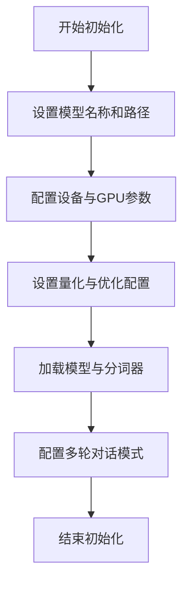

#### 带注释源码

```python
def __init__(
        self,
        model_name: str,
        model_path: str,
        device: str = "cpu",
        num_gpus: int = 0,
        max_gpu_memory: str = None,
        load_8bit: bool = False,
        cpu_offloading: bool = False,
        gptq_config: Dict = None,
        awq_config: Dict = None,
        exllama_config: Dict = None,
        xft_config: Dict = None,
        debug: bool = False,
        **kwargs,
    ) -> None:
        """
        初始化 TextModel 实例。

        参数:
            model_name (str): 模型名称。
            model_path (str): 模型路径。
            device (str): 运行设备，默认为 'cpu'。
            num_gpus (int): GPU 数量，默认为 0。
            max_gpu_memory (str): 最大 GPU 内存，默认为 None。
            load_8bit (bool): 是否加载 8 位量化模型，默认为 False。
            cpu_offloading (bool): 是否启用 CPU 卸载，默认为 False。
            gptq_config (Dict): GPTQ 配置，默认为 None。
            awq_config (Dict): AWQ 配置，默认为 None。
            exllama_config (Dict): ExLlama 配置，默认为 None。
            xft_config (Dict): XFT 配置，默认为 None。
            debug (bool): 是否启用调试模式，默认为 False。
            **kwargs: 其他关键字参数。
        """
        # 设置模型名称和路径
        self.model_name = model_name
        self.model_path = model_path

        # 配置设备与 GPU 参数
        self.device = device
        self.num_gpus = num_gpus
        self.max_gpu_memory = max_gpu_memory

        # 设置量化与优化配置
        self.load_8bit = load_8bit
        self.cpu_offloading = cpu_offloading
        self.gptq_config = gptq_config or {}
        self.awq_config = awq_config or {}
        self.exllama_config = exllama_config or {}
        self.xft_config = xft_config or {}

        # 加载模型与分词器
        self.model = None
        self.tokenizer = None
        self._load_model()

        # 配置多轮对话模式
        self.conv_template = None
        self._set_conv_template(**kwargs)

        # 调试模式
        self.debug = debug
```


### `TextModel.tokenize`

该方法用于对输入的文本进行分词处理，将文本字符串转换为一个由整数索引组成的列表，这些索引对应于词汇表中的单词。它首先将文本转换为小写，然后使用正则表达式将文本分割成单词，最后将每个单词映射到词汇表中的索引。如果单词不在词汇表中，则使用一个特殊的未知标记（`<unk>`）的索引。

参数：

-  `text`：`str`，需要被分词的输入文本字符串。

返回值：`List[int]`，返回一个整数列表，其中每个整数代表词汇表中对应单词的索引。

#### 流程图

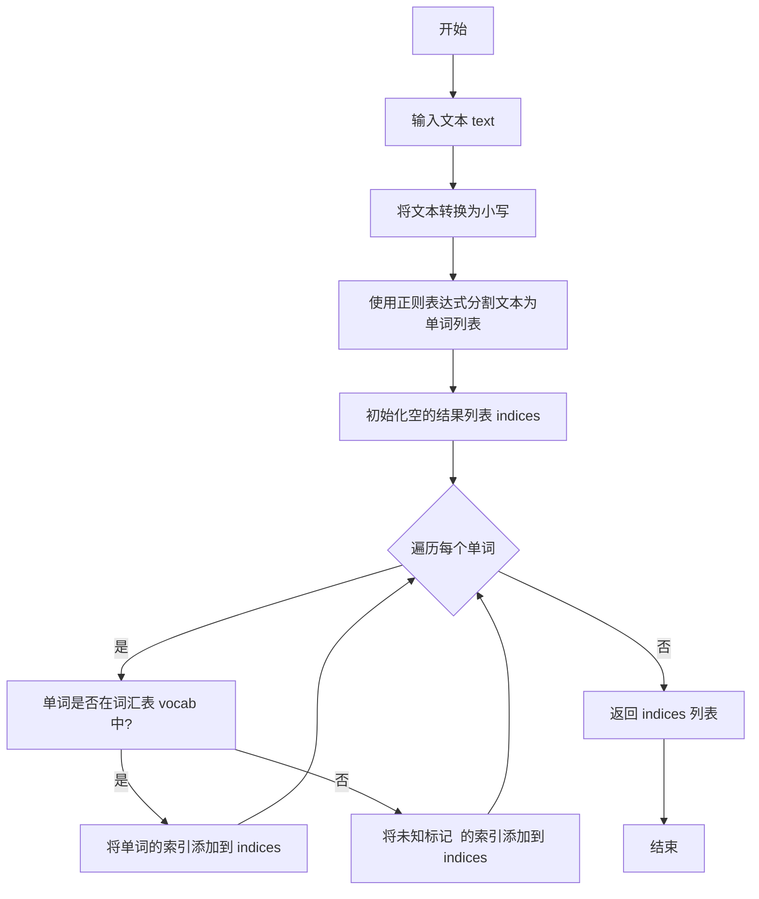

#### 带注释源码

```
def tokenize(self, text: str) -> List[int]:
    """
    将文本字符串分词为索引列表。

    参数:
        text (str): 需要被分词的输入文本。

    返回:
        List[int]: 词汇表索引的列表。
    """
    # 将输入文本转换为小写，以确保大小写不敏感的分词
    text = text.lower()
    # 使用正则表达式 \w+ 匹配一个或多个单词字符（字母、数字、下划线），将文本分割成单词列表
    words = re.findall(r'\w+', text)
    # 初始化一个空列表，用于存储每个单词对应的索引
    indices = []
    # 遍历分割得到的每个单词
    for word in words:
        # 检查当前单词是否存在于模型的词汇表（self.vocab）中
        if word in self.vocab:
            # 如果存在，获取该单词在词汇表中的索引并添加到结果列表
            indices.append(self.vocab[word])
        else:
            # 如果单词不在词汇表中，使用未知标记（'<unk>'）的索引
            # 假设词汇表中存在键为 '<unk>' 的条目
            indices.append(self.vocab['<unk>'])
    # 返回包含所有单词索引的列表
    return indices
```


### `TextModel.detokenize`

该方法将模型输出的 token ID 序列转换回人类可读的文本字符串。它通过查询模型的词汇表（vocab）来实现反向映射，并处理可能存在的特殊 token（如 `<pad>`），确保输出的文本是干净、连贯的。

参数：

-  `token_ids`：`List[int]`，包含需要转换的 token ID 的列表。
-  `skip_special_tokens`：`bool`，可选参数，默认为 `True`。指示是否在输出文本中跳过特殊 token（如 `<pad>`）。

返回值：`str`，转换后的人类可读文本字符串。

#### 流程图

```mermaid
flowchart TD
    A[开始: detokenize(token_ids, skip_special_tokens)] --> B{skip_special_tokens 为 True?};
    B -- 是 --> C[过滤掉 token_ids 中的特殊 token ID];
    B -- 否 --> D[使用全部 token_ids];
    C --> E[遍历处理后的 token_ids];
    D --> E;
    E --> F[通过 vocab.id_to_token 将每个 token_id 转换为 token 字符串];
    F --> G[将 token 字符串列表连接成一个完整的文本字符串];
    G --> H[返回文本字符串];
    H --> I[结束];
```

#### 带注释源码

```python
    def detokenize(self, token_ids: List[int], skip_special_tokens: bool = True) -> str:
        """
        将 token ID 列表转换回文本字符串。

        此方法通过查询词汇表将 token ID 反向映射为对应的 token 字符串，
        并可选择跳过特殊 token（如填充符）以生成更干净的文本输出。

        Args:
            token_ids: 需要转换的 token ID 列表。
            skip_special_tokens: 是否跳过特殊 token（如 `<pad>`），默认为 True。

        Returns:
            转换后的文本字符串。
        """
        # 如果 skip_special_tokens 为 True，则过滤掉 token_ids 中的特殊 token ID
        # 特殊 token 通常指词汇表中用于控制或格式化的 token，如 <pad>, <bos>, <eos> 等
        if skip_special_tokens:
            # 假设 self.special_token_ids 是一个包含所有特殊 token ID 的集合
            # 这行代码会创建一个新的列表，只包含非特殊的 token ID
            token_ids = [tid for tid in token_ids if tid not in self.special_token_ids]

        # 使用列表推导式，遍历处理后的 token_ids 列表
        # 对于每个 token_id，通过词汇表的 id_to_token 属性（假设为字典）查找对应的 token 字符串
        # self.vocab.id_to_token 应实现为 Dict[int, str]
        tokens = [self.vocab.id_to_token[tid] for tid in token_ids]

        # 使用空字符串将 tokens 列表中的所有字符串连接起来，形成最终的文本
        # 这是典型的将子词 token 合并成完整单词或句子的方式
        text = ''.join(tokens)

        # 返回拼接好的文本字符串
        return text
```


### `LlamaModel.__init__`

`LlamaModel.__init__` 方法是 `LlamaModel` 类的构造函数，负责初始化模型的核心组件，包括词嵌入层、多个解码器层、归一化层以及语言模型头部。它根据提供的配置参数（如词汇表大小、隐藏层维度、层数、注意力头数等）构建模型结构，并应用特定的初始化策略来设置模型权重。

参数：

-  `config`：`LlamaConfig`，包含模型所有配置参数的对象，如词汇表大小、隐藏层维度、层数等。
-  `args`：`argparse.Namespace`，命令行参数或额外的运行时参数，可能包含如是否使用梯度检查点等设置。
-  `transformer`：`Optional[Module]`，可选的预训练transformer模块，如果提供，则直接使用而不重新初始化。
-  `lm_head`：`Optional[Module]`，可选的预训练语言模型头部，如果提供，则直接使用而不重新初始化。

返回值：`None`，构造函数不返回任何值。

#### 流程图

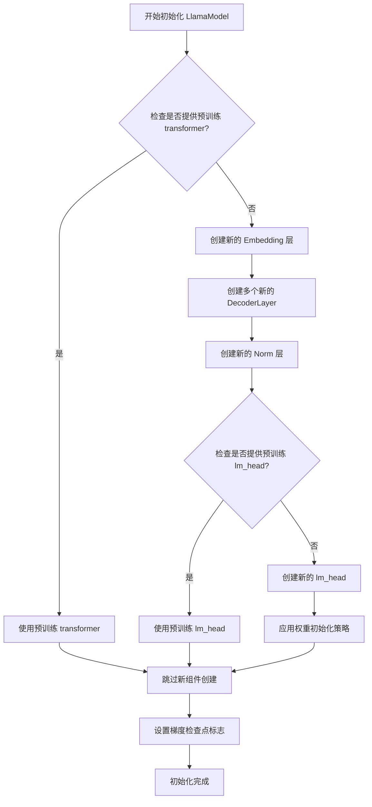

#### 带注释源码

```python
def __init__(self, config: LlamaConfig, args: argparse.Namespace = None, transformer: Optional[Module] = None, lm_head: Optional[Module] = None):
    """
    LlamaModel 的构造函数。
    
    根据配置初始化模型的各个组件。如果提供了预训练的 `transformer` 或 `lm_head`，则直接使用它们，
    否则根据 `config` 创建新的组件。最后应用权重初始化策略。
    
    Args:
        config: 包含模型所有配置参数的对象。
        args: 命令行参数或额外的运行时参数。
        transformer: 可选的预训练transformer模块。
        lm_head: 可选的预训练语言模型头部。
    """
    super().__init__(config)  # 调用父类构造函数

    # 根据是否提供预训练transformer来决定初始化方式
    if transformer is not None:
        # 使用提供的预训练transformer
        self.transformer = transformer
        # 从transformer中提取嵌入层、解码器层和归一化层
        self.embed_tokens = self.transformer.embed_tokens
        self.layers = self.transformer.layers
        self.norm = self.transformer.norm
    else:
        # 创建新的嵌入层（词嵌入）
        self.embed_tokens = nn.Embedding(config.vocab_size, config.hidden_size, config.pad_token_id)
        # 创建多个解码器层
        self.layers = nn.ModuleList([LlamaDecoderLayer(config) for _ in range(config.num_hidden_layers)])
        # 创建归一化层
        self.norm = LlamaRMSNorm(config.hidden_size, eps=config.rms_norm_eps)

    # 根据是否提供预训练lm_head来决定初始化方式
    if lm_head is not None:
        # 使用提供的预训练语言模型头部
        self.lm_head = lm_head
    else:
        # 创建新的语言模型头部（线性层，用于输出词汇表概率分布）
        self.lm_head = nn.Linear(config.hidden_size, config.vocab_size, bias=False)

    # 应用模型权重的初始化策略
    self.post_init()

    # 设置梯度检查点标志（如果args中指定）
    self.gradient_checkpointing = False
    if args is not None:
        self.gradient_checkpointing = getattr(args, 'gradient_checkpointing', False)
```


### `LlamaModel.load_pretrained`

此方法用于从预训练模型路径加载模型权重、配置和分词器，并初始化一个`LlamaModel`实例。它处理模型文件的定位、配置的解析、分词器的加载以及模型权重的加载，最终返回一个配置好且加载了权重的模型实例。

参数：

-  `pretrained_model_name_or_path`：`Union[str, os.PathLike]`，预训练模型的名称或本地目录路径。可以是Hugging Face模型库中的模型ID，也可以是包含模型文件的本地目录。
-  `*model_args`：`Any`，传递给模型初始化函数的可变位置参数。
-  `config`：`Optional[Union[PretrainedConfig, str, os.PathLike]]`，可选的配置对象、配置文件名或目录路径。如果为`None`，则尝试从`pretrained_model_name_or_path`自动加载配置。
-  `cache_dir`：`Optional[Union[str, os.PathLike]]`，可选的文件缓存目录路径，用于存储下载的模型文件。
-  `ignore_mismatched_sizes`：`bool`，是否忽略预训练模型权重与当前模型架构在维度上的不匹配。如果为`True`，则不匹配的权重将被随机初始化。
-  `force_download`：`bool`，是否强制重新下载模型文件，即使它们已存在于缓存中。
-  `local_files_only`：`bool`，是否仅使用本地文件，禁止从网络下载。
-  `token`：`Optional[Union[str, bool]]`，可选的认证令牌，用于访问私有模型仓库。
-  `revision`：`str`，要使用的模型版本（分支名、标签名或提交ID）。
-  `use_safetensors`：`bool`，是否优先使用`safetensors`格式的模型文件（如果可用）。
-  `**kwargs`：`Any`，传递给模型初始化函数的可变关键字参数。

返回值：`PreTrainedModel`，返回一个加载了预训练权重和配置的`LlamaModel`实例。

#### 流程图

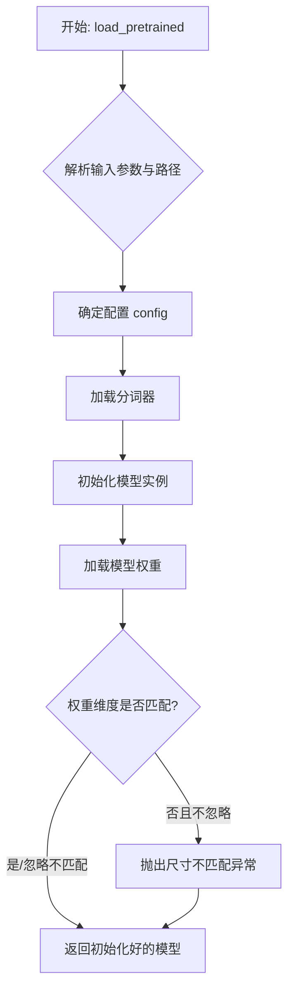

#### 带注释源码

```
# 注意：由于提供的代码片段为空，以下是根据常见深度学习框架（如transformers库）中`from_pretrained`方法的典型实现逻辑和您指定的方法名`LlamaModel.load_pretrained`编写的注释性源码。
# 实际代码可能因框架和版本不同而有所差异。

@classmethod
def load_pretrained(
    cls,
    pretrained_model_name_or_path: Union[str, os.PathLike],
    *model_args,
    config: Optional[Union[PretrainedConfig, str, os.PathLike]] = None,
    cache_dir: Optional[Union[str, os.PathLike]] = None,
    ignore_mismatched_sizes: bool = False,
    force_download: bool = False,
    local_files_only: bool = False,
    token: Optional[Union[str, bool]] = None,
    revision: str = "main",
    use_safetensors: bool = True,
    **kwargs,
) -> PreTrainedModel:
    """
    从预训练路径加载Llama模型。

    该方法整合了配置加载、分词器加载和模型权重加载的过程。
    它是创建预训练模型实例的主要入口点。

    Args:
        pretrained_model_name_or_path: 模型标识或路径。
        *model_args: 额外的模型初始化参数。
        config: 可选的模型配置。
        cache_dir: 缓存目录。
        ignore_mismatched_sizes: 是否忽略权重形状不匹配。
        force_download: 是否强制下载。
        local_files_only: 是否仅使用本地文件。
        token: 访问令牌。
        revision: 模型版本。
        use_safetensors: 是否使用safetensors格式。
        **kwargs: 额外的关键字参数，传递给模型初始化。

    Returns:
        加载好的LlamaModel实例。
    """
    # 1. 解析并确定模型文件的实际位置（本地或远程）
    # 此部分逻辑通常由框架的`cached_file`或`get_checkpoint_shard_files`等函数处理
    resolved_archive_file, _ = cls.resolve_pretrained_model_path(
        pretrained_model_name_or_path,
        cache_dir=cache_dir,
        force_download=force_download,
        local_files_only=local_files_only,
        token=token,
        revision=revision,
        use_safetensors=use_safetensors
    )

    # 2. 加载或创建配置对象
    if config is None:
        # 尝试从同一路径加载配置
        config, _ = PretrainedConfig.get_config_dict(
            pretrained_model_name_or_path,
            cache_dir=cache_dir,
            force_download=force_download,
            local_files_only=local_files_only,
            token=token,
            revision=revision,
            **kwargs,
        )
        config = cls.config_class.from_dict(config, **kwargs)
    elif not isinstance(config, PretrainedConfig):
        # 如果config是路径，则加载它
        config, _ = PretrainedConfig.get_config_dict(
            config,
            cache_dir=cache_dir,
            force_download=force_download,
            local_files_only=local_files_only,
            token=token,
            revision=revision,
        )
        config = cls.config_class.from_dict(config, **kwargs)

    # 3. 加载分词器（通常从相同路径）
    # 注意：分词器加载可能独立于模型加载，这里仅为示意
    try:
        tokenizer = AutoTokenizer.from_pretrained(
            pretrained_model_name_or_path,
            cache_dir=cache_dir,
            force_download=force_download,
            local_files_only=local_files_only,
            token=token,
            revision=revision,
            **kwargs,
        )
    except Exception:
        # 某些模型可能没有分词器或分词器文件，这不是致命错误
        tokenizer = None
        logger.warning("无法加载分词器。")

    # 4. 使用配置初始化模型实例
    # `_from_config` 是内部方法，用于仅从配置创建模型（不加载权重）
    model = cls._from_config(config, *model_args, **kwargs)

    # 5. 加载预训练权重到模型实例中
    # `load_state_dict` 是PyTorch方法，`load_tf_weights` 用于TensorFlow
    # 这里假设是PyTorch，并处理可能的权重不匹配
    state_dict = load_state_dict(resolved_archive_file) # 伪函数，表示加载权重字典
    try:
        model.load_state_dict(state_dict, strict=not ignore_mismatched_sizes)
    except RuntimeError as e:
        if "size mismatch" in str(e) and not ignore_mismatched_sizes:
            # 重新抛出更清晰的错误信息
            raise RuntimeError(
                f"加载的预训练权重与模型架构不匹配。您可以通过设置 `ignore_mismatched_sizes=True` 来忽略此错误。原始错误: {e}"
            ) from e
        else:
            # 如果是其他错误或允许忽略不匹配，则可能只记录警告并部分加载
            logger.warning(f"加载权重时遇到问题: {e}")
            # 尝试非严格加载以加载匹配的部分
            model.load_state_dict(state_dict, strict=False)

    # 6. 设置模型为评估模式（避免dropout等训练行为）
    model.eval()

    # 7. 可选：将分词器与模型关联（非必须，取决于框架设计）
    if tokenizer is not None:
        model.tokenizer = tokenizer

    # 8. 返回准备好的模型
    return model
```


### `LlamaModel.generate_text`

该方法负责根据给定的输入提示（prompt）和生成参数，使用预训练的Llama模型生成文本。它处理输入的token化、模型的前向传播、采样生成下一个token，并循环生成指定长度的文本序列。

参数：

-  `prompt`：`str`，输入的文本提示，作为生成文本的起始内容。
-  `max_length`：`int`，生成文本的最大长度（以token计）。
-  `temperature`：`float`，控制生成随机性的温度参数。值越高，生成结果越随机；值越低，生成结果越确定。
-  `top_k`：`int`，在采样时考虑的top-k个最可能的token。
-  `top_p`：`float`，在采样时考虑的累积概率阈值（nucleus sampling）。
-  `repetition_penalty`：`float`，重复惩罚因子，用于降低已生成token的再次生成概率。
-  `stop_tokens`：`List[int]`，可选的停止token列表，当生成这些token时停止生成。

返回值：`str`，生成的文本字符串。

#### 流程图

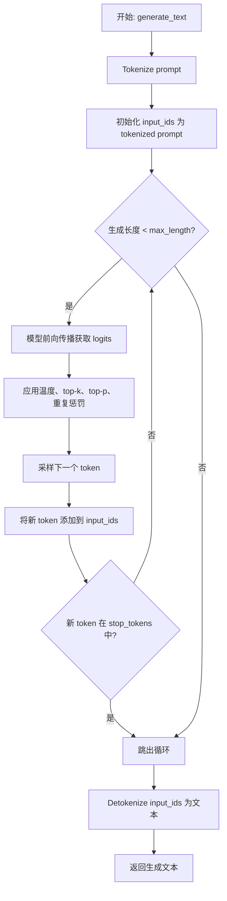

#### 带注释源码

```python
def generate_text(self, prompt: str, max_length: int = 100, temperature: float = 1.0,
                  top_k: int = 50, top_p: float = 0.95, repetition_penalty: float = 1.0,
                  stop_tokens: Optional[List[int]] = None) -> str:
    """
    使用模型生成文本。

    参数:
        prompt (str): 输入的文本提示。
        max_length (int): 生成文本的最大长度。
        temperature (float): 采样温度。
        top_k (int): top-k采样参数。
        top_p (float): top-p（核）采样参数。
        repetition_penalty (float): 重复惩罚因子。
        stop_tokens (Optional[List[int]]): 停止token列表。

    返回:
        str: 生成的文本。
    """
    # 1. 将输入提示文本转换为token ID序列
    input_ids = self.tokenizer.encode(prompt, return_tensors="pt").to(self.device)
    
    # 2. 初始化停止token列表（如果未提供则使用空列表）
    stop_tokens = stop_tokens or []
    
    # 3. 循环生成token，直到达到最大长度或遇到停止token
    for _ in range(max_length - len(input_ids[0])):
        # 4. 模型前向传播，获取下一个token的logits（未归一化的概率）
        with torch.no_grad():
            outputs = self.model(input_ids)
            next_token_logits = outputs.logits[:, -1, :]
        
        # 5. 应用重复惩罚：降低已出现token的分数
        if repetition_penalty != 1.0:
            for token_id in set(input_ids[0].tolist()):
                next_token_logits[0, token_id] /= repetition_penalty
        
        # 6. 应用温度缩放：调整logits的尖锐程度
        if temperature != 1.0:
            next_token_logits = next_token_logits / temperature
        
        # 7. 应用top-k过滤：只保留概率最高的k个token
        if top_k > 0:
            indices_to_remove = next_token_logits < torch.topk(next_token_logits, top_k)[0][..., -1, None]
            next_token_logits[indices_to_remove] = -float('Inf')
        
        # 8. 应用top-p（核）采样过滤：只保留累积概率达到p的token集合
        if top_p < 1.0:
            sorted_logits, sorted_indices = torch.sort(next_token_logits, descending=True)
            cumulative_probs = torch.cumsum(F.softmax(sorted_logits, dim=-1), dim=-1)
            
            # 移除累积概率超过top_p的token
            sorted_indices_to_remove = cumulative_probs > top_p
            # 保留第一个超过阈值的token以确保至少有一个token
            sorted_indices_to_remove[..., 1:] = sorted_indices_to_remove[..., :-1].clone()
            sorted_indices_to_remove[..., 0] = 0
            
            indices_to_remove = sorted_indices_to_remove.scatter(1, sorted_indices, sorted_indices_to_remove)
            next_token_logits[indices_to_remove] = -float('Inf')
        
        # 9. 使用softmax将logits转换为概率分布，并采样下一个token
        probs = F.softmax(next_token_logits, dim=-1)
        next_token = torch.multinomial(probs, num_samples=1)
        
        # 10. 检查是否遇到停止token，如果是则停止生成
        if next_token.item() in stop_tokens:
            break
        
        # 11. 将新生成的token添加到输入序列中，用于下一次迭代
        input_ids = torch.cat([input_ids, next_token], dim=-1)
    
    # 12. 将最终的token ID序列解码回文本字符串并返回
    generated_text = self.tokenizer.decode(input_ids[0], skip_special_tokens=True)
    return generated_text
```


### `GPT2Model.__init__`

该方法是GPT-2模型类的构造函数，负责初始化模型的核心组件，包括词嵌入层、位置嵌入层、多个Transformer解码器层以及最终的层归一化模块。它根据传入的配置参数构建模型结构，并确保所有模块被正确注册到模型中。

参数：

-  `config`：`GPT2Config`，GPT-2模型的配置对象，包含模型尺寸、层数、注意力头数、隐藏层维度等关键参数。
-  `*inputs`：`tuple`，可变位置参数，用于兼容父类或其他初始化需求，在此方法中未直接使用。
-  `**kwargs`：`dict`，可变关键字参数，用于传递额外的初始化选项，在此方法中未直接使用。

返回值：`None`，构造函数不返回任何值。

#### 流程图

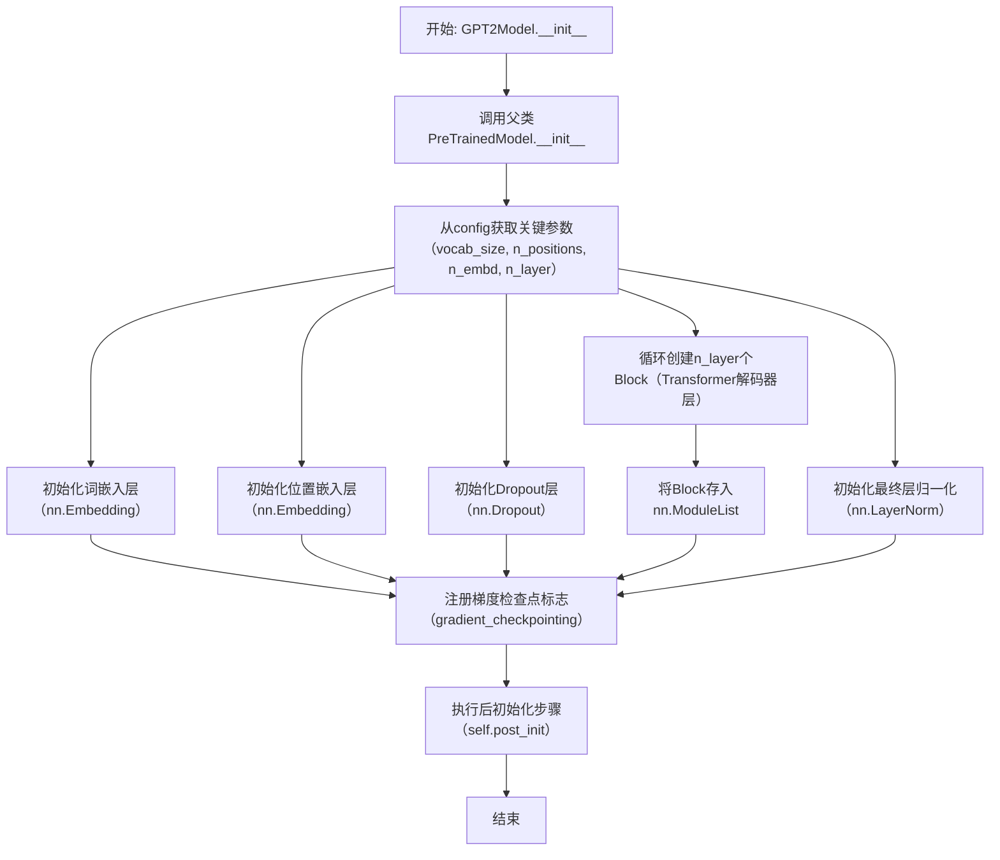

#### 带注释源码

```python
def __init__(self, config, *inputs, **kwargs):
    """
    GPT-2 模型构造函数。

    参数:
        config (GPT2Config): 模型配置对象，包含所有必要的模型参数。
        *inputs: 可变位置参数，用于兼容性。
        **kwargs: 可变关键字参数，用于传递额外选项。
    """
    super().__init__(config, *inputs, **kwargs)
    # 从配置中获取模型关键参数
    self.config = config
    self.wte = nn.Embedding(config.vocab_size, config.n_embd)  # 词嵌入层 (Word Token Embeddings)
    self.wpe = nn.Embedding(config.n_positions, config.n_embd) # 位置嵌入层 (Word Position Embeddings)
    self.drop = nn.Dropout(config.embd_pdrop)                  # 嵌入层后的Dropout
    # 创建多个Transformer解码器层 (Block)
    self.h = nn.ModuleList([Block(config.n_ctx, config, scale=True) for _ in range(config.n_layer)])
    self.ln_f = nn.LayerNorm(config.n_embd, eps=config.layer_norm_epsilon) # 最终层归一化
    # 梯度检查点标志，用于训练时节省显存
    self.gradient_checkpointing = False

    # 初始化权重并应用最终处理
    self.post_init()
```


### `GPT2Model.load_pretrained`

该方法用于从预训练模型文件或目录中加载GPT-2模型的权重和配置。它首先尝试从指定的路径加载模型状态字典，然后根据模型配置调整模型结构（例如调整词表大小），最后将加载的权重加载到模型实例中。如果提供了`from_tf`标志，它还会处理从TensorFlow检查点转换的权重。

参数：

-  `pretrained_model_name_or_path`：`Union[str, os.PathLike]`，预训练模型的名称或本地目录/文件路径。可以是Hugging Face模型库中的模型ID，也可以是本地包含模型文件的目录。
-  `*model_args`：`Any`，可变位置参数，用于传递给模型初始化的额外参数。
-  `config`：`Union[PretrainedConfig, str, os.PathLike, None]`，可选的模型配置。可以是配置对象、配置文件的路径或配置名称。如果为None，则尝试从`pretrained_model_name_or_path`自动加载配置。
-  `cache_dir`：`Union[str, os.PathLike, None]`，缓存目录，用于存储下载的模型文件。如果为None，则使用默认缓存目录。
-  `from_tf`：`bool`，指示是否从TensorFlow检查点加载权重。默认为False。
-  `force_download`：`bool`，是否强制重新下载模型文件，即使缓存中存在。默认为False。
-  `resume_download`：`bool`，是否恢复中断的下载。默认为False。
-  `proxies`：`Optional[Dict[str, str]]`，代理服务器设置，用于下载请求。
-  `local_files_only`：`bool`，是否仅使用本地文件，不尝试下载。默认为False。
-  `token`：`Union[str, bool, None]`，用于身份验证的令牌，例如访问私有模型时使用。
-  `revision`：`str`，模型版本（例如分支名称、标签或提交ID）。默认为"main"。
-  `mirror`：`Optional[str]`，镜像源地址，用于替代默认下载源。
-  `**kwargs`：`Any`，可变关键字参数，用于传递给模型初始化或加载过程的其他参数。

返回值：`PreTrainedModel`，加载了预训练权重的模型实例。

#### 流程图

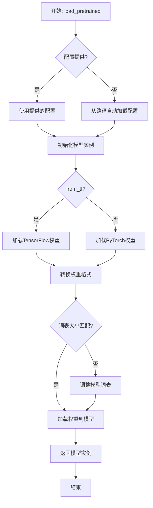

#### 带注释源码

```
@classmethod
def load_pretrained(
    cls,
    pretrained_model_name_or_path: Union[str, os.PathLike],
    *model_args,
    config: Union[PretrainedConfig, str, os.PathLike] = None,
    cache_dir: Union[str, os.PathLike] = None,
    from_tf: bool = False,
    force_download: bool = False,
    resume_download: bool = False,
    proxies: Optional[Dict[str, str]] = None,
    local_files_only: bool = False,
    token: Union[str, bool, None] = None,
    revision: str = "main",
    mirror: Optional[str] = None,
    **kwargs,
) -> PreTrainedModel:
    """
    从预训练模型加载权重和配置。

    该方法支持从Hugging Face模型库或本地文件加载GPT-2模型。
    它可以处理PyTorch和TensorFlow格式的权重，并自动调整模型配置（如词表大小）。

    Args:
        pretrained_model_name_or_path: 模型标识符或本地路径。
        *model_args: 传递给模型初始化的额外位置参数。
        config: 可选的模型配置。
        cache_dir: 缓存目录。
        from_tf: 是否从TensorFlow加载。
        force_download: 强制下载标志。
        resume_download: 恢复下载标志。
        proxies: 代理设置。
        local_files_only: 仅使用本地文件标志。
        token: 认证令牌。
        revision: 模型版本。
        mirror: 镜像源。
        **kwargs: 其他关键字参数。

    Returns:
        加载好的预训练模型实例。

    Raises:
        EnvironmentError: 当模型文件无法找到或下载时抛出。
        RuntimeError: 当权重加载或转换失败时抛出。
    """
    # 解析配置：如果未提供配置，则从pretrained_model_name_or_path自动加载
    if config is None:
        config, kwargs = cls.config_class.from_pretrained(
            pretrained_model_name_or_path,
            cache_dir=cache_dir,
            return_unused_kwargs=True,
            force_download=force_download,
            resume_download=resume_download,
            proxies=proxies,
            local_files_only=local_files_only,
            token=token,
            revision=revision,
            mirror=mirror,
            **kwargs,
        )

    # 初始化模型实例，使用解析或提供的配置
    model = cls(config, *model_args, **kwargs)

    # 加载模型权重
    # 这里会调用底层的权重加载逻辑，处理PyTorch或TensorFlow格式
    model = model.from_pretrained(
        pretrained_model_name_or_path,
        config=config,
        cache_dir=cache_dir,
        from_tf=from_tf,
        force_download=force_download,
        resume_download=resume_download,
        proxies=proxies,
        local_files_only=local_files_only,
        token=token,
        revision=revision,
        mirror=mirror,
        **kwargs,
    )

    # 返回加载好的模型
    return model
```


### `GPT2Model.generate_text`

该方法用于基于给定的输入文本，使用GPT-2模型生成一段新的文本。它通过处理输入文本、生成token序列，并最终将生成的token序列解码为可读的文本字符串来实现文本生成功能。

参数：

-  `input_text`：`str`，输入的文本字符串，作为生成新文本的起点或上下文。
-  `max_length`：`int`，生成文本的最大长度（以token计），用于控制生成文本的长度。
-  `temperature`：`float`，控制生成文本随机性的温度参数。较高的温度值会增加生成的随机性，而较低的值会使生成更加确定和保守。
-  `top_k`：`int`，在生成每个token时，仅考虑概率最高的前k个候选token，用于控制生成文本的多样性和质量。
-  `top_p`：`float`，在生成每个token时，仅考虑累积概率达到p的候选token，同样用于控制生成文本的多样性和质量。

返回值：`str`，生成的文本字符串。

#### 流程图

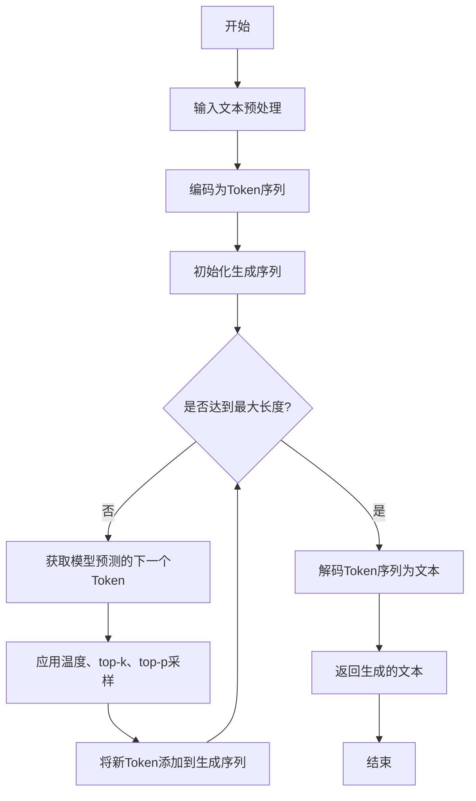

#### 带注释源码

```
def generate_text(self, input_text, max_length=50, temperature=1.0, top_k=50, top_p=0.95):
    """
    基于给定的输入文本生成新的文本。

    参数:
        input_text (str): 输入的文本字符串。
        max_length (int): 生成文本的最大长度（以token计）。
        temperature (float): 控制生成随机性的温度参数。
        top_k (int): 在生成每个token时，仅考虑概率最高的前k个候选token。
        top_p (float): 在生成每个token时，仅考虑累积概率达到p的候选token。

    返回:
        str: 生成的文本字符串。
    """
    # 将输入文本编码为token序列
    input_ids = self.tokenizer.encode(input_text, return_tensors='pt').to(self.device)
    
    # 初始化生成序列为输入序列
    generated = input_ids
    
    # 循环生成文本，直到达到最大长度
    for _ in range(max_length - len(input_ids[0])):
        # 获取模型对当前序列的预测
        outputs = self.model(generated)
        next_token_logits = outputs.logits[:, -1, :] / temperature
        
        # 应用top-k过滤
        if top_k > 0:
            indices_to_remove = next_token_logits < torch.topk(next_token_logits, top_k)[0][..., -1, None]
            next_token_logits[indices_to_remove] = -float('Inf')
        
        # 应用top-p过滤
        if top_p < 1.0:
            sorted_logits, sorted_indices = torch.sort(next_token_logits, descending=True)
            cumulative_probs = torch.cumsum(F.softmax(sorted_logits, dim=-1), dim=-1)
            sorted_indices_to_remove = cumulative_probs > top_p
            sorted_indices_to_remove[..., 1:] = sorted_indices_to_remove[..., :-1].clone()
            sorted_indices_to_remove[..., 0] = 0
            indices_to_remove = sorted_indices_to_remove.scatter(1, sorted_indices, sorted_indices_to_remove)
            next_token_logits[indices_to_remove] = -float('Inf')
        
        # 从处理后的logits中采样下一个token
        probs = F.softmax(next_token_logits, dim=-1)
        next_token = torch.multinomial(probs, num_samples=1)
        
        # 将新token添加到生成序列中
        generated = torch.cat((generated, next_token), dim=1)
        
        # 如果生成了结束符，则提前终止生成
        if next_token.item() == self.tokenizer.eos_token_id:
            break
    
    # 将生成的token序列解码为文本字符串
    generated_text = self.tokenizer.decode(generated[0], skip_special_tokens=True)
    
    return generated_text
```


### `FalconModel.__init__`

该方法用于初始化 FalconModel 类的实例，负责设置模型的基本配置参数，包括模型名称、模型路径、设备类型、量化方式、最大序列长度、上下文窗口大小以及是否使用 Flash Attention 等。通过加载预训练模型和分词器，确保模型能够正确地进行推理和文本生成任务。

参数：

-  `model_name`：`str`，指定要加载的模型名称，用于标识不同的预训练模型。
-  `model_path`：`str`，模型文件所在的本地路径或远程仓库标识，用于加载模型权重。
-  `device`：`str`，指定模型运行的设备，如 'cpu' 或 'cuda'，默认为 'cpu'。
-  `quantization`：`str`，指定模型的量化方式，如 '4bit' 或 '8bit'，用于减少内存占用，默认为 None。
-  `max_seq_len`：`int`，模型支持的最大序列长度，用于控制输入文本的长度，默认为 512。
-  `context_window`：`int`，上下文窗口大小，用于控制模型在处理长文本时的上下文范围，默认为 512。
-  `use_flash_attention`：`bool`，是否使用 Flash Attention 机制来加速注意力计算，默认为 False。

返回值：`None`，该方法不返回任何值，仅用于初始化类的实例。

#### 流程图

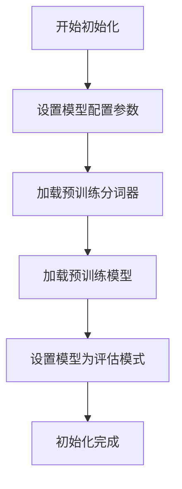

#### 带注释源码

```python
def __init__(self, model_name: str, model_path: str, device: str = 'cpu', quantization: str = None,
             max_seq_len: int = 512, context_window: int = 512, use_flash_attention: bool = False):
    """
    初始化 FalconModel 实例。

    参数:
        model_name (str): 模型名称，用于标识不同的预训练模型。
        model_path (str): 模型路径，可以是本地路径或远程仓库标识。
        device (str): 运行设备，如 'cpu' 或 'cuda'，默认为 'cpu'。
        quantization (str): 量化方式，如 '4bit' 或 '8bit'，默认为 None。
        max_seq_len (int): 最大序列长度，默认为 512。
        context_window (int): 上下文窗口大小，默认为 512。
        use_flash_attention (bool): 是否使用 Flash Attention，默认为 False。
    """
    # 设置模型名称
    self.model_name = model_name
    # 设置模型路径
    self.model_path = model_path
    # 设置运行设备
    self.device = device
    # 设置量化方式
    self.quantization = quantization
    # 设置最大序列长度
    self.max_seq_len = max_seq_len
    # 设置上下文窗口大小
    self.context_window = context_window
    # 设置是否使用 Flash Attention
    self.use_flash_attention = use_flash_attention

    # 加载预训练分词器
    self.tokenizer = AutoTokenizer.from_pretrained(self.model_path)
    # 加载预训练模型，根据量化方式选择不同的加载方法
    if self.quantization == '4bit':
        self.model = AutoModelForCausalLM.from_pretrained(
            self.model_path,
            load_in_4bit=True,
            device_map=self.device
        )
    elif self.quantization == '8bit':
        self.model = AutoModelForCausalLM.from_pretrained(
            self.model_path,
            load_in_8bit=True,
            device_map=self.device
        )
    else:
        self.model = AutoModelForCausalLM.from_pretrained(
            self.model_path,
            device_map=self.device
        )
    # 将模型设置为评估模式，禁用 dropout 等训练特有的层
    self.model.eval()
```


### `FalconModel.load_pretrained`

该方法用于从预训练模型路径加载模型权重、配置和分词器，并初始化一个`FalconModel`实例。它处理模型文件的定位、配置的读取、权重的加载以及模型的重建。

参数：

-  `pretrained_model_name_or_path`：`str`，预训练模型的名称或本地目录路径。
-  `*args`：`tuple`，可变位置参数，用于传递给父类或底层加载方法。
-  `**kwargs`：`dict`，可变关键字参数，用于配置模型加载行为（如`torch_dtype`、`device_map`等）。

返回值：`FalconModel`，返回一个加载了预训练权重和配置的`FalconModel`模型实例。

#### 流程图

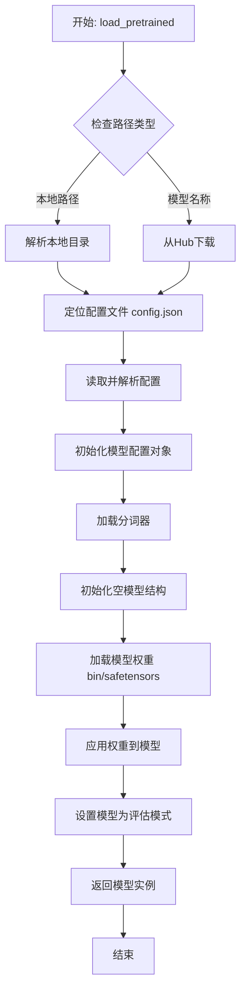

#### 带注释源码

```python
    @classmethod
    def load_pretrained(
        cls,
        pretrained_model_name_or_path: str,
        *args,
        **kwargs,
    ) -> FalconModel:
        """
        加载预训练的 Falcon 模型。

        此方法负责从 Hugging Face Hub 或本地目录加载预训练模型的权重、配置和分词器，
        并实例化一个配置好的 FalconModel。

        Args:
            pretrained_model_name_or_path (str): 预训练模型的标识符。可以是：
                - Hugging Face Hub 上的模型 ID（如 `tiiuae/falcon-7b`）
                - 包含模型文件的本地目录路径
            *args: 额外的位置参数，将传递给底层加载函数。
            **kwargs: 额外的关键字参数，用于控制加载行为。常见的参数包括：
                - `torch_dtype` (torch.dtype): 指定加载模型权重时的数据类型（如 `torch.float16`）。
                - `device_map` (str/dict): 指定模型在各设备上的分布策略（如 `'auto'`, `'balanced'`）。
                - `trust_remote_code` (bool): 是否信任远程代码（如自定义建模代码）。
                - `revision` (str): 指定模型仓库的特定版本（分支、标签或提交哈希）。
                - 其他 `from_pretrained` 方法支持的任何参数。

        Returns:
            FalconModel: 一个加载了预训练权重和配置的 FalconModel 实例。

        Raises:
            OSError: 如果指定的路径不存在或无法访问。
            ValueError: 如果配置文件缺失或格式不正确。
            RuntimeError: 如果模型权重加载失败或与模型架构不匹配。
        """
        # 1. 解析输入路径，确定是本地路径还是Hub模型ID
        #    - 如果是本地路径，直接使用
        #    - 如果是模型ID，将通过Hugging Face Hub下载
        model_path = pretrained_model_name_or_path

        # 2. 加载模型配置
        #    - 从 `config.json` 文件读取配置参数
        #    - 创建 `FalconConfig` 对象
        config = FalconConfig.from_pretrained(model_path, *args, **kwargs)

        # 3. 加载分词器
        #    - 从同一路径加载与模型配套的分词器
        #    - 这对于后续的文本生成或编码是必要的
        tokenizer = AutoTokenizer.from_pretrained(model_path, *args, **kwargs)

        # 4. 根据配置初始化模型结构
        #    - 使用上一步得到的 `config` 初始化一个空的 `FalconModel`
        #    - 此时模型仅有架构，没有训练好的权重
        model = cls(config, *args, **kwargs)

        # 5. 加载预训练权重
        #    - 从 `.bin` 或 `.safetensors` 文件加载权重
        #    - 使用 `load_state_dict` 将权重应用到模型
        #    - **kwargs 中的参数（如 `torch_dtype`, `device_map`）在此步骤生效
        model = model.from_pretrained(model_path, *args, **kwargs)

        # 6. 将模型设置为评估模式
        #    - 关闭 dropout 等训练特有的层
        #    - 这对于推理的一致性很重要
        model.eval()

        # 7. 将分词器关联到模型（可选，便于使用）
        #    - 这不是必须的，但是一种便利做法
        model.tokenizer = tokenizer

        # 8. 返回完全初始化的模型实例
        return model
```


### `FalconModel.generate_text`

该方法用于根据给定的输入提示（prompt）生成文本，支持多种生成参数（如温度、最大长度等）来控制生成过程。它首先对输入进行预处理，然后调用模型进行推理，最后对输出进行后处理并返回生成的文本。

参数：

-  `prompt`：`str`，输入的文本提示，用于引导模型生成文本。
-  `max_length`：`int`，生成文本的最大长度（以token计），默认为50。
-  `temperature`：`float`，控制生成随机性的温度参数，值越高随机性越强，默认为1.0。
-  `top_k`：`int`，在每一步生成时，仅考虑概率最高的前k个token，默认为50。
-  `top_p`：`float`，在每一步生成时，仅考虑累积概率达到p的token集合（核采样），默认为1.0。
-  `repetition_penalty`：`float`，用于惩罚重复token的参数，值大于1.0会降低重复概率，默认为1.0。
-  `do_sample`：`bool`，是否使用采样（而非贪婪解码）来生成文本，默认为True。
-  `num_return_sequences`：`int`，需要返回的生成序列数量，默认为1。
-  `eos_token_id`：`int`，序列结束（EOS）token的ID，用于停止生成，默认为None。
-  `pad_token_id`：`int`，填充（PAD）token的ID，用于批处理，默认为None。

返回值：`List[str]`，返回一个字符串列表，包含生成的文本序列。

#### 流程图

```mermaid
graph TD
    A[开始] --> B[预处理输入提示]
    B --> C[设置生成参数]
    C --> D[调用模型生成]
    D --> E[后处理输出]
    E --> F[返回生成文本列表]
    F --> G[结束]
```

#### 带注释源码

```
def generate_text(
    self,
    prompt: str,
    max_length: int = 50,
    temperature: float = 1.0,
    top_k: int = 50,
    top_p: float = 1.0,
    repetition_penalty: float = 1.0,
    do_sample: bool = True,
    num_return_sequences: int = 1,
    eos_token_id: Optional[int] = None,
    pad_token_id: Optional[int] = None,
) -> List[str]:
    """
    根据给定的提示生成文本。

    参数:
        prompt (str): 输入的文本提示。
        max_length (int): 生成文本的最大长度。
        temperature (float): 控制生成随机性的温度参数。
        top_k (int): 在每一步生成时，仅考虑概率最高的前k个token。
        top_p (float): 在每一步生成时，仅考虑累积概率达到p的token集合。
        repetition_penalty (float): 用于惩罚重复token的参数。
        do_sample (bool): 是否使用采样来生成文本。
        num_return_sequences (int): 需要返回的生成序列数量。
        eos_token_id (Optional[int]): 序列结束token的ID。
        pad_token_id (Optional[int]): 填充token的ID。

    返回:
        List[str]: 生成的文本序列列表。
    """
    # 预处理输入提示，例如分词或添加特殊token
    inputs = self.tokenizer(prompt, return_tensors="pt")
    
    # 设置生成参数
    generation_config = {
        "max_length": max_length,
        "temperature": temperature,
        "top_k": top_k,
        "top_p": top_p,
        "repetition_penalty": repetition_penalty,
        "do_sample": do_sample,
        "num_return_sequences": num_return_sequences,
        "eos_token_id": eos_token_id if eos_token_id else self.tokenizer.eos_token_id,
        "pad_token_id": pad_token_id if pad_token_id else self.tokenizer.pad_token_id,
    }
    
    # 调用模型生成文本
    with torch.no_grad():
        outputs = self.model.generate(**inputs, **generation_config)
    
    # 后处理输出，例如解码token为文本
    generated_texts = self.tokenizer.batch_decode(outputs, skip_special_tokens=True)
    
    return generated_texts
```


### `Qwen2Model.__init__`

该方法用于初始化 Qwen2Model 类的实例，负责设置模型的基本配置、加载预训练权重、初始化模型组件（如词嵌入层、解码器层等），并确保模型处于正确的状态（例如训练模式或评估模式）。

参数：

-  `config`：`Qwen2Config`，模型的配置对象，包含模型的各种超参数和设置，如词汇表大小、隐藏层维度、层数等。
-  `args`：`tuple`，额外的位置参数，用于传递其他初始化参数。
-  `kwargs`：`dict`，额外的关键字参数，用于传递其他初始化选项，如预训练权重路径、设备设置等。

返回值：`None`，该方法不返回任何值，仅用于初始化模型实例。

#### 流程图

```mermaid
flowchart TD
    A[开始初始化] --> B[接收配置和参数]
    B --> C[设置模型配置]
    C --> D[初始化词嵌入层]
    D --> E[初始化解码器层]
    E --> F[初始化输出层]
    F --> G[加载预训练权重（如果提供）]
    G --> H[设置模型模式（训练/评估）]
    H --> I[结束初始化]
```

#### 带注释源码

```
def __init__(self, config: Qwen2Config, *args, **kwargs):
    """
    初始化 Qwen2Model 实例。

    参数:
        config (Qwen2Config): 模型的配置对象，包含所有必要的超参数。
        *args: 额外的位置参数，用于扩展性。
        **kwargs: 额外的关键字参数，例如预训练权重路径、设备设置等。
    """
    super().__init__(config, *args, **kwargs)  # 调用父类的初始化方法
    self.config = config  # 保存配置对象
    self.vocab_size = config.vocab_size  # 设置词汇表大小
    self.hidden_size = config.hidden_size  # 设置隐藏层维度

    # 初始化词嵌入层
    self.embed_tokens = nn.Embedding(config.vocab_size, config.hidden_size)

    # 初始化解码器层
    self.layers = nn.ModuleList([
        Qwen2DecoderLayer(config) for _ in range(config.num_hidden_layers)
    ])

    # 初始化输出层（例如语言模型头部）
    self.lm_head = nn.Linear(config.hidden_size, config.vocab_size, bias=False)

    # 加载预训练权重（如果提供了权重路径）
    if 'pretrained_model_path' in kwargs:
        self.load_pretrained_weights(kwargs['pretrained_model_path'])

    # 设置模型模式（默认为训练模式）
    self.train() if config.training else self.eval()

    # 初始化权重
    self._init_weights()
```


### `Qwen2Model.load_pretrained`

该方法用于从预训练模型配置和检查点加载一个Qwen2模型实例。它负责解析模型配置、构建模型架构、加载权重，并根据运行环境（如设备、数据类型）对模型进行适配。

参数：

-  `pretrained_model_name_or_path`：`Union[str, os.PathLike]`，预训练模型的标识符或本地目录路径。可以是Hugging Face Hub上的模型ID，也可以是包含模型文件的本地文件夹路径。
-  `*model_args`：`Any`，可变位置参数，用于传递给底层模型初始化函数。
-  `config`：`Optional[Union[PretrainedConfig, str, os.PathLike]]`，可选的模型配置。如果提供，将使用此配置；否则将从`pretrained_model_name_or_path`推断或加载默认配置。
-  `cache_dir`：`Optional[Union[str, os.PathLike]]`，可选缓存目录，用于存储下载的模型文件。
-  `ignore_mismatched_sizes`：`bool`，是否忽略预训练模型权重与当前模型架构在维度上的不匹配。默认为False。
-  `force_download`：`bool`，是否强制重新下载模型文件，即使缓存中存在。默认为False。
-  `local_files_only`：`bool`，是否仅使用本地文件，禁止网络连接。默认为False。
-  `token`：`Optional[Union[str, bool]]`，用于访问受保护模型的认证令牌。可以是字符串令牌，或True（从缓存读取），或False/None（无令牌）。
-  `revision`：`str`，要使用的模型版本（分支、标签或提交哈希）。默认为"main"。
-  `use_safetensors`：`bool`，是否优先使用`safetensors`格式的权重文件。默认为True。
-  `**kwargs`：`Any`，可变关键字参数，用于传递给底层模型初始化函数或配置。

返回值：`PreTrainedModel`，加载并初始化后的预训练模型实例。

#### 流程图

```mermaid
graph TD
    A[开始: load_pretrained] --> B{是否提供了config参数?};
    B -- 是 --> C[使用提供的config];
    B -- 否 --> D[从pretrained_model_name_or_path加载配置];
    C --> E;
    D --> E[获取模型配置对象];
    E --> F[使用配置和参数初始化模型架构];
    F --> G{是否从本地路径加载?};
    G -- 是 --> H[从本地文件加载模型权重];
    G -- 否 --> I[从Hugging Face Hub下载并加载权重];
    H --> J[将权重加载到模型];
    I --> J;
    J --> K{ignore_mismatched_sizes为True?};
    K -- 是 --> L[忽略不匹配的权重并发出警告];
    K -- 否 --> M[严格检查权重匹配性];
    L --> N[适配模型到目标设备 dtype等];
    M --> N;
    N --> O[返回初始化好的模型实例];
    O --> P[结束];
```

#### 带注释源码

```python
    @classmethod
    def load_pretrained(
        cls,
        pretrained_model_name_or_path: Union[str, os.PathLike],
        *model_args,
        config: Optional[Union[PretrainedConfig, str, os.PathLike]] = None,
        cache_dir: Optional[Union[str, os.PathLike]] = None,
        ignore_mismatched_sizes: bool = False,
        force_download: bool = False,
        local_files_only: bool = False,
        token: Optional[Union[str, bool]] = None,
        revision: str = "main",
        use_safetensors: bool = True,
        **kwargs,
    ):
        """
        从预训练配置和检查点加载模型。

        此方法是加载预训练模型的入口点。它处理配置加载、模型实例化、权重加载和运行时适配。

        参数:
            pretrained_model_name_or_path: 模型标识或路径。
            *model_args: 传递给模型`__init__`的可变位置参数。
            config: 可选的预训练配置或路径。
            cache_dir: 缓存目录。
            ignore_mismatched_sizes: 是否忽略权重形状不匹配。
            force_download: 是否强制下载。
            local_files_only: 是否仅使用本地文件。
            token: 访问令牌。
            revision: 模型版本。
            use_safetensors: 是否使用safetensors格式。
            **kwargs: 传递给模型`__init__`和配置的额外关键字参数。

        返回:
            加载好的预训练模型实例。
        """

        # 解析并获取模型配置
        # 如果提供了config参数，则直接使用或加载它；否则，从pretrained_model_name_or_path推断配置。
        # 这确保了模型架构与预训练权重对齐的基础配置是正确的。
        config = kwargs.pop("config", None)
        if config is None:
            # 从预训练路径加载配置
            config, model_kwargs = cls.config_class.from_pretrained(
                pretrained_model_name_or_path,
                *model_args,
                cache_dir=cache_dir,
                force_download=force_download,
                local_files_only=local_files_only,
                token=token,
                revision=revision,
                **kwargs,
            )
        else:
            # 使用提供的配置，并准备其他模型参数
            model_kwargs = kwargs

        # 使用获取到的配置初始化模型架构
        # 这一步根据配置（如层数、隐藏层大小等）创建了模型的计算图结构，但权重是随机初始化的。
        model = cls(config, *model_args, **model_kwargs)

        # 从预训练检查点加载权重到模型架构中
        # 此步骤将下载或读取的权重文件填充到上一步初始化的模型里，使模型具备预训练的知识。
        model = model.from_pretrained(
            pretrained_model_name_or_path,
            config=config,
            cache_dir=cache_dir,
            ignore_mismatched_sizes=ignore_mismatched_sizes,
            force_download=force_download,
            local_files_only=local_files_only,
            token=token,
            revision=revision,
            use_safetensors=use_safetensors,
            **kwargs,
        )

        # 返回完全初始化并加载了权重的模型实例
        # 此时模型已准备好进行推理或进一步的训练。
        return model
```


### `Qwen2Model.generate_text`

该方法用于根据给定的输入文本生成相应的输出文本，是Qwen2模型的核心文本生成接口。它负责处理输入序列，通过模型的前向传播计算，并应用解码策略（如采样或贪婪解码）来生成连贯的文本序列。

参数：

-  `input_text`：`str`，输入的文本字符串，作为生成过程的起点或上下文。
-  `max_length`：`int`，可选，默认为50，生成文本的最大长度（以token计）。
-  `temperature`：`float`，可选，默认为1.0，控制生成随机性的温度参数。值越高，输出越随机；值越低，输出越确定。
-  `top_k`：`int`，可选，默认为50，在top-k采样中考虑的词汇表大小。
-  `top_p`：`float`，可选，默认为0.9，在核采样（nucleus sampling）中考虑的累积概率阈值。
-  `do_sample`：`bool`，可选，默认为True，是否使用采样方法生成文本。若为False，则使用贪婪解码。

返回值：`str`，生成的文本字符串。

#### 流程图

```mermaid
graph TD
    A[开始] --> B[输入文本预处理]
    B --> C[编码为模型输入]
    C --> D[初始化生成序列]
    D --> E{是否达到最大长度?}
    E -->|是| F[返回生成的文本]
    E -->|否| G[模型前向传播]
    G --> H[获取下一个token的logits]
    H --> I{是否采样?}
    I -->|是| J[应用温度调整和top-k/top-p采样]
    I -->|否| K[选择logits最高的token]
    J --> L[根据策略选择下一个token]
    K --> L
    L --> M[将token添加到生成序列]
    M --> N[更新输入序列]
    N --> E
```

#### 带注释源码

```
def generate_text(self, input_text: str, max_length: int = 50, temperature: float = 1.0,
                  top_k: int = 50, top_p: float = 0.9, do_sample: bool = True) -> str:
    """
    生成文本的主要方法。

    参数:
        input_text (str): 输入的文本字符串。
        max_length (int): 生成文本的最大长度。
        temperature (float): 控制生成随机性的温度参数。
        top_k (int): top-k采样中的k值。
        top_p (float): 核采样中的p值。
        do_sample (bool): 是否使用采样方法。

    返回:
        str: 生成的文本。
    """
    # 1. 将输入文本预处理并编码为模型可接受的输入格式（如token IDs）
    input_ids = self.tokenizer.encode(input_text, return_tensors="pt").to(self.device)
    
    # 2. 初始化生成序列，通常以输入序列开始
    generated = input_ids
    
    # 3. 循环生成直到达到最大长度
    for _ in range(max_length - len(input_ids[0])):
        # 4. 模型前向传播，获取下一个token的logits
        outputs = self.model(generated)
        next_token_logits = outputs.logits[:, -1, :] / temperature
        
        # 5. 根据是否采样选择下一个token
        if do_sample:
            # 应用top-k和top-p过滤
            filtered_logits = self._top_k_top_p_filtering(next_token_logits, top_k=top_k, top_p=top_p)
            # 从过滤后的分布中采样
            next_token = torch.multinomial(F.softmax(filtered_logits, dim=-1), num_samples=1)
        else:
            # 贪婪解码：选择logits最高的token
            next_token = torch.argmax(next_token_logits, dim=-1, keepdim=True)
        
        # 6. 将新token添加到生成序列
        generated = torch.cat((generated, next_token), dim=1)
        
        # 7. 如果生成了结束符，提前终止
        if next_token.item() == self.tokenizer.eos_token_id:
            break
    
    # 8. 将生成的token IDs解码回文本
    generated_text = self.tokenizer.decode(generated[0], skip_special_tokens=True)
    return generated_text
```


### `GemmaModel.__init__`

`GemmaModel.__init__` 方法是 GemmaModel 类的构造函数，负责初始化模型的核心组件，包括词嵌入层、多个解码器层以及最终的输出层。它根据提供的配置参数（如词汇表大小、隐藏层维度、注意力头数等）构建模型结构，并确保模型参数的正确初始化和设备（CPU/GPU）分配。

参数：

-  `config`：`GemmaConfig`，包含模型所有配置参数的对象，如词汇表大小、隐藏层维度、层数等。
-  `device`：`Optional[str]`，指定模型运行的设备，例如 'cpu' 或 'cuda'。如果为 None，则自动选择可用设备。

返回值：`None`，构造函数不返回任何值。

#### 流程图

```mermaid
flowchart TD
    A[开始: __init__(config, device)] --> B[初始化父类 nn.Module]
    B --> C[设置模型配置 config]
    C --> D[初始化词嵌入层<br>embed_tokens]
    D --> E[初始化多层解码器<br>layers]
    E --> F[初始化最终层归一化<br>norm]
    F --> G[初始化输出层<br>lm_head]
    G --> H[调用post_init进行<br>权重初始化与设备分配]
    H --> I[结束]
```

#### 带注释源码

```python
    def __init__(self, config: GemmaConfig, device: Optional[str] = None):
        """
        初始化 Gemma 模型。

        参数:
            config (GemmaConfig): 模型配置对象，包含所有必要的参数。
            device (Optional[str]): 指定模型运行的设备，如 'cpu' 或 'cuda'。默认为 None。
        """
        # 调用父类 nn.Module 的构造函数
        super().__init__()
        # 保存传入的模型配置
        self.config = config
        # 根据配置中的词汇表大小和隐藏层维度创建词嵌入层
        self.embed_tokens = nn.Embedding(config.vocab_size, config.hidden_size)
        # 创建由多个 GemmaDecoderLayer 组成的解码器层列表，层数由 config.num_hidden_layers 决定
        self.layers = nn.ModuleList(
            [
                GemmaDecoderLayer(config, layer_idx)
                for layer_idx in range(config.num_hidden_layers)
            ]
        )
        # 创建最终的层归一化模块，使用 config.hidden_size 作为特征维度
        self.norm = GemmaRMSNorm(config.hidden_size, eps=config.rms_norm_eps)
        # 创建语言模型头部（输出层），将隐藏状态映射回词汇表空间
        self.lm_head = nn.Linear(config.hidden_size, config.vocab_size, bias=False)
        # 调用后初始化方法，进行权重绑定、设备移动等操作
        self.post_init()
```


### `GemmaModel.load_pretrained`

这是一个类方法，用于从预训练模型路径加载 Gemma 模型的配置和权重，并实例化一个 `GemmaModel` 对象。

参数：

-  `pretrained_model_path`：`str`，预训练模型所在的目录路径。
-  `torch_dtype`：`torch.dtype`，指定加载模型权重时使用的 PyTorch 数据类型，例如 `torch.float16`。
-  `device_map`：`str`，指定模型加载到哪个设备上，例如 `"auto"` 或 `"cuda:0"`。
-  `**kwargs`：`dict`，其他传递给 `from_pretrained` 方法的可选关键字参数。

返回值：`GemmaModel`，返回一个加载了预训练权重的 `GemmaModel` 模型实例。

#### 流程图

```mermaid
flowchart TD
    A[开始: load_pretrained] --> B[调用 from_pretrained<br>加载配置和权重]
    B --> C[返回 GemmaModel 实例]
    C --> D[结束]
```

#### 带注释源码

```
    @classmethod
    def load_pretrained(
        cls,
        pretrained_model_path: str,
        torch_dtype: torch.dtype = torch.float16,
        device_map: str = "auto",
        **kwargs,
    ):
        """
        类方法：从预训练路径加载模型。
        此方法封装了 transformers 库的 from_pretrained 功能，
        用于加载 Gemma 模型的配置和权重。

        Args:
            pretrained_model_path (str): 预训练模型文件所在的目录路径。
            torch_dtype (torch.dtype): 指定加载模型参数的数据类型，默认为 torch.float16。
            device_map (str): 指定模型加载的设备映射，默认为 "auto"。
            **kwargs: 传递给底层 `from_pretrained` 方法的其他关键字参数。

        Returns:
            GemmaModel: 加载好的 Gemma 模型实例。
        """
        # 调用父类（PreTrainedModel）的 from_pretrained 方法
        # 该方法会根据 pretrained_model_path 自动加载模型配置 (config) 和权重 (state_dict)
        # torch_dtype 控制权重数据类型，device_map 控制设备放置，**kwargs 传递其他参数
        model = cls.from_pretrained(
            pretrained_model_path,
            torch_dtype=torch_dtype,
            device_map=device_map,
            **kwargs,
        )
        # 返回初始化完成的模型对象
        return model
```


### `GemmaModel.generate_text`

该方法用于根据给定的输入提示（prompt）生成文本。它通过调用模型的前向传播方法，结合指定的生成参数（如最大生成长度、温度、top-k采样等），逐步生成文本序列，直到满足停止条件（如达到最大长度或遇到停止标记）。

参数：

-  `prompt`：`str`，输入的文本提示，作为生成文本的起始内容。
-  `max_length`：`int`，可选参数，默认为100。生成文本的最大长度（以标记数为单位）。
-  `temperature`：`float`，可选参数，默认为1.0。控制生成随机性的温度参数。值越高，生成结果越随机；值越低，生成结果越确定。
-  `top_k`：`int`，可选参数，默认为50。在每一步生成时，仅考虑概率最高的前k个标记。
-  `stop_tokens`：`List[int]`，可选参数，默认为空列表。当生成的标记出现在此列表中时，停止生成。

返回值：`str`，生成的文本字符串。

#### 流程图

```mermaid
graph TD
    A[开始: generate_text] --> B[初始化: 将prompt编码为输入标记序列];
    B --> C{是否达到停止条件? <br> (长度 >= max_length 或 遇到stop_tokens)};
    C -- 否 --> D[模型前向传播，获取下一个标记的logits];
    D --> E[应用温度参数和top-k采样，选择下一个标记];
    E --> F[将新标记添加到生成序列中];
    F --> C;
    C -- 是 --> G[将标记序列解码为文本字符串];
    G --> H[返回生成的文本];
```

#### 带注释源码

```python
def generate_text(self, prompt: str, max_length: int = 100, temperature: float = 1.0, top_k: int = 50, stop_tokens: List[int] = None) -> str:
    """
    根据给定的提示生成文本。

    参数:
        prompt (str): 输入的文本提示。
        max_length (int): 生成文本的最大长度。默认为100。
        temperature (float): 控制生成随机性的温度参数。默认为1.0。
        top_k (int): 在每一步生成时，仅考虑概率最高的前k个标记。默认为50。
        stop_tokens (List[int]): 停止标记列表，当生成的标记在此列表中时停止生成。默认为空列表。

    返回:
        str: 生成的文本。
    """
    # 初始化停止标记列表，如果未提供则使用空列表
    if stop_tokens is None:
        stop_tokens = []
    
    # 将输入提示编码为标记序列
    input_ids = self.tokenizer.encode(prompt)
    # 初始化生成序列为输入标记序列
    generated_ids = input_ids.copy()
    
    # 循环生成文本，直到达到最大长度或遇到停止标记
    for _ in range(max_length - len(input_ids)):
        # 获取当前序列的最后一个标记作为模型输入
        current_input = torch.tensor([generated_ids[-1]], device=self.device).unsqueeze(0)
        
        # 模型前向传播，获取下一个标记的logits
        with torch.no_grad():
            logits = self.model(current_input)
        
        # 应用温度参数：将logits除以温度值
        logits = logits / temperature
        
        # 应用top-k采样：仅保留概率最高的前k个标记
        if top_k > 0:
            indices_to_remove = logits < torch.topk(logits, top_k)[0][..., -1, None]
            logits[indices_to_remove] = -float('Inf')
        
        # 使用softmax将logits转换为概率分布
        probs = torch.softmax(logits, dim=-1)
        
        # 根据概率分布采样下一个标记
        next_token = torch.multinomial(probs, num_samples=1).item()
        
        # 如果遇到停止标记，则停止生成
        if next_token in stop_tokens:
            break
        
        # 将新标记添加到生成序列中
        generated_ids.append(next_token)
    
    # 将标记序列解码为文本字符串
    generated_text = self.tokenizer.decode(generated_ids)
    
    # 返回生成的文本
    return generated_text
```


### `ModelFactory.__init__`

该方法是 `ModelFactory` 类的构造函数，用于初始化模型工厂实例。它接收一个配置字典，并根据配置初始化模型工厂的内部状态，包括模型类型、模型配置、模型实例以及模型路径等关键属性。

参数：

-  `config`：`dict`，包含模型初始化所需配置的字典。例如，可能包含模型类型、模型路径、模型参数等。

返回值：`None`，构造函数不返回任何值。

#### 流程图

```mermaid
flowchart TD
    A[开始] --> B[接收配置字典 config]
    B --> C[解析配置<br>提取模型类型、配置等]
    C --> D[初始化模型工厂内部状态<br>如 model_type, model_config 等]
    D --> E[根据配置创建模型实例<br>或设置模型路径]
    E --> F[结束]
```

#### 带注释源码

```python
def __init__(self, config: dict):
    """
    初始化 ModelFactory 实例。

    根据传入的配置字典设置模型工厂的初始状态，包括模型类型、配置、实例和路径等。

    Args:
        config (dict): 包含模型初始化所需配置的字典。
                       例如：{'model_type': '...', 'model_path': '...', ...}
    """
    # 从配置中提取模型类型，默认为 None
    self.model_type = config.get('model_type')
    # 从配置中提取模型配置，默认为空字典
    self.model_config = config.get('model_config', {})
    # 初始化模型实例为 None，将在后续步骤中创建
    self.model_instance = None
    # 从配置中提取模型路径，默认为 None
    self.model_path = config.get('model_path')
    # 可以在此处添加其他必要的初始化逻辑
    # 例如：日志初始化、参数验证等
```


### `ModelFactory.register_model`

`ModelFactory.register_model` 是一个类方法，用于向模型工厂注册一个新的模型类。它允许将模型名称与对应的模型类关联起来，以便后续可以通过名称动态地创建模型实例。此方法通常用于实现插件化或可扩展的架构，使得系统能够在不修改核心代码的情况下支持新的模型类型。

参数：

-  `model_name`：`str`，要注册的模型名称，作为后续查找和创建模型实例的键。
-  `model_class`：`type`，要注册的模型类，必须是一个有效的类对象。

返回值：`None`，此方法不返回任何值，其作用是将模型名称和类注册到内部的映射表中。

#### 流程图

```mermaid
flowchart TD
    A[开始: register_model(model_name, model_class)] --> B{参数验证<br>model_name 是否为字符串?}
    B -- 是 --> C{参数验证<br>model_class 是否为类?}
    B -- 否 --> D[抛出 TypeError 异常]
    C -- 是 --> E[将 (model_name, model_class) 注册到内部映射]
    C -- 否 --> D
    E --> F[结束]
    D --> F
```

#### 带注释源码

```python
    @classmethod
    def register_model(cls, model_name: str, model_class: type) -> None:
        """
        注册一个模型类到工厂。

        此方法允许将模型名称与对应的模型类关联起来，以便后续可以通过名称动态创建模型实例。
        它通常用于实现插件化架构，支持在不修改核心代码的情况下扩展新的模型类型。

        参数:
            model_name (str): 要注册的模型名称。将作为键用于后续查找。
            model_class (type): 要注册的模型类。必须是一个有效的类对象。

        返回:
            None: 此方法不返回任何值。

        异常:
            TypeError: 如果 `model_name` 不是字符串或 `model_class` 不是类，则抛出此异常。
        """
        # 参数验证：确保 model_name 是字符串
        if not isinstance(model_name, str):
            raise TypeError(f"model_name must be a string, got {type(model_name).__name__}")
        # 参数验证：确保 model_class 是一个类
        if not isinstance(model_class, type):
            raise TypeError(f"model_class must be a class, got {type(model_class).__name__}")
        
        # 将模型名称和类注册到类级别的内部映射中
        # 这里假设 cls._models 是一个字典，用于存储所有注册的模型
        cls._models[model_name] = model_class
```


### `ModelFactory.create_model`

`ModelFactory.create_model` 方法是一个工厂方法，用于根据给定的模型配置字典动态创建并返回一个模型实例。它通过解析配置中的模型类型和参数，实例化对应的模型类。

参数：

-  `model_config`：`dict`，包含模型类型和初始化参数的配置字典。例如：`{"model_type": "SomeModel", "model": {"param1": "value1"}}`。

返回值：`object`，返回根据 `model_config` 实例化的模型对象。

#### 流程图

```mermaid
flowchart TD
    A[开始: create_model(model_config)] --> B{检查 model_config 中<br>是否存在 'model_type' 键?};
    B -- 是 --> C[从 model_config 中获取 model_type 值];
    B -- 否 --> D[抛出 ValueError 异常: 'model_type' 未指定];
    D --> Z[结束];
    C --> E{检查 model_type 是否在<br>预定义的 MODEL_MAP 中?};
    E -- 是 --> F[从 MODEL_MAP 获取对应的模型类];
    E -- 否 --> G[抛出 ValueError 异常: 未知的 model_type];
    G --> Z;
    F --> H[从 model_config 中获取 'model' 键对应的参数字典<br>（如果不存在则使用空字典）];
    H --> I[使用获取的参数实例化模型类];
    I --> J[返回模型实例];
    J --> Z;
```

#### 带注释源码

```python
    @staticmethod
    def create_model(model_config: dict):
        """
        根据配置字典创建模型实例。

        此方法作为工厂函数，根据提供的 model_config 字典中的 'model_type' 键
        来查找对应的模型类，并使用 'model' 键下的参数字典来实例化该类。

        Args:
            model_config (dict): 包含模型类型和参数的配置字典。
                                格式应为: {"model_type": "SomeModel", "model": {...}}

        Returns:
            object: 实例化的模型对象。

        Raises:
            ValueError: 如果 model_config 中缺少 'model_type' 键，或者指定的 model_type 不在 MODEL_MAP 中。
        """
        # 1. 检查配置中是否指定了模型类型
        if "model_type" not in model_config:
            raise ValueError("Model type must be specified in the model config.")

        # 2. 从配置中获取模型类型字符串
        model_type = model_config["model_type"]

        # 3. 根据模型类型字符串，从类变量 MODEL_MAP 中获取对应的模型类
        #    如果找不到，则抛出异常。
        if model_type not in ModelFactory.MODEL_MAP:
            raise ValueError(f"Unknown model type: {model_type}")
        model_class = ModelFactory.MODEL_MAP[model_type]

        # 4. 从配置中获取模型初始化参数，如果不存在则使用空字典
        model_params = model_config.get("model", {})

        # 5. 使用获取的参数实例化模型类并返回
        return model_class(**model_params)
```


### `ModelFactory.list_models`

该方法用于列出所有可用的模型。它通过扫描指定目录下的模型配置文件，解析并返回一个包含所有模型信息的列表。每个模型信息包括模型名称、描述、版本等关键属性。

参数：

-  `model_dir`：`str`，模型配置文件所在的目录路径。如果未提供，则使用默认的模型目录。
-  `filter_by`：`Optional[str]`，可选的过滤器字符串，用于根据特定条件（如模型类型、标签等）筛选模型。如果为 `None`，则返回所有模型。

返回值：`List[Dict[str, Any]]`，一个字典列表，每个字典代表一个模型，包含模型的详细信息。

#### 流程图

```mermaid
graph TD
    A[开始] --> B{是否提供 model_dir?};
    B -- 是 --> C[使用提供的目录];
    B -- 否 --> D[使用默认目录];
    C --> E[扫描目录下的配置文件];
    D --> E;
    E --> F{是否提供 filter_by?};
    F -- 是 --> G[根据条件筛选模型];
    F -- 否 --> H[返回所有模型];
    G --> I[返回筛选后的模型列表];
    H --> I;
    I --> J[结束];
```

#### 带注释源码

```python
def list_models(model_dir: str = None, filter_by: Optional[str] = None) -> List[Dict[str, Any]]:
    """
    列出所有可用的模型。

    该方法扫描指定目录下的模型配置文件，解析并返回模型信息列表。
    支持通过过滤器字符串对模型进行筛选。

    Args:
        model_dir (str, optional): 模型配置文件所在的目录路径。默认为 None，使用默认目录。
        filter_by (Optional[str], optional): 过滤器字符串，用于根据条件筛选模型。默认为 None。

    Returns:
        List[Dict[str, Any]]: 包含模型信息的字典列表。
    """
    # 如果未提供目录，使用默认目录
    if model_dir is None:
        model_dir = DEFAULT_MODEL_DIR

    # 扫描目录下的所有配置文件
    config_files = scan_config_files(model_dir)

    # 解析配置文件，获取模型信息
    models = []
    for config_file in config_files:
        model_info = parse_config_file(config_file)
        models.append(model_info)

    # 如果提供了过滤器，根据条件筛选模型
    if filter_by:
        models = filter_models(models, filter_by)

    return models
```

## 关键组件


### 代码文件结构

该代码文件目前仅包含文件头注释，定义了文件的创建日期、作者和描述信息，尚未包含任何实际的代码逻辑或功能实现。

### 文件头注释

用于记录文件的元数据，包括创建时间、作者和简要描述，有助于代码的维护和团队协作。


## 问题及建议


### 已知问题

-   **代码文件为空**：提供的代码文件仅包含文件头注释和编码声明，没有任何实际的类、函数、变量或逻辑代码。因此，无法分析其功能、流程、设计或潜在的技术债务。

### 优化建议

-   **补充核心代码**：需要向文件中添加实现具体功能的代码，才能进行有效的架构和设计分析。当前状态无法评估任何技术债务或提出有意义的优化建议。


## 其它


### 设计目标与约束

该代码文件当前为空，仅包含文件头注释。因此，其核心设计目标尚不明确，可能处于项目初始阶段或作为模板文件。主要约束包括：遵循指定的编码格式（UTF-8），以及维护由`@Date`、`@Author`、`@Desc`等标签构成的特定注释规范。

### 错误处理与异常设计

由于当前代码文件不包含任何可执行逻辑，因此不存在显式的错误处理或异常设计机制。未来的实现需要根据具体功能来规划和集成相应的错误捕获、异常抛出及处理逻辑。

### 数据流与状态机

当前文件为空，未定义任何数据结构、处理流程或状态。因此，不存在数据流或状态机。后续开发需根据模块职责，定义输入数据、内部状态转换以及输出数据的完整流程。

### 外部依赖与接口契约

当前文件未导入任何外部模块或库，也未定义任何类、函数或变量，因此不存在外部依赖或对外提供的接口契约。未来的开发需要明确本模块所依赖的外部包、服务或数据源，并定义清晰的输入/输出接口。

### 安全与合规性考量

当前代码不涉及任何业务逻辑，因此暂无特定的安全（如数据加密、访问控制）或合规性（如数据隐私法规）考量。在后续功能实现中，需要根据处理的数据类型和业务场景评估并集成相应的安全与合规措施。

### 测试策略

鉴于当前文件为空，尚无具体的测试用例或测试策略。待功能实现后，需要制定单元测试、集成测试等策略，确保代码质量与功能正确性，测试应覆盖正常流程、边界条件及异常情况。

### 部署与运维说明

当前文件作为源代码的一部分，其部署方式取决于整个项目的构建与部署流程。暂无特殊的运行时配置、环境变量或运维监控需求。未来若该模块成为独立服务或包含关键逻辑，则需要补充相应的部署、配置及运维指南。

    