# `.\MetaGPT\metagpt\strategy\base.py` 详细设计文档

该代码定义了一个用于表示和管理思维过程的树状结构系统，包含抽象基类用于定义解析器和评估器的接口，以及具体的节点和树类用于构建、更新和展示思维树。

## 整体流程

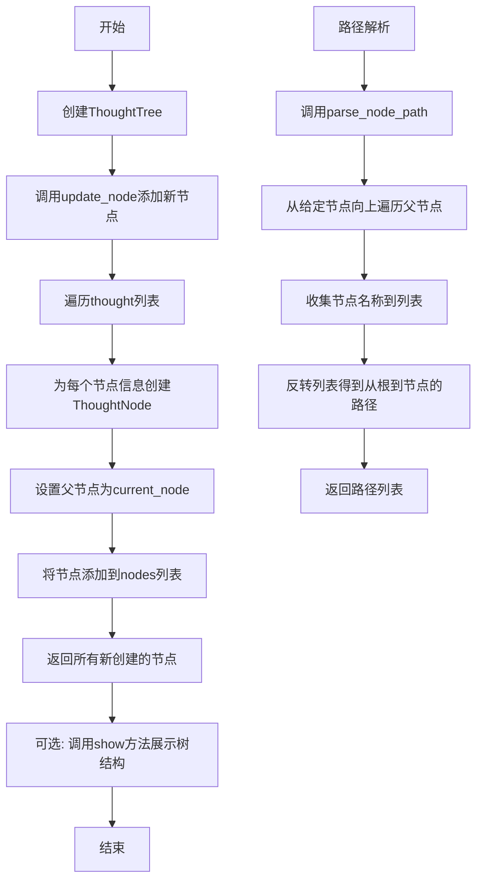

## 类结构

```
BaseModel (Pydantic)
├── BaseParser (抽象类)
├── BaseEvaluator (抽象类)
└── ThoughtNode (具体类)
    
RenderTree (anytree)
└── ThoughtTree (具体类)
```

## 全局变量及字段


### `ThoughtNode.name`
    
表示思维节点的名称或标签，默认为空字符串

类型：`str`
    


### `ThoughtNode.value`
    
表示思维节点的数值评分或权重，默认为0

类型：`int`
    


### `ThoughtNode.id`
    
表示思维节点的唯一标识符，默认为0

类型：`int`
    


### `ThoughtNode.valid_status`
    
表示思维节点的有效性状态，默认为True

类型：`bool`
    
    

## 全局函数及方法

### `BaseParser.__call__`

该方法是一个抽象方法，用于定义`BaseParser`类的可调用接口。它要求所有继承自`BaseParser`的子类必须实现自己的`__call__`方法，否则在调用时会抛出`NotImplementedError`异常。这确保了子类遵循统一的调用约定。

参数：

- `*args`：`tuple`，可变位置参数，用于接收任意数量的位置参数。
- `**kwargs`：`dict`，可变关键字参数，用于接收任意数量的关键字参数。

返回值：`NotImplementedError`，该方法不直接返回值，而是强制子类实现具体的逻辑，否则抛出异常。

#### 流程图

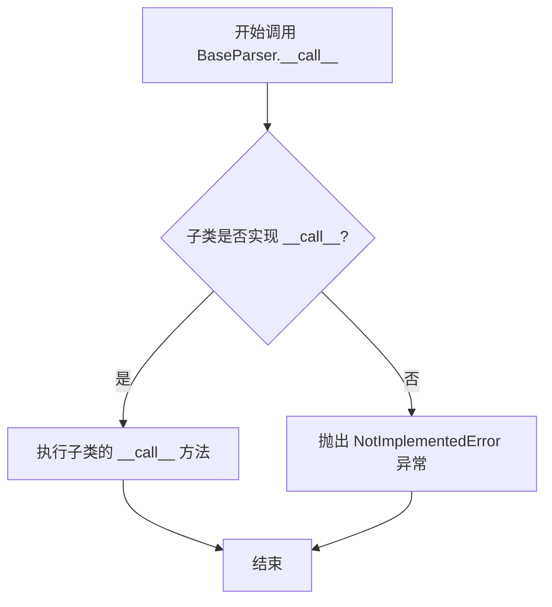

#### 带注释源码

```python
def __call__(self, *args, **kwargs):
    # 这是一个抽象方法，强制子类必须实现自己的 __call__ 方法。
    # 如果子类没有实现，调用此方法将抛出 NotImplementedError 异常。
    raise NotImplementedError
```

### `BaseParser.propose`

该方法是一个抽象方法，用于根据当前状态提出一个新的状态或建议。它定义了`BaseParser`类中所有具体解析器必须实现的接口，用于生成下一步的思考或行动建议。

参数：
- `current_state`：`str`，描述当前的状态或上下文信息。
- `**kwargs`：`dict`，可选的关键字参数，用于传递额外的配置或上下文信息。

返回值：`str`，返回一个字符串，表示基于当前状态和额外参数提出的新状态或建议。

#### 流程图

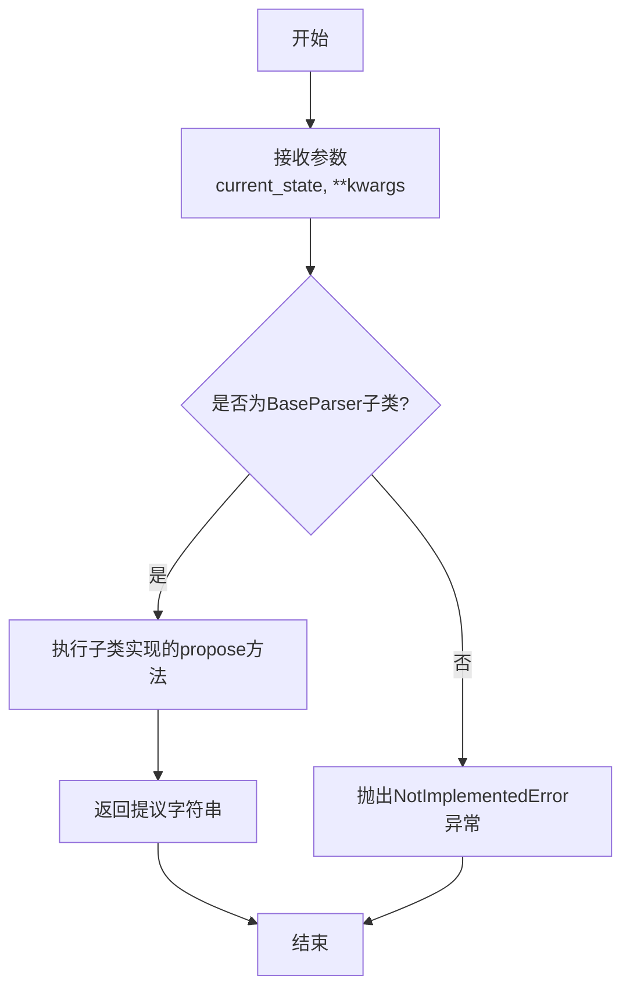

#### 带注释源码

```python
def propose(self, current_state: str, **kwargs) -> str:
    # 这是一个抽象方法，要求所有继承自BaseParser的子类必须实现它。
    # 它的作用是根据给定的当前状态（current_state）和任何额外的关键字参数（kwargs），
    # 生成并返回一个代表下一步行动或思考建议的字符串。
    # 如果子类没有实现此方法而直接调用，将抛出NotImplementedError异常。
    raise NotImplementedError
```

### `BaseParser.sample`

该方法是一个抽象方法，用于根据当前状态生成一个“样本”或示例输出。它定义了接口，要求子类必须实现具体的采样逻辑。

参数：
- `current_state`：`str`，描述当前系统或上下文状态的字符串。
- `**kwargs`：`dict`，可选的关键字参数，用于传递额外的配置或上下文信息。

返回值：`str`，返回一个表示采样结果的字符串。

#### 流程图

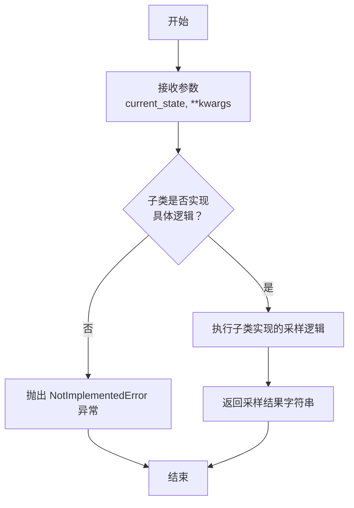

#### 带注释源码

```python
def sample(self, current_state: str, **kwargs) -> str:
    # 这是一个抽象方法，仅定义了接口。
    # 具体的采样逻辑应由 BaseParser 的子类实现。
    # 如果子类没有重写此方法而直接调用，将抛出 NotImplementedError 异常。
    raise NotImplementedError
```

### `BaseParser.value`

该方法是一个抽象方法，用于评估或计算给定输入字符串的“价值”或“分数”。它旨在被子类具体实现，以定义特定领域或上下文中如何从输入中提取或计算一个代表其价值或优先级的字符串。

参数：
- `input`：`str`，需要被评估或计算价值的输入字符串。
- `kwargs`：`dict`，可选的关键字参数，用于传递额外的上下文或配置信息给具体的实现。

返回值：`str`，返回一个表示输入价值的字符串。具体的格式和含义由子类实现定义。

#### 流程图

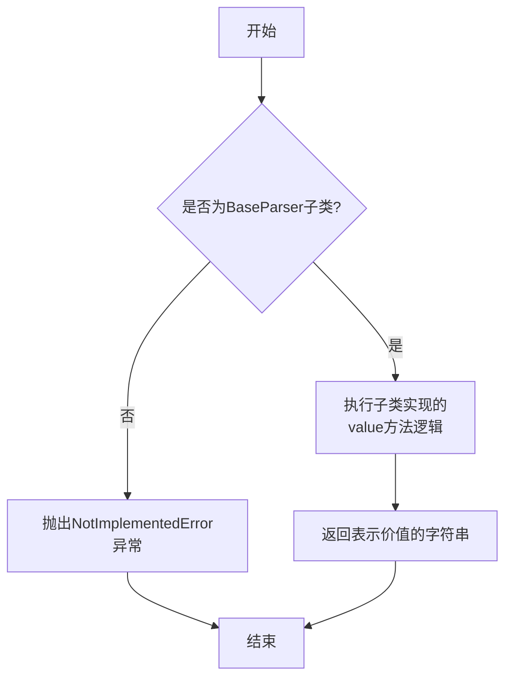

#### 带注释源码

```python
    def value(self, input: str, **kwargs) -> str:
        # 这是一个抽象方法，需要子类提供具体实现。
        # 其设计目的是处理输入的字符串，并返回一个代表其“价值”或“分数”的字符串。
        # 参数 `input` 是待处理的原始字符串。
        # 参数 `kwargs` 允许传递额外的、可选的上下文参数，以支持更灵活的处理逻辑。
        # 返回值应为字符串类型，具体格式（如数字字符串、等级标签等）由实现决定。
        raise NotImplementedError
```


### `BaseEvaluator.__call__`

`BaseEvaluator.__call__` 是 `BaseEvaluator` 抽象基类中定义的一个特殊方法（魔术方法）。它定义了当 `BaseEvaluator` 或其子类的实例被像函数一样调用时（例如 `evaluator_instance()`）应该执行的操作。当前代码中，此方法被声明为抽象方法，仅抛出一个 `NotImplementedError` 异常，强制要求任何继承自 `BaseEvaluator` 的具体子类必须实现自己的 `__call__` 方法逻辑。这定义了一个评估器（Evaluator）的核心调用接口契约。

参数：

-  `*args`：`tuple`，接受任意数量的位置参数。
-  `**kwargs`：`dict`，接受任意数量的关键字参数。

返回值：`NotImplementedError`，此基类方法不返回有效值，而是抛出 `NotImplementedError` 异常。

#### 流程图

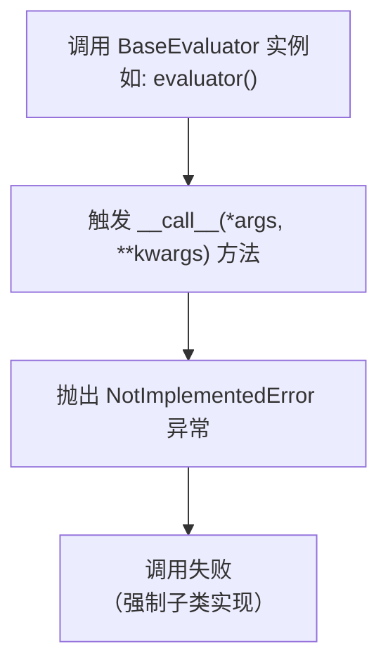

#### 带注释源码

```python
    def __call__(self, *args, **kwargs):
        # 这是一个抽象方法定义。
        # *args: 用于接收任意数量的位置参数。
        # **kwargs: 用于接收任意数量的关键字参数。
        # 方法体直接抛出 NotImplementedError，表明此方法必须在子类中被具体实现。
        # 这确保了所有评估器都遵循统一的调用接口。
        raise NotImplementedError
```


### `BaseEvaluator.status_verify`

`BaseEvaluator.status_verify` 是 `BaseEvaluator` 抽象基类中定义的一个抽象方法。它的设计目的是用于验证某个状态或条件，但具体的实现逻辑需要由继承自 `BaseEvaluator` 的子类来提供。当前代码中，该方法仅抛出一个 `NotImplementedError` 异常，表明它是一个必须被子类重写的方法占位符。

参数：

-  `*args`：`tuple`，可变位置参数，用于接收任意数量的位置参数。
-  `**kwargs`：`dict`，可变关键字参数，用于接收任意数量的关键字参数。

返回值：该方法未指定返回值类型，其具体返回值由子类实现决定。

#### 流程图

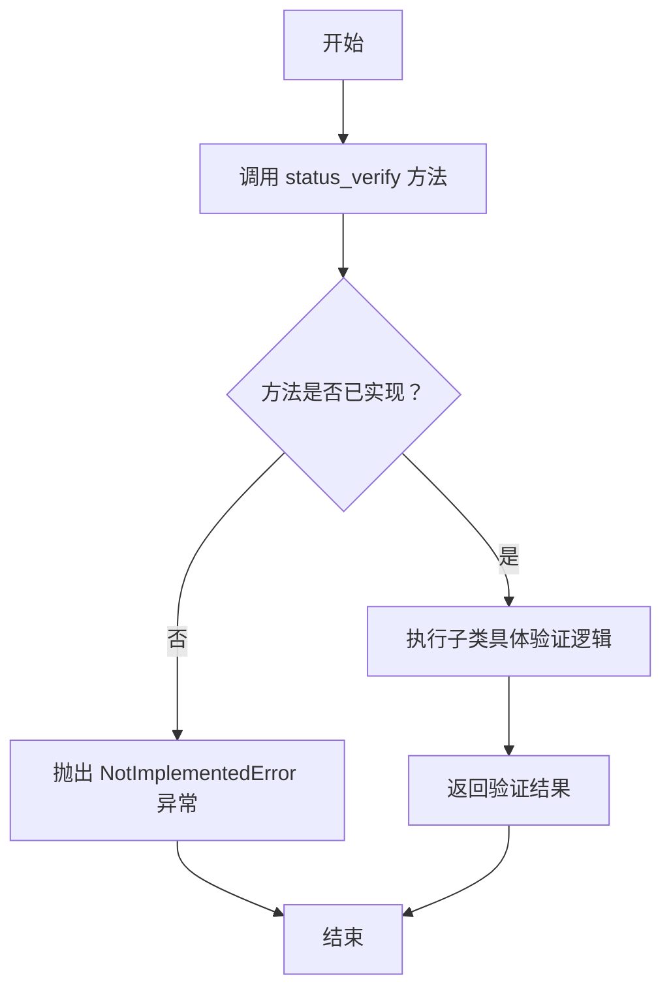

#### 带注释源码

```python
    def status_verify(self, *args, **kwargs):
        # 这是一个抽象方法，用于状态验证。
        # 它接收任意数量的位置参数 (*args) 和关键字参数 (**kwargs)。
        # 由于 BaseEvaluator 是一个抽象基类，此方法没有具体实现，
        # 必须由继承它的子类根据具体需求进行重写。
        # 如果直接调用此方法，将抛出 NotImplementedError 异常。
        raise NotImplementedError
```


### `ThoughtNode.update_value`

该方法用于更新 ThoughtNode 节点的 `value` 字段。

参数：
-  `value`：`int`，要设置的新值。

返回值：`None`，该方法不返回任何值，直接修改对象内部状态。

#### 流程图

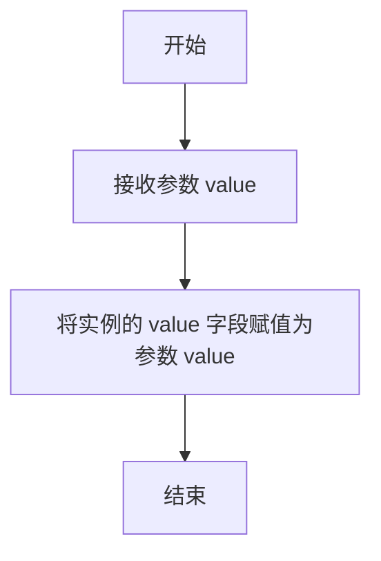

#### 带注释源码

```python
def update_value(self, value) -> None:
    """Update the value of the thought node."""
    # 将传入的 value 参数赋值给当前 ThoughtNode 实例的 `value` 属性
    self.value = value
```


### `ThoughtNode.update_valid_status`

该方法用于更新 ThoughtNode 节点的有效性状态 (`valid_status`)。它接受一个布尔值参数，并将其直接赋值给节点的 `valid_status` 字段，从而标记该节点在树结构中的逻辑有效性。

参数：
-  `status`：`bool`，表示节点新的有效性状态（True 为有效，False 为无效）

返回值：`None`，此方法不返回任何值，仅修改对象内部状态。

#### 流程图

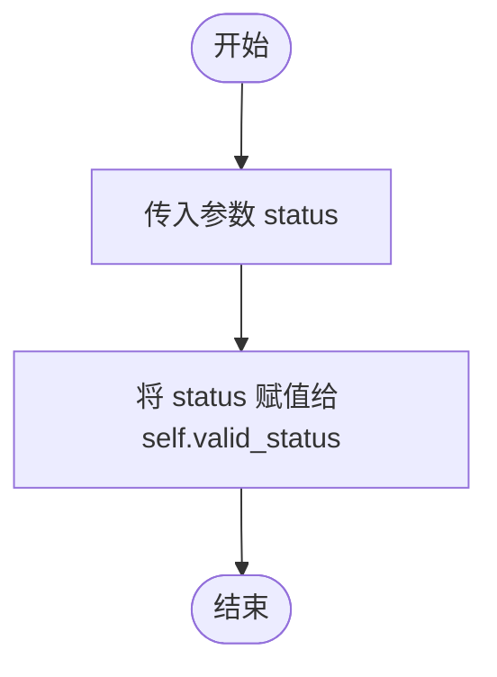

#### 带注释源码

```python
def update_valid_status(self, status) -> None:
    """Update the validity status of the thought node."""
    # 将传入的布尔值 `status` 直接赋值给当前节点实例的 `valid_status` 属性。
    self.valid_status = status
```


### `ThoughtTree.all_nodes`

该方法用于获取思想树中的所有节点，返回一个包含所有节点的列表。

参数：无

返回值：`List[ThoughtNode]`，一个包含思想树中所有节点的列表。

#### 流程图

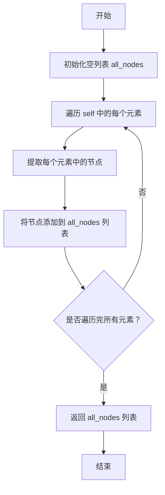

#### 带注释源码

```python
@property
def all_nodes(self) -> List[ThoughtNode]:
    """
    Get a list of all nodes in the thought tree.

    Returns:
        List[ThoughtNode]: A list containing all nodes in the thought tree.
    """
    # 使用列表推导式遍历 self（RenderTree 实例），提取每个元素中的节点
    all_nodes = [node for _, _, node in self]
    # 返回包含所有节点的列表
    return all_nodes
```


### `ThoughtTree.update_node`

该方法用于更新思维树，根据提供的思考信息列表，在当前节点下创建新的子节点。

参数：

-  `thought`：`List[dict]`，一个字典列表，每个字典代表一个思考节点的信息，应包含 `"node_state_instruction"` 和 `"node_id"` 键。
-  `current_node`：`ThoughtNode`，当前节点，新创建的思考节点将作为此节点的子节点。

返回值：`List[ThoughtNode]`，一个包含所有新创建的 `ThoughtNode` 实例的列表。

#### 流程图

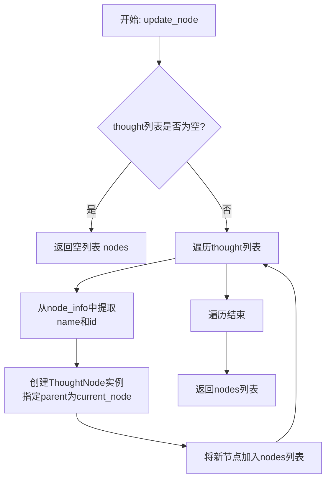

#### 带注释源码

```python
def update_node(self, thought: List[dict] = [], current_node: ThoughtNode = None) -> List[ThoughtNode]:
    """
    使用新的思考信息更新树。

    Args:
        thought (List[dict]): 一个字典列表，代表思考信息。
        current_node (ThoughtNode): 当前节点，新的思考将添加到此节点下。

    Returns:
        List[ThoughtNode]: 代表更新后树节点的 ThoughtNode 实例列表。
    """
    # 初始化一个空列表，用于存储新创建的节点
    nodes = []
    # 遍历传入的思考信息列表
    for node_info in thought:
        # 使用思考信息中的 `node_state_instruction` 作为节点名称，
        # `node_id` 作为节点ID，并将 `current_node` 指定为父节点，创建一个新的 ThoughtNode 实例。
        node = ThoughtNode(
            name=node_info["node_state_instruction"], parent=current_node, id=int(node_info["node_id"])
        )
        # 将新创建的节点添加到 nodes 列表中
        nodes.append(node)
    # 返回包含所有新创建节点的列表
    return nodes
```


### `ThoughtTree.parse_node_path`

该方法用于解析并获取给定思维节点的完整层级路径。它通过遍历节点的父节点链，从根节点开始，直到给定的节点，构建一个表示完整路径的列表。

参数：

- `node`：`ThoughtNode`，需要解析层级路径的思维节点。

返回值：`List[str]`，一个字符串列表，表示从根节点到给定节点的完整层级路径，列表顺序为从根节点到目标节点。

#### 流程图

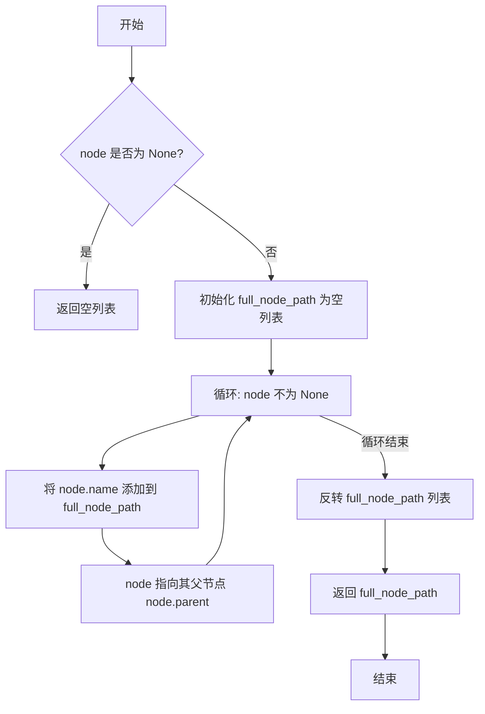

#### 带注释源码

```python
def parse_node_path(self, node) -> List[str]:
    """
    解析并获取给定思维节点的完整层级路径。

    该方法遍历给定“node”的父节点，并构建从根节点到给定节点的完整路径。

    参数：
        node: 需要解析层级路径的思维节点。

    返回值：
        List[str]: 一个列表，表示给定思维节点的完整层级路径。
                   列表顺序为从根节点到给定节点。
    """
    # 初始化一个空列表，用于存储路径上的节点名称
    full_node_path = []
    # 循环遍历，直到当前节点为 None（即到达根节点之上）
    while node is not None:
        # 将当前节点的名称添加到路径列表中
        full_node_path.append(node.name)
        # 将当前节点更新为其父节点，以便向上遍历
        node = node.parent
    # 由于遍历是从给定节点向上到根节点，得到的列表是逆序的，因此需要反转列表
    full_node_path.reverse()
    # 返回从根节点到给定节点的正确顺序的路径列表
    return full_node_path
```

### `ThoughtTree.show`

该方法用于以文本形式打印展示整个思维树的结构和节点信息。它会遍历树中的所有节点，并以缩进格式显示每个节点的名称、值和有效性状态，从而直观地呈现树的层次结构。

参数：无

返回值：`None`，此方法不返回任何值，仅执行打印操作。

#### 流程图

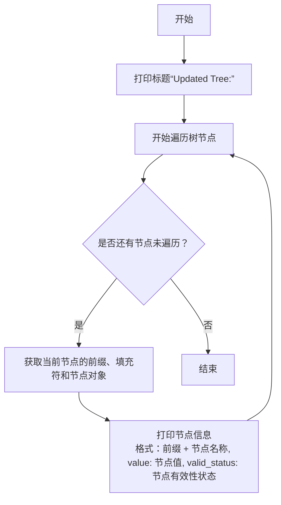

#### 带注释源码

```python
def show(self) -> None:
    """Print the updated tree."""
    # 打印一个标题行，表示接下来展示的是更新后的树结构
    print("\nUpdated Tree:")
    # 遍历由RenderTree基类提供的树结构迭代器
    # 每次迭代返回一个三元组 (pre, fill, node)
    #   - pre: 当前节点的前缀字符串，用于表示层次结构（如缩进和连接线）
    #   - fill: 填充字符（在此方法中未使用）
    #   - node: 当前遍历到的ThoughtNode节点对象
    for pre, _, node in self:
        # 格式化打印当前节点的信息
        # 输出格式为：前缀 + 节点名称, value: 节点的value字段值, valid_status: 节点的valid_status字段值
        print(f"{pre}{node.name}, value: {node.value}, valid_status: {node.valid_status}")
```

## 关键组件


### BaseParser

一个抽象基类，定义了用于生成、评估和采样文本（或“思考”）的解析器接口，是构建更具体解析策略的基础。

### BaseEvaluator

一个抽象基类，定义了用于评估状态或结果的基础评估器接口，核心功能是状态验证。

### ThoughtNode

继承自`anytree.Node`的节点类，用于在思维树中表示一个具体的思考节点，包含名称、价值、ID和有效性状态等属性，并提供了更新这些属性的方法。

### ThoughtTree

继承自`anytree.RenderTree`的树结构类，专门用于管理和操作由`ThoughtNode`组成的思维树，提供了获取所有节点、更新树结构、解析节点路径和可视化展示树的方法。


## 问题及建议


### 已知问题

-   **抽象基类实现不完整**：`BaseParser` 和 `BaseEvaluator` 继承自 `ABC` 并定义了抽象方法（如 `__call__`, `propose`, `sample`, `value`, `status_verify`），但未使用 `@abstractmethod` 装饰器。这导致这些类可以被实例化，而不会强制子类实现这些方法，违背了抽象基类的设计初衷，可能引发运行时 `NotImplementedError` 异常。
-   **类型注解不精确**：`BaseParser.value` 方法的参数名为 `input`，与 Python 内置函数 `input` 同名，可能引起混淆。此外，多个方法（如 `BaseParser.propose`, `BaseParser.sample`, `BaseEvaluator.status_verify`）的返回类型注解为 `str`，但实际实现中抛出了 `NotImplementedError`，这可能导致类型检查工具误报或开发者误解。
-   **`ThoughtTree.update_node` 方法参数默认值可变**：`thought` 参数的默认值为空列表 `[]`。在 Python 中，默认参数值在函数定义时被创建并绑定，后续所有调用如果使用默认值，将共享同一个列表对象，可能导致意外的数据污染。
-   **`ThoughtTree` 继承自 `RenderTree` 可能不恰当**：`RenderTree` 是 `anytree` 库中用于渲染和展示树结构的工具类，而非数据容器。`ThoughtTree` 继承它可能只是为了使用其迭代功能（`__iter__`），这属于实现继承而非接口继承，限制了 `ThoughtTree` 的设计，并可能引入不必要的依赖和复杂度。
-   **`ThoughtTree.all_nodes` 属性性能问题**：该属性每次被访问时都会通过列表推导式重新计算所有节点。对于大型树或频繁访问的场景，这会带来不必要的性能开销。
-   **缺乏输入验证**：`ThoughtTree.update_node` 方法接受 `List[dict]` 作为输入，但未验证字典中是否包含必需的键（如 `"node_state_instruction"`, `"node_id"`），可能导致运行时 `KeyError`。
-   **`ThoughtNode.id` 类型与赋值不一致**：`ThoughtNode` 的 `id` 字段类型注解为 `int`，但在 `ThoughtTree.update_node` 中，使用 `int(node_info["node_id"])` 进行赋值。如果 `node_info["node_id"]` 不是可转换为整数的字符串，将引发 `ValueError`。同时，`id` 是 Python 内置函数名，虽然作为实例属性可以覆盖，但可能引起混淆。

### 优化建议

-   **使用 `@abstractmethod` 装饰器**：在 `BaseParser` 和 `BaseEvaluator` 的抽象方法上添加 `from abc import abstractmethod` 并使用 `@abstractmethod` 装饰器，确保它们成为真正的抽象基类，无法被直接实例化，并强制子类实现。
-   **修正类型注解并避免内置函数名**：将 `BaseParser.value` 的参数名改为更具描述性的名称（如 `input_text`）。考虑为抽象方法使用更通用的返回类型（如 `Any`）或明确的 `NoReturn`/`None`（如果只是抛出异常）。为 `ThoughtNode.id` 字段重命名（如 `node_id`）以避免与内置函数冲突。
-   **将可变默认参数改为 `None`**：修改 `ThoughtTree.update_node` 方法，将 `thought` 参数的默认值设为 `None`，并在函数体内进行判断：`if thought is None: thought = []`。
-   **重构 `ThoughtTree` 的继承关系**：考虑让 `ThoughtTree` 包含一个 `RenderTree` 实例作为成员变量（组合），或者直接管理一个根 `ThoughtNode`，并提供自己的迭代器或 `all_nodes` 缓存。这样可以解耦数据结构和渲染逻辑，提高灵活性。
-   **缓存 `all_nodes` 结果**：将 `all_nodes` 改为一个缓存属性。首次计算后存储结果，并在树结构发生变更（如 `update_node`）时使缓存失效并重新计算。可以使用 `@property` 配合一个私有字段来实现。
-   **添加输入验证**：在 `ThoughtTree.update_node` 方法开始时，检查 `thought` 列表中的每个字典是否包含必要的键，可以使用 `dict.get()` 提供默认值或抛出更清晰的异常（如 `ValueError`）。
-   **增强 `ThoughtNode` 的健壮性**：在 `ThoughtTree.update_node` 中，对 `node_info["node_id"]` 的转换添加异常处理（`try-except`），并提供有意义的错误信息。确保 `id` 字段的赋值安全。
-   **考虑使用 `__slots__`**：如果 `ThoughtNode` 的实例数量非常多，可以考虑定义 `__slots__` 来减少内存占用并提高属性访问速度。
-   **改进 `show` 方法**：`ThoughtTree.show` 方法直接打印到标准输出，限制了其复用性。可以考虑将其改为返回字符串，或者接受一个文件流参数，以支持更灵活的日志记录或输出重定向。


## 其它


### 设计目标与约束

1.  **设计目标**:
    *   提供一个可扩展的框架，用于构建和管理基于树状结构的思维过程。
    *   通过抽象基类 `BaseParser` 和 `BaseEvaluator` 定义核心操作接口（提议、采样、评估、状态验证），支持不同策略的实现。
    *   利用 `ThoughtNode` 和 `ThoughtTree` 类来具体化思维节点和树，并支持节点的值、状态更新以及树结构的可视化和遍历。
    *   确保代码结构清晰，便于集成到更大的决策或规划系统中。

2.  **设计约束**:
    *   继承关系：`BaseParser` 和 `BaseEvaluator` 必须继承自 `pydantic.BaseModel` 和 `abc.ABC`，以确保数据验证和接口抽象。
    *   树结构依赖：`ThoughtTree` 继承自 `anytree.RenderTree`，依赖于 `anytree` 库提供的树形结构渲染和遍历功能。
    *   节点数据模型：`ThoughtNode` 继承自 `anytree.Node` 并扩展了 `pydantic.BaseModel`，要求其字段（`name`, `value`, `id`, `valid_status`）符合 Pydantic 的数据验证规则。
    *   接口契约：所有 `BaseParser` 和 `BaseEvaluator` 的子类必须实现 `__call__` 方法以及各自定义的抽象方法（如 `propose`, `sample`, `value`, `status_verify`）。

### 错误处理与异常设计

1.  **异常类型**:
    *   `NotImplementedError`: 由抽象基类 `BaseParser` 和 `BaseEvaluator` 的占位方法（`__call__`, `propose`, `sample`, `value`, `status_verify`）抛出，强制子类实现这些核心功能。这是框架约定的主要错误机制。
    *   `ValidationError` (由Pydantic隐式抛出): 在创建 `ThoughtNode` 实例或 `BaseParser`/`BaseEvaluator` 的子类实例时，如果提供的字段数据不符合类型注解或约束，Pydantic 会抛出此错误。
    *   `AttributeError` 或 `KeyError`: 可能在 `ThoughtTree.update_node` 方法中，如果传入的 `thought` 列表中的字典缺少预期的键（如 `"node_state_instruction"`, `"node_id"`），或者在访问节点属性时发生。

2.  **错误处理策略**:
    *   **未实现方法**: 通过抛出 `NotImplementedError` 明确告知开发者需要实现特定接口。这是设计上的主动约束。
    *   **数据验证**: 依赖 Pydantic 在模型实例化时进行静态类型和数据的验证，确保输入数据的结构正确性。
    *   **输入检查**: `ThoughtTree.update_node` 方法内部缺乏对输入 `thought` 字典结构的显式检查。建议增加防御性代码，例如使用 `.get()` 方法并提供默认值，或者在方法开始处验证字典结构，并抛出更清晰的 `ValueError`。
    *   **空值/边界处理**: `ThoughtTree.parse_node_path` 方法能处理 `node` 为 `None` 的情况（返回空列表）。`ThoughtTree.all_nodes` 属性使用列表推导式，能安全处理空树。

### 数据流与状态机

1.  **核心数据流**:
    *   **思维节点创建与更新**:
        *   **输入**: `ThoughtTree.update_node` 接收一个包含思维信息字典的列表 (`thought`) 和一个父节点 (`current_node`)。
        *   **处理**: 遍历列表，为每个字典创建一个 `ThoughtNode` 实例，并将其父节点设置为 `current_node`。
        *   **输出**: 返回新创建的 `ThoughtNode` 列表，这些节点已自动添加到树结构中。
    *   **节点状态与值更新**:
        *   **输入**: 通过 `ThoughtNode.update_value` 和 `ThoughtNode.update_valid_status` 方法接收新的 `value` 或 `status`。
        *   **处理**: 直接修改节点实例的 `value` 或 `valid_status` 属性。
        *   **输出**: 节点内部状态被更新。`ThoughtTree.show` 方法可以反映这些更新。
    *   **路径解析**:
        *   **输入**: `ThoughtTree.parse_node_path` 接收一个 `ThoughtNode` 实例。
        *   **处理**: 从该节点开始，递归遍历其父节点，直到根节点。
        *   **输出**: 返回一个字符串列表，表示从根节点到目标节点的路径。

2.  **状态机（思维节点）**:
    *   **状态**: 每个 `ThoughtNode` 有两个主要状态属性：
        *   `value` (int): 表示节点的评估值或权重。可通过 `update_value` 改变。
        *   `valid_status` (bool): 表示节点的有效性状态（有效/无效）。可通过 `update_valid_status` 改变。
    *   **状态转移**: 状态转移是直接的赋值操作，没有定义复杂的转移规则。外部逻辑（如 `BaseEvaluator` 的实现）负责驱动这些状态的改变。
    *   **树形状态聚合**: 整个 `ThoughtTree` 的状态是所有节点状态的集合。`ThoughtTree.show` 提供了整个树当前状态的快照。

### 外部依赖与接口契约

1.  **外部库依赖**:
    *   `anytree`: 用于构建、管理和渲染树形数据结构。`ThoughtNode` 继承自 `anytree.Node`，`ThoughtTree` 继承自 `anytree.RenderTree`。核心功能包括父子关系管理、树遍历和可视化。
    *   `pydantic`: 用于数据验证和设置管理。`BaseParser`、`BaseEvaluator` 和 `ThoughtNode` 都继承自 `pydantic.BaseModel`，确保了类字段的类型安全，并提供了便捷的序列化/反序列化能力。
    *   `typing`: 用于类型注解，提高代码可读性和 IDE 支持。

2.  **接口契约**:
    *   `BaseParser` **契约**:
        *   `__call__(*args, **kwargs)`: 必须实现，作为主要调用入口。
        *   `propose(current_state: str, **kwargs) -> str`: 必须实现，根据当前状态提出新的思维方向或选项。
        *   `sample(current_state: str, **kwargs) -> str`: 必须实现，从可能的选择中进行采样。
        *   `value(input: str, **kwargs) -> str`: 必须实现，评估某个输入或状态的价值。
    *   `BaseEvaluator` **契约**:
        *   `__call__(*args, **kwargs)`: 必须实现，作为主要调用入口。
        *   `status_verify(*args, **kwargs)`: 必须实现，验证某个状态或节点的有效性。
    *   `ThoughtTree` **契约**:
        *   `all_nodes` (property): 返回树中所有节点的列表。
        *   `update_node(thought: List[dict], current_node: ThoughtNode) -> List[ThoughtNode]`: 在指定节点下添加子节点，并返回新节点列表。
        *   `parse_node_path(node: ThoughtNode) -> List[str]`: 返回从根节点到指定节点的路径名称列表。
        *   `show() -> None`: 以文本形式打印树的结构和节点状态。
    *   `ThoughtNode` **契约**:
        *   作为 `anytree.Node` 和 `pydantic.BaseModel` 的子类，必须提供 `name`, `value`, `id`, `valid_status` 字段。
        *   `update_value(value: int) -> None`: 更新节点的 `value`。
        *   `update_valid_status(status: bool) -> None`: 更新节点的 `valid_status`。


    